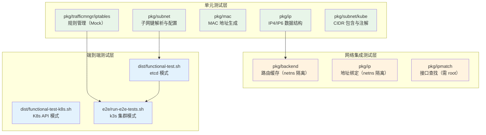
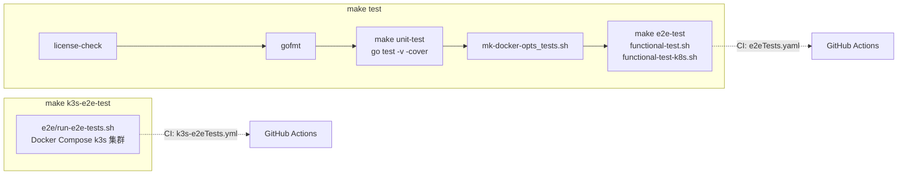

Flannel 项目的测试体系采用分层策略：**纯函数级单元测试**验证核心数据结构与解析逻辑，**网络命名空间级集成测试**覆盖路由与地址管理，**基于 Docker 的端到端测试**在全栈环境中验证跨节点连通性与流量规则正确性。三者通过 Makefile 目标串联，由 GitHub Actions CI 在每次 Pull Request 时自动执行。

Sources: [Makefile](Makefile#L94-L123), [.github/workflows/e2eTests.yaml](.github/workflows/e2eTests.yaml#L1-L35)

## 测试体系总览

Flannel 的测试基础设施围绕三个层次构建，每一层解决不同的验证需求：



**单元测试层**（绿色）验证纯计算逻辑，无外部依赖，通过标准 `go test` 运行。**网络集成测试层**（橙色）依赖 Linux 网络命名空间隔离，需要 `NET_ADMIN` 和 `SYS_ADMIN` 能力。**端到端测试层**（蓝色）使用 bash_unit 框架驱动完整的 Docker 容器集群，验证真实的跨节点网络通信。

Sources: [Makefile](Makefile#L49-L52), [Makefile](Makefile#L104-L117)

## 单元测试：纯函数与数据结构验证

### 测试覆盖范围与分布

Flannel 的 Go 单元测试分布在 16 个测试文件中，涵盖约 39 个测试函数。按包分组，它们覆盖了以下核心模块：

| 包路径 | 测试文件 | 测试数量 | 测试焦点 |
|--------|---------|---------|---------|
| `pkg/ip` | `ipnet_test.go` | 2 | IP4/IP4Net 解析、序列化、重叠检测、私有地址判断 |
| `pkg/ip` | `ip6net_test.go` | 2 | IP6/IP6Net 解析、序列化、重叠与包含检测 |
| `pkg/ip` | `iface_test.go` | 2 | V4/V6 地址绑定到网络链路（需 netns） |
| `pkg/subnet` | `subnet_test.go` | 3 | 子网键解析（纯 IPv4、双栈、无效输入） |
| `pkg/subnet` | `config_test.go` | 4 | JSON 配置解析（IPv4/IPv6 默认值与覆盖） |
| `pkg/subnet/etcd` | `subnet_test.go` | 6 | 租约获取、配置变更、事件监听完整流程 |
| `pkg/subnet/etcd` | `registry_test.go` | 1 | etcd 注册表 CRUD 与 watch 机制 |
| `pkg/subnet/kube` | `kube_test.go` | 1 | CIDR 包含关系判定 |
| `pkg/subnet/kube` | `annotations_test.go` | 1 | 注解前缀格式验证（FQDN 校验） |
| `pkg/trafficmngr/iptables` | `iptables_test.go` | 6 | 规则增删、幂等性、IPv6 规则 |
| `pkg/trafficmngr/iptables` | `iptables_restore_test.go` | 1 | iptables-restore 载荷格式化 |
| `pkg/backend` | `route_network_test.go` | 2 | V4/V6 路由缓存与网关切换 |
| `pkg/mac` | `mac_test.go` | 1 | 随机 MAC 地址生成无错误 |
| `pkg/ipmatch` | `match_test.go` | 1（6 子测试） | 多策略接口查找 |

Sources: [pkg/ip/ipnet_test.go](pkg/ip/ipnet_test.go#L39-L149), [pkg/subnet/subnet_test.go](pkg/subnet/subnet_test.go#L22-L103), [pkg/trafficmngr/iptables/iptables_test.go](pkg/trafficmngr/iptables/iptables_test.go#L120-L381)

### 测试风格：标准库 testing + 手工断言

Flannel 的单元测试统一采用 Go 标准库 `testing` 包，不使用第三方断言库。测试函数遵循 `func TestXxx(t *testing.T)` 命名约定，通过 `t.Errorf`/`t.Fatalf` 报告失败。这种设计使项目保持了极简的测试依赖——唯一的间接测试依赖是 `github.com/stretchr/testify`（在 go.mod 中标记为 `// indirect`）。

以下是一个典型的子网键解析测试，展示了"正向验证 + 反向异常"的测试模式：

```go
// 正向用例：解析纯 IPv4 子网键
func TestSubnetNodev4(t *testing.T) {
    key := "10.12.13.0-24"
    sn, sn6 := ParseSubnetKey(key)
    if sn == nil {
        t.Errorf("Failed to parse ipv4 address")
        return
    }
    if sn.ToIPNet().String() != "10.12.13.0/24" {
        t.Errorf("Unexpected ipv4 network")
    }
    if sn6 != nil {
        t.Errorf("Not expecting ipv6 address")
    }
}

// 反向用例：批量验证无效输入
func TestSubnetNodeInvalid(t *testing.T) {
    keys := []string{"10", "10.12.13.0", "10.12.13-24", ...}
    for _, key := range keys {
        sn, sn6 := ParseSubnetKey(key)
        if sn != nil || sn6 != nil {
            t.Errorf("Unexpectedly parsed %v", key)
        }
    }
}
```

这种"构造输入 → 调用函数 → 检查输出"的三段式结构贯穿整个单元测试体系。值得注意的是 `TestSubnetNodeInvalid` 使用表驱动测试（table-driven test）批量覆盖 11 种边界情况，这是项目中少数使用该模式的地方。

Sources: [pkg/subnet/subnet_test.go](pkg/subnet/subnet_test.go#L22-L103)

### Mock 模式：iptables 规则管理测试

在流量管理模块的测试中，Flannel 自行实现了轻量级 Mock 对象，而非依赖通用 Mock 框架。`MockIPTables` 和 `MockIPTablesRestore` 分别模拟了 iptables 和 iptables-restore 的行为：

`MockIPTables` 在内存中维护规则列表，实现了 `ChainExists`、`ClearChain`、`Delete`、`Exists`、`AppendUnique` 等方法，使测试能够在无特权环境下验证规则的增删逻辑。`MockIPTablesRestore` 则捕获 `ApplyFully` 和 `ApplyWithoutFlush` 的调用参数，用于事后断言恢复操作的规则内容是否正确。

这种 Mock 设计的核心特征是**最小化接口覆盖**——只实现被测代码路径中实际调用的方法，而非完整模拟 iptables 的所有行为。例如，`MockIPTables.Delete` 支持通过 `failures` map 注入错误，用于测试异常路径，这是项目中罕见的错误注入模式。

Sources: [pkg/trafficmngr/iptables/iptables_test.go](pkg/trafficmngr/iptables/iptables_test.go#L40-L118)

### etcd 集成测试：使用真实集群

etcd 子网管理器的测试不走 Mock 路线，而是使用 `go.etcd.io/etcd/tests/v3/framework/integration` 包在进程内启动真实的 etcd 集群。`TestEtcdRegistry` 函数通过 `integration.NewCluster(t, &integration.ClusterConfig{Size: 1})` 创建单节点集群，然后执行完整的配置写入 → 子网创建 → 租约获取 → watch 事件 → 子网删除流程。

这种方式保证了测试与生产环境使用完全相同的 etcd API 交互路径，代价是测试运行更慢、需要更多资源。`TestWatchLeaseAdded`、`TestWatchLeaseRemoved` 和 `TestCompleteLease` 三个测试构成了租约生命周期的事件监听验证链，确保子网的添加、过期和手动删除都能通过 watch 机制正确传播。

Sources: [pkg/subnet/etcd/registry_test.go](pkg/subnet/etcd/registry_test.go#L100-L218), [pkg/subnet/etcd/subnet_test.go](pkg/subnet/etcd/subnet_test.go#L190-L392)

## 网络集成测试：命名空间隔离下的链路操作

### netns 测试辅助工具

`pkg/ns/ns.go` 提供了一个关键的网络隔离测试工具 `SetUpNetlinkTest`。该函数通过 `runtime.LockOSThread()` 锁定当前 goroutine 到 OS 线程，然后使用 `netns.New()` 创建一个新的 Linux 网络命名空间。由于网络命名空间是线程局部属性，线程锁定是确保测试隔离的必要条件。

```go
func SetUpNetlinkTest(t *testing.T) func() {
    runtime.LockOSThread()
    ns, err := netns.New()
    if err != nil {
        t.Fatalf("Failed to create newns: %v", err)
    }
    return func() {
        ns.Close()
        runtime.UnlockOSThread()
    }
}
```

每个使用该工具的测试函数都遵循 `teardown := ns.SetUpNetlinkTest(t); defer teardown()` 模式，保证测试结束后恢复原始网络命名空间。所有依赖此工具的测试文件都带有 `//go:build !windows` 构建标签，因为 Windows 不支持此隔离机制。

Sources: [pkg/ns/ns.go](pkg/ns/ns.go#L27-L44)

### 路由缓存测试

`TestRouteCache` 和 `TestV6RouteCache` 在隔离的网络命名空间中验证 `RouteNetwork` 的路由管理行为。测试通过构造 `lease.Event` 事件序列，模拟子网添加和网关变更场景，然后断言路由表状态。这种测试设计的关键在于 `GetRoute` 和 `GetV6Route` 字段被替换为闭包函数，使测试能够控制路由生成逻辑而不依赖实际的后端实现。

IPv6 测试比 IPv4 更进一步——它创建了一个 `Bridge` 类型的虚拟网络设备而非使用 loopback 接口，因为 IPv6 路由需要真正的二层设备来承载邻居发现协议。

Sources: [pkg/backend/route_network_test.go](pkg/backend/route_network_test.go#L29-L147)

## 端到端测试：三层架构的完整验证

Flannel 的端到端测试采用 **bash_unit** 作为测试框架（版本 v2.3.0），通过 Makefile 目标串联三个独立但互补的测试套件：



Sources: [Makefile](Makefile#L94-L123), [Makefile](Makefile#L158-L160)

### etcd 模式：dist/functional-test.sh

这是最早的 E2E 测试套件，使用 Docker 容器启动独立的 etcd 实例和两个 Flannel 实例，验证基于 etcd 子网管理器的网络通信。测试流程如下：

1. `setup_suite()` 启动带有 TLS 认证的 etcd 容器
2. `setup()` 为每个测试用例启动两个 Flannel 容器，通过 `--etcd-*` 参数连接 etcd
3. `write_config_etcd()` 将后端配置写入 etcd
4. `create_ping_dest()` 在每个容器中创建 dummy 接口作为可 ping 目标
5. `pings()` 执行双向 ping 测试
6. `teardown()` 清理容器并删除 etcd 中的网络配置

该套件覆盖 7 种后端（vxlan、udp、host-gw、ipip、ipsec、wireguard）的 ping 连通性测试，以及 ipsec 和其他后端的 iperf3 性能测试。`test_multi` 测试用例特别验证了同一主机上同时运行 vxlan 和 host-gw 两个 Flannel 实例的场景，确保多后端路由互不干扰。

Sources: [dist/functional-test.sh](dist/functional-test.sh#L24-L225)

### Kubernetes API 模式：dist/functional-test-k8s.sh

此套件在 etcd 模式基础上增加了 Kubernetes API Server，验证基于 Kubernetes 子网管理器的完整工作流。`setup_suite()` 负责生成完整的 PKI 证书链（CA → API Server 证书 → admin 证书 → Service Account 密钥），启动 kube-apiserver，并创建两个带有 `podCIDR` 的 Node 资源。

与 etcd 模式的关键区别在于 Flannel 容器通过 `--kube-subnet-mgr` 和 `--kubeconfig-file` 参数连接 Kubernetes API，而非 etcd。`test_public-ip-overwrite` 测试用例验证了 `flannel.alpha.coreos.com/public-ip-overwrite` 注解能否正确覆盖节点的公网 IP。`test_manifest` 则简单验证 `kube-flannel.yml` 清单能否被 API Server 接受，但**不验证其运行时行为**。

Sources: [dist/functional-test-k8s.sh](dist/functional-test-k8s.sh#L25-L263)

### k3s 集群模式：e2e/run-e2e-tests.sh

这是最接近真实部署环境的测试套件，使用 Docker Compose 构建一个完整的双节点 k3s 集群：

```yaml
services:
  leader:
    command: server --disable=traefik,metrics-server --flannel-backend=none --disable-network-policy
    # k3s 服务端，禁用内置 Flannel
  worker:
    command: agent --server https://local-leader:6443
    # 工作节点，连接 leader
```

`--flannel-backend=none` 参数确保 k3s 不使用其内置的 Flannel，而是等待测试套件通过 `kubectl apply -f ./kube-flannel.yml` 安装待测版本的 Flannel。Dockerfile 基于 SUSE SLE15 镜像，预装了 k3s 二进制、CNI 插件，以及 iptables/nftables 工具链。

该套件的独特价值在于 **iptables/nftables 规则验证**——`check_iptables()` 和 `check_nftables()` 函数在两个节点上分别读取内核规则表，与预定义的规则模板进行逐行比对，确保 MASQUERADE、FORWARD 和自定义链的每一条规则都符合预期。

Sources: [e2e/docker-compose.yml](e2e/docker-compose.yml#L1-L39), [e2e/Dockerfile](e2e/Dockerfile#L1-L59), [e2e/run-e2e-tests.sh](e2e/run-e2e-tests.sh#L258-L388)

## E2E 测试覆盖的后端与验证项

### 后端覆盖矩阵

| 后端 | etcd ping | K8s API ping | k3s ping | k3s iptables | k3s nftables | 性能测试 |
|------|-----------|-------------|----------|-------------|-------------|---------|
| **vxlan** | ✅ | — | ✅ | ✅ | ✅ | ✅ |
| **host-gw** | ✅ | — | ✅ | ✅ | — | ✅ |
| **wireguard** | ✅ | — | ✅ | ✅ | — | ✅ |
| **ipip** | ✅ | — | ✅ | ✅ | — | ✅ |
| **udp** | ✅ (amd64) | — | ✅ (amd64) | ✅ | — | ✅ (amd64) |
| **ipsec** | ✅ | — | — | — | — | ✅ |

UDP 和 IPsec 后端仅支持 amd64 架构，这是因为在 Makefile 中 `CGO_ENABLED=1` 仅对 amd64 启用（UDP 后端依赖 CGO）。

Sources: [Makefile](Makefile#L33-L38), [e2e/run-e2e-tests.sh](e2e/run-e2e-tests.sh#L180-L249), [dist/functional-test.sh](dist/functional-test.sh#L104-L160)

### iptables 规则验证详解

k3s E2E 测试中的 `check_iptables()` 函数在每个节点上执行 `iptables -t nat -S` 和 `iptables -t filter -S`，获取 POSTROUTING 链和 FORWARD 链的完整规则列表，然后与硬编码的预期规则进行字符串比对。预期规则覆盖了 Flannel 的核心流量管理逻辑：

- **FLANNEL-POSTRTG 链**（NAT 表）：标记包跳过、源子网与目的子网匹配时 RETURN、非 Pod 流量 MASQUERADE
- **FLANNEL-FWD 链**（Filter 表）：Pod 网段双向 ACCEPT

`check_iptables_removed()` 函数验证 Flannel 卸载后这些规则是否被正确清理，确保优雅关闭流程的完整性。

Sources: [e2e/run-e2e-tests.sh](e2e/run-e2e-tests.sh#L258-L335)

## 辅助测试：Shell 脚本与 Helm Chart

### Docker 选项生成脚本测试

`dist/mk-docker-opts_tests.sh` 通过构造预期输出文件并与实际生成文件做 `diff` 比对，验证 `mk-docker-opts.sh` 的各种命令行参数组合：默认模式（同时生成 DOCKER_OPT_* 和 DOCKER_OPTS）、仅独立变量（`-i`）、仅合并变量（`-c`）、自定义键名（`-k`）以及剥离 ip-masq 选项（`-m`）。

Sources: [dist/mk-docker-opts_tests.sh](dist/mk-docker-opts_tests.sh#L1-L62)

### Helm Chart 测试

`chart/kube-flannel/tests/daemonset_test.yaml` 使用 Helm Chart 测试框架（helm-test）验证 DaemonSet 模板的渲染正确性，覆盖 8 个测试场景：API 版本验证、镜像配置、CNI 镜像配置、命令行参数、imagePullSecrets、install-cni InitContainer 的条件渲染以及 nodeSelector 设置。

Sources: [chart/kube-flannel/tests/daemonset_test.yaml](chart/kube-flannel/tests/daemonset_test.yaml#L1-L85)

## 运行测试：Makefile 目标与 CI 集成

### 本地运行命令

| 命令 | 作用 | 运行环境 |
|------|------|---------|
| `make test` | 完整测试套件（许可检查 → 格式检查 → 单元测试 → E2E） | 本地 Docker |
| `make unit-test` | 仅 Go 单元测试，`go test -v -cover -timeout 5m` | Docker 容器（NET_ADMIN + SYS_ADMIN） |
| `make e2e-test` | etcd 模式 + K8s API 模式功能测试 | 本地 Docker + bash_unit |
| `make k3s-e2e-test` | k3s 集群模式 E2E 测试 | 本地 Docker Compose + bash_unit |
| `make cover` | 单包覆盖率报告，生成 HTML | 本地 Go 环境 |

单元测试的 `TEST_PACKAGES` 变量默认包含 `pkg/ip pkg/subnet pkg/subnet/etcd pkg/subnet/kube pkg/trafficmngr pkg/backend`，可通过环境变量覆盖以聚焦特定模块。

Sources: [Makefile](Makefile#L49-L52), [Makefile](Makefile#L104-L128)

### CI 工作流

Flannel 使用两个独立的 GitHub Actions 工作流执行测试：

**`e2eTests.yaml`** 在每次 Pull Request 时触发，运行 `make test`（包含单元测试和基于 etcd/K8s API 的 E2E 测试），超时上限 90 分钟。该工作流首先加载 `br_netfilter` 和 `overlay` 内核模块，然后通过 `git fetch --unshallow --all --tags` 获取完整 Git 历史以支持 `git describe --tags` 生成镜像标签。

**`k3s-e2eTests.yml`** 同样在 Pull Request 时触发，专门运行 `make k3s-e2e-test`，使用独立的 Ubuntu runner 确保与主测试流程的资源隔离。

Sources: [.github/workflows/e2eTests.yaml](.github/workflows/e2eTests.yaml#L1-L35), [.github/workflows/k3s-e2eTests.yml](.github/workflows/k3s-e2eTests.yml#L1-L31)

## 扩展阅读

- 要了解 CI/CD 的完整流水线配置，包括构建、Lint、安全扫描等环节，请参阅 [GitHub Actions CI/CD 流水线解析](23-github-actions-ci-cd-liu-shui-xian-jie-xi)
- 要理解 iptables/nftables 规则的业务含义，请参阅 [iptables 模式：MASQUERADE 与 FORWARD 规则管理](15-iptables-mo-shi-masquerade-yu-forward-gui-ze-guan-li) 和 [nftables 模式（实验性）：下一代规则引擎](16-nftables-mo-shi-shi-yan-xing-xia-dai-gui-ze-yin-qing)
- 要了解子网租约的事件监听机制（被 etcd 集成测试覆盖的核心逻辑），请参阅 [子网租约生命周期：获取、续约与事件监听](14-zi-wang-zu-yue-sheng-ming-zhou-qi-huo-qu-xu-yue-yu-shi-jian-jian-ting)