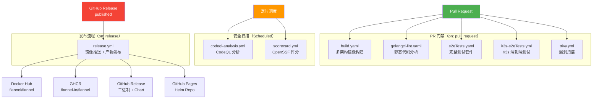
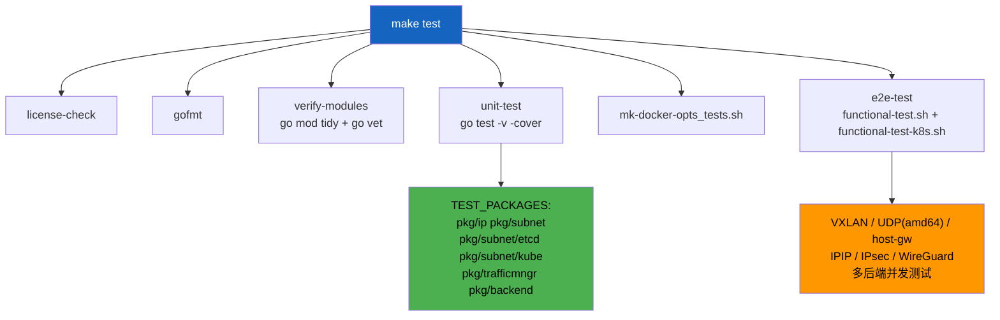
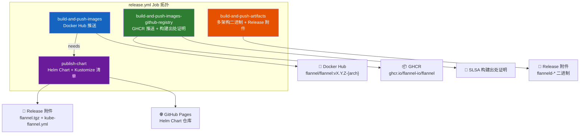
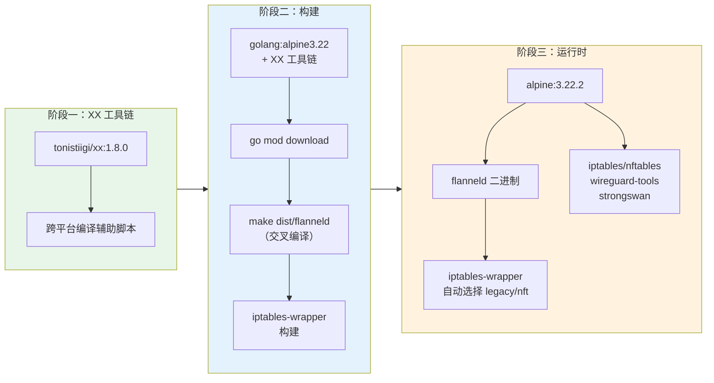

Flannel 项目通过 8 个 GitHub Actions 工作流构建了一套**纵深防御**式的持续集成与交付体系，覆盖从代码质量检查、安全扫描到多架构构建、端到端验证、最终发布的完整生命周期。所有工作流均采用**固定 SHA 引用**的第三方 Action 版本（而非标签），这是供应链安全最佳实践的核心体现。本文将从触发条件、执行逻辑和依赖关系三个维度，系统性地解析这套流水线的设计哲学与实现细节。

Sources: [build.yaml](.github/workflows/build.yaml#L1-L56), [codeql-analysis.yml](.github/workflows/codeql-analysis.yml#L1-L78), [e2eTests.yaml](.github/workflows/e2eTests.yaml#L1-L35), [golangci-lint.yaml](.github/workflows/golangci-lint.yaml#L1-L26), [k3s-e2eTests.yml](.github/workflows/k3s-e2eTests.yml#L1-L31), [release.yml](.github/workflows/release.yml#L1-L204), [scorecard.yml](.github/workflows/scorecard.yml#L1-L79), [trivy.yml](.github/workflows/trivy.yml#L1-L54)

## 整体架构：流水线分类与触发拓扑

Flannel 的 8 个工作流按功能职责分为三大类：**PR 门禁**（5 个）、**安全扫描**（2 个）和**发布流程**（1 个）。PR 门禁在每次 Pull Request 时并行执行，构成代码合并的第一道防线；安全扫描通过定时任务持续监控仓库安全态势；发布流程仅在 GitHub Release 发布时触发，执行多注册中心镜像推送与产物归档。

下表汇总了各工作流的核心参数配置，便于快速把握全局设计：

| 工作流 | 触发条件 | Go 版本 | 运行环境 | 超时 | 权限模型 |
|---|---|---|---|---|---|
| `build.yaml` | `pull_request` | 1.25 | `ubuntu-latest` | 默认 360min | `contents: read` |
| `golangci-lint.yaml` | `pull_request` | 1.25 | `ubuntu-latest` | 默认 | `contents: read` + `pull-requests: read` |
| `e2eTests.yaml` | `pull_request` | ^1.25 | `ubuntu-latest` | 90min | `contents: read` |
| `k3s-e2eTests.yml` | `pull_request` | 1.25 | `ubuntu-latest` | 90min | `contents: read` |
| `trivy.yml` | PR (master) + 每周二 05:34 UTC | 1.25 | `ubuntu-latest` | 默认 | `contents: read` + `security-events: write` |
| `codeql-analysis.yml` | PR (master) + 每周日 20:30 UTC | 1.25 | `ubuntu-latest` | 默认 | `contents: read` + `security-events: write` |
| `scorecard.yml` | 每周三 11:19 UTC + push (master) | — | `ubuntu-latest` | 默认 | `read-all`（分析时 `id-token: write`） |
| `release.yml` | `release: published` | 1.25 | `ubuntu-latest` | 默认 | `contents: read`（各 Job 有特定写入权限） |

Sources: [build.yaml](.github/workflows/build.yaml#L1-L12), [golangci-lint.yaml](.github/workflows/golangci-lint.yaml#L1-L11), [e2eTests.yaml](.github/workflows/e2eTests.yaml#L1-L13), [k3s-e2eTests.yml](.github/workflows/k3s-e2eTests.yml#L1-L18), [trivy.yml](.github/workflows/trivy.yml#L8-L20), [codeql-analysis.yml](.github/workflows/codeql-analysis.yml#L14-L39), [scorecard.yml](.github/workflows/scorecard.yml#L6-L33), [release.yml](.github/workflows/release.yml#L3-L16)

## PR 门禁：构建验证与代码质量

### build.yaml — 多架构构建验证

**`build.yaml`** 是构建验证的核心工作流，它在每次 Pull Request 时触发，验证代码变更不会破坏多架构 Docker 镜像构建和 Windows 二进制编译。该工作流的执行流程分为两个阶段：**多架构 Docker 镜像构建**和 **Windows 二进制编译**。

在多架构构建阶段，工作流首先通过 `git describe --tags --always` 生成版本标签并注入环境变量 `GIT_TAG`，随后执行 `go mod vendor` 确保依赖一致性。构建使用 Docker Buildx 驱动，通过 `docker/metadata-action` 生成基于分支引用的镜像标签（`flavor: latest=false` 确保不自动标记 latest），最终通过 `docker/build-push-action` 在 **6 个平台**（`linux/amd64, linux/arm64, linux/arm, linux/s390x, linux/ppc64le, linux/riscv64`）上进行交叉编译构建。关键设计决策是 `push: false`——此阶段仅验证构建可行性，不推送镜像到任何注册中心。第二阶段直接调用 `make dist/flanneld.exe` 编译 Windows 平台二进制文件，该目标在 Makefile 中通过 MinGW 交叉编译工具链实现。

Sources: [build.yaml](.github/workflows/build.yaml#L14-L56), [Makefile](Makefile#L66-L68)

### golangci-lint.yaml — 静态代码分析

**`golangci-lint.yaml`** 在每次 Pull Request 时执行 Go 语言的静态代码分析。该工作流采用 `golangci/golangci-lint-action`，使用 **v2.7.2** 版本的 linter 集合，超时设置为 5 分钟。值得注意的配置细节是 `cache: false`——这表明工作流有意禁用了 Go 构建缓存，确保每次分析都基于当前代码状态重新编译，避免缓存导致的误报或漏报。工作流的 Job 级权限声明了 `pull-requests: read`，使 golangci-lint 能够读取 PR 上下文并在审查界面中行内标注问题。

Sources: [golangci-lint.yaml](.github/workflows/golangci-lint.yaml#L1-L26)

### e2eTests.yaml — 完整测试套件

**`e2eTests.yaml`** 执行最全面的测试验证，超时设置为 90 分钟，对应 Makefile 中 `make test` 的完整执行链。其测试层次如下：

该工作流有一个精巧的错误处理模式：测试步骤设置了 `continue-on-error: true`，将标准输出和错误重定向到 `errors.txt` 文件。仅当测试结果不为 `success` 时，后续步骤才会输出错误日志并以非零退出码终止工作流。这种两阶段设计确保了即使测试失败，错误信息也能被完整捕获并展示，而不会被 GitHub Actions 的日志截断机制吞没。测试执行前还通过 `sudo modprobe br_netfilter overlay` 加载内核模块，为网络操作（创建网桥、VXLAN 设备等）提供内核支持。

Sources: [e2eTests.yaml](.github/workflows/e2eTests.yaml#L8-L35), [Makefile](Makefile#L95-L117)

### k3s-e2eTests.yml — K3s 集群端到端验证

**`k3s-e2eTests.yml`** 是 Flannel CI 中最接近真实部署场景的测试工作流。它通过 Docker Compose 构建一个包含 leader 和 worker 两个节点的 K3s 集群，在集群中安装 Flannel 并执行后端功能验证。与 `e2eTests.yaml` 的 etcd 模式不同，此工作流测试的是 **Kubernetes 子网管理器路径**——即 Flannel 在生产环境中最常用的运行模式。

K3s 集群的构建基于一个定制的 Dockerfile（[e2e/Dockerfile](e2e/Dockerfile)），它从 SLES 基础镜像安装 K3s 二进制和 CNI 插件，并预加载 Flannel 镜像的 tar 归档文件到 K3s 的离线镜像目录 `/var/lib/rancher/k3s/agent/images/`。Docker Compose 配置定义了两个服务：`leader` 节点以 `server --disable=traefik,metrics-server --flannel-backend=none --disable-network-policy` 启动（禁用 K3s 内置的 Flannel 和网络策略），`worker` 节点以 `agent` 模式加入集群。两者均以 `privileged: true` 运行，以获得创建网络命名空间和操作 iptables/nftables 的权限。

测试脚本 [e2e/run-e2e-tests.sh](e2e/run-e2e-tests.sh) 为每个后端类型（vxlan、host-gw、wireguard、ipip，以及仅限 amd64 的 udp）执行 `prepare_test → pings → check_*tables → delete-flannel` 的循环，并额外提供性能测试（`test_perf_*`）通过 iperf3 测量各后端的吞吐量。iptables/nftables 规则校验会精确比对 `FLANNEL-POSTRTG` 和 `FLANNEL-FWD` 链的规则内容与预期值是否完全一致。

Sources: [k3s-e2eTests.yml](.github/workflows/k3s-e2eTests.yml#L13-L31), [e2e/docker-compose.yml](e2e/docker-compose.yml#L1-L39), [e2e/Dockerfile](e2e/Dockerfile#L1-L59), [e2e/run-e2e-tests.sh](e2e/run-e2e-tests.sh#L180-L243)

## 安全扫描：纵深防御体系

### codeql-analysis.yml — 代码语义分析

**`codeql-analysis.yml`** 使用 GitHub 的 CodeQL 引擎对 Go 源码进行深度语义分析，能够检测 SQL 注入、路径遍历、竞争条件等复杂安全漏洞。该工作流在两种场景下触发：针对 `master` 分支的 Pull Request 和每周日 20:30 UTC 的定时扫描。分析流程分为三步：初始化 CodeQL 数据库（`github/codeql-action/init`）、编译 Flannel 二进制（`make dist/flanneld`）以提取代码图谱、执行分析并上传结果（`github/codeql-action/analyze`）。编译步骤是必要的——CodeQL 需要在构建过程中拦截编译器调用以构建精确的代码语义模型。

Sources: [codeql-analysis.yml](.github/workflows/codeql-analysis.yml#L43-L78)

### trivy.yml — 容器镜像漏洞扫描

**`trivy.yml`** 专注于 Docker 镜像层面的已知漏洞检测（CVE）。该工作流首先通过 `ARCH=amd64 TAG=${{ github.sha }} make image` 在本地构建一个 amd64 架构的 Docker 镜像（输出为 tar 归档格式 `dist/flanneld-${{ github.sha }}-amd64.docker`），然后使用 Aqua Security 的 Trivy 扫描器对该 tar 归档执行漏洞扫描。扫描配置聚焦于 **CRITICAL 和 HIGH** 严重级别的漏洞，结果以 SARIF 格式输出并通过 `github/codeql-action/upload-sarif` 上传到 GitHub Security 选项卡，实现安全告警的集中可视化管理。

Sources: [trivy.yml](.github/workflows/trivy.yml#L29-L54)

### scorecard.yml — 供应链安全评分

**`scorecard.yml`** 运行 OpenSSF（Open Source Security Foundation）的 Scorecard 工具，从供应链安全的角度对仓库进行全方位评估，包括分支保护、依赖更新策略、代码审查流程、构建出处证明等多个维度。该工作流在每周三 11:19 UTC 和推送到 `master` 分支时触发，结果以 SARIF 格式上传至 GitHub Code Scanning 仪表板，并选择 `publish_results: true` 将评分发布到 OpenSSF API，使仓库能够展示 Scorecard 徽章。值得注意的是，该工作流使用 `persist-credentials: false` 禁用了 checkout 的凭证持久化，进一步缩小了攻击面。

Sources: [scorecard.yml](.github/workflows/scorecard.yml#L36-L78)

## 发布流程：多注册中心镜像推送与产物归档

**`release.yml`** 是整个 CI/CD 体系中最复杂的工作流，仅在 GitHub Release 发布（`types: [published]`）时触发。它包含 **4 个并行 Job**，每个 Job 承担不同的发布职责，通过 `needs` 依赖关系协调执行顺序：

**`build-and-push-images`** 负责向 Docker Hub 推送多架构镜像。它通过 `docker/login-action` 使用仓库 Secrets 中的 `DOCKER_USERNAME` 和 `DOCKER_PASSWORD` 登录 Docker Hub，并通过条件判断 `if: github.repository_owner == 'flannel-io' && success()` 确保仅从官方仓库执行推送。镜像标签通过 `docker/metadata-action` 的 `type=ref,event=tag` 配置自动从 Git 标签派生，`flavor: latest=false` 避免自动标记 latest 标签。QEMU 模拟器的设置（`docker/setup-qemu-action`）是实现 6 平台交叉构建的关键——它允许在 amd64 Runner 上为 ARM、s390x、ppc64le 等架构构建原生镜像。

**`build-and-push-images-github-registry`** 向 GitHub Container Registry (GHCR) 推送镜像，并额外执行**构建出处证明**（Build Provenance Attestation）。这是 SLSA（Supply-chain Levels for Software Artifacts）Level 3 合规性的关键步骤：`actions/attest-build-provenance` 会生成一个签名声明，记录镜像的构建过程、源码提交哈希和构建器身份，绑定到镜像的 digest 上。此 Job 使用 `GITHUB_TOKEN` 进行身份验证，无需额外配置 Secrets。

**`build-and-push-artifacts`** 执行 `make release` 构建所有 6 个架构的二进制文件和 tar.gz 归档包，然后使用 `gh release upload` 将这些产物附加到 GitHub Release 页面。`make release` 的内部实现首先下载各架构的 QEMU 静态二进制（通过 SHA256 校验和验证完整性），然后在 Docker 容器内为每个架构交叉编译 `flanneld` 二进制并打包成 Docker 镜像归档。

**`publish-chart`** 依赖于 `build-and-push-images` 完成后执行，负责 Helm Chart 和 Kustomize 清单的发布。它执行 `make release-manifest` 更新 Kustomization 中的镜像标签并生成聚合 YAML 清单 `dist/kube-flannel.yml`，执行 `make release-helm` 更新 Chart 版本并打包为 `dist/flannel.tgz`，最终将这些文件上传到 Release 页面并部署到 GitHub Pages 作为 Helm Chart 仓库。

Sources: [release.yml](.github/workflows/release.yml#L17-L204), [Makefile](Makefile#L165-L187)

## Docker 构建架构：多阶段交叉编译

Flannel 的 Docker 镜像构建采用了一套精心设计的多阶段构建方案，定义在 [images/Dockerfile](images/Dockerfile) 中。整个构建过程分为三个阶段：

构建的关键创新在于使用 **tonistiigi/xx** 工具链实现透明化的跨平台编译。构建阶段以 `BUILDPLATFORM` 平台运行（即 Runner 的原生架构），但通过 `xx-info` 工具动态获取 `TARGETPLATFORM` 对应的 `GOOS`、`GOARCH` 和 `ARCH` 变量，使 Makefile 中的构建目标自动适配目标平台。`xx-apk` 命令会安装目标平台的 C 标准库和编译器，配合 `clang` 和 `lld` 实现高效交叉链接。运行时镜像基于精简的 Alpine Linux，预装了 iptables、nftables、WireGuard 工具和 strongSwan（IPsec），并通过 `iptables-wrapper` 自动检测并选择 iptables-legacy 或 iptables-nft 后端，确保在不同内核版本上的兼容性。

Sources: [images/Dockerfile](images/Dockerfile#L1-L53)

## 依赖管理：Dependabot 自动更新

Flannel 通过 [dependabot.yml](.github/dependabot.yml) 配置了全面的依赖自动更新策略，覆盖 **Go 模块、Docker 镜像和 GitHub Actions** 三个生态系统。Go 模块更新采用**分组策略**：Kubernetes 生态（`k8s.io/*`、`sigs.k8s.io/*`）、etcd（`go.etcd.io/*`）、腾讯云 SDK（`github.com/tencentcloud/*`）以及其他模块分别作为独立的更新组，每组包含 major、minor、patch 三种更新类型。这种分组设计使得维护者可以按风险等级分别审查不同依赖的更新——例如 Kubernetes 生态的变更可能需要更多的兼容性验证，而独立模块的小版本更新风险相对较低。所有生态系统的检查频率均为每周一次（`interval: weekly`），部分 Docker 相关的目录（如 `e2e/` 和 `images/iperf3`）设置为每日检查以确保基础镜像的安全更新及时被捕获。

Sources: [dependabot.yml](.github/dependabot.yml#L1-L67)

## 供应链安全实践总结

Flannel 的 CI/CD 流水线体现了一系列业界最佳实践，下表汇总了关键的供应链安全策略：

| 安全策略 | 实现方式 | 涉及工作流 |
|---|---|---|
| **Action 版本锁定** | 所有第三方 Action 使用完整 SHA 而非标签引用 | 所有工作流 |
| **最小权限原则** | 顶层 `permissions: contents: read`，Job 级按需扩展 | 所有工作流 |
| **多维度安全扫描** | CodeQL（代码语义）+ Trivy（镜像 CVE）+ Scorecard（供应链评分） | codeql, trivy, scorecard |
| **SLSA 构建证明** | `actions/attest-build-provenance` 生成签名出处声明 | release.yml |
| **QEMU SHA256 校验** | 下载 QEMU 静态二进制后验证 SHA256 完整性 | Makefile |
| **K3s 二进制校验** | Dockerfile 内对 K3s 和 CNI 插件二进制执行 SHA256 校验 | e2e/Dockerfile |
| **凭证隔离** | `persist-credentials: false`，`publish_results` 仅对默认分支生效 | scorecard.yml |
| **仓库所有者验证** | `if: github.repository_owner == 'flannel-io'` 防止 Fork 误推送 | release.yml |

Sources: [build.yaml](.github/workflows/build.yaml#L11-L12), [release.yml](.github/workflows/release.yml#L14-L16), [scorecard.yml](.github/workflows/scorecard.yml#L18-L19), [Makefile](Makefile#L9-L14), [e2e/Dockerfile](e2e/Dockerfile#L22-L28), [release.yml](.github/workflows/release.yml#L55-L56)

## 扩展阅读

- 要了解 e2e 测试脚本中验证的各个后端的网络实现细节，参见 [VXLAN 后端：内核态封装与直连路由](6-vxlan-hou-duan-nei-he-tai-feng-zhuang-yu-zhi-lian-lu-you) 和 [host-gw 后端：基于二层直连的高性能路由](7-host-gw-hou-duan-ji-yu-er-ceng-zhi-lian-de-gao-xing-neng-lu-you)
- 要深入理解 Docker 构建产物的多架构发布细节，参见 [发布流程与多架构镜像构建](26-fa-bu-liu-cheng-yu-duo-jia-gou-jing-xiang-gou-jian)
- 要理解 e2e 测试中 iptables/nftables 规则校验背后的流量管理机制，参见 [iptables 模式：MASQUERADE 与 FORWARD 规则管理](15-iptables-mo-shi-masquerade-yu-forward-gui-ze-guan-li)
- 要理解测试覆盖的子网管理模块的设计，参见 [Kubernetes 子网管理器：基于 API 的声明式管理](13-kubernetes-zi-wang-guan-li-qi-ji-yu-api-de-sheng-ming-shi-guan-li)