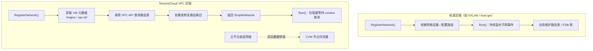
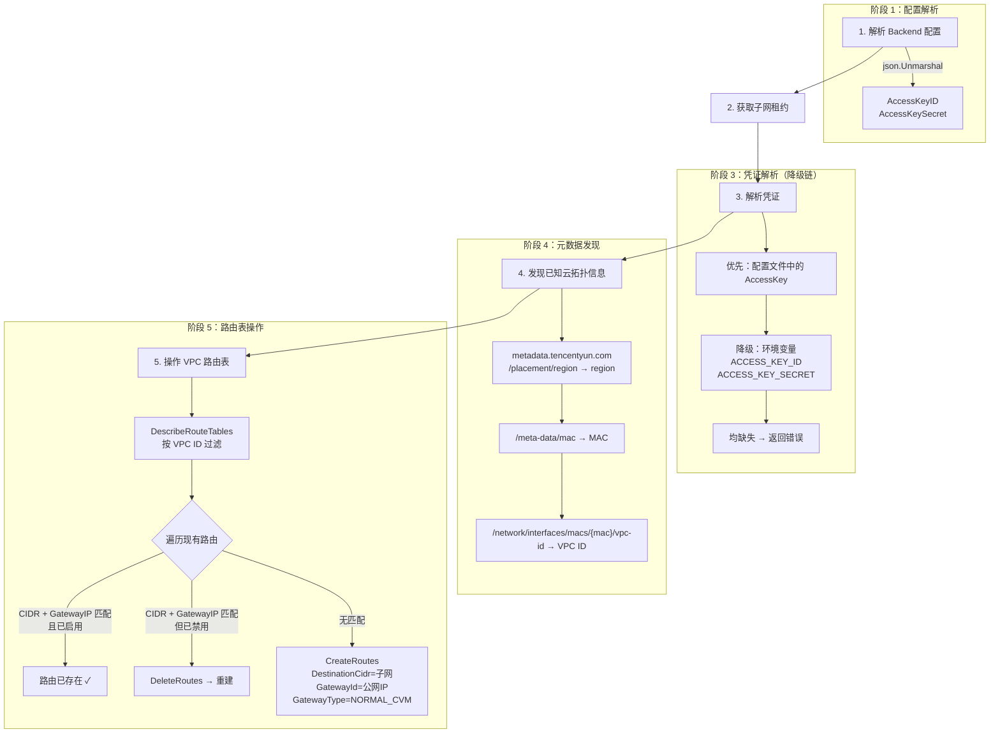
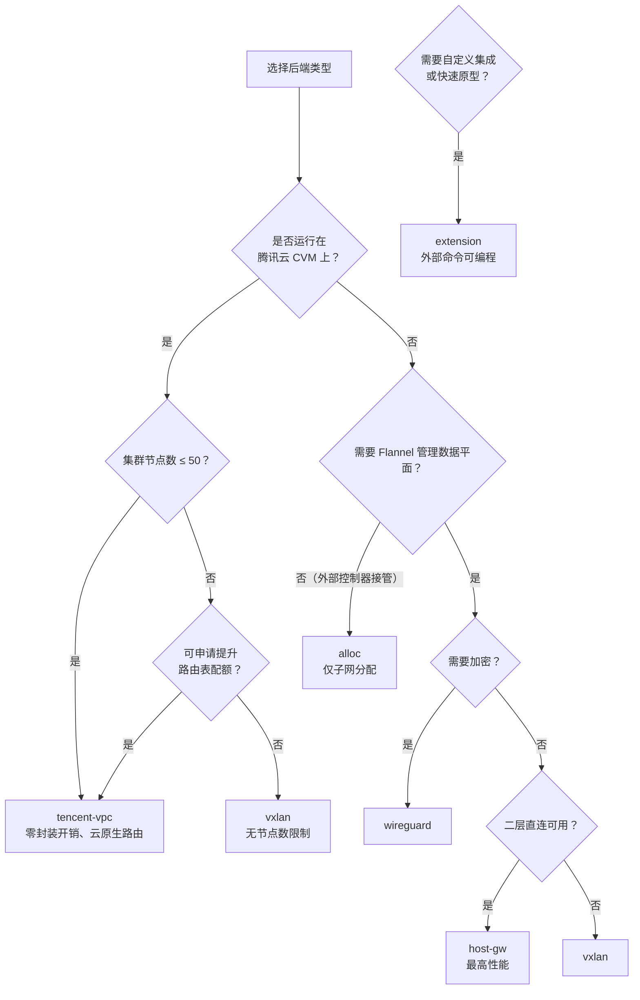

Flannel 的后端体系不仅包含 VXLAN、host-gw 等通用封装与路由方案，还提供了一类面向特定运行环境的**专用后端**——它们不自行构建数据平面，而是将路由编排的职责委托给底层基础设施。TencentCloud VPC 后端是这一范式的典型实现：它通过腾讯云 VPC API 直接操作云路由表，将 Pod 子网流量交由云平台底层网络转发。与它处于同一类别的还有 **alloc**（纯子网分配、零数据平面）和 **extension**（基于外部命令的通用可编程后端），三者共同构成了 Flannel 在非标准网络环境下的补充能力矩阵。

Sources: [backends.md](Documentation/backends.md#L86-L99), [tencentvpc.go](pkg/backend/tencentvpc/tencentvpc.go#L1-L40)

## 架构定位：云路由委托模式

理解 TencentCloud VPC 后端的关键在于把握一个核心范式转变：**数据平面从 Flannel 进程内部迁移到了云基础设施**。在 VXLAN 后端中，Flannel 创建 VTEP 设备并封装数据包；在 host-gw 后端中，Flannel 维护内核路由表。而 TencentCloud VPC 后端在 `RegisterNetwork` 完成路由注册后，直接返回一个 `SimpleNetwork`——其 `Run` 方法仅阻塞在 `<-ctx.Done()` 上，不参与任何数据转发逻辑。



这种架构差异的直接后果是：TencentCloud VPC 后端**不需要监听子网事件**（如 `WatchLeases`），因为每个节点的路由注册是独立的——节点启动时将自己分配到的子网 CIDR 写入 VPC 路由表，指向自己的公网 IP，后续所有跨节点的 Pod 流量由云平台路由引擎处理。这与 VXLAN/host-gw 中每个节点都需要感知其他节点子网的"全网状路由"模式形成鲜明对比。

Sources: [tencentvpc.go](pkg/backend/tencentvpc/tencentvpc.go#L96-L219), [simple_network.go](pkg/backend/simple_network.go#L36-L38), [route_network.go](pkg/backend/route_network.go#L53-L81)

## 专用后端能力对比

三种专用后端各有其明确的能力边界，下表从数据平面、子网事件监听、平台依赖三个维度进行对比：

| 特性维度 | **TencentCloud VPC** | **alloc** | **extension** |
|---|---|---|---|
| 后端注册名 | `tencent-vpc` | `alloc` | `extension` |
| 数据平面实现 | 云平台 VPC 路由引擎 | **无**（仅分配子网） | 外部命令（用户自定义） |
| `RegisterNetwork` 核心逻辑 | 调用 TencentCloud API 写路由条目 | 仅获取子网租约 | 执行 PreStartup/PostStartup 命令 |
| `Run` 循环行为 | `SimpleNetwork.Run()`：阻塞等待退出 | `SimpleNetwork.Run()`：阻塞等待退出 | 监听子网事件，触发外部命令 |
| 子网事件监听 | ❌ 不监听 | ❌ 不监听 | ✅ `WatchLeases` → `SubnetAddCommand` / `SubnetRemoveCommand` |
| 外部依赖 | TencentCloud SDK + 元数据服务 | 无 | 操作系统 shell |
| 平台支持 | Linux only（Windows 为空包） | 跨平台 | 跨平台 |
| 典型场景 | 腾讯云 CVM 上运行 Kubernetes | 第三方路由控制器接管网络 | 快速原型验证自定义后端 |

Sources: [tencentvpc.go](pkg/backend/tencentvpc/tencentvpc.go#L38-L40), [alloc.go](pkg/backend/alloc/alloc.go#L28-L30), [extension.go](pkg/backend/extension/extension.go#L34-L36), [extension_network.go](pkg/backend/extension/extension_network.go#L48-L69)

## TencentCloud VPC 后端：深度实现剖析

### 初始化与注册

TencentCloud VPC 后端通过 Go 的 `init()` 机制在包加载时自动注册，注册名为 `"tencent-vpc"`。构造函数 `New` 接收子网管理器和外部接口引用，返回一个极简的 `TencentVpcBackend` 结构体——仅缓存 `subnet.Manager` 和 `ExternalInterface`，不包含任何 SDK 客户端或网络状态。SDK 客户端的创建延迟到 `RegisterNetwork` 调用时，这一设计确保了 init 阶段不会因为云 API 不可用而导致程序启动失败。

Sources: [tencentvpc.go](pkg/backend/tencentvpc/tencentvpc.go#L38-L53), [manager.go](pkg/backend/manager.go#L91-L93)

### RegisterNetwork 全流程

`RegisterNetwork` 是该后端唯一的核心方法，其执行流程可拆解为五个阶段：



**阶段一：配置解析**。后端从 `subnet.Config.Backend` 的 JSON 字段中提取 `AccessKeyID` 和 `AccessKeySecret` 两个配置项。这两个字段也可为空——后端会在阶段三中尝试从环境变量读取。

**阶段二：子网租约获取**。调用 `subnet.Manager.AcquireLease` 获取本节点负责的 Pod 子网 CIDR。租约属性中仅设置 `PublicIP`（来自外部接口的 `ExtAddr`），不携带 `BackendType` 和 `BackendData`——这意味着其他后端无法识别 TencentCloud VPC 的子网事件（但这无影响，因为该后端不监听事件）。

**阶段三：凭证降级链**。若配置文件中未提供密钥，后端会依次尝试读取 `ACCESS_KEY_ID` 和 `ACCESS_KEY_SECRET` 环境变量。双重降级均失败时，直接返回硬错误，阻止网络注册。

**阶段四：元数据发现**。后端通过 HTTP GET 请求腾讯云实例元数据服务（`metadata.tencentyun.com`）获取两个关键信息：CVM 实例所在地域（region）和所属 VPC 的唯一标识（vpc-id）。获取 VPC ID 需要先查询实例的 MAC 地址，再拼接出 `/network/interfaces/macs/{mac}/vpc-id` 的路径。这一机制意味着**后端必须在腾讯云 CVM 实例上运行**，否则元数据查询将失败。

**阶段五：路由表操作**。使用腾讯云 VPC SDK 客户端执行 `DescribeRouteTables`，按 VPC ID 过滤获取路由表。然后遍历路由表中的已有条目，执行幂等性检查：如果目标 CIDR 与网关 IP 完全匹配且条目已启用，则跳过创建；如果条目存在但处于禁用状态，则先删除再重建；若无匹配条目，则创建新路由。路由条目的 `GatewayType` 固定为 `"NORMAL_CVM"`，表示下一跳为普通云服务器实例。

Sources: [tencentvpc.go](pkg/backend/tencentvpc/tencentvpc.go#L96-L219)

### 元数据服务交互细节

元数据服务的查询是该后端与云平台交互中最脆弱的一环。后端实现了三个辅助函数：

| 函数 | 元数据 URL | 返回值 | 失败影响 |
|---|---|---|---|
| `get_vm_region()` | `/latest/meta-data/placement/region` | 地域标识（如 `ap-guangzhou`） | 阻止 SDK 客户端创建 |
| `get_vm_vpcid()` | `/latest/meta-data/mac` → `/network/interfaces/macs/{mac}/vpc-id` | VPC 唯一标识 | 阻止路由表查询 |
| `get_vm_metadata(url)` | 通用 HTTP GET 封装 | 响应体字符串 | 所有元数据查询的基础 |

值得注意的是 `get_vm_metadata` 的错误处理策略：当 HTTP 响应状态码非 200 时返回错误，但成功时**忽略 `io.ReadAll` 的错误**（使用 `_` 丢弃）。这是一个已知的防御性缺陷——在极端网络条件下可能返回空字符串而非报错。

Sources: [tencentvpc.go](pkg/backend/tencentvpc/tencentvpc.go#L55-L94)

### 返回值：SimpleNetwork 的意义

`RegisterNetwork` 最终返回 `&backend.SimpleNetwork{SubnetLease: l, ExtIface: be.extIface}`。`SimpleNetwork` 是 Flannel 中最轻量的网络抽象——它的 `Run` 方法仅在 context 取消前阻塞，`MTU` 直接透传外部接口的 MTU 值，`Lease` 返回子网租约指针。选择 `SimpleNetwork` 而非 `RouteNetwork`（被 host-gw / IPIP 使用）的核心原因在于：**TencentCloud VPC 后端不需要本地路由维护**，所有跨节点路由条目已在云 API 中创建完毕。

Sources: [tencentvpc.go](pkg/backend/tencentvpc/tencentvpc.go#L215-L219), [simple_network.go](pkg/backend/simple_network.go#L23-L38)

## 配置指南

### ConfigMap 配置方式

在 Kubernetes 环境中，TencentCloud VPC 后端的配置嵌入在 `kube-flannel-cfg` ConfigMap 的 `net-conf.json` 字段中：

```json
{
  "Network": "10.244.0.0/16",
  "Backend": {
    "Type": "tencent-vpc",
    "AccessKeyID": "AKIDxxxxxxxxxxxxxxxxxxxxxxxxxxxxxxxx",
    "AccessKeySecret": "xxxxxxxxxxxxxxxxxxxxxxxxxxxxxxxx"
  }
}
```

### 环境变量配置方式

为避免将敏感凭证写入 ConfigMap，可通过环境变量注入。在 DaemonSet 中配置：

```yaml
env:
- name: ACCESS_KEY_ID
  valueFrom:
    secretKeyRef:
      name: tencentcloud-credentials
      key: accessKeyId
- name: ACCESS_KEY_SECRET
  valueFrom:
    secretKeyRef:
      name: tencentcloud-credentials
      key: accessKeySecret
```

此时 `net-conf.json` 中可省略 `AccessKeyID` 和 `AccessKeySecret` 字段，后端会自动降级到环境变量读取。

### 前置条件清单

| 前置条件 | 说明 | 验证方式 |
|---|---|---|
| CVM 实例运行于腾讯云 VPC 内 | 元数据服务仅在 CVM 内可达 | `curl http://metadata.tencentyun.com/latest/meta-data/instance-id` |
| API 密钥具备 VPC 读写权限 | 需要 `vpc:DescribeRouteTables`、`vpc:CreateRoutes`、`vpc:DeleteRoutes` | 在 CAM 控制台检查策略绑定 |
| VPC 路由表存在 | 至少需要一个路由表 | 在 VPC 控制台确认 |
| 路由表条目数未达上限 | 腾讯云限制每张路由表最多 **50** 条路由 | `DescribeRouteTables` 返回的条目数 |
| 节点间网络互通 | CVM 安全组需放行 Pod CIDR 流量 | 安全组入站规则检查 |

Sources: [backends.md](Documentation/backends.md#L87-L99), [tencentvpc.go](pkg/backend/tencentvpc/tencentvpc.go#L125-L132)

## 平台限制与设计约束

### 路由表条目上限

腾讯云对每张 VPC 路由表设置了 **50 条路由条目**的硬上限。这意味着使用 TencentCloud VPC 后端的 Kubernetes 集群**最多支持 50 个节点**（每个节点占用一条路由条目，指向该节点分配到的 Pod 子网 CIDR）。对于超过此规模的集群，应考虑使用 VXLAN 后端或申请路由配额提升。

Sources: [backends.md](Documentation/backends.md#L98-L98)

### Windows 平台不支持

该后端的 Windows 实现文件 `tencentvpc_windows.go` 仅包含包声明，无任何实际代码。这是有意为之——腾讯云元数据服务的查询方式和 VPC SDK 的使用模式均依赖 Linux 网络环境。在 Windows 节点上指定 `tencent-vpc` 后端类型将导致编译阶段被排除（通过 `//go:build !windows` 构建标签）。

Sources: [tencentvpc_windows.go](pkg/backend/tencentvpc/tencentvpc_windows.go#L1-L16), [tencentvpc.go](pkg/backend/tencentvpc/tencentvpc.go#L14-L15)

### 路由条目的幂等性处理

后端在 `RegisterNetwork` 中实现了有限的路由幂等性：如果路由条目已存在且处于启用状态，则跳过创建。但存在一个边界情况——**当节点的公网 IP 发生变化时**（例如 CVM 实例更换弹性 IP），旧路由条目的 GatewayId 与新 IP 不匹配，后端不会自动清理旧条目，而是尝试创建新条目，可能因路由条目数上限而失败。生产环境中建议通过外部监控脚本定期审计路由表一致性。

Sources: [tencentvpc.go](pkg/backend/tencentvpc/tencentvpc.go#L168-L213)

### 无双栈支持

TencentCloud VPC 后端在租约属性中仅设置 `PublicIP`（IPv4），不设置 `PublicIPv6`。结合配置文档中双栈模式仅支持 `vxlan`、`wireguard`、`host-gw` 的声明，可确认该后端**不支持 IPv6 双栈或纯 IPv6 模式**。

Sources: [tencentvpc.go](pkg/backend/tencentvpc/tencentvpc.go#L111-L113), [configuration.md](Documentation/configuration.md#L112-L112)

## alloc 后端：零数据平面的子网分配器

alloc 后端是 Flannel 中最简单的后端实现——它的 `RegisterNetwork` 方法仅执行子网租约获取，然后直接返回 `SimpleNetwork`。不创建任何网络设备、不配置任何路由规则、不监听任何子网事件。它的存在意义在于为**自定义路由控制器**提供子网分配能力：当一个外部系统（如自研的 SDN 控制器）需要知道每个节点分配到的子网 CIDR 时，可以使用 alloc 后端让 Flannel 仅负责子网管理，数据平面完全由外部控制器接管。

该后端的实现精简到极致——整个文件不足 65 行，`RegisterNetwork` 仅包含租约获取和一个三路 switch（处理成功、context 取消、其他错误）。

Sources: [alloc.go](pkg/backend/alloc/alloc.go#L1-L64)

## extension 后端：可编程的通用集成框架

extension 后端为 Flannel 提供了一种不修改源码即可自定义后端行为的机制。它通过四个可配置的命令钩子，将网络设备的创建、路由管理、子网事件处理等逻辑委托给外部脚本或程序。

### 命令钩子体系

| 钩子 | 触发时机 | 输入 | 环境变量 | 典型用途 |
|---|---|---|---|---|
| `PreStartupCommand` | 子网分配前 | 无 | 无 | 创建网络设备，输出传递给后续命令 |
| `PostStartupCommand` | 子网分配后 | 无 | `NETWORK`, `SUBNET`, `IPV6SUBNET`, `PUBLIC_IP`, `PUBLIC_IPV6` | 配置设备 IP 地址 |
| `SubnetAddCommand` | 其他节点子网上线 | stdout of PreStartup via stdin | `SUBNET`, `PUBLIC_IP` | 添加路由 / FDB 条目 |
| `SubnetRemoveCommand` | 其他节点子网下线 | stdout of PreStartup via stdin | `SUBNET`, `PUBLIC_IP` | 删除路由 / FDB 条目 |

与 TencentCloud VPC 后端不同，extension 后端的 `Run` 方法通过 `WatchLeases` 持续监听子网事件，并在事件到达时触发对应的 `SubnetAddCommand` 或 `SubnetRemoveCommand`。这意味着 extension 后端具备**动态路由维护能力**，适用于需要根据集群拓扑变化实时调整网络配置的场景。

### 与云平台集成的关系

extension 后端虽然不是专门为云平台设计，但它提供了一种**不依赖特定 SDK 的云平台集成路径**。例如，可以通过配置 `SubnetAddCommand` 调用阿里云 CLI 或 AWS CLI 来操作对应平台的路由表，从而在 Flannel 不原生支持某云平台时实现类似 TencentCloud VPC 后端的功能。这种方式的代价是放弃了 SDK 集成的类型安全和错误处理，换来了极大的灵活性。

Sources: [extension.go](pkg/backend/extension/extension.go#L58-L143), [extension_network.go](pkg/backend/extension/extension_network.go#L30-L141), [extension.md](Documentation/extension.md#L1-L66)

## 后端选择决策矩阵

在决定是否采用 TencentCloud VPC 或其他专用后端时，可参考以下决策路径：



| 决策场景 | 推荐后端 | 理由 |
|---|---|---|
| 腾讯云 CVM、小规模集群（≤50 节点） | `tencent-vpc` | 零封装开销，利用 VPC 原生路由 |
| 腾讯云 CVM、大规模集群 | `vxlan` | 突破路由表条目限制 |
| 自研 SDN 控制器对接 | `alloc` | 仅借用子网管理能力 |
| 阿里云 / AWS 等其他云平台 | `extension` + 云 CLI | 通过外部命令操作云路由表 |
| 快速验证新的网络方案 | `extension` | 无需编译，命令行即可定义行为 |

Sources: [backends.md](Documentation/backends.md#L1-L6), [tencentvpc.go](pkg/backend/tencentvpc/tencentvpc.go#L1-L40)

## 延伸阅读

- 关于所有标准后端的封装机制与数据平面实现，参见 [VXLAN 后端：内核态封装与直连路由](6-vxlan-hou-duan-nei-he-tai-feng-zhuang-yu-zhi-lian-lu-you) 和 [host-gw 后端：基于二层直连的高性能路由](7-host-gw-hou-duan-ji-yu-er-ceng-zhi-lian-de-gao-xing-neng-lu-you)
- 关于 extension 后端的完整配置语法与实战案例，参见 [Extension 后端：自定义后端的原型开发机制](10-extension-hou-duan-zi-ding-yi-hou-duan-de-yuan-xing-kai-fa-ji-zhi)
- 关于后端注册机制与 `init()` 构造函数映射的技术细节，参见 [后端注册机制：init() 与构造函数映射模式](11-hou-duan-zhu-ce-ji-zhi-init-yu-gou-zao-han-shu-ying-she-mo-shi)
- 关于子网租约的获取流程与生命周期，参见 [子网租约生命周期：获取、续约与事件监听](14-zi-wang-zu-yue-sheng-ming-zhou-qi-huo-qu-xu-yue-yu-shi-jian-jian-ting)
- 关于网络配置的完整参数说明，参见 [网络配置详解：JSON 配置、命令行参数与环境变量](17-wang-luo-pei-zhi-xiang-jie-json-pei-zhi-ming-ling-xing-can-shu-yu-huan-jing-bian-liang)