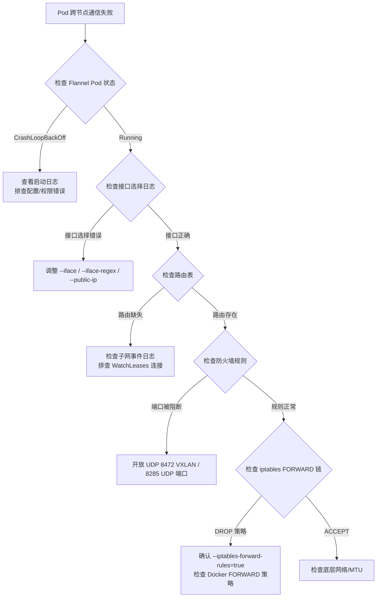

Flannel 在 Kubernetes 集群中充当跨节点 Pod 通信的底层基础设施。当集群网络出现异常时，问题往往涉及**日志采集**、**连通性验证**和**性能诊断**三个维度。本页从 Flannel 源码中提取的诊断线索出发，系统性地构建一套从"发现问题"到"定位根因"的排查方法论，帮助中级开发者快速锁定 Flannel 网络平面中的故障点。

Sources: [troubleshooting.md](Documentation/troubleshooting.md#L1-L112), [main.go](main.go#L1-L175)

## 日志体系：从 klog 到生产级日志采集

### 日志架构与配置

Flannel 使用 Kubernetes 的 **klog v2** 库作为日志框架，并强制将所有日志输出到 stderr（`logtostderr=true`）。这一设计意味着 Flannel 不写入独立日志文件，而是依赖容器运行时或 init 系统来捕获和聚合日志。

Sources: [main.go](main.go#L140-L159)

在 `init()` 函数中，Flannel 做了三个关键设置：

```go
// 强制日志输出到 stderr（兼容 systemd/journald）
flag.Set("logtostderr", "true")
// 启用新版 stderr 阈值行为（修复 klog issue#432）
flag.Set("legacy_stderr_threshold_behavior", "false")
// 设置最低日志级别为 INFO
flag.Set("stderrthreshold", "INFO")
```

虽然 klog 支持多种日志级别，但 Flannel 对日志严重性级别的控制是有限的——**无法修改严重性级别阈值**（severity level），只能通过 `-v` 参数调节详细度（verbosity level）。Flannel 定义了以下 `-v` 级别的典型输出：

| `-v` 值 | 输出内容 | 适用场景 |
|---------|---------|---------|
| `0`（默认） | 启动信息、子网事件、关键错误 | 生产环境日常监控 |
| `1` | 设备已存在提示、Watch 退出信息 | 初步排查启动问题 |
| `2` | 直接路由添加、子网变更详情 | 连通性问题定位 |
| `4` | FDB/ARP 操作调用详情 | VXLAN 数据平面排查 |
| `6` | iptables-restore 原始规则内容 | 流量规则深度调试 |

Sources: [main.go](main.go#L162-L164), [Documentation/troubleshooting.md](Documentation/troubleshooting.md#L11-L26)

**klog 辅助参数**：

```
-vmodule value
    逗号分隔的 pattern=N 设置，用于文件级别过滤日志
-log_backtrace_at value
    当日志输出到 file:N 行时，输出堆栈跟踪
```

### 不同运行环境下的日志采集命令

```mermaid
flowchart TD
    A[Flannel 日志采集] --> B{运行环境?}
    B -->|Kubernetes Pod| C[kubectl logs -n kube-flannel<br>&lt;POD_ID&gt; -c kube-flannel]
    B -->|systemd 服务| D[journalctl -u flanneld]
    B -->|直接运行| E[stderr 重定向<br>flanneld 2&gt;&1 | tee flannel.log]
    C --> F[查看 Pod 列表：<br>kubectl get pod -n kube-flannel -l app=flannel]
```

Sources: [Documentation/troubleshooting.md](Documentation/troubleshooting.md#L23-L26)

### 关键启动阶段日志与错误含义

Flannel 的 `main()` 函数在启动过程中输出一系列具有明确语义的日志消息，它们是快速诊断启动失败的第一手线索：

| 启动阶段日志 | 含义 | 排查方向 |
|-------------|------|---------|
| `CLI flags config: ...` | 打印完整命令行参数配置 | 确认参数传递是否正确 |
| `Created subnet manager: ...` | 子网管理器创建成功 | 若未出现，检查 etcd 连接或 kube-api 权限 |
| `Found network config - Backend type: ...` | 网络配置加载成功 | 若未出现，检查 `net-conf.json` ConfigMap |
| `Using interface with name ... and address ...` | 网络接口选择结果 | 确认接口是否正确 |
| `Wrote subnet file to ...` | `subnet.env` 文件写入成功 | 确认 CNI 插件可读取该文件 |
| `Running backend.` | 后端网络正式启动 | 此后进入事件循环 |
| `Failed to check br_netfilter: ...` | `br_netfilter` 内核模块未加载 | 加载 `br_netfilter` 模块 |

Sources: [main.go](main.go#L226-L507)

### 启动阶段关键错误与处理

`getConfig()` 函数在无法获取网络配置时采用**无限重试**策略（每秒一次），直到成功或上下文被取消：

```go
for {
    config, err := sm.GetNetworkConfig(ctx)
    if err != nil {
        log.Errorf("Couldn't fetch network config: %s", err)
    } else if config == nil {
        log.Warningf("Couldn't find network config: %s", err)
    } else {
        log.Infof("Found network config - Backend type: %s", config.BackendType)
        return config, nil
    }
    // 每秒重试
    select {
    case <-ctx.Done():
        return nil, errCanceled
    case <-time.After(1 * time.Second):
    }
}
```

子网管理器创建阶段有一个特殊的容错机制：当环境变量 `CONT_WHEN_CACHE_NOT_READY=true` 且错误类型为 `context.DeadlineExceeded` 时，Flannel 会在日志中输出警告但**继续启动**而非退出：

```go
contCacheNotReady := os.Getenv("CONT_WHEN_CACHE_NOT_READY")
if contCacheNotReady == "true" && errors.Is(err, context.DeadlineExceeded) {
    log.Error("Timed out waiting for node controller sync. Continuing anyway.")
}
```

Sources: [main.go](main.go#L241-L251), [main.go](main.go#L525-L544)

## 健康检查端点

Flannel 提供一个简单的 HTTP 健康检查端点，通过 `--healthz-ip` 和 `--healthz-port` 参数控制。当 `--healthz-port` 大于 0 时启用。该端点仅返回 HTTP 200 和固定文本 `flanneld is running`，表明进程存活——它**不检测后端网络的实际连通性或路由的正确性**。

```go
http.HandleFunc("/healthz", func(w http.ResponseWriter, r *http.Request) {
    w.WriteHeader(http.StatusOK)
    w.Write([]byte("flanneld is running"))
})
```

| 参数 | 默认值 | 说明 |
|------|-------|------|
| `--healthz-ip` | `0.0.0.0` | 监听地址 |
| `--healthz-port` | `0`（禁用） | 监听端口，0 表示禁用 |

在 Kubernetes 中，可以将此端点配置为 liveness probe，但需注意健康检查通过仅表示 Flannel 进程存活，不代表 Pod 网络已就绪。

Sources: [main.go](main.go#L132-L133), [main.go](main.go#L546-L583)

## 连通性排查：从接口选择到路由验证

### 诊断流程总览



Sources: [Documentation/troubleshooting.md](Documentation/troubleshooting.md#L5-L91), [pkg/ipmatch/match.go](pkg/ipmatch/match.go#L53-L316)

### 网络接口选择诊断

接口选择是 Flannel 连通性的根基。Flannel 的接口解析策略按照以下优先级依次尝试：

1. **`--iface`**（精确匹配）：按给定名称或 IP 查找接口
2. **`--iface-regex`**（正则匹配）：对所有接口遍历匹配
3. **`--iface-can-reach`**（路由探测）：通过 `ip route get <ip>` 推断出口接口
4. **默认行为**：使用系统默认网关接口

在 `LookupExtIface()` 中，如果所有指定的接口匹配方式都失败，Flannel 会输出错误并退出：

```
Failed to find interface to use that matches the interfaces and/or regexes provided
```

当使用正则匹配失败时，日志会**列出所有可用接口及其 IP 地址**，这极大方便了正则表达式的修正：

```go
return nil, fmt.Errorf("could not match pattern %s to any of the available network interfaces (%s)",
    ifregexS, strings.Join(availableFaces, ", "))
```

**接口选择验证命令**：

```bash
# 确认 Flannel 选择的接口
kubectl logs -n kube-flannel <POD_ID> -c kube-flannel | grep "Using interface"

# 手动验证默认网关接口
ip route show default

# 验证指定接口的 IP 地址
ip addr show <interface_name>
```

Sources: [pkg/ipmatch/match.go](pkg/ipmatch/match.go#L117-L200), [main.go](main.go#L318-L367)

### host-gw 后端的 NAT 限制

host-gw 后端在初始化时执行一个**关键校验**——PublicIP 必须与接口 IP 一致，否则拒绝启动：

```go
if !extIface.ExtAddr.Equal(extIface.IfaceAddr) {
    return nil, fmt.Errorf("your PublicIP differs from interface IP, meaning that probably " +
        "you're on a NAT, which is not supported by host-gw backend")
}
```

这意味着 host-gw 后端**不支持 NAT 环境**。如果你的节点位于 NAT 网关之后（如云厂商的私有网络），必须选择 VXLAN 或 WireGuard 等封装后端。

Sources: [pkg/backend/hostgw/hostgw.go](pkg/backend/hostgw/hostgw.go#L41-L44)

### 路由自动恢复机制

`RouteNetwork` 实现了一套**周期性路由健康检查**机制。每 10 秒（`routeCheckRetries = 10`），它会遍历所有已知路由，与内核路由表对比，对于丢失的路由自动重建：

```go
func (n *RouteNetwork) routeCheck(ctx context.Context) {
    for {
        select {
        case <-ctx.Done():
            return
        case <-time.After(routeCheckRetries * time.Second):
            n.checkSubnetExistInV4Routes()
            n.checkSubnetExistInV6Routes()
        }
    }
}
```

当路由被恢复时，日志会输出：

```
Route recovered <destination> : <gateway>
```

如果路由恢复失败且错误类型不是 `net.Error`（网络临时错误），则输出错误级别日志并跳过。这个机制在 host-gw、IPIP 等基于路由的后端中尤其重要，因为外部操作（如其他网络插件、手动 `ip route del`）可能导致路由被意外删除。

Sources: [pkg/backend/route_network.go](pkg/backend/route_network.go#L33-L35), [pkg/backend/route_network.go](pkg/backend/route_network.go#L212-L261)

### VXLAN 设备自愈

VXLAN 后端额外实现了一个**设备监控与自动重建机制**。通过 netlink 订阅，Flannel 实时监听 `flannel.1` 设备的删除事件：

```go
// 监听 RTM_DELLINK 事件
if update.Attrs().Name == name && update.Header.Type == unix.RTM_DELLINK {
    log.Infof("Interface %s deleted", name)
    vxlanMissingChan <- true
}
```

当检测到设备丢失时，Flannel 使用**指数退避策略**（1s → 2s → 4s → ... → 30s max）持续尝试重建：

```
vxlan device missing, attempting to recreate...
VXLAN device <name> recreated successfully
```

或：

```
failed to recreate vxlan: <error detail>
```

**排查 VXLAN 连通性问题的实用命令**：

```bash
# 检查 flannel.1 设备是否存在
ip link show flannel.1

# 检查 VXLAN FDB 转发表
bridge fdb show dev flannel.1

# 检查 ARP 记录（VTEP MAC 对应关系）
ip neigh show dev flannel.1

# 检查 MTU 设置
ip link show flannel.1 | grep mtu
```

Sources: [pkg/backend/vxlan/vxlan_network.go](pkg/backend/vxlan/vxlan_network.go#L65-L112), [pkg/backend/vxlan/vxlan_network.go](pkg/backend/vxlan/vxlan_network.go#L114-L152), [pkg/backend/vxlan/vxlan_network.go](pkg/backend/vxlan/vxlan_network.go#L154-L236)

### NAT 场景下的 VXLAN 校验和问题

当 Flannel 的 PublicIP 位于 NAT 之后时，VXLAN 数据包的 UDP 校验和可能被损坏，导致数据包被丢弃。解决方法是禁用 `flannel.1` 接口的 TX 校验和卸载：

```bash
/usr/sbin/ethtool -K flannel.1 tx-checksum-ip-generic off
```

为持久化此配置，可以创建 udev 规则文件 `/etc/udev/rules.d/90-flannel.rules`：

```
SUBSYSTEM=="net", ACTION=="add|change|move", ENV{INTERFACE}=="flannel.1", \
  RUN+="/usr/sbin/ethtool -K flannel.1 tx-checksum-ip-generic off"
```

Sources: [Documentation/troubleshooting.md](Documentation/troubleshooting.md#L42-L61)

### 防火墙端口要求

不同后端要求的防火墙端口不同，这是导致跨节点通信失败的最常见原因之一：

| 后端类型 | 协议/端口 | 说明 |
|---------|----------|------|
| VXLAN | UDP 8472 | 内核 VXLAN 封装端口 |
| UDP | UDP 8285 | Flannel 用户态封装端口 |
| WireGuard | UDP 51820（默认） | WireGuard 隧道端口（可配置） |
| IPIP | IP 协议 4 | IPIP 封装（非 UDP） |
| host-gw | 无特殊端口 | 纯路由，无封装 |

**注意**：还需要确保 Pod 网络 CIDR 到 Kubernetes Master 节点的流量不被防火墙阻断。

Sources: [Documentation/troubleshooting.md](Documentation/troubleshooting.md#L83-L91)

## 子网与租约问题排查

### Kubernetes podCIDR 检查

Flannel 的 Kubernetes 子网管理器依赖每个 Node 对象的 `spec.podCIDR` 字段。在 `AcquireLease()` 中，如果该字段为空，会直接返回错误：

```go
if n.Spec.PodCIDR == "" {
    return nil, fmt.Errorf("node %q pod cidr not assigned", ksm.nodeName)
}
```

**验证与修复命令**：

```bash
# 检查所有节点的 podCIDR
kubectl get nodes -o jsonpath='{.items[*].spec.podCIDR}'

# 如果 podCIDR 为空，通过 kubeadm 初始化时指定：
# kubeadm init --pod-network-cidr=10.244.0.0/16

# 或者手动为节点设置：
kubectl patch node <NODE_NAME> -p '{"spec":{"podCIDR":"<SUBNET>"}}'
```

此外，Flannel 还会验证 PodCIDR 是否被配置的集群网络所包含：

```go
if ksm.subnetConf.Network.Empty() || !containsCIDR(ksm.subnetConf.Network.ToIPNet(), cidr) {
    return nil, fmt.Errorf("subnet %q specified in the flannel net config doesn't contain %q PodCIDR of the %q node",
        ksm.subnetConf.Network, cidr, ksm.nodeName)
}
```

Sources: [pkg/subnet/kube/kube.go](pkg/subnet/kube/kube.go#L376-L501), [Documentation/troubleshooting.md](Documentation/troubleshooting.md#L93-L111)

### Node Controller 同步超时

Kubernetes 子网管理器在启动时需等待 Node Informer 完成初始同步，超时时间为 10 分钟（`nodeControllerSyncTimeout = 10 * time.Minute`）。如果超时，默认行为是退出。但可以通过环境变量 `CONT_WHEN_CACHE_NOT_READY=true` 允许跳过同步继续启动。

日志中可能出现的消息：

```
Waiting 10m0s for node controller to sync
Node controller sync not completed within 1s: <error>
Node controller sync successful
```

Sources: [pkg/subnet/kube/kube.go](pkg/subnet/kube/kube.go#L50-L53), [pkg/subnet/kube/kube.go](pkg/subnet/kube/kube.go#L136-L164)

### 子网事件传递瓶颈

Kubernetes 子网管理器使用缓冲通道传递事件，缓冲区大小默认为 5000，可通过环境变量 `EVENT_QUEUE_DEPTH` 调整。当事件通道满时，系统切换为**异步发送模式**，使用带指数退避（100ms → 5s max）的重试机制：

```go
select {
case ksm.events <- evt:
    return
default:
    log.Infof("Channel buffer full, add event asynchronously")
}
```

如果日志中频繁出现 `Channel buffer full` 消息，说明事件生产速率超过了消费速率，可考虑增大 `EVENT_QUEUE_DEPTH`。

Sources: [pkg/subnet/kube/kube.go](pkg/subnet/kube/kube.go#L184-L196), [pkg/subnet/kube/kube.go](pkg/subnet/kube/kube.go#L250-L294)

## 流量管理规则排查

### iptables FORWARD 链与 Docker DROP 策略

自 Docker v1.13 起，Docker 默认将 iptables FORWARD 链策略设置为 `DROP`。这会阻断跨节点 Pod 通信。Flannel 通过 `--iptables-forward-rules=true`（默认开启）自动创建 FORWARD 规则来解决这个问题：

```go
{Table: "filter", Action: "-A", Chain: "FORWARD",
 Rulespec: []string{"-m", "comment", "--comment", "flanneld forward", "-j", "FLANNEL-FWD"}},
{Table: "filter", Action: "-A", Chain: "FLANNEL-FWD",
 Rulespec: []string{"-s", flannelNetwork, "-m", "comment", "--comment", "flanneld forward", "-j", "ACCEPT"}},
{Table: "filter", Action: "-A", Chain: "FLANNEL-FWD",
 Rulespec: []string{"-d", flannelNetwork, "-m", "comment", "--comment", "flanneld forward", "-j", "ACCEPT"}},
```

**验证命令**：

```bash
# 检查 FORWARD 链默认策略
iptables -L FORWARD -n | head -1

# 检查 Flannel FORWARD 规则
iptables -L FLANNEL-FWD -n -v

# 检查 Flannel MASQUERADE 规则
iptables -t nat -L FLANNEL-POSTRTG -n -v
```

### iptables 规则自动修复

iptables 管理器实现了**周期性规则一致性检查**，默认每 5 秒（`--iptables-resync`）执行一次。它会验证所有规则是否存在且顺序正确，发现不一致时自动重建：

```go
case <-time.After(time.Duration(resyncPeriod) * time.Second):
    if err := ensureIPTables(ipt, iptRestore, rules); err != nil {
        log.Errorf("Failed to ensure iptables rules: %v", err)
    }
```

当规则缺失时，日志会输出：

```
Some iptables rules are missing; deleting and recreating rules
```

如果日志中频繁出现此消息，说明有外部进程在持续干扰 iptables 规则。

Sources: [pkg/trafficmngr/iptables/iptables.go](pkg/trafficmngr/iptables/iptables.go#L363-L397), [pkg/trafficmngr/iptables/iptables.go](pkg/trafficmngr/iptables/iptables.go#L479-L497)

### br_netfilter 模块检查

在非 Windows、非 nftables 模式下，Flannel 启动时会验证 `br_netfilter` 内核模块是否已加载。对于 IPv4 检查 `/proc/sys/net/bridge/bridge-nf-call-iptables`，对于 IPv6 检查 `/proc/sys/net/bridge/bridge-nf-call-ip6tables`：

```go
if _, err = os.Stat("/proc/sys/net/bridge/bridge-nf-call-iptables"); os.IsNotExist(err) {
    log.Error("Failed to check br_netfilter: ", err)
    os.Exit(1)
}
```

如果此检查失败，需手动加载模块：

```bash
modprobe br_netfilter
echo 'br_netfilter' >> /etc/modules-load.d/k8s.conf
```

Sources: [main.go](main.go#L285-L299)

## 性能诊断

### 控制平面性能

Flannel 的控制平面主要涉及子网租约的获取、监听和事件分发。在大规模集群中，可能出现的瓶颈包括：

- **Node Informer 同步延迟**：默认超时 10 分钟，可通过 `CONT_WHEN_CACHE_NOT_READY=true` 缓解
- **事件通道阻塞**：监控 `Channel buffer full` 日志，调整 `EVENT_QUEUE_DEPTH`
- **kube-api Patch 超时**：`AcquireLease` 中的 Node Patch 操作有 30 秒超时，使用 3 秒间隔重试

Sources: [pkg/subnet/kube/kube.go](pkg/subnet/kube/kube.go#L350-L374), [pkg/subnet/kube/kube.go](pkg/subnet/kube/kube.go#L480-L492)

### 数据平面性能

数据平面性能受两个关键因素影响：

**1. 后端类型选择**

| 后端 | 封装开销 | 性能 | 适用场景 |
|------|---------|------|---------|
| host-gw | 无（纯路由） | 最高 | L2 直连环境 |
| VXLAN | 50 字节 | 高 | 通用场景 |
| WireGuard | 80 字节 + 加密 | 中 | 需加密通信 |
| IPIP | 20 字节 | 中高 | 不支持 VXLAN 的环境 |
| UDP | 28 字节 + 用户态 | 低 | 兼容性场景 |

VXLAN 后端的封装开销常量定义为 `encapOverhead = 50`，WireGuard 后端为 `overhead = 80`，这些值用于计算实际 MTU。

**2. MTU 配置**

Flannel 会将计算后的 MTU 写入 `subnet.env` 文件，CNI 插件读取此值配置 Pod 网络。如果底层网络支持巨型帧（Jumbo Frame，MTU 9000），可以显著提升原始带宽。检查当前 MTU：

```bash
# 查看 Flannel 写入的 MTU
cat /run/flannel/subnet.env

# 查看物理接口 MTU
ip link show <interface> | grep mtu

# 查看 VXLAN 设备 MTU
ip link show flannel.1 | grep mtu
```

Sources: [Documentation/troubleshooting.md](Documentation/troubleshooting.md#L70-L81), [pkg/backend/vxlan/vxlan_network.go](pkg/backend/vxlan/vxlan_network.go#L46-L48), [pkg/backend/wireguard/wireguard_network.go](pkg/backend/wireguard/wireguard_network.go#L33-L44)

## 错误消息速查表

以下是 Flannel 常见错误消息的快速索引，按严重程度和排查优先级排列：

| 错误消息 | 根因 | 解决方案 |
|---------|------|---------|
| `failed to read net conf` | `/etc/kube-flannel/net-conf.json` 不存在或不可读 | 检查 ConfigMap `kube-flannel-cfg` 挂载 |
| `error parsing subnet config` | `net-conf.json` 格式错误 | 验证 JSON 格式有效性 |
| `node <N> pod cidr not assigned` | 节点未分配 `podCIDR` | 配置 `--pod-network-cidr` 或手动 Patch |
| `Failed to create SubnetManager: error retrieving pod spec...` | RBAC 权限不足 | 应用正确的 RBAC 清单 |
| `Failed to check br_netfilter` | `br_netfilter` 模块未加载 | `modprobe br_netfilter` |
| `Failed to find any valid interface to use` | 接口选择失败 | 指定 `--iface` 或 `--public-ip` |
| `your PublicIP differs from interface IP... NAT` | host-gw 不支持 NAT | 改用 VXLAN 或 WireGuard 后端 |
| `Error adding route...` | 路由添加失败（权限/冲突） | 检查 root 权限和现有路由 |
| `AddARP failed` / `AddFDB failed` | VXLAN 邻居表操作失败 | 检查内核版本和设备状态 |
| `Failed to setup IPTables` | iptables 二进制不可用 | 安装 iptables，检查容器镜像 |
| `Failed to ensure iptables rules` | iptables 规则被外部篡改 | 检查是否有其他组件在操作 iptables |
| `Failed to write subnet file` | `subnet.env` 写入失败（磁盘/权限） | 检查 `/run/flannel/` 目录权限 |
| `error waiting for nodeController to sync state` | Node Informer 超时 | 设置 `CONT_WHEN_CACHE_NOT_READY=true` 或排查 API Server |
| `subnet doesn't contain PodCIDR` | 集群 CIDR 与节点 PodCIDR 不匹配 | 统一 `net-conf.json` 和 `--pod-network-cidr` 配置 |

Sources: [Documentation/troubleshooting.md](Documentation/troubleshooting.md#L106-L112), [main.go](main.go#L242-L385), [pkg/subnet/kube/kube.go](pkg/subnet/kube/kube.go#L376-L383)

## 常用诊断命令速查

以下是针对 Flannel 各子系统的一键式诊断命令集合：

```bash
# === 综合状态 ===
# Flannel Pod 状态
kubectl get pods -n kube-flannel -o wide

# === 日志 ===
# 查看 Flannel 启动日志（重点关注接口选择和子网信息）
kubectl logs -n kube-flannel <POD_ID> -c kube-flannel | head -30

# 查看路由相关错误
kubectl logs -n kube-flannel <POD_ID> -c kube-flannel | grep -i "error\|failed"

# === 网络 ===
# 查看节点路由表（Flannel 添加的路由）
ip route show | grep -E "10.244|flannel"

# 查看 VXLAN 邻居表
bridge fdb show dev flannel.1

# 查看 Node 注解（Flannel 写入的 backend-data 和 public-ip）
kubectl get node <NODE> -o jsonpath='{.metadata.annotations}' | jq .

# === 防火墙 ===
# 检查 FORWARD 链
iptables -L FORWARD -n --line-numbers
iptables -L FLANNEL-FWD -n -v

# 检查 NAT MASQUERADE 规则
iptables -t nat -L FLANNEL-POSTRTG -n -v

# === 子网 ===
# 查看 subnet.env 文件
cat /run/flannel/subnet.env

# 验证所有节点 podCIDR 分配
kubectl get nodes -o custom-columns=NAME:.metadata.name,PODCIDR:.spec.podCIDR
```

## 版本与堆栈信息获取

在提交 Bug 报告时，以下信息至关重要：

```bash
# 获取 Flannel 版本
flannel --version

# 获取运行中 Flannel 的堆栈跟踪（用于排查死锁或挂起问题）
kill -QUIT $PID
```

提交 Bug 报告时应遵循 [Reporting Bugs](Documentation/reporting_bugs.md) 的规范：**具体（Specific）、可复现（Reproducible）、隔离（Isolated）、唯一（Unique）、限定范围（Scoped）**。

Sources: [Documentation/reporting_bugs.md](Documentation/reporting_bugs.md#L1-L37)

---

**相关页面**：
- 如需了解 Flannel 各后端的完整架构与工作机制，请参阅 [VXLAN 后端：内核态封装与直连路由](6-vxlan-hou-duan-nei-he-tai-feng-zhuang-yu-zhi-lian-lu-you)、[host-gw 后端：基于二层直连的高性能路由](7-host-gw-hou-duan-ji-yu-er-ceng-zhi-lian-de-gao-xing-neng-lu-you)、[WireGuard 后端：加密隧道与双栈支持](8-wireguard-hou-duan-jia-mi-sui-dao-yu-shuang-zhan-zhi-chi)
- 如需深入了解子网管理器的工作机制和事件流，请参阅 [Kubernetes 子网管理器：基于 API 的声明式管理](13-kubernetes-zi-wang-guan-li-qi-ji-yu-api-de-sheng-ming-shi-guan-li)
- 如需了解健康检查和优雅关闭的完整实现，请参阅 [健康检查与优雅关闭机制](21-jian-kang-jian-cha-yu-you-ya-guan-bi-ji-zhi)
- 如需了解 iptables 规则的完整生命周期，请参阅 [iptables 模式：MASQUERADE 与 FORWARD 规则管理](15-iptables-mo-shi-masquerade-yu-forward-gui-ze-guan-li)