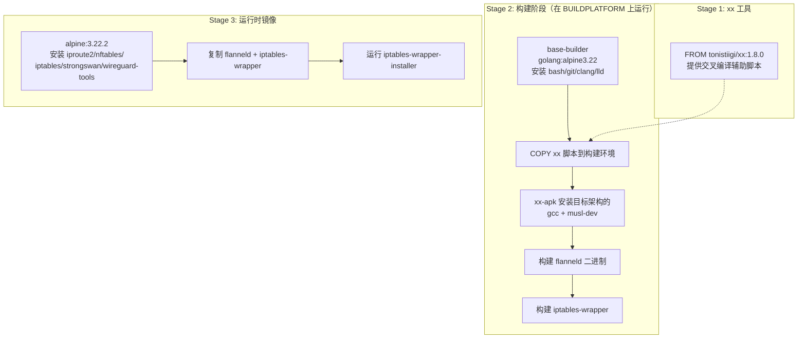
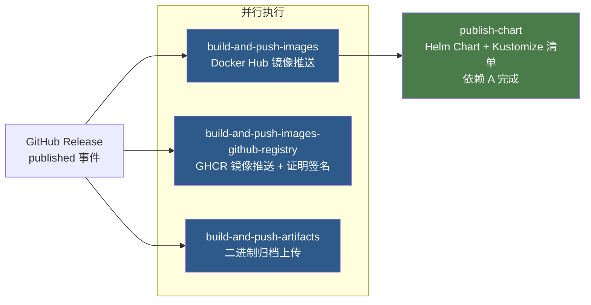
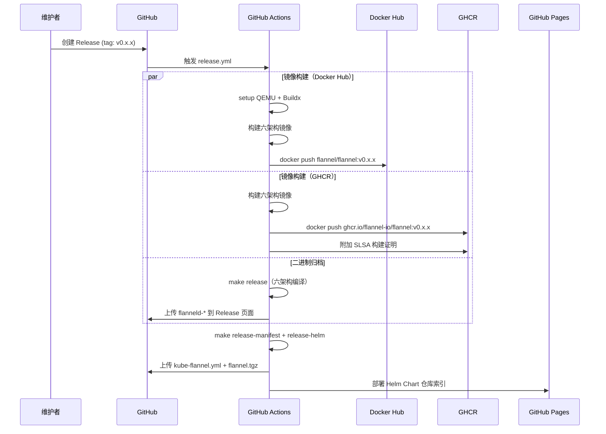

Flannel 的发布流程是一套基于 **GitHub Actions** 的全自动化流水线，覆盖从版本标签注入、六架构交叉编译、双注册表镜像推送、二进制产物归档到 Helm Chart 发布的完整生命周期。理解这套机制，不仅有助于维护者在发布新版本时做到心中有数，也能让高级开发者在定制私有构建时准确把握各环节的耦合关系。

Sources: [release.yml](.github/workflows/release.yml#L1-L204), [Makefile](Makefile#L1-L238), [Dockerfile](images/Dockerfile#L1-L53)

## 发布触发机制与版本号管理

Flannel 的发布由 **GitHub Release 事件** 驱动。当维护者在 GitHub 上创建并发布一个新 Release（对应一个 Git tag，如 `v0.28.4`）时，`release.yml` 工作流通过 `on: release: types: [published]` 自动触发。整个流程中不存在手动推送镜像或归档文件的步骤——所有构建、签名、上传均由 CI 完成。

版本号通过 **`-ldflags` 编译注入** 机制嵌入到二进制文件中。在 [version.go](pkg/version/version.go#L17) 中，`Version` 变量默认值为 `"dev"`，而 Makefile 在构建时通过 `-X github.com/flannel-io/flannel/pkg/version.Version=$(TAG)` 将其替换为实际的 Git tag 值。运行时，`flanneld --version` 会输出该注入值。

```makefile
# Makefile 中的 ldflags 注入（简化）
dist/flanneld:
    CGO_ENABLED=$(CGO_ENABLED) go build -o dist/flanneld \
      -ldflags '-s -w -X github.com/flannel-io/flannel/pkg/version.Version=$(TAG) -extldflags "-static"'
```

`TAG` 变量的默认值由 `git describe --tags --always` 自动生成，在 CI 环境中该值精确对应 Release 的 tag 名称。在 [release.yml](.github/workflows/release.yml#L29) 中，此值被显式写入环境变量：`echo "GIT_TAG=$(git describe --tags --always)" >> $GITHUB_ENV`，供后续所有 Job 共享使用。

Sources: [release.yml](.github/workflows/release.yml#L1-L11), [Makefile](Makefile#L31-L68), [version.go](pkg/version/version.go#L15-L18), [main.go](main.go#L215-L218)

## 多架构镜像构建：Dockerfile 与交叉编译策略

Flannel 支持以下 **六种 Linux 架构** 的容器镜像构建：

| 架构 | Docker Platform | 用途 |
|------|----------------|------|
| **amd64** | `linux/amd64` | x86_64 服务器（主流） |
| **arm64** | `linux/arm64` | ARM 服务器、Apple Silicon |
| **arm** | `linux/arm` | 32-bit ARM 设备（如树莓派） |
| **s390x** | `linux/s390x` | IBM Z 大型机 |
| **ppc64le** | `linux/ppc64le` | IBM Power 系统 |
| **riscv64** | `linux/riscv64` | RISC-V 平台（新兴） |

这种广泛的架构支持通过 Docker Buildx + QEMU 用户态模拟 + **tonistiigi/xx 交叉编译工具链** 的三层架构实现。

### Dockerfile 多阶段构建解析

[images/Dockerfile](images/Dockerfile#L1-L53) 采用了精心设计的三阶段多架构构建方案：



关键设计点在于 **构建阶段始终在宿主平台（`BUILDPLATFORM`）上执行**，而非目标平台。这意味着一台 amd64 的 CI Runner 可以同时为 arm64、s390x 等架构编译代码，完全不需要对应架构的硬件。`tonistiigi/xx` 工具链在此扮演核心角色——它通过 `xx-info` 系列命令（`xx-info os`、`xx-info arch`）将 Docker 的 `TARGETPLATFORM` 参数映射为正确的 `GOOS`/`GOARCH` 环境变量，同时通过 `xx-apk` 安装目标架构的原生 C 编译器和系统库。

另一个值得注意的细节是 CGO 的条件启用：在 [Makefile](Makefile#L33-L38) 中，只有 `amd64` 架构启用 CGO（因为 UDP 后端依赖 CGO），其余架构均以纯 Go 模式编译。但在 Dockerfile 的交叉编译环境中，所有架构都通过 `xx-apk add gcc musl-dev` 获得了对应架构的 C 工具链，确保了构建的通用性。

Sources: [Dockerfile](images/Dockerfile#L1-L53), [Makefile](Makefile#L33-L38), [Makefile](Makefile#L62-L81)

## Release 工作流：四阶段并行流水线

[release.yml](.github/workflows/release.yml#L1-L204) 定义了四个 **半并行** 执行的 Job，它们之间的关系如下：



### Job 1：Docker Hub 镜像推送（build-and-push-images）

此 Job 负责将多架构清单推送到 **Docker Hub** 的 `flannel/flannel` 仓库。它首先通过 `docker/metadata-action` 从 Git tag 自动生成镜像标签（例如 `v0.28.4`），然后使用 `docker/build-push-action` 一次性构建所有六架构的镜像并推送为统一的 **Docker Manifest List**。

重要限制条件：此 Job 仅在 **仓库所有者为 `flannel-io`** 时才执行推送（`if: github.repository_owner == 'flannel-io' && success()`），这防止了 Fork 仓库意外推送镜像到官方 Docker Hub。

Sources: [release.yml](.github/workflows/release.yml#L18-L71)

### Job 2：GHCR 镜像推送与供应链安全（build-and-push-images-github-registry）

此 Job 与 Job 1 结构几乎一致，但目标注册表改为 **GitHub Container Registry (GHCR)**，镜像地址为 `ghcr.io/flannel-io/flannel`。两者的关键区别在于：

1. **认证方式**：GHCR 使用 `GITHUB_TOKEN` 自动认证，无需额外 Secret
2. **构建来源签名**：通过 `actions/attest-build-provenance` 生成 **SLSA 构建来源证明**，附加到推送的镜像摘要上
3. **无仓库所有者限制**：任何 Fork 都可以在自己的 GHCR 命名空间下生成镜像

SLSA 来源签名是 Flannel 供应链安全策略的重要组成部分——消费者可以通过 `cosign` 工具验证镜像的构建来源，确认它确实由官方 CI 流水线生成。

Sources: [release.yml](.github/workflows/release.yml#L72-L131)

### Job 3：二进制归档（build-and-push-artifacts）

此 Job 执行 `make release`，为所有六架构分别编译静态链接的 `flanneld` 二进制文件，然后通过 `gh release upload` 将它们附加到 GitHub Release 页面。归档产物包括各架构的 tar.gz 压缩包，内容涵盖 `flanneld` 二进制、`mk-docker-opts.sh` 辅助脚本和 README。

在本地环境中，`make release` 的完整流程是：先下载 QEMU 用户态模拟器二进制（通过 SHA256 校验确保完整性），然后依次为每个架构通过 Docker 容器执行交叉编译，最终生成六个 `.docker` 格式的本地镜像文件。

Sources: [release.yml](.github/workflows/release.yml#L133-L163), [Makefile](Makefile#L163-L174)

### Job 4：Helm Chart 与 Kustomize 清单发布（publish-chart）

此 Job 在 Job 1 完成后执行，负责三件制品的生成与发布：

1. **Kustomize 清单**（`release-manifest`）：通过 `sed` 替换 [kustomization.yaml](Documentation/kustomization/kube-flannel/kustomization.yaml#L9) 中的 `newTag` 值为当前版本号，然后运行 `kubectl kustomize` 生成最终的 `kube-flannel.yml`
2. **Helm Chart 包**（`release-helm`）：替换 [values.yaml](chart/kube-flannel/values.yaml#L15) 中的镜像 tag，执行 `helm package` 打包，并更新 Chart 仓库索引
3. **GitHub Pages 部署**：将 Chart 目录部署到 GitHub Pages，供用户通过 `helm repo add` 消费

Sources: [release.yml](.github/workflows/release.yml#L165-L204), [Makefile](Makefile#L176-L187)

## CI 验证流水线：PR 构建与安全扫描

在正式发布之前，每个 Pull Request 都会触发 [build.yaml](.github/workflows/build.yaml#L1-L56) 验证流水线。与 release 流程的区别在于：PR 构建的镜像 **不推送**（`push: false`），仅验证多架构构建能否成功完成。此外，PR 构建还会额外编译 Windows 版本（`make dist/flanneld.exe`），但 Windows 二进制目前不在正式 Release 的多架构镜像范围内。

安全扫描方面，项目配置了三道防线：

| 扫描类型 | 工作流 | 触发条件 | 扫描目标 |
|----------|--------|----------|----------|
| **CodeQL** | [codeql-analysis.yml](.github/workflows/codeql-analysis.yml#L1-L78) | PR + 每周日 | Go 源码 |
| **Trivy** | [trivy.yml](.github/workflows/trivy.yml#L1-L54) | PR + 每周二 | Docker 镜像（amd64） |
| **OpenSSF Scorecard** | [scorecard.yml](.github/workflows/scorecard.yml) | 定期 | 供应链安全评估 |

Trivy 扫描特别值得关注：它在 CI 中先通过 `make image` 构建本地 amd64 Docker 镜像，然后对生成的 `.docker` 文件执行漏洞扫描，仅关注 `CRITICAL` 和 `HIGH` 级别的漏洞，并将结果以 SARIF 格式上传到 GitHub Security 面板。

Sources: [build.yaml](.github/workflows/build.yaml#L1-L56), [trivy.yml](.github/workflows/trivy.yml#L1-L54)

## 本地构建多架构镜像

对于需要自行构建镜像的场景（例如测试未发布的补丁），Makefile 提供了两套方案：

### 方案一：Docker Buildx 直接构建

```bash
# 前置：创建 Buildx 构建器
make buildx-create-builder

# 构建六架构 OCI 镜像包
make build-multi-arch TAG=v0.28.4-custom
```

此方案使用 `docker buildx build` 的 `-o type=oci` 输出模式，生成单个包含所有架构的 OCI tar 归档。适用于需要离线分发或导入到其他容器运行时的场景。

### 方案二：逐架构构建 + Docker Save

```bash
# 完整发布流程（下载 QEMU + 编译 + 打包）
make release TAG=v0.28.4-custom

# 或针对单架构
ARCH=arm64 make dist/flanneld-v0.28.4-custom-arm64.docker
```

此方案为每个架构生成独立的 `.docker` 镜像文件，可分别 `docker load` 后通过 `docker manifest create` 组合为多架构清单。Makefile 默认还会为 amd64 架构生成一个不带后缀的标签，使其成为默认镜像。

Sources: [Makefile](Makefile#L233-L238), [Makefile](Makefile#L83-L93), [Makefile](Makefile#L165-L174)

## QEMU 用户态模拟与安全校验

[Makefile](Makefile#L5-L28) 中定义了各架构 QEMU 静态二进制的下载地址和 **SHA256 校验值**。这些二进制来自 `multiarch/qemu-user-static` 项目，用于在非原生架构上执行编译命令。每个下载都经过严格的哈希校验：

```makefile
# QEMU 下载与校验（以 arm64 为例）
dist/qemu-arm64-static:
    wget -O dist/qemu-arm64-static \
      https://github.com/multiarch/qemu-user-static/releases/download/v7.2.0-1/qemu-aarch64-static
    echo "dce64b2d...  dist/qemu-arm64-static" | sha256sum --check --status
```

在 CI 环境中，这一步通过 `docker/setup-qemu-action` 自动完成，但在本地执行 `make release` 时，Makefile 会直接下载并校验这些二进制。当前使用的 QEMU 版本为 `v7.2.0-1`。

Sources: [Makefile](Makefile#L5-L28), [Makefile](Makefile#L188-L198)

## 版本更新涉及的文件清单

每次发布新版本时，维护者需要更新以下文件中的版本号引用。CI 流水线中的 `release-manifest` 和 `release-helm` 步骤会自动处理部分更新，但 `Chart.yaml` 中的版本号需要手动维护：

| 文件 | 版本字段 | 更新方式 |
|------|----------|----------|
| [Chart.yaml](chart/kube-flannel/Chart.yaml#L2) | `appVersion` / `version` | 手动更新 |
| [values.yaml](chart/kube-flannel/values.yaml#L15) | `flannel.image.tag` | CI 自动（`release-helm`） |
| [kustomization.yaml](Documentation/kustomization/kube-flannel/kustomization.yaml#L9) | `images.newTag` | CI 自动（`release-manifest`） |
| [pkg/version/version.go](pkg/version/version.go#L17) | `Version` | 编译时注入（`-ldflags`） |

Sources: [Chart.yaml](chart/kube-flannel/Chart.yaml#L1-L10), [values.yaml](chart/kube-flannel/values.yaml#L11-L19), [kustomization.yaml](Documentation/kustomization/kube-flannel/kustomization.yaml#L1-L10)

## 完整发布流程概览



Sources: [release.yml](.github/workflows/release.yml#L1-L204)

## 延伸阅读

- 关于 CI 流水线中各安全扫描工具的详细配置，参阅 [GitHub Actions CI/CD 流水线解析](23-github-actions-ci-cd-liu-shui-xian-jie-xi)
- 关于本地开发环境的构建配置，参阅 [构建与开发环境配置](3-gou-jian-yu-kai-fa-huan-jing-pei-zhi)
- 关于 Flannel 项目的贡献流程与维护者机制，参阅 [CONTRIBUTING.md](CONTRIBUTING.md) 和 [GOVERNANCE.md](GOVERNANCE.md)