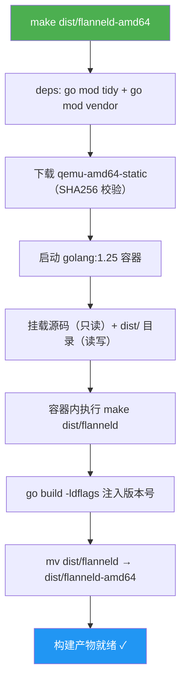
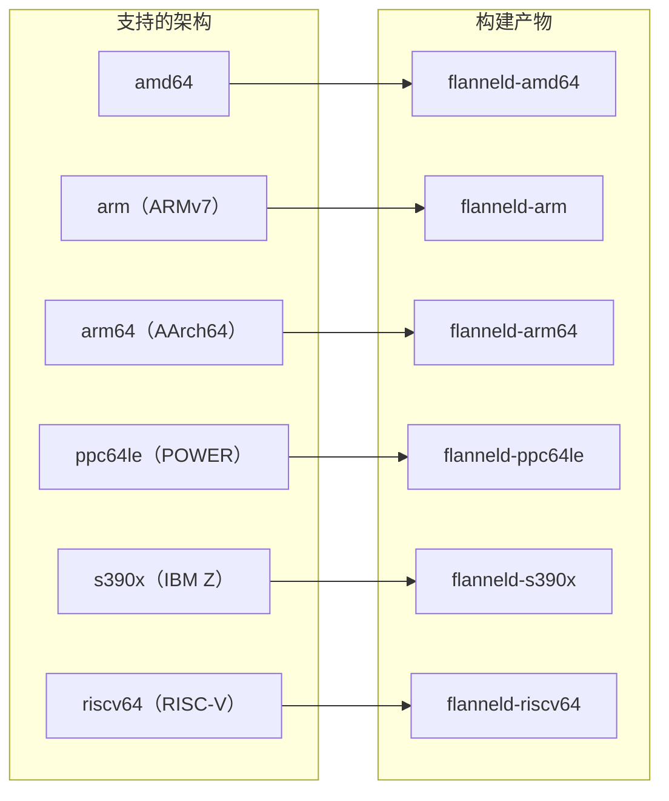
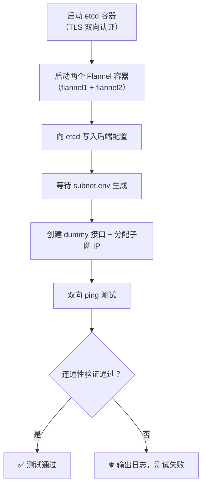
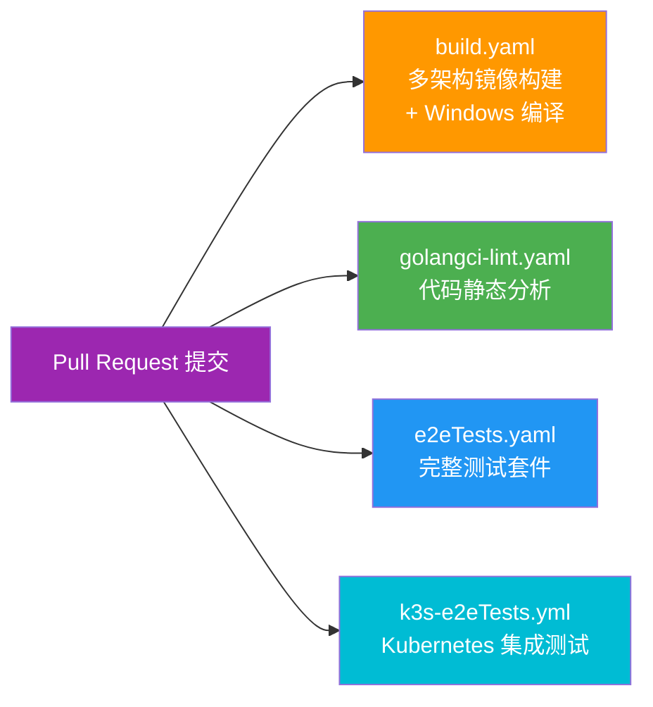
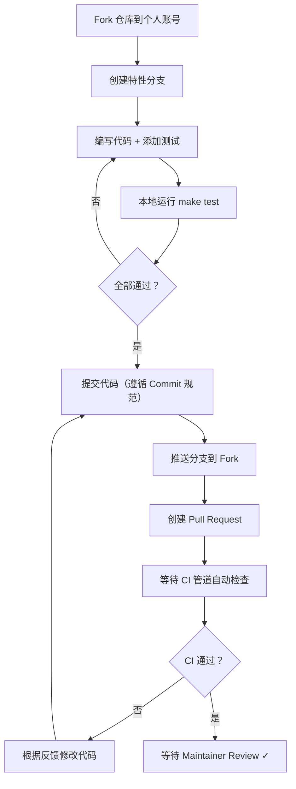

本文面向初次接触 Flannel 项目的开发者，系统性地介绍如何从零搭建开发环境、编译构建 `flanneld` 二进制文件、运行测试套件，以及理解项目构建体系的核心设计。掌握这些内容后，你将能够自如地参与 Flannel 的代码贡献与二次开发。

## 前置条件：工具链与依赖总览

Flannel 是一个纯 Go 语言项目，但因其 **UDP 后端**依赖 CGO 编译（仅在 `amd64` 架构上启用），所以构建过程比普通 Go 项目多了一些细节。以下表格汇总了开发环境所需的全部工具。

| 工具 | 最低版本要求 | 用途 | 是否必须 |
|------|------------|------|---------|
| **Go** | 1.25+ | 编译所有 Go 源码 | ✅ 必须 |
| **Docker** | 20.x+ | 容器化构建与运行测试 | ✅ 必须（推荐方式） |
| **Git** | 2.x | 版本控制与 `git describe` 生成 TAG | ✅ 必须 |
| **make** | GNU Make | 驱动 Makefile 中的构建目标 | ✅ 必须 |
| **gcc / musl-dev** | — | CGO 编译（仅 amd64 需要） | ⚠️ 条件必须 |
| **mingw-w64** | — | Windows 交叉编译 | ❌ 仅需 Windows 二进制时 |
| **qemu-user-static** | 7.2.0+ | 非 amd64 架构的交叉编译 | ❌ 仅交叉编译时 |
| **Docker Compose** | v2+ | 本地端到端测试 | ❌ 仅运行 e2e 测试时 |
| **kubectl** | — | k3s e2e 测试与手动部署验证 | ❌ 可选 |

Sources: [go.mod](go.mod#L1-L3), [Makefile](Makefile#L33-L41), [Documentation/building.md](Documentation/building.md#L40-L49)

## 快速开始：Docker 内构建（推荐方式）

**使用 Docker 容器构建是项目官方推荐的最可靠方式**——它完全屏蔽了宿主机环境差异，确保构建结果的一致性。你只需要安装好 Docker 和 GNU Make，一行命令即可完成编译。

```bash
# 步骤 1：克隆仓库（必须放在正确的 GOPATH 路径下）
mkdir -p $(go env GOPATH)/src/github.com/flannel-io
cd $(go env GOPATH)/src/github.com/flannel-io
git clone https://github.com/flannel-io/flannel.git
cd flannel

# 步骤 2：构建当前架构的 flanneld 二进制
make dist/flanneld-amd64
```

构建完成后，`dist/` 目录下将出现 `flanneld-amd64` 二进制文件。整个过程由 Makefile 通过 Docker 容器自动完成：它启动一个 `golang:1.25` 镜像，将源码以只读方式挂载进去，执行 `go build` 后将产物复制到宿主机的 `dist/` 目录。

Sources: [Documentation/building.md](Documentation/building.md#L1-L9), [Makefile](Makefile#L71-L81)

### 构建流程可视化

下面的流程图展示了 Docker 容器构建的完整生命周期：



Sources: [Makefile](Makefile#L62-L81)

## 原生构建：不使用 Docker

如果你的开发环境已经安装了 Go 1.25+ 和 GCC，也可以选择直接在宿主机上编译。这种方式速度更快，适合高频迭代开发。

```bash
# 确保源码在正确的 GOPATH 路径下
cd $GOPATH/src/github.com/flannel-io/flannel

# Linux 构建（必须启用 CGO）
CGO_ENABLED=1 make dist/flanneld

# Windows 交叉编译（需要安装 mingw-w64）
# Ubuntu: sudo apt-get install mingw-w64
CGO_ENABLED=1 make dist/flanneld.exe

# 开发者快速安装（不用于正式部署）
make install
```

**注意一个关键的架构差异**：`CGO_ENABLED` 的值取决于目标架构。Makefile 中有一段条件判断逻辑——仅当 `ARCH=amd64` 时启用 CGO（因为 UDP 后端的实现依赖 C 代码），其余架构关闭 CGO 以实现纯 Go 静态编译。

| 架构 | CGO_ENABLED | 原因 |
|------|-------------|------|
| `amd64` | `1` | UDP 后端需要 CGO |
| `arm` / `arm64` / `ppc64le` / `s390x` / `riscv64` | `0` | 纯 Go 编译，无 UDP 后端 |

Sources: [Makefile](Makefile#L33-L38), [Makefile](Makefile#L62-L68), [Makefile](Makefile#L224-L228)

## 版本注入机制

Flannel 的版本号并非硬编码在源码中，而是通过 **`-ldflags` 在编译时动态注入**。在 [pkg/version/version.go](pkg/version/version.go#L17) 中，`Version` 变量的默认值仅为 `"dev"`：

```go
// pkg/version/version.go
var Version = "dev"
```

Makefile 在编译时通过以下 `-ldflags` 参数覆盖这个值：

```makefile
-ldflags '-s -w -X github.com/flannel-io/flannel/pkg/version.Version=$(TAG) -extldflags "-static"'
```

其中 `$(TAG)` 的默认取值是 `git describe --tags --always`——它会优先使用最近的 Git tag（如 `v0.26.7`），如果没有 tag 则使用 commit hash。`-s -w` 参数用于去除调试符号以减小二进制体积。

Sources: [pkg/version/version.go](pkg/version/version.go#L15-L18), [Makefile](Makefile#L31-L64)

## 多架构与交叉编译

Flannel 支持六种 CPU 架构的构建，覆盖了主流的服务器和嵌入式平台：



### 单架构构建

```bash
# 构建 ARM64 二进制和镜像
ARCH=arm64 make image

# 构建 s390x
ARCH=s390x make image
```

### 交叉编译与 QEMU

如果你需要在 `amd64` 主机上为其他架构编译，需要安装 QEMU 用户态模拟器：

```bash
# Ubuntu 安装
sudo apt-get install qemu-user-static

# 然后即可交叉编译任意架构
ARCH=arm64 make image
```

Makefile 会在构建前自动下载对应架构的 QEMU 静态二进制文件到 `dist/` 目录，并通过 SHA256 校验确保文件完整性。

Sources: [Makefile](Makefile#L8-L28), [Makefile](Makefile#L188-L198), [Documentation/building.md](Documentation/building.md#L10-L20)

### 多架构 Docker 镜像

使用 Docker Buildx 可以一次性构建包含所有架构的 OCI 镜像：

```bash
# 首次使用需要创建 builder 实例
make buildx-create-builder

# 构建多架构 OCI 镜像
make build-multi-arch
```

产物将输出到 `dist/flannel_oci.tar`，包含 `linux/amd64`、`linux/arm64`、`linux/arm`、`linux/s390x`、`linux/ppc64le`、`linux/riscv64` 六个平台的镜像。

Sources: [Makefile](Makefile#L233-L237), [Documentation/building.md](Documentation/building.md#L22-L35)

## Docker 镜像构建详解

Flannel 的 Docker 镜像采用 **多阶段构建**（Multi-stage build），分为两个主要阶段：

```mermaid
flowchart TB
    subgraph "阶段 1: 构建阶段（base-builder）"
        B1["基础镜像: golang:alpine3.22"]
        B2["安装构建工具: bash, make, git, clang, lld, gcc, musl-dev"]
        B3["拷贝源码 + go mod download"]
        B4["make dist/flanneld"]
        B5["克隆并构建 iptables-wrappers"]
        B1 --> B2 --> B3 --> B4 --> B5
    end

    subgraph "阶段 2: 运行阶段（alpine:3.22.2）"
        R1["安装运行时依赖:<br/>iproute2, nftables, iptables,<br/>strongswan, wireguard-tools"]
        R2["拷贝 flanneld 到 /opt/bin/"]
        R3["拷贝 iptables-wrapper"]
        R4["配置 iptables-wrapper-installer"]
        R5["ENTRYPOINT: /opt/bin/flanneld"]
        R1 --> R2 --> R3 --> R4 --> R5
    end

    B4 -.-> "产物传递" .-> R2
    B5 -.-> "产物传递" .-> R3

    style B1 fill:#FF9800,color:#fff
    style R1 fill:#4CAF50,color:#fff
```

这种设计使得最终镜像仅包含运行时所需的最小组件，体积远小于包含完整编译工具链的构建镜像。

Sources: [images/Dockerfile](images/Dockerfile#L1-L52)

## 测试体系

Flannel 的测试体系分为四个层次，从快速反馈到全链路验证逐级递进：

| 测试层次 | 命令 | 运行环境 | 覆盖范围 | 耗时 |
|---------|------|---------|---------|------|
| **代码规范检查** | `make gofmt` | Docker 容器 | 源码格式化合规性 | < 1 分钟 |
| **模块验证** | `make verify-modules` | Docker 容器 | `go mod tidy` + `go vet` | < 1 分钟 |
| **许可证检查** | `make license-check` | 本地 Shell | 每个 `.go` 文件头部 4 行 | < 10 秒 |
| **单元测试** | `make unit-test` | Docker 容器（NET_ADMIN + SYS_ADMIN） | 6 个核心包 | 约 5 分钟 |
| **功能测试** | `make e2e-test` | Docker 容器 | 多后端 ping 连通性 | 约 10 分钟 |
| **完整测试** | `make test` | Docker 容器 | 以上全部 + mk-docker-opts 脚本测试 | 约 15 分钟 |

Sources: [Makefile](Makefile#L94-L117)

### 运行完整测试

```bash
# 一键运行所有测试（许可证 → 格式 → 依赖 → 单元测试 → 功能测试）
make test
```

`make test` 会依次执行：`license-check` → `gofmt` → `deps` → `verify-modules` → `unit-test` → `mk-docker-opts_tests.sh` → `e2e-test`。任何一步失败都会立即中断。

Sources: [Makefile](Makefile#L95-L103)

### 单元测试详解

单元测试在 Docker 容器中运行，需要 `NET_ADMIN` 和 `SYS_ADMIN` 两个 Linux capability——这是因为部分网络操作（如创建网络命名空间、操作网络接口）需要特权。默认测试覆盖以下 6 个核心包：

| 包路径 | 测试文件数 | 测试内容 |
|--------|----------|---------|
| `pkg/ip` | 4 | IP 地址解析、网段计算、接口查找 |
| `pkg/subnet` | 3 | 子网配置解析、事件处理、通用逻辑 |
| `pkg/subnet/etcd` | 2 | etcd 子网注册与租约管理 |
| `pkg/subnet/kube` | 2 | Kubernetes 注解解析与子网管理 |
| `pkg/trafficmngr` | 2+ | iptables/nftables 规则管理 |
| `pkg/backend` | 1 | 路由网络通用逻辑 |

```bash
# 运行默认包的单元测试
make unit-test

# 运行指定包的覆盖率分析
PACKAGES=pkg/ip make cover
```

Sources: [Makefile](Makefile#L49-L50), [Makefile](Makefile#L104-L128)

### 端到端（E2E）功能测试

E2E 测试使用 **bash_unit** 框架，通过 Docker 容器模拟多节点网络环境，验证各后端的实际连通性。测试覆盖的后端包括：`vxlan`、`host-gw`、`ipip`、`ipsec`、`wireguard`，以及 `amd64` 独有的 `udp` 后端。



此外，还有一个基于 **k3s** 的 E2E 测试套件，它通过 Docker Compose 启动一个多节点的 k3s 集群，在真实 Kubernetes 环境中验证 Flannel 的部署与运行：

```bash
# 运行 k3s E2E 测试
make k3s-e2e-test
```

Sources: [Makefile](Makefile#L114-L123), [dist/functional-test.sh](dist/functional-test.sh#L1-L54), [e2e/docker-compose.yml](e2e/docker-compose.yml#L1-L39)

## 代码质量保障

除了测试之外，Flannel 还通过以下机制保障代码质量：

### 代码格式化

```bash
# 检查代码是否符合 gofmt 标准（不符合则报错）
make gofmt

# 如果需要自动格式化，手动执行：
gofmt -w pkg/
```

### 许可证头检查

每个 `.go` 文件的**前 4 行**必须包含 `Copyright` 关键字或 `generated`/`GENERATED` 标记。`license-check.sh` 脚本会扫描所有非 vendor 目录下的 Go 文件，确保许可证头合规。

```bash
make license-check
```

### golangci-lint 静态分析

CI 管道使用 **golangci-lint v2.7.2** 进行静态分析，超时时间为 5 分钟。本地开发时建议安装并配置 Git pre-commit hook 以在提交前自动运行 lint。

Sources: [Makefile](Makefile#L130-L155), [dist/license-check.sh](dist/license-check.sh#L1-L10), [.github/workflows/golangci-lint.yaml](.github/workflows/golangci-lint.yaml#L1-L26)

## CI 管道概览

Flannel 使用 **GitHub Actions** 作为持续集成平台，每个 Pull Request 都会自动触发以下工作流：



| 工作流 | 触发条件 | 主要步骤 | 运行环境 |
|--------|---------|---------|---------|
| `build.yaml` | 每个 PR | 多架构 Docker 镜像构建（6 平台）+ Windows 二进制编译 | `ubuntu-latest` |
| `golangci-lint.yaml` | 每个 PR | golangci-lint v2.7.2 静态分析 | `ubuntu-latest` |
| `e2eTests.yaml` | 每个 PR | `make test` 完整测试套件 | `ubuntu-latest` |
| `k3s-e2eTests.yml` | 每个 PR | k3s 集群 E2E 测试 | `ubuntu-latest` |

Sources: [.github/workflows/build.yaml](.github/workflows/build.yaml#L1-L56), [.github/workflows/e2eTests.yaml](.github/workflows/e2eTests.yaml#L1-L35), [.github/workflows/k3s-e2eTests.yml](.github/workflows/k3s-e2eTests.yml#L1-L31)

## 常见问题排查

| 问题 | 原因 | 解决方案 |
|------|------|---------|
| `go build` 报 CGO 错误 | amd64 架构需要 GCC | 安装 `gcc`，或使用 `make dist/flanneld-amd64`（Docker 方式） |
| 单元测试权限不足 | 网络/命名空间操作需要特权 | 使用 `make unit-test`（自动添加 `--cap-add=NET_ADMIN --cap-add=SYS_ADMIN`） |
| 交叉编译失败 | 缺少 QEMU 模拟器 | 安装 `qemu-user-static`，或让 Makefile 自动下载 |
| `license-check` 失败 | 新增 `.go` 文件缺少版权头 | 在文件头部添加标准 Apache 2.0 许可证声明（前 4 行需含 `Copyright`） |
| `gofmt` 检查失败 | 代码格式不符合 `gofmt` 标准 | 执行 `gofmt -w <file>` 自动格式化 |
| Windows 编译失败 | 缺少 `mingw-w64` 交叉编译工具 | 执行 `sudo apt-get install mingw-w64` |

Sources: [Makefile](Makefile#L33-L38), [Documentation/building.md](Documentation/building.md#L40-L49)

## 开发者工作流建议

当你准备为 Flannel 贡献代码时，建议遵循以下工作流：



**Commit 消息格式**：遵循 `<subsystem>: <what changed>` 约定，首行不超过 70 字符，空一行后说明变更原因。例如：`vxlan: add support for IPv6 direct routing`。

Sources: [CONTRIBUTING.md](CONTRIBUTING.md#L29-L70)

## 下一步阅读

至此，你已经掌握了 Flannel 的构建与开发环境配置。以下是推荐的后续阅读路径：

- **部署定制**：了解如何通过 Helm Chart 灵活配置部署参数 → [使用 Helm Chart 自定义部署](4-shi-yong-helm-chart-zi-ding-yi-bu-shu)
- **架构深入**：理解从 `main.go` 到各子系统的完整启动链路 → [整体架构：从 main.go 到各子系统的启动流程](5-zheng-ti-jia-gou-cong-main-go-dao-ge-zi-xi-tong-de-qi-dong-liu-cheng)
- **测试体系**：深入理解 CI/CD 管道的每一个细节 → [GitHub Actions CI/CD 流水线解析](23-github-actions-ci-cd-liu-shui-xian-jie-xi)