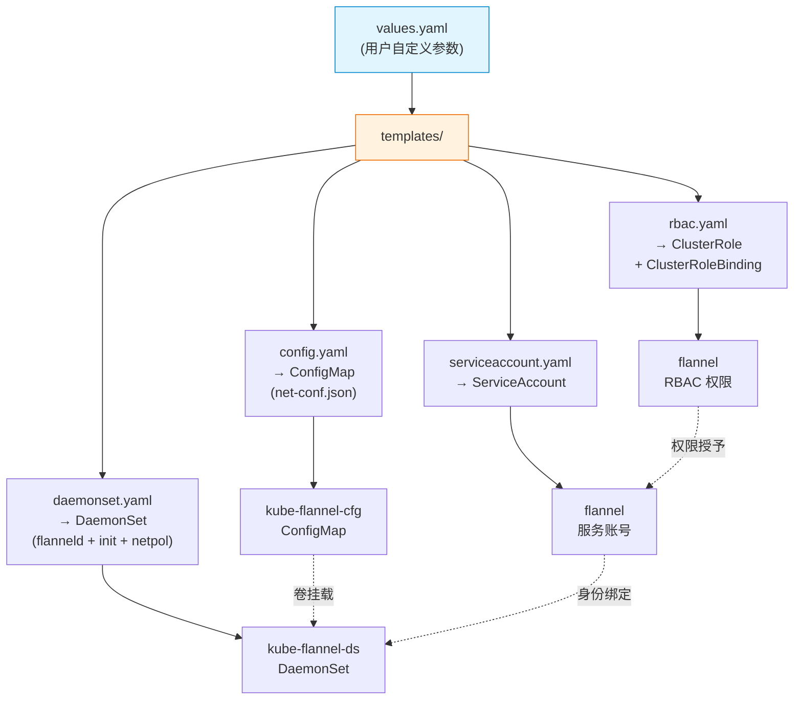

当你需要将 Flannel 以参数化、可版本管理的方式集成到 Kubernetes 集群时，Helm Chart 提供了比静态 YAML 清单更灵活的部署路径。本页面深入解析仓库内置的 Helm Chart 结构，帮助你掌握从基础安装到高级自定义的完整工作流——涵盖后端选择、双栈配置、资源调优、NetworkPolicy 集成等核心场景。

Sources: [chart/README.md](chart/README.md), [chart/kube-flannel/Chart.yaml](chart/kube-flannel/Chart.yaml#L1-L10)

## Chart 总体结构

Flannel 的 Helm Chart 位于 `chart/kube-flannel/` 目录下，遵循标准的 Helm 项目布局。与 [快速上手：在 Kubernetes 集群中部署 Flannel](2-kuai-su-shang-shou-zai-kubernetes-ji-qun-zhong-bu-shu-flannel) 中使用的静态清单 `kube-flannel.yml` 相比，Chart 将所有可配置项抽取为 `values.yaml` 参数，通过 Go 模板引擎动态渲染出等效的 Kubernetes 资源。



整个 Chart 渲染后生成 **四类** Kubernetes 资源，它们之间的依赖关系如上图所示：ConfigMap 为 DaemonSet 提供网络配置文件，ServiceAccount 为 DaemonSet 提供运行身份，RBAC 则授予该身份必要的 API 访问权限。

Sources: [chart/kube-flannel/Chart.yaml](chart/kube-flannel/Chart.yaml#L1-L10), [chart/kube-flannel/values.yaml](chart/kube-flannel/values.yaml#L1-L105)

## 快速安装

### 前置条件

在开始之前，请确保具备以下条件：

| 条件 | 说明 |
|------|------|
| Helm 3.x | 已安装并配置好 kubeconfig |
| Kubernetes 集群 | 版本 ≥ 1.22，节点 OS 为 Linux |
| 网络插件未安装 | 若已有其他 CNI 插件需先卸载，避免冲突 |

### 从本地 Chart 安装

最直接的方式是克隆仓库后从本地路径安装：

```bash
# 克隆仓库
git clone https://github.com/flannel-io/flannel.git
cd flannel

# 安装到 kube-flannel 命名空间（自动创建）
helm install flannel ./chart/kube-flannel \
  --namespace kube-flannel \
  --create-namespace
```

安装完成后，可以通过以下命令验证：

```bash
# 检查 DaemonSet 是否在每个节点运行
kubectl get pods -n kube-flannel -o wide

# 查看 Flannel 生成的网络配置
kubectl get configmap kube-flannel-cfg -n kube-flannel -o yaml
```

### 从 OCI Registry 安装（推荐生产使用）

如果你希望避免本地克隆，可以直接使用 Helm 的 OCI 支持（需确认仓库是否已发布至容器镜像仓库）：

```bash
helm install flannel oci://ghcr.io/flannel-io/charts/flannel \
  --namespace kube-flannel \
  --create-namespace
```

Sources: [chart/kube-flannel/Chart.yaml](chart/kube-flannel/Chart.yaml#L1-L10), [chart/kube-flannel/templates/daemonset.yaml](chart/kube-flannel/templates/daemonset.yaml#L1-L30)

## values.yaml 参数全景

`values.yaml` 是 Chart 自定义的核心入口。下表按功能域分类列出所有可配置参数及其默认值，帮助你在不修改模板的前提下完成绝大多数定制需求。

### 全局与网络参数

| 参数路径 | 默认值 | 说明 |
|----------|--------|------|
| `global.imagePullSecrets` | `[]` | 全局镜像拉取密钥列表，用于私有仓库认证 |
| `podCidr` | `"10.244.0.0/16"` | IPv4 Pod CIDR 地址池，Pod IP 将从此范围分配 |
| `podCidrv6` | `""` | IPv6 Pod CIDR 地址池，设置后启用双栈模式 |

### Flannel 核心配置

| 参数路径 | 默认值 | 说明 |
|----------|--------|------|
| `flannel.image.repository` | `ghcr.io/flannel-io/flannel` | Flannel 主镜像仓库地址 |
| `flannel.image.tag` | `v0.28.4` | Flannel 主镜像标签 |
| `flannel.flannel_cni.image.repository` | `ghcr.io/flannel-io/flannel-cni-plugin` | CNI 插件镜像仓库地址 |
| `flannel.flannel_cni.image.tag` | `v1.9.1-flannel1` | CNI 插件镜像标签 |
| `flannel.cniBinDir` | `"/opt/cni/bin"` | CNI 二进制文件的安装目录 |
| `flannel.cniConfDir` | `"/etc/cni/net.d"` | CNI 配置文件的存放目录 |
| `flannel.skipCNIConfigInstallation` | `false` | 跳过 CNI 配置文件安装，适用于外部提供配置的场景 |
| `flannel.enableNFTables` | `false` | 启用 nftables 替代 iptables（实验性） |
| `flannel.args` | `["--ip-masq", "--kube-subnet-mgr"]` | 传递给 flanneld 的命令行参数列表 |
| `flannel.backend` | `"vxlan"` | 后端类型：`vxlan`、`host-gw`、`wireguard`、`udp` |

### 后端专用参数

| 参数路径 | 适用后端 | 默认值 | 说明 |
|----------|----------|--------|------|
| `flannel.backendPort` | vxlan / wireguard / udp | `0`（使用默认值） | 后端监听端口，VXLAN 默认 8472、WireGuard 默认 51821、UDP 默认 8285 |
| `flannel.vni` | vxlan | `1` | VXLAN 网络标识符 |
| `flannel.GBP` | vxlan | `false` | 启用 VXLAN Group Based Policy |
| `flannel.directRouting` | vxlan | `false` | 启用同子网直连路由 |
| `flannel.macPrefix` | vxlan（Windows） | `"0E-2A"` | Windows 上使用的 MAC 地址前缀 |
| `flannel.mtu` | vxlan / wireguard | 未设置（使用外部接口 MTU） | 出站数据包的 MTU 值 |
| `flannel.backendPortv6` | wireguard | `51821` | WireGuard IPv6 监听端口 |
| `flannel.psk` | wireguard | `0` | WireGuard 预共享密钥 |
| `flannel.tunnelMode` | wireguard | `"separate"` | WireGuard 隧道模式 |
| `flannel.keepaliveInterval` | wireguard | `0` | WireGuard 持久保活间隔 |

### DaemonSet 调度与资源

| 参数路径 | 默认值 | 说明 |
|----------|--------|------|
| `flannel.resources.requests.cpu` | `100m` | CPU 请求量 |
| `flannel.resources.requests.memory` | `50Mi` | 内存请求量 |
| `flannel.tolerations` | `NoExecute:Exists, NoSchedule:Exists` | 容忍度，默认允许调度到所有节点 |
| `flannel.nodeSelector` | `{}` | 节点选择器，用于限定 Pod 调度范围 |

### NetworkPolicy 控制器

| 参数路径 | 默认值 | 说明 |
|----------|--------|------|
| `netpol.enabled` | `false` | 是否启用 NetworkPolicy 控制器 sidecar |
| `netpol.args` | `["--hostname-override=$(MY_NODE_NAME)", "--v=2"]` | netpol 控制器启动参数 |
| `netpol.image.repository` | `registry.k8s.io/networking/kube-network-policies` | netpol 镜像仓库 |
| `netpol.image.tag` | `v1.0.0` | netpol 镜像标签 |

Sources: [chart/kube-flannel/values.yaml](chart/kube-flannel/values.yaml#L1-L105)

## 配置模板渲染逻辑

理解模板如何将 `values.yaml` 中的参数转化为最终的 Kubernetes 资源，是进行高级自定义的基础。下面逐一解析各模板的核心渲染逻辑。

### ConfigMap 模板：net-conf.json 的动态生成

`config.yaml` 模板最关键的部分是 `net-conf.json` 的生成。它根据 `flannel.backend` 的值选择不同的条件分支，输出对应的后端配置 JSON。其渲染逻辑可用以下流程图概括：

```mermaid
flowchart TD
    Start["podCidr 是否设置？"] -->|"是"| A["\"Network\": podCidr"]
    Start -->|"否"| B["\"EnableIPv4\": false"]
    A --> C["podCidrv6 是否设置？"]
    B --> C
    C -->|"是"| D["\"IPv6Network\": podCidrv6<br/>\"EnableIPv6\": true"]
    C -->|"否"| E["跳过 IPv6 配置"]
    D --> F["enableNFTables？"]
    E --> F
    F -->|"是"| G["\"EnableNFTables\": true"]
    F -->|"否"| H["backend 类型判断"]
    G --> H
    H -->|vxlan| I["渲染 Port/VNI/GBP/<br/>DirectRouting/MTU/MacPrefix"]
    H -->|wireguard| J["渲染 ListenPort/ListenPortV6/<br/>PSK/MTU/Mode/Keepalive"]
    H -->|udp| K["渲染 Port"]
    H -->|其他<br/>host-gw| L["仅输出 Type 字段"]
    
    I --> End["输出完整 net-conf.json"]
    J --> End
    K --> End
    L --> End
    
    style Start fill:#e3f2fd,stroke:#1565c0
    style End fill:#e8f5e9,stroke:#2e7d32
```

值得注意的是，所有后端专用参数都采用了**条件渲染**——仅当对应值被设置时才输出到 JSON 中。这意味着当你使用默认的 `values.yaml`（只设置了 `backend: "vxlan"` 而未设置 `vni`、`GBP` 等参数），生成的 `net-conf.json` 将只包含 `"Type": "vxlan"` 这一个后端字段，其余保持后端默认值。

Sources: [chart/kube-flannel/templates/config.yaml](chart/kube-flannel/templates/config.yaml#L1-L76)

### DaemonSet 模板：容器编排策略

DaemonSet 模板是整个 Chart 最复杂的模板，它编排了多个容器和初始化容器：

**初始化容器阶段** — DaemonSet 始终包含 `install-cni-plugin` 容器，负责将 CNI 二进制文件复制到宿主机的 `/opt/cni/bin` 目录。当 `flannel.skipCNIConfigInstallation` 为 `false`（默认值）时，还会添加 `install-cni` 容器，将 ConfigMap 中的 `cni-conf.json` 复制到 `/etc/cni/net.d/10-flannel.conflist`。这一设计允许你在需要外部管理 CNI 配置的场景中跳过此步骤。

**主容器阶段** — `kube-flannel` 容器运行 `flanneld` 进程，通过 `flannel.args` 数组注入命令行参数。容器以非特权模式运行（`privileged: false`），但通过 Linux capabilities 添加了 `NET_ADMIN` 和 `NET_RAW` 权限，满足网络配置需求。

**NetworkPolicy Sidecar** — 当 `netpol.enabled` 设为 `true` 时，模板会在主容器旁注入 `kube-network-policies` sidecar 容器，同时在 RBAC 模板中添加对 `networkpolicies`、`adminnetworkpolicies` 和 `baselineadminnetworkpolicies` 资源的 `list` 和 `watch` 权限。

Sources: [chart/kube-flannel/templates/daemonset.yaml](chart/kube-flannel/templates/daemonset.yaml#L1-L153), [chart/kube-flannel/templates/rbac.yaml](chart/kube-flannel/templates/rbac.yaml#L1-L52)

## 常见自定义场景

### 场景一：切换至 host-gw 后端

host-gw 后端适用于节点间二层可达的网络环境，性能优于 VXLAN。创建自定义 values 文件：

```yaml
# custom-values-hostgw.yaml
flannel:
  backend: "host-gw"
  args:
  - "--ip-masq"
  - "--kube-subnet-mgr"
```

```bash
helm install flannel ./chart/kube-flannel \
  --namespace kube-flannel \
  --create-namespace \
  -f custom-values-hostgw.yaml
```

此时模板将走 `config.yaml` 中的 `else` 分支，`net-conf.json` 中 Backend 块仅包含 `"Type": "host-gw"`，不带任何额外参数。

Sources: [chart/kube-flannel/templates/config.yaml](chart/kube-flannel/templates/config.yaml#L70-L74)

### 场景二：WireGuard 加密隧道 + 自定义 MTU

在需要加密网络传输的场景下，WireGuard 后端提供内核级加密性能：

```yaml
# custom-values-wireguard.yaml
flannel:
  backend: "wireguard"
  backendPort: 51820
  mtu: 1400
  psk: "my-preshared-key"
  keepaliveInterval: 25
  args:
  - "--ip-masq"
  - "--kube-subnet-mgr"
```

渲染后，`net-conf.json` 将包含 WireGuard 专用字段：

```json
{
  "Network": "10.244.0.0/16",
  "Backend": {
    "ListenPort": 51820,
    "PSK": "my-preshared-key",
    "MTU": 1400,
    "PersistentKeepaliveInterval": 25,
    "Type": "wireguard"
  }
}
```

Sources: [chart/kube-flannel/templates/config.yaml](chart/kube-flannel/templates/config.yaml#L46-L65)

### 场景三：启用双栈（IPv4 + IPv6）

双栈模式要求同时设置 `podCidr` 和 `podCidrv6`：

```yaml
# custom-values-dualstack.yaml
podCidr: "10.244.0.0/16"
podCidrv6: "fd00::/48"
flannel:
  backend: "vxlan"
  args:
  - "--ip-masq"
  - "--kube-subnet-mgr"
```

模板检测到 `podCidrv6` 非空后，会在 `net-conf.json` 中自动注入 `"IPv6Network": "fd00::/48"` 和 `"EnableIPv6": true`。

Sources: [chart/kube-flannel/templates/config.yaml](chart/kube-flannel/templates/config.yaml#L18-L21), [chart/kube-flannel/values.yaml](chart/kube-flannel/values.yaml#L8-L9)

### 场景四：节点选择器与资源调优

在混合节点类型的集群中，你可能只想让 Flannel 运行在特定节点上，并调整资源限制：

```yaml
# custom-values-tuning.yaml
flannel:
  nodeSelector:
    node-role.kubernetes.io/worker: "true"
  resources:
    requests:
      cpu: 200m
      memory: 100Mi
    limits:
      cpu: 500m
      memory: 256Mi
  tolerations:
  - effect: NoExecute
    operator: Exists
  - effect: NoSchedule
    operator: Exists
  - key: "special-taint"
    effect: NoSchedule
    operator: Equal
    value: "flannel-allowed"
```

Sources: [chart/kube-flannel/templates/daemonset.yaml](chart/kube-flannel/templates/daemonset.yaml#L30-L37), [chart/kube-flannel/templates/daemonset.yaml](chart/kube-flannel/templates/daemonset.yaml#L74-L77)

### 场景五：启用 NetworkPolicy 支持

Flannel 默认不提供 NetworkPolicy 实现。通过 Chart 可以一键启用 `kube-network-policies` sidecar：

```yaml
# custom-values-netpol.yaml
netpol:
  enabled: true
  args:
  - "--hostname-override=$(MY_NODE_NAME)"
  - "--v=2"
flannel:
  args:
  - "--ip-masq"
  - "--kube-subnet-mgr"
```

启用后，DaemonSet 中会注入额外的 `kube-network-policies` 容器，RBAC 中会自动添加对 `networkpolicies`、`adminnetworkpolicies` 和 `baselineadminnetworkpolicies` 资源的访问权限，并挂载宿主机的 `/lib/modules` 目录。

Sources: [chart/kube-flannel/templates/daemonset.yaml](chart/kube-flannel/templates/daemonset.yaml#L102-L127), [chart/kube-flannel/templates/rbac.yaml](chart/kube-flannel/templates/rbac.yaml#L22-L38)

### 场景六：私有镜像仓库

在企业环境中，通常需要将镜像同步到内部仓库并通过 `imagePullSecrets` 认证：

```yaml
# custom-values-private-registry.yaml
global:
  imagePullSecrets:
  - name: "registry-credentials"
flannel:
  image:
    repository: internal-registry.example.com/networking/flannel
    tag: v0.28.4
  flannel_cni:
    image:
      repository: internal-registry.example.com/networking/flannel-cni-plugin
      tag: v1.9.1-flannel1
```

模板通过 `{{- if .Values.global.imagePullSecrets }}` 条件块，仅在有密钥配置时才在 Pod spec 中添加 `imagePullSecrets` 字段。

Sources: [chart/kube-flannel/templates/daemonset.yaml](chart/kube-flannel/templates/daemonset.yaml#L150-L152)

## Chart 内置测试

Chart 包含了基于 [helm-unittest](https://github.com/helm-unittest/helm-unittest) 插件的单元测试套件，位于 `tests/daemonset_test.yaml`。这些测试覆盖了以下关键渲染场景：

| 测试用例 | 验证内容 |
|----------|----------|
| API 版本和类型 | DaemonSet 使用 `apps/v1` API，名称为 `kube-flannel-ds` |
| 镜像覆盖 | 自定义 `repository` 和 `tag` 后，主容器和 `install-cni` init 容器镜像正确渲染 |
| CNI 插件镜像 | 自定义 `flannel_cni` 镜像后，`install-cni-plugin` init 容器镜像正确渲染 |
| 命令行参数 | `flannel.args` 数组正确附加到 `flanneld` 命令后 |
| 镜像拉取密钥 | `global.imagePullSecrets` 正确注入到 Pod spec |
| CNI 配置安装控制 | `skipCNIConfigInstallation: true` 时 `install-cni` 容器被移除 |
| 节点选择器 | `nodeSelector` 键值对正确渲染到 Pod spec |

运行测试的方法：

```bash
# 安装 helm-unittest 插件（首次）
helm plugin install https://github.com/helm-unittest/helm-unittest.git

# 执行测试
helm unittest ./chart/kube-flannel
```

Sources: [chart/kube-flannel/tests/daemonset_test.yaml](chart/kube-flannel/tests/daemonset_test.yaml#L1-L85)

## Helm 部署 vs 静态清单：对比决策

在决定使用 Helm Chart 还是静态 YAML 清单时，以下对比可以帮助你做出选择：

| 维度 | Helm Chart (`chart/`) | 静态清单 (`Documentation/kube-flannel.yml`) |
|------|----------------------|---------------------------------------------|
| **参数化** | 全部配置通过 `values.yaml` 管理 | 需手动编辑 YAML 文件 |
| **版本管理** | Chart 版本与应用版本同步（`Chart.yaml`） | 无独立版本标识 |
| **回滚能力** | `helm rollback` 一键回滚 | 需 `kubectl apply` 旧版本文件 |
| **可测试性** | 内置 helm-unittest 测试套件 | 无结构化测试 |
| **扩展性** | 支持叠加多个 `-f values` 文件 | 需使用 kustomize 或手动 patch |
| **NetworkPolicy** | 一键启用 sidecar | 需手动修改 YAML |
| **学习成本** | 需要 Helm 工具链 | 直接 `kubectl apply` |
| **CI/CD 集成** | 原生支持 Helm release 管理 | 需自行编排部署流程 |

**推荐策略**：对于需要长期维护、多环境部署或团队协作的生产集群，优先使用 Helm Chart；对于一次性测试或简单场景，静态清单仍然是最快捷的选项。

Sources: [chart/kube-flannel/values.yaml](chart/kube-flannel/values.yaml#L1-L105), [Documentation/kube-flannel.yml](Documentation/kube-flannel.yml#L1-L212)

## 升级与维护

使用 Helm 管理的 Flannel 实例，升级操作非常简洁：

```bash
# 更新到新版本（修改 values.yaml 中的 tag 或 Chart 版本后）
helm upgrade flannel ./chart/kube-flannel \
  --namespace kube-flannel \
  -f custom-values.yaml

# 查看当前部署状态
helm status flannel -n kube-flannel

# 查看部署历史（用于回滚）
helm history flannel -n kube-flannel

# 回滚到上一版本
helm rollback flannel -n kube-flannel
```

**注意事项**：
- `flannel.backend` 不应在运行时更改。后端类型的切换需要先卸载再重新安装，否则可能导致网络中断
- 升级过程中 DaemonSet 将逐个节点滚动更新，每个节点会经历短暂的网络中断
- 如果使用了自定义的 `podCidr`，确保新版本的 CIDR 与集群的 Node CIDR 配置一致

Sources: [chart/kube-flannel/Chart.yaml](chart/kube-flannel/Chart.yaml#L1-L10), [chart/kube-flannel/values.yaml](chart/kube-flannel/values.yaml#L30-L35)

## 下一步

掌握了 Helm Chart 的自定义部署后，建议继续深入以下主题：

- **[整体架构：从 main.go 到各子系统的启动流程](5-zheng-ti-jia-gou-cong-main-go-dao-ge-zi-xi-tong-de-qi-dong-liu-cheng)** — 理解 Flannel 启动后各组件如何协作，将 Helm 配置参数与实际运行行为关联起来
- **[VXLAN 后端：内核态封装与直连路由](6-vxlan-hou-duan-nei-he-tai-feng-zhuang-yu-zhi-lian-lu-you)** — 深入理解默认后端的工作原理，掌握 `vni`、`directRouting` 等参数的实际效果
- **[网络配置详解：JSON 配置、命令行参数与环境变量](17-wang-luo-pei-zhi-xiang-jie-json-pei-zhi-ming-ling-xing-can-shu-yu-huan-jing-bian-liang)** — 了解 Helm 模板之外的全部配置方式，理解 `flannel.args` 中各标志位的含义
- **[双栈与纯 IPv6 模式：多协议网络支持](18-shuang-zhan-yu-chun-ipv6-mo-shi-duo-xie-yi-wang-luo-zhi-chi)** — 深入探索 `podCidrv6` 启用后的双栈网络行为