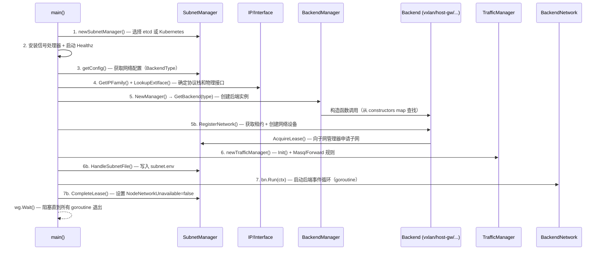
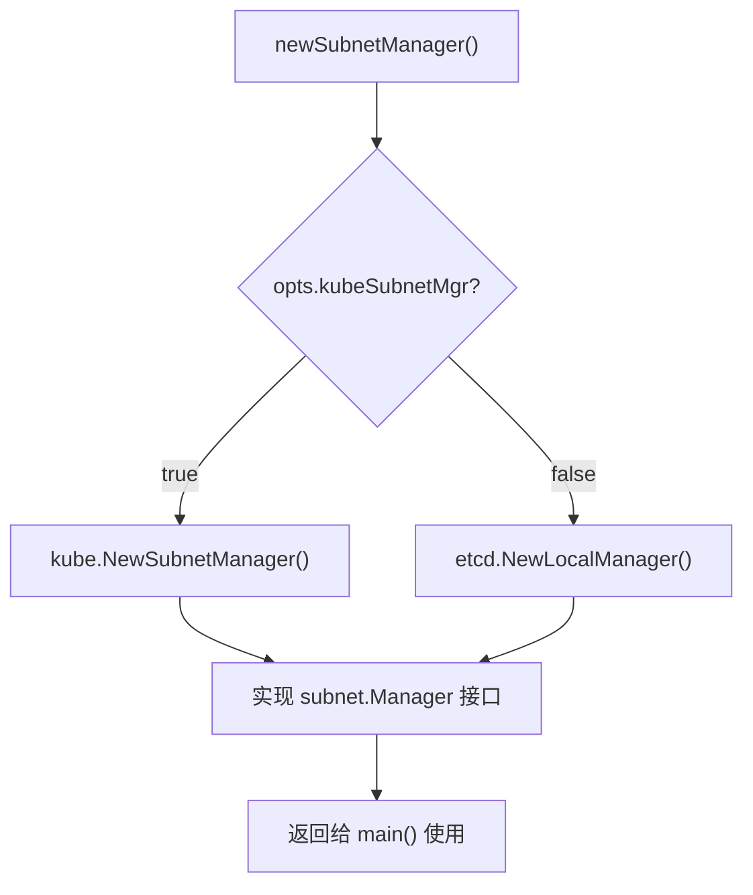
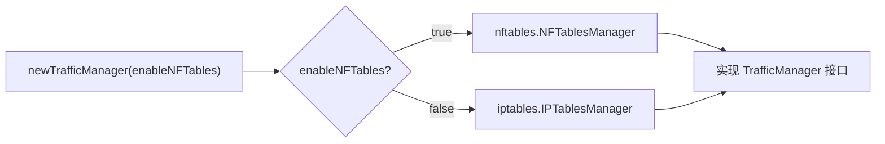
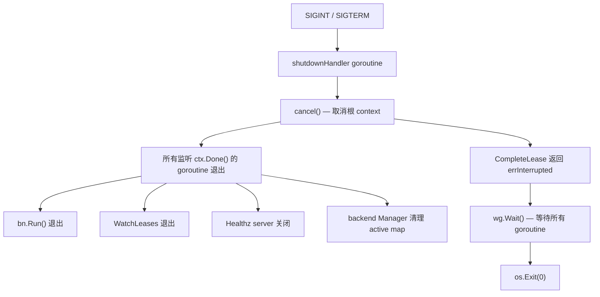

本文是 Flannel 源码的**架构导航图**。我们将从 `main.go` 入口函数出发，逐步追踪 Flannel 从进程启动到进入稳定运行态的完整初始化序列，剖析各子系统之间的依赖关系和协作模式。理解这条启动链路是阅读后续各章节（后端系统、子网管理、流量管理等）的必要前提。

## 全局启动序列概览

Flannel 的启动过程可以划分为**七个有序阶段**，每个阶段完成一项关键能力的初始化，前一阶段的输出通常作为后一阶段的输入。下图展示了整个启动流程的宏观时序：

Sources: [main.go](main.go#L214-L508)

## 阶段一：命令行解析与全局初始化

Flannel 使用 Go 标准库 `flag` 包进行命令行参数解析，所有参数定义集中在 `CmdLineOpts` 结构体中。值得注意的是，**参数注册发生在 `init()` 函数中**——这意味着在 `main()` 执行之前，所有命令行参数已经完成注册和解析。

`init()` 函数完成三项工作：定义所有命令行标志位、初始化 klog 日志系统（强制输出到 stderr）、以及从环境变量 `FLANNELD_*` 前缀中加载配置覆盖。这种「init 注册 + main 使用」的模式贯穿了 Flannel 的整个架构。

`CmdLineOpts` 中最关键的几个参数及其作用如下表所示：

| 参数 | 默认值 | 作用 |
|---|---|---|
| `--kube-subnet-mgr` | `false` | 决定子网管理器类型（`true` → K8s API, `false` → etcd） |
| `--iface` / `--iface-regex` / `--iface-can-reach` | 空 | 网络接口选择策略（详见 [网络接口选择策略](19-wang-luo-jie-kou-xuan-ze-ce-lue-iface-iface-regex-yu-iface-can-reach)） |
| `--ip-masq` | `false` | 是否安装 MASQUERADE 规则 |
| `--net-config-path` | `/etc/kube-flannel/net-conf.json` | 网络配置文件路径 |
| `--healthz-port` | `0`（禁用） | 健康检查端口 |
| `--public-ip` / `--public-ipv6` | 空 | 手动指定节点公网 IP |

Sources: [main.go](main.go#L72-L175)

## 阶段二：子网管理器的创建

子网管理器（`SubnetManager`）是 Flannel 的**核心协调器**——它负责子网分配、租约管理和集群事件监听。`newSubnetManager()` 函数根据 `--kube-subnet-mgr` 标志位做出唯一分支决策，返回统一的 `subnet.Manager` 接口：

**Kubernetes 子网管理器**的创建过程（`kube.NewSubnetManager`）是整个启动链中最重的操作之一。它需要：构建 Kubernetes 客户端配置、确定当前节点名称（优先从 `NODE_NAME` 环境变量获取，备选从 `POD_NAME`/`POD_NAMESPACE` 反查 Pod Spec）、读取并解析网络配置文件（`net-conf.json`）、创建 Node Informer 控制器并等待初始同步完成（最长 10 分钟超时）。Node Informer 通过 Watch 机制监听所有 Node 资源的变化，将 Annotation 变化转化为 lease 事件推入 `events` 通道。

**etcd 子网管理器**（`etcd.NewLocalManager`）则创建 etcd 连接，并尝试从之前的 `subnet.env` 文件中恢复上一次使用的子网（`prevSubnet`），以便在重启时优先复用同一子网。

`subnet.Manager` 接口定义了七项核心能力：

Sources: [main.go](main.go#L187-L212), [pkg/subnet/subnet.go](pkg/subnet/subnet.go#L106-L118), [pkg/subnet/kube/kube.go](pkg/subnet/kube/kube.go#L81-L167), [pkg/subnet/etcd/local_manager.go](pkg/subnet/etcd/local_manager.go#L65-L80)

## 阶段三：信号处理与健康检查

子网管理器创建成功后，Flannel 立即安装操作系统信号处理器和健康检查 HTTP 服务器。这两个组件是 Flannel **运行时生命周期管理**的基石。

信号处理器（`shutdownHandler`）在一个独立 goroutine 中阻塞等待 `SIGINT` 或 `SIGTERM` 信号。收到信号后，它调用根 `context` 的 `cancel()` 函数，触发所有监听该 context 的 goroutine 依次退出。这种「context 取消传播」模式是 Flannel 优雅关闭的核心机制。

健康检查服务器（`mustRunHealthz`）仅在 `--healthz-port > 0` 时启动，提供一个简单的 `/healthz` 端点，返回 `"flanneld is running"`。它同样在独立 goroutine 中运行，并监听 `stopChan`（即 `ctx.Done()`）来触发 `http.Server.Shutdown()` 进行优雅关闭。

Sources: [main.go](main.go#L254-L269), [main.go](main.go#L510-L583)

## 阶段四：网络配置获取

`getConfig()` 函数实现了**带重试的配置获取循环**。它反复调用 `sm.GetNetworkConfig(ctx)` 直到成功获取有效的 `subnet.Config` 对象。对于 Kubernetes 子网管理器，配置直接来自启动时已解析的 `net-conf.json` 文件；对于 etcd 子网管理器，配置存储在 etcd 的 `/coreos.com/network/config` 键下。

`subnet.Config` 结构体承载了 Flannel 运行所需的全部网络参数：

| 字段 | 说明 |
|---|---|
| `Network` / `IPv6Network` | Flannel 大网 CIDR |
| `EnableIPv4` / `EnableIPv6` / `EnableNFTables` | 协议栈和规则引擎开关 |
| `SubnetLen` / `IPv6SubnetLen` | 每节点子网前缀长度 |
| `BackendType` | 后端类型字符串（`vxlan`、`host-gw` 等） |
| `Backend` | 后端原始 JSON 配置（透传给具体后端解析） |

成功获取配置后，Flannel 执行 `ipmatch.GetIPFamily()` 确定当前协议栈模式（IPv4-only / IPv6-only / DualStack），并在 Linux 上检查 `br_netfilter` 内核模块是否加载。

Sources: [main.go](main.go#L271-L299), [main.go](main.go#L525-L544), [pkg/subnet/config.go](pkg/subnet/config.go#L26-L72)

## 阶段五：网络接口选择

在创建后端之前，Flannel 必须确定用于跨节点通信的**物理网络接口**。接口选择过程分两步：首先从子网管理器获取之前存储的 `PublicIP` 注解（如果存在）覆盖命令行参数，然后调用 `ipmatch.LookupExtIface()` 执行实际查找。

接口选择遵循三级优先策略：① 通过 `--iface` 指定的精确匹配（支持多次指定，取首个匹配）；② 通过 `--iface-regex` 的正则匹配（在精确匹配全部失败后执行）；③ 通过 `--iface-can-reach` 的路由可达性检测（模拟 `ip route get <ip>` 行为）。三级策略全部失败时进程退出。

查找成功后返回的 `backend.ExternalInterface` 结构体封装了选定接口的全部信息（接口对象、名称、IPv4/IPv6 地址、外部可达地址），这个结构体将在后续步骤中传递给每个后端实现。

Sources: [main.go](main.go#L301-L367), [pkg/backend/common.go](pkg/backend/common.go#L26-L33), [pkg/ipmatch/match.go](pkg/ipmatch/match.go#L42-L80)

## 阶段六：后端注册与网络创建

这是启动流程中**架构最精巧**的阶段。它涉及三层抽象的协作：Backend Manager → Backend → Network。

### 后端自注册机制（init() + constructors map）

每个后端包在 `init()` 函数中调用 `backend.Register(name, ctor)` 将自身注册到一个全局的 `constructors` map 中。`main.go` 通过空白导入（`_ "github.com/flannel-io/flannel/pkg/backend/..."`）触发所有后端的 `init()` 执行：

| 后端 | 注册名 | init() 位置 |
|---|---|---|
| alloc | `"alloc"` | [alloc.go](pkg/backend/alloc/alloc.go#L28-L30) |
| host-gw | `"host-gw"` | [hostgw.go](pkg/backend/hostgw/hostgw.go#L32-L34) |
| vxlan | `"vxlan"` | [vxlan.go](pkg/backend/vxlan/vxlan.go#L70-L72) |
| wireguard | `"wireguard"` | [wireguard.go](pkg/backend/wireguard/wireguard.go#L42-L44) |
| extension | `"extension"` | [extension.go](pkg/backend/extension/extension.go#L34-L36) |
| udp | `"udp"` | pkg/backend/udp/ |
| ipip | `"ipip"` | pkg/backend/ipip/ |
| ipsec | `"ipsec"` | pkg/backend/ipsec/ |

### Backend Manager 的桥梁角色

`backend.Manager` 持有 `constructors` map 的引用、子网管理器和外部接口。当 `GetBackend(backendType)` 被调用时，它从 map 中查找对应构造函数，执行 `ctor(sm, extIface)` 创建后端实例，并将其缓存到 `active` map 中以支持幂等调用。

### RegisterNetwork：从后端到网络

`be.RegisterNetwork(ctx, wg, config)` 是每个后端的核心方法，它完成三件事：

1. **解析后端特有配置**：从 `config.Backend`（原始 JSON）中提取参数（如 VXLAN 的 VNI、端口等）
2. **创建网络设备**：如 VXLAN 设备、WireGuard 接口等
3. **获取子网租约**：调用 `sm.AcquireLease(ctx, attrs)` — 这里 `attrs` 携带后端元数据（如 VXLAN 的 VTEP MAC、WireGuard 的公钥），会被写入 Node Annotation

返回的 `backend.Network` 接口仅暴露三个方法：`Lease()` 返回租约信息、`MTU()` 返回最大传输单元、`Run(ctx)` 启动后端事件循环。

Sources: [main.go](main.go#L47-L58), [main.go](main.go#L369-L385), [pkg/backend/manager.go](pkg/backend/manager.go#L26-L93), [pkg/backend/common.go](pkg/backend/common.go#L39-L50)

## 阶段七：流量管理器初始化与规则安装

在确定后端网络之后、启动事件循环之前，Flannel 初始化**流量管理器**来安装内核数据包处理规则。这里有一个巧妙的设计：Flannel 先创建一个「反向」流量管理器执行 `CleanUp()`——如果当前使用 iptables，则清理可能残留的 nftables 规则，反之亦然。这确保了后端类型切换时的状态一致性。

流量管理器的类型选择由 `config.EnableNFTables` 决定：

初始化后，流量管理器可能执行两类规则安装：

- **MASQUERADE 规则**（`--ip-masq` 启用时）：为离开 Flannel 网络的流量设置 SNAT，使其源地址变为节点物理 IP
- **FORWARD 规则**（默认启用）：在 iptables FORWARD 链中添加 ACCEPT 规则，确保 Docker 1.13+ 的默认 DROP 策略不会阻断跨节点 Pod 通信

Sources: [main.go](main.go#L387-L440), [main.go](main.go#L655-L661), [pkg/trafficmngr/trafficmngr.go](pkg/trafficmngr/trafficmngr.go#L38-L60)

## 阶段八：子网文件写入与后端事件循环启动

流量规则安装完毕后，Flannel 执行两个收尾动作：

**写入 subnet.env 文件**：`sm.HandleSubnetFile()` 将当前的网络配置（FLANNEL_NETWORK、FLANNEL_SUBNET、FLANNEL_MTU 等）原子写入 `--subnet-file` 指定路径（默认 `/run/flannel/subnet.env`）。这个文件是 CNI 插件获取网络参数的关键数据源。写入采用「先写临时文件，再 rename」的方式确保原子可见性。

**启动后端 Run 循环**：`bn.Run(ctx)` 在独立 goroutine 中启动后端的事件监听循环。不同后端的 Run 行为差异显著：

- **RouteNetwork 后端**（host-gw、ipip）：调用 `subnet.WatchLeases()` 监听集群 lease 变化，动态增删内核路由表条目
- **VXLAN 后端**：同样监听 lease 变化，但操作的是 ARP/FDB 表项而非路由
- **WireGuard 后端**：监听 lease 变化，动态更新 WireGuard peer 配置
- **SimpleNetwork 后端**（alloc）：`Run()` 仅阻塞在 `<-ctx.Done()`，不做额外操作

启动后端之后，Flannel 通过 `daemon.SdNotify(false, "READY=1")` 向 systemd 发送就绪通知。

Sources: [main.go](main.go#L474-L492), [pkg/subnet/subnet.go](pkg/subnet/subnet.go#L71-L104), [pkg/backend/route_network.go](pkg/backend/route_network.go#L53-L81), [pkg/backend/simple_network.go](pkg/backend/simple_network.go#L36-L38)

## 阶段九：租约完成与稳态运行

启动序列的最后一个步骤是 `sm.CompleteLease(ctx, lease, &wg)`。对于 Kubernetes 子网管理器，此方法完成两项工作：

1. 如果存在 `clusterCIDRController`，启动并等待其同步完成
2. 将 Node 的 `NodeNetworkUnavailable` Condition 设置为 `False`（reason: `"FlannelIsUp"`），通知 Kubernetes 调度器该节点的网络已就绪

`CompleteLease()` 是一个**阻塞调用**——它会一直运行直到 context 被取消。这意味着 `main()` 函数在此阻塞，直到收到关闭信号。当 context 取消后，`CompleteLease()` 返回 `errInterrupted` 错误，触发 `cancel()` 传播到所有 goroutine，最终 `wg.Wait()` 等待所有 goroutine 干净退出后进程结束。

Sources: [main.go](main.go#L494-L508), [pkg/subnet/kube/kube.go](pkg/subnet/kube/kube.go#L633-L669)

## 核心抽象与接口体系

理解 Flannel 架构的关键在于掌握其**三层接口抽象**。下表展示了从 `main.go` 的视角出发，各子系统通过接口解耦的方式：

| 接口 | 包路径 | 实现者 | 核心方法 |
|---|---|---|---|
| `subnet.Manager` | [subnet/subnet.go](pkg/subnet/subnet.go#L106) | `kubeSubnetManager` / `LocalManager` | GetNetworkConfig, AcquireLease, WatchLeases, CompleteLease |
| `backend.Backend` | [backend/common.go](pkg/backend/common.go#L39) | 各后端 struct | RegisterNetwork |
| `backend.Network` | [backend/common.go](pkg/backend/common.go#L44) | RouteNetwork / VXLANNetwork / SimpleNetwork | Lease, MTU, Run |
| `trafficmngr.TrafficManager` | [trafficmngr/trafficmngr.go](pkg/trafficmngr/trafficmngr.go#L38) | IPTablesManager / NFTablesManager | Init, CleanUp, SetupAndEnsureForwardRules, SetupAndEnsureMasqRules |

这些接口共同构成了 Flannel 的**插件化骨架**：`main.go` 不直接依赖任何具体实现，而是通过接口方法与子系统交互。这种设计使得添加新后端（如 [Extension 后端](10-extension-hou-duan-zi-ding-yi-hou-duan-de-yuan-xing-kai-fa-ji-zhi)）或新流量管理器仅需实现对应接口并通过 `init()` 注册。

Sources: [pkg/backend/common.go](pkg/backend/common.go#L1-L51), [pkg/subnet/subnet.go](pkg/subnet/subnet.go#L106-L118), [pkg/trafficmngr/trafficmngr.go](pkg/trafficmngr/trafficmngr.go#L38-L60)

## 优雅关闭流程

Flannel 的关闭机制基于 **Go context 取消传播** + **WaitGroup 同步等待**：

`shutdownHandler` goroutine 监听信号或 context 取消（`select` 两个 case），确保无论是外部信号还是内部 `cancel()` 调用都能触发清理。所有在 `wg` 上注册的 goroutine 必须在 context 取消后完成清理并调用 `wg.Done()`，`main()` 的 `wg.Wait()` 确保不会遗漏任何正在运行的 goroutine。

Sources: [main.go](main.go#L503-L523), [pkg/backend/manager.go](pkg/backend/manager.go#L73-L86)

## 启动阶段与子系统的对应关系

| 启动阶段 | 主要函数/方法 | 涉及的包 | 依赖输出 |
|---|---|---|---|
| 命令行解析 | `init()` → `flag.Parse()` | `pkg/backend/*`（触发注册） | `CmdLineOpts` |
| 子网管理器 | `newSubnetManager()` | `pkg/subnet/kube` 或 `pkg/subnet/etcd` | `subnet.Manager` 实例 |
| 配置获取 | `getConfig()` | `pkg/subnet` | `subnet.Config`（含 BackendType） |
| 接口选择 | `LookupExtIface()` | `pkg/ipmatch` | `ExternalInterface` |
| 后端创建 | `GetBackend()` → `RegisterNetwork()` | `pkg/backend/*` | `Backend` + `Network` 实例 |
| 流量管理 | `newTrafficManager()` | `pkg/trafficmngr/iptables` 或 `nftables` | 已安装的内核规则 |
| 稳态运行 | `bn.Run()` + `CompleteLease()` | 全部子系统 | — |

---

**推荐阅读路径**：理解整体启动流程后，建议按以下顺序深入各子系统：
1. [后端注册机制：init() 与构造函数映射模式](11-hou-duan-zhu-ce-ji-zhi-init-yu-gou-zao-han-shu-ying-she-mo-shi) — 理解后端自注册的工程模式
2. [VXLAN 后端：内核态封装与直连路由](6-vxlan-hou-duan-nei-he-tai-feng-zhuang-yu-zhi-lian-lu-you) 或 [host-gw 后端](7-host-gw-hou-duan-ji-yu-er-ceng-zhi-lian-de-gao-xing-neng-lu-you) — 选择你最关注的后端深入阅读
3. [Kubernetes 子网管理器：基于 API 的声明式管理](13-kubernetes-zi-wang-guan-li-qi-ji-yu-api-de-sheng-ming-shi-guan-li) — 理解 lease 获取和事件监听的完整流程
4. [健康检查与优雅关闭机制](21-jian-kang-jian-cha-yu-you-ya-guan-bi-ji-zhi) — 深入生命周期管理的细节