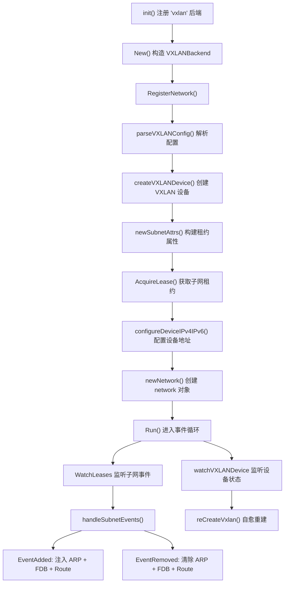
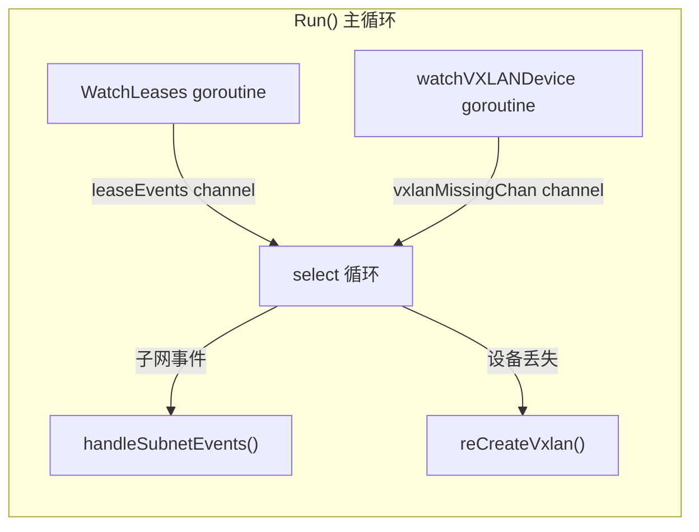
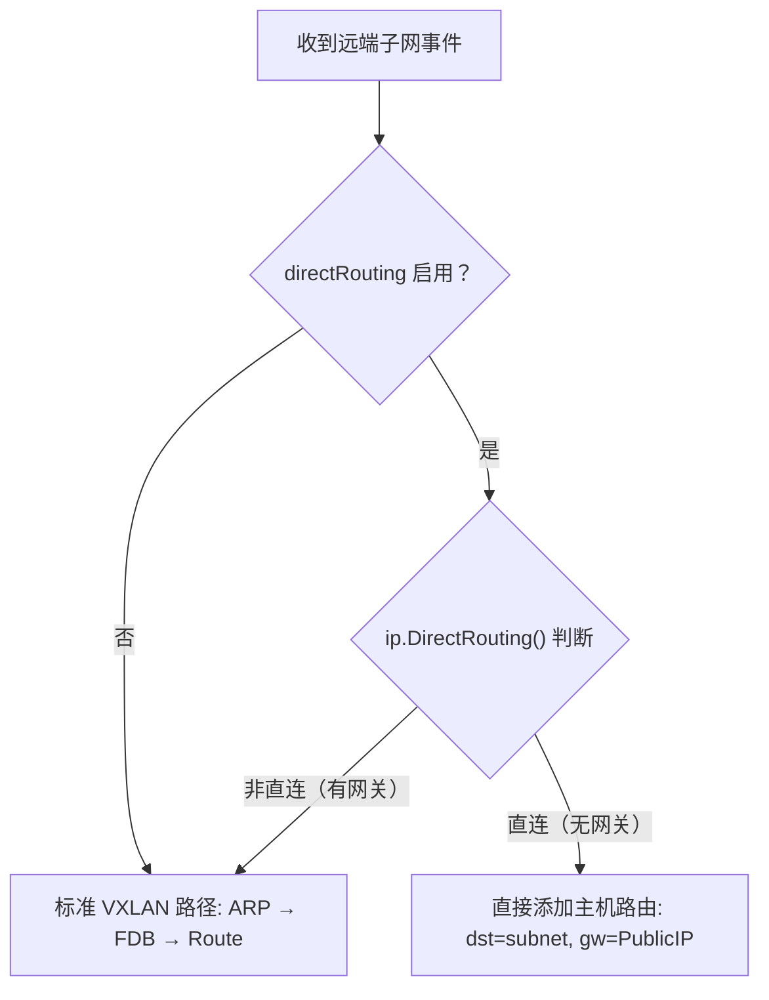

VXLAN（Virtual eXtensible LAN）是 Flannel 官方推荐的默认后端，它利用 Linux 内核原生的 VXLAN 模块在Overlay 网络中进行 L3 层数据包封装。本文将从设计演进、设备创建、事件驱动的路由管理、直连路由优化以及设备自愈机制五个维度，系统性地剖析 VXLAN 后端的完整实现。VXLAN 后端的代码主要集中在 `pkg/backend/vxlan/` 目录下，由三个核心文件构成：`vxlan.go` 负责后端注册与设备初始化，`vxlan_network.go` 实现子网事件驱动的路由管理，`device.go` 封装底层 netlink 操作。

Sources: [vxlan.go](pkg/backend/vxlan/vxlan.go#L1-L72), [backends.md](Documentation/backends.md#L17-L31)

## 设计演进：从 L2/L3 Miss 到全静态预注入

Flannel 的 VXLAN 后端经历了三个重要版本的演进，理解这段历史有助于把握当前架构的设计动机。源码中的注释详细记录了这一演进过程。

**第一版**：Flannel 守护进程同时注册 L2 Miss（ARP 未命中）和 L3 Miss（FDB 未命中）的 netlink 回调。当容器首次访问远端 IP 时触发 ARP 查找，内核向 Flannel 发出 L2 Miss 通知，Flannel 返回目标 VTEP 的 MAC 地址。随后内核在封装 VXLAN 包时发现不知道目标 VTEP 的公网 IP，再次回调 Flannel（L3 Miss）。这种方案的问题是每个表项（ARP/FDB/路由）与实际通信的远端容器数量成正比，且严重依赖 Flannel 守护进程的实时响应能力。

**第二版**：移除了 L3 Miss 回调。当发现新的远端主机时（启动期间或新增节点时），Flannel 主动预注入所需的 FDB 表项，消除了运行时的 L3 查找开销。

**第三版（当前版本）**：彻底移除 L2 Miss 回调。Flannel 不再监听任何 netlink 消息（L2MISS/L3MISS），而是在发现远端主机时直接预注入所有三条表项：路由表项、静态 ARP 条目、FDB 转发条目。这一设计带来了三大优势：Flannel 崩溃或重启不会导致超时问题；表项规模仅与远端主机数量成线性关系（每台主机 1 条路由 + 1 条 ARP + 1 条 FDB）；升级过程更简单可靠。

Sources: [vxlan.go](pkg/backend/vxlan/vxlan.go#L19-L55)

## 整体架构与启动流程

VXLAN 后端的启动遵循 Flannel 统一的后端生命周期模式：通过 `init()` 注册 → 通过构造函数实例化 → 调用 `RegisterNetwork` 创建网络 → 调用 `Run` 进入事件循环。下面是该流程的架构概览：



`init()` 函数通过调用 `backend.Register("vxlan", New)` 将 `"vxlan"` 字符串映射到 `New` 构造函数。`New` 函数接收子网管理器和外部接口信息，返回一个 `VXLANBackend` 实例。这个注册机制使得 [后端注册机制：init() 与构造函数映射模式](11-hou-duan-zhu-ce-ji-zhi-init-yu-gou-zao-han-shu-ying-she-mo-shi) 中的 Manager 可以在运行时根据配置字符串动态选择并实例化对应的后端实现。

Sources: [vxlan.go](pkg/backend/vxlan/vxlan.go#L70-L90), [manager.go](pkg/backend/manager.go#L26-L93)

## 配置解析：VXLANConfig

VXLAN 后端支持以下配置参数，通过 JSON 格式嵌入在 Flannel 的 `Backend` 字段中：

| 参数 | 类型 | 默认值 | 说明 |
|------|------|--------|------|
| `VNI` | int | `1` | VXLAN 网络标识符，决定设备名称 `flannel.<VNI>` |
| `Port` | int | 内核默认（8472） | UDP 封装端口 |
| `MTU` | int | 外部接口 MTU | 出站数据包的最大传输单元 |
| `GBP` | bool | `false` | 是否启用 VXLAN Group Based Policy |
| `Learning` | bool | `false` | 是否启用内核 VXLAN 的 MAC 学习功能 |
| `DirectRouting` | bool | `false` | 是否启用同子网直连路由优化 |

`parseVXLANConfig` 函数的解析逻辑非常简洁：创建一个以 `defaultVNI = 1` 为 VNI、外部接口 MTU 为默认 MTU 的配置对象，然后使用 `json.Unmarshal` 将用户传入的 JSON 原始消息覆盖到该对象上。未指定的字段自动保留默认值。日志输出会记录最终生效的完整配置。

Sources: [vxlan.go](pkg/backend/vxlan/vxlan.go#L159-L180)

## VXLAN 设备创建与生命周期

`createVXLANDevice` 函数是设备创建的核心入口，它根据网络配置（IPv4/IPv6）创建一个或两个 VXLAN 设备。IPv4 设备命名为 `flannel.<VNI>`，IPv6 设备命名为 `flannel-v6.<VNI>`，两者共享相同的 VNI 但绑定不同的 VTEP 源地址。

设备创建的关键步骤如下：

**MAC 地址恢复**：当 Flannel 重启时，`subnetMgr.GetStoredMacAddresses()` 从节点注解中读取之前持久化的 MAC 地址字符串，确保设备重建后 MAC 不变。这对于维持 FDB 表项的一致性至关重要。若无持久化 MAC，则由 `mac.NewHardwareAddr()` 生成随机地址，其实现通过 `crypto/rand` 生成 6 字节序列，并将首字节设置为本地管理 + 单播标志（`0x02`）。

**netlink 设备构造**：`newVXLANDevice` 函数通过 `netlink.Vxlan` 结构体描述设备属性，包括 VNI、VTEP 设备索引、源地址、端口、学习模式、GBP 标志等。值得注意的是 MTU 在此已被减去 50 字节（VXLAN 封装开销），即 `devAttrs.MTU - 50`。

**幂等性保障**：`ensureLink` 函数处理设备已存在的情况。如果内核中已有同名设备，它会通过 `vxlanLinksIncompat` 逐一比对 VNI、VTEP 接口、源地址、端口、GBP 等关键属性。若完全一致则复用已有设备；若存在不兼容项则先删除再重建。比对逻辑覆盖了 link type、VNI、VtepDevIndex、SrcAddr、Group 地址、L2miss、Port、GBP 共八个维度。

**IPv6 RA 禁用**：设备创建后立即通过 sysctl 将 `net/ipv6/conf/<dev>/accept_ra` 设为 `0`，阻止内核在 VXLAN 接口上处理 IPv6 路由通告，避免干扰 Flannel 自身的路由管理。

Sources: [vxlan.go](pkg/backend/vxlan/vxlan.go#L182-L274), [device.go](pkg/backend/vxlan/device.go#L32-L127), [mac.go](pkg/mac/mac.go#L25-L35)

## 设备地址配置与 /32 策略

`configureDeviceIPv4IPv6` 函数负责将子网地址绑定到 VXLAN 设备上。其核心设计是使用 **`/32`（IPv4）或 `/128`（IPv6）的主机路由**而非子网网段地址。

对于 IPv4，调用 `dev.Configure(ip.IP4Net{IP: lease.Subnet.IP, PrefixLen: 32}, config.Network)`，其中第一个参数是要配置的 IP 地址（/32），第二个参数是 Flannel 的整体网络范围。`Configure` 方法内部调用 `ip.EnsureV4AddressOnLink`，该函数会先清除该网络范围内已有的旧地址，再添加新的 /32 地址，最后将接口设置为 UP 状态。

使用 /32 地址而非子网网段的设计意图在源码注释中有明确说明：**确保不会创建广播路由**。这个 IP 仅作为主机到工作负载流量的源地址，使工作负载的返回流量有一个可达的目的地址。

Sources: [vxlan.go](pkg/backend/vxlan/vxlan.go#L149-L156), [vxlan.go](pkg/backend/vxlan/vxlan.go#L252-L274), [device.go](pkg/backend/vxlan/device.go#L129-L150), [iface.go](pkg/ip/iface.go#L244-L275)

## 子网租约属性与 VTEP MAC 传播

在注册网络阶段，`newSubnetAttrs` 函数构建了包含 VTEP MAC 地址的租约属性。这些属性会随子网租约一起传播到集群中的所有其他节点，是实现全静态预注入方案的关键数据。

`vxlanLeaseAttrs` 结构体包含两个字段：`VNI`（VXLAN Network Identifier）和 `VtepMAC`（VTEP 的 MAC 地址）。对于双栈环境，IPv4 和 IPv6 各自独立存储 VTEP MAC——因为它们分别对应不同的 VXLAN 设备，MAC 地址可能不同。`hardwareAddr` 类型是 `net.HardwareAddr` 的别名，实现了自定义的 JSON 序列化/反序列化逻辑，以字符串格式（如 `"0e:2a:xx:xx:xx:xx"`）存储。

当节点 A 收到节点 B 的子网租约事件时，它从 `BackendData` 中提取节点 B 的 VTEP MAC，然后用这个 MAC 来添加 ARP 和 FDB 表项，最终实现数据包的正确封装和转发。

Sources: [vxlan.go](pkg/backend/vxlan/vxlan.go#L92-L120), [vxlan_network.go](pkg/backend/vxlan/vxlan_network.go#L255-L258)

## 事件驱动的主循环：Run 与 handleSubnetEvents

`network.Run` 是 VXLAN 后端运行时的核心循环。它启动两个 goroutine 并在一个 `select` 循环中处理两类事件：



**子网事件监听**：`WatchLeases` 通过子网管理器（etcd 或 Kubernetes）持续监听集群中所有子网租约的变更，将事件批次发送到 `leaseEvents` 通道。

**设备状态监听**：`watchVXLANDevice` 通过 `netlink.LinkSubscribe` 订阅内核的 link 变更通知，当检测到 VXLAN 设备被删除（`RTM_DELLINK`）时，通过缓冲通道通知主循环。这个机制支持设备的自愈重建。

`handleSubnetEvents` 函数处理每个子网事件批次，对每个事件执行以下逻辑：

### EventAdded（节点加入）处理流程

当收到节点加入事件时，系统首先判断是否满足直连路由条件。对于非直连（标准 VXLAN 封装）场景，执行严格有序的三步操作：

1. **AddARP**：在 VXLAN 设备上添加一条 `NUD_PERMANENT` 类型的静态 ARP 条目，将远端子网网关 IP 映射到其 VTEP MAC 地址。
2. **AddFDB**：在 VXLAN 设备的 FDB（转发数据库）中添加一条桥接邻居条目，将 VTEP MAC 映射到远端主机的公网 IP，使内核知道应该将封装包发送到哪个物理地址。
3. **RouteReplace**：添加路由表项，目标为远端子网，出接口为 VXLAN 设备，网关为远端子网 IP，并设置 `RTNH_F_ONLINK` 标志（即使网关不在直连子网内也允许路由生效）。

这三步操作的顺序至关重要：ARP 必须在路由之前设置，否则内核会尝试 ARP 解析网关 IP，导致数据包在 ARP 条目就绪前就被丢弃。每步操作都通过 `retry.Do` 包装，提供最多 10 次的重试保障。更重要的是，后续步骤失败时会清理前序步骤已添加的表项（如 FDB 失败则回退 ARP，路由失败则回退 ARP 和 FDB），实现了类事务性的语义。

### EventRemoved（节点离开）处理流程

节点离开时执行相反的清理操作，但采用更宽松的策略：依次尝试删除路由、FDB、ARP 条目，即使某一步失败也会继续执行后续清理，避免留下孤立项。

IPv6 的处理逻辑与 IPv4 完全对称，使用独立的 `v6Dev` 设备和对应的 `AddV6ARP`、`AddV6FDB`、`DelV6ARP`、`DelV6FDB` 方法。

Sources: [vxlan_network.go](pkg/backend/vxlan/vxlan_network.go#L65-L112), [vxlan_network.go](pkg/backend/vxlan/vxlan_network.go#L260-L516)

## 直连路由优化：DirectRouting 模式

VXLAN 后端支持一种名为 `DirectRouting` 的优化模式。当启用时，如果两台主机位于同一个二层子网内，Flannel 会绕过 VXLAN 封装，直接使用类似 host-gw 的方式添加主机路由。

判断逻辑在 `ip.DirectRouting` 函数中实现：通过 `netlink.RouteGet(targetIP)` 查询到目标公网 IP 的路由，如果结果只有一条路由且该路由没有网关（`Gw == nil`），则认为目标是直连的。



直连路由在性能上有显著优势：避免了 VXLAN 封装/解封装的 CPU 开销和 50 字节的额外头部开销。在 [host-gw 后端：基于二层直连的高性能路由](7-host-gw-hou-duan-ji-yu-er-ceng-zhi-lian-de-gao-xing-neng-lu-you) 中会详细介绍类似的机制。`DirectRouting` 的实用价值在于：同一个二层网络内的节点间通信走高性能直连路由，跨子网的节点间通信仍然使用 VXLAN 封装，兼顾了性能和灵活性。

Sources: [vxlan_network.go](pkg/backend/vxlan/vxlan_network.go#L293-L304), [iface.go](pkg/ip/iface.go#L232-L242)

## 底层 netlink 操作：ARP、FDB 与路由管理

`vxlanDevice` 类型封装了所有与 VXLAN 设备相关的底层 netlink 操作。这些操作分为三类：

| 操作 | 方法 | netlink 调用 | 状态标志 |
|------|------|-------------|----------|
| 添加 IPv4 ARP | `AddARP` | `NeighSet` | `NUD_PERMANENT`, `RTN_UNICAST` |
| 添加 IPv6 ARP | `AddV6ARP` | `NeighSet` | `NUD_PERMANENT`, `RTN_UNICAST` |
| 删除 IPv4 ARP | `DelARP` | `NeighDel` | `NUD_PERMANENT`, `RTN_UNICAST` |
| 添加 IPv4 FDB | `AddFDB` | `NeighSet` | `NUD_PERMANENT`, `AF_BRIDGE`, `NTF_SELF` |
| 添加 IPv6 FDB | `AddV6FDB` | `NeighSet` | `NUD_PERMANENT`, `AF_BRIDGE`, `NTF_SELF` |
| 删除 IPv4 FDB | `DelFDB` | `NeighDel` | `AF_BRIDGE`, `NTF_SELF` |
| 删除 IPv6 FDB | `DelV6FDB` | `NeighDel` | `AF_BRIDGE`, `NTF_SELF` |

**ARP 操作**作用于内核的邻居表（ARP/NDP），建立远端子网网关 IP 与 VTEP MAC 的永久映射。`NUD_PERMANENT` 标志确保该条目永不超时、不被垃圾回收。

**FDB 操作**作用于内核的桥接转发数据库，地址族设置为 `AF_BRIDGE`，标志包含 `NTF_SELF`（表示本设备的转发表项）。FDB 建立了 VTEP MAC 到远端主机公网 IP 的映射，这是内核 VXLAN 模块进行封装时查找外层目的 IP 的关键数据结构。

所有表项操作都使用 `neighbor` 结构体作为参数，其中包含 `MAC`（VTEP MAC 地址）、`IP`（IPv4 地址）、`IP6`（可选的 IPv6 地址）三个字段。

Sources: [device.go](pkg/backend/vxlan/device.go#L179-L273)

## 设备自愈：watchVXLANDevice 与 reCreateVxlan

VXLAN 后端实现了设备级别的自愈能力。`watchVXLANDevice` goroutine 通过 netlink 的 link 订阅机制持续监控 VXLAN 设备的存在状态。当检测到 `RTM_DELLINK` 事件且设备名称匹配时，它会通过缓冲通道（容量为 1）向主循环发送信号。

主循环收到信号后，在独立的 goroutine 中异步执行 `reCreateVxlan`，避免阻塞正常的事件处理。`reCreateVxlan` 实现了指数退避重试机制：初始等待 1 秒，每次失败后翻倍，上限 30 秒。每次重试都会重新获取网络配置、重新创建 VXLAN 设备、重新配置地址，直到成功为止。

重建过程中，设备从外部接口获取最新的 IP 地址，调用完整的 `createVXLANDevice` + `configureDeviceIPv4IPv6` 流程。重建成功后，`nw.dev` 和 `nw.v6Dev` 被更新为新设备，后续的子网事件处理将基于新设备进行。值得注意的是，由于子网事件监听仍在继续，当新节点加入或已有节点的租约更新时，新设备上的 ARP/FDB/路由表项会被自动重建——这意味着不需要额外的全量同步操作。

Sources: [vxlan_network.go](pkg/backend/vxlan/vxlan_network.go#L114-L236)

## MTU 计算与封装开销

VXLAN 封装会引入额外的头部开销，Flannel 在两个不同层面进行了 MTU 处理：

**设备层面**：在 `newVXLANDevice` 中，VXLAN 设备的 MTU 被设置为 `devAttrs.MTU - 50`（50 字节 = 14 字节以太网头 + 20 字节 IPv4 头 + 8 字节 UDP 头 + 8 字节 VXLAN 头）。

**网络层面**：`network.MTU()` 方法返回 `nw.mtu - encapOverhead`，其中 `encapOverhead` 常量为 50。这个值被 CNI 插件用于配置容器网络接口的 MTU，确保容器发出的数据包在经过 VXLAN 封装后不会超出物理网络的 MTU 限制。

```
容器 MTU = 外部接口 MTU - 50（encapOverhead）- 50（设备 MTU 扣减）
实际容器有效 MTU = 外部接口 MTU - 100
```

这个双重扣减确保了端到端的 MTU 正确性，但也意味着 VXLAN 后端相比 host-gw 后端有约 100 字节的 MTU 损失。

Sources: [device.go](pkg/backend/vxlan/device.go#L59-L64), [vxlan_network.go](pkg/backend/vxlan/vxlan_network.go#L46-L53), [vxlan_network.go](pkg/backend/vxlan/vxlan_network.go#L251-L253)

## 双栈支持架构

VXLAN 后端对 IPv4/IPv6 双栈的支持采用了完全对称的设计模式。在设备创建阶段，根据 `config.EnableIPv4` 和 `config.EnableIPv6` 分别创建 `dev`（IPv4）和 `v6Dev`（IPv6）两个独立的 VXLAN 设备。它们共享相同的 VNI 但拥有不同的 MAC 地址和源地址。

在子网事件处理中，每个事件的 IPv4 和 IPv6 路径各自独立执行：IPv4 路径使用 `nw.dev`，从 `BackendData` 中提取 VTEP MAC，操作 IPv4 ARP/FDB/路由；IPv6 路径使用 `nw.v6Dev`，从 `BackendV6Data` 中提取 VTEP MAC，操作 IPv6 NDP/FDB/路由。两者共享相同的直连路由判断逻辑，但使用各自的公网 IP 进行判断。

租约属性也相应分为 `BackendData`（IPv4）和 `BackendV6Data`（IPv6）两部分，各自序列化独立的 `vxlanLeaseAttrs`。关于双栈的更多配置细节请参考 [双栈与纯 IPv6 模式：多协议网络支持](18-shuang-zhan-yu-chun-ipv6-mo-shi-duo-xie-yi-wang-luo-zhi-chi)。

Sources: [vxlan.go](pkg/backend/vxlan/vxlan.go#L202-L247), [vxlan_network.go](pkg/backend/vxlan/vxlan_network.go#L307-L335)

## 设计总结与性能特征

VXLAN 后端的核心设计可以用下表概括其关键架构决策和权衡：

| 维度 | 设计选择 | 影响 |
|------|----------|------|
| 封装位置 | 内核态（Linux VXLAN 模块） | 高性能，利用内核快速路径 |
| 表项注入方式 | 全静态预注入（无 L2/L3 Miss） | 不依赖守护进程实时响应，可靠性高 |
| 表项规模 | O(N)，N 为集群节点数 | 每节点仅 3 条表项，扩展性好 |
| 直连优化 | DirectRouting 可选 | 同子网内性能媲美 host-gw |
| 设备可靠性 | netlink 监听 + 指数退避重建 | 设备异常时自动恢复 |
| 操作原子性 | 失败时反向清理前序表项 | 避免残留不一致状态 |
| 双栈实现 | 独立设备 + 对称逻辑 | IPv4/IPv6 完全解耦 |

VXLAN 后端作为 Flannel 的默认选择，在通用性、性能和可靠性之间取得了良好平衡。它不要求二层直连（与 host-gw 的关键区别），可以在几乎任何网络环境下工作。对于追求极致性能且网络环境允许的场景，可以参考 [host-gw 后端：基于二层直连的高性能路由](7-host-gw-hou-duan-ji-yu-er-ceng-zhi-lian-de-gao-xing-neng-lu-you)；对于需要加密传输的场景，可以参考 [WireGuard 后端：加密隧道与双栈支持](8-wireguard-hou-duan-jia-mi-sui-dao-yu-shuang-zhan-zhi-chi)。