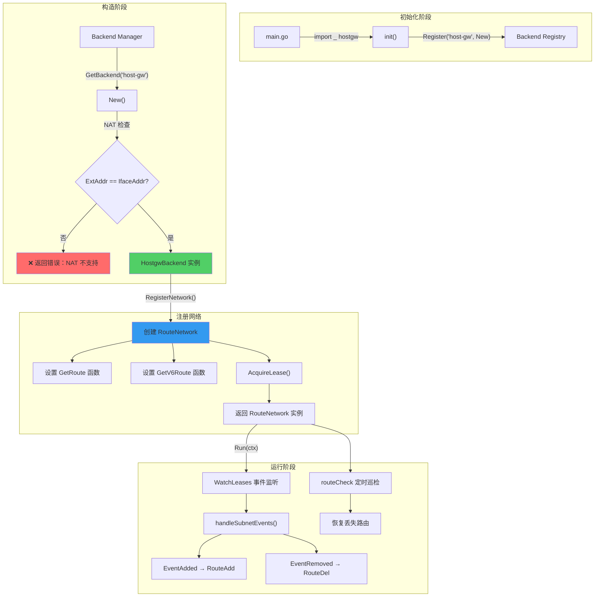
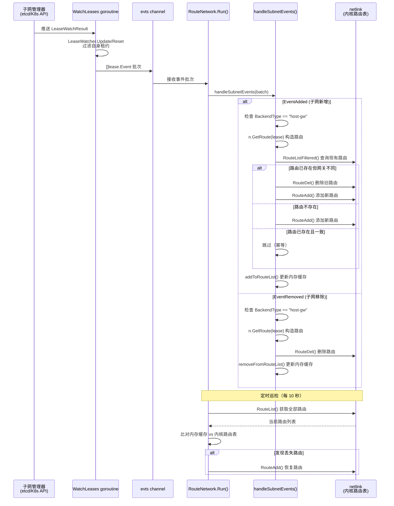
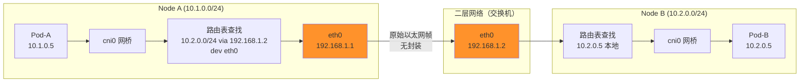
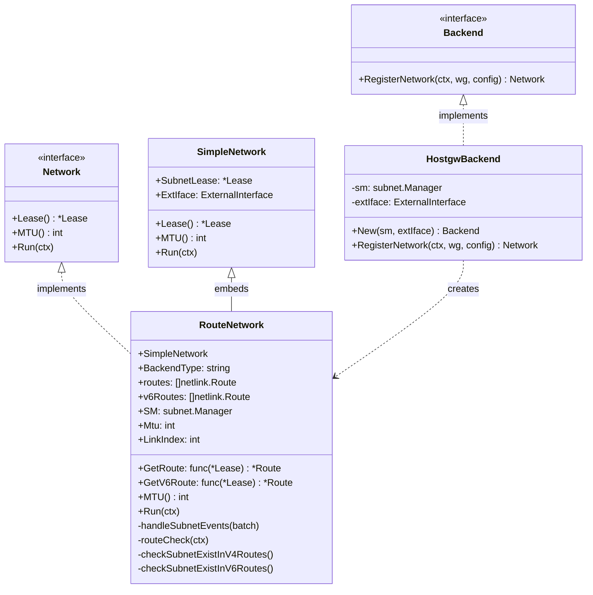

host-gw 是 Flannel 中最直接、最高效的后端实现。它不进行任何数据包封装——既没有 VXLAN 的 UDP 头开销，也没有 WireGuard 的加密隧道——而是纯粹依赖操作系统内核路由表，将每个远程节点的 Pod 子网直接指向该节点的物理 IP 作为网关。这种"零封装"策略带来了极致的网络性能，但前提是所有节点必须在同一个二层网络中可达。本文将深入剖析 host-gw 的设计哲学、代码实现、路由管理机制，以及它在 Linux 与 Windows 两大平台上的差异。

Sources: [hostgw.go](pkg/backend/hostgw/hostgw.go#L1-L104), [backends.md](Documentation/backends.md#L34-L41)

## 设计哲学：零封装的极致性能

Flannel 的官方文档对 host-gw 的定位非常明确："Use host-gw to create IP routes to subnets via remote machine IPs. Requires direct layer2 connectivity between hosts running flannel." 这句话概括了 host-gw 的两个核心特征：**纯路由驱动**和**二层可达性约束**。

与 VXLAN 后端不同，host-gw 不创建任何虚拟网络设备（如 VTEP 接口），也不修改数据包的头部。当一个 Pod 向另一个节点上的 Pod 发送数据时，数据包从源节点的 `cni0` 网桥出发，经过内核路由查找，直接从物理网卡发出，经由二层网络到达目标节点的物理网卡，再由目标节点的路由表转发至目标 Pod。整个路径中，数据包始终保持原始形态，没有任何额外的封装开销。

Sources: [backends.md](Documentation/backends.md#L34-L41)

### 后端横向对比

| 特性维度 | host-gw | VXLAN | WireGuard | IPIP |
|---------|---------|-------|-----------|------|
| 封装开销 | 无（纯路由） | 50 字节 UDP 头 | 32-60 字节加密头 | 20 字节 IP 头 |
| 性能表现 | **最优**（接近线速） | 良好 | 良好（含加密损耗） | 优秀 |
| 网络要求 | **二层直连** | 三层可达即可 | 三层可达即可 | 三层可达即可 |
| NAT 穿透 | **不支持** | 支持 | 支持 | 不支持 |
| 加密支持 | 无 | 无 | 原生 IPsec | 无 |
| 云环境适用 | 通常不适用 | 推荐 | 推荐 | 部分适用 |
| MTU 影响 | 无损耗 | 降低 50 字节 | 降低 32-60 字节 | 降低 20 字节 |

Sources: [backends.md](Documentation/backends.md#L1-L6)

## 架构总览：极简组件关系

host-gw 后端的代码结构体现了"少即是多"的工程哲学。整个后端仅由两个核心文件组成（Linux 和 Windows 各一份），且高度依赖共享的 `RouteNetwork` 基础设施。



Sources: [hostgw.go](pkg/backend/hostgw/hostgw.go#L32-L103), [route_network.go](pkg/backend/route_network.go#L53-L81)

## 注册机制：init() 与构造函数

host-gw 后端通过 Go 的 `init()` 函数在程序启动时自动注册自身。在 [main.go](main.go#L52) 中，通过 blank import（`_ "github.com/flannel-io/flannel/pkg/backend/hostgw"`）触发 `init()` 执行，将构造函数 `New` 注册到全局的 `constructors` 映射表中：

```go
func init() {
    backend.Register("host-gw", New)
}
```

当 `main.go` 中的 `BackendManager.GetBackend("host-gw")` 被调用时，它会从 `constructors` 映射表中查找并执行 `New` 函数来创建后端实例。这一机制确保了所有后端的注册是声明式的、零耦合的——添加新后端只需在 `main.go` 中增加一行 import 即可。

Sources: [hostgw.go](pkg/backend/hostgw/hostgw.go#L32-L34), [manager.go](pkg/backend/manager.go#L26-L93), [main.go](main.go#L47-L58)

## 构造函数 New()：NAT 检查是唯一的守门人

`New()` 函数是 host-gw 后端的工厂方法，它执行一项关键的前置检查——**NAT 验证**：

```go
func New(sm subnet.Manager, extIface *backend.ExternalInterface) (backend.Backend, error) {
    if !extIface.ExtAddr.Equal(extIface.IfaceAddr) {
        return nil, fmt.Errorf("your PublicIP differs from interface IP, meaning that probably you're on a NAT, which is not supported by host-gw backend")
    }
    be := &HostgwBackend{
        sm:       sm,
        extIface: extIface,
    }
    return be, nil
}
```

这个检查的逻辑是：如果节点的外部可达地址（`ExtAddr`）与接口实际绑定的地址（`IfaceAddr`）不一致，说明节点处于 NAT 环境。在 NAT 场景下，远程节点无法直接通过 `PublicIP` 到达本节点的物理网卡，因此 host-gw 的"将网关设为对端物理 IP"策略会失效。这是 host-gw 无法在大多数云环境中使用的根本原因——云厂商的实例通常处于 VPC 的 NAT 网关之后，PublicIP 与网卡 IP 不一致。

Sources: [hostgw.go](pkg/backend/hostgw/hostgw.go#L41-L51)

## RegisterNetwork()：路由策略的定义

`RegisterNetwork()` 是 host-gw 后端的核心配置方法。它并不立即操作系统路由表，而是创建一个 `RouteNetwork` 实例并注入**路由生成策略**：

```go
func (be *HostgwBackend) RegisterNetwork(ctx context.Context, wg *sync.WaitGroup, config *subnet.Config) (backend.Network, error) {
    n := &backend.RouteNetwork{
        SimpleNetwork: backend.SimpleNetwork{
            ExtIface: be.extIface,
        },
        SM:          be.sm,
        BackendType: "host-gw",
        Mtu:         be.extIface.Iface.MTU,
        LinkIndex:   be.extIface.Iface.Index,
    }

    // IPv4 路由策略：目标子网 → 对端物理 IP
    if config.EnableIPv4 {
        attrs.PublicIP = ip.FromIP(be.extIface.ExtAddr)
        n.GetRoute = func(lease *lease.Lease) *netlink.Route {
            return &netlink.Route{
                Dst:       lease.Subnet.ToIPNet(),
                Gw:        lease.Attrs.PublicIP.ToIP(),
                LinkIndex: n.LinkIndex,
            }
        }
    }

    // IPv6 路由策略：目标子网 → 对端物理 IPv6
    if config.EnableIPv6 {
        attrs.PublicIPv6 = ip.FromIP6(be.extIface.ExtV6Addr)
        n.GetV6Route = func(lease *lease.Lease) *netlink.Route {
            return &netlink.Route{
                Dst:       lease.IPv6Subnet.ToIPNet(),
                Gw:        lease.Attrs.PublicIPv6.ToIP(),
                LinkIndex: n.LinkIndex,
            }
        }
    }
    // ...获取租约...
}
```

这段代码揭示了 host-gw 路由策略的本质：**每条路由的三个核心要素**——目标子网（`Dst`）、网关地址（`Gw`）、出接口索引（`LinkIndex`）。其中 `GetRoute` 和 `GetV6Route` 是两个闭包函数，它们将 `RouteNetwork` 自身的 `LinkIndex` 捕获进来，确保所有路由都通过正确的物理接口发出。注意 MTU 直接继承自物理网卡——因为没有任何封装开销，所以 host-gw 的 MTU 与宿主机网络接口完全一致。

Sources: [hostgw.go](pkg/backend/hostgw/hostgw.go#L53-L103)

## RouteNetwork.Run()：事件驱动的路由生命周期

`RegisterNetwork()` 返回的 `RouteNetwork` 实例在 `main.go` 中通过 `bn.Run(ctx)` 被启动。`Run()` 方法是整个后端运行时的心脏，它启动两个关键的 goroutine：

```go
func (n *RouteNetwork) Run(ctx context.Context) {
    wg := sync.WaitGroup{}
    evts := make(chan []lease.Event)

    // Goroutine 1：监听子网租约事件
    wg.Add(1)
    go func() {
        subnet.WatchLeases(ctx, n.SM, n.SubnetLease, evts)
        wg.Done()
    }()

    // Goroutine 2：定期巡检路由一致性
    wg.Add(1)
    go func() {
        n.routeCheck(ctx)
        wg.Done()
    }()

    // 主循环：处理事件批次
    for {
        evtBatch, ok := <-evts
        if !ok {
            return
        }
        n.handleSubnetEvents(evtBatch)
    }
}
```

**Goroutine 1** 通过 `subnet.WatchLeases()` 与子网管理器（etcd 或 Kubernetes API）建立长连接监听，将所有子网变更事件（新增/移除）推送到 `evts` 通道。**Goroutine 2** 则是一个防御性机制——每 10 秒（`routeCheckRetries` 常量）扫描一次内核路由表，如果发现预期路由丢失（可能被其他进程删除或内核回收），则自动恢复。

Sources: [route_network.go](pkg/backend/route_network.go#L33-L81), [route_network.go](pkg/backend/route_network.go#L212-L222)

### 路由事件的完整处理流程



Sources: [route_network.go](pkg/backend/route_network.go#L83-L175), [route_network.go](pkg/backend/route_network.go#L224-L261), [subnet.go](pkg/subnet/subnet.go#L124-L159)

## 路由管理的核心算法：routeAdd()

`routeAdd()` 函数是路由操作的核心抽象。它不仅被 host-gw 使用，也被 IPIP 后端共享。其设计遵循**幂等性**和**防冲突替换**两个原则：

```go
func routeAdd(route *netlink.Route, ipFamily int, addToRouteList, removeFromRouteList func(netlink.Route)) {
    addToRouteList(*route)  // 先更新内存缓存

    // 步骤1：查询内核中是否已存在相同目标的路由
    routeList, _ := netlink.RouteListFiltered(ipFamily, &netlink.Route{Dst: route.Dst}, netlink.RT_FILTER_DST)

    // 步骤2：如果目标相同但网关/接口不同，先删除旧路由
    if len(routeList) > 0 && !routeEqual(routeList[0], *route) {
        netlink.RouteDel(&routeList[0])
        removeFromRouteList(routeList[0])
    }

    // 步骤3：重新查询，如果完全一致则跳过（幂等）
    // 步骤4：否则添加新路由
    if len(routeList) > 0 && routeEqual(routeList[0], *route) {
        log.Infof("Route to %v already exists, skipping.", route)
    } else if err := netlink.RouteAdd(route); err != nil {
        log.Errorf("Error adding route to %v: %s", route, err)
    }
}
```

**幂等性**保证：如果路由已经存在且完全匹配（目标子网、网关、接口索引均相同），则跳过操作，避免重复添加导致的错误。**防冲突替换**：如果同一目标子网已存在不同网关的路由（可能是节点 IP 变更导致），则先删除旧路由再添加新路由。`routeEqual()` 的比较逻辑同时考虑了 Dst IP、Dst Mask、Gw 和 LinkIndex 四个维度。

Sources: [route_network.go](pkg/backend/route_network.go#L142-L175), [route_network.go](pkg/backend/route_network.go#L263-L270)

## 定时巡检：routeCheck 的自愈机制

网络环境中的路由可能因外部因素丢失——例如系统的 network-manager 重启、Docker 修改 FORWARD 链策略、或者手动路由操作。`routeCheck()` 每 10 秒执行一次 `checkSubnetExistInRoutes()`，将内存中维护的期望路由列表与内核实际路由表进行逐一比对：

```go
func (n *RouteNetwork) checkSubnetExistInRoutes(routes []netlink.Route, ipFamily int) {
    routeList, err := netlink.RouteList(nil, ipFamily)
    if err == nil {
        for _, route := range routes {
            exist := false
            for _, r := range routeList {
                if routeEqual(r, route) {
                    exist = true
                    break
                }
            }
            if !exist {
                netlink.RouteAdd(&route)  // 恢复丢失路由
                log.Infof("Route recovered %v : %v", route.Dst, route.Gw)
            }
        }
    }
}
```

这是一个典型的**声明式自愈**模式——host-gw 不关心路由为什么丢失，它只关心"期望状态"与"实际状态"的差异，并通过不断的调谐来消除差异。

Sources: [route_network.go](pkg/backend/route_network.go#L212-L261)

## 双栈支持：IPv4 与 IPv6 的并行管理

host-gw 完整支持 IPv4/IPv6 双栈。在 `RegisterNetwork()` 中，`GetRoute` 和 `GetV6Route` 分别处理 IPv4 和 IPv6 路由的生成。相应地，`RouteNetwork` 维护两套独立的路由缓存——`routes`（IPv4）和 `v6Routes`（IPv6）：

| 属性 | IPv4 | IPv6 |
|------|------|------|
| 路由缓存 | `routes []netlink.Route` | `v6Routes []netlink.Route` |
| 路由生成函数 | `GetRoute` | `GetV6Route` |
| 地址族标识 | `netlink.FAMILY_V4` | `netlink.FAMILY_V6` |
| 网关地址来源 | `lease.Attrs.PublicIP` | `lease.Attrs.PublicIPv6` |
| 目标子网来源 | `lease.Subnet` | `lease.IPv6Subnet` |
| 接口地址 | `extIface.ExtAddr` | `extIface.ExtV6Addr` |

在事件处理中，`handleSubnetEvents()` 根据 `lease.EnableIPv4` 和 `lease.EnableIPv6` 分别调用对应的路由函数，确保双栈场景下两个协议族的路由独立维护。

Sources: [hostgw.go](pkg/backend/hostgw/hostgw.go#L68-L88), [route_network.go](pkg/backend/route_network.go#L83-L139)

## Windows 平台实现：HNS 网络栈

Windows 版本的 host-gw 后端在架构上与 Linux 一致——都是纯路由方案——但在底层实现上截然不同。Linux 使用 `netlink` 操作内核路由表，而 Windows 通过 **Host Networking Service (HNS)** API 管理网络。

### Windows 实现的核心差异

| 方面 | Linux | Windows |
|------|-------|---------|
| 路由操作库 | `vishvananda/netlink` | `hcsshim` (HNS API) |
| 路由抽象 | `netlink.Route` | `routing.Route` |
| 网络创建 | 无需额外网络设备 | 创建 `L2Bridge` HNSNetwork |
| 网桥端点 | 使用现有 `cni0` | 创建 HNSEndpoint |
| 转发设置 | 通过 iptables FORWARD 链 | `EnableForwardingForInterface()` |
| 额外配置 | 无 | 支持 `Name` 和 `DNSServerList` |

Windows 版本的 `RegisterNetwork()` 额外执行了以下步骤：

1. **解析配置**：从 `config.Backend` JSON 中提取 `Name`（默认 `cbr0`）和 `DNSServerList`
2. **创建/复用 HNSNetwork**：检查是否存在匹配的 L2Bridge 网络，如有则复用
3. **创建网桥端点**：创建 HNSEndpoint 作为 Pod 网关（子网第二个 IP）
4. **附加端点到宿主**：通过 `HostAttach()` 将端点热插到宿主网络堆栈
5. **启用转发**：在管理接口和网桥端点上同时启用 IP 转发

Windows 实现还会等待 HNS 操作异步完成——例如等待新创建的 HNSNetwork 的 ManagementIP 填充（最多 5 秒轮询），以及等待 HNSEndpoint 成功附加到宿主（最多 5 秒轮询）。

Sources: [hostgw_windows.go](pkg/backend/hostgw/hostgw_windows.go#L1-L273), [route_network_windows.go](pkg/backend/route_network_windows.go#L1-L201)

## 数据平面：一个数据包的完整旅程

理解 host-gw 的最佳方式是追踪一个数据包从源 Pod 到目标 Pod 的完整路径：



**关键路径说明**：Pod-A（10.1.0.5）向 Pod-B（10.2.0.5）发送数据包时，源节点的路由表将 `10.2.0.0/24` 子网指向 `192.168.1.2`（Node B 的物理 IP）。数据包经过 ARP 解析后，以原始以太网帧的形式从 Node A 的 `eth0` 发出，穿过二层交换机到达 Node B 的 `eth0`。Node B 的内核路由表识别 `10.2.0.5` 属于本地 `cni0` 网桥，直接转发至目标 Pod。整个过程**零封装、零解封装**，这也是 host-gw 性能最优的根本原因。

Sources: [hostgw.go](pkg/backend/hostgw/hostgw.go#L70-L77)

## 配置方式

host-gw 后端的配置极为简洁，因为它没有任何可调参数。在 Flannel 的网络配置 JSON 中，只需指定 backend 类型：

```json
{
    "Network": "10.244.0.0/16",
    "Backend": {
        "Type": "host-gw"
    }
}
```

在 Kubernetes 环境下，这个配置通常存储在 `kube-flannel-cfg` ConfigMap 的 `net-conf.json` 字段中。由于 host-gw 没有封装开销，MTU 直接继承自物理网卡，无需额外配置。

**Windows 平台额外参数**：

```json
{
    "Network": "10.244.0.0/16",
    "Backend": {
        "Type": "host-gw",
        "Name": "cbr0",
        "DNSServerList": "8.8.8.8"
    }
}
```

| 参数 | 平台 | 默认值 | 说明 |
|------|------|--------|------|
| `Type` | 全平台 | 必填 | 必须为 `"host-gw"` |
| `Name` | Windows | `"cbr0"` | HNSNetwork 名称 |
| `DNSServerList` | Windows | 空 | DNS 服务器列表 |

Sources: [backends.md](Documentation/backends.md#L34-L41), [hostgw_windows.go](pkg/backend/hostgw/hostgw_windows.go#L58-L72)

## 使用约束与适用场景

### 硬性约束

1. **二层直连要求**：所有运行 Flannel 的节点必须在同一个二层域中，能够通过 ARP/NDP 直接发现对方的 MAC 地址。跨子网的环境（如跨可用区的云环境）**无法使用** host-gw。

2. **NAT 不支持**：`New()` 构造函数会显式检查 `ExtAddr == IfaceAddr`。如果节点的 PublicIP（外部可达地址）与网卡绑定的 IP 不一致，构造会直接失败。这使得 host-gw 在大多数公有云环境中不可用。

3. **后端类型不可混用**：`handleSubnetEvents()` 中会过滤非 `"host-gw"` 类型的子网事件。如果集群中部分节点使用 VXLAN 而部分使用 host-gw，它们之间**无法互通**。

### 最优适用场景

- **裸金属集群**：数据中心内同网段的物理服务器集群，二层完全可达
- **低延迟场景**：金融交易、实时计算等对网络延迟极度敏感的应用
- **高性能计算**：大数据处理、分布式训练等对吞吐量要求极高的工作负载
- **混合后端策略**：利用 VXLAN 的 `DirectRouting` 选项，在二层可达的节点间自动降级为 host-gw 模式

Sources: [hostgw.go](pkg/backend/hostgw/hostgw.go#L41-L48), [route_network.go](pkg/backend/route_network.go#L86-L90), [backends.md](Documentation/backends.md#L24-L26)

## 类型系统与接口关系

host-gw 后端的实现涉及以下核心类型和接口的协作：



`HostgwBackend` 作为后端工厂，唯一的职责是创建正确配置的 `RouteNetwork` 实例。`RouteNetwork` 通过嵌入 `SimpleNetwork` 获得租约管理和接口信息的基本能力，同时添加了路由管理的全部逻辑。这种**组合优于继承**的设计使得 `RouteNetwork` 可以被 host-gw 和 IPIP 两个后端共享，差异仅在于 `GetRoute` 闭包的实现不同。

Sources: [common.go](pkg/backend/common.go#L26-L50), [simple_network.go](pkg/backend/simple_network.go#L23-L38), [route_network.go](pkg/backend/route_network.go#L37-L47), [hostgw.go](pkg/backend/hostgw/hostgw.go#L36-L39)

## 与其他页面的关联

- host-gw 的纯路由策略与 VXLAN 的封装机制形成鲜明对比，详见 [VXLAN 后端：内核态封装与直连路由](6-vxlan-hou-duan-nei-he-tai-feng-zhuang-yu-zhi-lian-lu-you)。特别值得注意的是，VXLAN 的 `DirectRouting` 选项可以在二层可达时自动降级为 host-gw 等效模式。
- host-gw 与 IPIP 后端共享 `RouteNetwork` 基础设施，详见 [UDP、IPIP 与 IPsec 后端：特殊场景的封装方案](9-udp-ipip-yu-ipsec-hou-duan-te-shu-chang-jing-de-feng-zhuang-fang-an)。
- 路由事件的来源是子网管理器的事件监听机制，详见 [子网租约生命周期：获取、续约与事件监听](14-zi-wang-zu-yue-sheng-ming-zhou-qi-huo-qu-xu-yue-yu-shi-jian-jian-ting)。
- 后端注册的 `init()` 模式是一个全局模式，详见 [后端注册机制：init() 与构造函数映射模式](11-hou-duan-zhu-ce-ji-zhi-init-yu-gou-zao-han-shu-ying-she-mo-shi)。
- 网络接口的选择直接影响 host-gw 的 `LinkIndex`，详见 [网络接口选择策略：iface、iface-regex 与 iface-can-reach](19-wang-luo-jie-kou-xuan-ze-ce-lue-iface-iface-regex-yu-iface-can-reach)。