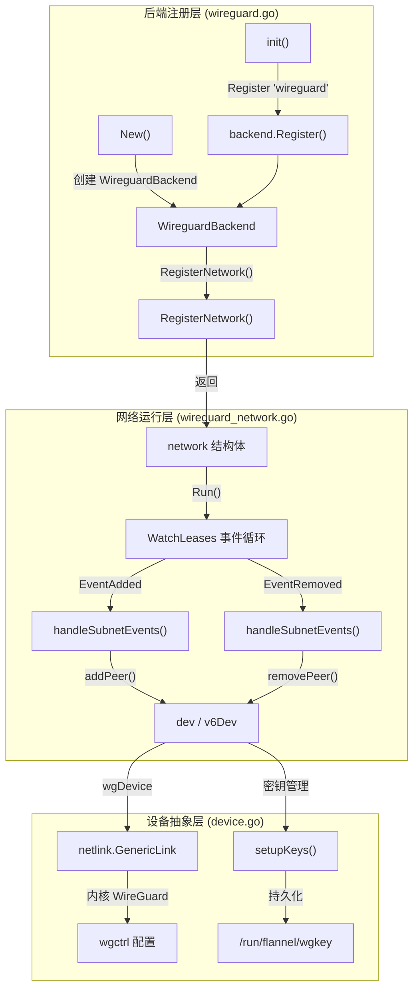
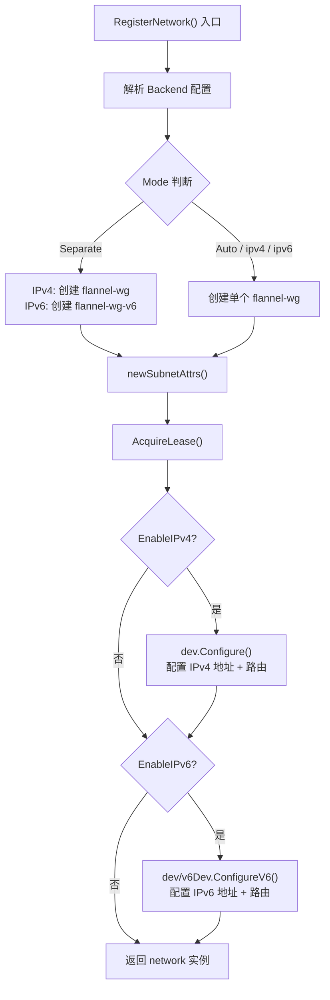
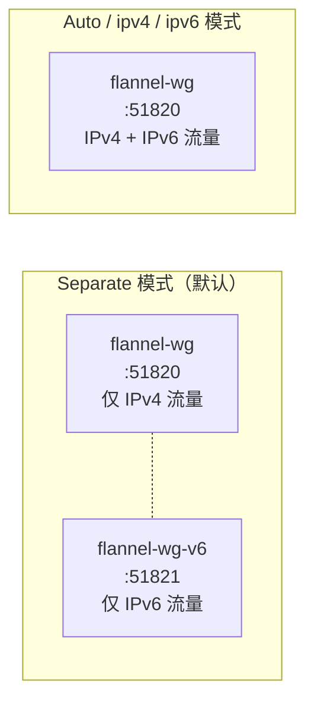
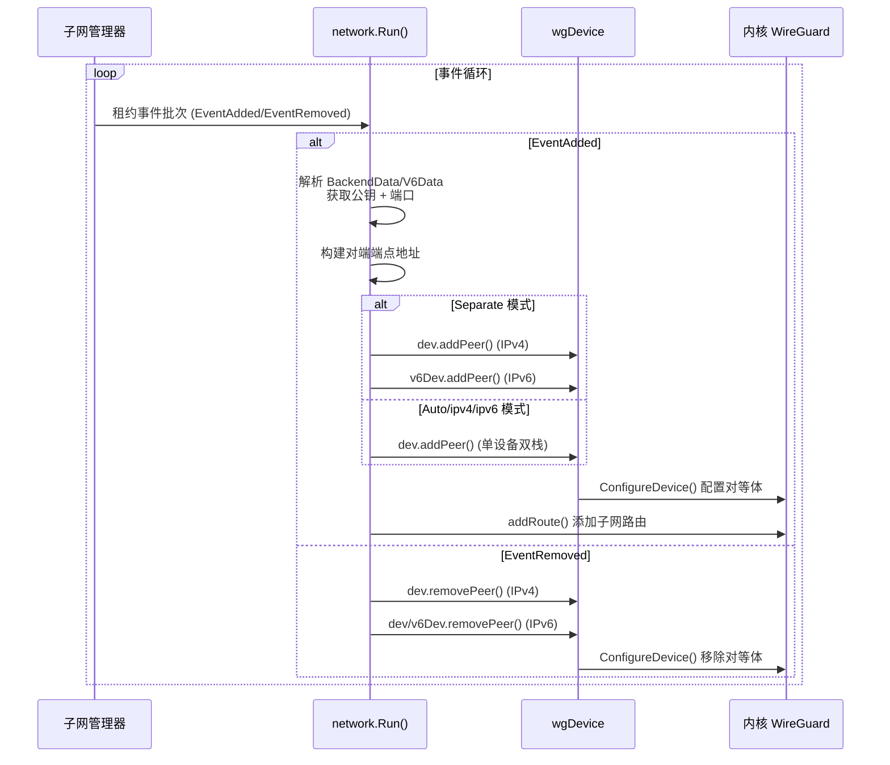

WireGuard 后端是 Flannel 网络栈中实现**传输层加密**的核心组件。与 VXLAN 或 host-gw 等明文传输后端不同，WireGuard 后端利用 Linux 内核原生 WireGuard 模块，在节点间自动建立加密隧道，同时完整支持 IPv4/IPv6 双栈与纯 IPv6 部署场景。该后端的实现分布在四个源文件中，涉及设备管理、密钥生命周期、子网事件驱动对等体（peer）管理以及多模式双栈策略等关键子系统。

Sources: [wireguard.go](pkg/backend/wireguard/wireguard.go#L1-L44), [wireguard_network.go](pkg/backend/wireguard/wireguard_network.go#L1-L54), [device.go](pkg/backend/wireguard/device.go#L1-L50)

## 架构全景与源文件职责

WireGuard 后端的代码组织遵循 Flannel 后端的标准分层模式：后端注册层负责与框架集成，设备抽象层封装内核 WireGuard 设备操作，网络运行层处理子网事件与对等体动态管理。



**四个源文件的职责划分**如下：

| 文件 | 核心职责 | 关键类型/函数 |
|------|---------|-------------|
| `wireguard.go` | 后端注册、配置解析、设备初始化编排 | `WireguardBackend`, `RegisterNetwork()`, `Mode` |
| `wireguard_network.go` | 网络运行时、子网事件处理、对等体管理 | `network`, `Run()`, `handleSubnetEvents()`, `selectMode()` |
| `device.go` | WireGuard 设备 CRUD、密钥管理、路由配置 | `wgDevice`, `wgDeviceAttrs`, `addPeer()`, `removePeer()` |
| `wireguard_windows.go` | Windows 平台占位（当前为空实现） | — |

Sources: [wireguard.go](pkg/backend/wireguard/wireguard.go#L42-L44), [wireguard_network.go](pkg/backend/wireguard/wireguard_network.go#L46-L54), [device.go](pkg/backend/wireguard/device.go#L37-L50), [wireguard_windows.go](pkg/backend/wireguard/wireguard_windows.go#L1-L18)

## 后端注册与初始化

WireGuard 后端通过 Go 的 `init()` 机制在程序启动时自动注册到后端工厂映射表中。当 `main.go` 间接导入 `pkg/backend/wireguard` 包时，`init()` 函数执行 `backend.Register("wireguard", New)`，将字符串标识符 `"wireguard"` 映射到构造函数 `New`。

构造函数 `New` 接收子网管理器（`subnet.Manager`）和外部接口信息（`backend.ExternalInterface`），创建一个轻量级的 `WireguardBackend` 结构体。此时不执行任何网络操作——真正的设备创建和隧道建立延迟到 `RegisterNetwork()` 调用时发生。`ExternalInterface` 携带了宿主机的网络接口名、IPv4/IPv6 地址、外部可达地址等关键上下文信息，这些信息在整个后端生命周期中被用于端点寻址。

Sources: [wireguard.go](pkg/backend/wireguard/wireguard.go#L42-L58), [manager.go](pkg/backend/manager.go#L50-L68), [common.go](pkg/backend/common.go#L26-L50)

## RegisterNetwork：设备创建与租约获取

`RegisterNetwork()` 是 WireGuard 后端的**初始化入口**，执行配置解析、设备创建、租约获取和接口配置四个阶段。



**配置解析阶段**从 `subnet.Config.Backend` 的 JSON 原始消息中提取 WireGuard 专属参数，并为每个参数设置了合理的默认值：

| 参数 | 类型 | 默认值 | 说明 |
|------|------|--------|------|
| `ListenPort` | int | 51820 | IPv4 隧道监听端口 |
| `ListenPortV6` | int | 51821 | IPv6 隧道监听端口（仅 Separate 模式） |
| `MTU` | int | 外部接口 MTU | 出向数据包的 MTU |
| `PSK` | string | 空（不启用） | 预共享密钥，增强安全性 |
| `PersistentKeepaliveInterval` | duration | 0（禁用） | NAT 穿透保活间隔 |
| `Mode` | string | `"separate"` | 双栈隧道策略 |

**租约属性构建**通过 `newSubnetAttrs()` 完成，将节点的公钥、端口号分别打包到 `BackendData`（IPv4）和 `BackendV6Data`（IPv6）中。这些数据随租约一起存储在子网管理器中，其他节点通过监听子网事件即可获取对端信息。值得注意的是，IPv4 和 IPv6 分别使用独立的端口配置（`v4Port` 和 `v6Port`），这为 Separate 模式下不同地址族使用不同端口提供了数据基础。

Sources: [wireguard.go](pkg/backend/wireguard/wireguard.go#L113-L209)

## 四种运行模式详解

WireGuard 后端定义了 `Mode` 类型及其四种取值，控制着 IPv4/IPv6 双栈场景下隧道设备的创建和路由策略。这是该后端区别于其他 Flannel 后端的**核心设计决策点**。



**Separate 模式**（默认）为 IPv4 和 IPv6 各创建一个独立的 WireGuard 设备。IPv4 流量走 `flannel-wg`（端口 51820），IPv6 流量走 `flannel-wg-v6`（端口 51821）。这种模式的优势在于地址族隔离清晰，每个设备只需处理单一协议的流量，调试时通过 `wg show flannel-wg` 或 `wg show flannel-wg-v6` 可以分别查看两种协议的对等体状态。

**Auto 模式**创建单个 `flannel-wg` 设备承载两种协议的流量，并自动选择最优的对端地址。选择逻辑在 `selectMode()` 中实现：当远程端点有公网 IPv4 地址且本机也有 IPv4 外部地址时优先使用 IPv4；当远程和本机都有公网 IPv6 地址时使用 IPv6；其余情况回退到 IPv4。这种启发式策略旨在最大化连接成功率。

**ipv4 模式**和 **ipv6 模式**与 Auto 类似使用单设备，但强制指定对端地址族，跳过自动选择逻辑。

Sources: [wireguard.go](pkg/backend/wireguard/wireguard.go#L33-L40), [wireguard.go](pkg/backend/wireguard/wireguard.go#L141-L165), [wireguard_network.go](pkg/backend/wireguard/wireguard_network.go#L118-L129)

## 设备抽象层：wgDevice 与密钥管理

`wgDevice` 是对 Linux 内核 WireGuard 设备的完整封装，由 `wgDeviceAttrs`（属性）和 `netlink.GenericLink`（内核链路设备）组成。该层负责密钥生成/持久化、设备创建/销毁、IP 地址配置、路由管理和对等体操作。

**密钥管理**遵循"生成一次、持久使用"的策略。`setupKeys()` 方法首先检查密钥文件是否存在（默认路径 `/run/flannel/wgkey`，可通过环境变量 `WIREGUARD_KEY_FILE` 覆盖）。若文件不存在，调用 `wgtypes.GeneratePrivateKey()` 生成新的 Curve25519 私钥，计算对应公钥，并将私钥写入文件（权限 0400）。若文件已存在（如节点重启后），则从文件读取并解析已有密钥，确保跨重启密钥一致性。若配置中提供了 PSK（预共享密钥），则额外解析并存储，用于后续对等体配置。

**设备创建**通过 `netlink` 库创建 `wireguard` 类型的 GenericLink，然后使用 `wgctrl` 客户端配置私钥和监听端口。`ensureLink()` 函数处理了设备已存在的场景——先删除旧设备再重新创建，确保每次启动都获得干净状态。创建的设备 MTU 为外部接口 MTU 减去 80 字节的 WireGuard 封装开销：

```
overhead = 80 字节
  = 40 (IPv6 头，取较大值) 
  + 8  (UDP 头)
  + 4  (消息类型)
  + 4  (密钥索引)
  + 8  (随机数 nonce)
  + 16 (认证标签)
```

**优雅关闭**通过 `context.Context` 实现。设备创建时注册一个 goroutine 监听 `ctx.Done()` 信号，当 Flannel 退出时自动调用 `netlink.LinkDel()` 清理设备，还原系统网络状态。

Sources: [device.go](pkg/backend/wireguard/device.go#L37-L184), [device.go](pkg/backend/wireguard/device.go#L216-L278)

## 对等体动态管理

WireGuard 后端采用**事件驱动模型**管理节点间对等体关系。`network.Run()` 启动一个长期运行的 goroutine 监听子网管理器的租约变更事件，通过 `handleSubnetEvents()` 将租约变更转换为 WireGuard 对等体操作。



**事件处理的核心逻辑**是解析租约属性中携带的对端信息。每个节点的租约属性（`LeaseAttrs`）包含 `BackendData` 和 `BackendV6Data`，其中序列化了 `wireguardLeaseAttrs` 结构体，携带对方的 **公钥** 和 **端口号**。对于每个新增的租约事件：

1. 验证租约的 `BackendType` 为 `"wireguard"`，忽略其他类型的子网
2. 分别解析 IPv4 和 IPv6 的后端数据，提取公钥和端口
3. 兼容处理端口为 0 的情况——回退到本机设备的监听端口，保证与旧版本 Flannel 的互操作性
4. 根据 `PublicIP`/`PublicIPv6` 和端口构建 UDP 端点地址
5. 调用 `dev.addPeer()` 将对端配置到 WireGuard 设备，设置 `AllowedIPs` 为对端的子网范围

`addPeer()` 方法的实现使用 `wgctrl` 库的 `ConfigureDevice` API，每次调用设置一个对等体的完整配置，包括公钥、预共享密钥（如果配置了 PSK）、持久保活间隔、UDP 端点和允许的 IP 范围。`ReplaceAllowedIPs: true` 确保每次更新都替换该对等体的 IP 范围，而非追加。

Sources: [wireguard_network.go](pkg/backend/wireguard/wireguard_network.go#L78-L100), [wireguard_network.go](pkg/backend/wireguard/wireguard_network.go#L131-L303), [device.go](pkg/backend/wireguard/device.go#L280-L323)

## 路由配置与地址管理

WireGuard 后端通过 `netlink` 库直接操作 Linux 路由表，将 Flannel 网络范围指向 WireGuard 设备。`Configure()` 和 `ConfigureV6()` 方法在设备创建后执行两步操作：

首先，调用 `ip.EnsureV4AddressOnLink()` 或 `ip.EnsureV6AddressOnLink()` 为设备分配 IP 地址。IPv4 分配 `/32` 主机路由（`PrefixLen: 32`），IPv6 分配 `/128` 主机路由（`PrefixLen: 128`）。这种点对点地址模型是 WireGuard 的典型模式——每个节点在设备上只配置自身子网的 IP，通过 `AllowedIPs` 机制控制哪些流量进入隧道。

然后，调用 `upAndAddRoute()` 激活设备并添加指向整个 Flannel 网络（如 `10.10.0.0/16`）的路由，scope 设置为 `SCOPE_LINK`。`RouteReplace` 保证幂等性——重复调用不会报错。

在 `handleSubnetEvents()` 中，每添加一个对等体后还会再次添加 Flannel 网络路由，这是一种防御性策略，确保在设备状态变化后路由仍然存在。

Sources: [device.go](pkg/backend/wireguard/device.go#L224-L278), [wireguard_network.go](pkg/backend/wireguard/wireguard_network.go#L193-L252)

## MTU 计算与性能考量

WireGuard 后端的 MTU 计算遵循 `network.MTU()` 方法，返回外部接口 MTU 减去 80 字节的开销。这 80 字节覆盖了 WireGuard 封装的最坏情况——使用 IPv6 外层头（40 字节）加上 UDP 头（8 字节）和 WireGuard 协议头（32 字节）。这种保守计算确保数据包在传输路径上不会因封装而超过路径 MTU，避免分片带来的性能损失。

在实际部署中，如果底层网络路径的 MTU 低于标准 1500 字节（例如某些云环境的 1460 字节），建议在 Backend 配置中显式设置 `MTU` 值，或通过 `--iface` 选择合适的外部接口。

Sources: [wireguard_network.go](pkg/backend/wireguard/wireguard_network.go#L33-L76)

## 配置示例

以下展示几种典型的 WireGuard 后端配置场景：

**纯 IPv4 加密隧道**（最简配置）：
```json
{
  "Network": "10.10.0.0/16",
  "Backend": {
    "Type": "wireguard"
  }
}
```

**双栈 Separate 模式**（默认行为，IPv4/IPv6 各用独立隧道）：
```json
{
  "Network": "10.10.0.0/16",
  "IPv6Network": "2001:cafe:42::/56",
  "EnableIPv6": true,
  "Backend": {
    "Type": "wireguard",
    "Mode": "separate"
  }
}
```

**双栈 Auto 模式 + PSK + 保活**（NAT 穿透场景）：
```json
{
  "Network": "10.10.0.0/16",
  "IPv6Network": "2001:cafe:42::/56",
  "EnableIPv6": true,
  "Backend": {
    "Type": "wireguard",
    "Mode": "auto",
    "PSK": "H0Ad2yKBMgfGM6/Yt2dRxd8u+juyViCz3KdJfEdteJ8=",
    "PersistentKeepaliveInterval": 25,
    "ListenPort": 51820
  }
}
```

Sources: [backends.md](Documentation/backends.md#L43-L61), [wireguard.go](pkg/backend/wireguard/wireguard.go#L115-L128), [dist/wireguard](dist/wireguard#L1-L8)

## 平台兼容性与限制

WireGuard 后端当前仅支持 Linux 平台。`wireguard.go`、`wireguard_network.go` 和 `device.go` 均带有 `//go:build !windows` 构建标签，而 `wireguard_windows.go` 是一个空实现，意味着 Windows 节点无法使用该后端。使用该后端需要 Linux 内核 5.6 或更高版本（内置 WireGuard 模块），更低版本的内核需要手动安装 WireGuard 包。

Sources: [wireguard.go](pkg/backend/wireguard/wireguard.go#L1-L2), [backends.md](Documentation/backends.md#L66-L66)

## 调试与运维

WireGuard 后端创建的设备具有**静态可预测的命名**：`flannel-wg`（IPv4 或单设备模式）和 `flannel-wg-v6`（Separate 模式的 IPv6 设备）。运维人员可以直接使用 WireGuard 工具链进行调试：

```bash
# 查看所有 WireGuard 设备状态
wg show

# 查看 IPv4 隧道详情（对等体、传输字节数、最新握手时间）
wg show flannel-wg

# 查看 IPv6 隧道详情
wg show flannel-wg-v6
```

`wg show` 输出中的 `latest handshake` 字段是判断隧道连通性的关键指标——如果握手时间持续更新，说明隧道正常工作。密钥文件存储在 `/run/flannel/wgkey`（可通过 `WIREGUARD_KEY_FILE` 环境变量自定义路径），该文件权限为 0400，仅 root 可读。

Sources: [backends.md](Documentation/backends.md#L64-L64), [device.go](pkg/backend/wireguard/device.go#L82-L127)

## 延伸阅读

- [VXLAN 后端：内核态封装与直连路由](6-vxlan-hou-duan-nei-he-tai-feng-zhuang-yu-zhi-lian-lu-you) — 理解 Flannel 默认后端的封装机制，与 WireGuard 的加密封装形成对比
- [UDP、IPIP 与 IPsec 后端：特殊场景的封装方案](9-udp-ipip-yu-ipsec-hou-duan-te-shu-chang-jing-de-feng-zhuang-fang-an) — IPsec 后端是另一种加密方案，可与 WireGuard 比较权衡
- [双栈与纯 IPv6 模式：多协议网络支持](18-shuang-zhan-yu-chun-ipv6-mo-shi-duo-xie-yi-wang-luo-zhi-chi) — 深入了解双栈配置的全局约束和平台要求
- [后端注册机制：init() 与构造函数映射模式](11-hou-duan-zhu-ce-ji-zhi-init-yu-gou-zao-han-shu-ying-she-mo-shi) — 理解所有 Flannel 后端统一的注册和生命周期管理框架
- [子网租约生命周期：获取、续约与事件监听](14-zi-wang-zu-yue-sheng-ming-zhou-qi-huo-qu-xu-yue-yu-shi-jian-jian-ting) — WireGuard 对等体管理依赖的租约事件机制