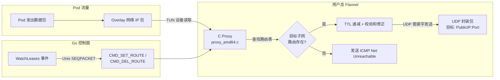
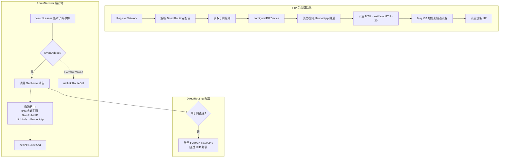
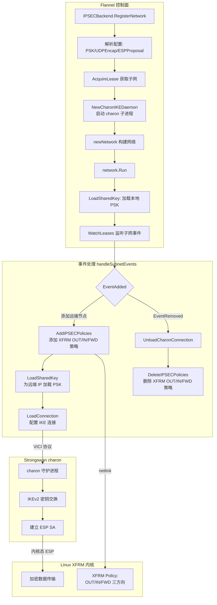

Flannel 的后端体系中，VXLAN 与 host-gw 占据了生产环境的主流，但 UDP、IPIP 和 IPsec 三个后端在特定场景下仍具有不可替代的价值。**UDP 后端**是完全用户态的封装方案，仅依赖 TUN 设备和原始 UDP 套接字，适用于内核不支持 VXLAN 的极旧环境或调试目的；**IPIP 后端**利用 Linux 内核的 `ipip` 隧道模块，以最小的封装开销（仅 20 字节额外 IP 头）实现跨子网通信；**IPsec 后端**则在 IPIP 的基础上叠加了 Strongswan 提供的 IKEv2 密钥交换与内核 XFRM 策略，为跨公网的集群间通信提供加密保障。三者均不支持 Windows 平台，且仅 IPIP 使用 Flannel 通用的 `RouteNetwork` 路由管理框架，UDP 和 IPsec 各自维护独立的网络事件处理逻辑。理解这三个后端的差异与适用边界，是合理选型 Flannel 网络方案的关键前提。

Sources: [backends.md](Documentation/backends.md#L68-L143), [common.go](pkg/backend/common.go#L26-L50)

## 三后端定位与特性对比

从架构定位看，这三个后端服务于截然不同的需求层级。UDP 是**纯用户态实现**，通过 C 语言编写的 proxy 进程在 TUN 设备与 UDP 套接字之间转发数据包，不依赖任何内核隧道模块——这使它成为唯一能在内核完全不具备隧道能力时运行的后端，代价是性能最差。IPIP 是**内核态轻量封装**，利用 Linux `ipip` 模块创建 `flannel.ipip` 隧道设备，封装开销仅一个 20 字节的外层 IP 头，是所有封装类后端中开销最小的。IPsec 是**加密隧道方案**，结合 Strongswan 的 IKEv2 守护进程（charon）与 Linux 内核 XFRM 子系统，在隧道模式下提供 ESP 加密，适用于需要跨公网安全通信的场景。

| 维度 | UDP | IPIP | IPsec |
|------|-----|------|-------|
| 封装方式 | 用户态 TUN + UDP 套接字 | 内核 `ipip` 隧道模块 | 内核 XFRM + Strongswan IKEv2 |
| 额外开销 | 28 字节（20 IP + 8 UDP） | 20 字节（外层 IP 头） | 77 字节（ESP 隧道模式），UDP 封装时 +8 |
| 加密支持 | ❌ | ❌ | ✅（ESP + PSK 认证） |
| 平台限制 | 仅 amd64 + Linux | 仅 Linux | 仅 Linux |
| 双栈支持 | ❌ | ❌ | ❌ |
| DirectRouting | ❌ | ✅ | ❌ |
| 生产推荐 | 仅调试 | 受限环境 | 跨公网加密 |
| 注册名称 | `"udp"` | `"ipip"` | `"ipsec"` |

Sources: [udp_amd64.go](pkg/backend/udp/udp_amd64.go#L35-L37), [ipip.go](pkg/backend/ipip/ipip.go#L35-L38), [ipsec.go](pkg/backend/ipsec/ipsec.go#L49-L52), [ipsec_network.go](pkg/backend/ipsec/ipsec_network.go#L33-L48)

## UDP 后端：用户态 TUN-UDP 代理架构

### 整体架构与数据路径

UDP 后端是 Flannel 中最独特的后端——它完全在用户态完成数据包的封装与转发，不依赖任何内核隧道模块。其核心架构由三层组成：**TUN 设备层**负责拦截 Overlay 网络的 IP 数据包，**C Proxy 层**负责在 TUN 设备与 UDP 套接字之间高效转发，**控制套接字层**负责从 Go 运行时向 C Proxy 传递路由更新命令。



数据包从 Pod 进入 TUN 设备后，C Proxy 的 `tun_to_udp()` 函数读取原始 IP 包，通过 `find_route()` 查找匹配的目标子网路由，递减 TTL 并修正校验和后，将整个 IP 包通过 UDP 套接字发送到目标节点的 `PublicIP:Port`。反向路径由 `udp_to_tun()` 处理，逻辑更简单：从 UDP 套接字接收封装包，递减 TTL 后直接写入 TUN 设备。

Sources: [proxy_amd64.c](pkg/backend/udp/proxy_amd64.c#L316-L363), [udp_network_amd64.go](pkg/backend/udp/udp_network_amd64.go#L36-L48)

### C Proxy 的核心实现

C Proxy 的 `run_proxy()` 函数是 UDP 后端的心脏。它使用 `poll()` 系统调用同时监听三个文件描述符：TUN 设备（`PFD_TUN`）、UDP 套接字（`PFD_SOCK`）和控制套接字（`PFD_CTL`）。关键的优化策略在于：当 TUN 或 UDP 有数据可读时，proxy 会**跳过 poll() 调用直接读取**，因为连续读取的代价远低于反复调用 poll()。仅当两个数据源都返回 EAGAIN 时，才会回到 poll() 等待。注释中明确说明了这一设计决策的权衡：以偶尔忽略控制套接字的延迟为代价，换取更高的数据面吞吐量。

路由表采用**动态数组 + 移至前端（move-to-front）** 策略：`find_route()` 在匹配成功后将该条目交换到数组首位，利用"同一目标的包往往成批到达"的局部性原理，使后续查找变为 O(1)。路由表的扩容策略是倍增（从 8 起步），通过 `realloc()` 实现。

Sources: [proxy_amd64.c](pkg/backend/udp/proxy_amd64.c#L398-L465), [proxy_amd64.c](pkg/backend/udp/proxy_amd64.c#L164-L222)

### Go-C 跨语言控制通道

Go 运行时与 C Proxy 之间的通信通过一对 Unix `SOCK_SEQPACKET` 套接字实现。控制命令定义为三种类型：

| 命令常量 | 值 | 用途 | 触发时机 |
|---------|---|------|---------|
| `CMD_SET_ROUTE` | 1 | 添加或更新路由条目 | 子网租约 EventAdded |
| `CMD_DEL_ROUTE` | 2 | 删除路由条目 | 子网租约 EventRemoved |
| `CMD_STOP` | 3 | 停止 proxy 主循环 | 上下文取消（evts 通道关闭） |

命令结构体 `command` 包含目标子网地址、前缀长度、下一跳 IP 和端口。Go 端通过 `writeCommand()` 将结构体序列化为原始字节写入控制套接字，C 端的 `process_cmd()` 在 poll 检测到 `POLLIN` 事件时读取并解析命令。选择 `SOCK_SEQPACKET` 而非 `SOCK_DGRAM` 确保了消息边界的保留和传输顺序的可靠性。

Sources: [proxy_amd64.h](pkg/backend/udp/proxy_amd64.h#L27-L39), [cproxy_amd64.go](pkg/backend/udp/cproxy_amd64.go#L59-L97), [udp_network_amd64.go](pkg/backend/udp/udp_network_amd64.go#L136-L145)

### TUN 设备初始化与平台限制

UDP 后端的 TUN 设备初始化调用 `ip.OpenTun("flannel%d")` 打开 `/dev/net/tun`，通过 `ioctl(TUNSETIFF)` 创建名为 `flannelX` 的 TUN 接口，并设置 `IFF_TUN | IFF_NO_PI` 标志。`IFF_NO_PI` 表示不添加协议信息头，使 TUN 设备直接传递原始 IP 数据包。接口配置时将地址设为 `/32` 以避免生成广播路由，然后添加指向 Overlay 网络的路由。

UDP 后端的平台支持**极其有限**：实际实现仅在 `udp_amd64.go` 和 `udp_network_amd64.go` 中提供（build tag `!windows` 且隐含 amd64），而 `udp.go` 和 `udp_network.go`（build tag `!amd64,!windows`）对所有非 amd64 架构直接返回 `"UDP backend is not supported on this architecture"` 错误。Windows 平台的 `udp_windows.go` 则为空包，不注册任何后端。

Sources: [udp_network_amd64.go](pkg/backend/udp/udp_network_amd64.go#L147-L199), [tun.go](pkg/ip/tun.go#L49-L66), [udp.go](pkg/backend/udp/udp.go#L26-L32)

## IPIP 后端：内核态轻量封装

### 架构设计与 RouteNetwork 复用

与 UDP 后端不同，IPIP 后端将所有数据面操作完全交给 Linux 内核处理。Flannel 仅负责创建 `flannel.ipip` 隧道设备和维护路由表。IPIP 是唯一使用 Flannel 通用 `RouteNetwork` 框架的封装类后端——`RouteNetwork` 内置了子网事件监听、路由增删、定期路由恢复等通用逻辑，IPIP 后端只需提供 `GetRoute` 闭包函数来定义如何为每个远端租约构造路由即可。



Sources: [ipip.go](pkg/backend/ipip/ipip.go#L57-L126), [route_network.go](pkg/backend/route_network.go#L37-L47)

### flannel.ipip 隧道设备的生命周期管理

`configureIPIPDevice()` 函数展现了 IPIP 后端最精巧的逻辑——隧道设备的创建与兼容性处理。函数创建 `netlink.Iptun` 设备，将 `Local` 属性设为本机接口地址（以此与内核自动创建的 `tunl0` 默认设备区分），`Remote` 保持为 nil（点对多点模式）。

当设备已存在时（`EEXIST` 错误），代码进入**兼容性验证**分支：首先检查现有设备是否为 `ipip` 类型，然后比对 `Local` 和 `Remote` 属性是否与期望值一致。若不一致（可能是用户更改了 `--iface` 配置），则**删除旧设备并重新创建**。这一设计确保了 Flannel 重启或配置变更后隧道设备的正确性。

MTU 计算遵循标准公式：`expectMTU = extIface.MTU - 20`，其中 20 字节是 IPIP 封装新增的外层 IP 头大小。如果外部接口的 MTU 本身过小（计算后 ≤ 0），则直接报错退出。代码仅在旧 MTU 大于期望值或为零时才调整 MTU，避免在系统已手动配置更小 MTU 的情况下强制覆盖。

Sources: [ipip.go](pkg/backend/ipip/ipip.go#L128-L210)

### DirectRouting 优化

IPIP 后端支持 `DirectRouting` 配置选项。当启用时，`GetRoute` 闭包会调用 `ip.DirectRouting()` 检查目标 PublicIP 是否与本机在同一二层子网。若在同一个子网内，路由的 `LinkIndex` 将被替换为外部网络接口的索引，数据包**绕过 IPIP 封装直接通过物理网络发送**，等价于 host-gw 模式。这种设计使同一二层域内的节点获得 host-gw 级别的性能，跨子网通信则自动回退到 IPIP 封装。

Sources: [ipip.go](pkg/backend/ipip/ipip.go#L101-L123)

### tunl0 与 flannel.ipip 的共存

IPIP 后端的一个常见困惑是系统中会同时出现 `tunl0` 和 `flannel.ipip` 两个隧道设备。代码注释详细解释了这一现象：`tunl0` 是内核在执行 `modprobe ipip` 时自动创建的命名空间默认 IPIP 设备，属性为 `local=any, remote=any`。当内核收到 IPIP 协议包但无法匹配更精确的隧道设备时，会将包转发给 `tunl0` 作为兜底。Flannel 选择创建独立的 `flannel.ipip` 设备（`local` 设为本机接口地址），以避免干扰用户可能已有的 `tunl0` 配置。

Sources: [ipip.go](pkg/backend/ipip/ipip.go#L128-L137), [backends.md](Documentation/backends.md#L104-L118)

## IPsec 后端：加密隧道与 IKEv2 密钥管理

### 架构总览：三层协作模型

IPsec 后端是 Flannel 中架构最复杂的后端，它将三个独立子系统编织在一起：**Strongswan charon 守护进程**负责 IKEv2 密钥交换与 SA（Security Association）生命周期管理，**Linux XFRM 子系统**负责内核级的策略匹配与加密/解密，**Flannel 控制面**负责子网事件驱动的策略和连接配置下发。



Sources: [ipsec.go](pkg/backend/ipsec/ipsec.go#L32-L120), [ipsec_network.go](pkg/backend/ipsec/ipsec_network.go#L50-L106)

### Charon IKEDaemon：进程管理与 VICI 通信

`CharonIKEDaemon` 是 IPsec 后端与 Strongswan 交互的核心抽象。初始化时，`NewCharonIKEDaemon()` 在多个已知路径中搜索 charon 可执行文件（覆盖 Alpine、Debian/Ubuntu、CentOS/RHEL、openSUSE 等发行版），找到后以子进程方式启动。子进程通过 `SysProcAttr.Pdeathsig` 绑定到 Flannel 父进程，确保父进程异常退出时 charon 自动终止。

与 charon 的通信通过 **VICI（Versatile IKE Control Interface）** 协议进行，底层是 Unix 域套接字 `/var/run/charon.vici`。`getClient()` 方法实现了带重试的连接建立：如果 charon 尚未就绪，会在每秒重试并检查上下文取消信号。`CharonIKEDaemon` 提供三个关键操作：

| 方法 | 功能 | VICI 命令 |
|------|------|----------|
| `LoadSharedKey` | 为指定远端 IP 加载 PSK | `LoadShared` |
| `LoadConnection` | 配置 IKE/Child SA 连接参数 | `LoadConn` |
| `UnloadCharonConnection` | 卸载指定连接 | `UnloadConn` |

Sources: [handle_charon.go](pkg/backend/ipsec/handle_charon.go#L39-L103), [handle_charon.go](pkg/backend/ipsec/handle_charon.go#L118-L220), [handle_charon.go](pkg/backend/ipsec/handle_charon.go#L259-L279)

### IKE 连接与 Child SA 配置

`LoadConnection()` 构造的 IKE 连接配置体现了 IPsec 后端的安全设计。IKE 阶段使用 `aes256-sha256-modp4096` 提案（高强度加密），通过 PSK 认证。Child SA（ESP 阶段）默认使用 `aes128gcm16-sha256-prfsha256-ecp256` 提案，但可通过 `ESPProposal` 配置覆盖。关键配置参数包括：

- **`StartAction: "start"`** — 连接加载后立即发起 IKE 协商
- **`CloseAction: "trap"`** — SA 关闭后自动重新触发
- **`DpdAction: "restart"`** — 死对等体检测失败后重启连接
- **`RekeyTime: "1h"`** — 每小时自动重协商密钥
- **`InstallPolicy: "no"`** — 策略由 Flannel 通过 XFRM 独立管理，不由 charon 安装

连接名格式为 `{本地PublicIP}-{本地子网}-{远端子网}-{远端PublicIP}`，Child SA 名格式为 `{本地子网}-{远端子网}`。`Encap` 字段由 `UDPEncap` 配置控制，启用后 ESP 包将被封装在 UDP 中以穿透 NAT 网关。

Sources: [handle_charon.go](pkg/backend/ipsec/handle_charon.go#L155-L220)

### XFRM 策略管理：三方向策略模型

IPsec 后端使用 Linux 内核的 XFRM 框架管理安全策略。对于每一对节点间的通信，`AddIPSECPolicies()` 安装三条方向性策略：

| 方向 | 源子网 | 目标子网 | 隧道左端点 | 隧道右端点 | 含义 |
|------|--------|---------|-----------|-----------|------|
| `XFRM_DIR_OUT` | 本地子网 | 远端子网 | 本地 PublicIP | 远端 PublicIP | 出站流量加密 |
| `XFRM_DIR_IN` | 远端子网 | 本地子网 | 远端 PublicIP | 本地 PublicIP | 入站流量解密 |
| `XFRM_DIR_FWD` | 远端子网 | 本地子网 | 远端 PublicIP | 本地 PublicIP | 转发流量处理 |

每条策略使用 `XFRM_PROTO_ESP` 协议和 `XFRM_MODE_TUNNEL` 模式，`Reqid` 固定为 11（`defaultReqID`）。策略添加前会先通过 `XfrmPolicyGet` 检查是否已存在：不存在则 `XfrmPolicyAdd`，已存在则 `XfrmPolicyUpdate`。删除时三个方向逐一调用 `XfrmPolicyDel`。

MTU 计算考虑了 ESP 隧道模式的完整开销：**77 字节**（新 IP 头 20 + SPI 4 + 序列号 4 + AES-IV 16 + 填充 0-15 + 填充长度 1 + 下一个头 1 + SHA-256 ICV 16 ≈ 最大 62，取保守值 77），启用 `UDPEncap` 时再额外扣除 8 字节 UDP 头。

Sources: [handle_xfrm.go](pkg/backend/handle_xfrm.go#L30-L102), [ipsec_network.go](pkg/backend/ipsec/ipsec_network.go#L33-L48), [ipsec_network.go](pkg/backend/ipsec/ipsec_network.go#L162-L188)

### PSK 安全要求与配置验证

IPsec 后端强制要求预共享密钥（PSK）长度不低于 **96 个字符**（`minPasswordLength = 96`）。这一要求在 `RegisterNetwork()` 中通过 `len(cfg.PSK) < minPasswordLength` 检查强制执行，不满足时直接返回错误。项目提供了示例配置文件 `dist/ipsec`，其中包含一个 96 字符的十六进制 PSK，以及推荐的生成命令：`dd if=/dev/urandom count=48 bs=1 status=none | xxd -p -c 48`。

Sources: [ipsec.go](pkg/backend/ipsec/ipsec.go#L49-L93), [ipsec](dist/ipsec#L1-L7)

## 后端注册机制与平台隔离

三个后端均通过 `init()` 函数在包加载时调用 `backend.Register()` 完成注册。平台隔离通过 Go 的 build tag 机制实现：所有实际实现文件标记为 `!windows`，Windows 平台文件（`*_windows.go`）为空包，不包含 `init()` 函数。UDP 后端更进一步，通过 `!amd64` 标签在非 amd64 架构上提供返回错误的 stub 实现。

| 后端 | 注册入口 | 有效 Build Tag | Windows 行为 | 非 amd64 行为 |
|------|---------|---------------|-------------|-------------|
| UDP | `udp_amd64.go` | `!windows` | 空包，不注册 | stub，返回错误 |
| IPIP | `ipip.go` | `!windows` | 空包，不注册 | N/A（Go 默认编译） |
| IPsec | `ipsec.go` | `!windows` | 空包，不注册 | N/A（Go 默认编译） |

Sources: [udp_amd64.go](pkg/backend/udp/udp_amd64.go#L31-L33), [ipip.go](pkg/backend/ipip/ipip.go#L40-L42), [ipsec.go](pkg/backend/ipsec/ipsec.go#L54-L56), [manager.go](pkg/backend/manager.go#L26-L93)

## 配置参考与故障排查

### 配置参数汇总

**UDP 后端配置**：
```json
{
  "Network": "10.0.0.0/8",
  "Backend": {
    "Type": "udp",
    "Port": 8285
  }
}
```
`Port` 默认值为 `8285`，可通过配置覆盖。

**IPIP 后端配置**：
```json
{
  "Network": "10.0.0.0/16",
  "Backend": {
    "Type": "ipip",
    "DirectRouting": false
  }
}
```
`DirectRouting` 默认 `false`，启用后同子网节点将直接路由。

**IPsec 后端配置**：
```json
{
  "Network": "10.50.0.0/16",
  "Backend": {
    "Type": "ipsec",
    "PSK": "4bc1e570...（至少 96 字符）",
    "UDPEncap": false,
    "ESPProposal": "aes128gcm16-sha256-prfsha256-ecp256"
  }
}
```
`PSK` 为必填项，`UDPEncap` 和 `ESPProposal` 为可选项。

Sources: [udp_amd64.go](pkg/backend/udp/udp_amd64.go#L52-L64), [ipip.go](pkg/backend/ipip/ipip.go#L57-L66), [ipsec.go](pkg/backend/ipsec/ipsec.go#L73-L95), [ipsec](dist/ipsec#L1-L7)

### 防火墙与故障排查

IPsec 后端的防火墙要求最为复杂，需要开放三个端口/协议：
- **协议 50**（ESP）— 加密数据传输
- **UDP 500**（IKE）— 密钥交换管理
- **UDP 4500**（NAT-T）— NAT 穿越模式（启用 `UDPEncap` 时）

调试工具方面：
- **`swanctl`**：Strongswan 自带工具，在 Flannel 容器中可用，可查看 charon 日志和连接状态
- **`ip xfrm state`**：查看内核安全关联数据库（SA），确认节点间是否成功建立 IPsec 连接
- **`ip xfrm policy`**：查看已安装的 XFRM 策略，Flannel 为每个远端节点安装 3 条策略

需要注意的是，Flannel **不会恢复手动删除的策略**（除非重启 Flannel），也**不会在启动时清理陈旧策略**。清除陈旧状态的方法是重启主机或执行 `ip xfrm state flush && ip xfrm policy flush` 后重启 Flannel。

Sources: [backends.md](Documentation/backends.md#L119-L143)

## 后续阅读

- 若需了解 VXLAN（生产推荐后端）的内核态封装机制，参阅 [VXLAN 后端：内核态封装与直连路由](6-vxlan-hou-duan-nei-he-tai-feng-zhuang-yu-zhi-lian-lu-you)
- 若需理解 host-gw 的高性能直连路由模式，参阅 [host-gw 后端：基于二层直连的高性能路由](7-host-gw-hou-duan-ji-yu-er-ceng-zhi-lian-de-gao-xing-neng-lu-you)
- 若需了解 WireGuard 后端的加密隧道实现（支持双栈），参阅 [WireGuard 后端：加密隧道与双栈支持](8-wireguard-hou-duan-jia-mi-sui-dao-yu-shuang-zhan-zhi-chi)
- 若需深入后端注册的 init() 模式与构造函数映射，参阅 [后端注册机制：init() 与构造函数映射模式](11-hou-duan-zhu-ce-ji-zhi-init-yu-gou-zao-han-shu-ying-she-mo-shi)
- 若需了解 IPIP 后端依赖的 RouteNetwork 通用框架，参阅 [整体架构：从 main.go 到各子系统的启动流程](5-zheng-ti-jia-gou-cong-main-go-dao-ge-zi-xi-tong-de-qi-dong-liu-cheng)