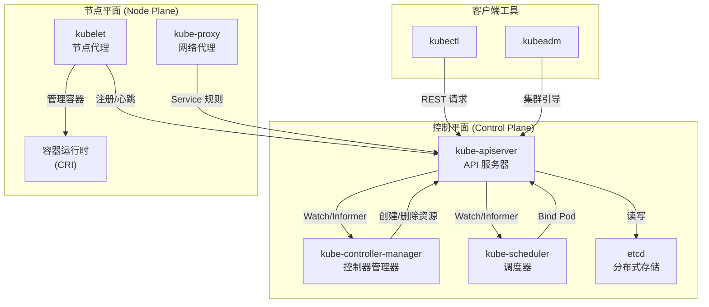
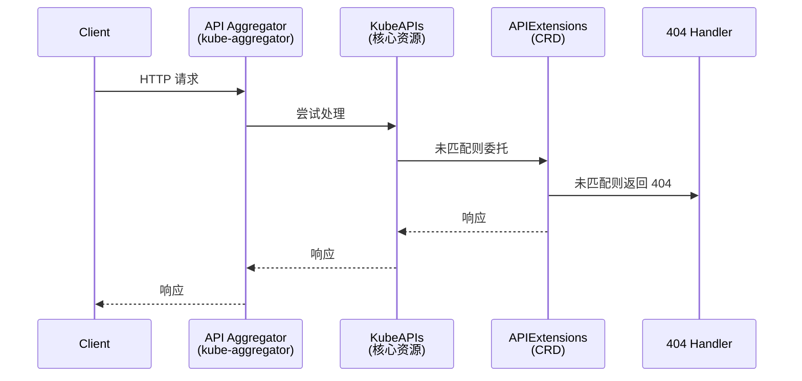

Kubernetes（简称 K8s）是一个开源的容器编排系统，用于管理跨多个主机的容器化应用，提供部署、维护和扩展应用的基本机制。它源自 Google 运行大规模生产工作负载十五年所积累的 Borg 系统经验，结合了社区中最佳的理念与实践，由云原生计算基金会（CNCF）托管。本文档将带你从宏观视角俯瞰整个 Kubernetes 源码仓库的结构、核心组件与关键设计模式，为后续深入各子系统建立清晰的认知框架。

Sources: [README.md](README.md#L1-L23)

## 技术栈与构建体系

Kubernetes 使用 **Go 语言**编写（当前版本要求 Go 1.26），采用 **Go Modules** 和 **Go Workspace** 进行多模块依赖管理。整个项目由一个根模块 `k8s.io/kubernetes` 和 33 个 staging 子模块组成，通过 `go.work` 文件统一协调。项目的构建入口是根目录的 [Makefile](Makefile#L1)（实际指向 [build/root/Makefile](build/root/Makefile#L27-L98)），常用的构建目标包括：`make all`（构建所有组件）、`make test`（运行测试）、`make verify`（代码检查）、`make update`（自动更新生成代码）。底层的构建逻辑由 `hack/make-rules/` 目录下的 Shell 脚本驱动，例如 [hack/make-rules/build.sh](hack/make-rules/build.sh#L17-L29) 负责设置 Go 环境并编译二进制文件。

Sources: [go.mod](go.mod#L1-L124), [go.work](go.work#L1-L42), [.go-version](.go-version#L1), [build/root/Makefile](build/root/Makefile#L67-L98)

## 整体架构概览

在阅读源码之前，理解 Kubernetes 的控制平面（Control Plane）与节点平面（Node Plane）的分层架构至关重要。下图展示了核心组件之间的协作关系：

上图揭示了 Kubernetes 的一个核心设计原则：**所有组件通过 API Server 进行通信，没有组件直接访问 etcd**（API Server 除外）。这种「Hub-and-Spoke」架构确保了：① 认证、授权与准入控制的一致性；② 存储层的可替换性；③ 组件间松耦合，便于独立演进。

Sources: [cmd/kube-apiserver/app/server.go](cmd/kube-apiserver/app/server.go#L17-L20), [cmd/kubelet/kubelet.go](cmd/kubelet/kubelet.go#L17-L22)

## 核心组件一览

Kubernetes 的核心可执行文件定义在 `cmd/` 目录下，每个组件都有独立的入口包。下表汇总了关键组件及其职责：

| 组件 | 入口文件 | 源码位置 | 核心职责 |
|------|---------|---------|---------|
| **kube-apiserver** | [cmd/kube-apiserver](cmd/kube-apiserver/apiserver.go) | `pkg/controlplane/`, `pkg/kubeapiserver/`, `pkg/registry/` | REST API 前端，集群共享状态的唯一入口，认证/授权/准入控制 |
| **kube-controller-manager** | [cmd/kube-controller-manager](cmd/kube-controller-manager/controller-manager.go) | `pkg/controller/` | 运行 40+ 内置控制器，驱动集群向期望状态收敛 |
| **kube-scheduler** | [cmd/kube-scheduler](cmd/kube-scheduler/scheduler.go) | `pkg/scheduler/` | 基于调度框架和插件体系，将 Pod 绑定到最优节点 |
| **kubelet** | [cmd/kubelet](cmd/kubelet/kubelet.go) | `pkg/kubelet/` | 节点代理，管理 Pod 生命周期，与容器运行时交互 |
| **kube-proxy** | [cmd/kube-proxy](cmd/kube-proxy/proxy.go) | `pkg/proxy/` | 维护 Service 的网络规则（iptables/IPVS/nftables） |
| **cloud-controller-manager** | [cmd/cloud-controller-manager](cmd/cloud-controller-manager/main.go) | staging `k8s.io/cloud-provider` | 云提供商相关的控制器循环 |
| **kubectl** | [cmd/kubectl](cmd/kubectl/kubectl.go) | staging `k8s.io/kubectl` | 命令行工具，与 API Server 交互 |
| **kubeadm** | [cmd/kubeadm](cmd/kubeadm/kubeadm.go) | `cmd/kubeadm/app/` | 集群引导工具，处理证书、配置和节点加入 |

每个组件的 `main()` 函数都极其简洁——创建一个 Cobra 命令对象，然后交由 `k8s.io/component-base/cli` 统一运行。真正的初始化逻辑封装在 `cmd/<component>/app/` 子包中，遵循「薄入口、厚实现」的设计原则。

Sources: [cmd/kubelet/kubelet.go](cmd/kubelet/kubelet.go#L35-L39), [cmd/kube-controller-manager/controller-manager.go](cmd/kube-controller-manager/controller-manager.go#L34-L38), [cmd/kube-scheduler/scheduler.go](cmd/kube-scheduler/scheduler.go#L29-L33), [cmd/kube-proxy/proxy.go](cmd/kube-proxy/proxy.go#L29-L33)

## 源码目录结构解析

Kubernetes 源码仓库体量庞大，但遵循清晰的分层组织。以下是顶层目录的功能划分：

| 目录 | 功能 | 示例内容 |
|------|------|---------|
| `cmd/` | **可执行程序入口** | 6 个核心组件 + 工具命令（文档生成、代码检查等） |
| `pkg/` | **核心业务逻辑** | 控制器、调度器、kubelet、代理、API 类型定义、存储卷插件等 |
| `staging/` | **Staging 子模块** | 33 个可独立发布的 `k8s.io/*` 库的源码 |
| `api/` | **API 定义** | OpenAPI 规范（swagger.json）、API 发现文档 |
| `hack/` | **构建与验证脚本** | 代码生成、更新脚本、80+ 个 `verify-*.sh` 检查脚本 |
| `build/` | **构建基础设施** | Dockerfile、发布脚本、构建镜像定义 |
| `cluster/` | **集群部署脚本** | GCE 等云平台的集群启停脚本、插件管理 |
| `test/` | **测试套件** | e2e 测试、集成测试、节点测试、性能基准测试、模糊测试 |
| `plugin/` | **准入控制与认证插件** | admission webhook、auth 插件 |
| `third_party/` | **第三方派生代码** | fork 的 golang、libcontainer 等工具 |
| `docs/` | **文档** | 文档相关配置 |
| `logo/` | **Logo 资源** | SVG/PNG/PDF 格式的项目标识 |

其中，`pkg/` 目录是源码阅读的核心区域，包含了 30+ 个子包，直接映射到 Kubernetes 的各个子系统：

- **`pkg/apis/`** — 26 个 API 组的类型定义（`core`、`apps`、`batch`、`networking` 等）
- **`pkg/registry/`** — 23 个 API 资源的 REST 存储实现
- **`pkg/controller/`** — 40+ 内置控制器（deployment、replicaset、job、cronjob、daemonset 等）
- **`pkg/scheduler/`** — 调度器框架与 26 个内置插件
- **`pkg/kubelet/`** — 节点代理的完整实现（Pod 管理、容器运行时交互、卷管理、探针等）
- **`pkg/proxy/`** — 网络代理的三种模式实现（iptables、IPVS、nftables）
- **`pkg/volume/`** — 15+ 种存储卷插件（CSI、NFS、iSCSI、hostPath 等）
- **`pkg/controlplane/`** — 控制平面组装逻辑，将各 API 组注册到 API Server

Sources: [pkg/apis/](pkg/apis/OWNERS), [pkg/registry/](pkg/registry/doc.go), [pkg/controller/](pkg/controller/doc.go), [staging/README.md](staging/README.md#L1-L41)

## Staging 仓库机制

Kubernetes 项目采用了一种独特的 **Staging 仓库**模式来管理多模块发布。在 `staging/src/k8s.io/` 目录下，存放着 33 个独立 Go Module 的权威源码。这些代码**不是副本，而是唯一来源**——你在 `staging/` 目录中直接修改代码，发布机器人会自动将其同步到各自的 GitHub 仓库（如 `k8s.io/client-go`、`k8s.io/apimachinery` 等）。

通过 [go.work](go.work#L7-L42) 文件，Kubernetes 主仓库将这些 staging 模块纳入统一的工作空间，使得开发时的 import 路径 `k8s.io/client-go` 直接解析到本地的 `staging/src/k8s.io/client-go`。这种设计实现了：① 组件的独立发布和版本管理；② 主仓库内的原子性跨模块修改；③ 外部用户可以引用稳定的发布版本。

最关键的 staging 模块包括：

| Staging 模块 | 用途 |
|-------------|------|
| `k8s.io/api` | 所有 API 资源的类型定义（Pod、Service、Deployment 等） |
| `k8s.io/apimachinery` | API 机器库：运行时类型系统、序列化、标签选择器、Watch 机制 |
| `k8s.io/apiserver` | 通用 API Server 框架：REST 处理链、认证、授权、准入 |
| `k8s.io/client-go` | 官方 Go 客户端库：Clientset、Informer、Lister 等 |
| `k8s.io/code-generator` | 代码生成工具：Clientset、Informer、Lister 的自动生成 |
| `k8s.io/component-base` | 组件基础库：命令行、日志、指标、Feature Gate |
| `k8s.io/kubectl` | kubectl 命令行工具的完整实现 |
| `k8s.io/cri-api` | 容器运行时接口（CRI）的 API 定义 |

Sources: [staging/README.md](staging/README.md#L1-L59), [go.work](go.work#L1-L42)

## API Server 的委托链模式

作为 Kubernetes 的「心脏」，API Server 采用了一种精巧的**委托链（Delegation Chain）**模式来组织三个嵌套的 API Server：

这三个层级在 [CreateServerChain](cmd/kube-apiserver/app/server.go#L176-L197) 函数中被组装。请求从最外层的 **Aggregator** 进入，逐级向内委托。最内层的 **APIExtensions** 负责处理 CustomResourceDefinition（CRD），中间的 **KubeAPIs** 处理所有内置资源（Pod、Service 等），最外层的 **Aggregator** 负责 API 聚合和版本优先级管理。[pkg/controlplane/instance.go](pkg/controlplane/instance.go#L86-L100) 中可以清晰地看到所有内置 API 组的 REST 存储注册过程。

Sources: [cmd/kube-apiserver/app/server.go](cmd/kube-apiserver/app/server.go#L147-L197), [pkg/controlplane/instance.go](pkg/controlplane/instance.go#L17-L100)

## 控制器：声明式调谐的核心

Kubernetes 的声明式模型由控制器体系驱动。`pkg/controller/` 目录下包含 40+ 内置控制器，每个控制器遵循同一个核心模式：**通过 Informer Watch 资源变化 → 比较期望状态与实际状态 → 执行调谐操作使两者一致**。这种「观察-分析-行动」的循环是 Kubernetes 实现自愈能力的基础。

核心控制器按功能分类如下：

| 类别 | 控制器 | 职责 |
|------|--------|------|
| **工作负载** | deployment, replicaset, statefulset, daemonset, job, cronjob | 管理应用部署与伸缩 |
| **网络** | endpoint, endpointslice, endpointslicemirroring, servicecidrs | 维护服务发现与端点映射 |
| **节点** | nodelifecycle, nodeipam, tainteviction | 节点生命周期与污点驱逐 |
| **安全** | serviceaccount, certificates, clusterroleaggregation | 服务账户令牌、证书签发、RBAC 聚合 |
| **存储** | volume, resourceclaim, storageversionmigrator | 卷挂载、资源声明、存储版本迁移 |
| **策略** | disruption, resourcequota, podautoscaler, namespace | 中断预算、资源配额、HPA 自动伸缩 |
| **垃圾回收** | garbagecollector, podgc, ttl, ttlafterfinished | 资源级联删除、Pod 清理、TTL 过期 |

Sources: [pkg/controller/](pkg/controller/doc.go), [cmd/kube-controller-manager/controller-manager.go](cmd/kube-controller-manager/controller-manager.go#L17-L20)

## 调度器：插件化的决策引擎

调度器位于 `pkg/scheduler/`，采用 **调度框架（Scheduling Framework）** 架构，将调度决策拆解为一系列可扩展的扩展点。`pkg/scheduler/framework/plugins/` 下包含 26 个内置插件，涵盖节点亲和性、污点容忍、拓扑分布、卷绑定等策略。调度周期分为：**QueueSort → PreFilter → Filter → PostFilter → PreScore → Score → NormalizeScore → Reserve → Permit → PreBind → Bind → PostBind**，每个阶段都可以通过插件自定义行为。

Sources: [cmd/kube-scheduler/scheduler.go](cmd/kube-scheduler/scheduler.go#L17-L33), [pkg/scheduler/](pkg/scheduler/OWNERS)

## 测试体系

Kubernetes 拥有业界顶级的测试覆盖体系，测试代码分布在 `test/` 目录的多个子目录中：

| 测试类型 | 目录 | 范围 |
|---------|------|------|
| **端到端测试 (e2e)** | `test/e2e/` | 全集群功能验证，覆盖所有 API 组 |
| **节点级测试 (e2e_node)** | `test/e2e_node/` | Kubelet 特有的功能测试 |
| **集成测试** | `test/integration/` | 组件间交互验证（调度器、控制器、API Server 等） |
| **性能基准** | `test/integration/scheduler_perf/` | 调度器性能基准测试 |
| **模糊测试** | `test/fuzz/` | CBOR/JSON/YAML 解析的模糊测试 |
| **一致性测试** | `test/conformance/` | 确保所有 Kubernetes 发行版行为一致 |

Sources: [test/e2e/](test/e2e/README.md), [test/e2e_node/README.md](test/e2e_node/README.md)

## 如何开始源码阅读

对于初学者，面对数百万行代码难免感到无从下手。以下是基于本系列文档目录的推荐阅读路径：

1. **先建骨架** — 从本文（项目总览）开始，理解整体架构和组件关系
2. **搭建环境** — 阅读 [快速上手：从源码构建 Kubernetes](2-kuai-su-shang-shou-cong-yuan-ma-gou-jian-kubernetes)，完成本地构建
3. **理解组织** — 通过 [项目目录结构与代码组织](3-xiang-mu-mu-lu-jie-gou-yu-dai-ma-zu-zhi) 建立代码导航能力
4. **掌握工作流** — 阅读 [开发工作流：构建、测试与代码检查](4-kai-fa-gong-zuo-liu-gou-jian-ce-shi-yu-dai-ma-jian-cha) 了解开发节奏
5. **深入核心** — 依次阅读控制平面各组件：[API Server](7-api-server-qi-dong-liu-cheng-yu-qing-qiu-chu-li-lian-lu) → [控制器管理器](9-kong-zhi-qi-guan-li-qi-yu-nei-zhi-kong-zhi-qi-ti-xi) → [调度器](10-diao-du-qi-jia-gou-yu-diao-du-kuang-jia-cha-jian-ji-zhi) → [Kubelet](8-kubelet-pod-sheng-ming-zhou-qi-guan-li-yu-rong-qi-yun-xing-shi-jiao-hu)

记住一个关键原则：**所有 roads lead to API Server**。无论你最终关注哪个组件，理解 API Server 的请求处理链路都是必要的起点。