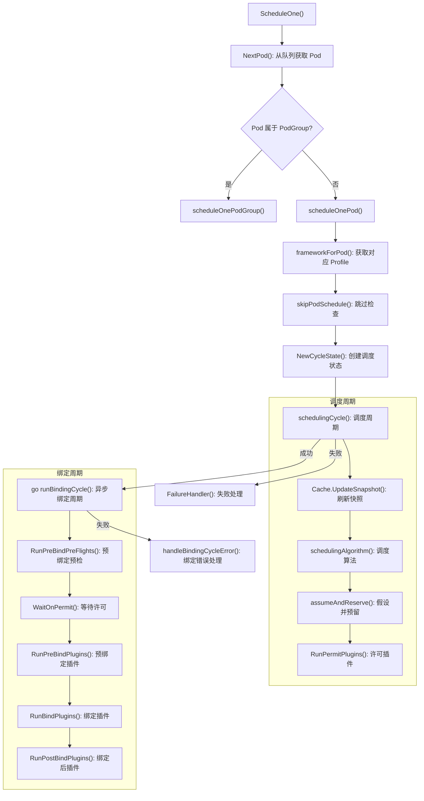

本文深入剖析 Kubernetes 调度器的整体架构设计，从启动入口到调度循环的完整链路，重点阐释调度框架（Scheduling Framework）的插件化机制——包括插件注册表、扩展点定义、生命周期管理以及调度周期（Scheduling Cycle）与绑定周期（Binding Cycle）的双阶段执行模型。阅读本文后，你将理解调度器如何通过可组合的插件体系实现高度可扩展的 Pod 放置决策。

Sources: [scheduler.go](pkg/scheduler/scheduler.go#L68-L125), [interface.go](pkg/scheduler/framework/interface.go#L176-L308)

## 调度器启动入口与组件初始化

kube-scheduler 的进程入口位于 `cmd/kube-scheduler/scheduler.go`，通过 `app.NewSchedulerCommand()` 创建 Cobra 命令，最终调用 `app.runCommand()` 完成配置解析与调度器实例化。整个启动链路可概括为：**命令行解析 → 配置加载与转换 → 注册表构建 → 框架实例化 → 事件处理器注册 → 运行调度循环**。

`Setup()` 函数（位于 `cmd/kube-scheduler/app/server.go`）负责将 `Options` 转换为 `CompletedConfig` 并调用 `scheduler.New()` 构造 `Scheduler` 实例。`Run()` 函数随后启动领导选举、Informer 同步、健康检查端点，并在获得领导权后调用 `sched.Run(ctx)` 进入调度主循环。

Sources: [scheduler.go](cmd/kube-scheduler/scheduler.go#L29-L33), [server.go](cmd/kube-scheduler/app/server.go#L141-L171), [server.go](cmd/kube-scheduler/app/server.go#L174-L348)

## Scheduler 结构体与核心依赖

`Scheduler` 结构体是整个调度器的顶层协调者，它聚合了调度所需的所有运行时依赖：

| 字段 | 类型 | 职责 |
|---|---|---|
| `Cache` | `internalcache.Cache` | 维护集群状态的内存缓存（节点、Pod、资源） |
| `SchedulingQueue` | `SchedulingQueue` | 管理待调度 Pod 的优先级队列 |
| `Profiles` | `profile.Map` | 以调度器名称索引的 Framework 实例集合 |
| `Extenders` | `[]fwk.Extender` | 外部扩展器（HTTP 调用） |
| `APIDispatcher` | `*apidispatcher.APIDispatcher` | 异步 API 调用分发器 |
| `NextPod` | `func(...) (*framework.QueuedPodInfo, error)` | 阻塞式获取下一个待调度 Pod |
| `SchedulePod` | `func(...) (ScheduleResult, error)` | 执行调度算法的核心函数 |
| `nodeInfoSnapshot` | `*internalcache.Snapshot` | 节点信息的快照（每次调度周期刷新） |

`New()` 构造函数采用 **函数选项模式**（Functional Options），通过 `WithProfiles`、`WithParallelism`、`WithExtenders` 等选项灵活配置调度器。构造过程的关键步骤包括：创建内置插件注册表并合并外部插件、构建 Extender 实例、初始化调度缓存与快照、通过 `profile.NewMap()` 为每个调度配置创建独立的 Framework 实例，以及构建调度队列并注册事件处理器。

Sources: [scheduler.go](pkg/scheduler/scheduler.go#L68-L125), [scheduler.go](pkg/scheduler/scheduler.go#L277-L468)

## 调度主循环：从队列到绑定

调度器的运行入口是 `Run()` 方法，它启动队列的后台协程，并在独立协程中以 `wait.UntilWithContext` 持续调用 `ScheduleOne()`：

```go
go wait.UntilWithContext(ctx, sched.ScheduleOne, 0)
```

`ScheduleOne()` 是单次调度的完整编排入口。它首先通过 `NextPod()`（实际为 `SchedulingQueue.Pop()`）阻塞获取下一个待调度 Pod，然后根据 Pod 是否属于 PodGroup 分别进入 `scheduleOnePodGroup()` 或 `scheduleOnePod()` 流程。

以下 Mermaid 图展示了单个 Pod 调度的完整生命周期：



这个双阶段模型的设计意图是：**调度周期是同步的**，确保在同一时刻只有一个 Pod 在进行调度决策；**绑定周期是异步的**（`go sched.runBindingCycle(...)`），因为绑定操作需要与 API Server 通信，不应阻塞后续 Pod 的调度。

Sources: [scheduler.go](pkg/scheduler/scheduler.go#L546-L573), [schedule_one.go](pkg/scheduler/schedule_one.go#L65-L148), [schedule_one.go](pkg/scheduler/schedule_one.go#L174-L251)

## 调度算法核心：过滤与打分

`schedulingAlgorithm()` 方法封装了过滤与打分的核心逻辑，它调用 `schedulePod()` 完成实际的节点选择。`schedulePod()` 的执行流程分为三个阶段：

**1. PreFilter 阶段** — `findNodesThatFitPod()` 首先运行 `RunPreFilterPlugins()`，对 Pod 进行预过滤检查并可能缩减候选节点范围（通过 `PreFilterResult.NodeNames`）。PreFilter 还支持返回 `Skip` 状态以跳过关联的 Filter 插件。

**2. Filter 阶段** — `findNodesThatPassFilters()` 并行地对候选节点运行 Filter 插件。调度器使用 `percentageOfNodesToScore` 策略控制评估的节点数量，在大规模集群中仅评估部分节点即可做出合理决策。Filter 阶段会考虑已提名（Nominated）的 Pod 对节点资源的影响。

**3. Score 阶段** — `prioritizeNodes()` 先运行 `RunPreScorePlugins()`，然后通过 `RunScorePlugins()` 并行地对每个节点打分。每个 Score 插件的原始分数经过 `NormalizeScore` 标准化后，按配置的权重加权求和，最终选出得分最高的节点。

Sources: [schedule_one.go](pkg/scheduler/schedule_one.go#L254-L310), [schedule_one.go](pkg/scheduler/schedule_one.go#L567-L624), [schedule_one.go](pkg/scheduler/schedule_one.go#L626-L718), [schedule_one.go](pkg/scheduler/schedule_one.go#L938-L975)

## 调度框架接口体系

调度框架（Scheduling Framework）的接口定义在 `pkg/scheduler/framework/interface.go` 中的 `Framework` 接口。这是一个庞大的接口，既嵌入了 `fwk.Handle`（提供共享列表器、客户端等基础设施），又定义了运行各扩展点插件的方法。核心方法及其对应的扩展点如下表所示：

| Framework 方法 | 扩展点 | 执行阶段 |
|---|---|---|
| `RunPreFilterPlugins()` | PreFilter | 调度周期，过滤前 |
| `RunFilterPlugins()` | Filter | 调度周期，逐节点过滤 |
| `RunPostFilterPlugins()` | PostFilter | 调度周期，过滤失败后（抢占） |
| `RunPreScorePlugins()` | PreScore | 调度周期，打分前 |
| `RunScorePlugins()` | Score | 调度周期，逐节点打分 |
| `RunReservePluginsReserve()` | Reserve | 调度周期，资源预留 |
| `RunPermitPlugins()` | Permit | 调度周期，许可/等待 |
| `WaitOnPermit()` | Permit (wait) | 绑定周期，等待许可 |
| `RunPreBindPlugins()` | PreBind | 绑定周期，绑定前 |
| `RunBindPlugins()` | Bind | 绑定周期，执行绑定 |
| `RunPostBindPlugins()` | PostBind | 绑定周期，绑定后 |
| `QueueSortFunc()` | QueueSort | 队列排序 |
| `RunPlacementGeneratePlugins()` | PlacementGenerate | PodGroup 调度 |

`CycleState` 是贯穿单个 Pod 调度周期的状态容器，基于 `sync.Map` 实现，优化了"一次写入、多次读取"的典型使用模式。插件在 PreFilter/PreScore 阶段写入状态数据，在后续 Filter/Score 阶段读取，实现了跨扩展点的数据传递。

Sources: [interface.go](pkg/scheduler/framework/interface.go#L176-L308), [cycle_state.go](pkg/scheduler/framework/cycle_state.go#L28-L49), [cycle_state.go](pkg/scheduler/framework/cycle_state.go#L124-L164)

## frameworkImpl：框架的运行时实现

`frameworkImpl`（定义在 `pkg/scheduler/framework/runtime/framework.go`）是 `Framework` 接口的内部实现。它将插件按扩展点分类存储在独立的切片中：

```go
type frameworkImpl struct {
    preFilterPlugins   []fwk.PreFilterPlugin
    filterPlugins      []fwk.FilterPlugin
    postFilterPlugins  []fwk.PostFilterPlugin
    preScorePlugins    []fwk.PreScorePlugin
    scorePlugins       []fwk.ScorePlugin
    reservePlugins     []fwk.ReservePlugin
    preBindPlugins     []fwk.PreBindPlugin
    bindPlugins        []fwk.BindPlugin
    postBindPlugins    []fwk.PostBindPlugin
    permitPlugins      []fwk.PermitPlugin
    queueSortPlugins   []fwk.QueueSortPlugin
    preEnqueuePlugins  []fwk.PreEnqueuePlugin
    // ...
    scorePluginWeight  map[string]int
}
```

`getExtensionPoints()` 方法将所有扩展点统一为 `extensionPoint` 结构体数组，每个条目包含配置中的插件集（`PluginSet`）和对应的实现切片指针。这种设计使得插件初始化可以通过统一的循环完成，而非为每个扩展点编写重复的分派逻辑。

Sources: [framework.go](pkg/scheduler/framework/runtime/framework.go#L58-L112), [framework.go](pkg/scheduler/framework/runtime/framework.go#L114-L142)

## 插件注册表与初始化流程

插件注册表（`Registry`）是 `map[string]PluginFactory` 类型的映射，键为插件名称，值为工厂函数。`PluginFactory` 的签名是：

```go
type PluginFactory = func(ctx context.Context, configuration runtime.Object, f fwk.Handle) (fwk.Plugin, error)
```

**内置插件注册表** 由 `NewInTreeRegistry()` 构建，包含了所有 Kubernetes 原生调度插件。以下表格列出了全部内置插件及其实现的关键扩展点接口：

| 插件名称 | 主要扩展点 | 功能描述 |
|---|---|---|
| `NodeResourcesFit` | PreFilter, Filter, Score | 节点资源匹配与打分 |
| `NodeResourcesBalancedAllocation` | Score | 资源均衡分配打分 |
| `NodeAffinity` | PreFilter, Filter, Score | 节点亲和性调度 |
| `NodeName` | Filter | 按 NodeName 精确匹配 |
| `NodePorts` | PreFilter, Filter | 主机端口冲突检查 |
| `NodeUnschedulable` | Filter | 跳过不可调度节点 |
| `NodeDeclaredFeatures` | Filter | 节点声明特性过滤 |
| `TaintToleration` | PreFilter, Filter, Score | 污点与容忍度匹配 |
| `PodTopologySpread` | PreFilter, Filter, Score | 拓扑分布约束 |
| `InterPodAffinity` | PreFilter, Filter, Score | Pod 间亲和/反亲和 |
| `VolumeBinding` | PreFilter, Filter, Score, Reserve, PreBind | 卷绑定调度 |
| `VolumeRestrictions` | Filter | 卷使用限制 |
| `VolumeZone` | Filter | 卷拓扑区域限制 |
| `NodeVolumeLimits` | Filter | CSI 卷数量限制 |
| `ImageLocality` | Score | 镜像本地性打分 |
| `DefaultPreemption` | PostFilter | 默认抢占策略 |
| `DefaultBinder` | Bind | 默认绑定实现 |
| `QueueSort` | QueueSort | 优先级排序 |
| `SchedulingGates` | PreEnqueue | 调度门控 |
| `DynamicResources` | PreFilter, Filter, Score, Reserve, PreBind | DRA 动态资源分配 |
| `TopologyAware` | Score | 拓扑感知打分 |

`NewFramework()` 的初始化流程如下：首先遍历注册表，仅实例化配置中需要的插件（通过 `pluginsNeeded()` 过滤）；然后通过 `getExtensionPoints()` 将插件实例分派到对应的扩展点切片；接着处理 `MultiPoint` 配置（允许一个插件同时注册到多个扩展点）；最后验证约束条件（如 QueueSort 必须有且仅有一个、Bind 至少一个）并计算 Score 权重。

Sources: [registry.go](pkg/scheduler/framework/runtime/registry.go#L30-L101), [plugins/registry.go](pkg/scheduler/framework/plugins/registry.go#L47-L79), [framework.go](pkg/scheduler/framework/runtime/framework.go#L327-L505)

## 插件扩展点的执行语义

每个扩展点都有特定的执行语义，理解这些语义对编写自定义插件至关重要：

**PreFilter** — 顺序执行所有 PreFilter 插件，任一插件返回非 Success/Skip 状态即终止调度周期。支持返回 `PreFilterResult` 以缩减候选节点集合。若返回 Skip，则对应的 Filter 插件在本周期内被跳过。

**Filter** — 对每个候选节点并行执行，任一 Filter 插件返回非 Success 即排除该节点。`RunFilterPluginsWithNominatedPods()` 会考虑已提名的高优先级 Pod，执行两轮过滤以确保在保守和乐观场景下均可调度。

**PostFilter** — 当 Filter 阶段没有可行节点时触发，顺序执行直到首个 Success、Error 或 UnschedulableAndUnresolvable。主要用于抢占（Preemption）逻辑。

**Score** — 并行地对所有可行节点执行每个 Score 插件的 `Score()` 方法，然后并行执行 `NormalizeScore()` 标准化。最终分数按权重加权求和。

**Reserve** — 在 Pod 被假设调度到节点后执行，用于声明资源预留。若后续阶段失败，通过 `Unreserve()` 回滚。

**Permit** — 可返回 Success、Wait 或 Reject。Wait 状态使 Pod 进入等待队列，最长等待 15 分钟，支持批处理场景下的协调调度。

**Bind** — 顺序执行，插件可返回 Skip 以将绑定责任传递给下一个插件。`DefaultBinder` 最终执行与 API Server 的绑定请求。

Sources: [framework.go](pkg/scheduler/framework/runtime/framework.go#L916-L983), [framework.go](pkg/scheduler/framework/runtime/framework.go#L1089-L1197), [framework.go](pkg/scheduler/framework/runtime/framework.go#L1284-L1398)

## 调度队列与事件驱动机制

调度队列（`SchedulingQueue`）由 `PriorityQueue` 实现，内部维护三个子队列：

| 子队列 | 用途 |
|---|---|
| `activeQ` | 优先级堆，存放当前可调度的 Pod |
| `backoffQ` | 存放退避等待中的 Pod（调度失败后指数退避） |
| `unschedulablePods` | 存放被判定为不可调度的 Pod |

Pod 在队列间的流转由集群事件驱动。每个插件通过实现 `EnqueueExtensions` 接口声明其关注的 `ClusterEvent`（如节点添加、污点变更、PV 变化等）。当相应事件发生时，调度器的 Informer 事件处理器（定义在 `eventhandlers.go`）调用 `MoveAllToActiveOrBackoffQueue()`，根据注册的 QueueingHint 函数决定是否将不可调度的 Pod 重新激活。这种**事件驱动的重调度机制**是调度器效率的关键——避免无意义的重试，只在集群状态真正变化时才重新尝试调度。

Sources: [scheduling_queue.go](pkg/scheduler/backend/queue/scheduling_queue.go#L96-L153), [scheduling_queue.go](pkg/scheduler/backend/queue/scheduling_queue.go#L164-L200), [eventhandlers.go](pkg/scheduler/eventhandlers.go#L53-L141)

## 调度 Profile 与多调度器支持

Kubernetes 支持在同一集群中运行多个调度器或同一调度器的多个配置。这通过 **Profile** 机制实现——每个 `KubeSchedulerProfile` 定义一组插件配置和权重，生成一个独立的 `Framework` 实例。Pod 通过 `spec.schedulerName` 字段选择使用哪个 Profile。

`profile.NewMap()` 负责为每个 Profile 配置创建 Framework 实例，并执行跨 Profile 验证：所有 Profile 必须使用相同的 QueueSort 插件（因为它们共享同一个调度队列），但其他插件可以完全不同。这种设计允许在同一个调度器进程中以不同的调度策略服务于不同工作负载。

Sources: [profile.go](pkg/scheduler/profile/profile.go#L46-L65), [profile.go](pkg/scheduler/profile/profile.go#L92-L129), [scheduler.go](pkg/scheduler/scheduler.go#L362-L381)

## Extender 机制：HTTP 级别的调度扩展

除了框架插件外，调度器还支持通过 **Extender** 进行 HTTP 级别的扩展。Extender 在 Filter 和 Score 阶段作为额外的过滤器和打分器，串行调用。Extender 机制是调度器早期的扩展方式，相比框架插件存在性能开销（HTTP 调用）和功能限制（不支持 Reserve、Permit 等扩展点），但在不修改调度器源码的前提下提供了灵活的扩展能力。

Sources: [extender.go](pkg/scheduler/extender.go#L1-L50), [schedule_one.go](pkg/scheduler/schedule_one.go#L892-L936)

## 后续阅读

本文从架构层面解析了调度器的框架设计与插件机制。若要深入理解具体插件的实现细节，请参阅 [调度框架接口与扩展点（Filter、Score、Bind 等）](15-diao-du-kuang-jia-jie-kou-yu-kuo-zhan-dian-filter-score-bind-deng)；若要了解各内置插件的调度逻辑，请参阅 [调度器内置插件详解（节点亲和性、污点容忍、拓扑分布等）](16-diao-du-qi-nei-zhi-cha-jian-xiang-jie-jie-dian-qin-he-xing-wu-dian-rong-ren-tuo-bu-fen-bu-deng)；若要理解动态资源分配如何与调度框架集成，请参阅 [动态资源分配（DRA）与设备管理](17-dong-tai-zi-yuan-fen-pei-dra-yu-she-bei-guan-li)。