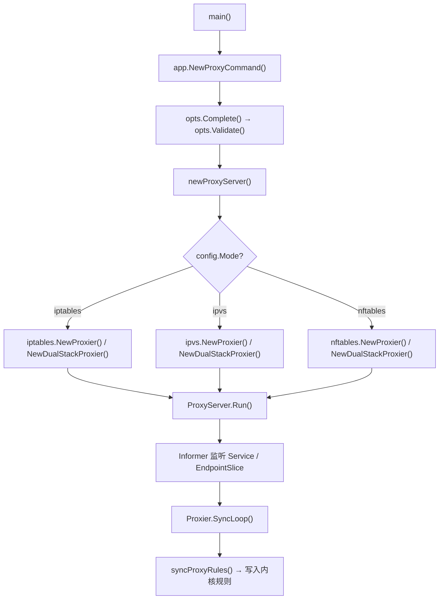
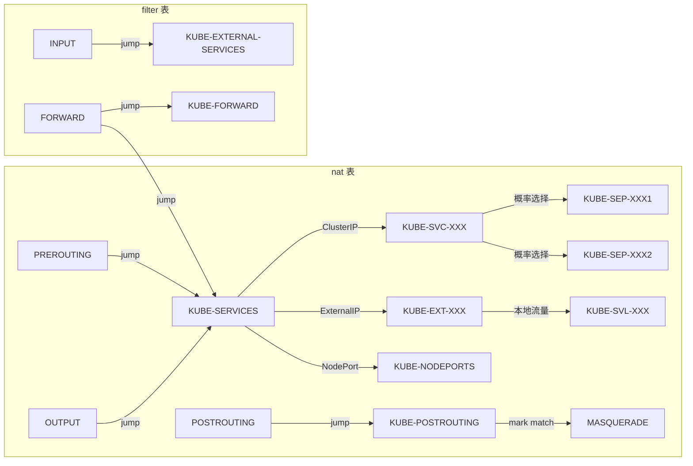
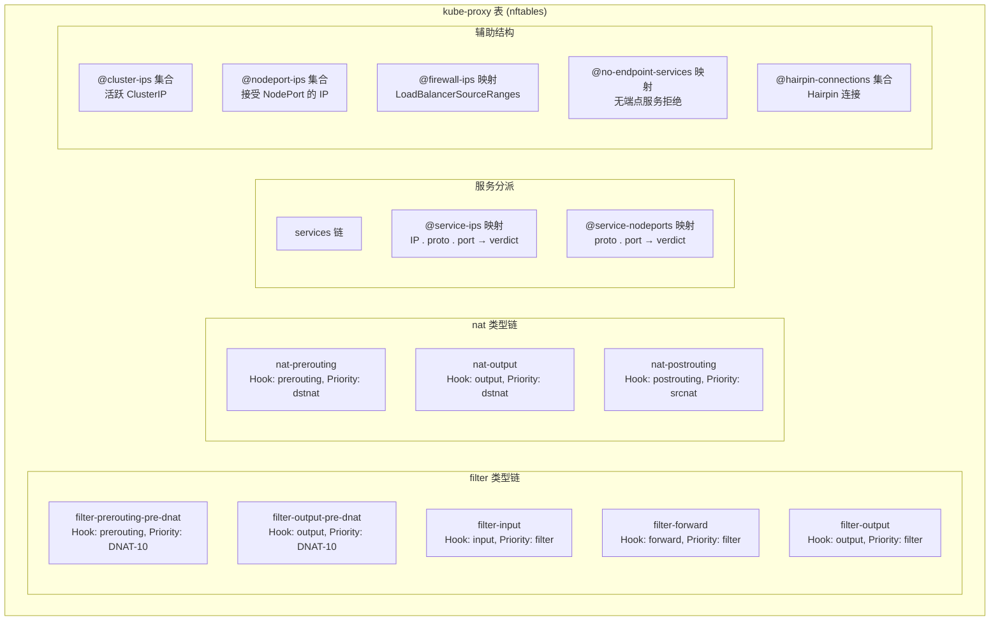
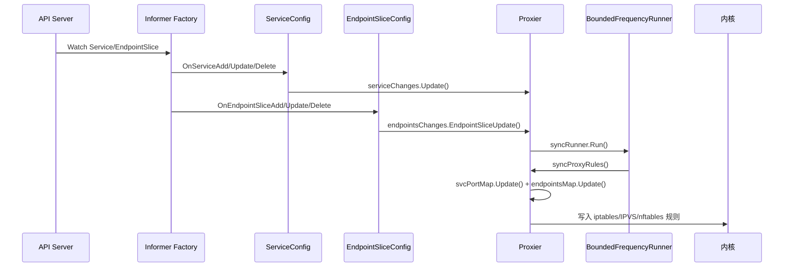

Kube-proxy 是运行在每个 Kubernetes 节点上的网络代理组件，负责将 Service 的虚拟 IP（ClusterIP、NodePort、LoadBalancer）正确路由到后端 Pod 端点。Linux 节点上支持三种代理模式——**iptables**、**IPVS** 和 **nftables**——它们都基于内核 netfilter 框架，但在数据结构、性能特征和规则管理方式上存在本质差异。本文将从源码层面剖析这三种模式的架构设计、规则生成逻辑和关键实现细节。

Sources: [proxy.go](cmd/kube-proxy/proxy.go#L29-L33), [types.go](pkg/proxy/apis/config/types.go#L253-L256)

## 总体架构：启动流程与模式选择

Kube-proxy 的入口函数极其简洁——创建 `ProxyCommand` 并通过 `cli.Run` 启动。真正的工作发生在 `app.NewProxyCommand()` → `opts.Run()` → `newProxyServer()` → `createProxier()` 这条调用链中。在 Linux 平台上，`createProxier` 根据 `config.Mode` 的值（`"iptables"` / `"ipvs"` / `"nftables"`）实例化对应的 Proxier 实现，它们全部满足统一的 `proxy.Provider` 接口。



**模式默认值**在 `platformApplyDefaults` 中设定：当用户未显式指定 `--proxy-mode` 时，Linux 默认采用 iptables 模式。双栈（DualStack）场景下，三种模式均通过 `metaproxier.NewMetaProxier` 将 IPv4 和 IPv6 两个单栈 Proxier 实例封装在一起，EndpointSlice 事件根据 `AddressType` 分派给对应协议栈处理。

Sources: [server.go](cmd/kube-proxy/app/server.go#L100-L159), [server_linux.go](cmd/kube-proxy/app/server_linux.go#L47-L62), [server_linux.go](cmd/kube-proxy/app/server_linux.go#L129-L298), [meta_proxier.go](pkg/proxy/metaproxier/meta_proxier.go#L26-L55)

## Provider 接口：统一的代理抽象

所有 Proxier 实现都遵循 `proxy.Provider` 接口，这是整个代理体系的核心契约：

```go
type Provider interface {
    config.EndpointSliceHandler
    config.ServiceHandler
    config.NodeTopologyHandler
    config.ServiceCIDRHandler
    Sync()
    SyncLoop()
}
```

`ServiceHandler` 和 `EndpointSliceHandler` 定义了事件回调（`OnServiceAdd`、`OnEndpointSliceUpdate` 等），由 `ProxyServer.Run()` 中注册的 Informer 配置对象触发。`Sync()` 触发异步同步，`SyncLoop()` 启动永不返回的周期同步循环。三种模式的 Proxier 在事件处理流程上完全一致：收到 Service 或 EndpointSlice 变更 → 记录到 ChangeTracker → 调用 `syncRunner.Run()` 触发 `syncProxyRules()`。

Sources: [types.go](pkg/proxy/types.go#L28-L40), [config.go](pkg/proxy/config/config.go#L40-L53)

## 同步引擎：BoundedFrequencyRunner

三种模式共享同一个同步调度器——`runner.BoundedFrequencyRunner`。它提供三个时间参数来控制 `syncProxyRules()` 的执行频率：

| 参数 | 作用 | 对应配置 |
|------|------|---------|
| `minInterval` | 两次执行之间的最小间隔 | `--min-sync-period` |
| `retryInterval` | 执行失败后的重试间隔 | `--sync-period` |
| `maxInterval` | 无论是否有变更，强制执行的最大间隔 | 固定值 `FullSyncPeriod`（约 30s） |

其核心保证是：(1) 两次成功执行之间至少间隔 `minInterval`；(2) 至少每隔 `maxInterval` 执行一次；(3) 若 `syncProxyRules()` 返回错误，则最多在 `retryInterval` 后重试。这种设计既避免了频繁规则同步对系统的冲击，又确保了规则最终一致。

Sources: [bounded_frequency_runner.go](pkg/proxy/runner/bounded_frequency_runner.go#L29-L155)

## iptables 模式

### 架构概述

iptables 模式是 Linux 上 kube-proxy 的默认模式。它通过 `iptables-restore` 批量写入 NAT 规则实现 Service IP 到端点 IP 的 DNAT（目标地址转换），使用 filter 表规则实现防火墙和端点过滤。

### 链组织与规则生成

iptables Proxier 在 `syncProxyRules()` 中构建的链结构如下：



核心链命名规则采用 SHA256 哈希截断到 16 字符的策略，以保持链名不超过 28 字符限制：

| 前缀 | 用途 | 示例 |
|------|------|------|
| `KUBE-SVC-` | 服务主链，Cluster 流量策略入口 | `KUBE-SVC-ABCD1234EFGH5678` |
| `KUBE-SEP-` | 端点链，执行 DNAT 到具体 Pod IP | `KUBE-SEP-IJKL9012MNOP3456` |
| `KUBE-SVL-` | 本地流量策略链，仅转发到本地端点 | `KUBE-SVL-QRST7890UVWX1234` |
| `KUBE-EXT-` | 外部流量入口，区分内外来源 | `KUBE-EXT-YZAB5678CDEF9012` |
| `KUBE-FW-` | LoadBalancerSourceRanges 防火墙链 | `KUBE-FW-GHIJ3456KLMN7890` |

**负载均衡**通过 iptables 的统计模块（`--statistics`）实现概率选择：每个端点链以 `1/N` 的概率被匹配，其中 N 为剩余未匹配端点数。当集群端点总数超过 `largeClusterEndpointsThreshold`（1000）时，Proxier 进入 **largeClusterMode**，此时会省略注释以缩减规则体积达 40% 以上。

Sources: [proxier.go](pkg/proxy/iptables/proxier.go#L53-L87), [proxier.go](pkg/proxy/iptables/proxier.go#L132-L209), [proxier.go](pkg/proxy/iptables/proxier.go#L346-L367), [proxier.go](pkg/proxy/iptables/proxier.go#L546-L594), [proxier.go](pkg/proxy/iptables/proxier.go#L638-L829)

### 规则同步机制

iptables 模式的 `syncProxyRules()` 采用 `iptables-restore` 进行原子性批量更新。它维护四个 LineBuffer（`filterChains`、`filterRules`、`natChains`、`natRules`）来拼接规则文本，最终通过 `iptables.RestoreAll()` 一次性提交。规则同步区分**全量同步**和**增量同步**：全量同步会重建所有跳转链（jump chains）并刷新 nfacct 计数器，增量同步仅更新服务/端点规则。全量同步在以下情况触发：(1) 首次启动；(2) iptables Monitor 检测到规则被外部刷除；(3) 距上次全量同步超过 `FullSyncPeriod`。

Sources: [proxier.go](pkg/proxy/iptables/proxier.go#L638-L724)

## IPVS 模式

### 架构概述

IPVS（IP Virtual Server）是内核内建的传输层负载均衡器，自 Kubernetes v1.11 起进入 GA 阶段。与 iptables 的线性规则匹配不同，IPVS 使用哈希表存储服务条目，在大量 Service 场景下具有显著的性能优势。值得注意的是，**IPVS 模式已被标记为弃用**（deprecated），源码中明确记录了警告信息，推荐用户迁移至 nftables 模式。

IPVS Proxier 的独特之处在于：负载均衡由 IPVS 内核模块直接完成，但 SNAT/masquerade 和包过滤仍然依赖 iptables + ipset 辅助实现。因此它同时持有 `ipvs.Interface`、`iptables.Interface` 和 `ipset.Interface` 三个后端引用。

Sources: [proxier.go](pkg/proxy/ipvs/proxier.go#L160-L249), [server_linux.go](cmd/kube-proxy/app/server_linux.go#L186-L197)

### 虚拟服务器与 dummy 接口

IPVS 模式通过 `kube-ipvs0` dummy 网络接口绑定所有 Service ClusterIP 地址，使内核"认为"这些 IP 属于本机，从而正确接收发往 Service IP 的数据包。在 `syncProxyRules()` 中，每个 Service 对应一个 `VirtualServer` 结构：

```go
serv := &utilipvs.VirtualServer{
    Address:   svcInfo.ClusterIP(),
    Port:      uint16(svcInfo.Port()),
    Protocol:  string(svcInfo.Protocol()),
    Scheduler: proxier.ipvsScheduler,  // 默认 "rr"（轮询）
}
```

IPVS 支持多种调度算法，包括 `rr`（轮询）、`lc`（最少连接）、`dh`（目标哈希）、`sh`（源哈希）、`sed`（最短期望延迟）、`nq`（永不排队）、`wlc`（加权最少连接）和 `wrr`（加权轮询）。会话亲和性通过 `FlagPersistent` 标记实现。

Sources: [proxier.go](pkg/proxy/ipvs/proxier.go#L90-L95), [proxier.go](pkg/proxy/ipvs/proxier.go#L844-L875)

### ipset 辅助 iptables 规则

为了保持 iptables 规则数量恒定（不随 Service 数量线性增长），IPVS 模式将需要 masquerade/drop 的地址集合存储在 ipset 中：

| ipset 名称 | 成员类型 | 用途 |
|------------|---------|------|
| `KUBE-CLUSTER-IP` | IP:Port | ClusterIP 的 masquerade 标记 |
| `KUBE-LOOP-BACK` | IP:Port:IP | Hairpin 流量的 masquerade |
| `KUBE-EXTERNAL-IP` | IP:Port | ExternalIP 的 masquerade |
| `KUBE-LOAD-BALANCER` | IP:Port | LoadBalancer IP 的 masquerade |
| `KUBE-LOAD-BALANCER-LOCAL` | IP:Port | ExternalTrafficPolicy=Local 的放行 |
| `KUBE-LOAD-BALANCER-FW` | IP:Port | LoadBalancerSourceRanges 过滤 |
| `KUBE-NODE-PORT-TCP/UDP/SCTP` | Port | NodePort 的 masquerade |

这种设计使得无论集群中有多少 Service，iptables 规则数量始终保持常数级。

Sources: [README.md](pkg/proxy/ipvs/README.md#L39-L58), [proxier.go](pkg/proxy/ipvs/proxier.go#L829-L843)

### 内核参数与兼容性检查

IPVS 模式启动时需要配置多项 sysctl 参数，包括 `net/ipv4/vs/conntrack`（启用连接跟踪）、`net/ipv4/vs/expire_nodest_conn`（目标不可达时过期连接）、`net/ipv4/vs/expire_quiescent_template`（静默模板过期）等。`CanUseIPVSProxier` 函数通过创建一个临时虚拟服务器（使用 `198.51.100.0:20000` 作为探测地址）来验证内核 IPVS 支持和调度算法可用性。

Sources: [proxier.go](pkg/proxy/ipvs/proxier.go#L97-L106), [proxier.go](pkg/proxy/ipvs/proxier.go#L280-L337), [supported.go](pkg/proxy/ipvs/supported.go#L35-L119)

## nftables 模式

### 架构概述

nftables 是 netfilter 的现代继任者，从内核 5.13 起（对应 nft ≥ 1.0.1）被 kube-proxy 支持。它使用单一 `kube-proxy` 表内建所有链、集合和映射，通过原子事务（transaction）进行规则更新。与 iptables 模式相比，nftables 具有更简洁的数据结构和更高的规则匹配效率。

nftables Proxier 不依赖 iptables 二进制文件，而是通过 `knftables` 库直接与内核通信。它使用 **集合和映射** 来存储服务条目和端点信息，使得规则数量与 Service 数量无关——这是区别于 iptables 模式线性规则增长的核心架构优势。

Sources: [proxier.go](pkg/proxy/nftables/proxier.go#L55-L98), [supported.go](pkg/proxy/nftables/supported.go#L32-L75)

### 链与 Hook 布局

nftables Proxier 在 `setupNFTables()` 中创建的基础链直接挂载到 netfilter 的五个核心 Hook：



**DNAT** 在 `nat-prerouting`（入站流量）和 `nat-output`（出站流量）中完成；**SNAT/masquerade** 在 `nat-postrouting` 中完成；**防火墙过滤**在 `filter-prerouting-pre-dnat` 中完成（优先级高于 DNAT）；**无端点服务的拒绝/丢弃**在 `filter-input`、`filter-forward` 和 `filter-output` 中完成。

Sources: [proxier.go](pkg/proxy/nftables/proxier.go#L328-L387), [README.md](pkg/proxy/nftables/README.md#L1-L140)

### 集合与映射驱动的规则分派

nftables 模式的核心创新在于大量使用 **nftables maps**（键值映射）和 **sets**（集合）来实现 O(1) 的服务查找。以 `service-ips` 映射为例，其类型为 `ipv4_addr . inet_proto . inet_service : verdict`，每条目将一个三元组（IP、协议、端口）映射到一个判决（verdict）——通常是跳转到该服务专属的端点选择链。当 Service 或 EndpointSlice 变更时，Proxier 仅需更新 map/set 中的元素，而非重写整条规则。

`nftElementStorage` 结构体跟踪元素的期望状态与实际状态之间的差异，在每次同步时仅添加/删除变化的元素，实现了最小化事务操作。

Sources: [proxier.go](pkg/proxy/nftables/proxier.go#L194-L200), [proxier.go](pkg/proxy/nftables/proxier.go#L410-L667)

### 内核版本要求

nftables 模式要求 `nft` 二进制版本 ≥ 1.0.1（因为更早版本会在启动时尝试解析整个规则集，可能因其他组件创建的新规则类型而崩溃）。由于难以直接检测 `nft` 版本，代码通过检查内核版本来间接验证：内核 ≥ 5.13 意味着对应的发行版 `nft` 版本 ≥ 1.0.1。用户可通过设置环境变量 `KUBE_PROXY_NFTABLES_SKIP_KERNEL_VERSION_CHECK` 绕过此检查。

Sources: [supported.go](pkg/proxy/nftables/supported.go#L40-L75)

## 三种模式对比

| 维度 | iptables | IPVS | nftables |
|------|----------|------|----------|
| **引入版本** | v1.1（v1.2 成为默认） | v1.8（v1.11 GA） | 较新版本（内核 ≥ 5.13） |
| **Linux 默认** | ✅ 是 | ❌ | ❌ |
| **弃用状态** | 当前默认 | ⚠️ 已弃用 | 推荐替代方案 |
| **数据结构** | 线性规则链 | 内核哈希表 + iptables 辅助 | nft maps/sets |
| **规则复杂度** | O(N) 匹配，N = Service × Endpoint | O(1) IPVS 查找 + O(1) ipset | O(1) map 查找 |
| **负载均衡** | 统计概率（`--statistics`） | 多种调度算法（rr/wlc/sh/lc...） | 链式概率选择 |
| **SNAT/Masquerade** | iptables nat 表 | iptables + ipset | nftables nat 链 |
| **双栈支持** | MetaProxier 封装 | MetaProxier 封装 | MetaProxier 封装 |
| **外部依赖** | iptables 二进制 | ipvsadm 内核模块 + ipset + iptables | nft ≥ 1.0.1 |
| **规则原子性** | `iptables-restore` 批量提交 | ipvs 系统调用 + iptables-restore | nft 事务（Transaction） |
| **规则数量增长** | 线性（每端点 N 条规则） | 常数（ipset 管理） | 常数（map/set 管理） |

Sources: [server_linux.go](cmd/kube-proxy/app/server_linux.go#L75-L78), [README.md](pkg/proxy/ipvs/README.md#L29-L38), [README.md](pkg/proxy/nftables/README.md#L52-L109)

## 事件驱动与规则同步流程

三种模式共享同一个事件驱动的规则同步框架。`ProxyServer.Run()` 启动后，会创建三个 Informer：Service Informer（排除 headless 服务和自定义代理）、EndpointSlice Informer（排除 headless 端点）以及可选的 ServiceCIDR Informer。这些 Informer 的变更事件被注册到对应的 Proxier 上：



`OnServiceSynced()` 和 `OnEndpointSlicesSynced()` 在初始数据同步完成后被调用，此时 Proxier 才将自身标记为 `initialized`，之后的事件变更才会触发 `Sync()`。这确保了 kube-proxy 重启时不会用部分数据更新规则。

Sources: [server.go](cmd/kube-proxy/app/server.go#L586-L637), [proxier.go](pkg/proxy/iptables/proxier.go#L459-L540)

## 双栈实现：MetaProxier 模式

当节点同时支持 IPv4 和 IPv6 时，`createProxier` 会调用各模式的 `NewDualStackProxier()`，内部创建两个独立的单栈 Proxier 实例，再通过 `metaproxier.NewMetaProxier()` 封装。MetaProxier 的分派逻辑很简单：

- **Service 事件**：同时转发给 IPv4 和 IPv6 Proxier（Service 可能同时配置两种 IP）
- **EndpointSlice 事件**：根据 `AddressType`（`IPv4` / `IPv6`）仅转发给对应 Proxier
- **Sync/SyncLoop**：IPv4 SyncLoop 在主 goroutine 运行，IPv6 SyncLoop 在独立 goroutine 运行

Sources: [meta_proxier.go](pkg/proxy/metaproxier/meta_proxier.go#L26-L55), [meta_proxier.go](pkg/proxy/metaproxier/meta_proxier.go#L87-L109)

## 模式切换与清理

当 kube-proxy 切换代理模式时，`platformCleanup()` 负责清理前一种模式的残留规则：

- 切换到 nftables 时：清理 iptables 和 IPVS 残留
- 切换到 iptables/IPVS 时：清理 nftables 残留
- `--cleanup-and-exit` 参数：清理所有模式的残留

`isIPTablesBased()` 辅助函数将 iptables 和 IPVS 归为同一阵营（因为 IPVS 依赖 iptables 辅助），nftables 则属于独立阵营。这种二分法确保了模式切换时不会误删正在使用的规则。

Sources: [server_linux.go](cmd/kube-proxy/app/server_linux.go#L76-L78), [server_linux.go](cmd/kube-proxy/app/server_linux.go#L340-L362)

## 延伸阅读

- 要了解 kube-proxy 如何融入控制平面的整体协作关系，参见 [控制平面组件总览与协作关系](6-kong-zhi-ping-mian-zu-jian-zong-lan-yu-xie-zuo-guan-xi)
- 要了解 kube-proxy 监听的 Service 和 EndpointSlice API 资源定义，参见 [API 资源定义与类型系统（pkg/apis）](12-api-zi-yuan-ding-yi-yu-lei-xing-xi-tong-pkg-apis)
- 要了解特性门控如何影响 kube-proxy 的行为（如 `MultiCIDRServiceAllocator`），参见 [特性门控系统与功能生命周期管理](28-te-xing-men-kong-xi-tong-yu-gong-neng-sheng-ming-zhou-qi-guan-li)