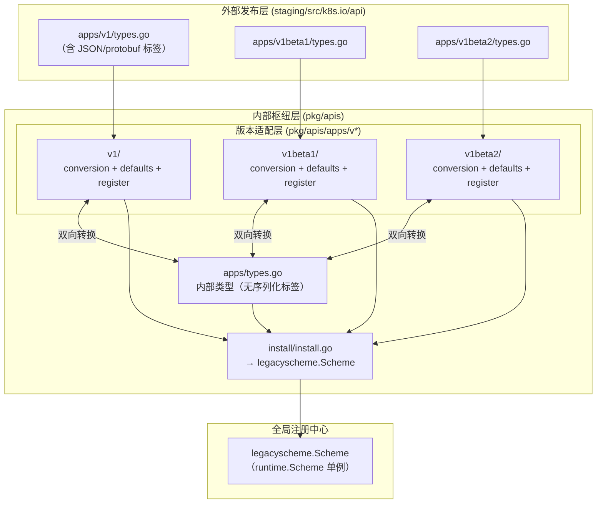
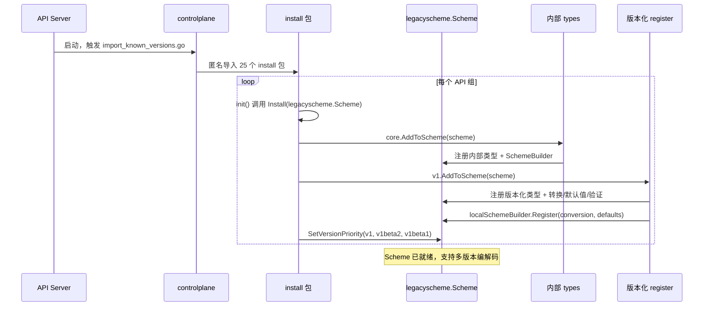

`pkg/apis` 是 Kubernetes 类型系统的核心——它定义了所有内置 API 资源的内存表示形态，并通过精密的多版本转换机制将内部类型（internal types）与面向外部的版本化类型（versioned types）桥接起来。理解这一层，是理解整个 API Server 请求处理链路、序列化/反序列化、以及版本兼容性策略的先决条件。本文将系统性地剖析 `pkg/apis` 的目录结构、类型定义范式、代码生成管线、版本转换机制以及全局注册流程。

Sources: [OWNERS](pkg/apis/OWNERS#L1-L18), [doc.go](pkg/apis/core/doc.go#L17-L25)

## 架构全景：双层类型体系

Kubernetes 的 API 类型系统采用了**中心辐射型（Hub-and-Spoke）**架构。在这一模型中，每个 API 组都有一个不带版本后缀的**内部类型**（`pkg/apis/<group>/types.go`），以及多个**版本化类型**（`pkg/apis/<group>/<version>/`），后者与外部发布类型（`staging/src/k8s.io/api/<group>/<version>/types.go`）一一对应。所有跨版本的请求处理流程统一经过内部类型作为中转枢纽。

Sources: [types.go](pkg/apis/core/types.go#L17-L54), [register.go](pkg/apis/core/register.go#L25-L48)

下面的 Mermaid 图展示了这一架构的核心数据流（阅读本图前需了解：**runtime.Scheme** 是 Kubernetes 的类型注册中心，所有已知类型及其转换函数都在其中注册；**内部类型**是去除了 JSON/protobuf 标签的纯内存结构体，不直接暴露给 API 客户端）：



Sources: [install.go](pkg/apis/apps/install/install.go#L36-L42), [scheme.go](pkg/api/legacyscheme/scheme.go#L24-L37)

## API 组目录结构与组成要素

`pkg/apis` 下包含 **25 个 API 组**，每个组遵循高度一致的目录模板。下表按类型定义行数排列，展示了各组的规模和版本分布：

| API 组 | 内部类型行数 | 版本列表 | 成熟度 |
|---|---|---|---|
| **core** (`""`) | 7,241 | v1 | 稳定（GA） |
| **resource** | 2,263 | v1, v1alpha3, v1beta1, v1beta2 | 多版本演进中 |
| **admissionregistration** | 1,498 | v1, v1alpha1, v1beta1 | 稳定 + alpha/beta |
| **apps** | 939 | v1, v1beta1, v1beta2 | 稳定 + 遗留 beta |
| **storage** | 793 | v1, v1alpha1, v1beta1 | 稳定 + alpha/beta |
| **batch** | 752 | v1, v1beta1 | 稳定 + 遗留 beta |
| **networking** | 695 | v1, v1beta1 | 稳定 + 遗留 beta |
| **flowcontrol** | 605 | v1, v1beta1, v1beta2, v1beta3 | 多版本活跃演进 |
| **autoscaling** | 584 | v1, v2 | 双版本并行 |
| **scheduling** | 582 | v1, v1alpha2, v1beta1 | 稳定 + alpha/beta |
| **certificates** | 548 | v1, v1alpha1, v1beta1 | 稳定 + alpha/beta |
| **rbac** | 210 | v1, v1alpha1, v1beta1 | 稳定 + alpha/beta |
| **authorization** | 278 | v1, v1beta1 | 稳定 + 遗留 beta |
| **其余组** | < 300 | 各异 | 各阶段 |

Sources: [types.go](pkg/apis/core/types.go#L1-L42), [types.go](pkg/apis/apps/types.go#L17-L48), [types.go](pkg/apis/resource/types.go#L17-L89)

### 单组标准文件模板

每个 API 组的目录结构严格遵循以下模板：

```
pkg/apis/<group>/
├── doc.go                          # 代码生成标记（+k8s:deepcopy-gen, +groupName）
├── types.go                        # 内部类型定义（核心枢纽）
├── register.go                     # 内部类型注册到 Scheme
├── zz_generated.deepcopy.go        # 自动生成的深拷贝方法
├── install/
│   └── install.go                  # 将所有版本注册到全局 Scheme
├── validation/
│   └── validation.go               # 手写验证逻辑
├── fuzzer/
│   └── fuzzer.go                   # Round-trip 模糊测试
├── v1/                             # 版本化适配层（每个版本一组）
│   ├── doc.go                      # 转换/默认值/验证生成标记
│   ├── register.go                 # 引用外部 SchemeBuilder
│   ├── conversion.go               # 手写转换覆盖（不可自动转换的字段）
│   ├── defaults.go                 # 手写默认值函数
│   ├── zz_generated.conversion.go  # 自动生成的转换函数
│   ├── zz_generated.defaults.go    # 自动生成的默认值注册
│   └── zz_generated.validations.go # 自动生成的声明式验证
├── v1beta1/ ...                    # 其他版本
└── v1beta2/ ...
```

Sources: [doc.go](pkg/apis/apps/doc.go#L17-L19), [doc.go](pkg/apis/apps/v1/doc.go#L17-L22)

## 类型定义范式

### 内部类型：无版本的内存表示

内部类型是 API 组的权威定义，不携带任何序列化标签（无 `json:"..."` 或 `protobuf:"..."`）。以 `apps` 组的 `StatefulSet` 为例：

```go
// pkg/apis/apps/types.go
type StatefulSet struct {
    metav1.TypeMeta
    metav1.ObjectMeta          // +optional
    Spec   StatefulSetSpec     // +optional
    Status StatefulSetStatus   // +optional
}
```

注意几个关键设计决策：**所有字段使用值类型或指针**，`+optional` 标记以注释方式存在（供代码生成器解析），且结构体嵌入 `metav1.TypeMeta` 和 `metav1.ObjectMeta` 以满足 `runtime.Object` 接口要求。

Sources: [types.go](pkg/apis/apps/types.go#L26-L48)

### 外部类型：面向客户端的版本化定义

外部类型定义在 `staging/src/k8s.io/api/<group>/<version>/types.go`，携带完整的序列化标签和 `+genclient` 等代码生成指令：

```go
// staging/src/k8s.io/api/apps/v1/types.go
type StatefulSet struct {
    metav1.TypeMeta   `json:",inline"`
    metav1.ObjectMeta `json:"metadata,omitempty" protobuf:"bytes,1,opt,name=metadata"`
    Spec   StatefulSetSpec   `json:"spec,omitempty" protobuf:"bytes,2,opt,name=spec"`
    Status StatefulSetStatus `json:"status,omitempty" protobuf:"bytes,3,opt,name=status"`
}
```

外部类型通过 Staging 仓库机制发布为独立的 Go 模块（如 `k8s.io/api/apps/v1`），是客户端库（`client-go`）和用户代码直接引用的类型。

Sources: [types.go](staging/src/k8s.io/api/apps/v1/types.go#L51-L80)

### 两层类型之间的联系

版本化目录（`pkg/apis/<group>/v1/`）并不重复定义类型结构体，而是通过 `register.go` 中的 `localSchemeBuilder` 引用外部类型的 `SchemeBuilder`：

```go
// pkg/apis/apps/v1/register.go
var (
    localSchemeBuilder = &v1.SchemeBuilder   // 指向 k8s.io/api/apps/v1.SchemeBuilder
    AddToScheme        = localSchemeBuilder.AddToScheme
)

func init() {
    localSchemeBuilder.Register(addDefaultingFuncs, addConversionFuncs)
}
```

这种设计使得**类型定义（外部）与行为逻辑（内部 + 转换层）彻底解耦**——外部类型只管结构和序列化，而默认值、转换、验证等逻辑留在 `pkg/apis` 中。

Sources: [register.go](pkg/apis/apps/v1/register.go#L24-L34), [register.go](staging/src/k8s.io/api/apps/v1/register.go#L36-L42)

## 全局注册机制：Scheme 与 Install 模式

### legacyscheme.Scheme：全局类型注册中心

`pkg/api/legacyscheme/scheme.go` 定义了 Kubernetes 进程中的全局 `runtime.Scheme` 实例，它是所有类型注册、版本转换、编解码的基石：

```go
var (
    Scheme         = runtime.NewScheme()
    Codecs         = serializer.NewCodecFactory(Scheme)
    ParameterCodec = runtime.NewParameterCodec(Scheme)
)
```

Sources: [scheme.go](pkg/api/legacyscheme/scheme.go#L24-L37)

### Install 函数：统一的注册入口

每个 API 组的 `install/install.go` 负责将内部类型和所有版本化类型一次性注册到 Scheme 中，并声明版本优先级：

```go
// pkg/apis/apps/install/install.go
func Install(scheme *runtime.Scheme) {
    utilruntime.Must(apps.AddToScheme(scheme))        // 内部类型
    utilruntime.Must(v1beta1.AddToScheme(scheme))     // v1beta1
    utilruntime.Must(v1beta2.AddToScheme(scheme))     // v1beta2
    utilruntime.Must(v1.AddToScheme(scheme))           // v1
    utilruntime.Must(scheme.SetVersionPriority(
        v1.SchemeGroupVersion,
        v1beta2.SchemeGroupVersion,
        v1beta1.SchemeGroupVersion,
    ))
}
```

`SetVersionPriority` 决定了当客户端请求未指定版本时（如 `GET /apis/apps/v1/...`），API Server 优先返回哪个版本。**最高优先级的版本排在最前面**。

Sources: [install.go](pkg/apis/apps/install/install.go#L36-L42), [install.go](pkg/apis/core/install/install.go#L34-L38)

### 控制平面聚合：import_known_versions.go

API Server 启动时通过 `pkg/controlplane/import_known_versions.go` 中的匿名导入触发所有 API 组的 `install` 包的 `init()` 函数，从而将全部 25 个 API 组注册到全局 Scheme：

```go
import (
    _ "k8s.io/kubernetes/pkg/apis/admission/install"
    _ "k8s.io/kubernetes/pkg/apis/admissionregistration/install"
    _ "k8s.io/kubernetes/pkg/apis/apps/install"
    // ... 其余 22 个 API 组
)
```

Sources: [import_known_versions.go](pkg/controlplane/import_known_versions.go#L19-L45)

## 代码生成管线

`pkg/apis` 中大量文件以 `zz_generated.` 前缀命名，表明它们由代码生成器自动产出。整个生成管线由 `hack/update-codegen.sh` 驱动，通过 `doc.go` 中的 **`+k8s:` 标记** 触发特定生成器。

### 生成标记体系

| 标记 | 位置 | 生成器 | 产出文件 |
|---|---|---|---|
| `+k8s:deepcopy-gen=package` | 内部 `doc.go` | `deepcopy-gen` | `zz_generated.deepcopy.go` |
| `+k8s:deepcopy-gen:interfaces=...` | 类型定义上方 | `deepcopy-gen` | `DeepCopyObject()` 方法 |
| `+k8s:conversion-gen=<内部包路径>` | 版本 `doc.go` | `conversion-gen` | `zz_generated.conversion.go` |
| `+k8s:conversion-gen-external-types=<外部包>` | 版本 `doc.go` | `conversion-gen` | 同上 |
| `+k8s:defaulter-gen=TypeMeta` | 版本 `doc.go` | `defaulter-gen` | `zz_generated.defaults.go` |
| `+k8s:validation-gen=TypeMeta` | 版本 `doc.go` | `validation-gen` | `zz_generated.validations.go` |

Sources: [doc.go](pkg/apis/apps/doc.go#L17-L19), [doc.go](pkg/apis/apps/v1/doc.go#L17-L22)

### Deep-Copy 生成

内部类型包通过 `+k8s:deepcopy-gen=package` 标记触发为包内所有类型生成 `DeepCopyInto`、`DeepCopy` 和 `DeepCopyObject` 方法。对于实现了 `runtime.Object` 接口的顶级资源类型，还在结构体上方添加 `+k8s:deepcopy-gen:interfaces=k8s.io/apimachinery/pkg/runtime.Object` 标记：

```go
// zz_generated.deepcopy.go（自动生成）
func (in *ControllerRevision) DeepCopyInto(out *ControllerRevision) {
    *out = *in
    out.TypeMeta = in.TypeMeta
    in.ObjectMeta.DeepCopyInto(&out.ObjectMeta)
    in.Data.DeepCopyInto(&out.Data)
}
```

Sources: [zz_generated.deepcopy.go](pkg/apis/apps/zz_generated.deepcopy.go#L31-L56)

### Conversion 生成

版本化包的 `doc.go` 中通过双标记指定转换方向：

```go
// +k8s:conversion-gen=k8s.io/kubernetes/pkg/apis/apps           // 内部类型所在包
// +k8s:conversion-gen-external-types=k8s.io/api/apps/v1         // 外部类型所在包
```

`conversion-gen` 为每对同名字段自动生成双向转换函数（如 `Convert_v1_DeploymentSpec_To_apps_DeploymentSpec`），注册到 `RegisterConversions` 中。对于**结构差异字段**（如已废弃的 `RollbackTo`），开发者需在 `conversion.go` 中手写覆盖函数，内部调用 `autoConvert_*` 后执行额外逻辑。

Sources: [zz_generated.conversion.go](pkg/apis/apps/v1/zz_generated.conversion.go#L38-L80), [conversion.go](pkg/apis/apps/v1/conversion.go#L30-L80)

### Defaults 生成

`defaulter-gen` 根据 `+k8s:defaulter-gen=TypeMeta` 标记，为所有嵌入了 `TypeMeta` 的类型生成默认值注册函数 `RegisterDefaults`，它将每个类型映射到其对应的 `SetObjectDefaults_*` 函数。这些函数递归调用 `SetDefaults_*` 系列方法——手写的放在 `defaults.go`，生成的放在 `zz_generated.defaults.go`：

```go
// zz_generated.defaults.go（自动生成）
func SetObjectDefaults_DaemonSet(in *appsv1.DaemonSet) {
    SetDefaults_DaemonSet(in)
    apiscorev1.SetDefaults_PodSpec(&in.Spec.Template.Spec)
    // ... 递归设置嵌套字段的默认值
}
```

Sources: [zz_generated.defaults.go](pkg/apis/apps/v1/zz_generated.defaults.go#L34-L48), [defaults.go](pkg/apis/apps/v1/defaults.go#L28-L73)

### Validation 生成

较新的 API 组（如 core/v1）在 `doc.go` 中还包含 `+k8s:validation-gen` 标记，触发 `validation-gen` 生成**声明式验证函数**。这些函数基于 CEL 表达式和 API schema 规则自动生成，实现版本化类型的结构性校验：

```go
// zz_generated.validations.go（自动生成）
func Validate_ReplicationController(ctx context.Context, op operation.Operation,
    fldPath *field.Path, obj, oldObj *corev1.ReplicationController) (errs field.ErrorList) {
    // 基于 schema 规则自动生成字段级验证
}
```

Sources: [zz_generated.validations.go](pkg/apis/core/v1/zz_generated.validations.go#L38-L80)

## 版本转换与默认值填充

### 双向转换：内部 ↔ 版本化

当 API Server 接收到一个 `v1` 版本的请求时，数据流如下：JSON 反序列化 → `k8s.io/api/apps/v1.Deployment` → 通过转换函数 → `pkg/apis/apps.Deployment`（内部类型）→ 存储到 etcd。返回响应时走反向路径。**内部类型是唯一不需要序列化标签的类型，它纯粹服务于内存中的业务逻辑处理**。

对于字段名相同、结构兼容的情况，`conversion-gen` 自动生成 `autoConvert_*` 函数。对于存在语义差异的字段，开发者在 `conversion.go` 中手写覆盖函数。以 Deployment 的 `RollbackTo` 废弃字段为例，手写转换通过 annotation 中转实现兼容：

```go
// 手写转换：将已废弃的 RollbackTo 字段在 annotation 中保存，确保 round-trip 不丢数据
func Convert_apps_Deployment_To_v1_Deployment(in *apps.Deployment, out *appsv1.Deployment, ...) error {
    if err := autoConvert_apps_Deployment_To_v1_Deployment(in, out, s); err != nil {
        return err
    }
    if in.Spec.RollbackTo != nil {
        out.Annotations[appsv1.DeprecatedRollbackTo] = strconv.FormatInt(...)
    }
    return nil
}
```

Sources: [conversion.go](pkg/apis/apps/v1/conversion.go#L62-L80)

### 默认值填充策略

默认值填充发生在反序列化之后、验证之前。每个版本的 `defaults.go` 中定义 `SetDefaults_*` 函数，为未指定的字段设置合理默认值。以 Deployment 为例：

- `Replicas` 默认为 `1`
- `Strategy.Type` 默认为 `RollingUpdate`
- `RollingUpdate.MaxUnavailable` 默认为 `"25%"`
- `RevisionHistoryLimit` 默认为 `10`
- `ProgressDeadlineSeconds` 默认为 `600`

默认值函数还能感知**特性门控（Feature Gate）**，根据集群启用特性动态调整默认值：

```go
func SetDefaults_StatefulSet(obj *appsv1.StatefulSet) {
    // ...
    if utilfeature.DefaultFeatureGate.Enabled(features.MaxUnavailableStatefulSet) {
        if obj.Spec.UpdateStrategy.RollingUpdate.MaxUnavailable == nil {
            obj.Spec.UpdateStrategy.RollingUpdate.MaxUnavailable = ptr.To(intstr.FromInt32(1))
        }
    }
}
```

Sources: [defaults.go](pkg/apis/apps/v1/defaults.go#L38-L145)

## 验证体系

验证逻辑分布在两个层面：**手写验证**（`validation/validation.go`）和**声明式验证**（`zz_generated.validations.go`）。

### 手写验证

手写验证函数接收内部类型作为输入，返回 `field.ErrorList`。这是 Kubernetes 最核心、最复杂的验证逻辑，如 `pkg/apis/core/validation/validation.go` 高达近 9,800 行，涵盖 Pod、Service、Node 等所有核心资源的合法性校验：

```go
// pkg/apis/apps/validation/validation.go
func ValidatePodTemplateSpecForStatefulSet(template *api.PodTemplateSpec,
    selector labels.Selector, fldPath *field.Path, ...) field.ErrorList {
    allErrs := field.ErrorList{}
    // 验证 selector 与 template labels 匹配
    if !selector.Empty() {
        labels := labels.Set(template.Labels)
        if !selector.Matches(labels) {
            allErrs = append(allErrs, field.Invalid(...))
        }
    }
    // 委托给 core validation 验证 Pod 模板
    allErrs = append(allErrs, apivalidation.ValidatePodTemplateSpec(template, ...)...)
    return allErrs
}
```

Sources: [validation.go](pkg/apis/apps/validation/validation.go#L17-L79), [validation.go](pkg/apis/core/validation/validation.go#L17-L60)

### 模糊测试（Fuzzer）

每个 API 组的 `fuzzer/fuzzer.go` 提供 round-trip 模糊测试支持。Fuzzer 函数为内部类型生成随机数据，确保类型经过 序列化 → 反序列化 → 转换 往返后数据完整无损。关键约束是**fuzzer 生成的数据必须与 defaulter 填充的默认值一致**，否则 round-trip 测试会因默认值差异而失败：

```go
// fuzzer/fuzzer.go
var Funcs = func(codecs runtimeserializer.CodecFactory) []interface{} {
    return []interface{}{
        func(s *apps.StatefulSet, c randfill.Continue) {
            c.FillNoCustom(s)
            // 必须与 defaulter 保持一致
            if len(s.Spec.PodManagementPolicy) == 0 {
                s.Spec.PodManagementPolicy = apps.OrderedReadyPodManagement
            }
            // ...
        },
    }
}
```

Sources: [fuzzer.go](pkg/apis/apps/fuzzer/fuzzer.go#L33-L162)

## 全部 API 组注册流程总览

下面的 Mermaid 序列图展示了从 API Server 启动到类型注册完成的完整流程：



Sources: [import_known_versions.go](pkg/controlplane/import_known_versions.go#L19-L45), [install.go](pkg/apis/apps/install/install.go#L31-L42)

## 核心组（core）的特殊性

`core` 组（GroupName 为空字符串 `""`）是 Kubernetes 最基础、最庞大的 API 组，其内部类型文件高达 7,241 行，定义了 Pod、Service、Node、ConfigMap、Secret 等核心资源。它有几个独特之处：

- **`core` 组没有外部类型重用**——`k8s.io/api/core/v1` 是唯一一个 types.go 行数超过 10,000 行的外部包
- **验证逻辑最为复杂**——`pkg/apis/core/validation/validation.go` 接近 9,800 行，包含大量跨资源关联校验
- **核心组命名空间常量**（`default`、`kube-system`、`kube-public`、`kube-node-lease`）直接定义在 `types.go` 中
- **资源帮助函数最丰富**——`helper/`、`pods/`、`taint.go`、`toleration.go` 等大量辅助文件

Sources: [types.go](pkg/apis/core/types.go#L27-L42), [register.go](pkg/apis/core/register.go#L26-L29)

## 延伸阅读

理解 `pkg/apis` 的类型系统后，以下页面提供了更深层的关联知识：

- **[API 注册表与存储抽象（pkg/registry）](13-api-zhu-ce-biao-yu-cun-chu-chou-xiang-pkg-registry)**：了解 API 类型如何被注册到 REST 存储、如何与 etcd 交互
- **[API Server 启动流程与请求处理链路](7-api-server-qi-dong-liu-cheng-yu-qing-qiu-chu-li-lian-lu)**：理解注册完成的 Scheme 如何在请求链路中驱动序列化/反序列化
- **[OpenAPI 规范与 API 发现机制](14-openapi-gui-fan-yu-api-fa-xian-ji-zhi)**：了解类型定义如何映射到 OpenAPI schema 并对外暴露
- **[Staging 仓库机制与多模块依赖管理](27-staging-cang-ku-ji-zhi-yu-duo-mo-kuai-yi-lai-guan-li)**：深入理解 `k8s.io/api` 等外部类型包的发布流程
- **[特性门控系统与功能生命周期管理](28-te-xing-men-kong-xi-tong-yu-gong-neng-sheng-ming-zhou-qi-guan-li)**：理解 defaults 和 validation 中 Feature Gate 条件逻辑的治理机制