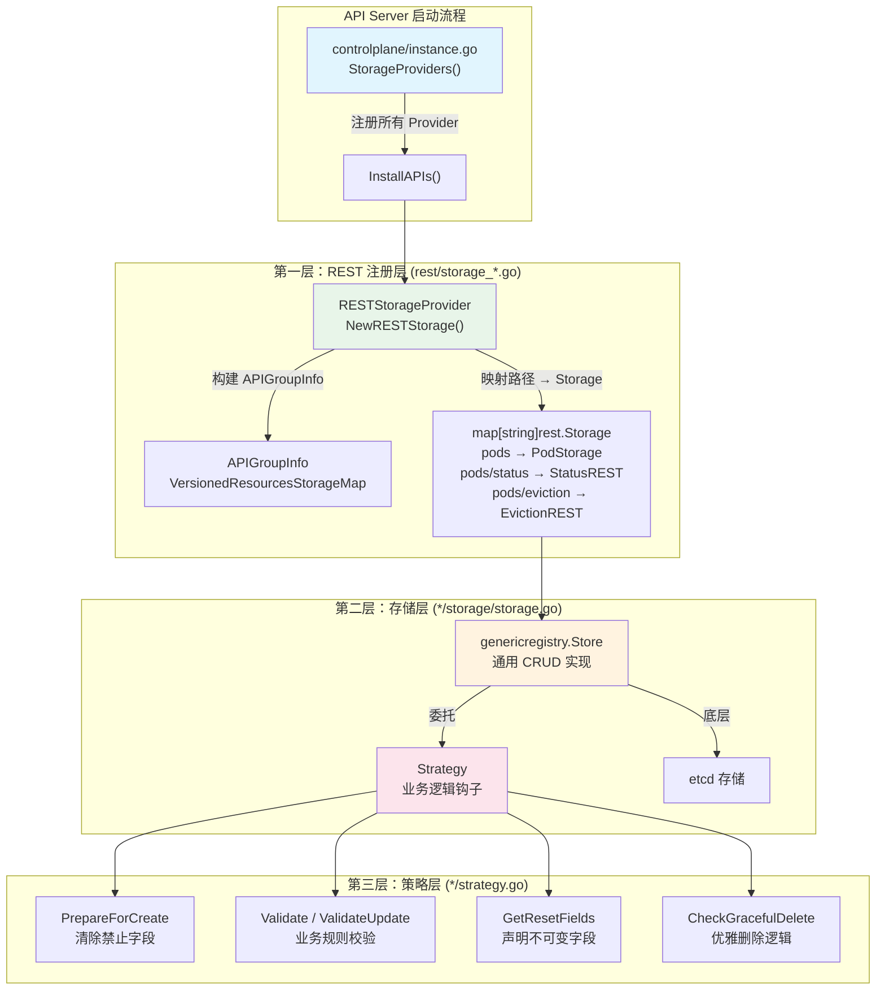

`pkg/registry` 是 Kubernetes API Server 的核心存储与业务逻辑层。它将每一个 API 资源类型（Pod、Deployment、ConfigMap 等）映射到具体的持久化存储后端（etcd），并在 REST 操作的路径上注入**验证**、**默认值填充**、**字段重置**和**子资源隔离**等关键策略。如果说 [API 资源定义与类型系统（pkg/apis）](12-api-zi-yuan-ding-yi-yu-lei-xing-xi-tong-pkg-apis)定义了资源的"骨架"，那么 `pkg/registry` 就是赋予骨架以行为和生命的"肌肉系统"。整个包的定位可以用其自身的注释精确概括：**"实现了 API Server 核心的存储与系统逻辑"**。

Sources: [doc.go](pkg/registry/doc.go#L1-L19)

## 架构总览：三层分离模型

`pkg/registry` 的内部架构遵循严格的三层分离模式。从上到下，每一层职责明确、相互协作，构成了 API Server 处理每一个 REST 请求的核心管道。



**理解这三层的关键在于**：策略层回答"业务规则是什么"，存储层回答"如何与 etcd 交互"，注册层回答"如何将 HTTP 路径映射到存储对象"。三层通过接口松耦合，使得添加新资源类型时只需按照固定模板实现三个文件即可。

Sources: [instance.go](pkg/controlplane/instance.go#L387-L445), [storage_core.go](pkg/registry/core/rest/storage_core.go#L154-L327)

## 目录结构与资源分组

`pkg/registry` 的顶层目录直接对应 Kubernetes 的 API 组（API Group），每个 API 组内再按资源类型细分。这种**一对一映射**使得从 API 路径到代码定位变得直观。

```
pkg/registry/
├── core/                    # 核心 API 组 (v1): Pod, Service, ConfigMap, Node...
│   ├── pod/
│   │   ├── strategy.go      # 策略层：验证、默认值、字段重置
│   │   ├── storage/
│   │   │   └── storage.go   # 存储层：genericregistry.Store 配置与子资源
│   │   └── rest/            # 特殊子资源端点 (exec, log, proxy)
│   ├── service/
│   │   ├── strategy.go
│   │   ├── storage/         # Service + Service/status
│   │   ├── allocator/       # IP/端口分配器
│   │   ├── ipallocator/     # ClusterIP 分配逻辑
│   │   └── portallocator/   # NodePort 分配逻辑
│   └── rest/
│       ├── storage_core.go        # 核心组注册入口（Pod, Node, Service 等）
│       └── storage_core_generic.go # 通用资源注册（ConfigMap, Secret, Event 等）
├── apps/                    # apps API 组: Deployment, StatefulSet, DaemonSet...
│   ├── deployment/
│   ├── statefulset/
│   └── rest/
│       └── storage_apps.go  # apps 组注册入口
├── rbac/                    # RBAC API 组: Role, ClusterRole, RoleBinding...
│   ├── role/
│   ├── clusterrole/
│   │   ├── storage/         # etcd 存储实现
│   │   ├── policybased/     # 权限提升检查装饰器
│   │   └── registry.go      # Registry 接口（供授权检查器使用）
│   └── rest/
│       └── storage_rbac.go  # RBAC 组注册入口
├── authentication/          # 认证 API 组: TokenReview, SelfSubjectReview
├── authorization/           # 授权 API 组: SubjectAccessReview, LocalSubjectAccessReview
├── flowcontrol/             # 流控 API 组: FlowSchema, PriorityLevelConfiguration
├── registrytest/            # 测试辅助工具
└── testapigroup/            # 测试用示例 API 组（Carp）
```

Sources: [OWNERS](pkg/registry/OWNERS)

### 全部 API 组注册提供者一览

下表展示了所有注册到 API Server 的 `RESTStorageProvider`，它们的注册顺序也决定了 API 发现中同名资源的优先级。

| API 组 | Provider 文件 | 典型资源 | 是否有 PostStartHook |
|--------|-------------|---------|---------------------|
| "" (core) | [storage_core.go](pkg/registry/core/rest/storage_core.go) | Pod, Service, Node, PV, PVC | 否 |
| "" (core/generic) | [storage_core_generic.go](pkg/registry/core/rest/storage_core_generic.go) | ConfigMap, Secret, Event, Namespace | 否 |
| apps | [storage_apps.go](pkg/registry/apps/rest/storage_apps.go) | Deployment, StatefulSet, DaemonSet, ReplicaSet | 否 |
| authentication | [storage_authentication.go](pkg/registry/authentication/rest/storage_authentication.go) | TokenReview, SelfSubjectReview | 否 |
| authorization | [storage_authorization.go](pkg/registry/authorization/rest/storage_authorization.go) | SubjectAccessReview, LocalSubjectAccessReview | 否 |
| rbac | [storage_rbac.go](pkg/registry/rbac/rest/storage_rbac.go) | Role, ClusterRole, RoleBinding, ClusterRoleBinding | **是** (bootstrap-roles) |
| flowcontrol | [storage_flowcontrol.go](pkg/registry/flowcontrol/rest/storage_flowcontrol.go) | FlowSchema, PriorityLevelConfiguration | **是** (config-producer) |
| certificates | [storage_certificates.go](pkg/registry/certificates/rest/storage_certificates.go) | CertificateSigningRequest, ClusterTrustBundle | 否 |
| networking | [storage_settings.go](pkg/registry/networking/rest/storage_settings.go) | Ingress, NetworkPolicy, IPAddress, ServiceCIDR | 否 |
| scheduling | [storage_scheduling.go](pkg/registry/scheduling/rest/storage_scheduling.go) | PriorityClass, PodGroup, Workload | 否 |
| storage | [storage_storage.go](pkg/registry/storage/rest/storage_storage.go) | StorageClass, CSIDriver, VolumeAttachment | 否 |
| admissionregistration | [storage_apiserver.go](pkg/registry/admissionregistration/rest/storage_apiserver.go) | ValidatingWebhookConfiguration, ValidatingAdmissionPolicy | 否 |

Sources: [instance.go](pkg/controlplane/instance.go#L412-L438)

## 策略层（Strategy）：REST 操作的业务规则引擎

**策略层**是理解 `pkg/registry` 的关键入口。每个资源类型都有一个 `strategy.go` 文件，其中定义了一个策略结构体，实现 `rest.RESTCreateStrategy`、`rest.RESTUpdateStrategy`、`rest.RESTDeleteStrategy` 等接口。策略对象是**无状态的**——通常以包级变量暴露，如 `var Strategy = podStrategy{legacyscheme.Scheme, names.SimpleNameGenerator}`。

### 策略接口的核心方法

策略层通过一套精确定义的方法钩子参与 REST 操作的每个阶段：

| 方法 | 调用时机 | 典型职责 |
|------|---------|---------|
| `PrepareForCreate(ctx, obj)` | 创建前 | 清除 status、设置 Generation=1、填充默认 QoS 类 |
| `PrepareForUpdate(ctx, newObj, oldObj)` | 更新前 | 保护 status 不被 spec 更新修改、递增 Generation |
| `Validate(ctx, obj)` | 创建验证 | 完整的业务规则校验（如 Pod 的容器配置合法性） |
| `ValidateUpdate(ctx, newObj, oldObj)` | 更新验证 | 基于旧对象的增量校验 |
| `GetResetFields()` | 读写分离 | 声明哪些字段在更新时被自动重置（实现 spec/status 分离） |
| `AllowCreateOnUpdate()` | PUT 请求 | 是否允许 PUT 不存在的资源（隐式创建） |
| `AllowUnconditionalUpdate()` | PUT 请求 | 是否允许不带 ResourceVersion 的无条件更新 |
| `CheckGracefulDelete(ctx, obj, opts)` | DELETE 请求 | 从 `terminationGracePeriodSeconds` 计算宽限期 |
| `WarningsOnCreate/WarningsOnUpdate()` | 创建/更新后 | 生成非致命性警告信息 |

以 Pod 为例，`podStrategy.PrepareForCreate` 在 Pod 创建前将 `status.phase` 设为 `Pending`、计算 `QOSClass`、添加 `SchedulingGated` 条件，并清理被 Feature Gate 禁用的字段：

```go
func (podStrategy) PrepareForCreate(ctx context.Context, obj runtime.Object) {
    pod := obj.(*api.Pod)
    pod.Generation = 1
    pod.Status = api.PodStatus{
        Phase:    api.PodPending,
        QOSClass: qos.GetPodQOS(pod),
    }
    podutil.DropDisabledPodFields(pod, nil)
    applySchedulingGatedCondition(pod)
}
```

Sources: [pod/strategy.go](pkg/registry/core/pod/strategy.go#L60-L101)

### Spec/Status 分离与字段重置机制

Kubernetes 的核心设计模式之一是 **spec/status 分离**：`.spec` 描述期望状态，`.status` 描述观测状态，两者通过不同的 API 端点独立更新。`pkg/registry` 通过 **策略变体（Strategy Variant）** 和 **`GetResetFields()`** 机制实现这种分离。

每个有 status 子资源的资源类型通常定义多个策略变体：

| 策略变体 | 用途 | 重置字段 |
|---------|------|---------|
| `Strategy`（主策略） | 处理主资源的创建/更新 | 重置 `status`（用户不能通过主端点修改 status） |
| `StatusStrategy` | 处理 `/status` 子资源 | 重置 `spec`、`metadata.deletionTimestamp`、`metadata.ownerReferences` |
| `EphemeralContainersStrategy` | 处理 `/ephemeralcontainers` 子资源 | 仅保留 `spec.ephemeralContainers`，重置其他所有 spec 字段 |
| `ResizeStrategy` | 处理 `/resize` 子资源 | 仅保留 `spec.containers[*].resources`，重置其他 spec 字段 |

在存储层，这种分离通过**复制底层 Store 并设置不同的 UpdateStrategy** 实现：

```go
statusStore := *store
statusStore.UpdateStrategy = registrypod.StatusStrategy  // 换用 status 策略
statusStore.ResetFieldsStrategy = registrypod.StatusStrategy
ephemeralContainersStore := *store
ephemeralContainersStore.UpdateStrategy = registrypod.EphemeralContainersStrategy
resizeStore := *store
resizeStore.UpdateStrategy = registrypod.ResizeStrategy
```

这种设计确保：通过 `PUT /api/v1/namespaces/{ns}/pods/{name}` 更新 Pod 时，status 字段会被自动重置为旧值；而通过 `PUT /api/v1/namespaces/{ns}/pods/{name}/status` 更新 status 时，spec 字段会被保护。

Sources: [pod/strategy.go](pkg/registry/core/pod/strategy.go#L197-L233), [pod/storage/storage.go](pkg/registry/core/pod/storage/storage.go#L103-L109)

## 存储层（Storage）：从策略到持久化的桥梁

存储层负责将策略层的行为与 `genericregistry.Store`（来自 `k8s.io/apiserver` 的通用存储实现）连接起来。每个资源的 `storage/storage.go` 文件遵循高度一致的模板。

### 标准存储构建模板

以 ConfigMap（最简单的资源之一）为例，其 `NewREST` 函数展示了存储构建的标准模式：

```go
func NewREST(optsGetter generic.RESTOptionsGetter) (*REST, error) {
    store := &genericregistry.Store{
        NewFunc:                   func() runtime.Object { return &api.ConfigMap{} },
        NewListFunc:               func() runtime.Object { return &api.ConfigMapList{} },
        PredicateFunc:             configmap.Matcher,
        DefaultQualifiedResource:  api.Resource("configmaps"),
        SingularQualifiedResource: api.Resource("configmap"),
        CreateStrategy:            configmap.Strategy,
        UpdateStrategy:            configmap.Strategy,
        DeleteStrategy:            configmap.Strategy,
        TableConvertor:            printerstorage.TableConvertor{...},
    }
    options := &generic.StoreOptions{RESTOptions: optsGetter, AttrFunc: configmap.GetAttrs}
    if err := store.CompleteWithOptions(options); err != nil {
        return nil, err
    }
    return &REST{store}, nil
}
```

关键配置项解析：

| 字段 | 作用 |
|------|------|
| `NewFunc` / `NewListFunc` | 告知 Store 如何创建空的对象实例（用于反序列化 etcd 数据） |
| `PredicateFunc` | 定义标签/字段选择器的过滤逻辑 |
| `DefaultQualifiedResource` | 用于构造错误消息（如 "configmaps \"my-cm\" not found"） |
| `CreateStrategy` / `UpdateStrategy` / `DeleteStrategy` | 注入策略层的验证和准备逻辑 |
| `TableConvertor` | 支持 `kubectl get` 的表格输出格式 |
| `AttrFunc` | 从对象中提取索引属性（用于过滤和 watch） |

`CompleteWithOptions` 调用是存储初始化的关键一步——它通过 `RESTOptionsGetter` 获取 etcd 后端的连接配置，并完成 Store 的内部初始化。

Sources: [configmap/storage/storage.go](pkg/registry/core/configmap/storage/storage.go#L37-L59)

### 子资源聚合模式：PodStorage 详解

对于拥有丰富子资源的资源类型（如 Pod），存储层定义一个聚合结构体，将主资源存储和所有子资源存储打包在一起：

```go
type PodStorage struct {
    Pod                 *REST                      // 主资源 CRUD
    Binding             *BindingREST               // 绑定到节点
    LegacyBinding       *LegacyBindingREST         // 旧版绑定
    Eviction            *EvictionREST              // 驱逐（与 PDB 交互）
    Status              *StatusREST                // status 子资源
    EphemeralContainers *EphemeralContainersREST   // 临时容器
    Resize              *ResizeREST                // 原地垂直扩缩
    Log                 *podrest.LogREST           // 日志（代理到 Kubelet）
    Proxy               *podrest.ProxyREST         // 代理
    Exec                *podrest.ExecREST          // 命令执行
    Attach              *podrest.AttachREST        // 容器附加
    PortForward         *podrest.PortForwardREST   // 端口转发
}
```

这些子资源可以分为两大类：

| 类别 | 子资源 | 底层机制 | 特征 |
|------|-------|---------|------|
| **etcd 持久化型** | Pod, Status, Binding, EphemeralContainers, Resize | 共享 `genericregistry.Store`，不同策略变体 | 数据写入 etcd |
| **代理/只读型** | Log, Exec, Attach, PortForward, Proxy | 代理到 Kubelet，无持久化 | 数据不经过 etcd |
| **混合型** | Eviction | 先与 PDB 控制器交互检查，再更新 Pod 状态 | 包含复杂业务流程 |

Sources: [pod/storage/storage.go](pkg/registry/core/pod/storage/storage.go#L54-L126)

### 两种 REST 存储范式

`pkg/registry` 中存在两种截然不同的 REST 存储实现：

**etcd 持久化型** — 绝大多数资源使用此模式。通过嵌入 `*genericregistry.Store` 获得 CRUD、Watch、List 等全部能力。例如 Deployment、ConfigMap、Namespace。

```go
type REST struct {
    *genericregistry.Store    // 嵌入通用 Store
}
```

**非持久化操作型** — 用于不存储到 etcd 的"虚拟"资源。这类资源只实现 `Create` 方法（对应 POST 操作），在 Create 中执行具体逻辑后直接返回结果。典型例子包括：

- **TokenReview**：接收令牌，调用认证器验证，返回用户信息
- **SubjectAccessReview**：接收权限查询，调用授权器判定，返回 yes/no
- **SelfSubjectReview**：返回当前请求者的身份信息

以 TokenReview 为例，其 `Create` 方法不写 etcd，而是同步调用 `tokenAuthenticator.AuthenticateRequest`：

```go
func (r *REST) Create(ctx context.Context, obj runtime.Object, ...) (runtime.Object, error) {
    tokenReview := obj.(*authentication.TokenReview)
    // 构造伪 HTTP 请求
    fakeReq := &http.Request{Header: http.Header{}}
    fakeReq.Header.Add("Authorization", "Bearer "+tokenReview.Spec.Token)
    // 调用认证器
    resp, ok, err := r.tokenAuthenticator.AuthenticateRequest(fakeReq)
    // 填充响应状态
    tokenReview.Status.Authenticated = ok
    return tokenReview, nil
}
```

Sources: [tokenreview/storage.go](pkg/registry/authentication/tokenreview/storage.go#L37-L130), [subjectaccessreview/rest.go](pkg/registry/authorization/subjectaccessreview/rest.go#L35-L96)

## REST 注册层：路径映射与 API Group 组装

注册层是 `pkg/registry` 三层架构的最上层，每个 API 组的 `rest/storage_*.go` 文件负责两个核心任务：**构建 `APIGroupInfo`** 和 **建立 HTTP 路径到存储对象的映射**。

### APIGroupInfo 的构建过程

以 `apps` 组为例，注册过程分为三步：

1. **创建 APIGroupInfo 骨架**：通过 `NewDefaultAPIGroupInfo` 设定 Scheme、ParameterCodec、Codecs
2. **构建资源存储映射**：为每个资源类型创建 Storage 实例
3. **填充 VersionedResourcesStorageMap**：将路径字符串映射到 Storage 实现

```go
func (p StorageProvider) NewRESTStorage(...) (genericapiserver.APIGroupInfo, error) {
    apiGroupInfo := genericapiserver.NewDefaultAPIGroupInfo(apps.GroupName, legacyscheme.Scheme, ...)
    storageMap, _ := p.v1Storage(apiResourceConfigSource, restOptionsGetter)
    apiGroupInfo.VersionedResourcesStorageMap["v1"] = storageMap
    return apiGroupInfo, nil
}
```

Sources: [storage_apps.go](pkg/registry/apps/rest/storage_apps.go#L38-L50)

### 路径映射的规则

资源存储映射的核心是一个 `map[string]rest.Storage`，其 key 就是 URL 路径的末段。以 `apps/v1` 组为例：

```go
storage["deployments"]              = deploymentStorage.Deployment       // GET/POST/PUT/DELETE/PATCH
storage["deployments/status"]       = deploymentStorage.Status           // GET/PUT/PATCH
storage["deployments/scale"]        = deploymentStorage.Scale            // GET/PUT/PATCH
storage["statefulsets"]             = statefulSetStorage.StatefulSet
storage["statefulsets/status"]      = statefulSetStorage.Status
storage["statefulsets/scale"]       = statefulSetStorage.Scale
storage["daemonsets"]               = daemonSetStorage
storage["daemonsets/status"]        = daemonSetStatusStorage
storage["replicasets"]              = replicaSetStorage.ReplicaSet
storage["replicasets/status"]       = replicaSetStorage.Status
storage["replicasets/scale"]        = replicaSetStorage.Scale
storage["controllerrevisions"]      = historyStorage
```

每个资源是否注册可以通过 `apiResourceConfigSource.ResourceEnabled()` 动态控制——这允许集群管理员按需启用或禁用特定的 API 资源。

Sources: [storage_apps.go](pkg/registry/apps/rest/storage_apps.go#L52-L108)

### Core 组的双重注册结构

Core API 组（即 `v1` 版本，无组名）因为资源数量庞大，采用了**双重注册结构**：通用资源（ConfigMap、Secret、Event、Namespace、ServiceAccount）在 `storage_core_generic.go` 中注册，而需要特殊逻辑的资源（Pod、Service、Node、PV、PVC）在 `storage_core.go` 中注册。后者通过覆盖 `VersionedResourcesStorageMap` 中已注册的条目来增强或替换通用实现。

例如，ServiceAccount 在通用层注册了一个简单版本，但在 Core 层被替换为支持 Pod 绑定令牌的增强版本：

```go
// 覆盖通用层注册的 ServiceAccount 存储
if serviceAccountStorage != nil && apiResourceConfigSource.ResourceEnabled(...) {
    storage["serviceaccounts"].Destroy()         // 销毁旧存储
    storage["serviceaccounts"] = serviceAccountStorage  // 替换为增强版
    if serviceAccountStorage.Token != nil {
        storage["serviceaccounts/token"] = serviceAccountStorage.Token  // 添加 token 子资源
    }
}
```

Sources: [storage_core_generic.go](pkg/registry/core/rest/storage_core_generic.go#L68-L160), [storage_core.go](pkg/registry/core/rest/storage_core.go#L222-L234)

## 高级模式与扩展机制

### 装饰器模式：RBAC 权限提升检查

RBAC API 组展示了一种优雅的**装饰器模式**。标准的 etcd 存储被 `policybased.Storage` 包装，后者在 Create 和 Update 操作前增加了权限提升检查：

```go
// 基础 etcd 存储
clusterRolesStorage, _ := clusterrolestore.NewREST(restOptionsGetter)

// 包装为带权限检查的存储
storage["clusterroles"] = policybased.NewStorage(clusterRolesStorage, p.Authorizer, ruleResolver)
```

装饰器在 `Create` 方法中检查调用者是否有权创建包含所请求权限规则的 ClusterRole：

```go
func (s *Storage) Create(ctx context.Context, obj runtime.Object, ...) (runtime.Object, error) {
    if rbacregistry.EscalationAllowed(ctx) || rbacregistry.RoleEscalationAuthorized(ctx, s.authorizer) {
        return s.StandardStorage.Create(ctx, obj, ...)  // 委托给底层存储
    }
    // 检查是否越权
    if err := rbacregistryvalidation.ConfirmNoEscalationInternal(ctx, s.ruleResolver, rules); err != nil {
        return nil, apierrors.NewForbidden(...)
    }
    return s.StandardStorage.Create(ctx, obj, ...)
}
```

这种模式的优势在于：核心的 etcd 存储逻辑保持纯净，授权检查作为横切关注点独立叠加。

Sources: [clusterrole/policybased/storage.go](pkg/registry/rbac/clusterrole/policybased/storage.go#L37-L80), [storage_rbac.go](pkg/registry/rbac/rest/storage_rbac.go#L81-L128)

### Registry 接口抽象层

部分资源（主要是 RBAC 的 Role 和 ClusterRole）在存储层之上定义了额外的 **Registry 接口**，为其他组件（如授权检查器）提供类型安全的访问方式，避免直接操作 `rest.Storage`：

```go
type Registry interface {
    GetRole(ctx context.Context, name string, options *metav1.GetOptions) (*rbacv1.Role, error)
}

func NewRegistry(s rest.StandardStorage) Registry {
    return &storage{s}  // 适配 rest.Getter → Registry
}
```

`AuthorizerAdapter` 进一步将 Registry 适配到授权器的接口，实现了从 REST 存储到授权决策的桥接。这种"接口隔离 + 适配器"的模式确保了包之间的依赖方向始终单向。

Sources: [role/registry.go](pkg/registry/rbac/role/registry.go#L31-L67)

### PostStartHook：启动后自动引导

部分 `RESTStorageProvider` 额外实现了 `genericapiserver.PostStartHookProvider` 接口，在 API Server 启动完成后自动执行初始化逻辑。这在需要在启动时"引导"默认资源的场景中尤为关键：

| Provider | Hook 名称 | 功能 |
|----------|----------|------|
| RBAC | `rbac/bootstrap-roles` | 确保默认 ClusterRole、ClusterRoleBinding 存在 |
| FlowControl | `priority-and-fairness-config-producer` | 确保 FlowSchema 和 PriorityLevelConfiguration 的引导配置存在 |

以 RBAC 为例，`PostStartHook` 会在启动后 30 秒内持续尝试确保默认角色存在，若失败则终止 API Server 进程——这反映了"角色初始化是系统可用性的硬性前提"这一设计决策。

Sources: [storage_rbac.go](pkg/registry/rbac/rest/storage_rbac.go#L59-L181), [storage_flowcontrol.go](pkg/registry/flowcontrol/rest/storage_flowcontrol.go#L45-L110)

### Namespace 的特殊生命周期管理

Namespace 是 `pkg/registry` 中生命周期管理最复杂的资源之一。它拥有三个独立的子资源存储（主存储、StatusREST、FinalizeREST），并且在 `Delete` 方法中实现了完整的终止流程：

1. 设置 `deletionTimestamp` 和 `status.phase = Terminating`
2. 添加 `kubernetes` finalizer（如果不存在）
3. 通过 `GuaranteedUpdate` 原子性地执行变更

`ShouldDeleteDuringUpdate` 回调确保了 Namespace 在 termination 状态下的更新语义正确处理——即当 `deletionTimestamp` 已设置时，不会触发重复的删除逻辑。

Sources: [namespace/storage/storage.go](pkg/registry/core/namespace/storage/storage.go#L60-L200)

## 添加新资源类型的标准流程

`testapigroup` 包（包含虚构的 `Carp` 资源）展示了添加新资源类型的标准模板。如果需要为 Kubernetes 添加一个新的 API 资源，在 `pkg/registry` 中需要完成以下步骤：

1. **创建资源目录**：`pkg/registry/<group>/<resource>/`
2. **实现策略层** `strategy.go`：定义主策略和 status 策略，实现 `PrepareForCreate`、`Validate`、`GetResetFields` 等方法
3. **实现存储层** `storage/storage.go`：配置 `genericregistry.Store`，创建主 REST 和 StatusREST
4. **实现注册层** `rest/storage_<group>.go`：定义 `RESTStorageProvider`，实现 `NewRESTStorage()` 和 `GroupName()` 方法
5. **注册到控制平面**：在 [pkg/controlplane/instance.go](pkg/controlplane/instance.go#L412-L438) 的 `providers` 列表中添加新的 Provider

`testapigroup/carp/strategy.go` 中 `carpStrategy` 和 `carpStatusStrategy` 的实现是这种模式的最小可行示例——它展示了主策略如何重置 status，以及 status 策略如何反向保护 spec 不被 status 端点修改。

Sources: [carp/strategy.go](pkg/registry/testapigroup/carp/strategy.go#L38-L144), [testapigroup/rest/storage_resource.go](pkg/registry/testapigroup/rest/storage_resource.go#L31-L66)

## 测试基础设施：registrytest 包

`pkg/registry/registrytest` 提供了一组测试辅助工具，用于简化 registry 层的单元测试和集成测试：

| 工具 | 用途 |
|------|------|
| `NewEtcdStorage(t, group)` | 为测试创建 etcd 存储后端配置 |
| `ValidateStorageStrategies(storageMap)` | 验证所有存储都正确设置了 Create/Update/Delete Strategy |
| 辅助函数 (`endpoint.go`, `service.go`, `node.go`) | 为 Endpoint、Service、Node 资源创建测试用存储 |

`ValidateStorageStrategies` 在 API Server 的集成测试中被调用来确保没有遗漏策略设置——这体现了"每个存储必须有策略"这一硬性约定。

Sources: [registrytest/etcd.go](pkg/registry/registrytest/etcd.go#L31-L52), [registrytest/validate.go](pkg/registry/registrytest/validate.go#L28-L49)

## 关键设计决策总结

| 设计决策 | 动机 | 实现位置 |
|---------|------|---------|
| **三层分离**（Strategy → Storage → Provider） | 关注点分离：业务规则独立于存储机制 | 每个资源目录结构 |
| **Store 复制 + 策略变体** | 零额外存储成本实现 spec/status 分离 | `statusStore := *store` 模式 |
| **装饰器包装**（RBAC） | 横切关注点（权限检查）不污染核心逻辑 | `policybased.Storage` |
| **`GetResetFields()` 声明式重置** | 配合 Server-Side Apply 正确处理字段所有权 | 各 `strategy.go` |
| **`ResourceEnabled()` 门控** | 运行时可配置启用/禁用特定资源 | 各 `storage_*.go` 中的 if 判断 |
| **PostStartHook 引导** | 确保系统关键默认资源在启动时存在 | RBAC、FlowControl Provider |

理解了 `pkg/registry` 的架构之后，建议继续阅读 [OpenAPI 规范与 API 发现机制](14-openapi-gui-fan-yu-api-fa-xian-ji-zhi)了解这些 REST 端点如何被自动发现和文档化，或者回到 [API 资源定义与类型系统（pkg/apis）](12-api-zi-yuan-ding-yi-yu-lei-xing-xi-tong-pkg-apis)对比类型定义层与存储行为层的分工关系。