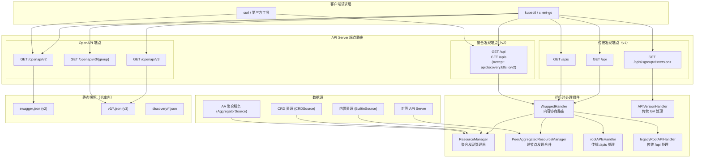
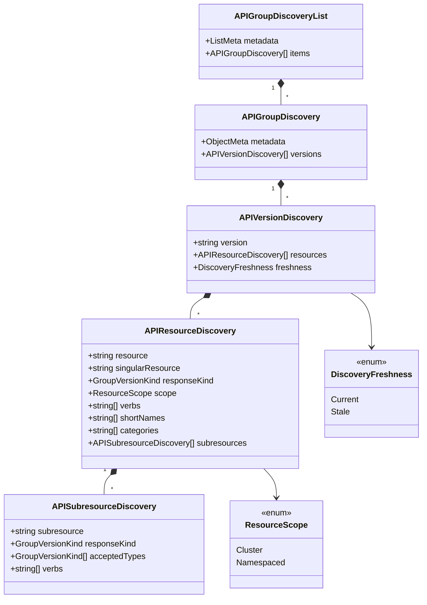
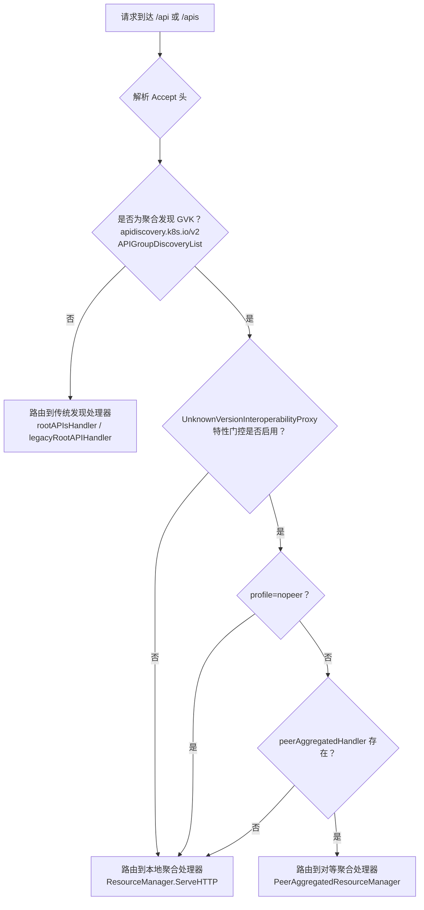

Kubernetes API Server 同时暴露两类自描述接口：**API 发现**（Discovery）端点告诉客户端"集群支持哪些资源"，而 **OpenAPI 规范**（OpenAPI Spec）则提供每个资源的完整 JSON Schema 定义、路径、操作与参数细节。二者共同构成了客户端动态适配集群能力的基础——`kubectl`、`client-go` 动态客户端、CRD 控制器乃至第三方工具（如 Terraform Kubernetes Provider）均依赖它们来完成资源发现、类型校验和请求构建。本文将从源码层面解剖这两套机制的数据模型、生成流水线、运行时处理链路与缓存策略。

Sources: [config.go](cmd/kube-apiserver/app/config.go#L30-L83), [types.go](pkg/apis/apidiscovery/types.go#L1-L157)

## 整体架构概览

在深入实现细节之前，先通过架构图理解 OpenAPI 规范与 API 发现两大子系统在 API Server 内部的协作关系：



**关键观察**：传统发现端点与聚合发现端点共享相同的 URL 路径（`/api`、`/apis`），通过 HTTP `Accept` 头的内容协商（Content Negotiation）来区分响应格式。`WrappedHandler` 作为统一入口，根据客户端声明的 `Accept: application/json;g=apidiscovery.k8s.io;v=v2;as=APIGroupDiscoveryList` 决定路由到聚合处理器还是传统处理器。

Sources: [wrapper.go](staging/src/k8s.io/apiserver/pkg/endpoints/discovery/aggregated/wrapper.go#L35-L97), [handler.go](staging/src/k8s.io/apiserver/pkg/endpoints/discovery/aggregated/handler.go#L54-L92)

## API 发现机制

API 发现机制是 Kubernetes 的"自省"能力——API Server 主动向客户端声明自己支持哪些 API 组、哪些版本、以及每个版本下有哪些资源。这套机制经历了从**传统逐级发现**到**聚合发现**的架构演进。

### 传统逐级发现（v1）

传统发现采用三级层次结构，客户端需要发起多次 HTTP 请求才能完整了解集群资源：

| 端点 | 响应类型 | 信息粒度 |
|------|----------|----------|
| `GET /api` | `APIVersions` | 仅包含 legacy v1 版本列表与服务器地址 |
| `GET /apis` | `APIGroupList` | 所有 API 组的名称、首选版本、支持版本列表 |
| `GET /apis/<group>/<version>` | `APIResourceList` | 该 GV 下所有资源、动词、短名称、子资源 |

传统发现的处理组件各自职责清晰。`legacyRootAPIHandler` 固定返回 `v1` 版本列表，`rootAPIsHandler` 维护一个动态的 `apiGroups` 映射表（按注册顺序排列），而 `APIVersionHandler` 则由各 API 组安装时注册的 `APIResourceLister` 回调函数提供资源列表。

传统发现中还有一个特殊的 `stripVersionNegotiatedSerializer` 包装器，其目的是保持与 Kubernetes 1.1 版本的向后兼容性——在响应序列化时将 APIVersion 字段置空，以匹配旧客户端的期望行为。

Sources: [legacy.go](staging/src/k8s.io/apiserver/pkg/endpoints/discovery/legacy.go#L32-L81), [root.go](staging/src/k8s.io/apiserver/pkg/endpoints/discovery/root.go#L34-L161), [version.go](staging/src/k8s.io/apiserver/pkg/endpoints/discovery/version.go#L31-L84), [util.go](staging/src/k8s.io/apiserver/pkg/endpoints/discovery/util.go#L29-L110)

### 聚合发现（v2 / v2beta1）

聚合发现的核心思想是**单次请求获取全部资源信息**，消除了传统发现中 N+1 查询的问题。其数据模型定义在 `apidiscovery.k8s.io/v2` API 组中，形成如下层级结构：



与传统发现相比，聚合发现的数据模型新增了三个关键维度：**`freshness`** 标记发现文档的新鲜度（`Current` 或 `Stale`），**`subresources`** 嵌入子资源的完整声明（包括其动词和接受的类型），以及 **`singularResource`** 提供资源的单数名称。这些信息在传统发现中是缺失的，客户端只能通过解析资源名称中的 `/` 来推断子资源关系。

Sources: [types.go](pkg/apis/apidiscovery/types.go#L29-L157)

### ResourceManager：聚合发现的核心引擎

`ResourceManager` 是聚合发现系统的核心抽象接口，它定义了一组线程安全的操作来管理 API 组的注册、更新与删除：

```go
type ResourceManager interface {
    AddGroupVersion(groupName string, value apidiscoveryv2.APIVersionDiscovery)
    SetGroupVersionPriority(gv metav1.GroupVersion, grouppriority, versionpriority int)
    RemoveGroup(groupName string)
    RemoveGroupVersion(gv metav1.GroupVersion)
    SetGroups([]apidiscoveryv2.APIGroupDiscovery)
    WithSource(source Source) ResourceManager
    AddInvalidationCallback(callback func())
    http.Handler
}
```

其实现 `resourceDiscoveryManager` 内部维护着一个 `map[groupKey]*apidiscoveryv2.APIGroupDiscovery` 映射表和一个 `atomic.Pointer[cachedGroupList]` 原子缓存指针。每当组版本被增删，缓存即被置空（`invalidateCacheLocked()`），下一次 HTTP 请求到达时触发惰性重算。

**Source 优先级机制**是 `ResourceManager` 的一个精巧设计。三个来源按优先级从高到低排列：

| Source 常量 | 数值 | 含义 |
|-------------|------|------|
| `AggregatorSource` | 0 | kube-aggregator 注册的 API 服务（最高优先级） |
| `BuiltinSource` | 100 | 内置 API 组 |
| `CRDSource` | 200 | CustomResourceDefinition（最低优先级） |

当同一 GroupVersion 从多个来源注册时，`calculateAPIGroupsLocked()` 方法按 Source 数值从小到大选择——数值越小优先级越高。这意味着聚合 API Server 的声明会覆盖内置 API 和 CRD 的同名资源。

Sources: [handler.go](staging/src/k8s.io/apiserver/pkg/endpoints/discovery/aggregated/handler.go#L45-L321)

### WrappedHandler：内容协商路由

`WrappedHandler` 是聚合发现机制的流量分发器，它在运行时拦截发往 `/api` 和 `/apis` 的所有请求，通过解析 `Accept` 头中的 GVK 信息决定路由方向：



内容协商的核心逻辑在 `IsAggregatedDiscoveryGVK` 函数中——它检查请求的 Accept 头是否声明了 `apidiscovery.k8s.io` 组的 `APIGroupDiscoveryList` 类型。值得注意的是，`AggregatedDiscoveryRemoveBetaType` 特性门控控制着是否继续支持 `v2beta1` 版本，该门控启用后仅接受 `v2` 版本的聚合发现请求。

Sources: [wrapper.go](staging/src/k8s.io/apiserver/pkg/endpoints/discovery/aggregated/wrapper.go#L42-L97), [negotiation.go](staging/src/k8s.io/apiserver/pkg/endpoints/discovery/aggregated/negotiation.go#L33-L49)

### ETag 缓存策略

聚合发现端点的响应采用 **ETag + SHA-512** 缓存策略来优化客户端性能。`calculateETag` 函数对整个 `APIGroupDiscoveryList` 对象做 JSON 序列化后计算 SHA-512 哈希值。`ServeHTTPWithETag` 在响应头中设置 `ETag`（双引号包裹）、`Vary: Accept` 和 `Cache-Control: public`，并在客户端携带匹配的 `If-None-Match` 头时直接返回 `304 Not Modified`，避免重复传输大量发现数据。

这个设计有一个微妙但重要的特性：ETag 是对 JSON 对象的哈希，因此无论客户端请求 JSON、Protobuf 还是其他编码格式，ETag 值都相同。这是安全的，因为 `Vary: Accept` 头确保了浏览器和代理不会将不同编码格式的响应当作相同的缓存条目。

Sources: [etag.go](staging/src/k8s.io/apiserver/pkg/endpoints/discovery/aggregated/etag.go#L40-L85)

### 跨节点对等聚合发现

当 `UnknownVersionInteroperabilityProxy` 特性门控启用时，`PeerAggregatedResourceManager` 将本地发现数据与对等 API Server 的发现数据进行合并。其核心方法 `mergeResources` 采用三阶段策略：

1. **快速路径（短接）**：如果只有一个服务器（无对等节点），直接返回本地数据
2. **内容变更检测**：比较对等节点的组名称列表是否与本地一致，判断是否有新增内容
3. **合并与排序**：在存在差异时，使用稳定排序（`sortServerIDs` 确定性排序 + `utilsort.MergeSorts` 合并有序序列）生成确定性的最终发现文档

`PeerAggregatedResourceManager` 还通过 `AddInvalidationCallback` 注册了本地 `ResourceManager` 的缓存失效回调——每当本地发现数据变更时，对等聚合缓存同步失效，确保下次请求获取最新合并结果。

Sources: [peer_aggregated_handler.go](staging/src/k8s.io/apiserver/pkg/endpoints/discovery/aggregated/peer_aggregated_handler.go#L37-L200)

## OpenAPI 规范体系

OpenAPI 规范提供了比 API 发现更丰富的元数据——它不仅列出"有哪些资源"，还精确定义每个资源的字段类型、嵌套结构、验证规则、操作路径和请求/响应格式。Kubernetes 同时维护 OpenAPI v2（Swagger）和 v3 两套规范。

### 规范生成的双轨模型

Kubernetes 的 OpenAPI 规范遵循"**代码即契约**"的生成哲学，其生成流水线分为两条轨道：

**轨道一：编译时生成（`zz_generated.openapi.go`）**

`kube-openapi` 代码生成器（`openapi-gen`）扫描所有 Go 类型定义中的 `+k8s:openapi-gen=true` 标注，为每个 API 类型生成对应的 OpenAPI Schema 定义函数。这些函数被集中写入 `zz_generated.openapi.go`（约 74,000 行），其入口为 `GetOpenAPIDefinitions` 函数，返回类型为 `map[string]common.OpenAPIDefinition`。该文件在每次 `hack/update-codegen.sh` 运行时重新生成。

**轨道二：运行时生成（JSON 快照）**

`hack/update-openapi-spec.sh` 脚本启动一个真实的 `kube-apiserver` 实例（启用所有 Alpha/Beta 特性），然后通过 HTTP 请求从运行中的服务器拉取 OpenAPI 规范并持久化到仓库中：

| 输出路径 | 对应端点 | 说明 |
|----------|----------|------|
| `api/openapi-spec/swagger.json` | `GET /openapi/v2` | OpenAPI v2（Swagger 2.0）完整规范，约 102,000 行 |
| `api/openapi-spec/v3/*.json` | `GET /openapi/v3` 索引 + 各组独立端点 | OpenAPI v3 按组拆分的独立规范文件，共 63 个 |
| `api/discovery/*.json` | 各传统发现端点 | 传统发现端点的 JSON 快照 |
| `api/discovery/aggregated_v2.json` | `GET /apis`（聚合 Accept 头） | 聚合发现端点的完整快照 |

运行时生成确保了规范与实际服务器行为完全一致——包括 CRD 的 OpenAPI V3 Schema、聚合 API Server 的扩展资源等。

Sources: [zz_generated.openapi.go](pkg/generated/openapi/zz_generated.openapi.go#L1-L160), [update-openapi-spec.sh](hack/update-openapi-spec.sh#L1-L152)

### OpenAPI 配置注入链路

API Server 启动时，`BuildGenericConfig` 函数将 `generatedopenapi.GetOpenAPIDefinitions` 注入到通用配置中：

```go
genericConfig.OpenAPIConfig = genericapiserver.DefaultOpenAPIConfig(getOpenAPIDefinitions, namer)
genericConfig.OpenAPIConfig.Info.Title = "Kubernetes"
genericConfig.OpenAPIV3Config = genericapiserver.DefaultOpenAPIV3Config(getOpenAPIDefinitions, namer)
genericConfig.OpenAPIV3Config.Info.Title = "Kubernetes"
```

其中 `namer` 是由 `openapinamer.NewDefinitionNamer(schemes...)` 构建的**定义命名器**——它遍历所有注册的 Scheme 中已知类型的 GVK，为每个类型建立 `OpenAPI Definition Name → []GroupVersionKind` 的映射关系，并在定义的 Extensions 中注入 `x-kubernetes-group-version-kind` 扩展字段。这使得客户端能够通过 OpenAPI 规范反向映射到 Kubernetes 的 GVK。

Sources: [config.go](pkg/controlplane/apiserver/config.go#L177-L182), [openapi.go](staging/src/k8s.io/apiserver/pkg/endpoints/openapi/openapi.go#L123-L175)

### OpenAPI v2 与 v3 的对比

| 维度 | OpenAPI v2 (`swagger.json`) | OpenAPI v3 (`v3/*.json`) |
|------|----------------------------|-------------------------|
| 规范版本 | Swagger 2.0 | OpenAPI 3.0.0 |
| 文件组织 | 单一巨大文件（~102K 行） | 按 Group/Version 拆分为 63 个独立文件 |
| Schema 位置 | `definitions` 字段 | `components.schemas` 字段 |
| 安全定义 | `securityDefinitions` | `components.securitySchemes` |
| 路径定义 | `paths` 下完整路径 | `paths` 下完整路径 |
| 传输效率 | 全量传输，客户端需解析完整文档 | 按需加载特定组的规范，减少网络开销 |
| 客户端支持 | `client-go` 动态客户端传统模式 | `client-go` 新版动态客户端优先使用 |

OpenAPI v3 的按组拆分是一个重要的性能优化——客户端无需下载涵盖所有 API 组的单体规范文件，而是可以只请求自己关注的组（例如 `GET /openapi/v3/apps/v1`）。

Sources: [swagger.json](api/openapi-spec/swagger.json#L1-L60), [apis_openapi.json](api/openapi-spec/v3/apis_openapi.json#L1-L198), [README.md](api/openapi-spec/README.md#L1-L89)

### Kubernetes Vendor Extensions

Kubernetes 在标准 OpenAPI 规范之上定义了一系列 `x-kubernetes-*` 扩展字段，用于传达无法用标准 OpenAPI 表达的 Kubernetes 语义信息：

| 扩展名 | 适用范围 | 作用 |
|--------|----------|------|
| `x-kubernetes-group-version-kind` | 操作与定义 | 关联 Kubernetes GVK，支持类型反向查找 |
| `x-kubernetes-action` | 操作 | 标注操作动词（get/list/put/patch/post/delete 等） |
| `x-kubernetes-list-type` | 数组字段 | 声明列表语义：`atomic`、`map`、`set` |
| `x-kubernetes-list-map-keys` | 数组字段 | 当 list-type=map 时，指定用作唯一键的字段名 |
| `x-kubernetes-patch-strategy` | 字段 | 声明 Strategic Merge Patch 的合并策略 |
| `x-kubernetes-patch-merge-key` | 字段 | Strategic Merge Patch 中用于去重的键字段 |

`x-kubernetes-list-type` 和 `x-kubernetes-list-map-keys` 的组合尤其重要——它们告诉 `kubectl apply`（Strategic Merge Patch）如何正确合并数组字段。例如 `containers` 字段声明为 `list-type: map` + `list-map-keys: ["name"]`，意味着以容器名为主键进行合并而非简单替换。

Sources: [README.md](api/openapi-spec/README.md#L5-L89)

### 规范验证流水线

Kubernetes 的 CI 流水线通过 `hack/verify-openapi-spec.sh` 确保仓库中的规范快照始终是最新的。该脚本采用两级策略：

1. **严格模式**：先以 `KUBE_APISERVER_STRICT_REMOVED_API_HANDLING_IN_ALPHA=true` 运行更新脚本，移除所有已标记为移除的 API
2. **宽松模式**：若严格模式失败（例如版本号刚打标签时的过渡期），以 `KUBE_APISERVER_STRICT_REMOVED_API_HANDLING_IN_ALPHA=false` 回退验证

这种两级策略确保了在版本发布窗口期不会因为 API 移除标记的时序问题而导致 CI 失败。

Sources: [verify-openapi-spec.sh](hack/verify-openapi-spec.sh#L1-L37)

## 数据流：从注册到响应

下面通过一个完整的请求处理流程，展示 API 发现数据从资源注册到客户端响应的全链路：

```mermaid
sequenceDiagram
    participant APIServer as API Server 启动
    participant Install as API 安装器
    participant RM as ResourceManager
    participant Cache as 原子缓存
    participant Wrapper as WrappedHandler
    participant Client as kubectl / client-go

    APIServer->>Install: 注册 API 组 (e.g., apps/v1)
    Install->>RM: AddGroupVersion("apps", versionDiscovery)
    RM->>RM: 更新 apiGroups map
    RM->>Cache: cache.Store(nil) (失效缓存)
    RM-->>RM: 触发 invalidationCallback

    Client->>Wrapper: GET /apis<br/>Accept: application/json;g=apidiscovery.k8s.io;v=v2;as=APIGroupDiscoveryList
    Wrapper->>Wrapper: 解析 Accept 头
    Wrapper->>RM: ServeHTTP(req)
    RM->>Cache: fetchFromCache()
    alt 缓存命中
        Cache-->>RM: cachedGroupList
    else 缓存未命中
        RM->>RM: calculateAPIGroupsLocked()<br/>按优先级排序、去重
        RM->>RM: calculateETag() SHA-512
        RM->>Cache: cache.Store(cached)
        Cache-->>RM: cachedGroupList
    end
    RM->>Client: 200 OK<br/>ETag: "A3B2..."<br/>Body: APIGroupDiscoveryList JSON
```

Sources: [handler.go](staging/src/k8s.io/apiserver/pkg/endpoints/discovery/aggregated/handler.go#L498-L544), [wrapper.go](staging/src/k8s.io/apiserver/pkg/endpoints/discovery/aggregated/wrapper.go#L42-L62)

## 性能与可观测性

聚合发现系统内置了 Prometheus 指标用于监控性能表现：

| 指标名 | 类型 | 含义 |
|--------|------|------|
| `aggregator_discovery_aggregation_count_total` | Counter | 发现文档被重新聚合计算的次数 |
| `aggregator_discovery_peer_aggregated_cache_hits_total` | Counter | 对等聚合缓存命中次数 |
| `aggregator_discovery_peer_aggregated_cache_misses_total` | Counter | 对等聚合缓存未命中次数 |
| `aggregator_discovery_nopeer_requests_total` | Counter | 显式请求非对等发现（`profile=nopeer`）的次数 |

`regenerationCounter` 在每次 `calculateAPIGroupsLocked()` 被调用时递增。如果该指标增长过快，说明发现数据频繁变更，可能需要排查是否有 CRD 或聚合 API 服务在反复注册/注销。

Sources: [metrics.go](staging/src/k8s.io/apiserver/pkg/endpoints/discovery/aggregated/metrics.go#L28-L73)

## 仓库内的静态快照

`api/discovery/` 和 `api/openapi-spec/` 目录中保存了发现端点和 OpenAPI 规范的静态 JSON 快照。这些文件不仅是文档，更是 **CI 验证的对象**——任何修改 API 类型定义或资源注册逻辑的 PR 都必须同步更新这些快照，否则 `verify-openapi-spec.sh` 检查会失败。

`api/discovery/` 目录的文件命名规则为 URL 路径中的 `/` 替换为 `__`（例如 `/apis/apps/v1` → `apis__apps__v1.json`），与 OpenAPI v3 的命名约定一致。聚合发现快照 `aggregated_v2.json` 包含了完整的集群发现信息（约 2,500 行），涵盖所有 API 组的所有版本和资源。

Sources: [api.json](api/discovery/api.json#L1-L13), [apis__apps__v1.json](api/discovery/apis__apps__v1.json#L1-L200), [update-openapi-spec.sh](hack/update-openapi-spec.sh#L106-L147)

## 总结与延伸阅读

Kubernetes 的 OpenAPI 规范与 API 发现机制共同构建了一个**自描述的 API 平台**——传统发现提供逐级查询的简单接口，聚合发现提供单次全量获取的高效接口，而 OpenAPI 规范则提供精确的类型定义和操作描述。三层机制的协作使得 Kubernetes 的客户端生态能够无需硬编码 API 信息即可动态适应任何集群配置。

若要进一步理解本页面涉及的上下游主题，建议按以下顺序阅读：

- [API 资源定义与类型系统（pkg/apis）](12-api-zi-yuan-ding-yi-yu-lei-xing-xi-tong-pkg-apis)——理解 OpenAPI Schema 的上游 Go 类型定义
- [API 注册表与存储抽象（pkg/registry）](13-api-zhu-ce-biao-yu-cun-chu-chou-xiang-pkg-registry)——理解资源注册如何触发发现端点更新
- [API Server 启动流程与请求处理链路](7-api-server-qi-dong-liu-cheng-yu-qing-qiu-chu-li-lian-lu)——理解 OpenAPI 配置注入和端点注册的完整上下文
- [特性门控系统与功能生命周期管理](28-te-xing-men-kong-xi-tong-yu-gong-neng-sheng-ming-zhou-qi-guan-li)——理解控制发现行为（如 `AggregatedDiscoveryRemoveBetaType`）的特性门控机制