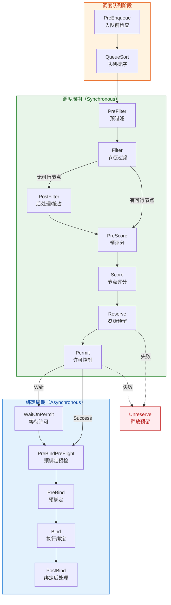

Kubernetes 调度框架（Scheduling Framework）是 kube-scheduler 的核心可扩展机制，它将调度流程拆解为一系列精心定义的**扩展点（Extension Points）**，每个扩展点对应一个或多个插件接口。开发者可以通过实现特定接口来注入自定义调度逻辑，而无需修改调度器源码。本文档深入剖析框架的接口定义、扩展点语义、执行流程与插件注册机制，为理解[调度器内置插件详解（节点亲和性、污点容忍、拓扑分布等）](16-diao-du-qi-nei-zhi-cha-jian-xiang-jie-jie-dian-qin-he-xing-wu-dian-rong-ren-tuo-bu-fen-bu-deng)和开发自定义插件奠定底层认知。

Sources: [interface.go](staging/src/k8s.io/kube-scheduler/framework/interface.go#L17-L18)

## 调度框架整体架构

在深入每个扩展点之前，有必要先建立对调度框架整体结构的宏观认知。框架的核心由两个层次构成：**接口层**定义在 staging 仓库 `k8s.io/kube-scheduler/framework` 包中，负责声明所有插件接口和数据类型；**运行时层**定义在 `pkg/scheduler/framework/runtime` 包中，负责插件的注册、初始化与编排执行。

### 接口定义的双层架构

Kubernetes 采用 staging 仓库机制将接口抽象与内部实现解耦。`k8s.io/kube-scheduler/framework` 包作为公共 API，定义了 `FilterPlugin`、`ScorePlugin`、`BindPlugin` 等所有插件接口，以及 `Status`、`CycleState`、`Code` 等核心数据类型。而 `pkg/scheduler/framework` 包则提供内部专用的类型扩展（如 `NodeInfo`、`NodeToStatus`），`pkg/scheduler/framework/runtime` 包实现框架运行时（`frameworkImpl`），负责在调度过程中按序调用已注册的插件。

Sources: [interface.go](staging/src/k8s.io/kube-scheduler/framework/interface.go#L435-L438), [interface.go](pkg/scheduler/framework/interface.go#L176-L178)

### 调度周期与绑定周期

调度框架将 Pod 的调度过程划分为两个主要阶段：

- **调度周期（Scheduling Cycle）**：从队列中取出 Pod 开始，到选定目标节点并完成 Reserve 为止。这是一个**同步**过程，同一时间只处理一个 Pod。
- **绑定周期（Binding Cycle）**：从 Permit 开始，到完成 Bind 并触发 PostBind 结束。这是一个**异步**过程，在独立的 goroutine 中执行。

两个周期共享同一个 `CycleState` 对象——一个基于 `sync.Map` 的线程安全键值存储，用于在插件间传递计算状态。

Sources: [schedule_one.go](pkg/scheduler/schedule_one.go#L127-L148), [cycle_state.go](pkg/scheduler/framework/cycle_state.go#L28-L49)

## 扩展点全览与执行时序

下图展示了调度框架中所有扩展点的执行顺序及其在调度周期与绑定周期中的分布：



Sources: [schedule_one.go](pkg/scheduler/schedule_one.go#L140-L148), [interface.go](pkg/scheduler/framework/interface.go#L176-L308)

### 扩展点一览表

| 扩展点 | 接口名称 | 阶段 | 并行策略 | 允许的状态码 | 核心语义 |
|--------|---------|------|---------|-------------|---------|
| **PreEnqueue** | `PreEnqueuePlugin` | 队列 | 同步 | Success/其他 | Pod 入队前的轻量级检查 |
| **QueueSort** | `QueueSortPlugin` | 队列 | — | — | 定义 Pod 在调度队列中的排序规则 |
| **PreFilter** | `PreFilterPlugin` | 调度 | 同步 | Success/Skip/Unschedulable/Error | 预处理并可选缩小候选节点范围 |
| **Filter** | `FilterPlugin` | 调度 | 并行 | Success/Unschedulable/Error | 判断节点是否满足 Pod 运行条件 |
| **PostFilter** | `PostFilterPlugin` | 调度 | 同步 | Success/Unschedulable/Error | 无可行节点时的后处理（如抢占） |
| **PreScore** | `PreScorePlugin` | 调度 | 同步 | Success/Skip/Error | 评分前的信息预处理 |
| **Score** | `ScorePlugin` | 调度 | 并行 | Success/Error | 对可行节点进行打分排名 |
| **Reserve** | `ReservePlugin` | 调度 | 同步 | Success/Error | 维护插件内部状态（资源预留） |
| **Permit** | `PermitPlugin` | 调度 | 同步 | Success/Wait/其他 | 批准或延迟绑定 |
| **PreBind** | `PreBindPlugin` | 绑定 | 分组并行 | Success/Skip/Error | 绑定前的最终准备 |
| **Bind** | `BindPlugin` | 绑定 | 同步 | Success/Skip/Error | 执行实际的 Pod-Node 绑定 |
| **PostBind** | `PostBindPlugin` | 绑定 | 同步 | —（仅通知） | 绑定成功后的清理工作 |

Sources: [interface.go](staging/src/k8s.io/kube-scheduler/framework/interface.go#L440-L700), [framework.go](pkg/scheduler/framework/runtime/framework.go#L125-L142)

## 核心插件接口详解

### Plugin — 所有插件的根基

所有调度框架插件必须嵌入 `Plugin` 接口，它仅要求实现 `Name() string` 方法。框架运行时通过此名称在注册表中查找、配置和管理插件实例。

```go
type Plugin interface {
    Name() string
}
```

Sources: [interface.go](staging/src/k8s.io/kube-scheduler/framework/interface.go#L435-L438)

### Status — 统一的返回状态

`Status` 是所有扩展点共享的返回值类型，由 `Code`（状态码）、`reasons`（原因列表）和可选的 `err`（错误）组成。状态码定义如下：

| Code | 值 | 含义 | 影响范围 |
|------|---|------|---------|
| `Success` | 0 | 插件执行成功 | 继续执行后续插件 |
| `Error` | 1 | 内部错误 | 中止调度，Pod 进入退避队列 |
| `Unschedulable` | 2 | 不可调度但可抢占 | 触发 PostFilter（如抢占） |
| `UnschedulableAndUnresolvable` | 3 | 不可调度且不可抢占 | 跳过抢占，Pod 进入退避队列 |
| `Wait` | 4 | 需要等待（仅 Permit） | 暂停绑定周期 |
| `Skip` | 5 | 跳过当前插件 | 用于 Bind/PreFilter/PreScore |
| `Pending` | 6 | 调度完成但需暂停 | 停止当前周期，Pod 不经退避直接入队 |

值得注意的是，**nil Status 等价于 Success**——这是框架中广泛使用的约定。

Sources: [interface.go](staging/src/k8s.io/kube-scheduler/framework/interface.go#L42-L104), [interface.go](staging/src/k8s.io/kube-scheduler/framework/interface.go#L110-L122)

### CycleState — 跨插件的状态传递

`CycleState` 是框架中插件间通信的核心机制。它是一个基于 `sync.Map` 的键值存储，使用 `StateKey` 字符串作为键，`StateData` 接口作为值。其设计遵循 **"写一次，读多次"** 模式——典型用法是 PreFilter 阶段写入状态，Filter/Score 阶段读取状态。

`CycleState` 还维护了多个控制字段，用于在扩展点之间传递插件跳过决策：`skipFilterPlugins`、`skipScorePlugins`、`skipPreBindPlugins` 等。当 PreFilter 插件返回 `Skip` 状态时，其对应的 Filter 插件会在后续阶段被跳过。

Sources: [cycle_state.go](staging/src/k8s.io/kube-scheduler/framework/cycle_state.go#L28-L49), [cycle_state.go](staging/src/k8s.io/kube-scheduler/framework/cycle_state.go#L72-L122)

### PreFilter — 调度周期的预处理门户

`PreFilterPlugin` 是调度周期的第一个扩展点，在每个 Pod 的调度开始时同步执行。其方法签名如下：

```go
type PreFilterPlugin interface {
    Plugin
    PreFilter(ctx context.Context, state CycleState, p *v1.Pod, nodes []NodeInfo) (*PreFilterResult, *Status)
    PreFilterExtensions() PreFilterExtensions
}
```

**核心行为**：PreFilter 负责两件事——（1）将预处理数据写入 `CycleState` 供下游插件使用；（2）通过返回 `PreFilterResult` 缩小候选节点范围。`PreFilterResult` 包含一个 `NodeNames` 集合，当非 nil 时，框架仅对该集合中的节点执行后续 Filter。多个 PreFilter 插件的结果通过交集合并。

**Skip 语义**：当 PreFilter 返回 `Skip` 时，对应插件的 Filter 和 `PreFilterExtensions` 将在本轮调度中被跳过。运行时通过 `state.SetSkipFilterPlugins()` 记录这一决策。

**PreFilterExtensions**：提供 `AddPod` 和 `RemovePod` 两个增量更新方法，用于在抢占评估期间模拟"如果驱逐某个 Pod 后节点是否可行"的场景，避免重新计算整个状态。

Sources: [interface.go](staging/src/k8s.io/kube-scheduler/framework/interface.go#L496-L530), [framework.go](pkg/scheduler/framework/runtime/framework.go#L922-L983)

### Filter — 节点可行性判定

`FilterPlugin` 是调度框架中最核心的扩展点，对应旧版调度器中的 "predicate" 概念。其对每个候选节点并行执行，判断节点是否满足 Pod 的运行条件：

```go
type FilterPlugin interface {
    Plugin
    Filter(ctx context.Context, state CycleState, pod *v1.Pod, nodeInfo NodeInfo) *Status
}
```

**并行执行**：`findNodesThatPassFilters` 使用 `Parallelizer.Until()` 并行评估所有节点。每个节点上，所有 Filter 插件按配置顺序**串行**执行——一旦某个插件返回非 Success 状态，该节点立即被排除。框架还支持 `percentageOfNodesToScore` 优化：当找到足够数量的可行节点后，提前终止其余节点的评估。

**上下文取消**：Filter 插件应检查 `ctx` 是否已被取消。当找到足够的可行节点时，框架会取消剩余的 Filter 调用；插件应尽快返回 `UnschedulableAndUnresolvable` 状态。

**与 PreFilter 的耦合**：通过 `state.GetSkipFilterPlugins()` 获取需要跳过的插件列表，在 `RunFilterPlugins` 循环中直接跳过。

Sources: [interface.go](staging/src/k8s.io/kube-scheduler/framework/interface.go#L532-L565), [framework.go](pkg/scheduler/framework/runtime/framework.go#L1093-L1136), [schedule_one.go](pkg/scheduler/schedule_one.go#L777-L860)

### PostFilter — 抢占与后处理

`PostFilterPlugin` 仅在所有 Filter 均失败（无可行节点）时触发。其最典型的实现是 **DefaultPreemption**——通过驱逐低优先级 Pod 来为目标 Pod 腾出资源：

```go
type PostFilterPlugin interface {
    Plugin
    PostFilter(ctx context.Context, state CycleState, pod *v1.Pod, 
        filteredNodeStatusMap NodeToStatusReader) (*PostFilterResult, *Status)
}
```

**NodeToStatusReader**：传入 Filter 阶段所有节点的状态快照，PostFilter 插件可据此判断哪些节点可通过抢占变为可行。插件应自行过滤掉状态为 `UnschedulableAndUnresolvable` 的节点。

**执行策略**：PostFilter 插件按配置顺序执行。第一个返回 `Success` 的插件会终止后续插件的执行。若所有插件均返回 `Unschedulable`，则汇总所有原因返回。`PostFilterResult` 可选地包含 `NominatedNodeName`，用于指定抢占目标节点。

Sources: [interface.go](staging/src/k8s.io/kube-scheduler/framework/interface.go#L567-L589), [framework.go](pkg/scheduler/framework/runtime/framework.go#L1140-L1197)

### PreScore — 评分前的准备

`PreScorePlugin` 是一个信息性扩展点，接收通过 Filter 的所有可行节点列表，用于预处理评分所需的数据：

```go
type PreScorePlugin interface {
    Plugin
    PreScore(ctx context.Context, state CycleState, pod *v1.Pod, nodes []NodeInfo) *Status
}
```

当 PreScore 返回 `Skip` 时，对应的 Score 插件将被跳过——这与 PreFilter/Skip 的机制完全对称。PreScore 的典型用途包括：计算 Pod 亲和性的预索引、生成拓扑分布的期望计数等。

Sources: [interface.go](staging/src/k8s.io/kube-scheduler/framework/interface.go#L591-L604), [framework.go](pkg/scheduler/framework/runtime/framework.go#L1288-L1331)

### Score — 节点优先级排名

`ScorePlugin` 对每个可行节点打分，分值范围固定为 `[0, 100]`（由 `MinScore` 和 `MaxScore` 常量定义）：

```go
type ScorePlugin interface {
    Plugin
    Score(ctx context.Context, state CycleState, p *v1.Pod, nodeInfo NodeInfo) (int64, *Status)
    ScoreExtensions() ScoreExtensions
}
```

**三阶段评分流程**：`RunScorePlugins` 的实现分为三个步骤：

1. **Score 阶段**（并行）：对所有节点 × 所有插件并行调用 `Score()`，收集原始分值。
2. **NormalizeScore 阶段**（并行）：对每个实现了 `ScoreExtensions` 的插件调用 `NormalizeScore()`，将原始分值标准化到 `[0, 100]` 范围。
3. **加权合并**（并行）：将每个插件的分值乘以其配置的权重（`scorePluginWeight`），计算每个节点的 `TotalScore`。

最终选择 `TotalScore` 最高的节点作为调度目标。当多个节点得分相同时，通过 `Randomizer` 随机打破平局。

Sources: [interface.go](staging/src/k8s.io/kube-scheduler/framework/interface.go#L614-L626), [framework.go](pkg/scheduler/framework/runtime/framework.go#L1339-L1466)

### Reserve — 资源预留与状态一致性

`ReservePlugin` 在调度周期成功后、绑定周期开始前执行，用于维护插件内部的资源预留状态：

```go
type ReservePlugin interface {
    Plugin
    Reserve(ctx context.Context, state CycleState, p *v1.Pod, nodeName string) *Status
    Unreserve(ctx context.Context, state CycleState, p *v1.Pod, nodeName string)
}
```

**Reserve/Unreserve 对称性**：Reserve 修改插件状态以"预留"资源，而 Unreserve 执行反向操作以"释放"资源。**关键语义约束**：Unreserve 必须是**幂等的**，框架可能在未调用过 Reserve 的情况下调用 Unreserve（例如后续插件失败时的回滚）。

**回滚机制**：若 Reserve 阶段任何插件失败，或后续的 Permit/PreBind/Bind 阶段失败，框架会以**逆序**调用所有 Reserve 插件的 Unreserve 方法，确保状态一致性。

Sources: [interface.go](staging/src/k8s.io/kube-scheduler/framework/interface.go#L628-L646), [framework.go](pkg/scheduler/framework/runtime/framework.go#L1859-L1935), [schedule_one.go](pkg/scheduler/schedule_one.go#L337-L358)

### Permit — 绑定前的门控

`PermitPlugin` 是调度周期的最后一个扩展点，充当绑定周期的"门卫"：

```go
type PermitPlugin interface {
    Plugin
    Permit(ctx context.Context, state CycleState, p *v1.Pod, nodeName string) (*Status, time.Duration)
}
```

**三种返回路径**：

- **Success**：立即进入绑定周期。
- **Wait + timeout**：Pod 进入"等待"状态（`WaitingPod`），框架会等待最短 timeout 时间。在此期间，外部组件可通过 `Allow`/`Reject`/`Preempt` 控制其命运。最大允许 timeout 为 15 分钟。
- **其他（Reject/Error）**：调度失败，触发 Unreserve 回滚。

**WaitingPod 接口**：被 Permit 延迟的 Pod 通过 `WaitingPod` 接口暴露给外部。该接口提供 `Allow(pluginName)`、`Reject(pluginName, msg)` 和 `Preempt(pluginName, msg)` 三个方法。当最后一个等待的插件调用 `Allow` 时，Pod 自动解除阻塞。

Sources: [interface.go](staging/src/k8s.io/kube-scheduler/framework/interface.go#L676-L687), [interface.go](staging/src/k8s.io/kube-scheduler/framework/interface.go#L357-L372), [framework.go](pkg/scheduler/framework/runtime/framework.go#L1942-L2006)

### PreBind — 绑定前的最终准备

`PreBindPlugin` 在绑定周期中执行绑定前的准备工作（如卷挂载）：

```go
type PreBindPlugin interface {
    Plugin
    PreBindPreFlight(ctx context.Context, state CycleState, p *v1.Pod, nodeName string) (*PreBindPreFlightResult, *Status)
    PreBind(ctx context.Context, state CycleState, p *v1.Pod, nodeName string) *Status
}
```

**两阶段设计**：`PreBindPreFlight` 是一个轻量级预检，用于判断插件是否需要处理当前 Pod。若返回 `Skip`，则跳过该插件的 `PreBind`；若返回 `Success` 且 `AllowParallel: true`，则该插件可与其他相邻的并行插件同时执行。这一设计允许将耗时的 PreBind 操作（如卷绑定）并行化以提升性能。

Sources: [interface.go](staging/src/k8s.io/kube-scheduler/framework/interface.go#L648-L663), [framework.go](pkg/scheduler/framework/runtime/framework.go#L1611-L1713)

### Bind — 执行实际的 Pod 绑定

`BindPlugin` 负责将 Pod 实际绑定到目标节点。框架内置的 `DefaultBinder` 通过调用 Kubernetes API 完成 `Pod/Binding` 子资源的创建：

```go
type BindPlugin interface {
    Plugin
    Bind(ctx context.Context, state CycleState, p *v1.Pod, nodeName string) *Status
}
```

**链式绑定**：多个 Bind 插件按配置顺序执行。每个插件可选择是否处理当前 Pod：若返回 `Skip`，则传递给下一个插件；若返回 `Success`，绑定成功且后续插件被跳过。若所有插件均返回 `Skip`，绑定视为失败。

**DefaultBinder 实现**：通过 `handle.ClientSet().CoreV1().Pods(ns).Bind()` 创建 Binding 对象，或当 `APICacher` 可用时使用异步 API 调度器。

Sources: [interface.go](staging/src/k8s.io/kube-scheduler/framework/interface.go#L689-L700), [framework.go](pkg/scheduler/framework/runtime/framework.go#L1775-L1810), [default_binder.go](pkg/scheduler/framework/plugins/defaultbinder/default_binder.go#L34-L75)

### PostBind — 绑定后的清理通知

`PostBindPlugin` 是整个调度流程的最后一个扩展点，仅用于信息性目的：

```go
type PostBindPlugin interface {
    Plugin
    PostBind(ctx context.Context, state CycleState, p *v1.Pod, nodeName string)
}
```

PostBind 没有返回值，不会影响调度结果。典型用途包括清理内部状态、发送通知、记录审计日志等。

Sources: [interface.go](staging/src/k8s.io/kube-scheduler/framework/interface.go#L665-L674), [schedule_one.go](pkg/scheduler/schedule_one.go#L493)

## 辅助接口与扩展机制

### EnqueueExtensions — 高效重入队

`EnqueueExtensions` 是一个**可选但强烈推荐**实现的接口，定义了插件关注的事件类型。当 Pod 因某个插件失败而被放入不可调度队列时，调度器使用 `EventsToRegister()` 返回的事件列表来判断何时重新激活该 Pod：

```go
type EnqueueExtensions interface {
    Plugin
    EventsToRegister(context.Context) ([]ClusterEventWithHint, error)
}
```

例如，`NodeResourcesFit` 插件会注册 `Node/Add`、`Node/UpdateNodeAllocatable` 等事件——当节点资源变化时，之前因资源不足被拒绝的 Pod 会被重新激活。

Sources: [interface.go](staging/src/k8s.io/kube-scheduler/framework/interface.go#L463-L494)

### QueueSort — 队列排序

`QueueSortPlugin` 限定全局只能启用**一个**实现，通过 `Less` 函数定义 Pod 在调度队列中的优先级。默认实现为 `PrioritySort`，按优先级降序排列。

```go
type QueueSortPlugin interface {
    Plugin
    Less(QueuedPodInfo, QueuedPodInfo) bool
}
```

Sources: [interface.go](staging/src/k8s.io/kube-scheduler/framework/interface.go#L454-L461)

### Handle — 插件的运行时桥梁

`Handle` 接口在插件初始化时注入，是插件访问调度器内部基础设施的唯一通道。它聚合了多个子接口：

| 方法 | 返回类型 | 用途 |
|------|---------|------|
| `SnapshotSharedLister()` | `SharedLister` | 获取节点快照（仅调度周期使用） |
| `ClientSet()` | `clientset.Interface` | Kubernetes API 客户端 |
| `KubeConfig()` | `*restclient.Config` | 原始 kube 配置 |
| `EventRecorder()` | `EventRecorderLogger` | 事件记录器 |
| `SharedInformerFactory()` | `SharedInformerFactory` | 共享 Informer 工厂 |
| `Parallelizer()` | `Parallelizer` | 并行执行工具 |
| `SharedDRAManager()` | `SharedDRAManager` | DRA 资源管理器 |
| `PodNominator` | 嵌入接口 | 提名 Pod 管理 |
| `PodActivator` | 嵌入接口 | 激活 Pod 操作 |

Sources: [interface.go](staging/src/k8s.io/kube-scheduler/framework/interface.go#L804-L893)

## 插件注册与框架初始化

### Registry — 插件工厂注册表

`Registry` 是一个 `map[string]PluginFactory` 类型，将插件名称映射到工厂函数。所有内置插件通过 `NewInTreeRegistry()` 统一注册：

```go
type PluginFactory = func(ctx context.Context, configuration runtime.Object, f Handle) (Plugin, error)
```

注册表支持 `Register`、`Unregister` 和 `Merge` 操作。外部插件可通过 `WithFrameworkOutOfTreeRegistry` 选项注入，与内置注册表合并。

Sources: [registry.go](pkg/scheduler/framework/runtime/registry.go#L31-L101), [registry.go](pkg/scheduler/framework/plugins/registry.go#L50-L79)

### 内置插件注册表

框架通过 `NewInTreeRegistry()` 注册以下内置插件：

| 插件名 | 实现的扩展点 | 简要说明 |
|--------|------------|---------|
| `DynamicResources` | PreFilter/Filter/PreBind/Reserve | DRA 资源分配 |
| `ImageLocality` | Score | 镜像本地性评分 |
| `TaintToleration` | Filter/Score | 污点容忍检查 |
| `NodeName` | Filter | 节点名匹配 |
| `NodePorts` | PreFilter/Filter | 端口冲突检查 |
| `NodeAffinity` | Filter/Score | 节点亲和性 |
| `NodeUnschedulable` | Filter | `.spec.unschedulable` 检查 |
| `NodeResourcesFit` | PreFilter/Filter/Score | 资源适配检查 |
| `NodeResourcesBalancedAllocation` | Score | 均衡分配评分 |
| `InterPodAffinity` | PreFilter/Filter/PreScore/Score | Pod 亲和/反亲和 |
| `VolumeBinding` | PreFilter/Filter/Score/Reserve/PreBind | 卷绑定检查 |
| `VolumeRestrictions` | Filter | 卷限制检查 |
| `VolumeZone` | Filter | 卷拓扑区域检查 |
| `NodeVolumeLimits` | Filter | CSI 卷限制检查 |
| `PodTopologySpread` | PreFilter/Filter/Score | 拓扑分布约束 |
| `DefaultPreemption` | PostFilter | 默认抢占策略 |
| `DefaultBinder` | Bind | 默认绑定实现 |
| `PrioritySort` | QueueSort | 优先级排序 |
| `SchedulingGates` | PreEnqueue | 调度门控 |
| `TopologyPlacementGenerator` | PlacementGenerate/PlacementScore | 拓扑感知放置 |
| `GangScheduling` | PostFilter/Reserve | 协同调度 |

Sources: [registry.go](pkg/scheduler/framework/plugins/registry.go#L50-L79), [names.go](pkg/scheduler/framework/plugins/names/names.go#L19-L43)

### frameworkImpl — 插件编排引擎

`frameworkImpl` 是 `Framework` 接口的核心实现。初始化时，它根据配置中的 `Plugins` 列表和 `PluginConfig`，从 `Registry` 中实例化每个插件，并将其分类存储到按扩展点划分的切片中：

```go
type frameworkImpl struct {
    preFilterPlugins    []fwk.PreFilterPlugin
    filterPlugins       []fwk.FilterPlugin
    postFilterPlugins   []fwk.PostFilterPlugin
    preScorePlugins     []fwk.PreScorePlugin
    scorePlugins        []fwk.ScorePlugin
    reservePlugins      []fwk.ReservePlugin
    preBindPlugins      []fwk.PreBindPlugin
    bindPlugins         []fwk.BindPlugin
    postBindPlugins     []fwk.PostBindPlugin
    permitPlugins       []fwk.PermitPlugin
    scorePluginWeight   map[string]int     // 插件权重映射
    // ... 其他字段
}
```

`getExtensionPoints()` 方法将配置中的 `PluginSet` 与框架内部切片建立映射，使插件注册过程可以统一遍历所有扩展点。

Sources: [framework.go](pkg/scheduler/framework/runtime/framework.go#L58-L112), [framework.go](pkg/scheduler/framework/runtime/framework.go#L117-L142)

## 调度流程的端到端编排

将上述所有扩展点组合在一起，`scheduleOnePod` 方法实现了以下端到端流程：

**调度周期**（`schedulingCycle`）：
1. 更新节点快照 → 创建 `CycleState`
2. 调用 `schedulePod`：执行 PreFilter → Filter → [PostFilter] → PreScore → Score → 选出最佳节点
3. 调用 `assumeAndReserve`：更新缓存（assume）→ 执行 Reserve
4. 执行 Permit：若返回 Wait，创建 WaitingPod

**绑定周期**（`bindingCycle`，异步 goroutine）：
1. 执行 WaitOnPermit（如有）
2. 执行 PreBindPreFlights
3. 执行 PreBind
4. 执行 Bind
5. 执行 PostBind
6. 激活等待中的 Pod

Sources: [schedule_one.go](pkg/scheduler/schedule_one.go#L98-L148), [schedule_one.go](pkg/scheduler/schedule_one.go#L174-L310), [schedule_one.go](pkg/scheduler/schedule_one.go#L397-L500)

## 开发自定义插件的关键约束

基于以上接口分析，开发自定义插件时需要遵循以下核心约束：

**接口组合**：一个插件可以实现任意多个扩展点接口。例如 `VolumeBinding` 同时实现了 `PreFilterPlugin`、`FilterPlugin`、`ScorePlugin`、`ReservePlugin` 和 `PreBindPlugin`。但 `QueueSortPlugin` 限定全局只能有一个实现。

**注册与配置**：通过 `PluginFactory` 函数将插件注册到 `Registry`，配置文件中通过 `plugins` 字段启用/禁用插件，通过 `pluginConfig` 字段传递参数。

**状态管理**：PreFilter/PreScore 写入 `CycleState`，Filter/Score 读取——遵循"写一次读多次"模式。自定义的 `StateData` 必须实现 `Clone()` 方法以支持抢占场景下的状态复制。

**幂等性**：`ReservePlugin.Unreserve` 必须是幂等的；`Filter` 应检查上下文取消并尽快返回。

**评分约束**：Score 返回值必须在 `[0, 100]` 范围内（NormalizeScore 之后），超出范围的分值会导致调度失败。

Sources: [registry.go](pkg/scheduler/framework/runtime/registry.go#L31-L42), [cycle_state.go](staging/src/k8s.io/kube-scheduler/framework/cycle_state.go#L31-L36)

## 延伸阅读

- [调度器架构与调度框架插件机制](10-diao-du-qi-jia-gou-yu-diao-du-kuang-jia-cha-jian-ji-zhi)：理解调度器整体架构与框架的宏观定位
- [调度器内置插件详解（节点亲和性、污点容忍、拓扑分布等）](16-diao-du-qi-nei-zhi-cha-jian-xiang-jie-jie-dian-qin-he-xing-wu-dian-rong-ren-tuo-bu-fen-bu-deng)：查看每个扩展点的具体内置实现
- [动态资源分配（DRA）与设备管理](17-dong-tai-zi-yuan-fen-pei-dra-yu-she-bei-guan-li)：了解 DRA 如何利用 PreFilter/Filter/Reserve/PreBind 完整生命周期