Kubernetes 调度器的核心能力并非来自一个庞大的单体逻辑，而是来自一组精心设计的**内置插件（in-tree plugins）**。每个插件聚焦于一个独立的调度维度——从节点选择、资源匹配到拓扑均衡——并通过调度框架的标准扩展点（PreFilter → Filter → PreScore → Score → Bind）协同工作。本文将逐一剖析这些内置插件的实现原理、工作阶段及其在默认调度配置中的角色权重，帮助你在理解源码的基础上构建对调度行为的精确控制能力。

Sources: [registry.go](pkg/scheduler/framework/plugins/registry.go#L47-L79), [default_plugins.go](pkg/scheduler/apis/config/v1/default_plugins.go#L30-L58)

## 内置插件全景：注册表与默认配置

调度器通过 `NewInTreeRegistry()` 函数构建插件注册表，将所有内置插件的工厂函数注册到一个统一的 `runtime.Registry` 映射中。每个插件通过 `runtime.FactoryAdapter` 适配特性门控参数，确保插件初始化时能感知集群启用的功能特性。当前源码中注册了 **21 个内置插件**，覆盖从排队排序到最终绑定的完整调度生命周期。

默认调度配置通过 `getDefaultPlugins()` 定义，所有插件均通过 `MultiPoint` 机制注册——这意味着框架会根据每个插件实现的接口自动将其分配到正确的扩展点（如 Filter、Score 等）。以下是默认启用的插件及其 Score 权重配置：

| 插件名称 | 默认 Score 权重 | 主要扩展点 | 核心职责 |
|---|---|---|---|
| SchedulingGates | — | PreEnqueue | 检查 Pod 调度门控 |
| PrioritySort | — | QueueSort | 按优先级排序调度队列 |
| NodeUnschedulable | — | Filter | 过滤不可调度节点 |
| NodeName | — | Filter | 匹配 Pod 指定节点名 |
| **TaintToleration** | **3** | Filter + Score | 污点容忍检查与偏好评分 |
| **NodeAffinity** | **2** | PreFilter + Filter + Score | 节点亲和性匹配与评分 |
| NodePorts | — | PreFilter + Filter | 主机端口冲突检测 |
| **NodeResourcesFit** | **1** | PreFilter + Filter + Score | 资源充足性检查与评分 |
| VolumeRestrictions | — | Filter + Score | 卷挂载限制检查 |
| NodeVolumeLimits | — | Filter + Score | CSI 卷数量限制 |
| VolumeBinding | — | PreFilter + Filter + Score | 动态卷绑定与拓扑 |
| VolumeZone | — | Filter | 卷拓扑区域匹配 |
| **PodTopologySpread** | **2** | PreFilter + Filter + Score | 拓扑域 Pod 分布均衡 |
| **InterPodAffinity** | **2** | PreFilter + Filter + Score | Pod 间亲和与反亲和 |
| DefaultPreemption | — | PostFilter | 默认抢占策略 |
| NodeResourcesBalancedAllocation | **1** | PreScore + Score | 资源均衡分配评分 |
| ImageLocality | **1** | Score | 镜像本地性评分 |
| DefaultBinder | — | Bind | 默认绑定实现 |

Sources: [default_plugins.go](pkg/scheduler/apis/config/v1/default_plugins.go#L30-L53), [names.go](pkg/scheduler/framework/plugins/names/names.go#L19-L43)

## 节点亲和性插件（NodeAffinity）

**NodeAffinity** 是调度器中控制 Pod 与节点匹配关系的核心插件，它同时实现了 Filter 和 Score 两个阶段。在 Filter 阶段，它严格执行"硬性"亲和性规则（`requiredDuringSchedulingIgnoredDuringExecution`），确保 Pod 只被调度到满足标签选择条件的节点；在 Score 阶段，它根据"软性"偏好规则（`preferredDuringSchedulingIgnoredDuringExecution`）对候选节点进行加权评分。

### PreFilter：预处理与优化

`PreFilter` 方法在调度周期开始时预先解析 Pod 的亲和性规则，并将结果存入 `CycleState`。一个关键的优化是：当亲和性规则中包含对特定节点名称（`metadata.name`）的匹配时，PreFilter 会提取出候选节点名称集合并作为 `PreFilterResult` 返回，从而让调度框架直接裁剪候选节点列表，避免后续对所有节点执行 Filter 计算。如果多个 `NodeSelectorTerms` 之间存在冲突（如一个 term 要求节点 A，另一个要求节点 B 的交集为空），PreFilter 会直接返回 `UnschedulableAndUnresolvable` 状态码。

```
preFilterState 结构:
  requiredNodeSelectorAndAffinity → 解析后的必需亲和性规则
```

### Filter：硬性规则执行

`Filter` 方法依次检查两层约束：首先是调度器全局配置的 **addedNodeSelector**（通过 `NodeAffinityArgs.AddedAffinity` 注入），其次是 Pod 自身定义的 `NodeSelector` 和 `NodeAffinity`。任何一层不匹配，节点即被排除。特别值得注意的是，Filter 的错误码统一为 `UnschedulableAndUnresolvable`，这意味着被此插件拒绝的 Pod 无法通过抢占来解决。

### Score：软性偏好评分

`Score` 方法计算所有 `preferredDuringSchedulingIgnoredDuringExecution` 条目的权重之和。每个匹配节点的偏好项贡献其 `weight` 值，分数通过 `DefaultNormalizeScore` 归一化到 `[0, 100]` 范围（不反转，即分数越高越好）。NodeAffinity 的默认 Score 权重为 **2**，在所有打分插件中影响力较大。

Sources: [node_affinity.go](pkg/scheduler/framework/plugins/nodeaffinity/node_affinity.go#L39-L334)

## 污点容忍插件（TaintToleration）

**TaintToleration** 插件实现了 Kubernetes 污点（Taint）与容忍（Toleration）机制的调度逻辑。它同时参与 Filter 和 Score 两个阶段，分别处理 `NoSchedule`/`NoExecute` 效果的硬性排除和 `PreferNoSchedule` 效果的软性偏好。

### Filter：不可容忍污点过滤

`Filter` 方法调用 `FindMatchingUntoleratedTaint` 函数，检查节点上是否存在 Pod 无法容忍的污点。污点过滤器 `DoNotScheduleTaintsFilterFunc` 仅关注 `NoSchedule` 和 `NoExecute` 两种效果的污点。如果发现不可容忍的污点，Filter 返回 `UnschedulableAndUnresolvable` 状态码，表示此问题无法通过抢占解决（因为节点污点是集群级别的约束，而非资源不足问题）。

### Score：PreferNoSchedule 偏好评分

`Score` 方法仅关注 `PreferNoSchedule` 效果的污点。它统计节点上 Pod 无法容忍的 `PreferNoSchedule` 污点数量——不可容忍的污点越多，节点得分越低。评分通过 `DefaultNormalizeScore` 归一化并**反转**（`reverse=true`），即不可容忍污点数为 0 的节点获得最高分 100，不可容忍污点数最多的节点获得 0 分。

TaintToleration 的默认 Score 权重为 **3**，是所有打分插件中权重最高的，这反映了污点容忍在调度决策中的高优先级：集群管理员通过污点表达的节点隔离意图应被优先尊重。

```
Score 计算流程:
  PreScore → 提取 Pod 中 PreferNoSchedule 相关的容忍规则
  Score → 统计节点上不可容忍的 PreferNoSchedule 污点数量
  NormalizeScore → 反转归一化：score = MaxNodeScore - (score * MaxNodeScore / maxCount)
```

Sources: [taint_toleration.go](pkg/scheduler/framework/plugins/tainttoleration/taint_toleration.go#L34-L226), [taint.go](pkg/scheduler/framework/plugins/helper/taint.go#L23-L28)

## 拓扑分布插件（PodTopologySpread）

**PodTopologySpread** 是调度器中最复杂的内置插件之一，它实现了 `topologySpreadConstraints` 语义，确保匹配的 Pod 在不同拓扑域（如节点、区域、机架）之间均匀分布。该插件同时在 Filter（硬性约束 `DoNotSchedule`）和 Score（软性偏好 `ScheduleAnyway`）两个阶段工作。

### 约束解析与默认约束

`getConstraints` 方法从 Pod 的 `topologySpreadConstraints` 字段解析约束。当 Pod 未显式定义约束时，插件可使用通过 `PodTopologySpreadArgs.DefaultConstraints` 配置的默认约束。默认约束有两种级别：

- **系统默认**（`SystemDefaulting`）：按 `hostname`（MaxSkew=3）和 `zone`（MaxSkew=5）两级分布
- **用户自定义默认**：通过配置文件指定

每个约束解析为内部 `topologySpreadConstraint` 结构体，包含 `MaxSkew`、`TopologyKey`、`Selector`、`MinDomains` 以及 `NodeAffinityPolicy`/`NodeTaintsPolicy` 等字段。

### PreFilter：全局拓扑状态构建

`PreFilter` 阶段执行最关键的预计算——遍历所有节点，统计每个拓扑域中匹配 Pod 的数量，构建 `preFilterState`：

```
preFilterState 结构:
  Constraints       → 解析后的约束列表
  CriticalPaths     → 每个约束下最小匹配数的拓扑路径（保留前 2 个最小值）
  TpValueToMatchNum → 每个约束下 {拓扑值: 匹配 Pod 数} 的映射
```

**CriticalPaths** 是一个精巧的优化设计：它只保留每个约束下 Pod 数量最少的前两个拓扑域。这在抢占场景中特别重要——当从某个节点移除一个 Pod 时，只需更新该节点所在拓扑域的计数，而无需重新扫描所有节点。该结构利用 `[2]criticalPath` 固定大小数组实现高效的 min-2 追踪。

### Filter：MaxSkew 硬性约束检查

`Filter` 方法对每个约束执行以下判定公式：

```
skew = matchNum + selfMatchNum - minMatchNum
if skew > MaxSkew → Unschedulable
```

其中 `matchNum` 是目标拓扑域中已有的匹配 Pod 数量，`selfMatchNum` 是待调度 Pod 自身是否匹配选择器（0 或 1），`minMatchNum` 是全局最小的拓扑域匹配数（受 `MinDomains` 约束影响）。如果节点缺少约束所需的拓扑标签，Filter 直接返回 `UnschedulableAndUnresolvable`。

### Score：ScheduleAnyway 软性评分

Score 阶段处理 `WhenUnsatisfiable: ScheduleAnyway` 类型的约束。它使用一个考虑拓扑权重的评分函数：

```go
scoreForCount(cnt, maxSkew, tpWeight) = float64(cnt) * tpWeight + float64(maxSkew-1)
```

其中 `tpWeight = log(size + 2)` 是拓扑归一化权重，`size` 是该拓扑键下的域数量。`NormalizeScore` 将原始分数通过公式 `MaxNodeScore * (maxScore + minScore - score) / maxScore` 反转，使得 Pod 数量较少的拓扑域获得更高分数。

PodTopologySpread 的默认 Score 权重为 **2**。

Sources: [plugin.go](pkg/scheduler/framework/plugins/podtopologyspread/plugin.go#L46-L137), [filtering.go](pkg/scheduler/framework/plugins/podtopologyspread/filtering.go#L34-L359), [scoring.go](pkg/scheduler/framework/plugins/podtopologyspread/scoring.go#L32-L307), [common.go](pkg/scheduler/framework/plugins/podtopologyspread/common.go#L34-L170)

## 节点资源类插件（NodeResources）

节点资源类插件是调度器中数量最多的插件族，包含三个独立的插件实现，分别处理资源匹配、评分策略和均衡分配三个维度。

### NodeResourcesFit：资源充足性检查

**NodeResourcesFit** 同时实现 Filter 和 Score。Filter 阶段检查节点的 CPU、内存、临时存储、Pod 数量以及标量扩展资源是否满足 Pod 的请求量。`computePodResourceRequest` 方法精确计算 Pod 的资源需求：init 容器取各维度的最大值（因为顺序执行），普通容器取各维度的总和（因为同时运行），加上 Pod 的 Overhead。

```
资源检查逻辑 (fitsRequest):
  Pod数量: len(node.Pods) + 1 > allocatable.Pods → "Too many pods"
  CPU:     request > allocatable - requested → "Insufficient cpu"
  Memory:  request > allocatable - requested → "Insufficient memory"
  扩展资源: request > allocatable - requested → "Insufficient <resource>"
```

Filter 返回所有不足资源的列表（而非仅第一个），使得调度器能给出更完整的失败原因。对于 `Unresolvable` 判定（Pod 请求量超过节点可分配总量），该节点不会被视为抢占候选。

Score 阶段支持三种评分策略，通过 `ScoringStrategy` 配置选择：

| 策略 | 算法 | 适用场景 |
|---|---|---|
| **LeastAllocated**（默认） | `(capacity - requested) * MaxNodeScore / capacity` | 资源利用率低优先 |
| **MostAllocated** | `requested * MaxNodeScore / capacity` | 资源利用率高优先（如缩容场景） |
| **RequestedToCapacityRatio** | 自定义折线函数映射 | 精细控制评分曲线 |

Sources: [fit.go](pkg/scheduler/framework/plugins/noderesources/fit.go#L44-L797), [least_allocated.go](pkg/scheduler/framework/plugins/noderesources/least_allocated.go#L24-L61), [most_allocated.go](pkg/scheduler/framework/plugins/noderesources/most_allocated.go#L24-L65)

### NodeResourcesBalancedAllocation：资源均衡评分

**BalancedAllocation** 是一个纯 Score 插件，目标是选择 CPU 和内存使用率最接近的节点，避免出现"CPU 满但内存空闲"的不均衡情况。其评分算法基于**标准差**计算：

```
score = (1 - std) * MaxNodeScore
其中 std = sqrt(Σ(fraction(i) - mean)^2 / len(resources))
```

如果 Pod 是 best-effort 类型（不请求任何资源），BalancedAllocation 会跳过评分（返回 Skip），防止大量 best-effort Pod 被调度到同一节点。

Sources: [balanced_allocation.go](pkg/scheduler/framework/plugins/noderesources/balanced_allocation.go#L37-L200)

## Pod 间亲和性插件（InterPodAffinity）

**InterPodAffinity** 插件处理 Pod 之间的亲和性（`podAffinity`）和反亲和性（`podAntiAffinity`）约束。这是调度器中最"全局化"的插件之一——它的判定不仅依赖于待调度 Pod 和候选节点，还依赖于集群中所有其他 Pod 的位置和标签。

该插件在 PreFilter 阶段预计算所有相关的亲和性项（affinity terms），包括解析命名空间选择器、构建标签匹配器。Filter 阶段严格执行 `requiredDuringSchedulingIgnoredDuringExecution` 规则，确保满足硬性亲和/反亲和约束。Score 阶段根据 `preferredDuringSchedulingIgnoredDuringExecution` 的权重进行打分。

InterPodAffinity 通过 `IgnorePreferredTermsOfExistingPods` 参数控制是否仅考虑已调度 Pod 的必需亲和性项来与待调度 Pod 匹配，这在大型集群中可以显著减少计算开销。默认 Score 权重为 **2**。

Sources: [plugin.go](pkg/scheduler/framework/plugins/interpodaffinity/plugin.go#L36-L200)

## 基础筛选插件

### NodeName

**NodeName** 是最简单的 Filter 插件，仅检查 Pod 的 `spec.nodeName` 是否与候选节点名称匹配。如果 Pod 未指定节点名，所有节点都通过；如果指定了，只有该名称的节点通过。其核心逻辑仅一行：`len(pod.Spec.NodeName) == 0 || pod.Spec.NodeName == nodeInfo.Node().Name`。

Sources: [node_name.go](pkg/scheduler/framework/plugins/nodename/node_name.go#L29-L97)

### NodeUnschedulable

**NodeUnschedulable** 插件检查 `node.Spec.Unschedulable` 标志。当节点被标记为不可调度时，该插件会拒绝 Pod 调度到该节点——**除非** Pod 容忍了 `node.kubernetes.io/unschedulable:NoSchedule` 污点。这个"后门"设计允许某些关键系统 Pod 绕过手动 cordon 操作。

Sources: [node_unschedulable.go](pkg/scheduler/framework/plugins/nodeunschedulable/node_unschedulable.go#L34-L165)

### NodePorts

**NodePorts** 在 PreFilter 阶段提取 Pod 的所有 `hostPort`，在 Filter 阶段检查节点上是否存在端口冲突。它使用 `HostPortInfo` 数据结构高效检测 IP + 协议 + 端口号的三维冲突。如果 Pod 没有声明任何 `hostPort`，PreFilter 直接返回 Skip。

Sources: [node_ports.go](pkg/scheduler/framework/plugins/nodeports/node_ports.go#L32-L197)

## 镜像本地性插件（ImageLocality）

**ImageLocality** 是一个纯 Score 插件，偏好已缓存 Pod 所需容器镜像的节点，从而减少镜像拉取时间和带宽消耗。其评分算法使用一个精巧的自适应缩放机制：

```go
scaledImageScore = imageSize * (numNodesHavingImage / totalNumNodes)
```

这个 `spread` 因子解决了"节点热化"问题：如果一个镜像已经分布在大部分节点上，那么选择哪个节点的差异就很小；反之，如果镜像仅存在于少数节点，则应给予更高的权重。最终分数通过 `calculatePriority` 映射到 `[0, 100]` 区间，阈值为 23MB（下界）和 1000MB×容器数（上界）。

Sources: [image_locality.go](pkg/scheduler/framework/plugins/imagelocality/image_locality.go#L32-L152)

## 调度门控与绑定

### SchedulingGates

**SchedulingGates** 是一个 PreEnqueue 插件，在 Pod 进入调度队列前检查 `spec.schedulingGates`。如果存在任何未移除的调度门控，Pod 将被阻止进入调度流程。这是一个轻量但关键的插件——它使得外部控制器能够精确控制 Pod 何时可以被调度。

Sources: [scheduling_gates.go](pkg/scheduler/framework/plugins/schedulinggates/scheduling_gates.go#L34-L94)

### DefaultBinder

**DefaultBinder** 是默认的 Bind 插件，负责将 Pod 绑定到选定的节点。它构造一个 `Binding` 对象并通过 API Server 的 `Pods.Bind` 子资源完成绑定操作。如果调度器配置了 `APICacher`（批量提交优化），它会使用异步绑定路径；否则直接调用标准 Kubernetes API。

Sources: [default_binder.go](pkg/scheduler/framework/plugins/defaultbinder/default_binder.go#L30-L76)

### DefaultPreemption

**DefaultPreemption** 是 PostFilter 阶段的默认抢占实现。当高优先级 Pod 无法调度时，它会评估各个节点上的低优先级 Pod，选择一组可以被驱逐的受害者 Pod 来腾出资源。其内部委托给 `preemption.Evaluator` 和 `preemption.Executor` 两个组件，分别负责候选评估和实际驱逐执行。

Sources: [default_preemption.go](pkg/scheduler/framework/plugins/defaultpreemption/default_preemption.go#L46-L80)

## 插件协作：调度周期中的完整流程

理解内置插件的关键在于把握它们在调度周期中的协作关系。以下流程图展示了默认配置下，一个 Pod 从进入调度队列到最终绑定的完整插件调用链路：

```mermaid
flowchart TD
    A[PreEnqueue<br>SchedulingGates] -->|门控已清除| B[QueueSort<br>PrioritySort]
    B --> C[PreFilter 阶段]
    
    subgraph C[PreFilter 阶段]
        C1[NodeAffinity<br>解析亲和性 + 裁剪候选节点]
        C2[NodePorts<br>提取 hostPort]
        C3[NodeResourcesFit<br>计算资源需求]
        C4[PodTopologySpread<br>构建全局拓扑计数]
        C5[InterPodAffinity<br>预计算亲和项]
    end
    
    C --> D[Filter 阶段]
    
    subgraph D[Filter 阶段 - 串行执行]
        D1[NodeUnschedulable]
        D2[NodeName]
        D3[TaintToleration<br>不可容忍污点排除]
        D4[NodeAffinity<br>硬性标签匹配]
        D5[NodePorts<br>端口冲突检查]
        D6[NodeResourcesFit<br>资源充足性]
        D7[VolumeRestrictions<br>卷限制]
        D8[NodeVolumeLimits<br>CSI 卷数限制]
        D9[VolumeBinding<br>PV/PVC 绑定]
        D10[VolumeZone<br>卷区域匹配]
        D11[PodTopologySpread<br>MaxSkew 硬约束]
        D12[InterPodAffinity<br>硬性亲和/反亲和]
    end
    
    D -->|所有 Filter 通过| E[PreScore 阶段]
    
    subgraph E[PreScore 阶段]
        E1[NodeAffinity<br>解析偏好项]
        E2[TaintToleration<br>提取 PreferNoSchedule 容忍]
        E3[PodTopologySpread<br>构建软约束拓扑计数]
        E4[NodeResourcesFit<br>记录 Pod 资源请求]
        E5[BalancedAllocation<br>记录 Pod 资源请求]
        E6[InterPodAffinity<br>预计算偏好项]
    end
    
    E --> F[Score 阶段]
    
    subgraph F[Score 阶段 - 并行执行后加权汇总]
        F1["NodeAffinity<br>权重 × 2"]
        F2["TaintToleration<br>权重 × 3"]
        F3["NodeResourcesFit<br>权重 × 1"]
        F4["BalancedAllocation<br>权重 × 1"]
        F5["PodTopologySpread<br>权重 × 2"]
        F6["InterPodAffinity<br>权重 × 2"]
        F7["ImageLocality<br>权重 × 1"]
    end
    
    F --> G[NormalizeScore]
    G --> H{Score 最高节点}
    H -->|成功| I[Bind<br>DefaultBinder]
    H -->|所有节点不满足| J[PostFilter<br>DefaultPreemption]
```



Sources: [default_plugins.go](pkg/scheduler/apis/config/v1/default_plugins.go#L30-L53), [registry.go](pkg/scheduler/framework/plugins/registry.go#L50-L79)

## 插件特性门控与演进机制

内置插件通过 `feature.Features` 结构体感知集群的特性门控状态。例如，`enableSchedulingQueueHint` 控制插件是否注册更精确的 `QueueingHintFn` 回调函数，从而让调度队列在集群状态变化时更智能地决定是否重新尝试调度之前失败的 Pod。

以下表格列出了影响核心插件行为的关键特性门控：

| 特性门控 | 影响的插件 | 行为变化 |
|---|---|---|
| `SchedulingQueueHint` | 所有插件 | 启用精确的 QueueingHint 回调，替代粗粒度的 preCheck |
| `NodeInclusionPolicyInPodTopologySpread` | PodTopologySpread | 启用 `NodeAffinityPolicy`/`NodeTaintsPolicy` 字段 |
| `MatchLabelKeysInPodTopologySpread` | PodTopologySpread | 启用 `MatchLabelKeys` 字段扩展选择器 |
| `TaintTolerationComparisonOperators` | TaintToleration, NodeUnschedulable | 启用 Toleration 的比较操作符 |
| `InPlacePodVerticalScaling` | NodeResourcesFit | 支持 Pod 资源原地缩容后释放调度 |
| `PodLevelResources` | NodeResourcesFit, BalancedAllocation | 支持 Pod 级别的资源请求 |
| `DRAExtendedResource` | NodeResourcesFit, BalancedAllocation | 集成 DRA 扩展资源评分 |

Sources: [feature.go](pkg/scheduler/framework/plugins/feature/feature.go)

## 总结与实践建议

Kubernetes 调度器的内置插件体系遵循**单一职责**原则——每个插件聚焦于一个调度维度，通过框架的扩展点机制协同工作。理解这些插件的关键在于把握三个层次：

1. **Filter 阶段的优先级语义**：NodeUnschedulable → NodeName → TaintToleration → NodeAffinity → NodePorts → NodeResourcesFit → PodTopologySpread → InterPodAffinity。这个顺序确保最基础、最廉价的检查先执行，尽早排除不合适的节点。

2. **Score 权重的相对影响力**：TaintToleration (3) > NodeAffinity (2) = PodTopologySpread (2) = InterPodAffinity (2) > NodeResourcesFit (1) = BalancedAllocation (1) = ImageLocality (1)。污点容忍的权重最高，反映了集群隔离策略的优先级。

3. **CycleState 的预计算共享模式**：PreFilter/PreScore 阶段的计算结果通过 `CycleState` 在同一调度周期内共享，避免重复计算。这是调度器性能优化的核心设计模式。

当你需要自定义调度行为时，可以参考 [调度框架接口与扩展点（Filter、Score、Bind 等）](15-diao-du-kuang-jia-jie-kou-yu-kuo-zhan-dian-filter-score-bind-deng) 了解如何编写自己的插件；如果你关注的是动态资源分配场景，可以继续阅读 [动态资源分配（DRA）与设备管理](17-dong-tai-zi-yuan-fen-pei-dra-yu-she-bei-guan-li) 了解 DRA 插件如何与 NodeResourcesFit 协同工作。