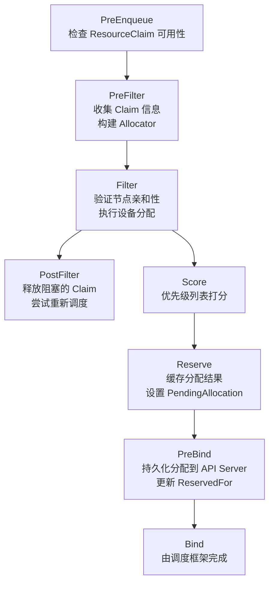
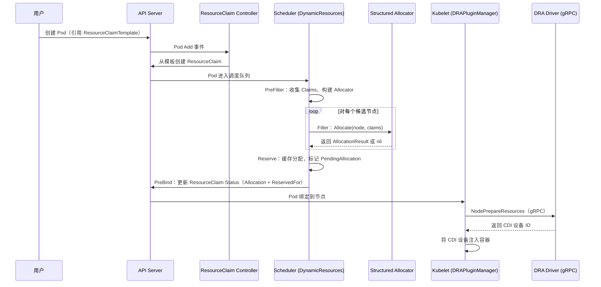

Kubernetes 的**动态资源分配**（Dynamic Resource Allocation，简称 DRA）是一套超越传统 Device Plugin 机制的全新设备管理框架。与 Device Plugin 仅支持整数型设备计数（如 `nvidia.com/gpu: 2`）不同，DRA 引入了结构化的参数模型，允许工作负载以精细化的属性匹配、容量请求和 CEL 表达式选择器来描述对异构硬件（GPU、FPGA、NIC、加速器等）的需求。DRA 的核心架构由 **API 资源模型**、**调度器插件**、**结构化分配器**、**ResourceClaim 控制器**和 **Kubelet DRA 插件管理器**五大组件协同构成，覆盖了从用户声明资源需求到设备最终就绪的完整生命周期。

## API 资源模型：resource.k8s.io 的类型体系

DRA 在 `resource.k8s.io` API 组中定义了六个核心资源类型，构成了一套自描述的设备管理 DSL（Domain-Specific Language）。这些类型的设计遵循了声明式语义——用户描述"需要什么"，而非"如何获取"。

| 资源类型 | 作用域 | 核心职责 |
|---|---|---|
| **ResourceSlice** | 集群级 | DRA 驱动发布可用设备的清单，包含属性、容量、污点 |
| **ResourceClaim** | 命名空间级 | 工作负载对设备的请求声明，追踪分配状态 |
| **ResourceClaimTemplate** | 命名空间级 | Pod 创建 ResourceClaim 的模板，支持 Pod 级参数注入 |
| **DeviceClass** | 集群级 | 管理员预定义的设备选择器与配置，作为策略抽象层 |
| **DeviceTaintRule** | 集群级 | 动态为匹配的设备添加污点，驱动驱逐行为 |
| **ResourcePoolStatusRequest** | 集群级 | 查询资源池的实时状态（如已用容量） |

Sources: [types.go](pkg/apis/resource/types.go#L53-L810)

### ResourceSlice：设备发布的原子单元

`ResourceSlice` 是 DRA 驱动向集群发布设备信息的核心载体。每个 ResourceSlice 属于一个由驱动名和池名唯一标识的 **ResourcePool**，通过 `Generation` 字段实现版本化的原子更新——驱动每次变更设备信息时递增 Generation，消费者仅使用最高代号的切片。

```go
type ResourceSliceSpec struct {
    Driver string           // DRA 驱动名称（DNS 子域名格式，如 dra.example.com）
    Pool   ResourcePool     // 设备池（Name + Generation + ResourceSliceCount）
    NodeName *string        // 节点本地设备的节点名
    Devices []Device        // 设备列表（最多 128 个，使用高级特性时降至 64）
    // ...节点选择模式字段
}
```

每个 `Device` 携带键值对形式的 **Attributes**（用于选择匹配）和 **Capacity**（可消费的数量型资源），两者合计最多 32 项。属性支持五种值类型：`IntValue`、`BoolValue`、StringValue`、`VersionValue` 以及 Alpha 阶段的列表类型（`IntValues` 等）。容量通过 `DeviceCapacity` 描述，其 `RequestPolicy` 字段可约束请求的消费模式——支持 `ValidValues`（离散值集合）和 `ValidRange`（范围 + 步进）两种策略。

Sources: [types.go](pkg/apis/resource/types.go#L100-L189), [types.go](pkg/apis/resource/types.go#L287-L440), [types.go](pkg/apis/resource/types.go#L497-L612)

### ResourceClaim：声明式设备请求

`ResourceClaim` 是用户侧的核心资源，其 `Spec.Devices` 字段承载了设备请求的完整语义。一个 Claim 可以包含多个 `DeviceRequest`，每个请求通过 `Exactly`（精确请求）或 `FirstAvailable`（优先级列表）两种模式描述需求：

```go
type DeviceRequest struct {
    Name           string              // 请求名，用于约束和配置引用
    Exactly        *ExactDeviceRequest // 精确请求模式
    FirstAvailable []DeviceSubRequest  // 优先级列表模式（Alpha）
}

type ExactDeviceRequest struct {
    DeviceClassName string               // 必填，引用 DeviceClass
    Selectors       []DeviceSelector     // CEL 表达式选择器
    AllocationMode  DeviceAllocationMode // ExactCount 或 All
    Count           int64                // 请求的设备数量
    AdminAccess     *bool                // 管理访问（监控等场景）
    Tolerations     []DeviceToleration   // 设备污点容忍
    Capacity        *CapacityRequirements // 容量需求
}
```

`DeviceSelector` 使用 **CEL（Common Expression Language）** 表达式对设备进行细粒度筛选。表达式输入为 `device` 对象，可访问 `device.driver`、`device.attributes[<domain>]`、`device.capacity[<domain>]` 等字段。表达式长度上限为 10 KiB，评估成本上限为 1,000,000 个逻辑步骤。

`DeviceConstraint` 定义了跨设备约束：`MatchAttribute` 确保所有分配设备的某属性值相同（如 NUMA 亲和性），`DistinctAttribute` 则确保属性值互不相同（如分配来自不同物理 NIC 的网卡）。`AllocatedDeviceStatus` 允许驱动报告每个已分配设备的状态，包括 Conditions（就绪状态）、Data（驱动特定数据）和 NetworkData（网络信息如 IP、MAC 地址）。

Sources: [types.go](pkg/apis/resource/types.go#L813-L878), [types.go](pkg/apis/resource/types.go#L895-L1162), [types.go](pkg/apis/resource/types.go#L1207-L1379), [types.go](pkg/apis/resource/types.go#L1491-L1728)

### DeviceClass：管理员策略层

`DeviceClass` 作为集群范围的策略抽象，让管理员能够预定义设备选择器和配置参数。用户在 ResourceClaim 中仅需引用 DeviceClass 名称，无需了解底层设备的具体属性结构。这种设计实现了关注点分离：管理员控制"哪些设备可以被请求"，用户只需表达"我需要什么类型的设备"。

```go
type DeviceClassSpec struct {
    Selectors          []DeviceSelector           // 设备过滤条件
    Config             []DeviceClassConfiguration // 驱动特定配置
    ExtendedResourceName *string                  // 扩展资源映射（Beta）
}
```

Sources: [types.go](pkg/apis/resource/types.go#L1776-L1854)

## 调度器集成：DynamicResources 插件

调度器通过 `DynamicResources` 插件（注册在 `pkg/scheduler/framework/plugins/dynamicresources`）将 DRA 完整集成进调度框架。该插件实现了调度框架的七个扩展点，形成了一条从预过滤到绑定的完整流水线：



Sources: [dynamicresources.go](pkg/scheduler/framework/plugins/dynamicresources/dynamicresources.go#L218-L227)

### PreFilter：构建分配上下文

在 PreFilter 阶段，插件收集 Pod 关联的所有 ResourceClaim，并为需要分配的 Claim 构建 `structured.Allocator`。这一过程涉及三个关键步骤：首先通过 `DRA Manager` 的 `GatherAllocatedState()` 收集全局已分配设备的快照；然后通过 `ListWithDeviceTaintRules()` 获取所有 ResourceSlice 及污点规则；最后根据当前启用的特性门控选择合适的分配器实现（stable/incubating/experimental），调用 `NewAllocator()` 构建实例。Allocator 是线程安全的，可被多个节点的 Filter 调用并发使用。

Sources: [dynamicresources.go](pkg/scheduler/framework/plugins/dynamicresources/dynamicresources.go#L594-L669)

### Filter：节点级设备可行性验证

Filter 阶段对每个候选节点执行两个层面的检查：对于**已分配**的 Claim，验证其 `NodeSelector` 是否匹配当前节点，并检查设备绑定条件（BindingConditions）是否满足；对于**未分配**的 Claim，调用 `allocator.Allocate()` 尝试为该节点计算分配方案。分配结果被缓存在 `stateData.nodeAllocations` 中，供后续 Reserve 和 PreBind 使用。当 `DRASchedulerFilterTimeout` 特性启用时，Filter 可设置超时以避免 CEL 表达式过于复杂导致调度阻塞。

Sources: [dynamicresources.go](pkg/scheduler/framework/plugins/dynamicresources/dynamicresources.go#L739-L931)

### Reserve 与 PreBind：分配的缓存与持久化

Reserve 阶段将 Filter 计算出的分配结果通过 `SignalClaimPendingAllocation()` 标记为"进行中"，防止并发调度周期重复分配同一设备。PreBind 阶段是分配真正生效的时刻——插件通过 API Server 的 `UpdateStatus` 调用将 `Allocation` 结果和 `ReservedFor` 条目持久化到 ResourceClaim 对象中，使用 `RetryOnConflict` 策略处理并发冲突。成功后，分配结果被写入 AssumeCache，调度器可以继续处理后续 Pod。

Sources: [dynamicresources.go](pkg/scheduler/framework/plugins/dynamicresources/dynamicresources.go#L1143-L1643)

### PostFilter：释放与重试

当所有节点都无法满足 Pod 的资源需求时，PostFilter 阶段尝试释放那些"阻塞"了调度的已分配 Claim。具体策略是：对于仅被当前 Pod 预留且无其他消费者的 Claim，清除其 Allocation 和 ReservedFor，使设备重新变为可用。对于 PodGroup 场景，还会清理整个 PodGroup 的预留状态。

Sources: [dynamicresources.go](pkg/scheduler/framework/plugins/dynamicresources/dynamicresources.go#L933-L1004)

## 结构化分配器：stable/incubating/experimental 三层架构

DRA 的核心算法实现在 `staging/src/k8s.io/dynamic-resource-allocation/structured` 包中，采用了一种独特的**三层代码隔离**策略：

| 层级 | 包路径 | 定位 | 说明 |
|---|---|---|---|
| **Stable** | `internal/stable` | GA 级功能 | 最稳定的基础分配逻辑 |
| **Incubating** | `internal/incubating` | Beta 级功能 | 目标成为下一个 Stable |
| **Experimental** | `internal/experimental` | Alpha 级功能 | 全新的实验性特性 |

`NewAllocator()` 根据当前启用的特性集（Features）自动选择最高稳定性的实现。每层实现完全独立，不共享代码——当 Incubating 足够稳定时，可以整体复制覆盖 Stable。这种设计避免了特性间的相互污染，确保了不同成熟度功能的质量隔离。

`Allocator` 接口的核心方法 `Allocate()` 接收一个节点和一组未分配的 Claim，返回对应的 `AllocationResult` 切片。分配器内部维护已分配设备集合（`AllocatedState`），支持传统的独占分配和 `DRAConsumableCapacity` 特性下的共享容量分配。

Sources: [allocator.go](staging/src/k8s.io/dynamic-resource-allocation/structured/allocator.go#L86-L172)

## ResourceClaim 控制器：模板实例化与预留管理

`ResourceClaim` 控制器（`pkg/controller/resourceclaim`）负责两个关键职责：**模板实例化**和**预留生命周期管理**。

当 Pod 引用了 `ResourceClaimTemplate` 时，控制器在 Pod 被创建或更新时自动实例化对应的 ResourceClaim 对象，将模板的 Spec 完整复制并注入 Pod 的命名空间和属主引用。控制器通过自定义索引器（`podResourceClaimIndex`、`podResourceClaimTemplateIndex`）高效地追踪 Pod 与 Claim 的关联关系。

在预留管理方面，控制器监听 Pod 的生命周期事件，在适当时机更新 ResourceClaim 的 `Status.ReservedFor` 列表（最多 256 个消费者）。对于 PodGroup（`DRAWorkloadResourceClaims` 特性），控制器还管理 PodGroup 级别的 Claim 共享。

Sources: [controller.go](pkg/controller/resourceclaim/controller.go#L96-L200)

## Kubelet DRA 插件：节点侧设备准备

Kubelet 侧的 DRA 架构由 `DRAPluginManager`（`pkg/kubelet/cm/dra/plugin`）和 gRPC 插件协议共同实现。

### DRAPluginManager：插件注册与生命周期

`DRAPluginManager` 实现了 `cache.PluginHandler` 接口，通过 Kubelet 的 Plugin Manager 机制发现和注册 DRA 驱动的 gRPC 端点。它维护一个 `store map[string][]*monitoredPlugin`，按驱动名索引所有已注册的插件实例。关键的生命周期管理包括：

- **启动时清除**：Kubelet 启动时清除所有本地 ResourceSlice，避免引用已不存在的设备状态
- **连接监控**：通过 `grpcstats.Handler` 接口追踪 gRPC 连接状态，断开时触发自动重连
- **延迟擦除**：当驱动长时间不可用时，通过 `TimedWorkerQueue` 延迟清除 ResourceSlice，避免短暂的网络抖动导致设备信息丢失

Sources: [dra_plugin_manager.go](pkg/kubelet/cm/dra/plugin/dra_plugin_manager.go#L47-L182)

### gRPC 协议：NodePrepareResources / NodeUnprepareResources

`DRAPlugin` 封装了与驱动 gRPC 服务的通信，支持 v1 和 v1beta1 两个 API 版本。核心 RPC 包括：

- **NodePrepareResources**：为 Pod 准备已分配的设备，驱动返回 CDI 设备 ID 供容器运行时注入
- **NodeUnprepareResources**：清理设备准备阶段的副作用
- **NodeWatchResources**：通过服务器推送流（Server Stream）接收设备健康状态更新

每个 gRPC 调用默认有 45 秒超时（`defaultClientCallTimeout`），约为 Kubelet 重试周期的一半。

Sources: [dra_plugin.go](pkg/kubelet/cm/dra/plugin/dra_plugin.go#L44-L175)

### 驱动侧辅助库

`staging/src/k8s.io/dynamic-resource-allocation/kubeletplugin` 包为 DRA 驱动开发者提供了完整的脚手架。`DRAPlugin` 接口定义了驱动必须实现的三个方法：`PrepareResourceClaims`（设备准备）、`UnprepareResourceClaims`（设备清理）和 `HandleError`（错误处理）。辅助库自动处理 gRPC 日志、请求序列化和 ResourceSlice 发布等通用逻辑。

Sources: [draplugin.go](staging/src/k8s.io/dynamic-resource-allocation/kubeletplugin/draplugin.go#L54-L200)

## 设备污点与驱逐

DRA 的设备污点机制（`DRADeviceTaints` 特性，Beta）借鉴了节点污点的设计理念，但作用域限定在设备级别。污点有三个效果等级：

| 效果 | 行为 |
|---|---|
| `None` | 纯信息性，不影响调度 |
| `NoSchedule` | 阻止不容忍该污点的新 Pod 调度到使用此设备的 Claim |
| `NoExecute` | 驱逐正在使用此设备的 Pod，直到 Claim 被释放 |

`DeviceTaintRule`（`DRADeviceTaintRules` 特性，Alpha）允许管理员或自动化系统动态地为匹配选择器的设备添加污点，无需修改 ResourceSlice。`DeviceTaintEviction` 控制器（`pkg/controller/devicetainteviction`）负责处理 `NoExecute` 效果的驱逐逻辑。

Sources: [types.go](pkg/apis/resource/types.go#L726-L796), [types.go](pkg/apis/resource/types.go#L1438-L1479), [types.go](pkg/apis/resource/types.go#L2017-L2100)

## 特性门控全景

DRA 的功能通过一系列特性门控控制其渐进式交付。以下是当前代码中与 DRA 相关的所有特性门控：

| 特性门控 | 成熟度 | 核心功能 |
|---|---|---|
| `DynamicResourceAllocation` | GA | 总开关，启用 DRA 框架 |
| `DRAAdminAccess` | Beta | 管理访问模式（监控等） |
| `DRADeviceTaints` | Beta | 设备污点与容忍 |
| `DRADeviceBindingConditions` | Beta | 设备绑定条件检查 |
| `DRAResourceClaimDeviceStatus` | Beta | 驱动报告每设备状态 |
| `DRAPartitionableDevices` | Beta | 可分区设备（每设备节点选择） |
| `DRAPrioritizedList` | Beta | 优先级列表请求（FirstAvailable） |
| `DRAConsumableCapacity` | Alpha | 可消费容量（设备共享） |
| `DRAExtendedResource` | Alpha | 扩展资源映射 |
| `DRAPartitionableDevices` | Beta | 每设备独立节点选择 |
| `DRAWorkloadResourceClaims` | Alpha | PodGroup 级 Claim 共享 |
| `DRANodeAllocatableResources` | Alpha | DRA 管理节点可分配资源 |
| `DRAListTypeAttributes` | Alpha | 列表类型属性 |
| `DRASchedulerFilterTimeout` | Alpha | 调度器 Filter 超时控制 |

Sources: [kube_features.go](pkg/features/kube_features.go#L198-L345)

## 端到端流程：从 Pod 创建到设备就绪



Sources: [dynamicresources.go](pkg/scheduler/framework/plugins/dynamicresources/dynamicresources.go#L280-L1643), [dra_plugin.go](pkg/kubelet/cm/dra/plugin/dra_plugin.go#L72-L133)

## 测试体系

DRA 拥有多层次的测试覆盖：

- **集成测试**（`test/integration/dra`）：覆盖核心流程（`core.go`）、设备污点（`device_taints.go`）、绑定条件（`binding_conditions.go`）、可分区设备（`partitionable_devices.go`）、管理访问（`adminaccess.go`）、扩展资源（`extendedresource.go`）等场景
- **端到端测试**（`test/e2e_dra`）：包括 `coredra_test.go`（核心功能）、`devicetaints_test.go`（污点）、`partitionabledevices_test.go`（分区设备）、`resourceclaimstatus_test.go`（状态追踪）和 `upgradedowngrade_test.go`（升级兼容性）
- **节点级测试**（`test/e2e_node/dra_test.go`）：验证 Kubelet 侧的设备准备流程

Sources: [integration/dra](test/integration/dra), [e2e_dra](test/e2e_dra)

---

**下一步阅读建议**：

- 理解调度器的完整架构：[调度器架构与调度框架插件机制](10-diao-du-qi-jia-gou-yu-diao-du-kuang-jia-cha-jian-ji-zhi)
- 深入调度扩展点细节：[调度框架接口与扩展点（Filter、Score、Bind 等）](15-diao-du-kuang-jia-jie-kou-yu-kuo-zhan-dian-filter-score-bind-deng)
- 了解特性门控如何控制功能生命周期：[特性门控系统与功能生命周期管理](28-te-xing-men-kong-xi-tong-yu-gong-neng-sheng-ming-zhou-qi-guan-li)
- 对比传统设备管理方式：[存储卷插件体系与 CSI 集成](18-cun-chu-juan-cha-jian-ti-xi-yu-csi-ji-cheng)