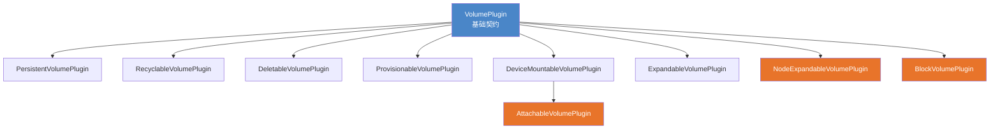
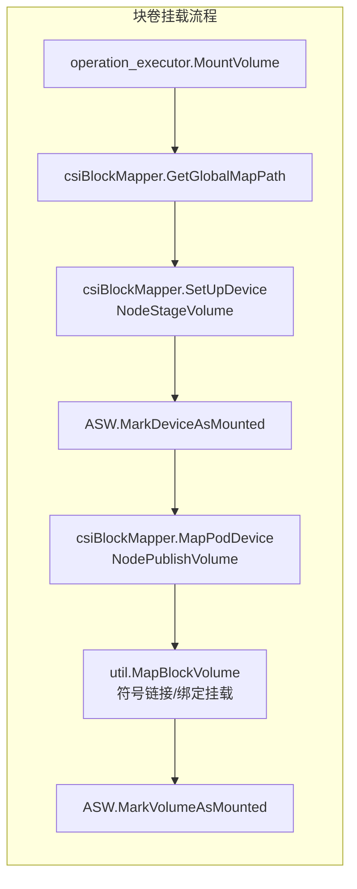
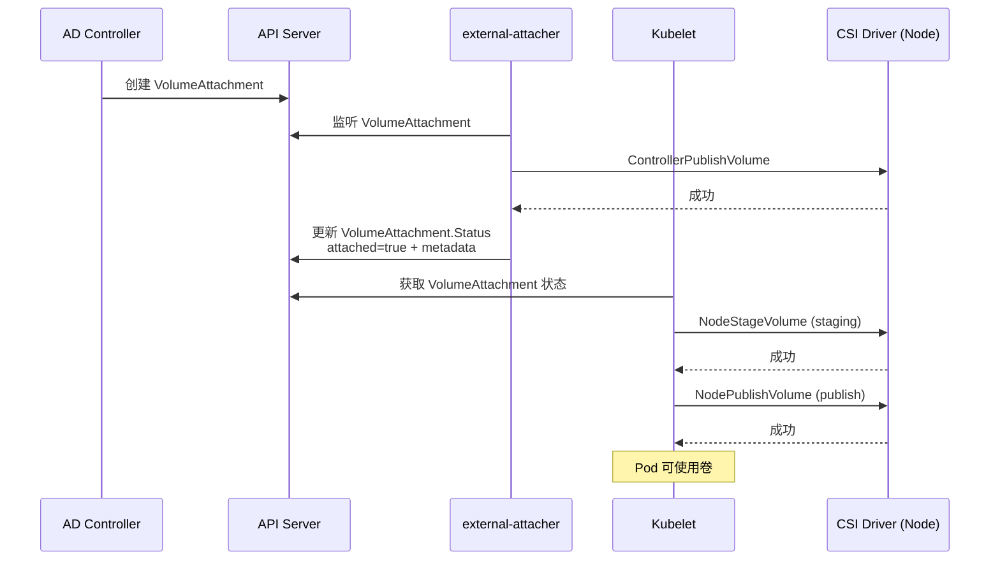

Kubernetes 的存储卷系统是一套分层抽象的插件体系——从最基础的 `VolumePlugin` 接口出发，通过**接口组合**（interface composition）逐步叠加挂载、附加、供给、扩容、块设备等能力维度，最终形成一棵功能完备的插件接口继承树。CSI（Container Storage Interface）作为这一体系中的核心桥接层，以 gRPC 协议对接外部存储驱动，同时作为 in-tree 插件注册到 `VolumePluginMgr` 中，与 `hostPath`、`nfs`、`fc` 等传统插件共享同一套生命周期管理框架。本文将从接口架构、插件注册机制、CSI 通信模型、迁移框架四个层面，系统拆解这一存储卷插件体系的设计与实现。

Sources: [doc.go](pkg/volume/doc.go#L17-L19), [plugins.go](pkg/volume/plugins.go#L126-L181)

## 卷插件接口继承体系

Kubernetes 的卷插件并非一个"大一统"接口，而是采用**最小接口原则**设计的分层组合结构。所有插件必须实现基础 `VolumePlugin` 接口，然后按需组合附加能力接口——这种设计使得不同类型的存储后端只需实现自己关心的操作集合，而不必被迫实现全部方法。

### 基础接口与能力扩展

`VolumePlugin` 定义了所有卷插件的**最小公共契约**：初始化（`Init`）、命名（`GetPluginName`）、匹配判断（`CanSupport`）、创建挂载器/卸载器（`NewMounter`/`NewUnmounter`），以及从磁盘重建卷规格（`ConstructVolumeSpec`）。在此基础上，Kubernetes 定义了 9 个能力扩展接口，每个接口对应一种独立的存储操作维度。

| 接口名称 | 核心方法 | 语义职责 |
|:---|:---|:---|
| `VolumePlugin` | `Init`, `CanSupport`, `NewMounter` | 所有插件的基础契约 |
| `PersistentVolumePlugin` | `GetAccessModes` | 声明支持的 PV 访问模式 |
| `RecyclableVolumePlugin` | `Recycle` | PV 回收策略（保留、删除前清理） |
| `DeletableVolumePlugin` | `NewDeleter` | 从底层存储中删除 PV 资源 |
| `ProvisionableVolumePlugin` | `NewProvisioner` | 动态供给新 PV |
| `AttachableVolumePlugin` | `NewAttacher`, `NewDetacher` | 卷的节点附加/分离 |
| `DeviceMountableVolumePlugin` | `NewDeviceMounter` | 设备级全局挂载 |
| `ExpandableVolumePlugin` | `ExpandVolumeDevice` | 控制面卷扩容 |
| `NodeExpandableVolumePlugin` | `NodeExpand` | 节点侧文件系统扩容 |
| `BlockVolumePlugin` | `NewBlockVolumeMapper` | 原始块设备映射 |

Sources: [plugins.go](pkg/volume/plugins.go#L126-L283)

这些接口之间的组合关系如下所示。`csiPlugin` 几乎实现了全部能力接口——这是 CSI 作为"通用存储桥接层"的必然要求：

Sources: [plugins.go](pkg/volume/plugins.go#L226-L283)

### 卷操作对象的生命周期

`VolumePlugin` 并非直接执行 I/O 操作，而是充当**工厂角色**——通过 `NewMounter`、`NewAttacher` 等工厂方法创建对应的操作对象。这些操作对象各自承担存储生命周期中的不同阶段。`Volume` 接口是最底层的抽象，仅定义 `GetPath()` 和 `MetricsProvider`；`Mounter`/`Unmounter` 在此基础上添加文件系统级挂载/卸载能力；`Attacher`/`Detacher` 处理块设备的节点级附加；`Provisioner`/`Deleter` 则在控制面层面管理 PV 的创建与销毁。

Sources: [volume.go](pkg/volume/volume.go#L33-L329)

## 插件注册与发现机制

### VolumePluginMgr：插件注册表

`VolumePluginMgr` 是整个卷插件体系的中枢注册表。它维护两组插件映射：**静态插件**（`plugins` map，启动时一次性注册）和**动态探测插件**（`probedPlugins` map，运行时通过 `DynamicPluginProber` 发现）。其初始化流程通过 `InitPlugins` 方法完成——遍历传入的插件列表，校验插件名称的合法性（必须是 qualified name，如 `kubernetes.io/csi`），调用每个插件的 `Init(host)` 方法注入 `VolumeHost` 依赖，最终存入内部 map。

Sources: [plugins.go](pkg/volume/plugins.go#L421-L611)

**插件发现**的核心逻辑在 `FindPluginBySpec` 中实现：遍历所有已注册插件，调用每个插件的 `CanSupport(spec)` 方法进行匹配。若恰好一个插件匹配则返回该插件；零匹配返回 `ErrNoPluginMatched`；多匹配则返回冲突错误。在查找过程中还会触发一次 `refreshProbedPlugins`，通过 `DynamicPluginProber.Probe()` 检测动态插件的增删事件（`ProbeAddOrUpdate` / `ProbeRemove`），从而支持 FlexVolume 等运行时发现的插件类型。

Sources: [plugins.go](pkg/volume/plugins.go#L631-L717)

### Kubelet 侧的初始化链路

在 Kubelet 启动过程中，`NewInitializedVolumePluginMgr` 函数完成插件管理器的完整构建。它首先创建 `kubeletVolumeHost`——这是 `VolumeHost` 接口的 Kubelet 实现，桥接了 Kubelet 内部的 Secret 管理器、ConfigMap 管理器、Token 管理器、Informer 工厂等基础设施。随后，通过 `InitPlugins` 将所有插件（包括 CSI、hostPath、nfs 等 in-tree 插件以及动态探测器）注入管理器。

Sources: [volume_host.go](pkg/kubelet/volume_host.go#L54-L99)

`kubeletVolumeHost` 同时实现了 `VolumeHost`、`KubeletVolumeHost` 和 `CSIDriverVolumeHost` 三个接口，分别提供：通用卷路径操作（`GetPluginDir`、`GetPodVolumeDir`）、Kubelet 特有能力（`SetKubeletError`、`CSIDriverLister`、`WaitForCacheSync`）、以及 CSI 驱动列表访问。这种接口分层设计使插件只需类型断言自己所需的 Host 子集，避免不必要的依赖耦合。

Sources: [volume_host.go](pkg/kubelet/volume_host.go#L101-L188)

### In-Tree 插件全景

Kubernetes 源码中 `pkg/volume/` 下收录了多种 in-tree 插件，覆盖从本地存储到网络存储的不同场景：

| 插件目录 | 插件名称 | 类型 | 核心能力接口 |
|:---|:---|:---|:---|
| `hostpath/` | `kubernetes.io/host-path` | 本地存储 | PersistentVolumePlugin, RecyclableVolumePlugin, DeletableVolumePlugin, ProvisionableVolumePlugin |
| `nfs/` | `kubernetes.io/nfs` | 网络文件系统 | PersistentVolumePlugin |
| `emptydir/` | `kubernetes.io/empty-dir` | 临时存储 | VolumePlugin |
| `fc/` | `kubernetes.io/fc` | Fibre Channel | PersistentVolumePlugin, AttachableVolumePlugin |
| `iscsi/` | `kubernetes.io/iscsi` | iSCSI | PersistentVolumePlugin, AttachableVolumePlugin |
| `local/` | `kubernetes.io/local-volume` | 本地持久化 | PersistentVolumePlugin |
| `flexvolume/` | `kubernetes.io/flexvolume` | 可执行文件插件 | PersistentVolumePlugin, AttachableVolumePlugin, ExpandableVolumePlugin |
| `csi/` | `kubernetes.io/csi` | CSI 桥接 | **全部能力接口** |
| `secret/` | `kubernetes.io/secret` | Secret 投射 | VolumePlugin |
| `configmap/` | `kubernetes.io/configmap` | ConfigMap 投射 | VolumePlugin |
| `projected/` | `kubernetes.io/projected` | 投射卷聚合 | VolumePlugin |
| `downwardapi/` | `kubernetes.io/downward-api` | Downward API | VolumePlugin |
| `image/` | `kubernetes.io/image` | 容器镜像卷 | VolumePlugin |

以 `hostPath` 插件为例，它通过 `ProbeVolumePlugins` 函数导出插件实例，并在编译期通过 `var _ volume.PersistentVolumePlugin = &hostPathPlugin{}` 等声明确保接口实现的正确性。`CanSupport` 方法通过检查 `spec.PersistentVolume.Spec.HostPath` 或 `spec.Volume.HostPath` 是否非空来判断是否能处理给定的卷规格。

Sources: [host_path.go](pkg/volume/hostpath/host_path.go#L45-L100)

## CSI 插件架构深度解析

CSI 插件（`kubernetes.io/csi`）是整个卷插件体系中最复杂的实现。它既是一个标准的 in-tree `VolumePlugin`，又是 Kubernetes 与外部 CSI 驱动之间的**协议桥梁**——通过 gRPC 调用将 Kubernetes 的存储操作语义转换为 CSI 标准的 RPC 调用。

### CSI 驱动注册：PluginWatcher 机制

CSI 驱动的注册过程与 in-tree 插件有着本质区别。In-tree 插件在编译期确定、启动时注册；CSI 驱动则在运行时通过 **PluginWatcher** 机制动态发现。每个 CSI 驱动在节点上以 Sidecar 容器形式运行，通过 `node-driver-registrar` 在 Kubelet 的插件注册目录（通常为 `/var/lib/kubelet/plugins_registry/`）下创建 Unix Socket 文件。Kubelet 的 PluginWatcher 检测到新 Socket 后，触发 `RegistrationHandler.ValidatePlugin` 和 `RegisterPlugin` 回调。

Sources: [csi_plugin.go](pkg/volume/csi/csi_plugin.go#L86-L170)

注册流程分为四个步骤：**版本校验**（`validateVersions`，确保驱动支持 CSI v1.x）、**存储端点**（将驱动名及其 Socket 端点写入全局 `DriversStore`）、**获取节点信息**（通过 `NodeGetInfo` RPC 获取 `driverNodeID`、`maxVolumePerNode`、`accessibleTopology`）、**更新集群状态**（通过 `nodeinfomanager.InstallCSIDriver` 将驱动信息写入 CSINode 对象）。若任何步骤失败，已注册的驱动信息会被回滚（`unregisterDriver`）。

`DriversStore` 是一个线程安全的全局注册表，以驱动名为键、`Driver` 结构体（包含 `endpoint` 和 `highestSupportedVersion`）为值。所有后续的 CSI gRPC 调用都通过查询此 Store 获取目标驱动的 Socket 地址。

Sources: [csi_drivers_store.go](pkg/volume/csi/csi_drivers_store.go#L27-L79)

### CSI gRPC 客户端：Node 服务调用

`csiDriverClient` 封装了与 CSI 驱动 Node 服务的全部 gRPC 通信。它定义了 `csiClient` 接口，覆盖了 CSI Node 服务的核心 RPC 方法：

| CSI RPC 方法 | 接口方法 | 对应操作 |
|:---|:---|:---|
| `NodeGetInfo` | `NodeGetInfo()` | 获取节点拓扑、容量信息 |
| `NodeStageVolume` | `NodeStageVolume()` | 卷的 Staging 阶段 |
| `NodeUnstageVolume` | `NodeUnstageVolume()` | 卷的 Unstaging |
| `NodePublishVolume` | `NodePublishVolume()` | 卷的 Publishing |
| `NodeUnpublishVolume` | `NodeUnpublishVolume()` | 卷的 Unpublishing |
| `NodeGetVolumeStats` | `NodeGetVolumeStats()` | 卷使用统计 |
| `NodeExpandVolume` | `NodeExpandVolume()` | 节点侧卷扩容 |
| — | `NodeSupportsStageUnstage()` | 能力探测 |
| — | `NodeSupportsNodeExpand()` | 能力探测 |
| — | `NodeSupportsVolumeMountGroup()` | 能力探测 |

gRPC 连接的创建通过 `newV1NodeClient` 工厂函数完成，每次调用都新建连接并在 `defer` 中关闭，避免了连接管理的复杂性。`csiDriverClient` 内部还集成了 `MetricsManager`，用于记录每次 CSI 调用的延迟和错误率。

Sources: [csi_client.go](pkg/volume/csi/csi_client.go#L42-L170)

### 文件系统卷挂载：csiMountMgr

`csiMountMgr` 是 CSI 文件系统卷挂载的核心结构体，同时实现了 `volume.Volume` 和 `volume.Mounter` 接口。其 `SetUpAt` 方法执行完整的挂载流程，分为以下关键阶段：

**阶段一：前置检查**——验证 CSI 驱动是否已注册（获取 `csiClient`）、检查驱动是否支持当前卷的生命周期模式（Persistent 或 Ephemeral）、查询 `fsGroupPolicy`。

**阶段二：参数组装**——根据卷来源（`CSIVolumeSource` 对应 Ephemeral 模式，`CSIPersistentVolumeSource` 对应 Persistent 模式）提取 `fsType`、`volumeAttributes`、`accessMode`、`mountOptions` 等参数。对于 Persistent 模式，还需检查驱动是否支持 `STAGE_UNSTAGE` 能力来决定是否需要 `deviceMountPath`。

**阶段三：上下文注入**——通过 `CSIDriver.Spec.PodInfoOnMount` 判断是否注入 Pod 元信息（名称、命名空间、UID 等），通过 `CSIDriver.Spec.TokenRequests` 判断是否注入 ServiceAccount 令牌。这些信息以 `volume_context` 或 `secrets` 的形式传递给 CSI 驱动。

**阶段四：数据持久化**——将卷的关键元数据（`specVolID`、`volHandle`、`driverName`、`nodeName`、`volumeLifecycleMode`、`attachmentID`）序列化为 JSON 并保存到节点磁盘上的 `vol_data.json` 文件。这一机制使得 Kubelet 重启后能通过 `ConstructVolumeSpec` 重建卷规格。

**阶段五：NodePublishVolume RPC 调用**——最终通过 gRPC 调用 CSI 驱动的 `NodePublishVolume`，传入所有已组装的参数。

Sources: [csi_mounter.go](pkg/volume/csi/csi_mounter.go#L64-L357)

### 块设备卷映射：csiBlockMapper

对于块设备卷（`volumeMode: Block`），CSI 插件通过 `csiBlockMapper` 实现了 `BlockVolumeMapper` 和 `CustomBlockVolumeMapper` 接口。块卷的挂载流程与文件系统卷有显著差异——它不涉及文件系统挂载，而是通过符号链接和绑定挂载将块设备映射到 Pod 的设备目录。

Sources: [csi_block.go](pkg/volume/csi/csi_block.go#L17-L64)

### 卷附加/分离：csiAttacher

`csiAttacher` 负责实现 CSI 卷的**节点级附加/分离**操作，运行在 AttachDetach Controller 中（非 Kubelet 上下文）。CSI 的 Attach/Detach 并非直接调用 CSI 驱动的 RPC，而是通过 **VolumeAttachment API 对象**进行间接协调——`Attach` 方法创建一个 `VolumeAttachment` 资源，然后轮询等待其状态变为 `Attached`；真正的附加操作由 **external-attacher** Sidecar 监听 VolumeAttachment 对象后调用 CSI 驱动的 `ControllerPublishVolume` 完成。

Sources: [csi_attacher.go](pkg/volume/csi/csi_attacher.go#L63-L139)

### 节点扩容：CSI Expander

`csiPlugin` 实现了 `NodeExpandableVolumePlugin` 接口，通过 `NodeExpand` 方法在节点侧完成卷扩容。其实现逻辑首先探测驱动是否支持 `NodeExpand` 能力（`NodeSupportsNodeExpand`），然后区分文件系统卷和块卷两种场景——文件系统卷使用 `DeviceMountPath`，块卷使用 `DevicePath`。扩容调用通过 `csiClient.NodeExpandVolume` 发起，异常时区分 `FailedPrecondition`（卷正在使用中，需重试）和 `InvalidArgument/OutOfRange/NotFound`（不可恢复的终止错误）两种错误类型。

Sources: [expander.go](pkg/volume/csi/expander.go#L32-L164)

## CSI 迁移框架

CSI 迁移（CSI Migration）是 Kubernetes 将 in-tree 存储插件逐步替换为 CSI 驱动的**渐进式过渡机制**。其核心思想是：当用户创建一个使用 in-tree 存储类型（如 `kubernetes.io/aws-ebs`）的 PV 时，系统在运行时将其"翻译"为等效的 CSI 卷规格，交由对应的 CSI 驱动处理，从而在不改变用户 API 体验的前提下完成底层实现的切换。

### PluginManager：迁移状态管理

`csimigration.PluginManager` 跟踪每个 in-tree 插件的迁移状态，提供两个关键判断方法：`IsMigrationEnabledForPlugin`（迁移是否已启用）和 `IsMigrationCompleteForPlugin`（迁移是否已完成，即 in-tree 插件已注销）。当前版本中，以下 7 个 in-tree 插件的迁移已完成且不可逆：

| In-Tree 插件 | CSI 等效驱动 | 迁移状态 |
|:---|:---|:---|
| `kubernetes.io/aws-ebs` | `ebs.csi.aws.com` | ✅ 完成且不可逆 |
| `kubernetes.io/gce-pd` | `pd.csi.storage.gke.io` | ✅ 完成且不可逆 |
| `kubernetes.io/azure-disk` | `disk.csi.azure.com` | ✅ 完成且不可逆 |
| `kubernetes.io/azure-file` | `file.csi.azure.com` | ✅ 完成且不可逆 |
| `kubernetes.io/cinder` | `cinder.csi.openstack.org` | ✅ 完成且不可逆 |
| `kubernetes.io/vsphere-volume` | `csi.vsphere.vmware.com` | ✅ 完成且不可逆 |
| `kubernetes.io/portworx-volume` | `pxd.portworx.com` | ✅ 完成且不可逆 |

Sources: [plugin_manager.go](pkg/volume/csimigration/plugin_manager.go#L37-L151)

### 规格翻译：InTree 到 CSI 的转换

`TranslateInTreeSpecToCSI` 函数是迁移的核心转换入口。它接收一个 in-tree 卷规格（PV 或内联 Volume），通过 `InTreeToCSITranslator` 接口将其翻译为等效的 CSI `PersistentVolume` 规格，并标记 `Migrated: true` 和 `InlineVolumeSpecForCSIMigration`（针对内联卷场景）。翻译后的 Spec 被 CSI 插件的 `CanSupport` 方法识别——因为 `spec.PersistentVolume.Spec.CSI != nil`——从而自然地路由到 CSI 处理路径。

在 `csiPlugin.Init` 中，迁移的 CSI 驱动名映射被传递给 `nodeinfomanager`，用于在 CSINode 对象上标注哪些 in-tree 插件已被迁移，确保 AttachDetach Controller 和 Kubelet 在决策时能正确识别迁移状态。

Sources: [plugin_manager.go](pkg/volume/csimigration/plugin_manager.go#L120-L151), [csi_plugin.go](pkg/volume/csi/csi_plugin.go#L325-L358)

### CSINode 对象与节点信息管理

`nodeinfomanager` 负责将 CSI 驱动的节点信息同步到集群的 `CSINode` API 对象。当新 CSI 驱动注册时，`InstallCSIDriver` 方法将驱动的 `driverNodeID`、`maxVolumePerNode` 和 `accessibleTopology` 写入 CSINode 对象的 `Spec.Drivers` 列表。CSINode 对象是 Kubelet 启动就绪的前提——`initializeCSINode` 函数会阻塞 Kubelet 的 Ready 状态（通过 `SetKubeletError`），直到 CSINode 成功创建并初始化。

Sources: [nodeinfomanager.go](pkg/volume/csi/nodeinfomanager/nodeinfomanager.go#L61-L100)

## CSI 完整生命周期：从附加到挂载

以下流程图展示了 CSI 持久卷从 Attach 到最终 Pod 可用的完整生命周期，涵盖了控制面（AD Controller、external-attacher）和节点面（Kubelet）的协作关系：

Sources: [csi_attacher.go](pkg/volume/csi/csi_attacher.go#L63-L139), [csi_mounter.go](pkg/volume/csi/csi_mounter.go#L103-L357)

## 接下来

- 了解卷管理器如何协调上述插件完成挂载/卸载的实际调度，参见 [卷管理器与挂载生命周期](19-juan-guan-li-qi-yu-gua-zai-sheng-ming-zhou-qi)
- 理解调度器如何根据 CSI 拓扑信息进行节点选择，参见 [调度框架接口与扩展点（Filter、Score、Bind 等）](15-diao-du-kuang-jia-jie-kou-yu-kuo-zhan-dian-filter-score-bind-deng)
- 探索 API 层面 PV/PVC 的定义与验证逻辑，参见 [API 资源定义与类型系统（pkg/apis）](12-api-zi-yuan-ding-yi-yu-lei-xing-xi-tong-pkg-apis)