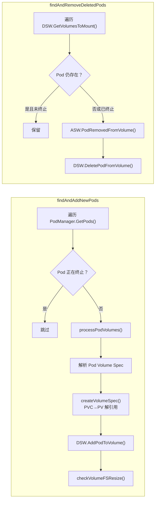
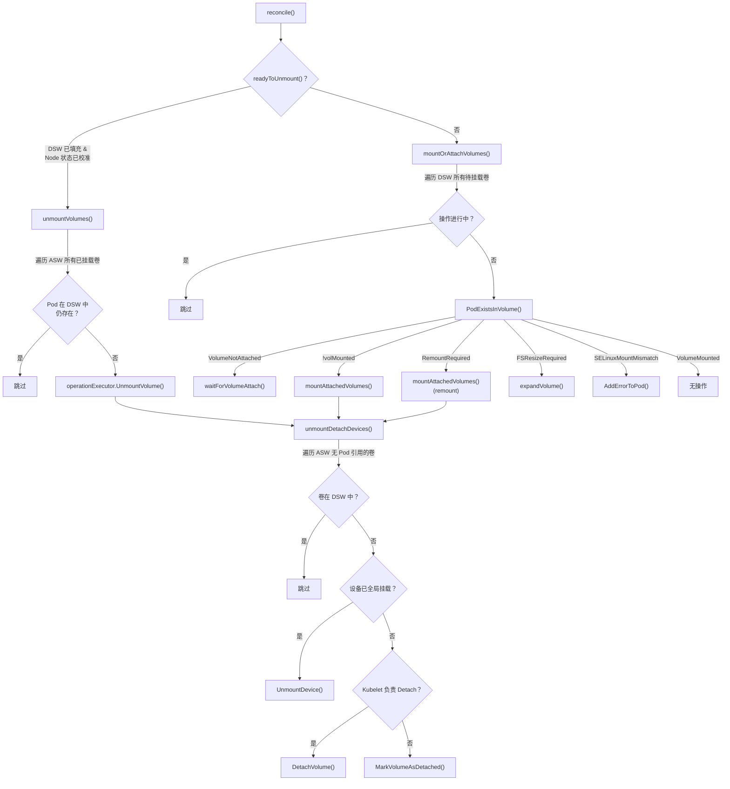
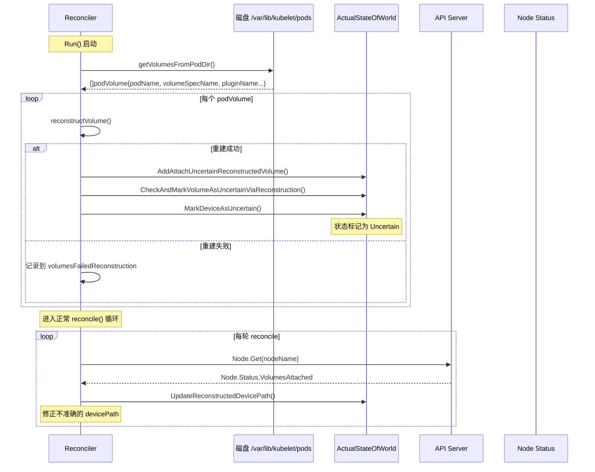

Kubelet 的 Volume Manager 是节点级别存储编排的核心引擎。它通过 **期望状态** 与 **实际状态** 的持续对比，驱动存储卷从 Attach → Mount → Unmount → Detach 的完整生命周期。本页将深入剖析 `pkg/kubelet/volumemanager` 的内部架构、核心数据结构、异步协作模型以及 Kubelet 重启后的状态重建机制，帮助高级开发者理解 Kubernetes 如何在节点层面保证存储的一致性与可靠性。

Sources: [volume_manager.go](pkg/kubelet/volumemanager/volume_manager.go#L94-L160)

## 整体架构概览

Volume Manager 采用经典的 **Reconciliation Loop** 模式，由三个核心异步循环协同工作：

1. **DesiredStateOfWorldPopulator**：从 PodManager 读取 Pod 信息，计算「应该存在哪些卷」，写入 DSW 缓存
2. **Reconciler**：对比 DSW 与 ASW 的差异，通过 OperationExecutor 调度具体的 Attach/Detach/Mount/Unmount 操作
3. **OperationExecutor**：通过 NestedPendingOperations 保证同一卷上不会并发执行多个操作

下图展示了组件间的协作关系与数据流向：

```mermaid
graph TB
    subgraph Kubelet
        PM["PodManager<br/>(Pod 事实来源)"]
    end

    subgraph VolumeManager
        subgraph Populator["DesiredStateOfWorldPopulator"]
            DSWP_LOOP["周期循环<br/>(100ms)"]
        end

        subgraph Caches["状态缓存层"]
            DSW["DesiredStateOfWorld<br/>(期望状态)"]
            ASW["ActualStateOfWorld<br/>(实际状态)"]
        end

        subgraph Reconciler["Reconciler"]
            RC_RECON["reconcile()"]
            RC_RECONSTRUCT["reconstructVolumes()"]
            RC_UNMOUNT["unmountVolumes()"]
            RC_MOUNT["mountOrAttachVolumes()"]
            RC_DETACH["unmountDetachDevices()"]
        end

        subgraph OpExec["OperationExecutor"]
            OE["NestedPendingOperations<br/>(操作互斥)"]
            OG["OperationGenerator<br/>(操作生成器)"]
        end
    end

    PM -->|"GetPods()"| DSWP_LOOP
    DSWP_LOOP -->|"AddPodToVolume()"| DSW
    DSWP_LOOP -->|"DeletePodFromVolume()"| DSW
    RC_RECON --> RC_UNMOUNT
    RC_RECON --> RC_MOUNT
    RC_RECON --> RC_DETACH
    DSW -->|"GetVolumesToMount()"| RC_RECON
    ASW -->|"GetMountedVolumes()"<br/>"GetUnmountedVolumes()"| RC_RECON
    RC_RECONSTRUCT -->|"扫描磁盘"| ASW
    RC_MOUNT --> OE
    RC_UNMOUNT --> OE
    RC_DETACH --> OE
    OE --> OG
    OG -->|"成功后更新"| ASW

    style DSW fill:#e1f5fe
    style ASW fill:#e8f5e9
    style OE fill:#fff3e0
```

Sources: [volume_manager.go](pkg/kubelet/volumemanager/volume_manager.go#L183-L239), [volume_manager.go](pkg/kubelet/volumemanager/volume_manager.go#L298-L317)

## VolumeManager 接口定义与生命周期

`VolumeManager` 接口定义了 Kubelet 与卷管理子系统之间的全部交互契约。核心方法分为三类：**启动控制**（`Run`）、**同步等待**（`WaitForAttachAndMount`/`WaitForUnmount`）、**状态查询**（`GetVolumesInUse`/`VolumeIsAttached` 等）。

| 方法 | 职责 | 调用场景 |
|------|------|----------|
| `Run(ctx, sourcesReady)` | 启动全部异步循环 | Kubelet 启动时 (`go kl.volumeManager.Run`) |
| `WaitForAttachAndMount(ctx, pod)` | 阻塞等待 Pod 的所有卷挂载完成 | `syncPod` 流程中，容器创建之前 |
| `WaitForUnmount(ctx, pod)` | 阻塞等待 Pod 的所有卷卸载完成 | Pod 终止清理阶段 |
| `GetVolumesInUse()` | 返回当前节点正在使用的卷列表 | Node 状态上报 |
| `GetMountedVolumesForPod(podName)` | 返回 Pod 已挂载的卷映射 | 容器运行时构建挂载列表 |
| `MarkVolumesAsReportedInUse(volumes)` | 标记卷已被上报至 Node 状态 | Node 状态同步循环 |

在 Kubelet 初始化阶段，VolumeManager 通过 `NewVolumeManager` 工厂函数创建，关键参数包括 `controllerAttachDetachEnabled`（决定由谁负责 Attach/Detach）和 `volumePluginMgr`（已初始化的卷插件管理器）。启动后，三个 goroutine 独立运行：Populator 填充期望状态、Reconciler 调和差异、VolumePluginMgr 运行 CSI Driver informer。

Sources: [volume_manager.go](pkg/kubelet/volumemanager/volume_manager.go#L97-L160), [kubelet.go](pkg/kubelet/kubelet.go#L1052-L1064), [kubelet.go](pkg/kubelet/kubelet.go#L1907-L1907), [kubelet.go](pkg/kubelet/kubelet.go#L2196-L2208)

## 双缓存模型：DSW 与 ASW

Volume Manager 的核心设计模式是 **双缓存对比**。`DesiredStateOfWorld`（DSW）记录「世界应该是什么样」，`ActualStateOfWorld`（ASW）记录「世界实际是什么样」。Reconciler 通过持续对比两者来发现并修复差异。

### DesiredStateOfWorld —— 期望状态缓存

DSW 维护一个 `volumesToMount` 映射表，键为 `v1.UniqueVolumeName`，值为 `volumeToMount` 结构体。每个 `volumeToMount` 包含该卷关联的所有 Pod（`podsToMount`）、插件能力标记（`pluginIsAttachable`、`pluginIsDeviceMountable`）以及 GID、SELinux 等安全上下文信息。DSW 的核心操作包括：

- **`AddPodToVolume`**：将 Pod 添加到指定卷下，隐式创建不存在的卷条目
- **`DeletePodFromVolume`**：移除 Pod 对卷的引用，若卷下无 Pod 则级联删除卷条目
- **`MarkVolumesReportedInUse`**：标记已被 Node 状态上报的卷，Attach 操作依赖此标记
- **`UpdatePersistentVolumeSize`**：更新期望的 PV 大小，用于触发在线扩容

Sources: [desired_state_of_world.go](pkg/kubelet/volumemanager/cache/desired_state_of_world.go#L45-L161)

### ActualStateOfWorld —— 实际状态缓存

ASW 维护两层状态：**设备级**（`attachedVolumes`）和 **Pod 级**（每个设备下的 `mountedPods`）。它组合了 `ActualStateOfWorldMounterUpdater` 和 `ActualStateOfWorldAttacherUpdater` 两组接口，分别由 Mount 操作和 Attach 操作的成功回调来更新。ASW 引入了 **不确定性状态**（Uncertain）的概念——当操作发起但未确认结果时，状态被标记为 `DeviceMountUncertain` 或 `VolumeMountUncertain`，这在 Kubelet 重启场景中至关重要。

Sources: [actual_state_of_world.go](pkg/kubelet/volumemanager/cache/actual_state_of_world.go#L40-L195)

### 设备与卷挂载状态机

操作执行器中的状态枚举定义了完整的生命周期状态：

| 状态类型 | 枚举值 | 含义 |
|----------|--------|------|
| **DeviceMountState** | `DeviceGloballyMounted` | 设备已全局挂载至插件共享挂载点 |
| | `DeviceMountUncertain` | 设备可能已挂载，操作进行中或结果未知 |
| | `DeviceNotMounted` | 设备未全局挂载 |
| **VolumeMountState** | `VolumeMounted` | 卷已挂载至 Pod 路径 |
| | `VolumeMountUncertain` | 卷可能已挂载至 Pod 路径 |
| | `VolumeNotMounted` | 卷未挂载至 Pod 路径 |

Sources: [operation_executor.go](pkg/volume/util/operationexecutor/operation_executor.go#L467-L494)

## DesiredStateOfWorldPopulator：期望状态构建器

Populator 是 Volume Manager 的「感知器官」，它以 100ms 为周期持续扫描 PodManager 中的 Pod 列表，将卷需求投射到 DSW 中。其工作分为两个阶段：



### 卷规格解析（createVolumeSpec）

`createVolumeSpec` 是 Populator 中最关键的方法，负责将 Pod Spec 中的 Volume 声明解析为可操作的 `volume.Spec` 对象。它处理三种来源：

1. **PVC 引用**：从 API Server 获取 PVC → 验证绑定状态 → 获取对应 PV → 构建 Spec
2. **临时内联卷**：将 Ephemeral Volume 转换为 PVC 引用模式处理
3. **直连卷**：直接从 Pod Volume Spec 构建（如 `hostPath`、`emptyDir` 等）

对于支持 CSI 迁移的卷类型，Populator 会通过 `csimigration.TranslateInTreeSpecToCSI` 将 In-Tree Spec 转换为 CSI Spec，确保统一走 CSI 路径。

Sources: [desired_state_of_world_populator.go](pkg/kubelet/volumemanager/populator/desired_state_of_world_populator.go#L143-L176), [desired_state_of_world_populator.go](pkg/kubelet/volumemanager/populator/desired_state_of_world_populator.go#L274-L337), [desired_state_of_world_populator.go](pkg/kubelet/volumemanager/populator/desired_state_of_world_populator.go#L423-L517)

## Reconciler：状态调和引擎

Reconciler 是 Volume Manager 的「执行大脑」，它通过 `reconcile()` 方法在每次循环中执行五步操作：**卸载** → **挂载/附加** → **全局卸载/分离** → **孤儿卷清理** → **Node 状态更新**。

### 调和流程详解



### Attach 策略分叉：Controller vs Kubelet

`waitForVolumeAttach` 方法中存在一个关键的分叉逻辑，取决于 `controllerAttachDetachEnabled` 配置：

- **Controller 模式**（默认）：Kubelet 不主动执行 Attach，而是调用 `VerifyControllerAttachedVolume` 从 Node 对象的 `Status.VolumesAttached` 中确认卷已由 AD Controller 挂载
- **Kubelet 模式**：Kubelet 直接调用 `operationExecutor.AttachVolume` 发起 Attach 操作

对于非可附加卷（如 `emptyDir`、`hostPath`），则跳过 Attach 阶段直接进入 Mount。

Sources: [reconciler.go](pkg/kubelet/volumemanager/reconciler/reconciler.go#L26-L69), [reconciler_common.go](pkg/kubelet/volumemanager/reconciler/reconciler_common.go#L148-L315)

## Volume 重建机制：Kubelet 重启恢复

当 Kubelet 重启时，内存中的 ASW 状态丢失。Reconciler 在启动时优先执行 `reconstructVolumes()`，通过**扫描磁盘上的 Pod 卷目录**来恢复已知状态。这是整个 Volume Manager 中最复杂也最关键的容错机制。

### 重建流程



重建的核心约束在于：所有从磁盘恢复的卷都被标记为 **Uncertain**（不确定）状态。这是因为 Kubelet 无法仅凭磁盘信息确定卷的真实 Attach/Mount 状态。后续的 `updateReconstructedFromNodeStatus` 会从 API Server 获取 Node 对象的 `Status.VolumesAttached` 来修正 `devicePath`。只有当所有重建卷的 `devicePath` 都已校准后，Reconciler 才会启用卸载逻辑（`readyToUnmount` 返回 true），防止误卸载仍在使用的卷。

对于重建失败的卷，`cleanOrphanVolumes` 会在 DSW 完全填充后检查该卷是否仍被某个 Pod 需要。如果不需要，则强制清理其挂载点。

Sources: [reconstruct.go](pkg/kubelet/volumemanager/reconciler/reconstruct.go#L30-L168), [reconstruct_common.go](pkg/kubelet/volumemanager/reconciler/reconstruct_common.go#L135-L189)

## OperationExecutor：操作并发安全层

OperationExecutor 是 Reconciler 与底层卷插件之间的抽象层，它的核心职责是通过 `NestedPendingOperations` 保证**同一卷上不会同时执行多个操作**。这是 Volume Manager 并发安全的关键保证。

### NestedPendingOperations 的层级键

操作的唯一性由三层键控制：

| 层级 | 键 | 用途 |
|------|-----|------|
| 卷级 | `volumeName` | Attach/Detach/UnmountDevice 操作 |
| Pod-卷级 | `volumeName + podName` | Mount/Unmount 操作 |
| 节点级 | `volumeName + nodeName` | VerifyVolumesAreAttached 操作 |

当 Reconciler 尝试调度操作时，OperationExecutor 首先检查 `IsOperationPending`。如果已有操作在执行，则跳过本轮。操作失败后会触发指数退避（Exponential Backoff），避免对故障卷的高频重试。

### 操作类型与 ASW 回调

每种操作成功完成后，通过回调更新 ASW 状态：

| 操作 | 成功回调 | 适用卷类型 |
|------|----------|-----------|
| `AttachVolume` | `MarkVolumeAsAttached` | 可附加卷（CSI、In-Tree 块存储） |
| `MountVolume` | `MarkDeviceAsMounted` + `MarkVolumeAsMounted` | 文件系统卷 |
| `MountVolume` (Block) | `MarkVolumeAsMounted` | 块模式卷（符号链接） |
| `UnmountVolume` | `MarkVolumeAsUnmounted` | 所有已挂载卷 |
| `UnmountDevice` | `MarkDeviceAsUnmounted` | 全局挂载的可附加卷 |
| `DetachVolume` | `MarkVolumeAsDetached` | 可附加卷 |
| `ExpandInUseVolume` | `MarkVolumeAsResized` | 需要在线扩容的 PVC |

Sources: [operation_executor.go](pkg/volume/util/operationexecutor/operation_executor.go#L42-L152), [operation_executor.go](pkg/volume/util/operationexecutor/operation_executor.go#L154-L163)

## SyncPod 中的卷挂载等待

在 Kubelet 的 `syncPod` 流程中，`WaitForAttachAndMount` 是 Pod 容器创建之前的阻塞关卡。它通过轮询机制（每 300ms 检查一次，最长等待 2 分 3 秒）验证所有期望卷已在 ASW 中标记为已挂载。如果超时，会区分三类错误：**未挂载卷**、**未附加卷**、**未进入 DSW 的卷**。

特别值得注意的是，当启用 `MutableCSINodeAllocatableCount` 特性门控时，如果超时原因是卷附加限制达到上限，Kubelet 会返回 `VolumeAttachLimitExceededError` 并直接拒绝 Pod，触发终止逻辑而非持续重试。

Sources: [volume_manager.go](pkg/kubelet/volumemanager/volume_manager.go#L397-L472), [kubelet.go](pkg/kubelet/kubelet.go#L2196-L2208)

## 在线扩容集成

Populator 在每次处理 Pod 卷时都会调用 `checkVolumeFSResize`，比较 PV 的 `Spec.Capacity`（期望大小）与 PVC 的 `Status.Capacity`（实际大小）。如果 PV 容量大于 PVC 已报告的容量，且卷不是只读的，则将期望大小记录到 DSW 中。Reconciler 在 `mountOrAttachVolumes` 中检测到 `FSResizeRequiredError` 时，通过 `ExpandInUseVolume` 在不卸载卷的情况下执行文件系统扩容。

Sources: [desired_state_of_world_populator.go](pkg/kubelet/volumemanager/populator/desired_state_of_world_populator.go#L340-L373), [reconciler_common.go](pkg/kubelet/volumemanager/reconciler/reconciler_common.go#L194-L205)

## VolumeHost：卷插件的 Kubelet 桥梁

`kubeletVolumeHost` 实现了 `volume.KubeletVolumeHost` 接口，为卷插件提供访问 Kubelet 内部资源的通道。它桥接了 Secret Manager、ConfigMap Manager、Token Manager 等子系统，使 CSI 插件和其他卷插件能够获取挂载所需的敏感数据。同时它还初始化了 `CSIDriver` informer，使卷插件能够感知集群中 CSI Driver 的配置变化。

Sources: [volume_host.go](pkg/kubelet/volume_host.go#L48-L99)

## 监控指标

Volume Manager 注册了以下 Prometheus 指标用于监控和诊断：

| 指标名 | 类型 | 含义 |
|--------|------|------|
| `volume_manager_total_volumes` | Gauge | 按插件名和状态分类的卷总数 |
| `reconstruct_volume_operations_total` | Counter | Kubelet 启动时尝试重建的卷总数 |
| `reconstruct_volume_operations_errors_total` | Counter | 重建失败的卷数量 |
| `force_cleaned_failed_volume_operations_total` | Counter | 重建失败后强制清理的卷数量 |
| `force_cleaned_failed_volume_operation_errors_total` | Counter | 强制清理失败的卷数量 |

Sources: [metrics.go](pkg/kubelet/volumemanager/metrics/metrics.go#L29-L79)

## 关键时序参数

| 参数 | 值 | 作用 |
|------|----|------|
| `reconcilerLoopSleepPeriod` | 100ms | Reconciler 循环间隔 |
| `desiredStateOfWorldPopulatorLoopSleepPeriod` | 100ms | Populator 循环间隔 |
| `podAttachAndMountTimeout` | 2m3s | WaitForAttachAndMount 最大等待时间 |
| `podAttachAndMountRetryInterval` | 300ms | WaitForAttachAndMount 轮询间隔 |
| `waitForAttachTimeout` | 10m | MountVolume 等待 Attach 完成的超时 |

Sources: [volume_manager.go](pkg/kubelet/volumemanager/volume_manager.go#L57-L92)

## 延伸阅读

- 完整的卷插件体系与 CSI 集成机制参见 [存储卷插件体系与 CSI 集成](18-cun-chu-juan-cha-jian-ti-xi-yu-csi-ji-cheng)
- Pod 生命周期中卷挂载的触发时机参见 [Kubelet Pod 生命周期管理与容器运行时交互](8-kubelet-pod-sheng-ming-zhou-qi-guan-li-yu-rong-qi-yun-xing-shi-jiao-hu)
- 卷的 Attach/Detach 控制器（Controller Manager 侧）的实现可参考 [控制器管理器与内置控制器体系](9-kong-zhi-qi-guan-li-qi-yu-nei-zhi-kong-zhi-qi-ti-xi) 中的 volume attach/detach controller 部分