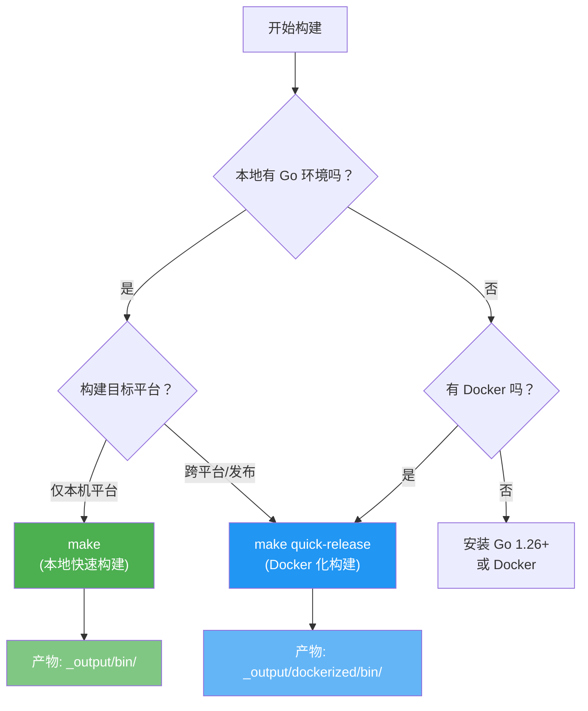
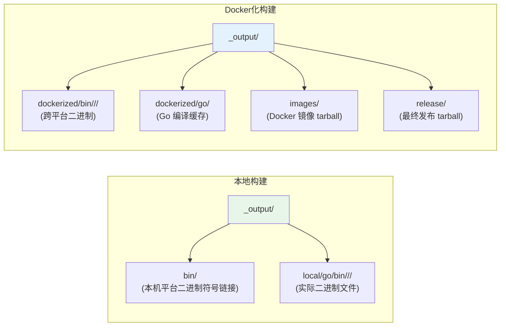
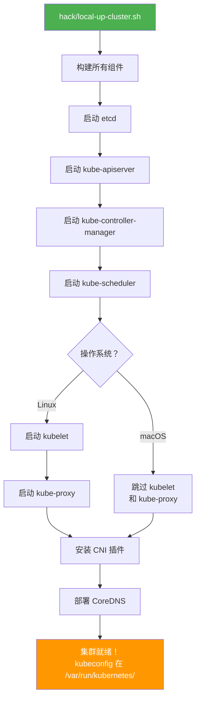
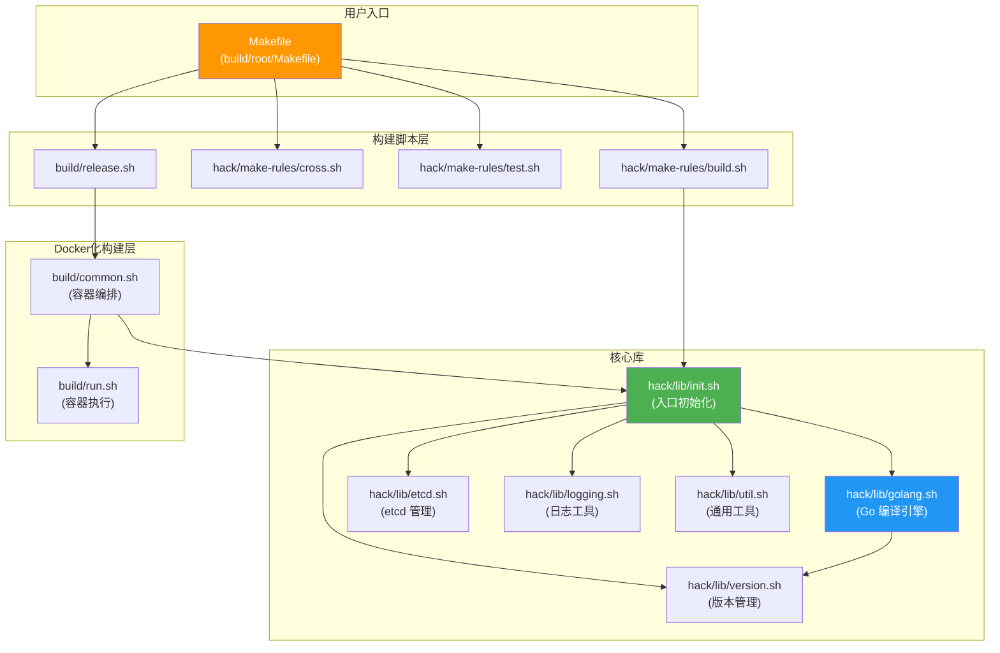

Kubernetes 源码构建体系经过多年迭代，已形成一套高度自动化的 Makefile + Shell 工具链架构。本文将带你从零开始，系统性地掌握环境准备、源码编译、本地集群启动的完整流程——无论你是想阅读源码、调试问题，还是为社区贡献代码，这些技能都是必备的基础。在继续之前，建议先阅读 [项目总览：Kubernetes 源码全景](1-xiang-mu-zong-lan-kubernetes-yuan-ma-quan-jing) 以建立对项目全貌的认知。

Sources: [README.md](README.md#L41-L57), [build/root/Makefile](build/root/Makefile#L27-L31)

## 前置条件与环境准备

构建 Kubernetes 对开发环境有明确要求。这些要求并非随意设定，而是由构建工具链中的版本校验逻辑严格约束的。理解这些前置条件的**来龙去脉**，能帮助你在遇到构建问题时快速定位原因。

### Go 语言版本

Kubernetes 项目的 Go 版本要求由根目录下的 `.go-version` 文件定义，当前版本为 **Go 1.26.2**。构建脚本在启动时会通过 `kube::golang::internal::verify_go_version` 函数进行两重校验：首先读取 `.go-version` 文件确定目标版本，然后检查最低版本约束（当前为 `go1.26`），若本地 Go 版本不足则直接终止构建。值得注意的是，构建系统内置了 **gimme** 工具（位于 `third_party/gimme/`），即使你本机没有安装正确版本的 Go，它也会自动下载并使用匹配的版本——这是通过 Go 1.21+ 引入的 `GOTOOLCHAIN` 机制实现的。

Sources: [.go-version](.go-version#L1-L1), [hack/lib/golang.sh](hack/lib/golang.sh#L521-L583)

### 构建环境要求总览

| 依赖项 | 要求 | 用途 | 说明 |
|--------|------|------|------|
| **Go** | ≥ 1.26 | 编译所有组件 | `.go-version` 定义精确版本，支持自动下载 |
| **Git** | 任意现代版本 | 源码管理与版本注入 | 构建时通过 `git describe` 生成版本号 |
| **Bash** | ≥ 4.2 | 执行构建脚本 | `hack/lib/util.sh` 中有版本检查 |
| **Docker** | 可选，容器化构建所需 | Docker 化构建 | `make quick-release` 等目标需要 |
| **etcd** | 3.6.8 | 本地集群与集成测试 | 可通过 `hack/install-etcd.sh` 自动安装 |
| **磁盘空间** | ≥ 30 GB | 构建产物与缓存 | 跨平台构建需要更多空间 |
| **内存** | ≥ 20 GB（并行构建） | 多平台并行编译 | 低于阈值时自动回退为串行构建 |

Sources: [hack/lib/golang.sh](hack/lib/golang.sh#L312-L313), [hack/lib/etcd.sh](hack/lib/etcd.sh#L19-L19), [hack/install-etcd.sh](hack/install-etcd.sh#L17-L30)

### 安装 etcd（本地集群所需）

如果你计划在本地运行 Kubernetes 集群进行测试，etcd 是必不可少的依赖。Kubernetes 提供了便捷的安装脚本，它会从 GitHub Releases 下载对应平台的 etcd 二进制文件到 `third_party/etcd/` 目录：

```bash
# 安装 etcd（自动检测操作系统和架构）
hack/install-etcd.sh

# 将 etcd 添加到 PATH（脚本会输出需要添加的路径）
export PATH="${PATH}:$(pwd)/third_party/etcd"
```

Sources: [hack/install-etcd.sh](hack/install-etcd.sh#L17-L30), [hack/lib/etcd.sh](hack/lib/etcd.sh#L146-L192)

## 两种构建路径：本地构建 vs Docker 化构建

Kubernetes 提供了两套构建路径，分别适应不同的开发场景。**本地构建**（`make`）直接使用主机上的 Go 工具链编译，适合日常开发迭代；**Docker 化构建**（`make quick-release`）在容器中完成编译，保证环境一致性，适合正式构建和发布。两者的选择取决于你的开发场景和操作系统。



Sources: [README.md](README.md#L41-L57), [build/root/Makefile](build/root/Makefile#L345-L413)

### 路径一：本地 Go 构建

这是最快速的构建方式，直接调用主机上的 Go 编译器。它不会构建 Docker 镜像，也不会跨平台编译——只为你当前操作系统和架构生成二进制文件。

```bash
# 克隆源码
git clone https://github.com/kubernetes/kubernetes
cd kubernetes

# 一键构建（编译所有组件）
make
```

当 `make` 命令执行时，实际调用链如下：Makefile → `hack/make-rules/build.sh` → 加载 `hack/lib/init.sh`（初始化环境变量和工具函数）→ 调用 `kube::golang::setup_env`（配置 GOPATH、GOCACHE、验证 Go 版本）→ 调用 `kube::golang::build_binaries`（执行编译）→ 调用 `kube::golang::place_bins`（将产物放置到正确位置）。整个流程无需人工干预，构建产物最终出现在 `_output/bin/` 目录下。

Sources: [README.md](README.md#L45-L49), [hack/make-rules/build.sh](hack/make-rules/build.sh#L17-L29)

### 路径二：Docker 化构建

Docker 化构建使用官方 `kube-cross` 容器镜像（`registry.k8s.io/build-image/kube-cross`）作为编译环境，通过 bind-mount 将源码目录挂载到容器内。这种方式的优势在于：**环境完全一致**，不依赖主机上安装的任何编译工具链版本。`build/common.sh` 中的 `kube::build::run_build_command_ex` 函数负责编排整个容器化构建流程，包括设置用户权限、挂载源码卷、传递构建参数等。

```bash
# 快速发布构建（仅 linux/amd64，跳过测试）
make quick-release

# 完整发布构建（包含跨平台编译和测试）
make release

# 仅构建发布镜像
make release-images
```

Sources: [build/common.sh](build/common.sh#L358-L473), [build/release.sh](build/release.sh#L32-L42), [build/root/Makefile](build/root/Makefile#L404-L413)

## 核心 Make 目标速查

Kubernetes 的 Makefile（实际入口位于 `build/root/Makefile`，根目录的 `Makefile` 仅一行转发）定义了丰富的构建目标。下表按使用频率排列了最常用的目标，帮助你快速找到所需命令。

| 命令 | 用途 | 产物位置 | 备注 |
|------|------|----------|------|
| `make` | 编译所有组件 | `_output/bin/` | 等同于 `make all`，仅构建本机平台 |
| `make WHAT=cmd/kubectl` | 编译指定组件 | `_output/bin/` | 支持指定多个目标 |
| `make DBG=1` | 调试模式编译 | `_output/bin/` | 禁用优化，保留符号表，配合 delve 使用 |
| `make quick-release` | 快速发布 | `_output/dockerized/` | 仅 linux/amd64，跳过测试 |
| `make release` | 完整发布 | `_output/release/` | 包含所有平台、测试和打包 |
| `make release-images` | 构建容器镜像 | `_output/images/` | 构建 Docker 镜像 |
| `make test` | 运行单元测试 | — | 支持 `WHAT=./pkg/kubelet` 过滤 |
| `make test-integration` | 运行集成测试 | — | 需要 etcd |
| `make verify` | 运行所有代码检查 | — | 提交前必跑 |
| `make clean` | 清理构建产物 | — | 清空 `_output/` |

Sources: [build/root/Makefile](build/root/Makefile#L67-L328), [build/root/Makefile](build/root/Makefile#L345-L437)

### 按组件单独构建

Makefile 为 `cmd/` 目录下的每个组件自动生成了构建目标，你可以直接通过组件名构建：

```bash
# 单独构建 kubelet
make kubelet

# 单独构建 kubectl 和 kube-proxy
make kubectl kube-proxy

# 等价于
make WHAT=cmd/kubelet
make WHAT=cmd/kubectl WHAT=cmd/kube-proxy
```

Sources: [build/root/Makefile](build/root/Makefile#L485-L501)

## 构建产物与目录结构

理解构建产物的组织方式，对于后续的调试和使用至关重要。Kubernetes 构建系统通过 `OUT_DIR` 环境变量（默认为 `_output`）控制输出根目录，内部按构建类型和平台进一步划分。



本地构建和 Docker 化构建使用不同的输出子目录。`_output/bin/` 是一个指向当前平台产物目录的符号链接，方便快速访问。Docker 化构建的产物位于 `_output/dockerized/` 下，按 `linux/amd64`、`linux/arm64` 等平台子目录组织。`hack/lib/init.sh` 定义了这些路径常量：`KUBE_OUTPUT`、`KUBE_OUTPUT_BIN`、`THIS_PLATFORM_BIN` 等。

Sources: [hack/lib/init.sh](hack/lib/init.sh#L42-L46), [build/common.sh](build/common.sh#L62-L70)

### 核心组件二进制一览

以下是 `kube::golang::server_targets` 函数定义的服务端组件，也是构建系统默认编译的核心目标：

| 二进制名称 | 源码路径 | 角色说明 | 链接方式 |
|------------|----------|----------|----------|
| `kube-apiserver` | `cmd/kube-apiserver` | API 入口，集群大脑 | 静态链接 |
| `kube-controller-manager` | `cmd/kube-controller-manager` | 控制器协调循环 | 静态链接 |
| `kube-scheduler` | `cmd/kube-scheduler` | Pod 调度决策 | 静态链接 |
| `kubelet` | `cmd/kubelet` | 节点代理，容器管理 | 静态链接 |
| `kube-proxy` | `cmd/kube-proxy` | 网络代理与负载均衡 | 动态链接（需要 iptables） |
| `kubeadm` | `cmd/kubeadm` | 集群引导工具 | 静态链接 |
| `kubectl` | `cmd/kubectl` | 命令行客户端 | 静态链接（macOS 除外） |

Sources: [hack/lib/golang.sh](hack/lib/golang.sh#L69-L83), [hack/lib/golang.sh](hack/lib/golang.sh#L323-L336)

## 版本信息注入机制

Kubernetes 的版本号不是硬编码的，而是在**编译时**通过 `-ldflags` 动态注入的。`hack/lib/version.sh` 中的 `kube::version::ldflags` 函数是这一机制的核心：它调用 `git describe --tags --match='v*'` 从 Git 标签推导语义化版本号（如 `v1.33.0-alpha.0.6+84c76d1142ea4d`），然后将 `gitCommit`、`gitVersion`、`gitTreeState`、`buildDate` 等信息通过 `-X` 链接器标志注入到 `k8s.io/client-go/pkg/version` 和 `k8s.io/component-base/version` 包中。这就是为什么你可以通过 `kubectl version` 获取精确的构建信息。

Sources: [hack/lib/version.sh](hack/lib/version.sh#L34-L183)

## 本地启动 Kubernetes 集群

构建完成后，下一步自然是验证你的产物是否能正常工作。`hack/local-up-cluster.sh` 脚本可以在单机上启动一个完整的 Kubernetes 控制平面，包括 etcd、API Server、Controller Manager、Scheduler 和 Kubelet（Linux 上默认包含，macOS 上默认不启动 Kubelet 和 Kube-proxy）。这个脚本对**快速验证代码修改**特别有用，无需搭建完整的多节点集群。



```bash
# Linux 上启动完整集群（包含 kubelet）
hack/local-up-cluster.sh

# macOS 上默认跳过 kubelet（可通过 START_MODE 覆盖）
# START_MODE=all hack/local-up-cluster.sh

# 指定自定义参数
ALLOW_PRIVILEGED=true \
FEATURE_GATES="AllAlpha=false" \
DNS_ADDON=coredns \
hack/local-up-cluster.sh

# 集群启动后，另开终端设置 kubeconfig
export KUBECONFIG=/var/run/kubernetes/admin.kubeconfig
kubectl get nodes
```

该脚本的核心行为通过环境变量控制。例如 `START_MODE` 决定启动哪些组件（`all`、`kubeletonly`、`nokubelet`、`nokubeproxy` 等），`FEATURE_GATES` 控制特性门控，`CLUSTER_CIDR` 和 `SERVICE_CLUSTER_IP_RANGE` 定义网络范围。脚本会自动安装 CNI 插件并部署 CoreDNS，使集群具备基本的服务发现能力。

Sources: [hack/local-up-cluster.sh](hack/local-up-cluster.sh#L25-L151)

## 跨平台编译与支持矩阵

Kubernetes 的构建系统支持多种操作系统和 CPU 架构的组合。`hack/lib/golang.sh` 在文件顶部以只读数组的形式定义了所有受支持的平台列表，这些列表被 `kube::golang::setup_platforms` 函数用于确定实际构建目标。

| 类别 | 支持的平台 |
|------|-----------|
| **服务端** | linux/amd64, linux/arm64, linux/s390x, linux/ppc64le |
| **节点** | linux/amd64, linux/arm64, linux/s390x, linux/ppc64le, windows/amd64 |
| **客户端** | linux/amd64, linux/386, linux/arm, linux/arm64, linux/s390x, linux/ppc64le, darwin/amd64, darwin/arm64, windows/amd64, windows/386, windows/arm64 |
| **测试** | linux/amd64, linux/arm64, linux/s390x, linux/ppc64le, darwin/amd64, darwin/arm64, windows/amd64, windows/arm64 |

当你执行 `make`（本地构建）时，构建系统只会为当前主机平台编译。而 `make cross` 或 `make release` 则会编译所有支持的平台。当需要编译多个平台时，`kube::golang::build_binaries` 函数会检查可用内存：若 ≥ 20 GB 则**并行编译**，否则**串行编译**。你可以通过 `KUBE_BUILD_PLATFORMS` 环境变量指定特定平台，或通过 `KUBE_FASTBUILD=true` 仅编译本机架构。

```bash
# 跨平台编译所有目标
make cross

# 仅编译 linux/arm64
KUBE_BUILD_PLATFORMS="linux/arm64" make

# 快速构建（仅本机平台）
KUBE_FASTBUILD=true make
```

Sources: [hack/lib/golang.sh](hack/lib/golang.sh#L23-L66), [hack/lib/golang.sh](hack/lib/golang.sh#L923-L1026)

## 构建系统内部架构

如果你对构建系统内部如何运作感到好奇，下面的架构图揭示了关键模块之间的调用关系。整个构建系统的设计哲学是：**Makefile 作为用户入口，Shell 脚本库作为核心引擎**。



`hack/lib/init.sh` 是整个构建系统的初始化枢纽。它首先设置严格的 shell 错误处理模式（`errexit`、`nounset`、`pipefail`），计算 `KUBE_ROOT`（项目根目录的绝对路径），然后依次加载 `util.sh`（Bash 版本检查等基础工具）、`logging.sh`（日志格式化）、`version.sh`（Git 版本管理）、`golang.sh`（Go 编译核心）和 `etcd.sh`（etcd 安装与管理）。这种分层加载的设计确保了每个模块的职责清晰、依赖关系显式。

Sources: [hack/lib/init.sh](hack/lib/init.sh#L17-L56), [build/common.sh](build/common.sh#L33-L35)

## 常见问题排查

| 症状 | 可能原因 | 解决方案 |
|------|----------|----------|
| `Can't find 'go' in PATH` | 未安装 Go 或版本过低 | 安装 Go ≥ 1.26，或让 gimme 自动下载 |
| `KUBE_GIT_VERSION should be a valid Semantic Version` | Git 标签信息缺失 | 确保从完整克隆构建，非 archive 下载 |
| `etcd version 3.6.8 or greater required` | etcd 版本不匹配 | 运行 `hack/install-etcd.sh` |
| `unable to start etcd as port 2379 is in use` | etcd 端口被占用 | 停止占用 2379 端口的进程 |
| 内存不足导致构建失败 | 多平台并行编译需要 ≥ 20 GB | 设置 `KUBE_FASTBUILD=true` 或增加内存 |
| macOS 上 kubelet 无法启动 | kubelet 不支持 macOS | 使用 Linux 虚拟机或 `START_MODE=nokubelet` |
| `KUBE_GOFLAGS is now deprecated` | 使用了废弃的环境变量 | 改用 `GOFLAGS` 代替 `KUBE_GOFLAGS` |

Sources: [hack/lib/golang.sh](hack/lib/golang.sh#L54-L62), [hack/lib/etcd.sh](hack/lib/etcd.sh#L28-L69), [build/root/Makefile](build/root/Makefile#L54-L62)

## 下一步

掌握了基本的构建流程后，你可以按以下路径深入探索：

1. **理解项目结构**：阅读 [项目目录结构与代码组织](3-xiang-mu-mu-lu-jie-gou-yu-dai-ma-zu-zhi) 了解源码如何组织
2. **开发工作流**：阅读 [开发工作流：构建、测试与代码检查](4-kai-fa-gong-zuo-liu-gou-jian-ce-shi-yu-dai-ma-jian-cha) 学习完整的开发循环
3. **贡献代码**：阅读 [贡献指南与社区规范](5-gong-xian-zhi-nan-yu-she-qu-gui-fan) 了解如何提交 PR
4. **深入构建系统**：阅读 [Hack 脚本与 Makefile 构建体系](29-hack-jiao-ben-yu-makefile-gou-jian-ti-xi) 了解构建系统的高级定制