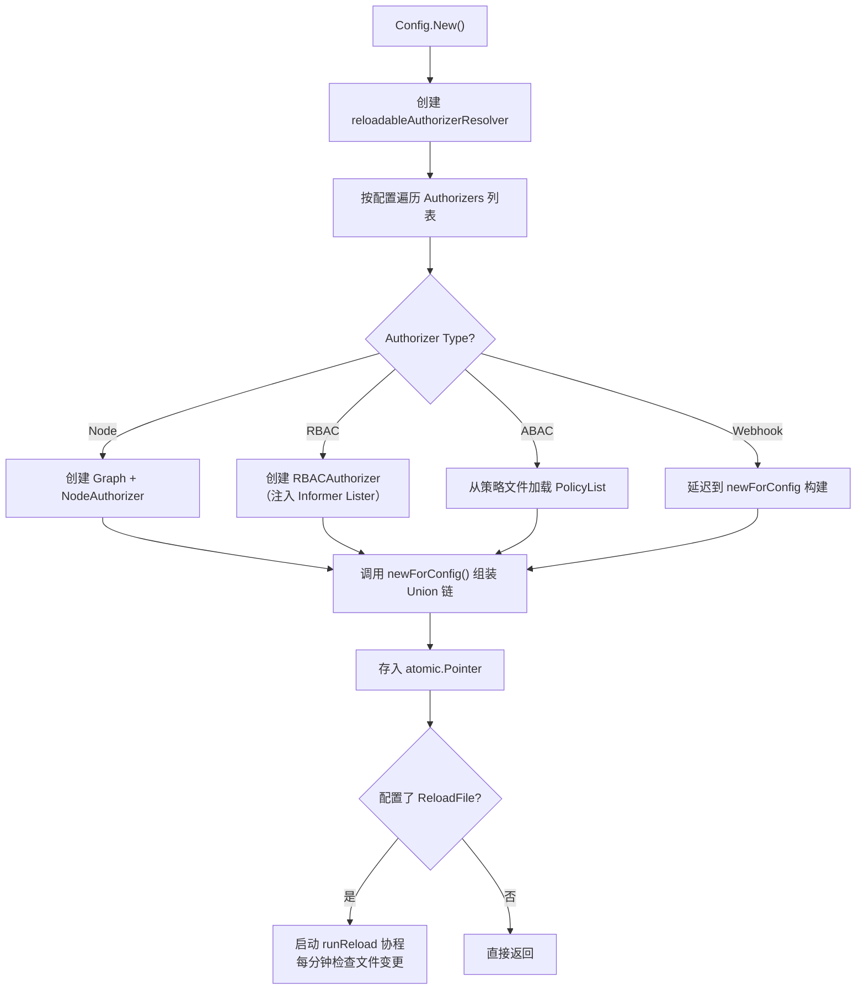
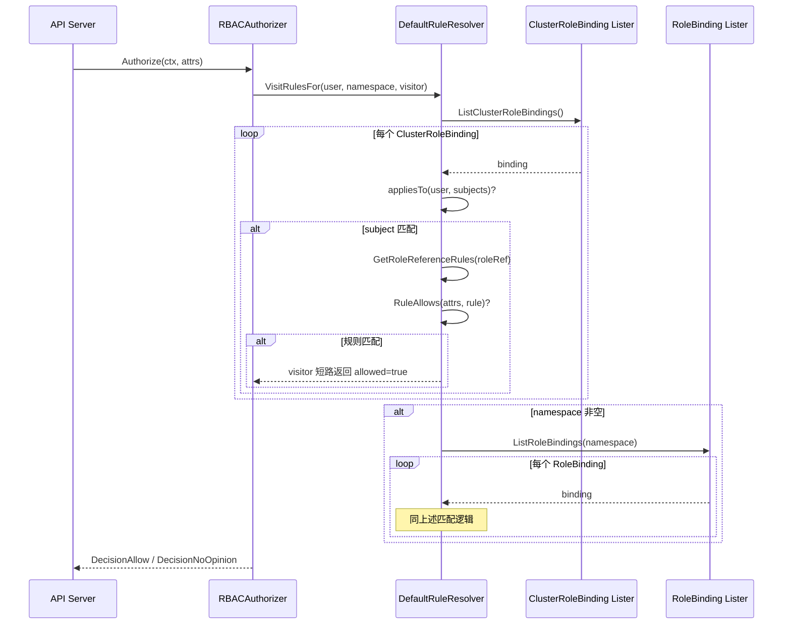
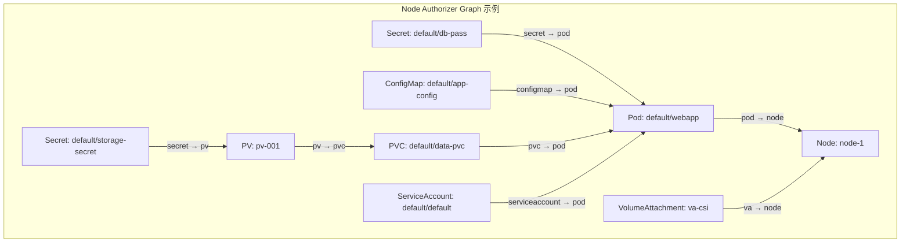
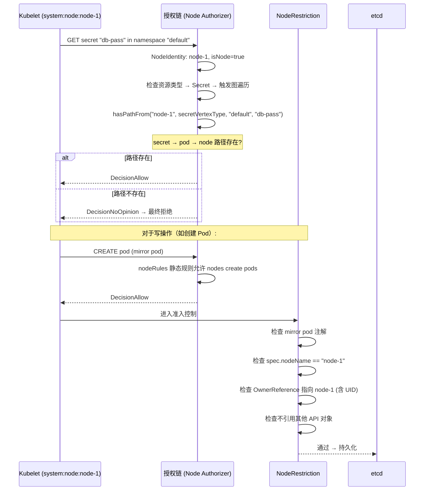
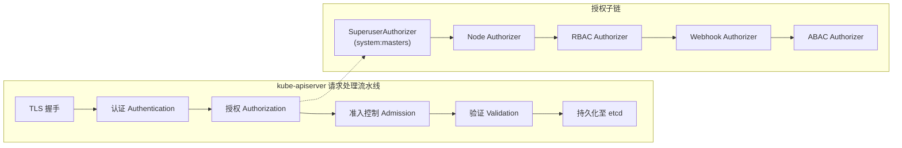

Kubernetes 的安全模型建立在三个层层递进的关卡之上：**认证**（Authentication，确认"你是谁"）、**授权**（Authorization，确认"你能做什么"）和**准入控制**（Admission Control，确认"你能不能这样做"）。本文深入源码层面，剖析 kube-apiserver 中授权链的组装机制、RBAC 授权器的规则匹配算法、Node Authorizer 的图遍历授权模型，以及 NodeRestriction 准入插件如何与 Node Authorizer 协同构成纵深防御体系。

Sources: [modes.go](pkg/kubeapiserver/authorizer/modes/modes.go#L21-L37), [config.go](pkg/controlplane/apiserver/config.go#L245-L274)

## 授权模式全景与链式组装

Kubernetes 支持六种授权模式，定义在 `modes.go` 中。在实际部署中，kube-apiserver 通过 `--authorization-mode` 参数或 `AuthorizationConfiguration` 文件指定一个或多个授权器，它们按声明顺序组成一条**联合授权链**（Union Authorizer Chain）。请求依次经过链上的每个授权器，任何一个返回 `DecisionAllow` 即放行；全部返回 `DecisionNoOpinion` 则最终拒绝。

| 授权模式 | 常量 | 核心用途 |
|---------|------|---------|
| AlwaysAllow | `"AlwaysAllow"` | 全量放行，仅用于测试 |
| AlwaysDeny | `"AlwaysDeny"` | 全量拒绝，仅用于测试 |
| ABAC | `"ABAC"` | 基于属性的访问控制，通过策略文件配置 |
| Webhook | `"Webhook"` | 外部 HTTP 回调授权 |
| RBAC | `"RBAC"` | 基于角色的访问控制，**生产环境标准配置** |
| Node | `"Node"` | 专门限制 Kubelet 的权限范围 |

Sources: [modes.go](pkg/kubeapiserver/authorizer/modes/modes.go#L21-L37)

### 授权器的构建入口

`BuildAuthorizer` 函数位于 `pkg/controlplane/apiserver/config.go`，是 kube-apiserver 构建授权子系统的入口。它将命令行选项转化为 `AuthorizationConfig`，然后委托给 `Config.New()` 方法完成授权器的实例化。值得注意的是，该函数还会检测 RBAC 是否启用，若未启用则跳过 RBAC 相关的后启动钩子（如默认角色的引导 reconciliation）。

```go
// 授权器构建的关键流程
authorizationConfig, err := s.Authorization.ToAuthorizationConfig(versionedInformers)
authorizer, ruleResolver, err := authorizationConfig.New(ctx, apiserverID)
```

Sources: [config.go](pkg/controlplane/apiserver/config.go#L246-L273)

### reloadableAuthorizerResolver：可热加载的授权链

`Config.New()` 的核心产物是 `reloadableAuthorizerResolver`。这个结构体持有一组在初始化阶段创建的授权器实例（RBAC、Node、ABAC），以及一个 `atomic.Pointer` 指向当前的授权链。其设计意图是：**非 Webhook 类型的授权器在启动时一次性创建，而 Webhook 授权器可以在运行时通过配置文件热加载重建**。



`newForConfig` 方法是授权链的实际组装逻辑。它首先插入一个 **超级用户授权器**（`authorizerfactory.NewPrivilegedGroups(user.SystemPrivilegedGroup)`），确保 `system:masters` 组的请求始终放行，随后按配置顺序依次包装并追加各授权器，最终通过 `union.New(authorizers...)` 合并为一条联合链。

Sources: [reload.go](pkg/kubeapiserver/authorizer/reload.go#L50-L180)

### 授权配置的动态重载

当 `ReloadFile` 非空时，`runReload` 协程以一分钟为间隔监控授权配置文件的变更。检测到变化后，它会验证新配置、重建 Webhook 授权器、组装新的联合链，并通过 `atomic.Pointer.Store()` 无锁替换当前授权链。这一机制允许运维在不重启 apiserver 的前提下调整 Webhook 授权配置，但 RBAC、Node、ABAC 类型在启动后不可增删。

Sources: [reload.go](pkg/kubeapiserver/authorizer/reload.go#L191-L254)

## RBAC 授权器：规则匹配的核心引擎

RBAC 是 Kubernetes 生产环境中最核心的授权模式。其授权决策基于四个 API 资源的关联：`Role`（命名空间级规则集合）、`ClusterRole`（集群级规则集合）、`RoleBinding`（命名空间级绑定）和 `ClusterRoleBinding`（集群级绑定）。

### 数据模型

`PolicyRule` 是 RBAC 授权的原子单元，定义了"什么操作在什么资源上被允许"：

| 字段 | 语义 | 示例 |
|------|------|------|
| `Verbs` | 允许的操作动词 | `["get", "list", "watch"]` |
| `APIGroups` | 目标 API 组 | `["", "apps"]` |
| `Resources` | 目标资源类型 | `["pods", "pods/status"]` |
| `ResourceNames` | 可选的资源名白名单 | `["my-config"]` |
| `NonResourceURLs` | 非资源 URL 路径 | `["/healthz", "/metrics"]` |

`Subject` 描述了规则绑定的身份主体，支持 `User`、`Group` 和 `ServiceAccount` 三种类型。`RoleRef` 则是绑定到角色的不可变引用，指向一个 `Role` 或 `ClusterRole`。

Sources: [types.go](pkg/apis/rbac/types.go#L28-L186)

### RBACAuthorizer 的授权流程

`RBACAuthorizer` 的核心逻辑非常简洁：它接收请求属性，通过 `VisitRulesFor` 遍历与请求用户相关的所有 PolicyRule，一旦发现匹配规则即返回允许。



Sources: [rbac.go](plugin/pkg/auth/authorizer/rbac/rbac.go#L75-L127)

### 规则匹配算法

`RuleAllows` 函数将请求属性与单条 `PolicyRule` 进行匹配。对于资源请求，它按顺序检查四个维度：

1. **VerbMatches**：请求动词是否在规则的 `Verbs` 列表中（支持通配符 `*`）
2. **APIGroupMatches**：请求的 API 组是否匹配
3. **ResourceMatches**：请求的资源类型（含子资源）是否匹配
4. **ResourceNameMatches**：若规则指定了 `ResourceNames`，请求的资源名必须在其中

对于非资源请求（如访问 `/healthz`），则只检查动词和 URL 路径匹配。任何一步不匹配即短路返回 `false`。

Sources: [rbac.go](plugin/pkg/auth/authorizer/rbac/rbac.go#L178-L193)

### DefaultRuleResolver：规则解析的骨干

`DefaultRuleResolver` 实现了 `AuthorizationRuleResolver` 接口，负责将用户身份映射到具体的 `PolicyRule` 列表。`VisitRulesFor` 方法的解析顺序是：**先遍历所有 ClusterRoleBinding，再遍历当前命名空间的 RoleBinding**。对于每个绑定，它首先通过 `appliesTo` 检查用户是否匹配绑定的 Subjects（支持 User 精确匹配、Group 成员检查、ServiceAccount 的 `system:serviceaccount:<ns>:<name>` 格式匹配），然后通过 `GetRoleReferenceRules` 解析 RoleRef 指向的 Role 或 ClusterRole，提取其 Rules。

Sources: [rule.go](pkg/registry/rbac/validation/rule.go#L179-L259)

### 权限提升防护

`ConfirmNoEscalation` 函数实现了 RBAC 的权限提升防护。当用户创建或修改 Role/ClusterRole 时，系统会解析该用户当前拥有的所有权限，并与即将授予的权限进行 `Covers` 检查。如果新权限超出当前用户已有范围，操作将被拒绝。这一机制确保用户不能通过 RBAC API 授予自己不具备的权限。

Sources: [rule.go](pkg/registry/rbac/validation/rule.go#L53-L89)

### 引导策略：开箱即用的默认角色

`bootstrappolicy` 包定义了 Kubernetes 集群开箱即用的 ClusterRole 和 ClusterRoleBinding。核心默认角色包括：

| ClusterRole | 用途 | 规则特征 |
|-------------|------|---------|
| `cluster-admin` | 超级管理员 | `*` on `*`（全量通配） |
| `admin` | 命名空间管理员 | 聚合 `aggregate-to-admin` 标签的角色 |
| `edit` | 命名空间编辑者 | 读写命名空间内用户级资源 |
| `view` | 命名空间只读 | 仅读取非敏感资源 |
| `system:discovery` | API 发现 | `GET /api`, `/apis` 等 |
| `system:monitoring` | 监控端点 | `GET /metrics`, `/healthz` 等 |
| `system:basic-user` | 基本用户 | 创建 SelfSubjectAccessReview |

`NodeRules()` 函数则定义了 Kubelet 的基础权限集，包括读写 Node 自身、操作绑定到自身的 Pod、获取相关 Secret/ConfigMap 等。这些规则通过 `NodeAuthorizer` 和 `NodeRestriction` 准入插件进一步细化限制。

Sources: [policy.go](plugin/pkg/auth/authorizer/rbac/bootstrappolicy/policy.go#L199-L292)

## Node Authorizer：基于图遍历的细粒度节点授权

Node Authorizer 是 Kubernetes 安全模型中一个极其精巧的组件。它专门处理来自 Kubelet（用户名格式 `system:node:<nodeName>`，属于 `system:nodes` 组）的请求，通过维护一个**有向无环图（DAG）**来精确限制每个节点只能访问与其调度的 Pod 相关的资源。

### 节点身份识别

`DefaultNodeIdentifier` 实现了 `NodeIdentifier` 接口，其 `NodeIdentity` 方法通过两个条件判定请求是否来自节点：用户名必须以 `system:node:` 为前缀，且用户组中必须包含 `system:nodes`。满足条件时，去除前缀后的部分即为节点名称。

Sources: [default.go](pkg/auth/nodeidentifier/default.go#L42-L66)

### 授权图的数据结构

`Graph` 结构体是 Node Authorizer 的核心数据结构，它使用一个 `DirectedAcyclicGraph` 来维护集群中节点与相关资源之间的关系。图的顶点按类型（`vertexType`）分类：

| 顶点类型 | 对应资源 | 说明 |
|---------|---------|------|
| `nodeVertexType` | Node | 图的汇点，所有边指向 Node |
| `podVertexType` | Pod | 连接 Node 和引用资源 |
| `secretVertexType` | Secret | 被 Pod 引用 |
| `configMapVertexType` | ConfigMap | 被 Pod 引用 |
| `pvcVertexType` | PVC | 被 Pod 引用 |
| `pvVertexType` | PV | 连接 PVC 和 Secret |
| `resourceClaimVertexType` | ResourceClaim | DRA 资源声明 |
| `vaVertexType` | VolumeAttachment | CSI 卷挂载 |
| `serviceAccountVertexType` | ServiceAccount | Pod 的服务账户 |
| `sliceVertexType` | ResourceSlice | DRA 资源切片 |
| `pcrVertexType` | PodCertificateRequest | Pod 证书请求 |

图的边始终**指向 Node**，形成如下关系链：

```
Node ← Pod
Pod ← Secret, ConfigMap, PVC, ServiceAccount, ResourceClaim
PVC ← PV
PV ← Secret
Node ← VolumeAttachment
Node ← ResourceSlice
Node ← PodCertificateRequest
```

Sources: [graph.go](plugin/pkg/auth/authorizer/node/graph.go#L76-L144)

### 图的构建与事件驱动更新

`graphPopulator` 通过 Kubernetes Informer 机制注册事件处理器，实时监听 Pod、PV、VolumeAttachment、ResourceSlice、PodCertificateRequest 等资源的变更，并更新图中的顶点和边。以 `AddPod` 为例：当 Pod 被调度到某个 Node（`spec.nodeName` 非空）后，它会遍历 Pod 中引用的所有 Secret、ConfigMap、PVC、ServiceAccount 和 ResourceClaim，为每个引用创建顶点并建立指向 Pod → Node 的有向边。Mirror Pod 会被特殊处理——出于安全考虑，不对 Mirror Pod 的引用建立边，防止节点通过创建 Mirror Pod 来扩大自己的权限。



Sources: [graph_populator.go](plugin/pkg/auth/authorizer/node/graph_populator.go#L42-L96), [graph.go](plugin/pkg/auth/authorizer/node/graph.go#L360-L436)

### 授权决策流程

`NodeAuthorizer.Authorize()` 方法实现了如下决策逻辑：

1. **非节点请求**：直接返回 `DecisionNoOpinion`，交给链上的其他授权器处理
2. **无法识别的节点**：返回拒绝
3. **敏感资源**（Secret、ConfigMap、PVC、PV、ResourceClaim、VolumeAttachment、ServiceAccount）：通过**图遍历**验证请求对象是否与当前节点存在可达路径
4. **节点自有资源**（Lease、CSINode）：通过名称匹配确保节点只能操作以自己名称命名的对象
5. **其他资源**：回退到静态 `nodeRules` 进行 RBAC 风格的规则匹配

Sources: [node_authorizer.go](plugin/pkg/auth/authorizer/node/node_authorizer.go#L109-L169)

### hasPathFrom：图遍历的性能优化

`hasPathFrom` 方法检查从指定资源顶点到 Node 顶点是否存在有向路径。它采用了**两级优化策略**：

- **目标边索引**（`destinationEdgeIndex`）：对于出度超过阈值（默认 200）的顶点，系统维护一个 `intSet` 索引，直接记录从该顶点可达的所有 Node ID。查询时 O(1) 判定，无需遍历。
- **权威索引快速失败**：对于特定顶点类型（如 Secret、ConfigMap、Pod），若索引存在但不包含目标 Node，可以直接返回"不可达"，跳过 DFS 遍历。
- **DFS 兜底**：仅当索引不可用时，才通过 `VisitingDepthFirst` 执行完整的深度优先搜索，并在遍历过程中过滤只追踪指向目标 Node 的 `destinationEdge`。

Sources: [node_authorizer.go](plugin/pkg/auth/authorizer/node/node_authorizer.go#L499-L554)

### 资源级别的授权细分

Node Authorizer 对不同资源类型有精细化的授权策略：

| 资源 | 允许的操作 | 授权方式 |
|------|-----------|---------|
| Secret | get, list, watch | 图遍历：secret → pod → node |
| ConfigMap | get, list, watch | 图遍历：configmap → pod → node |
| PVC | get | 图遍历：pvc → pod → node |
| PVC/status | update, patch | 图遍历验证关系 |
| PV | get | 图遍历：pv → pvc → pod → node |
| ResourceClaim | get | 图遍历：claim → pod → node |
| VolumeAttachment | get | 图遍历：va → node |
| ServiceAccount | get, create token | 图遍历（需特性门控） |
| Lease | get, create, update, patch, delete | 名称匹配 + 命名空间限制 |
| CSINode | get, create, update, patch, delete | 名称匹配 |
| ResourceSlice | 全操作 | create 放行 + 其他图遍历/fieldSelector |
| Pod | get, list, watch, create, delete | fieldSelector `spec.nodeName=<self>` 或图遍历 |
| Node | get, create, update, patch | 名称匹配（仅自身 Node 对象） |

Sources: [node_authorizer.go](plugin/pkg/auth/authorizer/node/node_authorizer.go#L200-L497)

## ABAC 授权器：遗留的策略文件模式

ABAC（Attribute-Based Access Control）是 Kubernetes 最早的授权模式之一，通过 JSON Lines 格式的策略文件定义访问规则。`NewFromFile` 从文件中逐行读取策略定义，每行通过 `UniversalDecoder` 解码为 `abac.Policy` 对象。授权时对每条策略依次检查主体（用户名/组名）、动词（只读/读写）和目标（资源或非资源路径）是否匹配。

ABAC 存在明显的局限性：策略变更需要重启 apiserver、缺乏细粒度的资源名控制、无法动态绑定。在当前版本中，RBAC 已完全取代 ABAC 成为推荐方案。

Sources: [abac.go](pkg/auth/authorizer/abac/abac.go#L56-L134)

## NodeRestriction 准入插件：与 Node Authorizer 的纵深防御

NodeRestriction 是 Kubernetes 内置准入插件中与 Node Authorizer 配合最紧密的一个。它运行在授权检查之后、对象持久化之前，作为**最后一道防线**，对 Kubelet 的写操作进行语义级别的约束。NodeRestriction 的核心设计原则是：**一个节点只能操作与自身直接相关的对象**。

### 插件初始化与依赖注入

`Plugin` 结构体通过多个 `Wants*` 接口实现依赖注入：`WantsExternalKubeInformerFactory` 提供 Pod/Node/ServiceAccount 的 Lister，`WantsAuthorizer` 提供授权器引用，`WantsFeatures` 注入特性门控状态。这种设计确保准入插件可以基于集群实时状态做出决策。

Sources: [admission.go](plugin/pkg/admission/noderestriction/admission.go#L58-L168)

### 各资源的准入规则

NodeRestriction 的 `Admit` 方法按资源类型分发到不同的处理函数：

**Pod 准入**（`admitPod`）：
- **Create**：只允许创建 Mirror Pod（必须有 `kubernetes.io/config.mirror` 注解），且 `spec.nodeName` 必须等于请求节点名，OwnerReference 必须唯一且指向自身节点（含 UID 验证），不得引用其他 API 对象
- **Delete**：只允许删除 `spec.nodeName` 等于自身的 Pod
- **Status 更新**：只允许更新绑定到自身的 Pod 状态，且不得修改 labels 和 ResourceClaimStatus

**Node 准入**（`admitNode`）：
- **Create**：节点只能创建以自身名称命名的 Node 对象
- **Update**：只允许更新自身 Node 对象，且严格限制可修改的字段（如只能更新特定的标签和注解）

**PVC Status 准入**（`admitPVCStatus`）：只允许更新绑定到自身的 PVC 的 status 子资源。

**Lease 准入**（`admitLease`）：节点只能操作 `kube-node-lease` 命名空间中以自身名称命名的 Lease。

**CSINode 准入**（`admitCSINode`）：节点只能创建或更新以自身名称命名的 CSINode。

**ResourceSlice 准入**（`admitResourceSlice`）：节点的 create 操作中，`nodeName` 字段必须等于自身名称。

Sources: [admission.go](plugin/pkg/admission/noderestriction/admission.go#L183-L393)

### Node Authorizer + NodeRestriction 的协作模式

这两个组件形成了一个**纵深防御**体系。以 Kubelet 获取 Secret 为例：



**Node Authorizer 负责读操作的图遍历授权，NodeRestriction 负责写操作的语义约束**，二者共同确保即使 Kubelet 的凭据泄露，攻击者也只能访问被调度到该节点的 Pod 所引用的有限资源集。

## 授权链在 API Server 请求处理中的位置



授权阶段位于认证之后、准入控制之前。联合授权链中，`SuperuserAuthorizer` 始终排在首位，为 `system:masters` 组提供无条件放行。随后按配置顺序依次执行，任何授权器返回 `DecisionAllow` 即短路通过。若全部返回 `DecisionNoOpinion`，请求被拒绝（Kubernetes 授权默认拒绝）。

Sources: [reload.go](pkg/kubeapiserver/authorizer/reload.go#L87-L179)

## 关键源码路径索引

| 功能模块 | 源码路径 |
|---------|---------|
| 授权模式定义 | [modes.go](pkg/kubeapiserver/authorizer/modes/modes.go) |
| 授权器构建与热加载 | [reload.go](pkg/kubeapiserver/authorizer/reload.go) |
| 授权器配置入口 | [config.go](pkg/kubeapiserver/authorizer/config.go) |
| RBAC 授权器 | [rbac.go](plugin/pkg/auth/authorizer/rbac/rbac.go) |
| RBAC Subject 定位 | [subject_locator.go](plugin/pkg/auth/authorizer/rbac/subject_locator.go) |
| RBAC 规则解析 | [rule.go](pkg/registry/rbac/validation/rule.go) |
| RBAC 引导策略 | [policy.go](plugin/pkg/auth/authorizer/rbac/bootstrappolicy/policy.go) |
| RBAC API 类型 | [types.go](pkg/apis/rbac/types.go) |
| Node Authorizer | [node_authorizer.go](plugin/pkg/auth/authorizer/node/node_authorizer.go) |
| Node 授权图 | [graph.go](plugin/pkg/auth/authorizer/node/graph.go) |
| 图事件填充器 | [graph_populator.go](plugin/pkg/auth/authorizer/node/graph_populator.go) |
| 节点身份识别 | [default.go](pkg/auth/nodeidentifier/default.go) |
| NodeRestriction 准入 | [admission.go](plugin/pkg/admission/noderestriction/admission.go) |
| ABAC 授权器 | [abac.go](pkg/auth/authorizer/abac/abac.go) |
| APIServer 授权构建 | [config.go](pkg/controlplane/apiserver/config.go) |

## 延伸阅读

- 认证机制的具体实现（Token、X.509 证书、Bootstrap Token 等）请参阅 [API Server 启动流程与请求处理链路](7-api-server-qi-dong-liu-cheng-yu-qing-qiu-chu-li-lian-lu)
- 服务账户令牌的签发与 JWT 结构请参阅 [服务账户令牌管理与 JWT 签发](21-fu-wu-zhang-hu-ling-pai-guan-li-yu-jwt-qian-fa)
- Webhook 授权器的具体配置与 CEL 匹配条件属于 `apiserver` 库实现，不在本仓库核心路径中