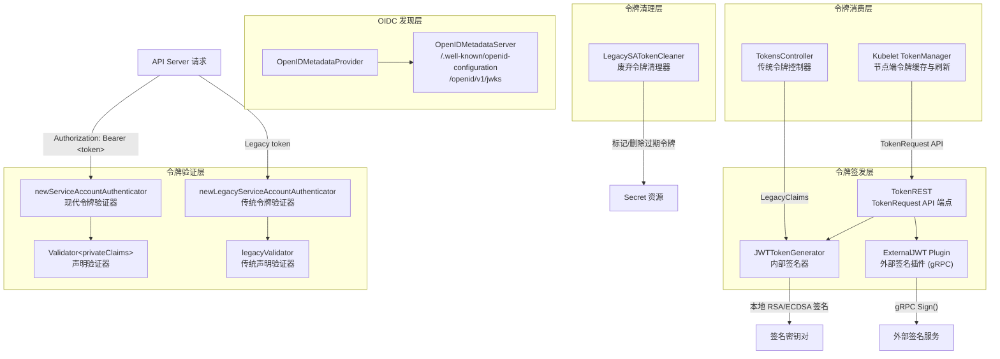
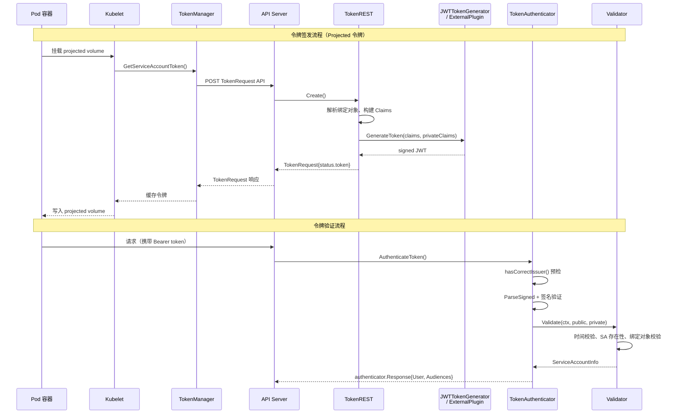

Kubernetes 服务账户（ServiceAccount）令牌系统是集群身份认证的核心基础设施。本文档深入剖析令牌从签发到验证的完整生命周期，涵盖 JWT 生成器、TokenRequest API、令牌验证器、外部签名插件、OIDC 发现机制等关键模块。理解这套体系是掌握 [认证与授权机制（RBAC、Node Authorizer、准入控制）](20-ren-zheng-yu-shou-quan-ji-zhi-rbac-node-authorizer-zhun-ru-kong-zhi) 中身份认证环节的必备前提。

Sources: [jwt.go](pkg/serviceaccount/jwt.go#L1-L57), [claims.go](pkg/serviceaccount/claims.go#L1-L68)

## 架构总览

Kubernetes 服务账户令牌系统由三个核心维度构成：**令牌签发**（谁生成令牌）、**令牌验证**（谁验证令牌合法性）、**令牌生命周期管理**（谁管理令牌的创建、刷新与清理）。下图展示了这些组件之间的协作关系：



Sources: [config.go](pkg/kubeapiserver/authenticator/config.go#L141-L154), [token.go](pkg/registry/core/serviceaccount/storage/token.go#L82-L257)

## 两种令牌体系：Legacy 与 Projected

Kubernetes 服务账户令牌经历了从 **Legacy 静态令牌** 到 **Projected 动态令牌** 的演进。两种令牌体系在数据结构、验证逻辑和安全特性上存在根本性差异。

| 维度 | Legacy 令牌（传统） | Projected 令牌（投影） |
|------|---------------------|----------------------|
| **存储方式** | 以 Secret 资源形式持久存储于 etcd | 不持久存储，由 Kubelet 按需向 TokenRequest API 请求 |
| **颁发者（iss）** | `kubernetes/serviceaccount` | 用户配置的 issuer URL（如 `https://kubernetes.default.svc.cluster.local`） |
| **有效期** | 无过期时间，永久有效 | 由 `ExpirationSeconds` 控制，默认 3600 秒 |
| **绑定对象** | 仅绑定 Secret 本身 | 可绑定 Pod、Node、Secret 等对象 |
| **受众多感知** | 无 audience 声明，仅允许 API Server 受众 | 支持自定义 audience |
| **验证逻辑** | 比对 Secret 中的令牌值 | 验证 JWT 签名和声明 |
| **废弃状态** | 自动生成的令牌计划废弃（v1.33+） | 推荐使用 |
| **控制器** | `TokensController` | `TokenManager`（Kubelet 端） |

Sources: [legacy.go](pkg/serviceaccount/legacy.go#L42-L63), [claims.go](pkg/serviceaccount/claims.go#L70-L130)

## JWT 令牌生成器

**JWTTokenGenerator** 是令牌签发的核心引擎，负责将声明（Claims）编码为签名的 JWT 令牌。它通过 `go-jose` 库支持三种签名密钥类型：

**RSA 签名**（RS256）：将 RSA 私钥包装为 JOSE JWK，设置 `alg: RS256`。Key ID 由公钥的 DER 编码经 SHA-256 哈希后再 Base64URL 编码得到，确保不可逆——攻击者无法从 Key ID 反推出实际密钥。

**ECDSA 签名**（ES256/ES384/ES512）：根据椭圆曲线参数自动选择算法——P256 对应 ES256、P384 对应 ES384、P521 对应 ES512。

**OpaqueSigner**：支持外部签名器的抽象接口，允许密钥材料不暴露给 API Server 进程，是外部 JWT 签名插件的基础。

令牌的实际序列化由共享函数 `GenerateToken` 完成，它采用反向优先级合并声明：先应用私有声明，再覆盖公共声明（如 `exp`、`aud`），最后强制设置 `iss` 为颁发者 URL。这种设计确保公共声明始终优先于同名的私有声明。

Sources: [jwt.go](pkg/serviceaccount/jwt.go#L59-L112), [jwt.go](pkg/serviceaccount/jwt.go#L442-L453)

## JWT Claims 结构

现代 Projected 令牌的 Claims 分为 **公共声明**（RFC 7519 标准字段）和 **私有声明**（Kubernetes 自定义字段）两个层级。

公共声明（`jwt.Claims`）包含：

| 字段 | 含义 | 来源 |
|------|------|------|
| `iss` | 颁发者 URL | API Server `--service-account-issuer` 配置 |
| `sub` | 主题标识 | `system:serviceaccount:<namespace>:<name>` |
| `aud` | 受众 | TokenRequest 中指定，或默认为 API Server 受众 |
| `exp` | 过期时间 | `issuedAt + ExpirationSeconds` |
| `iat` | 签发时间 | 当前时间 |
| `nbf` | 生效时间 | 与 `iat` 相同 |
| `jti` | 令牌唯一标识 | UUID v4（需启用 `ServiceAccountTokenJTI` 特性门控） |

私有声明（`privateClaims`）嵌套在 `kubernetes.io` 键下：

```
{
  "kubernetes.io": {
    "namespace": "default",
    "serviceaccount": { "name": "my-sa", "uid": "..." },
    "pod": { "name": "my-pod", "uid": "..." },           // 可选，Pod 绑定
    "secret": { "name": "my-secret", "uid": "..." },     // 可选，Secret 绑定
    "node": { "name": "node-1", "uid": "..." },           // 可选，Node 绑定
    "warnafter": 1234567890                                // 可选，告警阈值
  }
}
```

其中 `warnafter` 字段专门用于 Projected 令牌的安全过渡机制：当令牌的 TTL 为 `WarnOnlyBoundTokenExpirationSeconds`（3607 秒）且绑定到 Pod 时，系统自动将实际过期时间延长至 `ExpirationExtensionSeconds`（约 365 天），但在原始请求过期时间到达后触发告警，引导用户感知并迁移到更短的 TTL。

Sources: [claims.go](pkg/serviceaccount/claims.go#L37-L130), [claims.go](pkg/serviceaccount/claims.go#L265-L292)

## TokenRequest API 端点

`TokenREST` 是 API Server 中处理 `POST /api/v1/namespaces/{namespace}/serviceaccounts/{name}/token` 请求的 REST 子资源。其 `Create` 方法实现了令牌签发的完整流程：

1. **验证请求**：校验 namespace 和 name 与 URL 匹配，查找 ServiceAccount 确认存在且 UID 一致
2. **解析绑定对象**：根据 `BoundObjectRef` 的 `APIVersion` 和 `Kind`，分别获取 Pod、Node 或 Secret 对象，验证 UID 一致性
3. **处理过期时间**：若请求的 `ExpirationSeconds` 超过 `maxExpirationSeconds` 则截断；若启用了 `extendExpiration` 且绑定 Pod，则触发安全过渡机制
4. **构建声明**：调用 `token.Claims()` 构建公共和私有声明
5. **签名令牌**：调用 `issuer.GenerateToken()` 使用 JWTTokenGenerator 或外部插件签名
6. **返回响应**：将签名后的 JWT 令牌填入 `TokenRequestStatus` 返回

对于 Pod 绑定令牌，当启用 `ServiceAccountTokenPodNodeInfo` 特性时，还会自动嵌入 Pod 所在 Node 的名称和 UID 到令牌声明中，为审计和安全策略提供更丰富的上下文。

Sources: [token.go](pkg/registry/core/serviceaccount/storage/token.go#L59-L257)

## 令牌验证器

API Server 的认证链中注册了两个服务账户令牌验证器，分别处理传统令牌和现代令牌。

### 现代令牌验证器

`newServiceAccountAuthenticator` 创建的验证器使用 `Validator[privateClaims]`，验证流程为：

1. **预检颁发者**：从 JWT 的未验证 payload 中提取 `iss` 字段，快速判断是否匹配已知颁发者（避免不必要的签名验证开销）
2. **解析签名**：通过 `jwt.ParseSigned` 解析 JWT，根据 `kid` 头部从 `PublicKeysGetter` 获取对应的公钥
3. **验证签名**：遍历所有匹配的公钥尝试解密声明，直到找到一个成功的
4. **二次颁发者校验**：在签名验证通过后再次确认 `iss` 字段（防止签名验证绕过）
5. **受众匹配**：令牌受众与请求受众取交集，交集为空则拒绝
6. **声明验证**：调用 `validator.Validate()` 执行领域特定验证

`Validate` 方法执行以下深度校验：检查令牌是否过期（`jwt.Expired`）、是否生效（`NotValidYet`）；确认 ServiceAccount 存在且 UID 匹配；若令牌绑定了 Secret/Pod/Node，确认这些对象仍然存在且 UID 匹配；检查 `warnafter` 字段判断是否为过期令牌并触发指标记录。

Sources: [jwt.go](pkg/serviceaccount/jwt.go#L316-L412), [claims.go](pkg/serviceaccount/claims.go#L132-L292)

### 传统令牌验证器

`newLegacyServiceAccountAuthenticator` 处理 `iss: kubernetes/serviceaccount` 的旧式令牌。与现代验证器的关键区别在于：

- 使用 `legacyPrivateClaims` 结构体，字段名以 `kubernetes.io/serviceaccount/` 为前缀
- 当 `lookup` 为 true 时，从 etcd 获取对应的 Secret，使用 `subtle.ConstantTimeCompare` 比对令牌值
- 自动为自动生成的令牌添加 `kubernetes.io/legacy-token-last-used` 标签以追踪使用情况
- 检测 `kubernetes.io/legacy-token-invalid-since` 标签，拒绝已被标记为无效的令牌
- 对自动生成的令牌添加 `Warning` 头部，引导用户迁移至 TokenRequest API

Sources: [legacy.go](pkg/serviceaccount/legacy.go#L65-L181), [config.go](pkg/kubeapiserver/authenticator/config.go#L379-L391)

## TokensController：传统令牌管理

`TokensController` 负责管理传统 Secret 挂载的服务账户令牌。它同时监听 ServiceAccount 和 Secret 资源的变化，使用两个独立的工作队列：

- **syncServiceAccountQueue**：处理 ServiceAccount 变更事件。当 ServiceAccount 被删除时，删除所有关联的令牌 Secret
- **syncSecretQueue**：处理 Secret 变更事件。当 Secret 对应的 ServiceAccount 不存在时删除 Secret；当 Secret 缺少令牌数据时生成令牌并写入

令牌生成逻辑位于 `generateTokenIfNeeded`：它从 Informer 缓存获取最新 Secret，检查是否需要补充 CA 数据、namespace 数据或令牌数据。若需要令牌，调用 `serviceaccount.LegacyClaims` 构建声明，再通过 `TokenGenerator.GenerateToken` 签发，最终更新 Secret。

Sources: [tokens_controller.go](pkg/controller/serviceaccount/tokens_controller.go#L55-L163), [tokens_controller.go](pkg/controller/serviceaccount/tokens_controller.go#L381-L449)

## Kubelet TokenManager：节点端令牌缓存

Kubelet 通过 `TokenManager` 为 Pod 的 Projected ServiceAccountToken 卷提供令牌获取与自动刷新能力。Manager 维护一个内存缓存（`map[string]*TokenRequest`），键由 namespace、name、audience、expirationSeconds 和 boundObjectRef 组合而成。

核心方法 `GetServiceAccountToken` 实现了经典的缓存-刷新模式：

1. 检查缓存是否存在对应令牌
2. 若存在且不需要刷新，直接返回
3. 若需要刷新，调用 `TokenRequest API` 获取新令牌
4. 刷新失败时，若旧令牌未过期则继续使用（优雅降级）
5. 刷新失败且旧令牌已过期，返回错误

刷新判断策略（`requiresRefresh`）采用双重阈值：当令牌已使用超过 80% 的 TTL 或已使用超过 24 小时（加入随机抖动）时触发刷新。这确保了令牌在过期前有充足的时间窗口完成续期。

后台 GC 协程每分钟扫描一次缓存，清理已过期的令牌条目。

Sources: [token_manager.go](pkg/kubelet/token/token_manager.go#L46-L195)

## 外部 JWT 签名插件

`ExternalServiceAccountTokenSigner` 特性门控（v1.32 Alpha → v1.34 Beta → v1.36 GA）允许将 JWT 签名操作委托给外部服务，实现密钥材料与 API Server 的物理隔离。

### Plugin 架构

`Plugin` 通过 Unix 域套接字与外部签名服务建立 gRPC 连接，实现 `TokenGenerator` 接口。`GenerateToken` 方法的流程为：

1. 调用 `mergeClaims` 将公共和私有声明序列化为 JSON（复用 `serviceaccount.GenerateToken` 的合并逻辑，确保内部与外部签名的声明格式一致）
2. 将 JSON payload 进行 Base64URL 编码
3. 通过 gRPC 调用 `SignJWTRequest` 发送到外部签名服务
4. 验证返回的 JWT Header（算法必须为 RS256/ES256/ES384/ES512、类型为 JWT、Key ID 非空且不超过 1KB）
5. 若 `allowSigningWithNonOIDCKeys` 为 false，检查签名密钥是否已被排除出 OIDC 发现文档
6. 拼接 `header.payload.signature` 返回完整 JWT

### KeyCache 密钥缓存

`keyCache` 维护外部签名服务提供的验证公钥集合，支持：

- **初始填充**（`initialFill`）：启动时同步获取一次密钥
- **定时同步**（`scheduleSync`）：根据外部服务返回的 `RefreshHintSeconds` 设置定时器，动态调整刷新间隔
- **按需同步**（`GetPublicKeys`）：当收到未知 `kid` 的令牌时，立即触发同步
- **变更广播**：当密钥集合发生变化时（时间戳、密钥数量、Key ID 顺序或 OIDC 排除标志），通知所有监听者（如 OpenIDMetadataProvider）

Sources: [plugin.go](pkg/serviceaccount/externaljwt/plugin/plugin.go#L52-L219), [keycache.go](pkg/serviceaccount/externaljwt/plugin/keycache.go#L37-L252)

## OIDC 发现机制

Kubernetes API Server 内置 OIDC Provider 功能，通过两个端点发布公钥信息，使外部系统能够验证服务账户令牌：

- **`/.well-known/openid-configuration`**：OIDC Provider 配置文档，包含 `issuer`、`jwks_uri`、`id_token_signing_alg_values_supported` 等字段
- **`/openid/v1/jwks`**：JSON Web Key Set，包含所有用于签名验证的公钥（JWK 格式）

`OpenIDMetadataProvider` 使用 `atomic.Pointer` 实现无锁读写分离：公钥变更时，通过 `Listener` 机制触发 `Update()` 方法重新渲染 JSON 文档，原子性地替换缓存。HTTP 响应设置 `Cache-Control: public, max-age=<seconds>` 头部，max-age 由 `PublicKeysGetter.GetCacheAgeMaxSeconds()` 决定——静态密钥为 3600 秒，外部插件为下次刷新间隔。

`PublicKey` 结构体中的 `ExcludeFromOIDCDiscovery` 字段允许某些密钥仅用于验证已签发的旧令牌，而不出现在 JWKS 端点中，支持密钥轮换场景。

Sources: [openidmetadata.go](pkg/serviceaccount/openidmetadata.go#L37-L196), [openidmetadata.go](pkg/routes/openidmetadata.go#L46-L114)

## 令牌清理与废弃管理

`LegacySATokenCleaner` 负责清理不再使用的传统自动生成令牌。其 `evaluateSATokens` 方法的清理策略为：

1. 获取 Secret 列表，筛选 `SecretTypeServiceAccountToken` 类型的 Secret
2. 跳过创建时间晚于 `now - CleanUpPeriod` 的 Secret（新创建的令牌给予观察期）
3. 检查 `kubernetes.io/legacy-token-last-used` 标签：若最近使用时间在保留期内则跳过
4. 验证 Secret 仍被 ServiceAccount 的 `.secrets` 列表引用（仅清理自动生成的令牌）
5. 检查 Secret 是否仍被 Pod 挂载使用（遍历 Pod 的卷引用）
6. 若 Secret 不满足保留条件，首先标记 `kubernetes.io/legacy-token-invalid-since` 为当天日期
7. 标记后再次评估时，若仍无人使用且已超过 `CleanUpPeriod`，则删除 Secret

这种两阶段清理（先标记无效，再延迟删除）为消费者提供了充足的迁移时间窗口。

Sources: [legacy_serviceaccount_token_cleaner.go](pkg/controller/serviceaccount/legacy_serviceaccount_token_cleaner.go#L57-L288)

## 特性门控矩阵

以下特性门控控制服务账户令牌系统的行为：

| 特性门控 | 版本轨迹 | 状态 | 说明 |
|----------|----------|------|------|
| `ServiceAccountTokenJTI` | 1.29α → 1.30β → 1.32 GA | **GA** | 在令牌中嵌入 JTI（UUID），记录到审计日志 |
| `ServiceAccountTokenNodeBinding` | 1.29α → 1.31β → 1.33 GA | **GA** | 允许将令牌绑定到 Node 对象 |
| `ServiceAccountTokenNodeBindingValidation` | 1.29α → 1.30β → 1.32 GA | **GA** | 验证令牌中的 Node 声明 |
| `ServiceAccountTokenPodNodeInfo` | 1.29α → 1.30β → 1.32 GA | **GA** | Pod 绑定令牌中嵌入 Node 信息 |
| `ExternalServiceAccountTokenSigner` | 1.32α → 1.34β → 1.36 GA | **GA** | 支持外部 JWT 签名服务 |

Sources: [kube_features.go](pkg/features/kube_features.go#L996-L1020), [kube_features.go](pkg/features/kube_features.go#L1468-L1472), [kube_features.go](pkg/features/kube_features.go#L1964-L1986)

## 可观测性指标

`pkg/serviceaccount/metrics.go` 注册了以下 Prometheus 指标用于监控令牌使用状况：

| 指标名 | 类型 | 含义 |
|--------|------|------|
| `serviceaccount_legacy_tokens_total` | Counter | 传统令牌使用总数 |
| `serviceaccount_stale_tokens_total` | Counter | 超过 `warnafter` 阈值的 Projected 令牌使用总数 |
| `serviceaccount_valid_tokens_total` | Counter | 有效 Projected 令牌使用总数 |
| `serviceaccount_legacy_manual_token_uses_total` | Counter | 手动创建的 Secret 令牌使用总数 |
| `serviceaccount_legacy_auto_token_uses_total` | Counter | 自动生成的 Secret 令牌使用总数 |
| `serviceaccount_invalid_legacy_auto_token_uses_total` | Counter | 被标记无效的自动生成令牌使用总数 |

通过 `stale_tokens_total` 与 `valid_tokens_total` 的比率可以评估集群中 Projected 令牌的健康度；通过 `legacy_auto_token_uses_total` 的增长趋势可以评估传统令牌迁移进度。

Sources: [metrics.go](pkg/serviceaccount/metrics.go#L28-L102)

## 组件交互总览



Sources: [token_manager.go](pkg/kubelet/token/token_manager.go#L104-L131), [token.go](pkg/registry/core/serviceaccount/storage/token.go#L82-L257), [jwt.go](pkg/serviceaccount/jwt.go#L334-L412)

## 下一步阅读

本文档聚焦于服务账户令牌的签发与验证机制。令牌验证成功后生成的用户身份信息将进入授权阶段，由 RBAC、Node Authorizer 等模块决定是否放行请求。建议继续阅读 [认证与授权机制（RBAC、Node Authorizer、准入控制）](20-ren-zheng-yu-shou-quan-ji-zhi-rbac-node-authorizer-zhun-ru-kong-zhi) 了解令牌在完整请求链路中的角色。对于节点级别的证书与令牌引导流程，可参考 [kubeadm 集群引导与证书管理](23-kubeadm-ji-qun-yin-dao-yu-zheng-shu-guan-li)。关于整体特性门控的生命周期管理机制，参见 [特性门控系统与功能生命周期管理](28-te-xing-men-kong-xi-tong-yu-gong-neng-sheng-ming-zhou-qi-guan-li)。