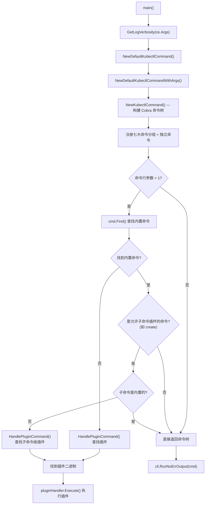
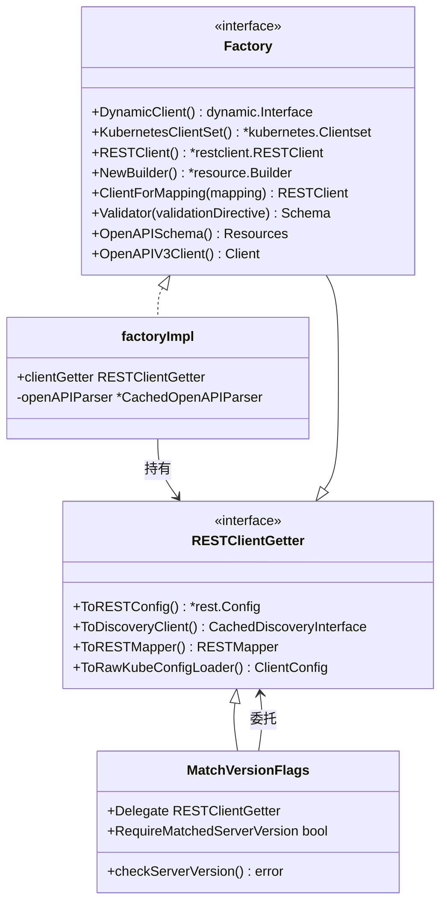
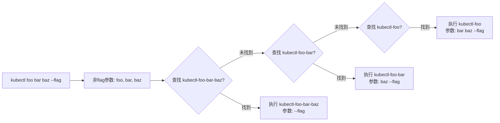

**kubectl** 是 Kubernetes 生态中与集群交互的核心命令行工具。它不仅承载了数十个子命令（get、apply、create、delete 等），还通过一套精心设计的**插件机制**允许开发者以二进制可执行文件的形式扩展其功能。本文将从源码层面剖析 kubectl 的命令行架构——从程序入口到 Cobra 命令树的构建，从 Factory 工厂模式到插件发现与执行的完整链路——帮助你理解这个每天被数百万开发者使用的工具是如何在代码层面组织起来的。

Sources: [kubectl.go](cmd/kubectl/kubectl.go#L31-L44)

---

## 程序入口：从 main() 到命令构建

kubectl 的程序入口位于 `cmd/kubectl/kubectl.go`，整体逻辑极为精简。`main()` 函数只做三件事：设置日志 verbosity 级别、构建默认 kubectl 命令、然后通过 `cli.RunNoErrOutput` 执行该命令并将错误交给 `util.CheckErr` 统一处理。

```go
func main() {
    logs.GlogSetter(cmd.GetLogVerbosity(os.Args))
    command := cmd.NewDefaultKubectlCommand()
    if err := cli.RunNoErrOutput(command); err != nil {
        util.CheckErr(err)
    }
}
```

这里有一个值得注意的设计细节：**日志级别必须在命令构建之前解析**。因为在构建 kubectl 命令的过程中（包括加载插件和解析 `.kuberc` 文件）就需要使用 klog 输出日志，而 Cobra 的 flag 解析（包括 `-v` 参数）要到 `cli.RunNoErrOutput` 内部才执行。因此 `GetLogVerbosity` 函数手动遍历 `os.Args` 来提前提取 `-v` 参数值。

Sources: [kubectl.go](cmd/kubectl/kubectl.go#L31-L44), [cmd.go](staging/src/k8s.io/kubectl/pkg/cmd/cmd.go#L453-L474)

---

## 命令树构建：Cobra 框架与命令分组

kubectl 基于 **spf13/cobra** 库构建命令树。核心函数 `NewKubectlCommand` 创建根命令并注册所有子命令，按照功能语义组织为 **七大命令分组**，这些分组直接决定了 `kubectl --help` 的输出结构：

| 命令分组 | 包含命令 | 用途定位 |
|---------|---------|---------|
| Basic Commands (Beginner) | create, expose, run, set | 初学者最常用的资源操作 |
| Basic Commands (Intermediate) | explain, get, edit, delete | 中级用户的日常操作 |
| Deploy Commands | rollout, scale, autoscale | 部署与伸缩管理 |
| Cluster Management Commands | certificate, clusterinfo, top, cordon, uncordon, drain, taint | 集群运维管理 |
| Troubleshooting and Debugging | describe, logs, attach, exec, port-forward, proxy, cp, auth, debug, events | 故障排查与调试 |
| Advanced Commands | diff, apply, patch, replace, wait, kustomize | 高级资源操作 |
| Settings Commands | label, annotate, completion | 元数据与配置管理 |

下面是 kubectl 命令构建与插件查找的整体流程：



Sources: [cmd.go](staging/src/k8s.io/kubectl/pkg/cmd/cmd.go#L96-L162)

---

## KubectlOptions：命令行为的配置入口

`KubectlOptions` 结构体是 kubectl 命令行为的配置核心，它承载了四个关键组成部分：

```go
type KubectlOptions struct {
    PluginHandler PluginHandler                       // 插件查找与执行处理器
    Arguments     []string                            // 原始命令行参数（os.Args）
    ConfigFlags   *genericclioptions.ConfigFlags      // kubeconfig 相关标志位
    genericiooptions.IOStreams                            // 标准输入/输出/错误流
}
```

`NewDefaultKubectlCommand` 使用默认值填充这些选项：`ConfigFlags` 配置了 discovery burst 为 300、QPS 为 50.0 以加速 API 发现；`PluginHandler` 使用 `NewDefaultPluginHandler` 创建默认插件处理器，其 `ValidPrefixes` 为 `["kubectl"]`，意味着所有以 `kubectl-` 开头的可执行文件都会被识别为插件。

Sources: [cmd.go](staging/src/k8s.io/kubectl/pkg/cmd/cmd.go#L83-L104)

---

## Factory 模式：命令与 Kubernetes API 的桥梁

每个 kubectl 子命令都需要与 Kubernetes API Server 通信，而 **Factory 接口** 就是这种通信的统一抽象层。它定义在 `pkg/cmd/util/factory.go` 中，提供了客户端创建、资源构建、OpenAPI schema 获取等核心能力。



Factory 的设计采用了**分层委托**（ring-based delegation）模式：`MatchVersionFlags` 包装了基础的 `ConfigFlags`，在每次获取客户端配置时先检查 `--match-server-version` 要求是否满足；而 `factoryImpl` 则持有这个包装后的 getter，并在此基础上提供更高级的功能（动态客户端、typed 客户端、资源验证器等）。这种层层委托的架构让每个子命令只需要接收一个 `Factory` 参数即可获得所有 API 交互能力，而无需关心底层的配置加载和版本匹配逻辑。

Sources: [factory.go](staging/src/k8s.io/kubectl/pkg/cmd/util/factory.go#L41-L72), [factory_client_access.go](staging/src/k8s.io/kubectl/pkg/cmd/util/factory_client_access.go#L41-L60), [kubectl_match_version.go](staging/src/k8s.io/kubectl/pkg/cmd/util/kubectl_match_version.go#L40-L110)

---

## 子命令的统一构造模式

kubectl 的每个子命令都遵循一套高度一致的构造模式。以 `get` 命令为例，其构造函数 `NewCmdGet` 接收两个核心参数：`cmdutil.Factory`（API 交互能力）和 `genericiooptions.IOStreams`（I/O 流）。命令的 `Run` 函数严格遵循 **Complete → Validate → Run** 三阶段模式：

```go
Run: func(cmd *cobra.Command, args []string) {
    cmdutil.CheckErr(o.Complete(f, cmd, args))  // 填充选项默认值
    cmdutil.CheckErr(o.Validate())               // 验证参数合法性
    cmdutil.CheckErr(o.Run(f, args))             // 执行实际逻辑
},
```

**Complete** 阶段负责从 Factory 和命令参数中推断并填充所有缺失的选项值（如命名空间、排序方式等）；**Validate** 阶段检查参数之间的兼容性（例如 `--raw` 不能与位置参数同时使用）；**Run** 阶段执行实际的 API 调用和结果输出。`CheckErr` 函数作为统一的错误处理入口，会将不同类型的错误（API Status 错误、配置错误、聚合错误等）格式化为用户友好的消息后输出到 stderr 并退出。

Sources: [get.go](staging/src/k8s.io/kubectl/pkg/cmd/get/get.go#L147-L194), [helpers.go](staging/src/k8s.io/kubectl/pkg/cmd/util/helpers.go#L120-L221)

---

## 插件机制：发现与执行

kubectl 的插件机制是其架构中最优雅的扩展设计之一。它不需要任何编译期集成，仅仅通过 **PATH 环境变量中的可执行文件命名约定** 就能实现功能的无限扩展。

### 插件发现规则

一个有效的 kubectl 插件必须满足三个条件：

1. 文件名以 `kubectl-` 开头（这是 `ValidPluginFilenamePrefixes` 定义的唯一前缀）
2. 文件具有可执行权限（Unix 上检查 `0111` 位；Windows 上检查 `.bat`、`.cmd`、`.exe` 等扩展名）
3. 位于用户的 `PATH` 环境变量所包含的某个目录中

`kubectl plugin list` 命令会扫描 PATH 中的所有目录，收集符合条件的文件，并通过 `CommandOverrideVerifier` 检测两类冲突：插件覆盖了同名内置命令，以及不同 PATH 目录中存在同名插件（后者被 "overshadowed" 警告）。

Sources: [plugin.go](staging/src/k8s.io/kubectl/pkg/cmd/plugin/plugin.go#L36-L198)

### PluginHandler 接口与插件执行

插件查找和执行的抽象通过 `PluginHandler` 接口实现：

```go
type PluginHandler interface {
    Lookup(filename string) (string, bool)
    Execute(executablePath string, cmdArgs, environment []string) error
}
```

`DefaultPluginHandler` 的 `Lookup` 方法使用 `exec.LookPath` 在 PATH 中搜索形如 `kubectl-<name>` 的可执行文件。`Execute` 方法在 Unix 系统上直接使用 `syscall.Exec` 替换当前进程（避免了子进程的开销），在 Windows 上则使用 `exec.Cmd.Run` 启动子进程。

Sources: [plugin.go](staging/src/k8s.io/kubectl/pkg/cmd/plugin.go#L32-L88)

### 插件解析算法：最长名称匹配

`HandlePluginCommand` 是插件解析的核心函数，它采用**从长到短的贪心匹配**策略。当用户输入 `kubectl foo bar baz --flag` 时，函数首先提取所有非 flag 参数（`foo bar baz`），然后从最长组合 `foo-bar-baz` 开始查找插件，如果未找到则逐步缩短到 `foo-bar`、`foo`。一旦匹配成功就立即执行该插件，并将未消耗的参数作为插件的命令行参数传递。



`minArgs` 参数控制搜索的下界，防止在子命令插件场景中过度缩短。例如在查找 `kubectl create foo` 的子命令插件时，`minArgs` 为 1，意味着至少要从 `create-foo` 开始搜索，而不会回退到 `create`（因为 `create` 是内置命令，不应该被插件替代）。

Sources: [plugin.go](staging/src/k8s.io/kubectl/pkg/cmd/plugin.go#L107-L162)

### 子命令级插件：create 命令的特殊扩展

kubectl 还支持一种更细粒度的插件形式——**子命令级插件**。目前只有 `create` 命令启用了这一能力（由 `IsSubcommandPluginAllowed` 函数控制）。当用户执行 `kubectl create foo` 且 `foo` 不是内置的 create 子命令（如 job、deployment 等）时，kubectl 会搜索名为 `kubectl-create-foo` 的插件并执行它。这允许社区以插件的形式为 `kubectl create` 添加新的资源创建能力。

Sources: [plugin.go](staging/src/k8s.io/kubectl/pkg/cmd/plugin.go#L156-L162), [cmd.go](staging/src/k8s.io/kubectl/pkg/cmd/cmd.go#L143-L159)

---

## Shell 自动补全与插件集成

kubectl 的 Shell 补全系统同样为插件提供了深度集成。在帮助输出中，插件命令会以 "Subcommands provided by plugins:" 分组单独显示（通过 `GetPluginCommandGroup` 实现）。当用户按 Tab 键触发补全时，`SetupPluginCompletion` 函数会动态地为每个发现的插件创建对应的 Cobra 命令节点，使插件的名称能够出现在补全建议中。

更精妙的是**插件参数补全**机制。如果插件作者在 PATH 中放置了一个名为 `kubectl_complete-<plugin>` 的可执行文件，kubectl 在补全该插件的参数时会调用这个补全可执行文件，将其 stdout 输出作为补全建议。这个补全可执行文件甚至可以通过在输出的最后一行输出 `:<integer>` 来指定 Cobra 的 `ShellCompDirective`，从而精确控制补全行为。

Sources: [plugin_completion.go](staging/src/k8s.io/kubectl/pkg/cmd/plugin/plugin_completion.go#L35-L258)

---

## 全局基础设施

### 错误处理：CheckErr 统一出口

kubectl 的所有命令都通过 `CheckErr(err)` 统一处理错误。这个函数对错误类型进行了精细分类：`ErrExit` 静默退出；`APIStatus` 中 reason 为 `Invalid` 的错误会提取 `details.Causes` 逐条展示；配置错误（`clientcmd.IsConfigurationInvalid`）会附加 "Error in configuration:" 前缀；聚合错误会展开为多行输出。其他未知错误统一加上 "error: " 前缀。

Sources: [helpers.go](staging/src/k8s.io/kubectl/pkg/cmd/util/helpers.go#L120-L221)

### 命令头注入（KEP 859）

kubectl 通过 `addCmdHeaderHooks` 函数在每个 REST 请求中注入自定义 HTTP 头（`X-Kubectl-Command` 等），使用 `CommandHeaderRoundTripper` 包装标准的 HTTP RoundTripper。这些头信息帮助 API Server 识别请求来源的 kubectl 命令，用于审计和分析。特别地，`proxy` 命令因为需要直接转发请求，所以通过 `isProxyCmd` 原子标志跳过这些头注入。

Sources: [cmd.go](staging/src/k8s.io/kubectl/pkg/cmd/cmd.go#L386-L421)

### 性能分析

kubectl 内置了 Go pprof 性能分析支持。通过 `--profile` 和 `--profile-output` 全局标志，可以在命令执行期间捕获 CPU、heap、goroutine、trace 等性能剖面数据，用于诊断 kubectl 本身的性能问题。

Sources: [profiling.go](staging/src/k8s.io/kubectl/pkg/cmd/profiling.go#L36-L99)

### CLI 规范检查

`cmd/clicheck` 目录包含一个独立的检查工具，它实例化完整的 kubectl 命令树，然后通过 `cmdsanity.AllCmdChecks` 和 `cmdsanity.AllGlobalChecks` 验证所有命令是否符合 Kubernetes CLI 约定（如 Use 字段的格式、Example 的规范性等）。这在 CI 中通过 `hack/verify-cli-conventions.sh` 自动执行。

Sources: [check_cli_conventions.go](cmd/clicheck/check_cli_conventions.go#L29-L51)

---

## kubectl 源码目录结构

kubectl 相关代码分布在两个主要位置：

```
cmd/kubectl/                          # 程序入口（main 函数）
staging/src/k8s.io/kubectl/pkg/cmd/   # 命令实现（staging 仓库）
├── cmd.go                            # 根命令与命令树构建
├── plugin.go                         # PluginHandler 接口与执行逻辑
├── profiling.go                      # 性能分析支持
├── alpha.go                          # alpha 子命令
├── get/                              # get 命令族
├── apply/                            # apply 命令族
├── create/                           # create 命令族（含子命令级插件支持）
├── plugin/                           # plugin 命令（list 子命令 + 补全集成）
│   ├── plugin.go                     # 插件列表展示与验证
│   ├── plugin_completion.go          # 插件 Shell 补全
│   └── testdata/                     # 测试用插件二进制
├── util/                             # 工具库
│   ├── factory.go                    # Factory 接口定义
│   ├── factory_client_access.go      # Factory 实现
│   ├── helpers.go                    # CheckErr 等通用工具
│   └── kubectl_match_version.go      # 版本匹配包装
└── ...                               # 其他 30+ 子命令目录
```

Sources: [cmd/kubectl](cmd/kubectl), [pkg/cmd](staging/src/k8s.io/kubectl/pkg/cmd)

---

## 架构总结

kubectl 的命令行架构体现了几个关键的工程设计原则：**Cobra 命令树**提供了统一的命令注册与 flag 解析框架；**Factory 模式**将 API 客户端创建、资源发现、schema 验证等复杂性封装在一个可注入的接口后面；**Complete-Validate-Run 三阶段**确保了每个子命令的行为一致性和可测试性；而**基于 PATH 的插件发现机制**则在零编译成本的前提下实现了功能扩展——开发者只需将一个命名为 `kubectl-<name>` 的可执行文件放到 PATH 中即可。

这种架构意味着如果你想扩展 kubectl，有两种路径：一是编写独立的插件二进制文件（适合功能性扩展），二是在源码的 `pkg/cmd/` 下新增命令包（适合需要深度集成到 kubectl 内部的功能）。前者无需编译 kubectl 本身，后者则可以获得 Factory 提供的全部 API 能力。

---

## 延伸阅读

- 如果你想了解 kubectl 如何与 API Server 通信，可以阅读 [API Server 启动流程与请求处理链路](7-api-server-qi-dong-liu-cheng-yu-qing-qiu-chu-li-lian-lu)
- 如果你对 Kubernetes 的整体代码组织感兴趣，推荐 [项目目录结构与代码组织](3-xiang-mu-mu-lu-jie-gou-yu-dai-ma-zu-zhi)
- 如果你想了解 kubectl 如何获取和理解 API 资源定义，参见 [API 资源定义与类型系统（pkg/apis）](12-api-zi-yuan-ding-yi-yu-lei-xing-xi-tong-pkg-apis)
- 如果你想学习 kubectl 相关的测试方法，参见 [测试策略总览：单元测试、集成测试与端到端测试](24-ce-shi-ce-lue-zong-lan-dan-yuan-ce-shi-ji-cheng-ce-shi-yu-duan-dao-duan-ce-shi)
- 关于 kubectl 构建与发布的工程实践，参见 [Hack 脚本与 Makefile 构建体系](29-hack-jiao-ben-yu-makefile-gou-jian-ti-xi)