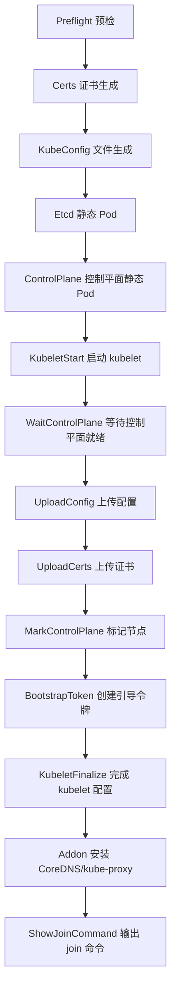
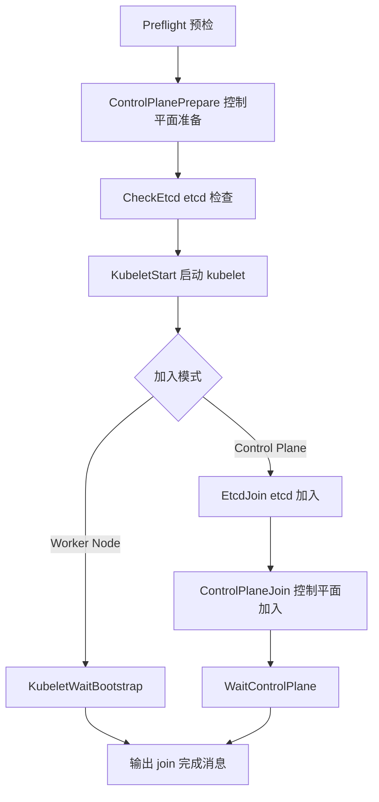
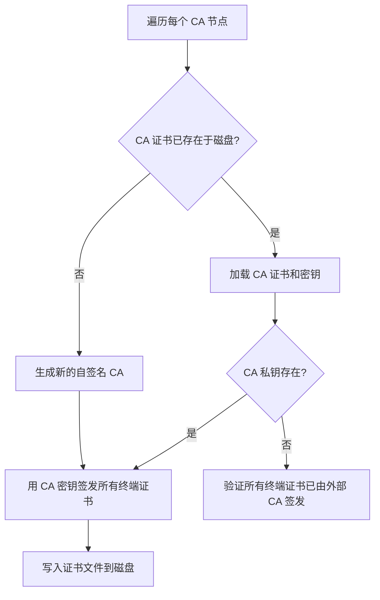
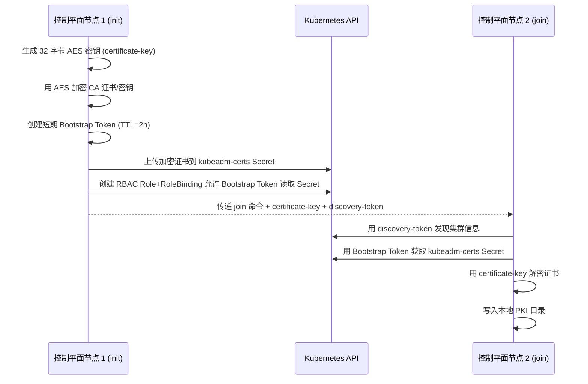

kubeadm 是 Kubernetes 官方提供的集群引导工具，其核心使命是**以最小的用户输入安全地引导一个 Kubernetes 集群**。在源码中，它实现为一个基于 Cobra 的 CLI 工具，通过**可组合的阶段化工作流引擎**（composable phased workflow）驱动 `init`、`join`、`reset`、`upgrade` 等核心操作，同时内置完整的 PKI 证书管理体系来保障集群的通信安全。本文将从命令架构、init/join 工作流、PKI 证书树、证书续期与分发、以及 Discovery 信任引导五个维度，系统剖析 kubeadm 的源码实现。

Sources: [cmd.go](cmd/kubeadm/app/cmd/cmd.go#L32-L97), [kubeadm.go](cmd/kubeadm/app/kubeadm.go#L32-L49)

## 整体命令架构与入口

kubeadm 的入口极为简洁——`main()` 函数仅调用 `app.Run()`，后者初始化 klog 日志标志、注册 pflag 规范化函数，然后构造并执行 Cobra 命令树。`NewKubeadmCommand` 是命令注册的核心，它将 `init`、`join`、`reset`、`certs`、`kubeconfig`、`token`、`upgrade`、`config`、`version`、`alpha` 和 `completion` 十一个子命令挂载到根命令上，并支持 `--rootfs` 全局标志用于 chroot 到指定目录执行。

```
kubeadm (root)
├── init          — 引导控制平面
├── join          — 加入已有集群
├── reset         — 重置节点
├── certs         — 证书管理（renew / check-expiration / generate-csr / certificate-key）
├── kubeconfig    — kubeconfig 文件管理
├── token         — Bootstrap Token 管理
├── upgrade       — 集群升级
├── config        — 配置查看与迁移
├── version       — 版本信息
├── alpha         — 实验性功能
└── completion    — Shell 补全
```

Sources: [kubeadm.go](cmd/kubeadm/kubeadm.go#L24-L26), [cmd.go](cmd/kubeadm/app/cmd/cmd.go#L32-L97), [Run()](cmd/kubeadm/app/kubeadm.go#L32-L49)

## 可组合阶段化工作流引擎

kubeadm 最关键的架构设计是**基于 `workflow.Runner` 的可组合阶段化工作流**。`Runner` 维护一个有序的 `Phase` 列表，每个 Phase 可以包含子 Phase 形成嵌套结构，支持通过 `--skip-phases` 跳过特定阶段或仅执行指定阶段。这种设计让 `kubeadm init` 和 `kubeadm join` 既能作为"一键式"命令运行，也能精细控制每个步骤。

`Runner` 的核心执行逻辑是：先通过 `computePhaseRunFlags()` 根据 `FilterPhases` 和 `SkipPhases` 计算出每个阶段的执行标志，然后线性遍历所有 Phase，对标记为执行的 Phase 调用其 `RunIf` 条件判断，满足条件后执行 `Run` 函数。所有 Phase 共享同一个 `RunData`（对 init 来说是 `initData`，对 join 来说是 `joinData`），通过 `SetDataInitializer` 注入的工厂函数在首次访问时惰性创建。

Sources: [runner.go](cmd/kubeadm/app/cmd/phases/workflow/runner.go#L47-L76), [computePhaseRunFlags](cmd/kubeadm/app/cmd/phases/workflow/runner.go#L119-L170), [Run](cmd/kubeadm/app/cmd/phases/workflow/runner.go#L194-L200)

## kubeadm init 工作流深度解析

`kubeadm init` 注册了十四个顺序执行的 Phase，构成完整的控制平面引导流水线：



`initData` 结构体是整个工作流的运行时上下文，它持有 `InitConfiguration`（包含嵌入的 `ClusterConfiguration`）、kubeconfig 对象、预检忽略集合、dry-run 模式标志、外部 CA 标志、上传证书标志等。`newInitData()` 函数负责将命令行标志、配置文件、默认值三者合并为最终的内部配置对象，并进行一系列关键验证：

1. **特性门控验证**：通过 `features.NewFeatureGate()` 解析 `--feature-gates` 字符串
2. **混合参数验证**：`ValidateMixedArguments` 确保用户没有混用不兼容的标志组合
3. **外部 CA 检测**：`UsingExternalCA()` 和 `UsingExternalFrontProxyCA()` 判断是否存在仅提供 CA 证书而不提供 CA 私钥的外部 CA 场景
4. **上传证书兼容性**：当存在外部 CA 时禁止 `--upload-certs`

Sources: [init.go phases](cmd/kubeadm/app/cmd/init.go#L158-L171), [initData](cmd/kubeadm/app/cmd/init.go#L91-L108), [newInitData](cmd/kubeadm/app/cmd/init.go#L308-L410)

## kubeadm join 工作流深度解析

`kubeadm join` 的设计围绕**双向信任建立**展开：Discovery（让节点信任控制平面）和 TLS Bootstrap（让控制平面信任节点）。它注册了八个 Phase：



`joinData` 与 `initData` 类似，但额外持有 `tlsBootstrapCfg`（TLS 引导阶段的临时 kubeconfig）和 `initCfg`（从集群 `kubeadm-config` ConfigMap 获取的初始化配置）。当 `--control-plane` 标志被设置时，join 流程会额外执行控制平面准备、etcd 加入和控制平面加入阶段。

Sources: [join.go phases](cmd/kubeadm/app/cmd/join.go#L222-L229), [joinData](cmd/kubeadm/app/cmd/join.go#L150-L160), [joinLongDescription](cmd/kubeadm/app/cmd/join.go#L85-L128)

## PKI 证书体系与信任链

### 证书树结构

kubeadm 的 PKI 体系是一个**单层 CA 层级结构**，由三棵独立的 CA 子树组成，每棵子树有一个自签名 CA 根证书和若干由该 CA 签发的终端证书。`GetDefaultCertList()` 定义了完整的证书清单（含本地 etcd），`GetCertsWithoutEtcd()` 则用于外部 etcd 场景。

| CA 证书 | 签发的终端证书 | 用途 |
|---------|-------------|------|
| **ca**（Kubernetes Root CA） | apiserver、apiserver-kubelet-client | API Server 服务端认证 + API Server 到 Kubelet 的客户端认证 |
| **front-proxy-ca** | front-proxy-client | 前端代理（API 聚合层）的客户端认证 |
| **etcd-ca** | etcd/server、etcd/peer、etcd/healthcheck-client、apiserver-etcd-client | etcd 集群内部通信 + 健康检查 + API Server 到 etcd 客户端认证 |

此外，**服务账户密钥对**（`sa.key`/`sa.pub`）不属于 x509 体系，单独处理。

Sources: [GetDefaultCertList](cmd/kubeadm/app/phases/certs/certlist.go#L249-L264), [GetCertsWithoutEtcd](cmd/kubeadm/app/phases/certs/certlist.go#L267-L276)

### 证书生成流程

`CreatePKIAssets` 是证书生成的总入口。它首先将证书列表转换为 `CertificateMap`，然后调用 `CertTree()` 方法构建 **CA → 签发证书** 的树形映射关系。`CertificateTree.CreateTree()` 方法的核心逻辑是：



每个 `KubeadmCert` 对象通过 `configMutators` 函数链在运行时动态注入配置——最关键的是 `makeAltNamesMutator`，它调用 `GetAPIServerAltNames()` 或 `GetEtcdAltNames()` 等函数，根据 `InitConfiguration` 中的 `AdvertiseAddress`、`ServiceSubnet`、`DNSDomain`、`ControlPlaneEndpoint`、`CertSANs` 等字段计算 Subject Alternative Names（SAN）。

Sources: [CreatePKIAssets](cmd/kubeadm/app/phases/certs/certs.go#L45-L72), [CreateTree](cmd/kubeadm/app/phases/certs/certlist.go#L148-L209), [KubeadmCert struct](cmd/kubeadm/app/phases/certs/certlist.go#L45-L56)

### 密钥生成与证书签名

底层密码学操作集中在 `pkiutil` 包中。`NewPrivateKey`（即 `GeneratePrivateKey`）支持五种加密算法：

| 算法标识 | 类型 | 说明 |
|---------|------|------|
| `RSA-2048`（默认） | RSA | 2048 位密钥 |
| `RSA-3072` | RSA | 3072 位密钥 |
| `RSA-4096` | RSA | 4096 位密钥 |
| `ECDSA-P256` | ECDSA | P-256 曲线 |
| `ECDSA-P384` | ECDSA | P-384 曲线 |

`EncryptionAlgorithm` 由 `ClusterConfiguration.EncryptionAlgorithm` 字段控制，在 `KubeadmCert.GetConfig()` 中被注入到 `CertConfig`。`NewSelfSignedCACert` 为 CA 证书默认设置 10 年有效期（`CACertificateValidityPeriod`），而 `NewSignedCert` 为终端证书默认设置 1 年有效期（`CertificateValidityPeriod`），两者都回溯 5 分钟（`CertificateBackdate`）以容忍小幅时钟偏移。

Sources: [GeneratePrivateKey](cmd/kubeadm/app/util/pkiutil/pki_helpers.go#L585-L598), [NewSelfSignedCACert](cmd/kubeadm/app/util/pkiutil/pki_helpers.go#L652-L693), [NewSignedCert](cmd/kubeadm/app/util/pkiutil/pki_helpers.go#L601-L649), [constants](cmd/kubeadm/app/constants/constants.go#L46-L50)

### 证书文件布局

所有证书和密钥存储在 `/etc/kubernetes/pki/` 目录（由 `CertificatesDir` 控制），文件命名遵循 `<base-name>.crt`（证书）和 `<base-name>.key`（私钥）的统一规则。路径生成函数 `pathForCert`、`pathForKey`、`pathForCSR`、`pathForPublicKey` 封装了这一约定。

```
/etc/kubernetes/pki/
├── ca.crt / ca.key                    # Kubernetes Root CA
├── apiserver.crt / apiserver.key      # API Server 服务端证书
├── apiserver-kubelet-client.crt / .key # API Server → Kubelet 客户端证书
├── front-proxy-ca.crt / .key          # 前端代理 CA
├── front-proxy-client.crt / .key      # 前端代理客户端证书
├── sa.pub / sa.key                    # 服务账户密钥对
└── etcd/
    ├── ca.crt / ca.key                # etcd CA
    ├── server.crt / server.key        # etcd 服务端证书
    ├── peer.crt / peer.key            # etcd 对等通信证书
    └── healthcheck-client.crt / .key   # etcd 健康检查客户端证书
```

Sources: [constants](cmd/kubeadm/app/constants/constants.go#L36-L166), [path functions](cmd/kubeadm/app/util/pkiutil/pki_helpers.go#L353-L372)

## 证书分发与上传机制

在高可用（HA）场景中，多个控制平面节点需要共享同一套 CA 证书和密钥。kubeadm 通过 `--upload-certs` 标志实现了证书的安全分发：



`UploadCerts` 函数执行以下操作：用 32 字节随机密钥加密 `certsToTransfer` 映射中的所有共享证书（包括 ca、front-proxy-ca、sa 和 etcd-ca 相关文件），创建一个短期 Bootstrap Token 作为 Secret 的 OwnerReference（确保 Token 过期后 Secret 自动清理），然后将加密数据写入 `kube-system` 命名空间的 `kubeadm-certs` Secret，并设置 RBAC 规则允许 Bootstrap Token 组读取该 Secret。

`DownloadCerts` 在 join 端执行逆向操作：获取 Secret → 用证书密钥解密 → 写入本地 PKI 目录。值得注意的是，当使用外部 CA 或外部 front-proxy CA 时，`--upload-certs` 被显式禁止，因为没有 CA 私钥的节点无法签发新证书。

Sources: [UploadCerts](cmd/kubeadm/app/phases/copycerts/copycerts.go#L88-L121), [DownloadCerts](cmd/kubeadm/app/phases/copycerts/copycerts.go#L218-L253), [certsToTransfer](cmd/kubeadm/app/phases/copycerts/copycerts.go#L181-L201), [externalCA check](cmd/kubeadm/app/cmd/init.go#L391-L393)

## 证书续期管理

`renewal.Manager` 是证书续期的协调器，它为每张证书创建一个 `CertificateRenewHandler`，为每个 CA 创建一个 `CAExpirationHandler`。续期命令 `kubeadm certs renew` 为每张证书（包括嵌入在 kubeconfig 文件中的客户端证书）生成独立的 Cobra 子命令。

`RenewUsingLocalCA` 是续期的核心方法，其流程为：

1. 通过 `IsExternallyManaged` 检测 CA 密钥是否可用（无 CA 密钥则无法续期）
2. 用 `readwriter.Read()` 读取当前证书
3. 通过 `certToConfig` 提取证书配置，再通过 `certConfigMutators` 链补全 SAN 等运行时属性
4. 加载 CA 证书和密钥，调用 `NewFileRenewer.Renew()` 生成新证书
5. 通过 `readwriter.Write()` 写回磁盘

Manager 管理两类证书存储：PKI 目录中的独立证书文件（通过 `pkiCertificateReadWriter` 操作）和嵌入在 kubeconfig 文件中的客户端证书（通过 `kubeconfigReadWriter` 操作）。续期完成后需要手动重启控制平面组件以加载新证书。

Sources: [NewManager](cmd/kubeadm/app/phases/certs/renewal/manager.go#L94-L187), [RenewUsingLocalCA](cmd/kubeadm/app/phases/certs/renewal/manager.go#L217-L283), [renewal subcommands](cmd/kubeadm/app/cmd/certs.go#L233-L312)

## Discovery 与 TLS Bootstrap 信任引导

`kubeadm join` 的信任建立分为两个阶段，由 `discovery.For()` 函数统一协调：

**Discovery 阶段**（节点信任控制平面）通过 `DiscoverValidatedKubeConfig` 实现三种发现模式：

| 模式 | 入口 | 信任验证方式 |
|------|------|------------|
| Token 发现 | `--discovery-token` | `--discovery-token-ca-cert-hash` (SHA256 SPKI 哈希) |
| 文件发现 | `--discovery-file` (本地路径) | kubeconfig 文件中嵌入的 CA 证书 |
| HTTPS 发现 | `--discovery-file` (HTTPS URL) | 系统信任存储验证 TLS + CA 证书 |

**TLS Bootstrap 阶段**（控制平面信任节点）使用 Bootstrap Token 向 API Server 提交 CSR（Certificate Signing Request），由集群中运行的 CSR 自动审批控制器批准后，kubelet 获取自己的客户端证书。`TokenUser` 常量定义为 `"tls-bootstrap-token-user"`，是 TLS Bootstrap 过程中的临时身份标识。

Sources: [discovery.go](cmd/kubeadm/app/discovery/discovery.go#L46-L88), [DiscoverValidatedKubeConfig](cmd/kubeadm/app/discovery/discovery.go#L91-L105)

## 配置 API 与加密算法选择

kubeadm 的配置 API 定义在 `cmd/kubeadm/app/apis/kubeadm` 包中，当前最新版本为 `v1beta4`。`ClusterConfiguration` 提供了三个与 PKI 相关的关键字段：

- **`EncryptionAlgorithm`**：支持 `RSA-2048`、`RSA-3072`、`RSA-4096`、`ECDSA-P256`、`ECDSA-P384` 五种算法
- **`CertificateValidityPeriod`**：终端证书有效期，默认 1 年
- **`CACertificateValidityPeriod`**：CA 证书有效期，默认 10 年

配置加载通过 `configutil.LoadOrDefaultInitConfiguration` 完成，它支持从配置文件读取、使用命令行标志覆盖、或使用 Scheme 默认值三种来源，优先级依次递减。

Sources: [ClusterConfiguration](cmd/kubeadm/app/apis/kubeadm/types.go#L80-L162), [EncryptionAlgorithm](cmd/kubeadm/app/apis/kubeadm/types.go#L152-L153)

## 外部 CA 模式

kubeadm 支持三种外部 CA 场景的自动检测，核心检测逻辑一致：**当 CA 证书存在但 CA 私钥不存在时，视为外部 CA 模式**。

| 检测函数 | 检测目标 | 额外验证 |
|---------|---------|---------|
| `UsingExternalCA` | `ca.crt` 存在 + `ca.key` 不存在 | 验证 apiserver 和 apiserver-kubelet-client 证书已签发 |
| `UsingExternalFrontProxyCA` | `front-proxy-ca.crt` 存在 + `front-proxy-ca.key` 不存在 | 验证 front-proxy-client 证书已签发 |
| `UsingExternalEtcdCA` | `etcd/ca.crt` 存在 + `etcd/ca.key` 不存在 | 验证所有 etcd 相关终端证书已签发 |

在外部 CA 模式下，`kubeadm certs generate-csr` 可以为所有需要的证书生成密钥和 CSR 文件，提交给外部 CA 签名后再放回 PKI 目录。

Sources: [UsingExternalCA](cmd/kubeadm/app/phases/certs/certs.go#L294-L314), [UsingExternalFrontProxyCA](cmd/kubeadm/app/phases/certs/certs.go#L319-L335), [generate-csr](cmd/kubeadm/app/cmd/certs.go#L163-L193)

## 扩展阅读

- 要理解控制平面组件如何使用这些证书启动，请参阅 [API Server 启动流程与请求处理链路](7-api-server-qi-dong-liu-cheng-yu-qing-qiu-chu-li-lian-lu)
- 要了解 kubelet 的 TLS Bootstrap 详细过程，请参阅 [Kubelet Pod 生命周期管理与容器运行时交互](8-kubelet-pod-sheng-ming-zhou-qi-guan-li-yu-rong-qi-yun-xing-shi-jiao-hu)
- 要深入理解 RBAC 如何与 Bootstrap Token 协同工作，请参阅 [认证与授权机制（RBAC、Node Authorizer、准入控制）](20-ren-zheng-yu-shou-quan-ji-zhi-rbac-node-authorizer-zhun-ru-kong-zhi)
- 要了解 kubeadm 如何在测试中被验证，请参阅 [端到端测试框架与测试套件组织](25-duan-dao-duan-ce-shi-kuang-jia-yu-ce-shi-tao-jian-zu-zhi)