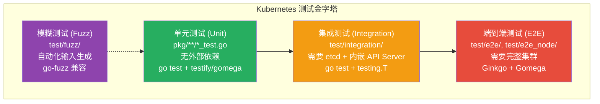
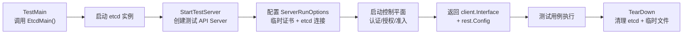
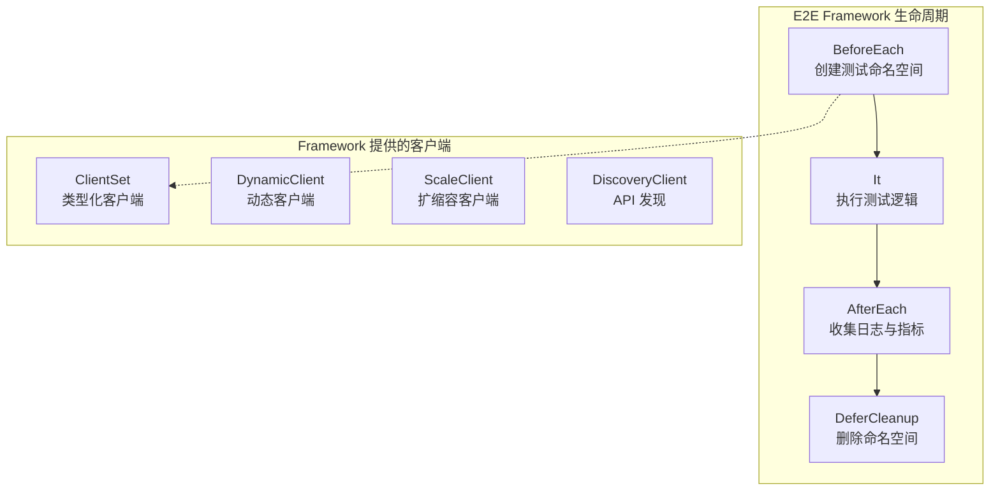

Kubernetes 项目拥有一套层次分明、规模庞大的测试体系。在 `pkg/` 目录下有超过 **960 个**单元测试文件，`test/integration/` 下有超过 **330 个**集成测试文件，而端到端（E2E）测试和节点级测试合计超过 **100 个**测试文件——这些数字背后是一套精心设计的测试金字塔架构。本页将从全局视角出发，剖析 Kubernetes 测试策略的分层设计、每层测试的执行机制、框架选型以及它们之间的协作关系，帮助你建立对整个测试体系的系统性认知。

Sources: [test.sh](hack/make-rules/test.sh), [test-integration.sh](hack/make-rules/test-integration.sh), [test-e2e-node.sh](hack/make-rules/test-e2e-node.sh)

## 测试金字塔：Kubernetes 的分层测试模型

Kubernetes 的测试体系遵循经典的**测试金字塔**原则——底层单元测试数量最多、执行最快、隔离度最高；顶层端到端测试数量最少、执行最慢、覆盖面最广。在这两端之间，集成测试扮演着关键的桥梁角色，验证多个组件在真实交互场景下的协同行为。



下面的表格从多个维度对比各层测试的核心特征：

| 维度 | 单元测试 | 集成测试 | 端到端测试 |
|------|---------|---------|-----------|
| **文件位置** | `pkg/**/*_test.go` | `test/integration/**/*_test.go` | `test/e2e/`, `test/e2e_node/` |
| **测试文件数量** | ~960 | ~330 | ~100+ |
| **外部依赖** | 无（使用 fake client） | etcd 实例 | 完整 Kubernetes 集群 |
| **执行入口** | `make test` | `make test-integration` | `hack/ginkgo-e2e.sh` |
| **默认超时** | 180 秒/包 | 600 秒 | 24 小时 |
| **测试框架** | `testing.T` + testify/gomega | `testing.T` + 集成框架 | Ginkgo v2 + Gomega |
| **并发支持** | `gotestsum` 并行 | 可配置 `GOMAXPROCS` | Ginkgo 并行节点 |
| **覆盖范围** | 单个函数/方法 | 多组件交互 | 完整用户场景 |

Sources: [test.sh](hack/make-rules/test.sh#L59-L67), [test-integration.sh](hack/make-rules/test-integration.sh#L54-L74), [ginkgo-e2e.sh](hack/ginkgo-e2e.sh#L31-L38)

## 单元测试：快速反馈的第一道防线

单元测试是 Kubernetes 测试金字塔的基础，分布在 `pkg/` 目录下的各个包中。它们**不依赖任何外部服务**（无 etcd、无 API Server），使用 `fake` 客户端或内存中的 mock 对象来隔离被测代码。Kubernetes 通过 `hack/make-rules/test.sh` 脚本统一管理单元测试的发现与执行。

### 测试发现与过滤机制

单元测试的包发现逻辑定义在 `kube::test::find_go_packages()` 函数中。该函数首先通过 `go list -m -json` 获取工作区中所有模块，然后使用模板语法筛选出包含测试文件的包。关键设计在于，它**主动排除**了不属于单元测试范畴的包：

```bash
grep -vE \
    -e '^k8s.io/kubernetes/test/e2e$' \
    -e '^k8s.io/kubernetes/test/e2e_dra$' \
    -e '^k8s.io/kubernetes/test/e2e_node(/.*)?$' \
    -e '^k8s.io/kubernetes/test/e2e_kubeadm(/.*)?$' \
    -e '^k8s.io/kubernetes/test/e2e_kubeadm(/.*)?$' \
    -e '^k8s.io/.*/test/integration(/.*)?$'
```

这种基于路径模式的过滤策略确保 `make test` 只运行真正的单元测试，将集成测试和端到端测试排除在外。

Sources: [test.sh](hack/make-rules/test.sh#L37-L54)

### 典型单元测试模式

以调度器测试为例，`pkg/scheduler/scheduler_test.go` 展示了 Kubernetes 单元测试的典型模式：使用 `fake.NewSimpleClientset()` 创建伪造的客户端，配合 `informers.NewSharedInformerFactory()` 构建内存中的 Informer 工厂，然后在无任何外部依赖的环境下验证调度器的核心逻辑。测试中大量使用了 `github.com/google/go-cmp/cmp` 进行结构化比较、`github.com/stretchr/testify/require` 进行断言、以及 `k8s.io/component-base/featuregate/testing` 包进行特性门控的临时覆盖。

```go
// 典型的单元测试依赖注入模式
func TestSchedulerCreation(t *testing.T) {
    // 使用 fake client，无需真实 API Server
    client := fake.NewSimpleClientset()
    informerFactory := informers.NewSharedInformerFactory(client, 0)
    // ... 构建被测对象并验证行为
}
```

Sources: [scheduler_test.go](pkg/scheduler/scheduler_test.go#L1-L80)

### 执行环境与安全机制

测试脚本在启动时会启用两个重要的运行时检测机制：**缓存变异检测器**（`KUBE_CACHE_MUTATION_DETECTOR=true`）用于捕获对共享缓存的非预期修改；**Watch 解码错误 Panic**（`KUBE_PANIC_WATCH_DECODE_ERROR=true`）将 Watch 解码错误提升为 Panic，确保编码错误在开发阶段就被暴露。此外，默认启用了 **race detector**（`-race`），通过 `-p` 参数控制并行度，使用 `gotestsum` 工具提供更友好的测试输出和 JUnit XML 报告生成。

Sources: [test.sh](hack/make-rules/test.sh#L59-L74)

## 集成测试：多组件协同的真实验证

集成测试位于 `test/integration/` 目录下，是单元测试和端到端测试之间的关键桥梁。与单元测试不同，集成测试会**启动真实的 etcd 实例和 API Server 进程**，验证组件在真实交互场景下的行为。Kubernetes 在 `test/integration/` 下按功能域组织了超过 **50 个子目录**，涵盖调度器、部署控制器、CRD、垃圾回收、RBAC、网络等核心功能。

### 集成测试框架：etcd + 内嵌 API Server

集成测试的核心框架位于 `test/integration/framework/`，提供了 `StartTestServer()` 函数来启动一个完整的测试用 API Server。这个函数完成了从创建临时证书目录、生成自签名 CA、配置安全监听器，到初始化 `ServerRunOptions` 并启动完整控制平面的全过程：



每个集成测试子目录都包含一个 `main_test.go` 文件，其 `TestMain` 函数通过 `framework.EtcdMain(m.Run)` 启动共享的 etcd 实例。`EtcdMain()` 函数负责检测 etcd 是否已在运行（复用已有实例），或在需要时启动新的 etcd 进程。

Sources: [test_server.go](test/integration/framework/test_server.go#L42-L100), [etcd.go](test/integration/framework/etcd.go#L51-L99), [main_test.go](test/integration/scheduler/main_test.go#L25-L27)

### 集成测试与单元测试的本质区别

以调度器为例，可以清晰对比两种测试的差异：

- **单元测试**（`pkg/scheduler/scheduler_test.go`）：使用 `fake.NewSimpleClientset()` 和内存 Informer，验证调度器对象创建、队列管理等纯逻辑行为
- **集成测试**（`test/integration/scheduler/scheduler_test.go`）：通过 `testutils.InitTestSchedulerWithNS()` 启动真实的调度器绑定到真实的 API Server，然后创建真实的 Node 和 Pod 资源，验证调度决策是否被正确持久化到 etcd

集成测试的超时设置为 600 秒（是单元测试的 3 倍多），并且**默认关闭了 Watch 解码错误 Panic**（`KUBE_PANIC_WATCH_DECODE_ERROR=false`），因为集成测试会故意插入无法解码的数据来测试系统的容错能力。

Sources: [test-integration.sh](hack/make-rules/test-integration.sh#L32-L42), [scheduler_test.go (integration)](test/integration/scheduler/scheduler_test.go#L57-L80)

## 端到端测试：完整场景的用户视角验证

端到端测试（E2E）位于 `test/e2e/` 目录下，是验证 Kubernetes 完整功能的最顶层测试。它们需要一个**运行中的 Kubernetes 集群**，从用户视角模拟真实的工作负载场景。E2E 测试使用 Ginkgo v2 作为测试框架，配合 Gomega 匹配器库，通过 `hack/ginkgo-e2e.sh` 脚本驱动执行。

### E2E 测试的组织结构

E2E 测试按 SIG（Special Interest Group）和功能域组织为多个子目录，测试入口点为 `test/e2e/e2e_test.go` 和 `test/e2e/e2e.go`。`e2e_test.go` 通过下划线导入（blank import）将所有测试子包注册到 Ginkgo 测试套件中：

| 子目录 | 覆盖范围 |
|--------|---------|
| `apimachinery` | API 机制（CRD、discovery、chunking、watch 等） |
| `apps` | 工作负载（Deployment、StatefulSet、DaemonSet 等） |
| `auth` | 认证与授权 |
| `scheduling` | 调度策略 |
| `network` | 网络策略与服务连通性 |
| `storage` | 存储卷与 CSI |
| `node` | 节点行为 |
| `kubectl` | kubectl 命令行功能 |

Sources: [e2e_test.go](test/e2e/e2e_test.go#L42-L78)

### E2E Framework：测试基础设施的核心

`test/e2e/framework/` 是一个庞大的测试支持库，提供了 `Framework` 结构体作为每个测试用例的基础环境。`Framework` 在 `BeforeEach` 阶段自动创建测试命名空间并配置 Pod 安全级别，在 `AfterEach` 阶段执行资源清理和日志收集。它封装了完整的 Kubernetes 客户端（`ClientSet`、`DynamicClient`、`ScaleClient`）和一系列工具模块（Pod 管理、Deployment 操作、节点操作、日志转储、指标采集等）。



`Framework` 的扩展机制通过 `NewFrameworkExtensions` 切片实现，允许不同的测试子包在框架初始化后注入自定义的 BeforeEach/AfterEach 回调。这种设计使得核心框架保持精简，而各功能域可以根据需要扩展测试基础设施。

Sources: [framework.go](test/e2e/framework/framework.go#L75-L110)

### 节点级 E2E 测试（e2e_node）

节点级测试位于 `test/e2e_node/`，专注于验证 **Kubelet** 在真实节点上的行为。与标准 E2E 测试不同，e2e_node 测试会在本地或远程节点上**直接启动 etcd、API Server 和 Kubelet**（而非连接到已有集群）。测试入口 `test/e2e_node/e2e_node_suite_test.go` 提供了多种运行模式：

- **本地模式**（`REMOTE=false`）：在本机启动所有服务，适合开发调试
- **远程模式**（`REMOTE=true`）：在 GCE 等云平台上启动测试实例
- **服务模式**（`run-services-mode`）：仅启动服务，不运行测试
- **Kubelet 模式**（`run-kubelet-mode`）：仅启动 Kubelet

测试套件覆盖了容器生命周期管理、设备插件、CPU/内存管理器、拓扑管理器、Pod 驱逐、镜像 GC、安全上下文等节点核心功能。

Sources: [e2e_node_suite_test.go](test/e2e_node/e2e_node_suite_test.go#L30-L90), [test-e2e-node.sh](hack/make-rules/test-e2e-node.sh#L1-L50)

## 一致性测试与 SIG 标签体系

**一致性测试（Conformance Tests）** 是 E2E 测试的一个子集，标记为 `[Conformance]` 标签，代表所有 Kubernetes 认证发行版**必须通过**的测试用例。在代码中，通过 `framework.ConformanceIt()` 函数声明一致性测试——这个函数是对 Ginkgo `It` 的封装，自动注入 `[Conformance]` 标签：

```go
// 声明一致性测试的标准方式
framework.ConformanceIt("should create and delete a pod", func(ctx context.Context) {
    // 测试逻辑
})
```

`test/conformance/` 包含一致性测试的动态生成与维护工具。它通过编译并运行测试二进制文件的 dry-run 模式，提取 `SpecSummary` 信息，再结合 AST 解析器捕获测试上方的注释，最终生成 `conformance.yaml` 清单。

每个 E2E 测试都通过 `framework.SIGDescribe("sig-name")` 关联到对应的 SIG（Special Interest Group）。`SIGDescribe` 函数将 SIG 名称作为 Ginkgo 的 `WithLabel("sig-xxx")` 标签注入，使得测试结果可以按 SIG 维度聚合和分析。

Sources: [ginkgowrapper.go](test/e2e/framework/ginkgowrapper.go#L127-L155), [conformance.go](test/conformance/doc.go#L22-L31), [walk.go](test/conformance/walk.go#L38-L42)

## 模糊测试与专项测试

### 模糊测试

`test/fuzz/` 目录包含了基于 `go-fuzz` 框架的模糊测试目标。这些测试通过自动生成随机输入来探测序列化/反序列化路径中的潜在崩溃和异常行为。例如 `test/fuzz/json/json.go` 中的 `FuzzStrictDecode` 函数对 JSON 序列化器进行模糊测试，验证在不同配置（strict/non-strict、yaml/pretty）下解码和编码的一致性。

Sources: [json.go](test/fuzz/json/json.go#L42-L68)

### 命令行测试（test-cmd）

`hack/make-rules/test-cmd.sh` 驱动了一套独特的**基于 Shell 脚本的集成测试**。它会在本地启动一个真实的 kube-apiserver 和 kube-controller-manager，然后通过一系列 Shell 脚本（位于 `test/cmd/`）验证 kubectl 命令的行为。`hack/lib/test.sh` 提供了 Shell 层面的测试断言工具，如 `kube::test::get_object_assert()` 用于验证 `kubectl get` 的输出是否符合预期模板。

Sources: [test-cmd.sh](hack/make-rules/test-cmd.sh#L28-L110), [test.sh](hack/lib/test.sh#L32-L99)

### 性能基准测试

Kubernetes 还包含性能测试变体：`test/integration/scheduler_perf/` 专注于调度器性能基准测试，`test/e2e_node/` 中的 `resource_usage_test.go`、`density_test.go` 等测试关注节点层面的资源使用效率。这些测试通过 `hack/benchmark-go.sh` 驱动执行。

Sources: [benchmark-go.sh](hack/benchmark-go.sh)

## 测试执行入口与 CI 集成

Kubernetes 提供了一组统一的 Makefile 目标和 Shell 脚本来驱动测试执行：

| 命令 | 对应脚本 | 用途 |
|------|---------|------|
| `make test` | `hack/make-rules/test.sh` | 运行所有单元测试 |
| `make test-integration` | `hack/make-rules/test-integration.sh` | 运行所有集成测试 |
| `make test-cmd` | `hack/make-rules/test-cmd.sh` | 运行 kubectl 命令行测试 |
| `make test-e2e-node` | `hack/make-rules/test-e2e-node.sh` | 运行节点级 E2E 测试 |
| `make verify` | `hack/verify-all.sh` | 运行所有验证脚本 |

CI 环境中，`hack/jenkins/` 下的脚本提供了容器化的测试执行方式（如 `test-dockerized.sh`、`test-integration-dockerized.sh`），确保在一致的环境中运行测试。所有测试都支持通过 `ARTIFACTS` 环境变量指定 JUnit XML 报告的输出目录，用于 CI 系统的结果收集。

此外，`hack/verify-test-code.sh` 和 `hack/verify-testing-import.sh` 两个验证脚本确保测试代码的质量——前者检查 E2E 测试中是否错误使用了 `Expect(err).ToNot(HaveOccurred())` 模式（应使用 `framework.ExpectNoError`），后者确保生产二进制文件中不会引入测试相关的依赖。

Sources: [verify-all.sh](hack/verify-all.sh#L31-L41), [verify-test-code.sh](hack/verify-test-code.sh#L18-L38), [verify-testing-import.sh](hack/verify-testing-import.sh#L18-L40)

## 延伸阅读

- 如果你想深入了解 E2E 测试框架的内部结构和测试套件的组装方式，请阅读 [端到端测试框架与测试套件组织](25-duan-dao-duan-ce-shi-kuang-jia-yu-ce-shi-tao-jian-zu-zhi)
- 如果你想了解节点级测试的具体实现和性能基准测试方法，请阅读 [节点级别测试（e2e_node）与性能基准测试](26-jie-dian-ji-bie-ce-shi-e2e_node-yu-xing-neng-ji-zhun-ce-shi)
- 如果你想了解特性门控如何影响测试行为和功能生命周期，请阅读 [特性门控系统与功能生命周期管理](28-te-xing-men-kong-xi-tong-yu-gong-neng-sheng-ming-zhou-qi-guan-li)
- 如果你想了解构建系统如何支撑测试执行，请阅读 [Hack 脚本与 Makefile 构建体系](29-hack-jiao-ben-yu-makefile-gou-jian-ti-xi)