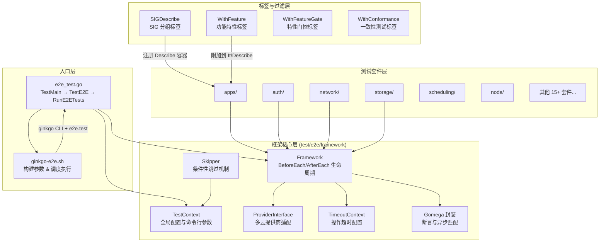
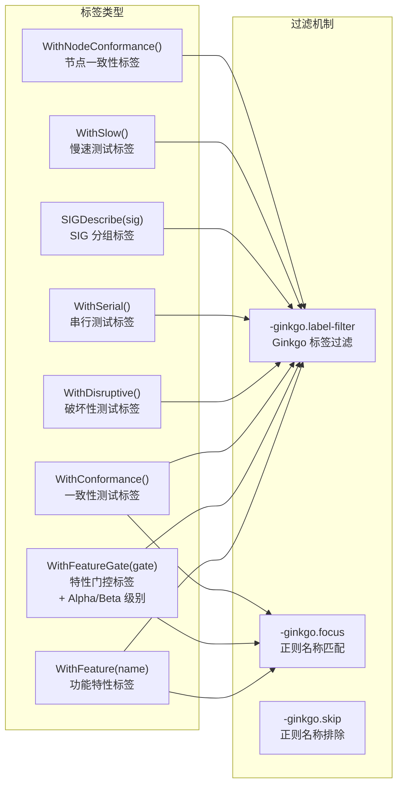
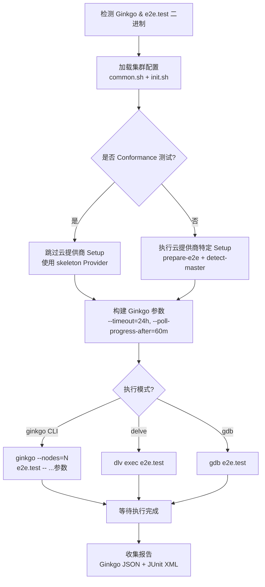

Kubernetes 的端到端（E2E）测试框架是一套构建于 **Ginkgo v2** 和 **Gomega** 之上的完整测试基础设施，旨在对运行中的 Kubernetes 集群进行全链路功能验证。与单元测试和集成测试不同，E2E 测试面向的是一个真实的、多节点协作的集群环境，因此框架需要解决测试隔离、资源生命周期管理、多提供商适配、测试选择性执行等核心工程问题。本文将从入口机制、框架核心、测试套件组织、标签与过滤系统、执行流水线五个维度，系统性地解析这一框架的架构设计与实现细节。

Sources: [e2e.go](test/e2e/e2e.go#L1-L111), [e2e_test.go](test/e2e/e2e_test.go#L1-L199)

## 整体架构概览

E2E 测试框架的核心架构可以概括为以下分层结构：最底层是 **Ginkgo/Gomega** 提供的测试运行器与断言机制；中间层是 `test/e2e/framework` 包提供的通用测试基础设施（Framework、TestContext、Provider、Skipper 等）；顶层是按功能域组织的各个测试套件（apps、auth、network、storage 等），每个套件通过空白导入（blank import）注册到全局测试树中。



Sources: [framework.go](test/e2e/framework/framework.go#L92-L153), [test_context.go](test/e2e/framework/test_context.go#L71-L99), [ginkgowrapper.go](test/e2e/framework/ginkgowrapper.go#L127-L141)

## 入口机制与生命周期

### 双入口架构

E2E 测试的执行有两个入口路径，分别服务于不同场景：**脚本入口** `hack/ginkgo-e2e.sh` 用于 CI/CD 环境和本地开发执行，它会自动检测 Ginkgo 和 e2e.test 二进制文件、配置云提供商参数、构建 Ginkgo CLI 参数并启动测试进程；**Go 入口** `test/e2e/e2e_test.go` 则是 Go 测试框架的标准入口，定义了 `TestMain` 进行全局初始化和 `TestE2E` 触发实际测试运行。

`TestMain` 函数承担三项关键职责：第一，通过 `handleFlags()` 注册并解析所有命令行参数，将 `framework/config` 包中定义的配置选项合并到标准 flag 集中；第二，初始化嵌入式文件系统源（testing-manifests、test-fixtures、conformance-testdata），使测试能在无需完整源码仓库的情况下访问所需的 YAML 清单和配置文件；第三，支持 `--list-conformance-tests` 等元命令，直接列出一致性测试清单后退出。

Sources: [e2e_test.go](test/e2e/e2e_test.go#L77-L151), [ginkgo-e2e.sh](hack/ginkgo-e2e.sh#L1-L65)

### 套件级 Setup 与 Teardown

`RunE2ETests` 函数通过 Ginkgo 的 `SynchronizedBeforeSuite` 和 `SynchronizedAfterSuite` 机制管理测试套件级别的初始化和清理。`SynchronizedBeforeSuite` 在并行执行模式下仅在第一个 Ginkgo 节点上运行 `setupSuite`，然后在所有节点上运行 `setupSuitePerGinkgoNode`。`setupSuite` 的核心逻辑包括：

1. **清理残留命名空间**：当 `CleanStart=true` 时，删除所有非系统命名空间（排除 `kube-system`、`default`、`kube-public`、`kube-node-lease`），等待删除完成
2. **等待节点就绪**：通过 `WaitForAllNodesSchedulable` 确保所有节点可调度，并自动检测节点数量
3. **等待系统 Pod 就绪**：`WaitForAlmostAllPodsReady` 确保 `kube-system` 中的基础设 Pod 全部运行
4. **等待 DaemonSet 就绪**：确保系统级 DaemonSet（如网络插件）已启动

`setupSuitePerGinkgoNode` 在每个 Ginkgo 并行节点上运行，主要检测集群的 IP 协议族（IPv4/IPv6），供后续测试适配使用。

Sources: [e2e.go](test/e2e/e2e.go#L69-L84), [e2e.go](test/e2e/e2e.go#L177-L256), [e2e.go](test/e2e/e2e.go#L368-L379)

## Framework 核心结构

### Framework 结构体

`Framework` 是每个 E2E 测试用例的核心依赖。它封装了 Kubernetes 客户端、命名空间管理、超时配置、Flake 报告等关键功能。每个测试用例通常通过 `framework.NewDefaultFramework(baseName)` 创建一个实例，该调用会自动注册 Ginkgo 的 `BeforeEach` 钩子来初始化框架实例，并通过 `DeferCleanup` 注册清理逻辑。

| 字段 | 类型 | 说明 |
|------|------|------|
| `ClientSet` | `clientset.Interface` | 标准 Kubernetes 客户端 |
| `DynamicClient` | `dynamic.Interface` | 动态客户端，用于操作任意 API 资源 |
| `Namespace` | `*v1.Namespace` | 测试专属命名空间（每个测试唯一） |
| `UniqueName` | `string` | 唯一标识符，基于命名空间名称生成 |
| `Timeouts` | `*TimeoutContext` | 可定制的操作超时配置 |
| `BaseName` | `string` | 命名空间基名，用于生成唯一命名空间名 |
| `ScalesGetter` | `scaleclient.ScalesGetter` | 伸缩接口，用于 Deployment 等资源的 Scale 操作 |

Sources: [framework.go](test/e2e/framework/framework.go#L108-L153)

### BeforeEach/AfterEach 生命周期

Framework 的生命周期管理遵循严格的执行顺序。`BeforeEach` 阶段：创建 REST 配置 → 构建 ClientSet/DynamicClient/RESTMapper → 调用 Provider 的 `FrameworkBeforeEach` → 创建测试命名空间 → 等待 ServiceAccount 和根 CA 就绪 → 初始化 FlakeReport。`AfterEach` 阶段（通过 `DeferCleanup` 以逆序注册）：调用 Provider 的 `FrameworkAfterEach` → 报告 Flake 记录 → 打印测试摘要 → 删除命名空间（受 `DeleteNamespace` 和 `DeleteNamespaceOnFailure` 两个标志控制）。

这种设计确保了即使测试在 `BeforeEach` 阶段因 Skip 而未到达框架初始化，`AfterEach` 也不会因空指针而崩溃——因为 `DeferCleanup` 仅在到达注册点之后才会在清理阶段执行。

Sources: [framework.go](test/e2e/framework/framework.go#L277-L394), [framework.go](test/e2e/framework/framework.go#L452-L519)

### 测试上下文与配置

`TestContextType` 是一个全局单例（`framework.TestContext`），承载了整个测试套件的配置参数。这些参数通过两层注册机制暴露为命令行标志：`RegisterCommonFlags` 注册所有 E2E 测试套件通用的参数（如 `--report-dir`、`--delete-namespace`、`--gather-metrics-at-teardown` 等），`RegisterClusterFlags` 注册特定于集群 E2E 测试的参数（如 `--kubeconfig`、`--provider`、`--host` 等）。`framework/config` 包则提供了一种基于结构体标签的声明式配置注册方式，简化了自定义测试参数的定义。

Sources: [test_context.go](test/e2e/framework/test_context.go#L99-L225), [test_context.go](test/e2e/framework/test_context.go#L309-L399), [config.go](test/e2e/framework/config/config.go#L86-L143)

### 超时体系

`TimeoutContext` 定义了一组覆盖常见 E2E 操作的超时值，每个 Framework 实例持有独立的超时副本，允许特定测试覆盖默认值。默认超时值体现了对集群操作延迟的经验性评估：

| 超时字段 | 默认值 | 用途 |
|----------|--------|------|
| `Poll` | 2s | 轮询间隔 |
| `PodStart` | 5min | Pod 启动等待 |
| `PodStartShort` | 2min | 快速 Pod 启动（确定不会延迟的场景） |
| `PodDelete` | 5min | Pod 删除等待 |
| `ClaimProvision` | 5min | PVC 动态供给 |
| `PVDeleteSlow` | 20min | 慢速 PV 删除 |
| `NodeSchedulable` | 30min | 节点可调度等待 |
| `SystemPodsStartup` | 10min | 系统 Pod 启动等待 |

通过 `NewFrameworkWithCustomTimeouts` 可以创建具有定制超时的 Framework 实例，仅覆盖需要调整的字段，其余保持默认值。

Sources: [timeouts.go](test/e2e/framework/timeouts.go#L21-L123)

## 测试套件组织

### 功能域划分

E2E 测试按功能域组织为独立子包，每个子包通过空白导入注册到全局测试树中。这种设计实现了测试代码的模块化隔离，同时保持了统一的框架基础设施访问。下表展示了主要测试套件及其职责：

| 套件目录 | 职责域 | 典型测试内容 |
|----------|--------|-------------|
| `apps/` | 应用工作负载管理 | Deployment、StatefulSet、DaemonSet、Job、CronJob |
| `auth/` | 认证与授权 | 证书管理、服务账户、Node 认证/授权 |
| `network/` | 网络功能 | Service、DNS、Ingress、NetworkPolicy、双栈 |
| `storage/` | 存储功能 | PV/PVC、CSI、卷挂载、快照 |
| `scheduling/` | 调度器行为 | 优先级、抢占、限制范围 |
| `node/` | 节点功能 | AppArmor、GPU、Kubelet 认证 |
| `kubectl/` | kubectl 命令行 | debug、delete、logs、port-forward |
| `apimachinery/` | API 基础设施 | CRD、Webhook、Garbage Collection、Watch |
| `autoscaling/` | 自动伸缩 | HPA、DNS 自动伸缩、集群大小自动伸缩 |
| `instrumentation/` | 监控与日志 | Events、Metrics、Logging |
| `common/` | 共享测试 | Pod 基础操作、容器生命周期、卷挂载 |
| `dra/` | 动态资源分配 | 设备插件部署、资源声明 |
| `windows/` | Windows 节点 | Windows 特有的网络、存储、安全上下文 |
| `invariants/` | 不变量检查 | Metrics 校验、日志检查 |
| `lifecycle/` | 集群生命周期 | Bootstrap 测试 |
| `upgrades/` | 升级测试 | 跨版本升级/降级场景 |

Sources: [e2e_test.go](test/e2e/e2e_test.go#L47-L75)

### common/ 共享测试层

`test/e2e/common` 目录是一个关键的架构决策，它包含在 E2E 测试（`test/e2e`）和 Node E2E 测试（`test/e2e_node`）之间共享的测试用例。`common/node/` 下包含了 Pod 操作、容器探针、安全上下文、密钥管理等基础测试；`common/storage/` 包含了 ConfigMap 卷、Projected 卷、EmptyDir 等存储相关测试；`common/apimachinery/` 包含资源版本匹配器等 API 机器层测试工具。`e2e_test.go` 通过 `commontest.CurrentSuite = commontest.E2E` 标识当前运行的是全集群 E2E 测试，使 common 包中的测试能根据执行环境调整行为。

Sources: [common/](test/e2e/common), [e2e.go](test/e2e/e2e.go#L69-L72)

### SIGDescribe 与测试注册模式

每个功能域子包都定义了一个 `SIGDescribe` 变量，它是对 Ginkgo `Describe` 的封装，自动附加 SIG 标签。例如 `test/e2e/apps/framework.go` 定义了 `SIGDescribe = framework.SIGDescribe("apps")`，它会在 Describe 容器上附加 `sig-apps` 标签。这种模式确保了所有测试都能通过 Ginkgo 的标签过滤机制按 SIG 精确筛选。

一个典型的测试文件遵循如下注册模式：首先通过 `SIGDescribe` 创建顶层容器 → 在容器内创建 `framework.NewDefaultFramework` 实例 → 在 `BeforeEach` 中从 Framework 提取客户端和命名空间 → 通过 `ginkgo.It` 注册具体测试用例 → 每个用例接收 `context.Context` 参数以支持超时和取消。

Sources: [apps/framework.go](test/e2e/apps/framework.go#L17-L23), [deployment.go](test/e2e/apps/deployment.go#L81-L100)

## 标签与过滤系统

### 标签体系架构

Kubernetes E2E 测试框架实现了一套精密的标签系统，用于测试的选择性执行。这套系统通过 `ginkgowrapper.go` 中的 `transformGinkgoNodeArgs` 函数注入到 Ginkgo 的测试树构建过程中，将框架自定义的标签参数（如 `WithFeature`、`WithFeatureGate`）转换为 Ginkgo 原生的 `Label` 和文本标记。



Sources: [ginkgowrapper.go](test/e2e/framework/ginkgowrapper.go#L256-L331), [ginkgowrapper.go](test/e2e/framework/ginkgowrapper.go#L452-L530)

### Feature 与 FeatureGate 标签

`WithFeature` 标签声明测试对特定集群功能（如 `DynamicResourceAllocation`、`GracefulNodeShutdown`、`IPv6DualStack`）的依赖。所有合法 Feature 名称必须在 `test/e2e/feature/feature.go` 中通过 `framework.ValidFeatures.Add()` 注册。`WithFeatureGate` 则更进一步，它不仅标记测试依赖的特性门控，还根据门控的稳定性级别（Alpha/Beta/GA）自动添加 `[Alpha]`/`[Beta]` 标签和 `Feature:OffByDefault` 标签（对于默认关闭的门控）。这使得 CI 系统能够根据集群配置精确筛选应该运行的测试子集。

Sources: [feature.go](test/e2e/feature/feature.go#L1-L200), [ginkgowrapper.go](test/e2e/framework/ginkgowrapper.go#L452-L530)

### 默认跳过规则

`CreateGinkgoConfig` 函数在未指定任何过滤条件时，自动添加默认跳过规则 `\[Flaky\]|\[Feature:.+\]`，排除已知的 Flaky 测试和需要特定 Feature 的测试。这一机制确保了默认执行的测试集是稳定且通用的，同时为有针对性的测试运行保留了充分的灵活性。

Sources: [test_context.go](test/e2e/framework/test_context.go#L369-L379)

## 条件性跳过机制

### Skipper 子系统

`framework/skipper` 包提供了一套声明式的测试跳过 API，允许测试在运行时根据集群状态动态决定是否执行。这套 API 覆盖了以下维度的条件判断：

| 跳过函数 | 判断维度 | 典型场景 |
|----------|---------|---------|
| `SkipUnlessProviderIs` | 云提供商 | 仅 GCE 支持的 PD 操作 |
| `SkipIfProviderIs` | 云提供商排除 | 排除特定提供商的已知问题 |
| `SkipUnlessNodeCountIsAtLeast` | 节点数量 | 需要多节点的调度测试 |
| `SkipUnlessMultizone` | 多可用区 | 跨区域拓扑分布测试 |
| `SkipUnlessNodeOSDistroIs` | 节点操作系统 | Linux 特有的 Cgroup 测试 |
| `SkipUnlessServerVersionGTE` | API 版本 | 新增 API 字段的兼容性 |
| `SkipUnlessFeatureGateEnabled` | 特性门控 | Alpha/Beta 功能测试 |
| `SkipUnlessSSHKeyPresent` | SSH 访问 | 需要节点 SSH 的调试测试 |

Sources: [skipper.go](test/e2e/framework/skipper/skipper.go#L36-L200)

## 多云提供商适配

### ProviderInterface 插件架构

E2E 框架通过 `ProviderInterface` 接口实现了多云提供商的插件化适配。每个云提供商（GCE、AWS、Azure、OpenStack、vSphere、Kubemark）通过 `RegisterProvider` 注册到全局工厂映射中，在测试初始化时通过 `SetupProviderConfig` 根据命令行 `--provider` 参数实例化对应的 Provider。

`ProviderInterface` 定义了两类操作：**Framework 生命周期钩子**（`FrameworkBeforeEach`/`FrameworkAfterEach`）允许提供商在测试前后注入自定义逻辑（如 GCE 的防火墙规则配置）；**基础设施操作**（`CreatePD`/`DeletePD`、`ResizeGroup`、`DeleteNode` 等）封装了特定于云提供商的资源管理。`NullProvider` 作为默认实现，对所有操作返回"不支持"错误，确保在没有提供商的场景下不会意外执行云特定操作。

Sources: [provider.go](test/e2e/framework/provider.go#L30-L112), [providers.go](test/e2e/providers.go#L17-L28)

## 断言与 Flake 管理

### Gomega 封装层

框架在标准 Gomega 之上提供了两层封装。`framework.ExpectNoError` 系列函数是传统的即时失败断言，用于关键性条件检查。`framework.Gomega()` 则提供了一种延迟失败的模式，允许将断言错误包装后传递，在最终检查点才报告失败。这种模式在异步操作场景中特别有用，因为它允许将多个检查组合在一起，提供更完整的错误上下文。

`MakeMatcher[T]` 泛型函数简化了自定义 Gomega Matcher 的创建，开发者只需提供一个检查函数，框架自动处理类型转换和失败消息生成。

Sources: [expect.go](test/e2e/framework/expect.go#L43-L78), [expect.go](test/e2e/framework/expect.go#L80-L123)

### Flake 报告机制

`FlakeReport` 是框架内置的 Flake（间歇性失败）记录机制。测试可以通过 `flakeReport.RecordFlakeIfError(err)` 记录非关键性错误，这些错误不会导致测试失败，但会在 `AfterEach` 阶段被汇总报告。这种设计允许测试区分"致命失败"和"可能是暂时性问题的 Flake"，为测试稳定性分析提供了数据基础。

Sources: [flake_reporting_util.go](test/e2e/framework/flake_reporting_util.go#L26-L97)

## 执行流水线

### ginkgo-e2e.sh 编排流程

`hack/ginkgo-e2e.sh` 是 E2E 测试的标准执行入口，它编排了从环境准备到结果收集的完整流程：



关键执行参数包括：`GINKGO_PARALLEL` 控制并行执行（默认 25 节点，Race 检测模式下降至 10 节点）、`GINKGO_TIMEOUT` 默认 24 小时、`GINKGO_POLL_PROGRESS_AFTER` 在 60 分钟后开始显示进度信息。脚本还注册了 SIGTERM 信号处理器，在 CI 超时场景下优雅终止测试并收集最终状态报告。

Sources: [ginkgo-e2e.sh](hack/ginkgo-e2e.sh#L1-L200), [ginkgo-e2e.sh](hack/ginkgo-e2e.sh#L234-L303)

### 进度报告

`ProgressReporter` 是一个 Ginkgo 报告器，通过 `ReportAfterEach` 和 `ReportBeforeSuite` 钩子跟踪测试执行进度。它维护已完成/跳过/失败的测试计数，在每个测试完成后输出状态摘要，并可选地将进度更新 POST 到指定 URL。这在长时间运行的 CI 任务中尤其有用，可以让开发者实时了解测试进展。

Sources: [progress.go](test/e2e/reporters/progress.go#L33-L79)

## 典型测试编写模式

以下展示了一个典型的 E2E 测试用例结构，以 Deployment 测试为例，涵盖了 Framework 创建、客户端初始化、标签声明和断言使用：

```go
// 1. 使用 SIGDescribe 创建带 SIG 标签的测试容器
var _ = SIGDescribe("Deployment", func() {
    var ns string
    var c clientset.Interface

    // 2. 创建 Framework 实例，自动管理 BeforeEach/AfterEach
    f := framework.NewDefaultFramework("deployment")
    f.NamespacePodSecurityLevel = admissionapi.LevelBaseline

    // 3. 在 BeforeEach 中提取客户端和命名空间
    ginkgo.BeforeEach(func() {
        c = f.ClientSet
        ns = f.Namespace.Name
    })

    // 4. 注册测试用例，使用标签声明特性需求
    ginkgo.It("deployment reaping should cascade to its replica sets and pods",
        func(ctx context.Context) {
        testDeleteDeployment(ctx, f)
    })
})
```

这种模式确保了每个测试用例都运行在隔离的命名空间中，拥有独立的客户端实例，且在测试完成后自动清理所有资源。

Sources: [deployment.go](test/e2e/apps/deployment.go#L81-L100)

## 延伸阅读

本文聚焦于 E2E 测试框架的核心机制与组织结构。以下相关页面提供了更深入的上下文：

- [测试策略总览：单元测试、集成测试与端到端测试](24-ce-shi-ce-lue-zong-lan-dan-yuan-ce-shi-ji-cheng-ce-shi-yu-duan-dao-duan-ce-shi) — 理解测试层次之间的关系
- [节点级别测试（e2e_node）与性能基准测试](26-jie-dian-ji-bie-ce-shi-e2e_node-yu-xing-neng-ji-zhun-ce-shi) — 了解共享 common/ 测试层的 Node E2E 测试框架
- [Hack 脚本与 Makefile 构建体系](29-hack-jiao-ben-yu-makefile-gou-jian-ti-xi) — 深入理解 `hack/make-rules/test-e2e-node.sh` 和构建系统如何编译 `e2e.test` 二进制
- [特性门控系统与功能生命周期管理](28-te-xing-men-kong-xi-tong-yu-gong-neng-sheng-ming-zhou-qi-guan-li) — 理解 FeatureGate 与 E2E 测试标签的对应关系