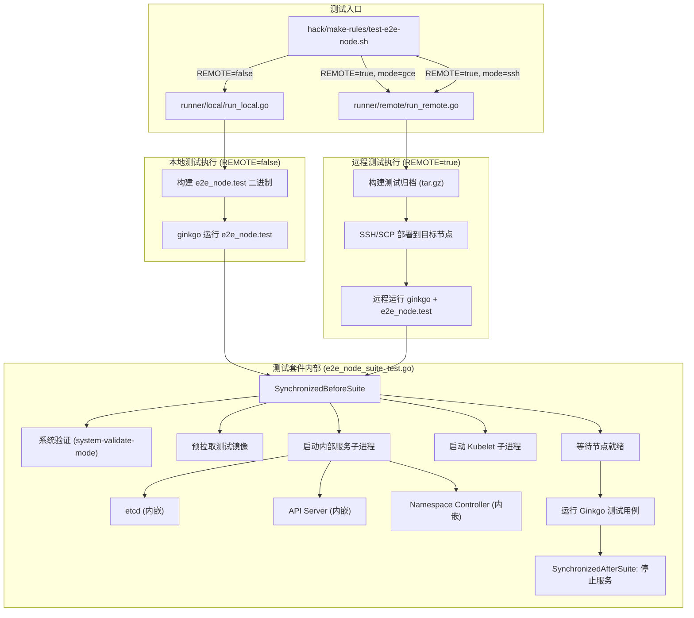
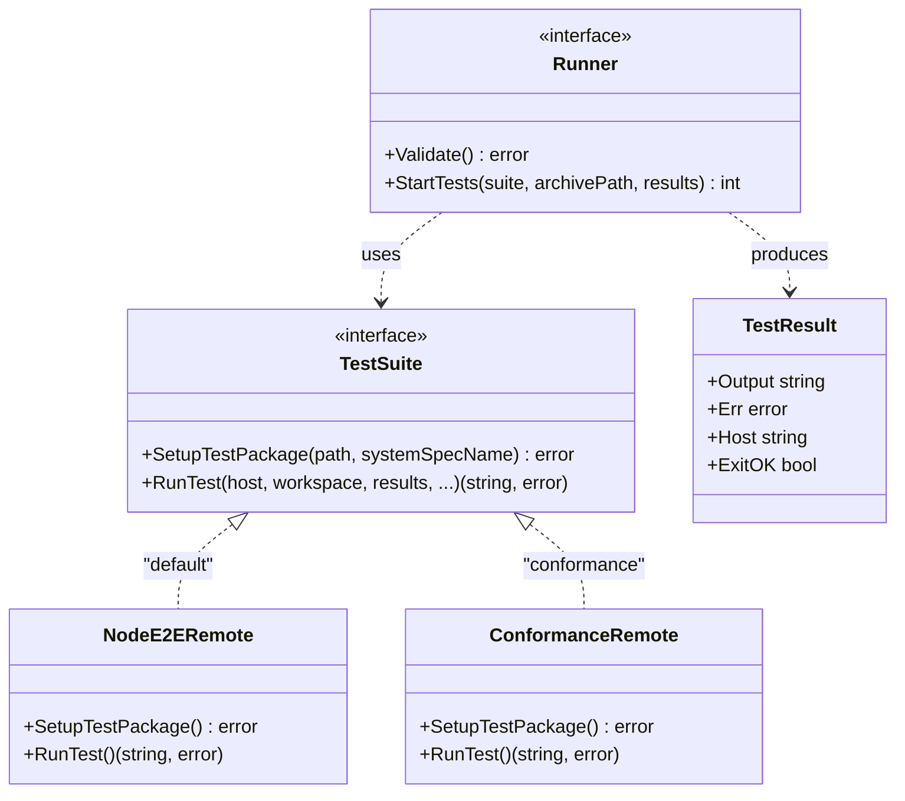

Kubernetes 的节点级别端到端测试（e2e_node）是一套专注于验证 **Kubelet 及其关联组件在单节点上行为正确性**的测试体系。与集群级别的 e2e 测试不同，e2e_node 测试在单个节点上自包含地启动一个最小化的控制面（内嵌 etcd + API Server + Namespace Controller），然后在真实 Kubelet 进程上运行测试用例。这种设计使测试能够直接触及节点内核特性、设备管理、资源隔离等无法在集群级测试中充分验证的关键路径。性能基准测试则在此基础设施之上，通过密度测试、资源用量监控和标准化工作负载，持续追踪 Kubelet 在不同负载条件下的性能表现。

Sources: [doc.go](test/e2e_node/doc.go#L1-L19), [e2e_node_suite_test.go](test/e2e_node/e2e_node_suite_test.go#L1-L69)

## 整体架构与运行模式

e2e_node 测试套件的核心架构可以用"**自举式单节点微集群**"来概括。测试二进制文件本身静态链接了 etcd、API Server 和 Namespace Controller，在 `SynchronizedBeforeSuite` 阶段以子进程方式启动这些内部服务，同时以独立进程启动 Kubelet，最终形成一个完整的单节点 Kubernetes 环境。



Sources: [test-e2e-node.sh](hack/make-rules/test-e2e-node.sh#L1-L100), [e2e_node_suite_test.go](test/e2e_node/e2e_node_suite_test.go#L234-L317)

### 三种运行模式

测试入口脚本 `hack/make-rules/test-e2e-node.sh` 通过环境变量控制三种执行模式，其核心参数如下表所示：

| 参数 | 默认值 | 说明 |
|------|--------|------|
| `REMOTE` | `false` | 是否在远程节点运行测试 |
| `REMOTE_MODE` | `gce` | 远程模式：`gce`（自动创建实例）或 `ssh`（使用已有主机） |
| `FOCUS` | `""` | Ginkgo focus 正则，匹配要运行的测试 |
| `SKIP` | `\[Flaky\]\|\[Slow\]\|\[Serial\]` | Ginkgo skip 正则，跳过的测试 |
| `PARALLELISM` | `8` | 并行测试数（仅远程模式生效） |
| `CONTAINER_RUNTIME_ENDPOINT` | `unix:///run/containerd/containerd.sock` | 容器运行时端点 |
| `KUBELET_CONFIG_FILE` | `test/e2e_node/jenkins/default-kubelet-config.yaml` | Kubelet 配置文件路径 |
| `RUN_UNTIL_FAILURE` | `false` | 持续运行直到测试失败 |
| `ARTIFACTS` | `/tmp/_artifacts/<timestamp>` | 测试产物输出目录 |

**本地模式**（`REMOTE=false`）直接在当前机器上构建并运行测试，适用于开发调试阶段。**GCE 远程模式**（`REMOTE=true, REMOTE_MODE=gce`）会在 Google Compute Engine 上创建临时 VM 实例，将测试归档通过 SCP 部署后执行。**SSH 远程模式**（`REMOTE=true, REMOTE_MODE=ssh`）面向已有的远程主机，通过 SSH 连接执行测试。

Sources: [test-e2e-node.sh](hack/make-rules/test-e2e-node.sh#L30-L58), [test-e2e-node.sh](hack/make-rules/test-e2e-node.sh#L258-L290)

### 内部服务启动机制

e2e_node 测试的二进制文件采用了一种巧妙的**自回调模式**：`TestMain` 解析标志后进入 `TestE2eNode`，该函数根据标志位决定执行路径——`--run-services-mode` 启动内部服务、`--run-kubelet-mode` 启动 Kubelet、`--system-validate-mode` 执行系统验证，否则运行完整测试套件。`E2EServices.Start()` 方法通过 `os.Executable()` 获取当前二进制路径，然后以 `--run-services-mode` 标志重新执行自身来启动内部服务子进程，这样可以将服务的日志输出与测试输出隔离。内部服务包括：

- **etcd**：使用 `etcd3testing.NewUnsecuredEtcd3TestClientServer` 创建内嵌实例
- **API Server**：以 `kube-apiserver` 的 `ServerRunOptions` 在子进程中启动，配置了测试专用的 token 文件和服务账户签名密钥
- **Namespace Controller**：在进程中以独立 goroutine 运行，负责测试命名空间的生命周期管理

Sources: [services.go](test/e2e_node/services/services.go#L32-L82), [internal_services.go](test/e2e_node/services/internal_services.go#L33-L135), [apiserver.go](test/e2e_node/services/apiserver.go#L47-L127)

### 测试套件的组织约定

所有 e2e_node 测试用例使用 `SIGDescribe`（绑定到 SIG-Node）作为顶层描述器，并广泛使用框架级别的标记进行分类：

- **`framework.WithSerial()`**：串行测试，不能并行运行（如修改 Kubelet 配置的测试）
- **`framework.WithSlow()`**：慢速测试，默认被跳过
- **`framework.WithFlaky()`**：不稳定测试，默认被跳过
- **`[Benchmark]`** 后缀：基准测试，不验证阈值，仅收集数据
- **`[Conformance]`** 标签：一致性测试，验证节点满足 Kubernetes 规范的最低要求

Sources: [framework.go](test/e2e_node/framework.go#L1-L23), [density_test.go](test/e2e_node/density_test.go#L55-L56)

## 测试分类与覆盖范围

e2e_node 测试套件涵盖了约 70 个测试文件，按验证领域可分为以下几个主要类别：

### 资源管理与调度类

| 测试文件 | 验证内容 |
|----------|----------|
| `cpu_manager_test.go` | CPU 管理器的静态分配、NUMA 亲和性策略 |
| `memory_manager_test.go` | 内存管理器的 NUMA 感知分配 |
| `topology_manager_test.go` | 拓扑管理器的资源对齐策略（best-effort/restricted/numa-aware） |
| `device_manager_test.go` | 设备管理器与 Device Plugin 的交互 |
| `device_plugin_test.go` | Device Plugin 注册、资源分配、设备热更新 |
| `hugepages_test.go` | HugePages 资源分配与隔离 |
| `memory_qos_test.go` | 内存 QoS（cgroup v2 内存保护机制） |
| `pids_test.go` | PID 限制与隔离 |
| `eviction_test.go` | 驱逐策略（内存/磁盘压力下的 Pod 驱逐顺序） |

Sources: [cpu_manager_test.go](test/e2e_node/cpu_manager_test.go#L1-L1), [eviction_test.go](test/e2e_node/eviction_test.go#L1-L1)

### 容器生命周期与运行时类

| 测试文件 | 验证内容 |
|----------|----------|
| `container_lifecycle_test.go` | 容器创建、启动、终止的完整生命周期 |
| `container_restart_test.go` | 容器重启策略与退避机制 |
| `image_pull_test.go` | 镜像拉取、缓存、凭证验证 |
| `runtime_conformance_test.go` | CRI 运行时一致性验证 |
| `runtimeclass_test.go` | RuntimeClass 配置与运行时选择 |
| `security_context_test.go` | 安全上下文（ capabilities、SELinux、AppArmor） |
| `seccompdefault_test.go` | 默认 Seccomp 配置文件应用 |
| `user_namespaces_test.go` | 用户命名空间隔离 |

### Pod 管理与网络类

| 测试文件 | 验证内容 |
|----------|----------|
| `pod_conditions_test.go` | Pod 状态条件的正确报告 |
| `pod_status_test.go` | Pod 状态转换的准确性 |
| `static_pod_test.go` | 静态 Pod 的创建、更新与删除 |
| `mirror_pod_test.go` | Mirror Pod 与静态 Pod 的同步 |
| `pod_ips.go` / `pod_host_ips.go` | Pod IP 地址分配与报告 |
| `endpoints_test.go` | Endpoints 与 Pod 网络就绪状态 |
| `network_test.go`（通过 `services`） | 网络插件与 CNI 配置 |

### 节点运维与稳定性类

| 测试文件 | 验证内容 |
|----------|----------|
| `node_shutdown_linux_test.go` | 优雅节点关闭（graceful shutdown） |
| `node_container_manager_test.go` | 节点级资源预留与 cgroup 管理 |
| `garbage_collector_test.go` | 容器与镜像的垃圾回收 |
| `critical_pod_test.go` | 系统 Critical Pod 的保护机制 |
| `kubelet_server_tls_test.go` | Kubelet TLS 证书轮转 |
| `kubelet_config_dir_test.go` | Kubelet 配置热更新 |
| `restart_test.go` | Kubelet 重启后的状态恢复 |
| `volume_manager_test.go` | 卷挂载/卸载生命周期 |

Sources: [static_pod_test.go](test/e2e_node/static_pod_test.go#L1-L1), [node_shutdown_linux_test.go](test/e2e_node/node_shutdown_linux_test.go#L1-L1), [restart_test.go](test/e2e_node/restart_test.go#L1-L1)

## 远程测试执行框架

远程执行框架是 e2e_node 测试在 CI/CD 环境中运行的关键基础设施，它负责将测试打包、部署到远程节点并收集结果。

### TestSuite 接口与注册机制

远程执行框架的核心抽象是 `TestSuite` 接口，定义了两个方法：`SetupTestPackage` 负责构建测试二进制并将所有依赖文件放入指定目录；`RunTest` 负责在远程主机上实际执行测试。框架通过注册表模式管理多种测试套件，默认注册了 `"default"`（`NodeE2ERemote`）和 `"conformance"`（`ConformanceRemote`）两种实现。



Sources: [types.go](test/e2e_node/remote/types.go#L26-L76), [node_e2e.go](test/e2e_node/remote/node_e2e.go#L36-L41), [node_conformance.go](test/e2e_node/remote/node_conformance.go#L38-L42)

### 构建与打包流程

`NodeE2ERemote.SetupTestPackage()` 执行以下步骤：首先调用 `builder.BuildGo()` 编译两组目标——需要 CGO 的目标（`cmd/kubelet`）和不需要 CGO 的目标（`e2e_node.test`、`ginkgo`、`mounter`、`gcp-credential-provider`）；然后将构建产物和 Kubelet 配置文件打包为 `e2e_node_test.tar.gz` 归档。`ConformanceRemote` 在此基础上还会构建一个 Docker 镜像，用于以容器化方式运行一致性测试。

Sources: [build.go](test/e2e_node/builder/build.go#L35-L90), [node_e2e.go](test/e2e_node/remote/node_e2e.go#L44-L103)

### 远程执行流程

`RunRemote()` 函数实现了远程测试的完整生命周期：在远程主机上创建工作目录 → SCP 传输归档 → SSH 解压归档 → 根据目标 OS 执行特定配置（如 Fedora/RHCOS 上设置 SELinux 标签、Ubuntu/COS 上启用 memcg 通知）→ 通过 SSH 执行 ginkgo 命令运行测试 → 收集测试产物和系统日志。最终的 ginkgo 执行命令形如：

```bash
./ginkgo [ginkgo-flags] ./e2e_node.test -- \
  --system-spec-name=... --system-spec-file=... \
  --extra-envs=... --runtime-config=... \
  --v 4 --node-name=<host> --report-dir=<results> \
  --image-description="..." <test-args>
```

Sources: [remote.go](test/e2e_node/remote/remote.go#L70-L186), [node_e2e.go](test/e2e_node/remote/node_e2e.go#L177-L218)

## Kubelet 动态配置管理

许多 e2e_node 测试需要在运行时修改 Kubelet 配置。测试框架提供了完整的配置管理机制：

`kubeletconfig` 包提供了从文件系统读写 KubeletConfiguration 的能力——`WriteKubeletConfigFile()` 将修改后的配置序列化写入 YAML 文件，`GetCurrentKubeletConfigFromFile()` 从文件读取当前配置。在测试中，修改 Kubelet 配置的标准流程是：获取当前配置 → 应用修改 → 写入配置文件 → 停止 Kubelet → 重启 Kubelet → 等待节点就绪。

`node_perf_test.go` 中的 `setKubeletConfig()` 函数封装了这个流程，通过 `mustStopKubelet()` 获取重启回调函数，写入新配置后调用回调重启 Kubelet，然后通过 `e2enode.TotalReady()` 轮询确认节点恢复 Ready 状态。

Sources: [kubeletconfig.go](test/e2e_node/kubeletconfig/kubeletconfig.go#L45-L107), [node_perf_test.go](test/e2e_node/node_perf_test.go#L51-L69)

## 性能基准测试体系

性能基准测试是 e2e_node 的关键组成部分，它不仅验证功能正确性，还持续追踪 Kubelet 在不同负载下的性能指标。整个基准测试体系由数据采集、指标计算和结果输出三个层次构成。

### 密度测试（Density Tests）

密度测试通过批量创建 Pod 来测量 Kubelet 的 Pod 启动延迟和资源消耗。测试分为两种模式：

**批量创建模式**（`runDensityBatchTest`）：同时创建指定数量的 Pod，使用 Informer Watch 监控每个 Pod 达到 Running 状态的时间点，计算从 Pod 创建到 Running 的端到端延迟。该模式测试 Kubelet 在突发负载下的处理能力，覆盖的参数组合包括不同的 Pod 数量（10/35/90）和创建间隔（0ms/100ms/300ms）。

**顺序创建模式**（`runDensitySeqTest`）：先创建一批背景 Pod，然后逐个顺序创建测试 Pod，每个 Pod 等待 Running 后再创建下一个。该模式测试单个 Pod 的启动延迟在背景负载下的表现。

密度测试的每个测试用例都定义了明确的性能阈值，例如批量创建 10 个 Pod 时：P50 延迟不超过 16 秒、P90 不超过 18 秒、P99 不超过 20 秒、整批完成时间不超过 25 秒；Kubelet CPU P95 不超过 0.20 核、容器运行时 CPU P95 不超过 1.5 核。

Sources: [density_test.go](test/e2e_node/density_test.go#L55-L303), [density_test.go](test/e2e_node/density_test.go#L305-L419)

### 资源用量测试（Resource Usage Tests）

资源用量测试聚焦于 Kubelet 和容器运行时在稳态下的资源消耗。测试创建指定数量的 Pause Pod，等待系统稳定后，在 10 分钟的监控窗口内持续采集资源使用数据。采集器以 10 秒为间隔，通过独立部署的 cAdvisor Pod（housekeeping 间隔 1 秒）获取 kubelet 和容器运行时的 CPU/Memory 指标。

Sources: [resource_usage_test.go](test/e2e_node/resource_usage_test.go#L39-L188)

### ResourceCollector 数据采集器

`ResourceCollector` 是性能测试的核心数据采集组件，它通过 cAdvisor 客户端 API 定期采样系统容器的资源使用情况。其工作流程为：

1. 通过进程名查找 kubelet 和容器运行时的 cgroup 容器名称
2. 连接独立 cAdvisor Pod 的 HTTP API（端口 8090）
3. 以固定间隔（密度测试 500ms，资源用量测试 10s）调用 `collectStats()` 采集 CPU 核心数、内存使用量（Total/RSS/WorkingSet）等指标
4. 通过差值计算相邻采样点之间的 CPU 使用率

Sources: [resource_collector.go](test/e2e_node/resource_collector.go#L49-L199)

### 基准测试数据输出

性能数据通过 `benchmark_util.go` 中的工具函数统一输出为 JSON 格式的性能报告，支持两种输出通道：

- **文件输出**：当 `ReportDir` 非空时，数据写入 `performance-<type>-<prefix>-<testname>.json` 文件
- **日志输出**：否则通过 `[Result:TIME]` 等标记前缀输出到构建日志

输出数据结构包括 `PerfData`（延迟百分位数、吞吐量）和 `NodeTimeSeries`（操作时间序列 + 资源使用时间序列）。延迟指标包含 P50/P90/P99/P100 四个百分位数值，以毫秒为单位；吞吐量以 pods/min 为单位。

Sources: [benchmark_util.go](test/e2e_node/benchmark_util.go#L39-L153), [perftype.go](test/e2e_node/perftype/perftype.go#L1-L35)

### API QPS 对性能的影响

密度测试中有一个专门针对 API QPS 限制的测试场景。默认 Kubelet 的 API QPS 为 5，这在实际的 Pod 创建延迟中占比可达 33%。为了测量 Kubelet 自身的真实性能，测试框架会将 `KubeAPIQPS` 临时提升到 60，然后重新运行密度测试。通过对比默认 QPS 和高 QPS 下的测试结果，可以分离出 API 限流对 Pod 启动延迟的贡献。

Sources: [density_test.go](test/e2e_node/density_test.go#L186-L231)

## 节点性能工作负载测试

节点性能工作负载测试（`node_perf_test.go`）使用标准化的高性能计算和机器学习基准程序来评估节点在真实工作负载下的表现。所有工作负载实现 `NodePerfWorkload` 接口，该接口定义了完整的生命周期管理方法。

当前注册的三个工作负载为：

| 工作负载 | 镜像 | 资源需求 | 超时 | 度量指标 |
|----------|------|----------|------|----------|
| **NPB-IS** (Integer Sort) | `node-perf-npb-is` | 15 CPU / 48Gi 内存 | 4 分钟 | 排序完成时间（秒） |
| **NPB-EP** (Embarrassingly Parallel) | `node-perf-npb-ep` | 15 CPU / 48Gi 内存 | 4 分钟 | 计算完成时间（秒） |
| **TensorFlow** (PyTorch Wide & Deep) | `node-perf-pytorch` | 15 CPU / 48Gi 内存 | 60 分钟 | 训练完成时间 |

测试执行流程严格遵守串行模式：先执行工作负载的 `PreTestExec()` 初始化 → 获取当前 Kubelet 配置 → 应用工作负载专属配置 → 重启 Kubelet → 创建并等待工作负载 Pod 完成 → 从 Pod 日志中提取性能数据 → 执行 `PostTestExec()` 清理 → 恢复原始 Kubelet 配置。测试要求节点至少拥有 15 核 CPU 和 48Gi 内存，否则自动跳过。

Sources: [node_perf_test.go](test/e2e_node/node_perf_test.go#L42-L188), [workloads.go](test/e2e_node/perf/workloads/workloads.go#L27-L53), [npb_is.go](test/e2e_node/perf/workloads/npb_is.go#L30-L93)

## 一致性测试与容器化执行

节点一致性测试（Node Conformance Test）是一种标准化的验证方式，确保节点满足 Kubernetes 规范的最低要求。`ConformanceRemote` 测试套件将测试打包为 Docker 镜像（`registry.k8s.io/node-test-<arch>:<version>`），以特权容器方式在目标节点上运行，将宿主机的根文件系统以只读方式挂载到容器的 `/rootfs` 目录。

`run_test.sh` 脚本演示了容器化一致性测试的执行方式：先在宿主机上启动 Kubelet，然后以 `--privileged --net=host` 模式运行测试容器，容器内部执行 ginkgo 并通过 `FOCUS="\[Conformance\]"` 筛选一致性测试用例。这种设计使得用户可以在任何节点上通过一条 `docker run` 命令验证节点是否符合 Kubernetes 标准。

Sources: [node_conformance.go](test/e2e_node/remote/node_conformance.go#L37-L136), [run_test.sh](test/e2e_node/conformance/run_test.sh#L39-L177)

## 探针压力测试

探针压力测试（`probe_stress_test.go`）是较新引入的测试类型，专门验证 Kubelet 在大量容器探针并发执行时的稳定性。测试创建包含 50 个容器的单个 Pod，每个容器配置 HTTP 或 TCP liveness 探针（间隔 1 秒），持续运行 2 分钟后验证没有非预期的容器重启。这类测试直接关联到生产环境中大规模 Pod 的探针可靠性问题。

Sources: [probe_stress_test.go](test/e2e_node/probe_stress_test.go#L39-L60)

## 实践指南：运行你的第一次 e2e_node 测试

### 本地运行

最简单的方式是在一台 Linux 机器上（需要 sudo 权限和容器运行时）直接执行：

```bash
# 运行所有默认测试（跳过 Flaky/Slow/Serial）
make test-e2e-node

# 只运行特定测试
FOCUS="Container Runtime" make test-e2e-node

# 运行包含 Serial 和 Slow 的完整测试
SKIP="" make test-e2e-node

# 使用标签过滤（Ginkgo v2 方式）
LABEL_FILTER="FeatureGate && !Slow" make test-e2e-node
```

Sources: [test-e2e-node.sh](hack/make-rules/test-e2e-node.sh#L30-L48), [e2e-node-test.sh](hack/e2e-node-test.sh#L25-L52)

### 远程运行（GCE）

```bash
# 在 GCE 上使用默认 COS 镜像运行
REMOTE=true make test-e2e-node

# 指定特定镜像
REMOTE=true IMAGES="cos-101-17162-127-5" make test-e2e-node

# 运行一致性测试套件
REMOTE=true TEST_SUITE=conformance make test-e2e-node
```

Sources: [test-e2e-node.sh](hack/make-rules/test-e2e-node.sh#L112-L234)

### 关键环境变量速查

| 环境变量 | 用途 | 示例 |
|----------|------|------|
| `FOCUS` | 运行匹配的测试 | `FOCUS="CPU Manager"` |
| `SKIP` | 跳过匹配的测试 | `SKIP="\[Flaky\]"` |
| `LABEL_FILTER` | Ginkgo v2 标签过滤 | `LABEL_FILTER="Serial"` |
| `REMOTE` | 远程模式开关 | `REMOTE=true` |
| `PARALLELISM` | 并行度 | `PARALLELISM=4` |
| `ARTIFACTS` | 产物目录 | `ARTIFACTS=/tmp/results` |
| `RUN_UNTIL_FAILURE` | 持续运行直到失败 | `RUN_UNTIL_FAILURE=true` |
| `KUBELET_CONFIG_FILE` | Kubelet 配置文件 | `KUBELET_CONFIG_FILE=./my-config.yaml` |

## 与相关页面的关联

e2e_node 测试在 Kubernetes 测试体系中占据独特位置——它向下深入到单节点的内核特性和资源管理细节，向上与集群级 e2e 测试形成互补。理解本文内容后，建议继续阅读：

- [测试策略总览](24-ce-shi-ce-lue-zong-lan-dan-yuan-ce-shi-ji-cheng-ce-shi-yu-duan-dao-duan-ce-shi) — 了解 e2e_node 在整体测试金字塔中的位置
- [端到端测试框架与测试套件组织](25-duan-dao-duan-ce-shi-kuang-jia-yu-ce-shi-tao-jian-zu-zhi) — 深入理解集群级 e2e 测试框架与 e2e_node 的异同
- [Kubelet Pod 生命周期管理与容器运行时交互](8-kubelet-pod-sheng-ming-zhou-qi-guan-li-yu-rong-qi-yun-xing-shi-jiao-hu) — 理解 e2e_node 测试所验证的核心组件
- [Hack 脚本与 Makefile 构建体系](29-hack-jiao-ben-yu-makefile-gou-jian-ti-xi) — 掌握构建系统如何支撑测试的编译和执行