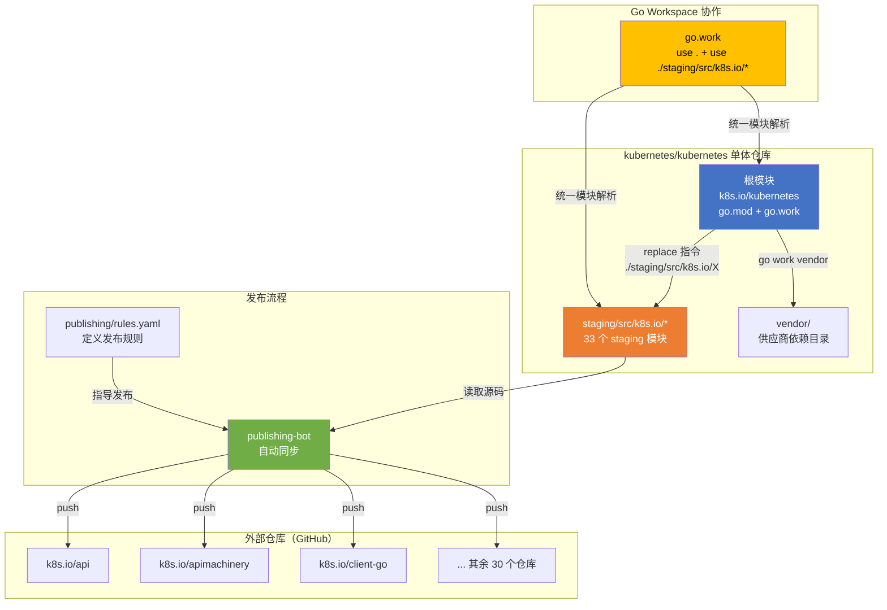
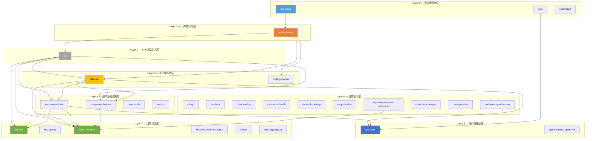
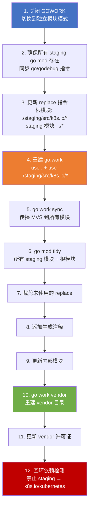

Kubernetes 项目采用了一种独特的 **Staging 仓库机制**来管理其庞大的代码库与数十个独立发布的 `k8s.io` 模块之间的关系。这一机制在单一源码仓库（monorepo）的统一开发体验与模块化独立发布之间取得了精妙的平衡。本文将深入剖析 `staging/` 目录的架构设计、Go Workspace 多模块协作、依赖传播链路、导入限制策略以及发布机器人（publishing-bot）的工作原理，帮助高级开发者理解 Kubernetes 依赖管理的第一性原理。

Sources: [README.md](staging/README.md#L1-L121)

## 设计动机与核心原则

Kubernetes 项目面临一个经典的工程困境：一方面，`k8s.io/client-go`、`k8s.io/apimachinery`、`k8s.io/api` 等库被外部生态广泛依赖，必须作为独立仓库独立发布版本；另一方面，这些库与 Kubernetes 核心代码之间存在紧密的耦合关系，在独立仓库中维护会导致开发同步成本极高。Staging 机制正是这一困境的解法——**代码的权威副本永远在 `staging/` 目录中**，开发者只需在 `kubernetes/kubernetes` 中修改一处，publishing-bot 会自动将变更同步到对应的外部仓库。

核心原则可以概括为三点：

| 原则 | 含义 | 实现机制 |
|------|------|----------|
| **单一权威源** | `staging/src/k8s.io/*` 中的代码是唯一的权威副本，外部仓库只是发布产物 | publishing-bot 单向同步 |
| **模块独立可发布** | 每个 staging 模块拥有独立的 `go.mod`，可独立编译和测试 | Go Workspace + replace 指令 |
| **依赖方向严格受控** | 模块间依赖关系遵循严格的层级，禁止循环依赖 | import-restrictions.yaml + import-boss |

Sources: [README.md](staging/README.md#L42-L59)

## 整体架构全景

下面的 Mermaid 图展示了从开发者提交代码到最终发布到外部仓库的完整数据流：



Sources: [go.mod](go.mod#L221-L255), [go.work](go.work#L1-L43), [rules.yaml](staging/publishing/rules.yaml#L1-L14)

## Go Workspace 多模块协作

### go.work：统一模块解析的枢纽

Kubernetes 使用 Go Workspace（`go.work`）将根模块与 33 个 staging 模块编织为一个统一的工作空间。这意味着当 `k8s.io/kubernetes` 的代码导入 `k8s.io/client-go` 时，Go 工具链直接将其解析到本地的 `staging/src/k8s.io/client-go` 目录，而非从远程拉取。`go.work` 文件中的 `use` 指令列出了所有参与工作空间的模块路径：

```
go 1.26.0

use (
    .
    ./staging/src/k8s.io/api
    ./staging/src/k8s.io/apimachinery
    ./staging/src/k8s.io/client-go
    ... // 共 33 个 staging 模块
)
```

Sources: [go.work](go.work#L1-L43)

### replace 指令：双层映射机制

依赖解析的关键在于 **replace 指令的双层配置**。根模块的 `go.mod` 通过 replace 将每个 staging 模块映射到本地路径：

```
replace (
    k8s.io/api => ./staging/src/k8s.io/api
    k8s.io/apimachinery => ./staging/src/k8s.io/apimachinery
    k8s.io/client-go => ./staging/src/k8s.io/client-go
    ... // 33 个映射
)
```

而每个 staging 模块内部的 `go.mod` 也使用相对路径来引用其兄弟模块。例如 `k8s.io/apiserver` 的 replace 指令：

```
replace (
    k8s.io/api => ../api
    k8s.io/apimachinery => ../apimachinery
    k8s.io/client-go => ../client-go
    k8s.io/component-base => ../component-base
    k8s.io/kms => ../kms
    k8s.io/streaming => ../streaming
)
```

所有 staging 模块之间的相互引用版本号统一为 `v0.0.0`，这个占位版本号仅在 monorepo 内部有意义——当代码被发布到外部仓库后，publishing-bot 会将其替换为实际语义化版本。

Sources: [go.mod](go.mod#L221-L255), [apiserver/go.mod](staging/src/k8s.io/apiserver/go.mod#L127-L134)

## 依赖层级与模块拓扑

通过分析各 staging 模块的 `go.mod` 中 replace 指令指向的兄弟模块，可以构建出严格的分层依赖图：



**依赖层级表**详细说明了各层的角色定位和允许的依赖方向：

| 层级 | 模块 | 核心职责 | 可依赖的下层模块 |
|------|------|----------|-----------------|
| **Layer 0** | streaming, kms, externaljwt | 最小化底层库 | 仅自身，无 k8s.io 依赖 |
| **Layer 1** | apimachinery | 运行时对象模型、序列化、元数据处理 | streaming |
| **Layer 2** | api | 所有 API 资源的类型定义（Pod, Service 等） | apimachinery |
| **Layer 3** | client-go, code-generator | 客户端库、代码生成工具 | api, apimachinery |
| **Layer 4** | component-base, component-helpers 等 | 通用组件基础设施（指标、日志、特性门控） | api, apimachinery, client-go |
| **Layer 5** | apiserver, apiextensions-apiserver | 通用 API 服务器框架 | api, apimachinery, client-go, component-base, kms |
| **Layer 6** | cri-api, controller-manager 等 | 各子系统的接口定义与控制器框架 | 对应的下层模块 |
| **Layer 7** | kubelet, kube-scheduler, kubectl 等 | 最终的可执行组件实现 | 所需的全部下层模块 |

Sources: [apimachinery/go.mod](staging/src/k8s.io/apimachinery/go.mod#L1-L54), [api/go.mod](staging/src/k8s.io/api/go.mod#L1-L42), [client-go/go.mod](staging/src/k8s.io/client-go/go.mod#L1-L68), [apiserver/go.mod](staging/src/k8s.io/apiserver/go.mod#L1-L135), [kubelet/go.mod](staging/src/k8s.io/kubelet/go.mod#L1-L65), [kube-scheduler/go.mod](staging/src/k8s.io/kube-scheduler/go.mod#L1-L91)

## 导入限制策略：依赖方向的编译时守卫

仅有依赖层级设计是不够的——Kubernetes 通过 `staging/publishing/import-restrictions.yaml` 实现了**编译时强制执行的依赖约束**。该文件为每个 staging 模块显式列出了允许导入的包列表。`import-boss` 工具在 CI 中检查所有导入语句，任何违反约束的导入都会导致构建失败。

以 `k8s.io/apimachinery` 为例，其允许导入列表极其严格：

```yaml
- baseImportPath: "./staging/src/k8s.io/apimachinery"
  allowedImports:
  - k8s.io/apimachinery
  - k8s.io/kube-openapi
  - k8s.io/streaming
  - k8s.io/utils/clock
  - k8s.io/utils/dump
  - k8s.io/utils/net
  - k8s.io/utils/strings
  - k8s.io/klog
  - k8s.io/utils/ptr
```

这意味着 `apimachinery` 作为最基础的模块之一，不能导入 `k8s.io/api`、`k8s.io/client-go` 等任何上层模块——这是防止循环依赖的根本保障。而对于 `k8s.io/kms` 和 `k8s.io/externaljwt`，约束更加极端——它们只允许导入自身：

```yaml
- baseImportPath: "./staging/src/k8s.io/kms"
  allowedImports:
  - k8s.io/kms

- baseImportPath: "./staging/src/k8s.io/externaljwt"
  allowedImports:
  - k8s.io/externaljwt
```

此外，某些模块还存在更细粒度的子包级别限制。例如 `client-go/rest` 包（排除测试代码）被限制为仅能导入 `k8s.io/apimachinery`、`k8s.io/client-go`、`k8s.io/klog` 和 `k8s.io/utils`，防止核心 REST 客户端引入不必要的类型依赖。

Sources: [import-restrictions.yaml](staging/publishing/import-restrictions.yaml#L37-L112), [import-restrictions.yaml](staging/publishing/import-restrictions.yaml#L309-L352)

## 发布机制：从 Staging 到外部仓库

### rules.yaml：发布规则定义

`staging/publishing/rules.yaml` 是发布机器人的核心配置文件，定义了 33 个目标仓库的发布规则。每条规则包含以下关键要素：

```yaml
- destination: client-go        # 目标仓库名
  library: true                  # 标记为库（影响版本号策略）
  branches:                      # 分支映射
  - name: master                 # 目标分支名
    source:
      branch: master             # 源分支名
      dirs:
      - staging/src/k8s.io/client-go  # 源目录
    dependencies:                # 该分支的依赖仓库
    - repository: apimachinery
      branch: master
    - repository: streaming
      branch: master
    - repository: api
      branch: master
    smoke-test: |                # 冒烟测试脚本
      go build -mod=mod ./...
      go test -mod=mod ./...
  - name: release-1.36           # 历史版本分支
    source:
      branch: release-1.36
      dirs:
      - staging/src/k8s.io/client-go
    dependencies:
    - repository: apimachinery
      branch: release-1.36
    ...
```

发布规则的几个关键设计点：第一，**依赖声明与分支对齐**——每个分支的 `dependencies` 必须精确指定对应分支的依赖仓库，这确保了发布的一致性。第二，**smoke-test 字段**提供了发布后的基本验证脚本。第三，`library: true` 标记影响版本号的生成策略（库模块使用 `v0.x.y`，非库模块使用 `v1.x.y`）。

Sources: [rules.yaml](staging/publishing/rules.yaml#L109-L199)

### publishing-verifier：规则正确性校验

Kubernetes 在 `hack/tools/publishing-verifier/` 中维护了一个专用校验工具，确保 `rules.yaml` 的声明与各 staging 模块 `go.mod` 的实际依赖关系完全一致。其核心逻辑包括：

1. **依赖完整性校验**：读取每个 staging 模块的 `go.mod` 中 replace 指令所引用的兄弟模块，与 `rules.yaml` 中声明的 `dependencies` 进行双向差异比对，任何多余或缺失的依赖都会触发错误
2. **master 分支一致性**：验证每个目标仓库的 master 分支确实映射到源仓库的 master 分支
3. **源目录有效性**：确保 `source.dirs` 字段正确指向对应的 staging 目录

这个校验工具通过 `hack/verify-publishing-bot.sh` 在 CI 中被调用，确保任何 PR 都不会引入不一致的发布配置。

Sources: [publishing-verifier.go](hack/tools/publishing-verifier/publishing-verifier.go#L100-L165), [verify-publishing-bot.sh](hack/verify-publishing-bot.sh#L1-L33)

## 依赖管理工具链

### hack/update-vendor.sh：全链路依赖更新

这是整个依赖管理体系中最核心的自动化脚本，执行流程如下：



脚本的关键步骤包括：**步骤 5** 中的 `go work sync` 命令会计算整个工作空间的最小版本选择（MVS），并将计算结果回写到各个模块的 `go.mod` 中；**步骤 10** 中的 `go work vendor` 将所有依赖（包括 staging 模块）扁平化到 `vendor/` 目录中；**步骤 12** 执行严格的**回环依赖检测**——确保没有任何 staging 模块（直接或间接）依赖 `k8s.io/kubernetes`，因为这会导致循环依赖和发布逻辑的破坏。

Sources: [update-vendor.sh](hack/update-vendor.sh#L145-L347)

### hack/pin-dependency.sh：依赖版本锁定

当需要更改某个第三方依赖的版本时，开发者使用 `hack/pin-dependency.sh` 脚本。该脚本不仅更新根模块的 `go.mod`，还会**自动将版本变更传播到所有 33 个 staging 模块**：

```bash
# 用法示例
hack/pin-dependency.sh github.com/docker/docker 501cb131a7b7
```

脚本执行逻辑为：首先通过 `go mod download -json` 将指定的 SHA 或 tag 解析为具体的语义化版本号，然后使用 `go mod edit -require` 更新根模块，最后遍历所有 staging 仓库执行相同的 require 操作。如果使用了 fork 仓库（`$MODULE=$REPLACEMENT` 语法），脚本还会在所有 staging 模块中添加 replace 指令。执行完毕后，脚本会提示开发者运行 `hack/update-vendor.sh` 来重建 vendor 目录。

Sources: [pin-dependency.sh](hack/pin-dependency.sh#L1-L114)

### kube::util::list_staging_repos：仓库发现函数

许多脚本依赖 `kube::util::list_staging_repos` 函数来动态发现所有 staging 仓库。该函数简单地列出 `staging/src/k8s.io/` 下的所有目录：

```bash
function kube::util::list_staging_repos() {
  (
    cd "${KUBE_ROOT}/staging/src/k8s.io" && \
    find . -mindepth 1 -maxdepth 1 -type d | cut -c 3- | sort
  )
}
```

这种动态发现机制意味着添加或删除 staging 仓库时，无需修改任何脚本逻辑——只需在 `staging/src/k8s.io/` 下创建或删除目录即可。

Sources: [util.sh](hack/lib/util.sh#L552-L560)

## Staging 仓库清单与元数据要求

当前 Kubernetes 在 staging 目录中维护了 **33 个独立模块**，每个模块对应一个独立的 GitHub 仓库。以下是完整清单及其功能定位：

| Staging 模块 | 功能定位 | 依赖层级 |
|-------------|---------|---------|
| `streaming` | 容器流式 I/O 抽象 | Layer 0 |
| `kms` | 密钥管理服务接口 | Layer 0 |
| `externaljwt` | 外部 JWT 签发器接口 | Layer 0 |
| `apimachinery` | API 机器类型系统（Scheme、 runtime、meta 等） | Layer 1 |
| `api` | 所有 API 组的类型定义 | Layer 2 |
| `client-go` | 官方 Go 客户端库 | Layer 3 |
| `code-generator` | 代码生成工具集 | Layer 3 |
| `component-base` | 组件通用基础设施 | Layer 4 |
| `component-helpers` | 组件辅助工具函数 | Layer 4 |
| `mount-utils` | 挂载操作工具库 | Layer 4 |
| `metrics` | 指标 API 类型定义 | Layer 4 |
| `apiserver` | 通用 API 服务器框架 | Layer 5 |
| `apiextensions-apiserver` | CRD API 扩展服务器 | Layer 5 |
| `cri-api` | CRI 容器运行时接口定义 | Layer 6 |
| `cri-client` | CRI 客户端库 | Layer 6 |
| `cri-streaming` | CRI 流式处理 | Layer 6 |
| `csi-translation-lib` | CSI 存储驱动翻译库 | Layer 6 |
| `cluster-bootstrap` | 集群引导工具 | Layer 6 |
| `endpointslice` | EndpointSlice 管理 | Layer 6 |
| `dynamic-resource-allocation` | 动态资源分配（DRA） | Layer 6 |
| `controller-manager` | 控制器管理器框架 | Layer 6 |
| `cloud-provider` | 云供应商接口 | Layer 6 |
| `pod-security-admission` | Pod 安全标准准入控制器 | Layer 6 |
| `kubelet` | Kubelet 组件接口 | Layer 7 |
| `kube-proxy` | Kube-proxy 组件接口 | Layer 7 |
| `kube-scheduler` | 调度器组件接口 | Layer 7 |
| `kube-controller-manager` | 控制器管理器组件接口 | Layer 7 |
| `kubectl` | kubectl 命令行工具 | Layer 7 |
| `kube-aggregator` | API 聚合器 | Layer 7 |
| `sample-apiserver` | 示例 API 服务器 | Layer 7 |
| `sample-cli-plugin` | 示例 kubectl 插件 | Layer 7 |
| `sample-controller` | 示例控制器 | Layer 7 |

每个 staging 仓库必须包含一组标准元数据文件，由 `hack/verify-staging-meta-files.sh` 在 CI 中强制检查：

```
staging/src/k8s.io/<repo>/
├── .github/PULL_REQUEST_TEMPLATE.md   # PR 模板（说明不接受直接 PR）
├── code-of-conduct.md                  # 行为准则
├── LICENSE                             # Apache 2.0 许可证
├── OWNERS                             # 代码所有者
├── README.md                          # 项目说明
└── SECURITY_CONTACTS                  # 安全联系人
```

Sources: [README.md](staging/README.md#L9-L40), [verify-staging-meta-files.sh](hack/verify-staging-meta-files.sh#L27-L34)

## 循环依赖防护体系

Kubernetes 的多模块架构中存在三类循环依赖风险，项目针对每一类都建立了**自动化的防护机制**：

**风险一：Staging 模块间循环依赖。** 通过 `import-restrictions.yaml` 中严格的 `allowedImports` 白名单，`import-boss` 工具在编译时拦截任何未授权的跨模块导入。例如 `k8s.io/api` 只能导入 `k8s.io/apimachinery`，任何尝试从 `k8s.io/api` 导入 `k8s.io/client-go` 的代码都会被拒绝。

**风险二：Staging 模块反向依赖主仓库。** `update-vendor.sh` 的最后阶段显式检测所有 staging 模块是否存在对 `k8s.io/kubernetes` 的直接或间接依赖。检测到任何此类依赖，脚本会以错误退出并列出完整的依赖路径：

```bash
# 检测 staging → k8s.io/kubernetes 的直接依赖
loopback_deps=$(go list all 2>/dev/null | grep k8s.io/kubernetes/ || true)

# 检测 k8s.io/kubernetes → X → k8s.io/kubernetes 的传递依赖
loopback_deps=$(go mod graph | grep ' k8s.io/kubernetes' || true)
```

**风险三：传递性循环依赖。** 通过 `go mod graph` 分析完整的依赖图，检测是否存在从主仓库出发、经过中间模块、又回到主仓库的传递路径。

Sources: [update-vendor.sh](hack/update-vendor.sh#L323-L345)

## 开发者操作指南

### 修改 Staging 代码

开发者可以直接编辑 `staging/src/k8s.io/<module>/` 下的代码，与编辑 `pkg/` 下的代码完全一致。Go Workspace 机制确保本地修改立即可被主仓库代码引用。修改完成后，需要运行以下命令来更新所有生成的 `go.mod` 文件和 vendor 目录：

```bash
hack/update-vendor.sh
```

Sources: [README.md](staging/README.md#L42-L59), [update-vendor.sh](hack/update-vendor.sh#L1-L10)

### 更新第三方依赖版本

```bash
# 1. 锁定依赖版本（自动传播到所有 staging 模块）
hack/pin-dependency.sh <module-path> <sha-or-tag>

# 2. 重建依赖文件和 vendor 目录
hack/update-vendor.sh
```

Sources: [pin-dependency.sh](hack/pin-dependency.sh#L17-L19)

### 添加新的 Staging 仓库

新增 staging 仓库是一个多步骤流程，需要 SIG Architecture 和相关 SIG 的批准。核心步骤包括：在 `staging/src/k8s.io/` 下创建目录并添加所有必需的元数据文件；在 `import-restrictions.yaml` 中声明允许的依赖列表；在 `rules.yaml` 中配置发布规则；在 `staging/README.md` 中注册新仓库。完成后运行 `hack/update-vendor.sh` 来自动生成 `go.mod`、`go.work` 和相关 replace 指令。

Sources: [README.md](staging/README.md#L61-L121)

## 延伸阅读

- 关于 Staging 模块中具体的构建脚本如何调用这些工具链，参见 [Hack 脚本与 Makefile 构建体系](29-hack-jiao-ben-yu-makefile-gou-jian-ti-xi)
- 关于依赖版本如何与特性门控联动影响发布版本，参见 [特性门控系统与功能生命周期管理](28-te-xing-men-kong-xi-tong-yu-gong-neng-sheng-ming-zhou-qi-guan-li)
- 关于使用 `client-go` 等 staging 产物进行开发的实践，参见 [快速上手：从源码构建 Kubernetes](2-kuai-su-shang-shou-cong-yuan-ma-gou-jian-kubernetes)