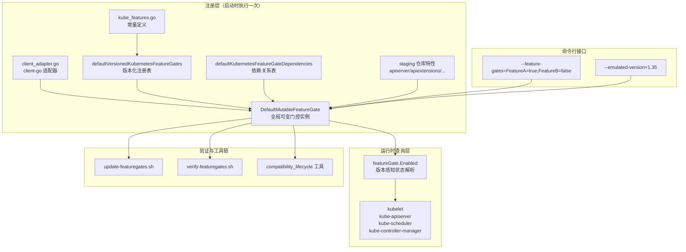
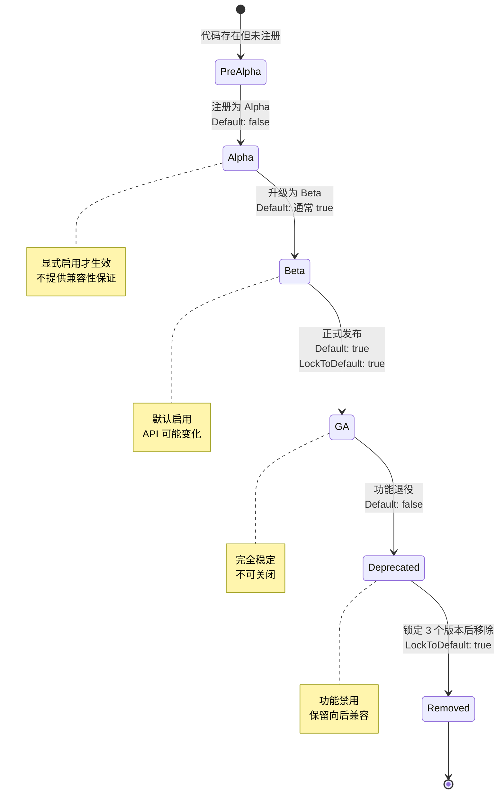
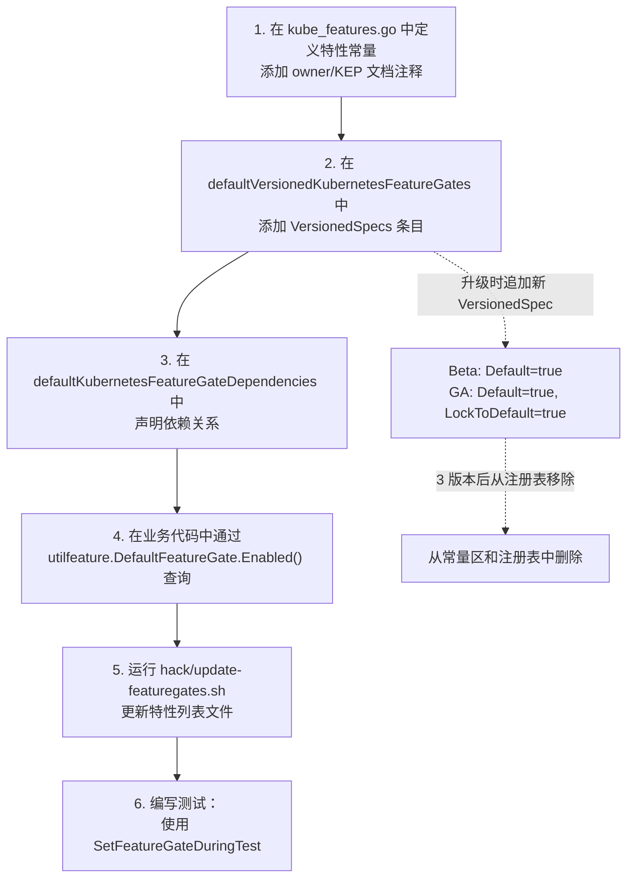

Kubernetes 的**特性门控**（Feature Gate）是一套精密的版本化功能开关机制，贯穿整个代码库，用于控制新功能的渐进式发布、兼容性保障和最终退役。本文深入剖析特性门控的核心架构、生命周期模型、依赖关系系统以及支撑其运行的工程化工具链。

## 系统架构总览

特性门控系统的设计遵循**集中注册、分散查询**的原则。所有特性在统一入口完成注册后，通过全局单例 `DefaultFeatureGate` 在整个进程中提供只读的启用状态查询。



整个系统的入口点是 `pkg/features/` 包中的 `init()` 函数。它在程序启动时将所有 Kubernetes 特有的特性门控（包括核心特性以及来自 staging 仓库的特性）注册到全局 `DefaultMutableFeatureGate` 实例中。

Sources: [feature_gate.go](staging/src/k8s.io/apiserver/pkg/util/feature/feature_gate.go#L23-L33), [kube_features.go](pkg/features/kube_features.go#L2839-L2852)

## 特性生命周期阶段

每个 Kubernetes 特性都遵循一条严格的**预发布生命周期**路径，其稳定性等级只能单向递进——不允许从高稳定级别回退到低稳定级别。



每个生命周期阶段在代码中对应 `prerelease` 类型的枚举值：

| 阶段 | 常量 | 默认值 | 可否由用户切换 | 兼容性承诺 |
|------|------|--------|---------------|-----------|
| **Pre-Alpha** | `PreAlpha` | `false` | 不可（未注册） | 无 |
| **Alpha** | `Alpha` | `false` | 可以（通过 `--feature-gates`） | 无保证，随时可能变更 |
| **Beta** | `Beta` | 通常 `true` | 可以 | 较为稳定，API 可能有细微变化 |
| **GA** | `GA`（空字符串） | `true` | 可以（但通常 `LockToDefault: true`） | 完全稳定，API 保证不变 |
| **Deprecated** | `Deprecated` | `false` | 可以（但通常后续会 `LockToDefault`） | 已退役，计划移除 |

Sources: [feature_gate.go](staging/src/k8s.io/component-base/featuregate/feature_gate.go#L130-L141)

## 版本化特性规范（VersionedSpecs）

现代 Kubernetes 使用**版本化特性规范**来记录一个特性在其完整生命周期中的每次阶段变迁。这是理解特性门控系统的关键数据结构。

一个特性的 `VersionedSpecs` 是一组按版本排序的 `FeatureSpec` 条目。运行时，特性门控根据组件的**仿真版本**（EmulationVersion）和**最小兼容版本**（MinCompatibilityVersion）从后向前查找，选取最高适用版本对应的规范：

```go
// FeatureSpec 描述一个特性在特定版本的行为
type FeatureSpec struct {
    Default       bool          // 默认启用状态
    LockToDefault bool          // 是否锁定为默认值（不可用户切换）
    PreRelease    prerelease    // 生命周期阶段
    Version       *version.Version  // 此规范生效的起始版本
    MinCompatibilityVersion *version.Version  // 最小兼容版本门槛
}
```

以 `AnyVolumeDataSource` 为例，其完整生命周期如下：

```go
AnyVolumeDataSource: {
    {Version: version.MustParse("1.18"), Default: false, PreRelease: featuregate.Alpha},
    {Version: version.MustParse("1.24"), Default: true,  PreRelease: featuregate.Beta},
    {Version: version.MustParse("1.33"), Default: true,  PreRelease: featuregate.GA, LockToDefault: true},
},
```

这意味着：
- v1.18–v1.23：Alpha 阶段，默认禁用
- v1.24–v1.32：Beta 阶段，默认启用
- v1.33+：GA 阶段，默认启用且锁定（不可用户关闭），计划在 v1.36 移除

Sources: [feature_gate.go](staging/src/k8s.io/component-base/featuregate/feature_gate.go#L74-L107), [kube_features.go](pkg/features/kube_features.go#L1261-L1265)

## 核心注册机制

### 特性声明与注册表

`pkg/features/kube_features.go` 是 Kubernetes 核心特性门控的**权威注册中心**。该文件包含三大部分：

**第一部分**（第 41–1228 行）：特性常量声明区。每个特性以类型安全的 `featuregate.Feature` 常量定义，附带文档注释说明所有者、关联的 KEP 编号和功能描述。常量按字母序排列以减少合并冲突。

**第二部分**（第 1240–2378 行）：`defaultVersionedKubernetesFeatureGates` 注册表。这是一个 `map[featuregate.Feature]featuregate.VersionedSpecs`，将每个特性常量映射到其版本化的生命周期规范。

**第三部分**（第 2386–2837 行）：`defaultKubernetesFeatureGateDependencies` 依赖关系表。

Sources: [kube_features.go](pkg/features/kube_features.go#L41-L50), [kube_features.go](pkg/features/kube_features.go#L1230-L1240), [kube_features.go](pkg/features/kube_features.go#L2380-L2386)

### init() 函数与全局门控实例

整个注册过程通过 Go 的 `init()` 机制在程序启动时自动执行。核心流程如下：

```go
func init() {
    // 1. 创建 client-go 适配器，将 client-go 的特性门控桥接到 Kubernetes 的全局实例
    ca := &clientAdapter{utilfeature.DefaultMutableFeatureGate}
    runtime.Must(clientfeatures.AddVersionedFeaturesToExistingFeatureGates(ca))
    clientfeatures.ReplaceFeatureGates(ca)

    // 2. 注册所有 Kubernetes 核心特性
    runtime.Must(utilfeature.DefaultMutableFeatureGate.AddVersioned(defaultVersionedKubernetesFeatureGates))
    // 3. 注册特性间的依赖关系
    runtime.Must(utilfeature.DefaultMutableFeatureGate.AddDependencies(defaultKubernetesFeatureGateDependencies))
    // 4. 注册 zpages 相关特性
    runtime.Must(zpagesfeatures.AddFeatureGates(utilfeature.DefaultMutableFeatureGate))
}
```

`DefaultMutableFeatureGate` 和 `DefaultFeatureGate` 的关系是一个经典的**读写分离**模式：`DefaultMutableFeatureGate` 是可变实例，仅在组件启动阶段的命令行解析中使用；`DefaultFeatureGate` 是只读接口，供运行时代码查询特性状态。

Sources: [kube_features.go](pkg/features/kube_features.go#L2839-L2852), [feature_gate.go](staging/src/k8s.io/apiserver/pkg/util/feature/feature_gate.go#L23-L33)

## 依赖关系系统

特性之间可以声明**依赖关系**——一个特性的启用可能要求另一个特性也必须启用。这在 `defaultKubernetesFeatureGateDependencies` 中定义：

```go
var defaultKubernetesFeatureGateDependencies = map[featuregate.Feature][]featuregate.Feature{
    // DRAAdminAccess 依赖 DynamicResourceAllocation
    DRAAdminAccess: {DynamicResourceAllocation},

    // DRADeviceBindingConditions 同时依赖两个特性
    DRADeviceBindingConditions: {DynamicResourceAllocation, DRAResourceClaimDeviceStatus},

    // 无依赖的特性也必须声明空切片
    AllowDNSOnlyNodeCSR: {},
}
```

依赖验证规则在注册时严格执行，具体包括四项检查：

1. **特性与依赖必须已注册**：引用未知特性将报错
2. **稳定性不可依赖更低级别**：GA 特性不能依赖 Beta/Alpha 特性
3. **默认启用的特性不能依赖默认禁用的特性**：确保默认配置的一致性
4. **锁定的特性不能依赖未锁定的特性**：确保锁定的传递性

Sources: [kube_features.go](pkg/features/kube_features.go#L2380-L2461), [feature_gate.go](staging/src/k8s.io/component-base/featuregate/feature_gate.go#L648-L700)

## 仿真版本与兼容性版本

特性门控的版本感知机制是其最精密的设计之一。`MutableVersionedFeatureGate` 接口定义了两个关键版本概念：

**仿真版本（EmulationVersion）**：决定特性门控"认为"自己运行在哪个 Kubernetes 版本。特性规范的选择基于此版本——如果仿真版本为 1.33，那么只有 `Version <= 1.33` 的 FeatureSpec 条目才会被考虑。这使得可以在新版本二进制文件中测试旧行为。

**最小兼容版本（MinCompatibilityVersion）**：在多版本控制平面滚动升级场景中，确保不同版本的组件之间保持兼容性。默认值为仿真版本减一个次版本。某些特性的默认值可能仅在所有控制平面组件都达到足够高版本时才启用。

版本解析算法 `featureSpecAtEmulationAndMinCompatVersion` 的工作方式如下：

```go
func featureSpecAtEmulationAndMinCompatVersion(v VersionedSpecs, emulationVersion, minCompatibilityVersion *version.Version) *FeatureSpec {
    i := len(v) - 1
    if minCompatibilityVersion == nil {
        minCompatibilityVersion = emulationVersion.SubtractMinor(1)
    }
    for ; i >= 0; i-- {
        // 跳过仿真版本之后的条目
        if v[i].Version.GreaterThan(emulationVersion) {
            continue
        }
        // 检查最小兼容版本门槛
        if v[i].MinCompatibilityVersion != nil && !minCompatibilityVersion.AtLeast(v[i].MinCompatibilityVersion) {
            continue
        }
        return &v[i]
    }
    // 版本之前的特性被视为 PreAlpha
    return &FeatureSpec{Default: false, PreRelease: PreAlpha, Version: version.MajorMinor(0, 0)}
}
```

Sources: [feature_gate.go](staging/src/k8s.io/component-base/featuregate/feature_gate.go#L200-L250), [feature_gate.go](staging/src/k8s.io/component-base/featuregate/feature_gate.go#L958-L978)

## 运行时使用模式

### 查询特性状态

运行时代码通过 `utilfeature.DefaultFeatureGate.Enabled()` 检查特性是否启用。这是一个全局只读查询，性能开销极低（基于 `atomic.Value` 实现的无锁读取）：

```go
// kubelet 中的典型用法
if utilfeature.DefaultFeatureGate.Enabled(features.InPlacePodVerticalScaling) {
    // 执行原地垂直缩放相关逻辑
}
```

在 Kubelet 中，这种模式被大量使用——仅 `kubelet.go` 一个文件中就有超过 30 处特性门控查询，涵盖了从容器检查点到 DRA 资源分配的各类功能分支。

Sources: [feature_gate.go](staging/src/k8s.io/component-base/featuregate/feature_gate.go#L947-L952), [kubelet.go](pkg/kubelet/kubelet.go#L2059)

### 命令行控制

用户通过 `--feature-gates` 标志控制特性启用状态。该标志由 `AddFlag` 方法注册到 `pflag.FlagSet`，接受逗号分隔的键值对：

```bash
kube-apiserver --feature-gates=DynamicResourceAllocation=true,APIResponseCompression=false
```

此外还有两个特殊的**元特性**：
- `AllAlpha=true`：一次性启用所有 Alpha 特性
- `AllBeta=true`：一次性启用所有 Beta 特性

这两个元特性的值作为基础默认值，但可以被每个特性的显式设置覆盖。

Sources: [feature_gate.go](staging/src/k8s.io/component-base/featuregate/feature_gate.go#L42-L72), [feature_gate.go](staging/src/k8s.io/component-base/featuregate/feature_gate.go#L289-L315)

## client-go 特性适配

由于 `client-go` 和 `component-base` 之间存在**循环依赖**的约束，两者各自定义了一套平行的特性门控类型。`clientAdapter` 负责将 `client-go` 的特性门控接口适配到 Kubernetes 主仓库的 `MutableFeatureGate`：

```go
type clientAdapter struct {
    mfg featuregate.MutableFeatureGate
}

// Enabled 将 client-go 的 Feature 类型桥接到 component-base 的 Feature 类型
func (a *clientAdapter) Enabled(name clientfeatures.Feature) bool {
    return a.mfg.Enabled(featuregate.Feature(name))
}
```

这确保了 `client-go` 的特性（如 CBOR 支持、CA 轮换等）在 Kubernetes 二进制中也能通过统一的 `--feature-gates` 标志控制。

Sources: [client_adapter.go](pkg/features/client_adapter.go#L26-L34), [client_adapter.go](pkg/features/client_adapter.go#L38-L40)

## 测试中的特性门控

在单元测试和集成测试中，直接修改全局 `DefaultMutableFeatureGate` 是**被禁止的**（由 `hack/verify-test-featuregates.sh` 脚本强制执行）。正确的做法是使用 `SetFeatureGateDuringTest`，它在测试开始时设置特性值，并在测试结束后自动恢复：

```go
import featuregatetesting "k8s.io/component-base/featuregate/testing"

func TestMyFeature(t *testing.T) {
    // 在此测试期间启用 DynamicResourceAllocation
    featuregatetesting.SetFeatureGateDuringTest(
        t, utilfeature.DefaultFeatureGate, features.DynamicResourceAllocation, true,
    )

    // 测试逻辑...
}
```

该机制的关键行为包括：
- **自动禁用依赖项**：当禁用一个特性时，所有依赖它的特性也会被自动禁用（除非显式覆盖）
- **测试结束后原子恢复**：所有被修改的特性值在 `tb.Cleanup` 中恢复到原始状态
- **并行测试警告**：在调用 `t.Parallel()` 的测试中使用可能导致泄漏

Sources: [feature_gate.go](staging/src/k8s.io/component-base/featuregate/testing/feature_gate.go#L43-L55), [feature_gate.go](staging/src/k8s.io/component-base/featuregate/testing/feature_gate.go#L69-L154), [verify-test-featuregates.sh](hack/verify-test-featuregates.sh#L32-L39)

## 工程化验证工具链

### 特性列表生成器（genfeaturegates）

`cmd/genfeaturegates/` 是一个独立的代码生成工具，它读取已注册的特性门控元数据并输出结构化的特性列表。支持多种输出格式和排序方式：

```bash
# 生成 Markdown 格式特性列表（默认）
go run cmd/genfeaturegates/genfeaturegates.go -output=feature_list.md

# 生成 JSON 格式，按 GA 版本排序
go run cmd/genfeaturegates/genfeaturegates.go -format=json -sort=ga

# 仅显示 Alpha 特性
go run cmd/genfeaturegates/genfeaturegates.go -stage=alpha
```

生成的 `feature_list.md` 文件是一份完整的特性门控参考表格，包含每个特性的启用状态、锁定版本、各阶段版本范围和依赖关系。

Sources: [genfeaturegates.go](cmd/genfeaturegates/genfeaturegates.go#L37-L43), [genfeaturegates.go](cmd/genfeaturegates/genfeaturegates.go#L87-L124)

### 兼容性生命周期工具（compatibility_lifecycle）

`test/compatibility_lifecycle/` 工具负责维护特性的**兼容性黄金文件** `versioned_feature_list.yaml`。它通过 AST 解析扫描 `pkg/` 和 `staging/` 目录下的所有 Go 源码，自动提取特性门控的注册信息，确保文档与代码始终保持同步。

该工具还执行关键性的**移除验证**：特性在 GA 并 `LockToDefault: true` 后，必须保留至少 3 个版本才能被移除。例如，一个在 v1.33 GA 并锁定的特性最早只能在 v1.36 移除。

Sources: [feature_gates.go](test/compatibility_lifecycle/cmd/feature_gates.go#L120-L179), [feature_gates.go](test/compatibility_lifecycle/cmd/feature_gates.go#L40-L44)

### Hack 脚本

| 脚本 | 用途 |
|------|------|
| `hack/update-featuregates.sh` | 重新生成 `versioned_feature_list.yaml` 和 `feature_list.md` |
| `hack/verify-featuregates.sh` | CI 验证：检查特性列表是否最新、特性移除是否满足 3 版本宽限期 |
| `hack/verify-test-featuregates.sh` | CI 验证：检查测试代码是否正确使用 `SetFeatureGateDuringTest` |

`verify-featuregates.sh` 的验证流程如下：首先运行 `compatibility_lifecycle` 工具验证版本化特性列表的一致性和移除策略合规性，然后运行 `genfeaturegates` 工具将输出与现有的 `feature_list.md` 进行 diff 比较，任何不一致都会导致验证失败。

Sources: [update-featuregates.sh](hack/update-featuregates.sh#L17-L32), [verify-featuregates.sh](hack/verify-featuregates.sh#L17-L51), [verify-test-featuregates.sh](hack/verify-test-featuregates.sh#L17-L45)

## 验证与合规测试

`pkg/features/kube_features_test.go` 定义了四项关键的注册完整性测试，确保特性门控系统的内部一致性：

| 测试函数 | 验证内容 |
|---------|---------|
| `TestKubeFeaturesRegistered` | 所有在 `defaultVersionedKubernetesFeatureGates` 中定义的特性都已成功注册到 `DefaultFeatureGate` |
| `TestClientFeaturesRegistered` | 所有 client-go 特性都已桥接到主 `DefaultFeatureGate` |
| `TestAllRegisteredFeaturesExpected` | `DefaultFeatureGate` 中不存在任何未在已知列表中声明的"幽灵特性" |
| `TestEnsureAlphaGatesAreNotSwitchedOnByDefault` | Alpha 特性不得默认启用或锁定到默认值 |
| `TestAllDependenciesRegistered` | 每个特性都必须在依赖关系表中显式声明依赖（即使为空） |

Sources: [kube_features_test.go](pkg/features/kube_features_test.go#L29-L104)

## 特性注册流程总结

将一个新特性引入 Kubernetes 需要遵循以下精确步骤：



这一流程确保了每个特性从 Alpha 到最终移除的全过程都在严格的版本控制和质量保障机制下进行。

## 相关主题

- [Staging 仓库机制与多模块依赖管理](27-staging-cang-ku-ji-zhi-yu-duo-mo-kuai-yi-lai-guan-li)——了解 staging 仓库中的特性门控如何与核心仓库集成
- [Hack 脚本与 Makefile 构建体系](29-hack-jiao-ben-yu-makefile-gou-jian-ti-xi)——了解构建流程中的特性门控验证环节
- [Kubelet Pod 生命周期管理与容器运行时交互](8-kubelet-pod-sheng-ming-zhou-qi-guan-li-yu-rong-qi-yun-xing-shi-jiao-hu)——查看特性门控在 Kubelet 中的大量实际应用
- [动态资源分配（DRA）与设备管理](17-dong-tai-zi-yuan-fen-pei-dra-yu-she-bei-guan-li)——DRA 子系统是特性门控依赖关系最密集的区域之一