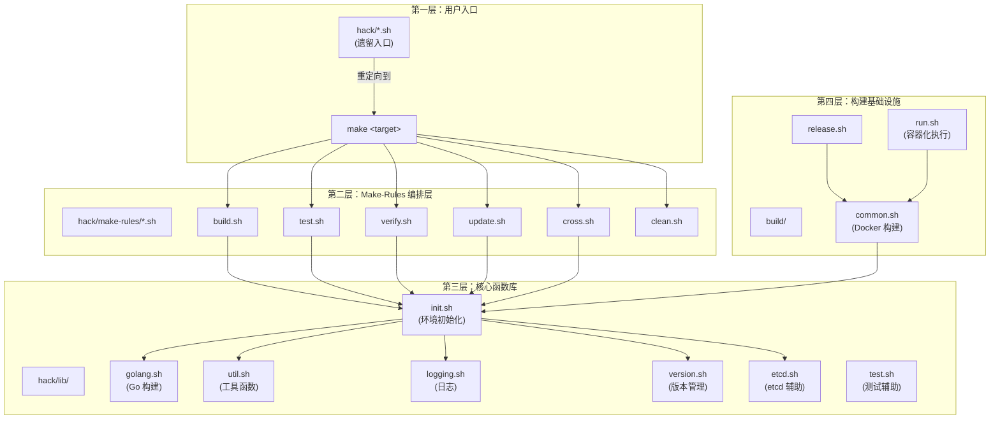
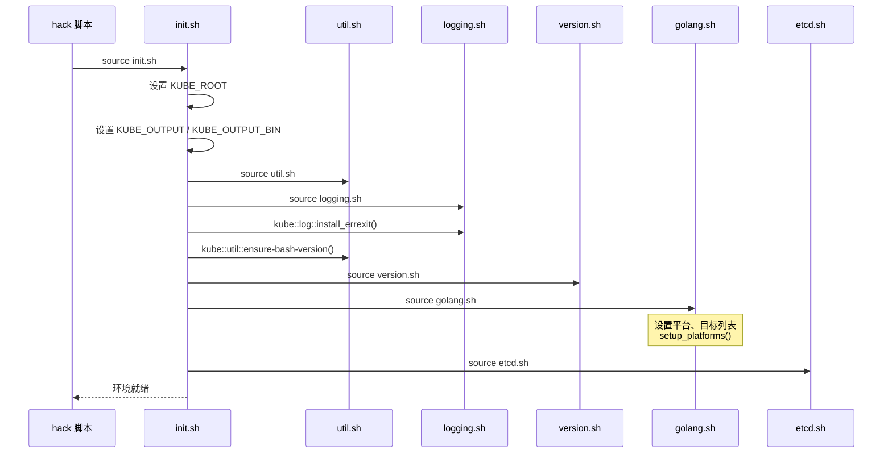
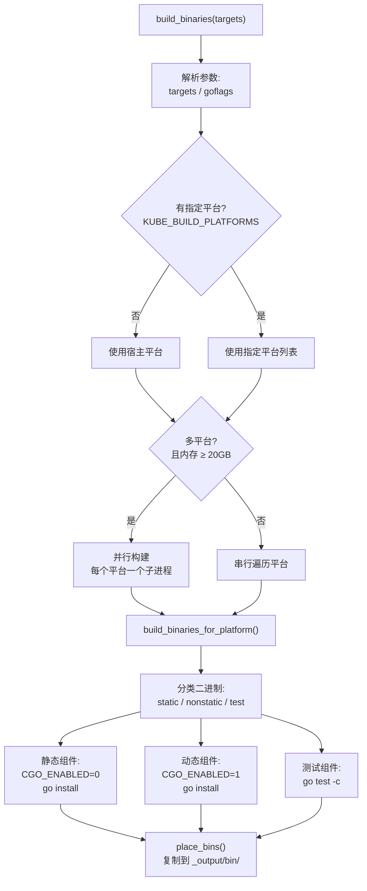
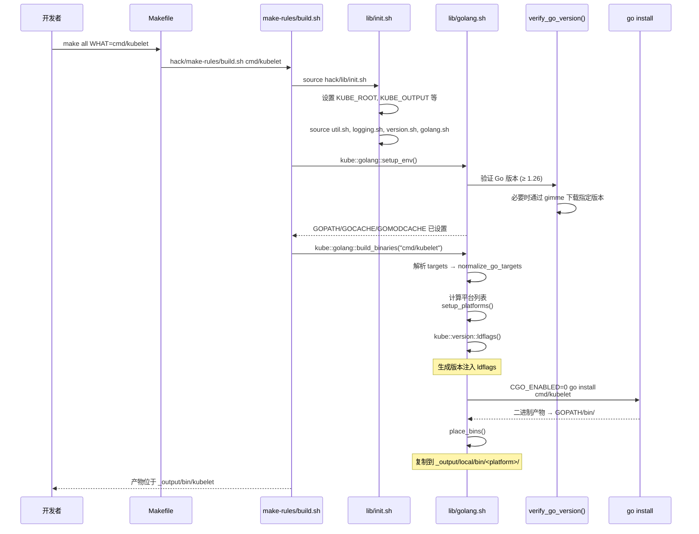

Kubernetes 的构建体系是一套以 **Makefile 为入口、hack 脚本为核心引擎、bash 函数库为基础设施** 的分层架构。它不是简单的 `go build` 封装，而是一套覆盖编译、测试、代码生成、质量验证和发布的完整工程流水线。理解这套体系，是参与 Kubernetes 开发的前提——当你执行 `make all` 时，背后究竟发生了什么？当你提交 PR 前需要运行哪些检查？本文将深入回答这些问题。

Sources: [Makefile](Makefile#L1-L1), [hack/README.md](hack/README.md#L1-L25)

## 架构总览：三层调用链

Kubernetes 构建体系的核心设计遵循一个清晰的三层调用模式：



**第一层**是开发者直接交互的入口——Makefile target 或直接调用 hack 下的脚本。**第二层**的 `hack/make-rules/` 目录充当编排层，每个 `.sh` 文件对应一个 Makefile target 的实际实现。**第三层**的 `hack/lib/` 是被广泛复用的 bash 函数库，提供 Go 环境管理、日志输出、版本计算等基础能力。**第四层**的 `build/` 目录则负责 Docker 化构建和发布流程。

Sources: [build/root/Makefile](build/root/Makefile#L15-L98), [hack/make-rules/build.sh](hack/make-rules/build.sh#L17-L30), [hack/lib/init.sh](hack/lib/init.sh#L17-L57)

## Makefile 目标体系

根目录的 `Makefile` 仅包含一行 `include build/root/Makefile`，真正的构建逻辑定义在 [build/root/Makefile](build/root/Makefile) 中。该文件采用了一种 **help-first 模式**：每个 target 都先定义一个 `*_HELP_INFO` 多行变量描述用法，再根据 `PRINT_HELP` 变量决定是输出帮助还是执行实际构建。

Sources: [Makefile](Makefile#L1-L1), [build/root/Makefile](build/root/Makefile#L1-L22)

### 核心 Makefile 目标一览

| 目标 | 对应脚本 | 功能说明 | 关键参数 |
|------|----------|----------|----------|
| `all` | `hack/make-rules/build.sh` | 编译所有 Go 组件 | `WHAT`, `GOFLAGS`, `DBG` |
| `test` / `check` | `hack/make-rules/test.sh` | 运行单元测试 | `WHAT`, `TESTS`, `KUBE_COVER` |
| `test-integration` | `hack/make-rules/test-integration.sh` | 运行集成测试 | `WHAT`, `KUBE_TEST_ARGS` |
| `test-e2e-node` | `hack/make-rules/test-e2e-node.sh` | 节点级 E2E 测试 | `FOCUS`, `SKIP`, `REMOTE` |
| `test-cmd` | `hack/make-rules/test-cmd.sh` | CLI 命令行测试 | `WHAT` |
| `verify` | `hack/make-rules/verify.sh` | 运行全部预提交检查 | `WHAT`, `BRANCH` |
| `quick-verify` | `hack/make-rules/verify.sh` | 仅运行快速检查（<10s） | — |
| `update` | `hack/make-rules/update.sh` | 运行全部代码生成/更新脚本 | — |
| `cross` | `hack/make-rules/cross.sh` | 全平台交叉编译 | `KUBE_BUILD_PLATFORMS` |
| `clean` | `hack/make-rules/clean.sh` | 清理构建产物 | — |
| `lint` | `hack/verify-golangci-lint.sh` | golangci-lint 检查 | — |
| `release` | `build/release.sh` | 构建完整发布包 | — |
| `release-images` | `build/release-images.sh` | 构建发布镜像 | `KUBE_BUILD_CONFORMANCE`, `DBG` |
| `quick-release` | `build/release.sh` | 跳过测试的快速发布 | — |
| `help` | `hack/make-rules/make-help.sh` | 打印所有目标帮助 | — |
| `kubectl` / `kubelet` 等 | `hack/make-rules/build.sh` | 编译单个 cmd 组件 | — |

Sources: [build/root/Makefile](build/root/Makefile#L67-L517)

### 构建参数详解

Makefile 通过 `SHELL := /usr/bin/env bash -o errexit -o pipefail -o nounset` 确保所有命令在严格的 bash 模式下执行，并通过 `BASH_ENV := ./hack/lib/logging.sh` 自动加载日志基础设施。几个最常用的构建参数：

- **`WHAT`**：指定构建目标，支持目录路径（`cmd/kubelet`）、Go 包路径（`./pkg/kubelet/...`）或别名（`ginkgo`）。不指定时默认构建全部目标。
- **`DBG`**：设为 `1` 时禁用编译优化和符号剥离，生成带调试信息的二进制，便于使用 delve/gdb 调试。
- **`GOFLAGS`**：传递给 `go` 命令的额外标志。
- **`KUBE_BUILD_PLATFORMS`**：指定目标平台，如 `"linux/amd64 linux/arm64"`。不指定时默认仅构建当前宿主平台。

Sources: [build/root/Makefile](build/root/Makefile#L33-L62), [build/root/Makefile](build/root/Makefile#L67-L98)

## hack/lib/ 函数库深度解析

`hack/lib/` 是整个构建体系的"内核"。所有 hack 脚本通过 `source "${KUBE_ROOT}/hack/lib/init.sh"` 加载这套共享基础设施。

### 初始化链路

[hack/lib/init.sh](hack/lib/init.sh) 执行以下关键初始化步骤：



`init.sh` 首先计算 `KUBE_ROOT`（项目根目录的绝对路径），然后设置输出目录结构：`KUBE_OUTPUT` 默认指向 `_output/local`，`KUBE_OUTPUT_BIN` 指向 `_output/local/bin`，`THIS_PLATFORM_BIN` 指向 `_output/bin`（当前平台二进制的符号链接）。接着依次加载工具函数库、日志系统、版本管理、Go 构建函数和 etcd 辅助函数。

Sources: [hack/lib/init.sh](hack/lib/init.sh#L17-L57)

### 核心库文件职责

| 库文件 | 关键命名空间 | 核心职责 |
|--------|-------------|---------|
| [golang.sh](hack/lib/golang.sh) | `kube::golang::*` | Go 版本验证、环境配置、平台管理、二进制编译、交叉编译 |
| [util.sh](hack/lib/util.sh) | `kube::util::*` | 临时目录管理、平台检测、数组操作、进程等待、trap 管理 |
| [logging.sh](hack/lib/logging.sh) | `kube::log::*` | 分级日志（error/status/info）、堆栈跟踪、errexit 处理 |
| [version.sh](hack/lib/version.sh) | `kube::version::*` | 从 git 信息派生版本号、生成 ldflags |
| [etcd.sh](hack/lib/etcd.sh) | `kube::etcd::*` | etcd 安装/启动/停止（用于集成测试） |
| [test.sh](hack/lib/test.sh) | `kube::test::*` | kubectl 测试断言、对象验证、资源清理 |
| [verify-generated.sh](hack/lib/verify-generated.sh) | `kube::verify::generated` | 通过 git worktree 对比验证生成文件 |
| [protoc.sh](hack/lib/protoc.sh) | `kube::protoc::*` | protoc 编译器安装与调用 |

Sources: [hack/lib/golang.sh](hack/lib/golang.sh#L1-L66), [hack/lib/util.sh](hack/lib/util.sh#L1-L22), [hack/lib/logging.sh](hack/lib/logging.sh#L17-L52)

### Go 构建引擎：golang.sh

[hack/lib/golang.sh](hack/lib/golang.sh) 是构建体系中最复杂的单文件（超过 1000 行），它管理着从 Go 版本检测到最终二进制产物的完整链路。

**平台支持矩阵**是 golang.sh 的基础数据结构。它定义了四类目标平台：服务端平台（Server，仅 Linux）、节点平台（Node，含 Windows）、客户端平台（Client，含 macOS 和 Windows）以及测试平台。这些平台列表通过 `kube::golang::setup_platforms()` 根据用户指定的 `KUBE_BUILD_PLATFORMS` 或 `KUBE_FASTBUILD` 变量动态裁剪为合法的交集。

**构建目标分类**将所有需要编译的二进制分为三组：

| 分类 | 包含组件 | 编译方式 |
|------|---------|---------|
| **Server targets** | kube-apiserver, kube-controller-manager, kube-scheduler, kubelet, kube-proxy, kubeadm, kube-aggregator, apiextensions-apiserver | `CGO_ENABLED=0` 静态编译 |
| **Client targets** | kubectl, kubectl-convert | 动态编译（darwin 上 kubectl 例外启用 CGO） |
| **Test targets** | ginkgo, e2e.test, go-runner, kubemark | `go test -c` 编译 |

Sources: [hack/lib/golang.sh](hack/lib/golang.sh#L23-L139), [hack/lib/golang.sh](hack/lib/golang.sh#L258-L336)

### `kube::golang::build_binaries()` 编译流程

这是整个构建体系的核心编译函数，其执行流程如下：



编译过程中，`kube::version::ldflags()` 会从 git 信息（commit hash、tag、tree state）生成版本注入参数，通过 `-ldflags` 在编译时写入 `k8s.io/client-go/pkg/version` 和 `k8s.io/component-base/version` 包。当 `DBG=1` 时，goldflags 不添加 `-s -w`（保留符号表和 DWARF 信息），gcflags 添加 `-N -l`（禁用优化和内联）。

Sources: [hack/lib/golang.sh](hack/lib/golang.sh#L923-L1027), [hack/lib/golang.sh](hack/lib/golang.sh#L815-L885), [hack/lib/version.sh](hack/lib/version.sh#L147-L183)

## Verify/Update 双模式：代码质量守门员

Kubernetes 采用 **verify/update 配对模式** 管理代码质量：`verify-*.sh` 检查代码是否符合规范，对应的 `update-*.sh` 自动修复可修复的问题。这是贡献者在提交 PR 前必须理解的核心工作流。

### verify-all 与 update-all 的调度机制

[hack/verify-all.sh](hack/verify-all.sh) 和 [hack/update-all.sh](hack/update-all.sh) 是遗留入口，它们现在仅打印提示信息后重定向到 `make verify` 和 `make update`。真正的调度逻辑在 [hack/make-rules/verify.sh](hack/make-rules/verify.sh) 和 [hack/make-rules/update.sh](hack/make-rules/update.sh) 中。

**verify.sh** 的调度策略非常精密：它遍历 `hack/verify-*.sh` 脚本，通过排除模式跳过某些不适合在特定场景运行的检查（如 Docker 化检查、License 检查、typecheck），支持 `QUICK=true` 模式只运行快速检查（10 秒内完成），还支持通过 `WHAT="gofmt typecheck"` 单独指定要运行的检查项。每个检查通过 `shell2junit` 库生成 JUnit 格式的测试报告，便于 CI 系统解析。

Sources: [hack/verify-all.sh](hack/verify-all.sh#L17-L41), [hack/make-rules/verify.sh](hack/make-rules/verify.sh#L37-L99)

### 快速检查列表（QUICK 模式）

以下检查被归类为"快速检查"，在 `make quick-verify` 时运行，通常在 10 秒内完成：

| 检查脚本 | 功能 |
|---------|------|
| `verify-api-groups.sh` | API 组合法性验证 |
| `verify-boilerplate.sh` | 文件头版权声明检查 |
| `verify-external-dependencies-version.sh` | 外部依赖版本一致性 |
| `verify-featuregates.sh` | 特性门控定义一致性 |
| `verify-fieldname-docs.sh` | 字段名文档一致性 |
| `verify-gofmt.sh` | Go 代码格式化检查 |
| `verify-imports.sh` | 导入路径合法性 |
| `verify-pkg-names.sh` | 包命名规范 |
| `verify-spelling.sh` | 拼写检查 |
| `verify-vendor-licenses.sh` | Vendor 许可证检查 |

Sources: [hack/make-rules/verify.sh](hack/make-rules/verify.sh#L80-L98)

### 典型的 verify/update 配对

以 `gofmt` 为例，[hack/verify-gofmt.sh](hack/verify-gofmt.sh) 通过 `find` 定位所有 `.go` 文件（排除 vendor、third_party、testdata），然后运行 `gofmt -d -s` 生成 diff，如果有任何输出则报错退出并提示运行 `hack/update-gofmt.sh`。对应的 [hack/update-gofmt.sh](hack/update-gofmt.sh) 执行几乎相同的文件查找，但使用 `gofmt -s -w` 直接原地修复格式。

对于更复杂的场景（如代码生成），[hack/lib/verify-generated.sh](hack/lib/verify-generated.sh) 提供了一个通用的验证框架 `kube::verify::generated()`——它创建一个 git worktree（基于当前 HEAD），在 worktree 中运行更新脚本，然后通过 `git status --porcelain` 检查是否有变更。如果有，则打印 diff 并返回失败。这种设计确保验证过程不会污染当前工作目录。

Sources: [hack/verify-gofmt.sh](hack/verify-gofmt.sh#L35-L61), [hack/update-gofmt.sh](hack/update-gofmt.sh#L30-L45), [hack/lib/verify-generated.sh](hack/lib/verify-generated.sh#L28-L63)

### update.sh 编排的更新脚本

[hack/make-rules/update.sh](hack/make-rules/update.sh) 按顺序运行以下核心更新脚本，任何一个失败即终止（除非设置 `FORCE_ALL=true`）：

1. **update-codegen** — 代码生成（客户端、informer、lister 等）
2. **update-featuregates** — 特性门控定义同步
3. **update-generated-api-compatibility-data** — API 兼容性数据
4. **update-generated-docs** — 文档生成
5. **update-openapi-spec** — OpenAPI 规范生成
6. **update-gofmt** — Go 代码格式化
7. **update-golangci-lint-config** — lint 配置更新

Sources: [hack/make-rules/update.sh](hack/make-rules/update.sh#L38-L67)

## 构建流程：从 `make all` 到二进制产物

当开发者执行 `make all WHAT=cmd/kubelet` 时，完整的执行链路如下：



Sources: [hack/make-rules/build.sh](hack/make-rules/build.sh#L17-L30), [hack/lib/golang.sh](hack/lib/golang.sh#L586-L629), [hack/lib/golang.sh](hack/lib/golang.sh#L923-L1027)

## 交叉编译与发布

### 全平台交叉编译

`make cross` 触发 [hack/make-rules/cross.sh](hack/make-rules/cross.sh)，它依次为不同的目标集合（Server、Node、Client、Test）调用 `make all`，每次传入对应平台列表：

```bash
make all WHAT="${KUBE_SERVER_TARGETS[*]}" KUBE_BUILD_PLATFORMS="${KUBE_SERVER_PLATFORMS[*]}"
make all WHAT="${KUBE_NODE_TARGETS[*]}" KUBE_BUILD_PLATFORMS="${KUBE_NODE_PLATFORMS[*]}"
make all WHAT="${KUBE_CLIENT_TARGETS[*]}" KUBE_BUILD_PLATFORMS="${KUBE_CLIENT_PLATFORMS[*]}"
...
```

当需要编译多个平台且系统内存 ≥ 20GB 时，`build_binaries()` 会自动并行执行各平台构建，否则退化为串行模式。

Sources: [hack/make-rules/cross.sh](hack/make-rules/cross.sh#L30-L39), [hack/lib/golang.sh](hack/lib/golang.sh#L982-L1025)

### 发布流水线

[build/release.sh](build/release.sh) 定义了完整的发布流程：(1) 验证前置条件（Docker 可用），(2) 在 Docker 容器中执行 `make cross` 交叉编译，(3) 可选运行测试，(4) 打包 tarball。`quick-release` 和 `quick-release-images` 变体通过设置 `KUBE_RELEASE_RUN_TESTS=n` 和 `KUBE_FASTBUILD=true` 跳过测试并仅编译当前架构，加速本地迭代。

[build/common.sh](build/common.sh) 定义了 Docker 化构建所需的所有常量：构建镜像版本（`kube-cross`）、Docker 仓库地址（`registry.k8s.io`）、容器内路径映射等。[build/run.sh](build/run.sh) 则提供了在构建容器内执行任意命令的能力。

Sources: [build/release.sh](build/release.sh#L17-L43), [build/common.sh](build/common.sh#L17-L72), [build/run.sh](build/run.sh#L17-L37)

## 开发者日常工作流

对于日常开发，以下是最常用的工作流命令：

| 场景 | 命令 | 说明 |
|------|------|------|
| 编译单个组件 | `make WHAT=cmd/kubelet` | 产物在 `_output/bin/` |
| 编译全部 | `make all` | 编译所有 Server/Client/Test 目标 |
| 调试构建 | `make WHAT=cmd/kubelet DBG=1` | 保留调试符号，可用 delve |
| 运行单元测试 | `make test WHAT=./pkg/kubelet` | 支持 race 检测 |
| 运行集成测试 | `make test-integration WHAT=./test/integration/scheduler` | 自动启动 etcd |
| 提交前检查 | `make verify` | 运行全部 verify 脚本 |
| 快速检查 | `make quick-verify` | 仅运行快速检查（~10s 级） |
| 自动修复 | `make update` | 运行代码生成和格式化 |
| 代码格式化 | `hack/update-gofmt.sh` | 仅格式化 Go 代码 |
| 清理 | `make clean` | 删除 `_output/` 目录 |

**关键原则**：在提交 PR 之前，必须先运行 `make verify`。如果验证失败，先尝试 `make update` 自动修复，然后再次验证。

Sources: [hack/README.md](hack/README.md#L19-L22), [build/root/Makefile](build/root/Makefile#L67-L98)

## hack 脚本分类索引

除了已经详述的构建、测试和验证脚本外，`hack/` 目录还包含以下功能性脚本分类：

| 分类 | 脚本示例 | 用途 |
|------|---------|------|
| **代码生成** | `update-codegen.sh`, `update-openapi-spec.sh` | 生成客户端代码、OpenAPI 规范等 |
| **依赖管理** | `update-vendor.sh`, `pin-dependency.sh`, `verify-vendor.sh` | Vendor 目录同步与验证 |
| **E2E 测试辅助** | `ginkgo-e2e.sh`, `e2e-node-test.sh` | 端到端测试执行 |
| **集群操作** | `local-up-cluster.sh`, `dev-build-and-up.sh` | 本地集群启动 |
| **性能分析** | `benchmark-go.sh`, `grab-profiles.sh` | 性能基准测试与 pprof 抓取 |
| **Cherry-pick** | `cherry_pick_pull.sh` | 自动化 cherry-pick 流程 |
| **CI/Docker化** | `jenkins/*.sh` (dockerized 版本) | Jenkins CI 环境中运行 |
| **配置** | `golangci.yaml`, `logcheck.conf` | lint 规则与日志检查配置 |

Sources: [hack/](hack/)

## 与相关页面的关系

本页面描述的构建体系与项目其他方面紧密关联：

- [Staging 仓库机制与多模块依赖管理](27-staging-cang-ku-ji-zhi-yu-duo-mo-kuai-yi-lai-guan-li) — `hack/update-codegen.sh` 的大量工作是在 staging 仓库中生成代码，理解 Staging 机制是理解构建体系的前提
- [特性门控系统与功能生命周期管理](28-te-xing-men-kong-xi-tong-yu-gong-neng-sheng-ming-zhou-qi-guan-li) — `hack/update-featuregates.sh` 和 `hack/verify-featuregates.sh` 是特性门控体系的工程保障
- [开发工作流：构建、测试与代码检查](4-kai-fa-gong-zuo-liu-gou-jian-ce-shi-yu-dai-ma-jian-cha) — 本文是其底层机制的深入展开
- [测试策略总览：单元测试、集成测试与端到端测试](24-ce-shi-ce-lue-zong-lan-dan-yuan-ce-shi-ji-cheng-ce-shi-yu-duan-dao-duan-ce-shi) — `hack/make-rules/test*.sh` 是测试执行层的实现