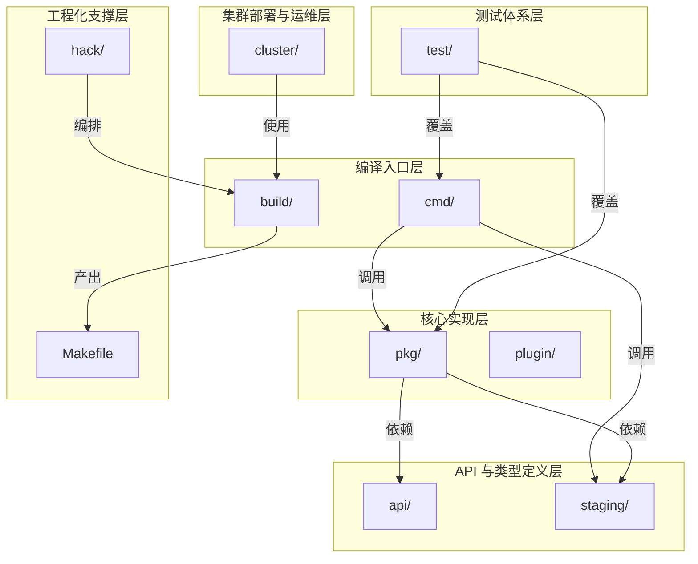
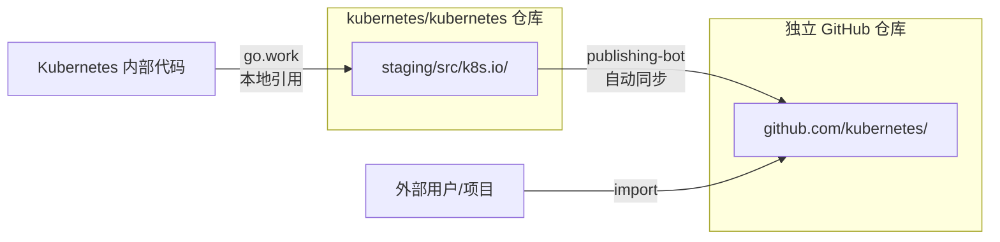

当你首次打开 Kubernetes 的源码仓库时，面对数以万计的文件和数百个目录，很容易感到无所适从。理解项目的**目录组织哲学**是导航这座代码迷宫的起点——Kubernetes 并非随意堆砌的代码集合，而是一个遵循严格分层和依赖规则的巨型工程。本文将为你拆解每一层目录的设计意图，帮助你建立清晰的**代码导航心智模型**。

Sources: [go.mod](go.mod#L7-L9), [Makefile](Makefile#L1-L1)

## 顶层目录全景图

Kubernetes 仓库的顶层结构可以划分为**六个功能域**。在深入每个目录之前，先通过下图建立全局认知：



这六个功能域构成了一个清晰的**依赖方向**：从顶层的编译入口向下依赖核心实现，核心实现再依赖底层类型定义和工具库。**依赖关系严格单向**——底层的库不会反向引用上层组件。

Sources: [build/root/Makefile](build/root/Makefile#L49-L52), [staging/README.md](staging/README.md#L42-L59)

## 顶层目录功能速查

下表汇总了每个顶层目录的核心职责与典型内容，帮助你快速定位感兴趣的代码：

| 目录 | 核心职责 | 典型内容 | 代码语言 |
|------|----------|----------|----------|
| `cmd/` | 可执行程序入口点 | kube-apiserver、kubelet、kubectl 等 main 函数 | Go |
| `pkg/` | 核心业务实现 | 控制器、调度器、kubelet、代理等核心逻辑 | Go |
| `staging/` | 外部发布子仓库暂存区 | client-go、apimachinery 等 30+ 个独立模块 | Go |
| `api/` | API 规范文件 | OpenAPI/Swagger 定义、API 发现文档 | JSON |
| `plugin/` | 插件实现 | 准入控制器（Admission Plugins）、认证授权插件 | Go |
| `hack/` | 开发脚本与验证工具 | 构建、代码生成、验证、格式化脚本 | Shell/Go |
| `build/` | 构建系统 | Docker 构建配置、发布脚本、Makefile | Shell/Dockerfile |
| `test/` | 测试套件 | e2e 测试、集成测试、性能基准测试 | Go/Shell |
| `cluster/` | 集群部署工具 | GCE 等云平台部署脚本、插件配置 | Shell |
| `docs/` | 文档占位 | 指向 kubernetes/website 仓库的引用 | — |

Sources: [staging/README.md](staging/README.md#L1-L41), [hack/README.md](hack/README.md#L1-L21), [build/README.md](build/README.md#L19-L23)

## cmd/：程序入口层

`cmd/` 目录存放了 Kubernetes **所有可编译为二进制文件**的组件入口。每个子目录对应一个独立的可执行程序，其 `main.go`（或以组件名命名的 `.go` 文件）仅负责三件事：创建 cobra 命令、委托给 `app/` 子包中的具体实现、然后退出。这是一种**入口与实现分离**的架构模式——`main` 函数极简，真正的工作由 `cmd/<component>/app/` 包承担。

以 `kube-apiserver` 为例，其入口文件 `cmd/kube-apiserver/apiserver.go` 只有短短几行，核心逻辑全部委托给 `cmd/kube-apiserver/app` 包中的 `NewAPIServerCommand()` 函数：

```go
func main() {
    command := app.NewAPIServerCommand()
    code := cli.Run(command)
    os.Exit(code)
}
```

Sources: [cmd/kube-apiserver/apiserver.go](cmd/kube-apiserver/apiserver.go#L32-L36)

`cmd/` 目录下的组件可分为三大类：

| 分类 | 组件 | 说明 |
|------|------|------|
| **核心组件** | `kube-apiserver`、`kube-controller-manager`、`kube-scheduler`、`kubelet`、`kube-proxy` | 控制平面与节点代理 |
| **工具组件** | `kubectl`、`kubeadm`、`kubectl-convert` | 命令行工具与集群引导 |
| **开发工具** | `clicheck`、`gendocs`、`genman`、`import-boss`、`dependencycheck` 等 | 文档生成、代码检查、依赖验证 |

所有核心组件的入口函数遵循完全一致的**启动模式**——通过 `k8s.io/component-base/cli` 包运行 cobra 命令，并注册 JSON 日志格式和 Prometheus 指标插件。这意味着你一旦理解了 `kube-apiserver` 的启动流程，其他组件的启动代码可以触类旁通。

Sources: [cmd/kubelet/kubelet.go](cmd/kubelet/kubelet.go#L35-L39), [cmd/kube-scheduler/scheduler.go](cmd/kube-scheduler/scheduler.go#L29-L33), [cmd/kubectl/kubectl.go](cmd/kubectl/kubectl.go#L31-L44)

## pkg/：核心实现层

`pkg/` 是 Kubernetes 最大的源码目录，包含了**所有核心组件的业务逻辑实现**。这里遵循一条关键的组织原则：`cmd/` 负责启动，`pkg/` 负责运行。当你在 `cmd/kube-apiserver/app/` 中追踪到 `CreateServerChain()` 之类的函数时，调用链很快就会深入到 `pkg/` 中的各个子包。

### pkg/ 顶层子目录分类

`pkg/` 下约 30 个子目录，按功能域可以归纳为以下几组：

| 功能域 | 子目录 | 职责描述 |
|--------|--------|----------|
| **API 类型定义** | `apis/` | 内部 API 版本的类型定义、默认值设置、转换函数、验证逻辑 |
| **API 注册与存储** | `registry/` | REST API 端点的注册、etcd 存储策略、CRUD 操作实现 |
| **控制器** | `controller/` | 30+ 个内置控制器（Deployment、ReplicaSet、Job 等） |
| **调度** | `scheduler/` | 调度框架、调度算法、扩展点接口 |
| **节点代理** | `proxy/` | iptables/IPVS/nftables 三种代理模式的实现 |
| **Kubelet** | `kubelet/` | Pod 生命周期管理、容器运行时交互、卷管理、探针 |
| **认证授权** | `auth/`、`serviceaccount/`、`securitycontext/` | RBAC、服务账户令牌、安全上下文 |
| **存储** | `volume/` | 卷插件体系（CSI、NFS、iSCSI 等） |
| **API Server** | `kubeapiserver/`、`controlplane/` | API Server 配置选项、准入控制链、控制平面编排 |
| **网络探测** | `probe/` | HTTP/TCP/Exec/gRPC 健康检查探针 |
| **工具库** | `util/`、`features/`、`quota/` | 通用工具函数、特性门控、资源配额计算 |

Sources: [pkg/.import-restrictions](pkg/.import-restrictions#L1-L15)

### pkg/apis/：API 类型系统骨架

`pkg/apis/` 是理解 Kubernetes API 设计的关键入口。每个 API 组（Group）对应一个子目录，例如 `core/`、`apps/`、`batch/`、`networking/` 等。以 `pkg/apis/core/` 为例，其内部结构揭示了一个完整的 API 类型生命周期：

```
pkg/apis/core/
├── types.go              ← 内部版本的资源类型定义（Pod、Service、Node 等）
├── register.go           ← 注册到 Scheme（GroupVersion 映射）
├── v1/                   ← v1 版本的转换与默认值
│   ├── conversion.go     ← 内部版本 ↔ v1 版本的转换逻辑
│   ├── defaults.go       ← v1 版本的默认值设置
│   ├── zz_generated.*    ← 代码生成产物（深拷贝、转换、默认值）
│   └── validation/       ← v1 版本的字段验证
├── validation/           ← 内部版本的验证逻辑
├── helper/               ← 操作 API 对象的辅助函数
└── install/              ← 将 API 组安装到 Scheme 中
```

这里有一个重要的版本管理概念：**内部版本（Internal Version）**。`types.go` 定义的是不受版本约束的内部类型，所有版本（如 v1、v1beta1）的请求都会先转换为内部版本进行处理，然后再根据需要转换回特定版本返回给客户端。`zz_generated.*` 文件由代码生成器自动产出，开发者**不应手动编辑**。

Sources: [pkg/apis/core/types.go](pkg/apis/core/types.go#L17-L42), [pkg/apis/core/register.go](pkg/apis/core/register.go#L25-L29)

### pkg/controller/：控制器集群

`pkg/controller/` 下有近 30 个子目录，每个对应一个独立的**内置控制器**。这是 Kubernetes **声明式调谐**思想的核心承载——每个控制器持续监控集群状态的变化，并驱使实际状态趋向期望状态。关键控制器包括：

| 控制器目录 | 管理的资源 | 核心逻辑 |
|------------|-----------|----------|
| `deployment/` | Deployment | 滚动更新策略（Rolling Update / Recreate） |
| `replicaset/` | ReplicaSet | Pod 副本数调谐 |
| `statefulset/` | StatefulSet | 有状态应用的有序部署与扩展 |
| `job/` | Job / CronJob | 批处理任务的完成度追踪 |
| `endpoint/` | Endpoints | Service ↔ Pod 的网络映射维护 |
| `garbagecollector/` | 所有资源 | 级联删除与对象依赖关系管理 |
| `namespace/` | Namespace | 命名空间生命周期管理 |
| `nodeipam/` | Node | 节点 IP 地址分配 |

每个控制器目录内部的文件组织遵循一致的**分层模式**——以 `deployment` 控制器为例，核心文件 `deployment_controller.go` 负责事件监听和入口分发，`sync.go` 负责主调谐循环，`rolling.go` 和 `recreate.go` 分别实现两种更新策略，`util/` 存放辅助函数。这种模式使得定位特定控制器的代码变得直觉化。

Sources: [pkg/controller/deployment](pkg/controller/deployment)

### pkg/registry/：API 注册与存储层

如果说 `pkg/apis/` 定义了"数据长什么样"，那么 `pkg/registry/` 就定义了"数据怎么存、怎么查"。每个 API 资源在 `pkg/registry/` 下都有对应的注册实现，包含 REST 策略（创建/更新/删除的验证逻辑）和 etcd 存储层。以 `pkg/registry/core/pod/` 为例：

```
pkg/registry/core/pod/
├── strategy.go           ← REST 操作策略（创建/更新验证、允许的操作）
├── storage/              ← etcd 存储实现（REST 映射）
└── rest/                 ← 非标准 REST 端点（如 subresources：exec、log、port-forward）
```

Sources: [pkg/registry/core](pkg/registry/core)

## staging/：外部发布子仓库暂存区

`staging/` 是 Kubernetes 项目中最独特的设计之一——它是一个**影子仓库集群**。虽然这些代码物理上存在于 `kubernetes/kubernetes` 仓库中，但它们在逻辑上属于独立的 `k8s.io/<name>` 仓库，会被定期自动发布（publish）到各自的独立 GitHub 仓库中。



这种设计解决了一个核心矛盾：Kubernetes 需要**保持整体编译的便利性**（所有代码在一个仓库中），同时也要让**外部项目能够独立引用**子模块（如 `k8s.io/client-go`）。Go Workspace（`go.work`）机制使得 Kubernetes 内部代码可以直接引用 `staging/` 下的模块，无需先发布到远程仓库。当你在 Kubernetes 源码中看到 `import "k8s.io/client-go/..."` 时，这个导入实际上被 Go workspace 解析到 `staging/src/k8s.io/client-go/` 目录。

Sources: [staging/README.md](staging/README.md#L42-L59), [go.work](go.work#L1-L42)

目前 `staging/` 下管理着 30+ 个独立模块，以下列出最重要的几个：

| 暂存模块 | 独立仓库 | 核心用途 |
|----------|----------|----------|
| `client-go` | kubernetes/client-go | 与 API Server 交互的官方 Go 客户端库 |
| `apimachinery` | kubernetes/apimachinery | API 机器框架（Scheme、编解码、元数据） |
| `api` | kubernetes/api | OpenAPI 类型定义（Pod、Service 等的 Go 结构体） |
| `apiserver` | kubernetes/apiserver | 构建 API Server 的通用框架 |
| `kubectl` | kubernetes/kubectl | kubectl 命令行工具的核心实现 |
| `component-base` | kubernetes/component-base | 组件基础库（CLI、日志、指标） |
| `code-generator` | kubernetes/code-generator | 代码生成工具集（DeepCopy、ClientSet 等） |
| `kubelet` | kubernetes/kubelet | Kubelet 的可复用逻辑 |

**关键规则**：`staging/` 目录下的代码是**权威源（authoritative）**——你修改 `staging/` 中的代码就等于修改了对应的独立仓库。切勿直接编辑独立仓库的文件。

Sources: [staging/README.md](staging/README.md#L1-L41), [go.work](go.work#L8-L9)

## api/：API 规范文件

`api/` 目录与 `pkg/apis/` 不同——它不包含 Go 源码，而是存放**机器可读的 API 规范文件**，供工具链和外部系统消费：

| 子目录 | 内容 | 用途 |
|--------|------|------|
| `openapi-spec/` | `swagger.json`（v2）和 `v3/` 下的 OpenAPI v3 规范 | 自动生成客户端 SDK、API 文档 |
| `discovery/` | 聚合 API 发现文档（`aggregated_v2.json`、各 API 组的 JSON） | API Server 的发现端点返回数据 |

Sources: [api/openapi-spec](api/openapi-spec), [api/discovery](api/discovery)

## plugin/：准入控制与认证授权插件

`plugin/` 目录存放了 Kubernetes 的**准入控制器（Admission Controllers）**和**认证授权插件**。准入控制器是在资源持久化到 etcd 之前拦截请求的插件机制。这里有近 30 个内置准入插件，例如：

- `ResourceQuota`：限制命名空间资源使用量
- `LimitRanger`：为 Pod 注入默认资源限制
- `PodSecurity`：实施 Pod 安全标准
- `NodeRestriction`：限制 kubelet 只能修改自身节点的信息
- `ServiceAccount`：自动为 Pod 挂载服务账户令牌

Sources: [plugin/pkg/admission](plugin/pkg/admission)

## hack/ 与 build/：构建与工程化

### hack/：开发自动化脚本集

`hack/` 目录是 Kubernetes 开发者的"瑞士军刀"，包含了**代码生成、验证、更新**三大类脚本。这些脚本的核心设计原则是：**提交 PR 前运行 `hack/verify-all.sh`，如有失败运行 `hack/update-all.sh`**。

`hack/` 中的脚本分为以下几类：

| 类别 | 典型脚本 | 作用 |
|------|----------|------|
| **代码生成** | `update-codegen.sh`、`update-openapi-spec.sh` | 生成 DeepCopy、ClientSet、OpenAPI 规范等 |
| **代码验证** | `verify-*.sh`（约 40 个） | 检查代码格式、导入规则、boilerplate、拼写等 |
| **代码更新** | `update-*.sh`（约 15 个） | 自动修复验证发现的问题 |
| **构建辅助** | `make-rules/` | 底层构建脚本（build、test、clean 等） |
| **测试执行** | `test-go.sh`、`ginkgo-e2e.sh` | 运行单元测试和端到端测试 |
| **工具配置** | `boilerplate/`、`golangci.yaml` | 代码模板和 lint 配置 |

Sources: [hack/README.md](hack/README.md#L1-L21)

### build/：容器化构建系统

`build/` 目录管理 Kubernetes 的**容器化构建流程**。构建系统以 Docker 容器为隔离环境，确保跨平台一致性。主 Makefile 实际上只是重定向到 `build/root/Makefile`，后者定义了所有核心目标（`all`、`test`、`verify`、`release` 等）。构建产物统一输出到 `_output/` 目录。

Sources: [Makefile](Makefile#L1-L1), [build/root/Makefile](build/root/Makefile#L67-L98), [build/README.md](build/README.md#L37-L51)

## test/：测试体系

`test/` 目录包含了 Kubernetes 庞大的测试基础设施。不同类型的测试分布在不同的子目录中：

| 目录 | 测试类型 | 说明 |
|------|----------|------|
| `test/e2e/` | 端到端测试 | 部署完整集群后运行，验证跨组件行为 |
| `test/e2e_node/` | 节点级端到端测试 | 专注 kubelet 和节点行为的测试 |
| `test/e2e_kubeadm/` | kubeadm 端到端测试 | 验证 kubeadm 集群引导流程 |
| `test/e2e_dra/` | DRA 端到端测试 | 动态资源分配功能的验证 |
| `test/integration/` | 集成测试 | 多组件协作的集成验证（无需完整集群） |
| `test/conformance/` | 一致性测试 | 验证实现是否符合 Kubernetes 规范 |
| `test/fuzz/` | 模糊测试 | 输入变异测试（CBOR、JSON、YAML 解析） |
| `test/images/` | 测试镜像 | 测试中使用的容器镜像定义 |
| `test/cmd/` | CLI 测试脚本 | kubectl 命令行的 shell 级测试 |
| `test/utils/` | 测试工具库 | 测试辅助函数（JUnit 输出、PKI 辅助等） |

Sources: [test/e2e](test/e2e), [test/integration](test/integration)

## cluster/：集群部署工具集

`cluster/` 目录提供了在多种云平台上**部署和管理 Kubernetes 集群**的脚本集。虽然现代部署更倾向于使用 kubeadm 或托管服务，但这里仍然保留了 GCE（Google Compute Engine）等平台的部署支持，也包含了一些关键的集群管理脚本：

- `kube-up.sh` / `kube-down.sh`：集群的创建与销毁
- `validate-cluster.sh`：验证集群健康状态
- `addons/`：集群附加组件（DNS、Calico 网络策略、Metrics Server 等）
- `gce/`：GCE 平台的特定配置和部署脚本

Sources: [cluster/README.md](cluster/README.md), [cluster/kube-up.sh](cluster/kube-up.sh)

## 代码治理文件

Kubernetes 项目使用了一套完善的**代码治理体系**，体现在以下几类文件中：

| 文件/目录 | 作用 |
|-----------|------|
| `OWNERS`（各目录下） | 定义代码审阅者（reviewers）和批准者（approvers），每个目录都可以有自己的 OWNERS 文件 |
| `OWNERS_ALIASES` | 定义 OWNERS 文件中引用的组别名（如 `sig-architecture-approvers`） |
| `.import-restrictions` | 限制包的导入方向（例如防止 `pkg/` 导入 `cmd/`） |
| `CONTRIBUTING.md` | 贡献指南 |
| `SECURITY_CONTACTS` | 安全问题联系方式 |
| `LICENSE` / `LICENSES/` | 许可证信息（Apache 2.0）及第三方许可 |

其中 `.import-restrictions` 文件是维持代码库健康的关键机制。例如 `pkg/.import-restrictions` 明确禁止 `pkg/` 中的代码导入 `cmd/` 包，确保了**单向依赖**的架构约束不被破坏。

Sources: [OWNERS](OWNERS#L1-L37), [pkg/.import-restrictions](pkg/.import-restrictions#L1-L15)

## 导航策略：如何找到你想看的代码

面对如此庞大的代码库，掌握正确的**导航方法**比死记目录结构更重要。以下提供三种常用策略：

**策略一：从用户操作逆推。** 如果你想理解 `kubectl apply` 的实现，追踪路径是：`cmd/kubectl/` → `pkg/kubectl/cmd/` → `staging/src/k8s.io/kubectl/`。通过命令入口追踪调用链，自然抵达核心实现。

**策略二：从 API 资源定位。** 如果你想理解某种资源（如 Pod）的完整处理链路，追踪路径是：`pkg/apis/core/types.go`（类型定义）→ `pkg/apis/core/validation/`（验证）→ `pkg/registry/core/pod/strategy.go`（REST 策略）→ `pkg/registry/core/pod/storage/`（etcd 存储）。

**策略三：从组件入手。** 如果你想深入某个控制平面组件，直接从 `cmd/<component>/app/` 开始，沿调用链向下追踪到 `pkg/` 中对应的子目录。

Sources: [cmd/kube-apiserver/apiserver.go](cmd/kube-apiserver/apiserver.go#L29-L36), [pkg/apis/core/types.go](pkg/apis/core/types.go#L17-L25)

## 下一步阅读

掌握了目录结构后，建议按以下顺序继续探索：

1. [开发工作流：构建、测试与代码检查](4-kai-fa-gong-zuo-liu-gou-jian-ce-shi-yu-dai-ma-jian-cha) — 学会如何在本地编译和验证代码
2. [控制平面组件总览与协作关系](6-kong-zhi-ping-mian-zu-jian-zong-lan-yu-xie-zuo-guan-xi) — 深入理解各组件如何协作
3. [API 资源定义与类型系统（pkg/apis）](12-api-zi-yuan-ding-yi-yu-lei-xing-xi-tong-pkg-apis) — 理解 API 类型系统的版本管理机制
4. [Staging 仓库机制与多模块依赖管理](27-staging-cang-ku-ji-zhi-yu-duo-mo-kuai-yi-lai-guan-li) — 深入理解 staging 的发布流程
5. [Hack 脚本与 Makefile 构建体系](29-hack-jiao-ben-yu-makefile-gou-jian-ti-xi) — 深入理解构建与验证工具链