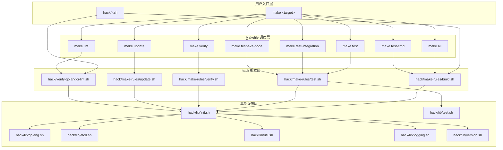
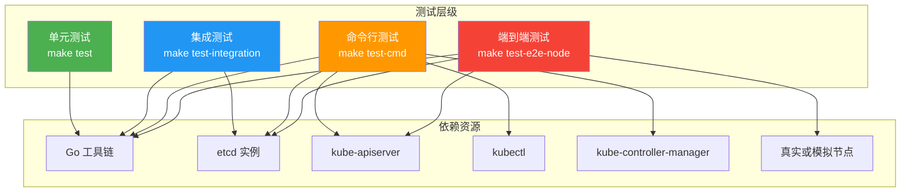
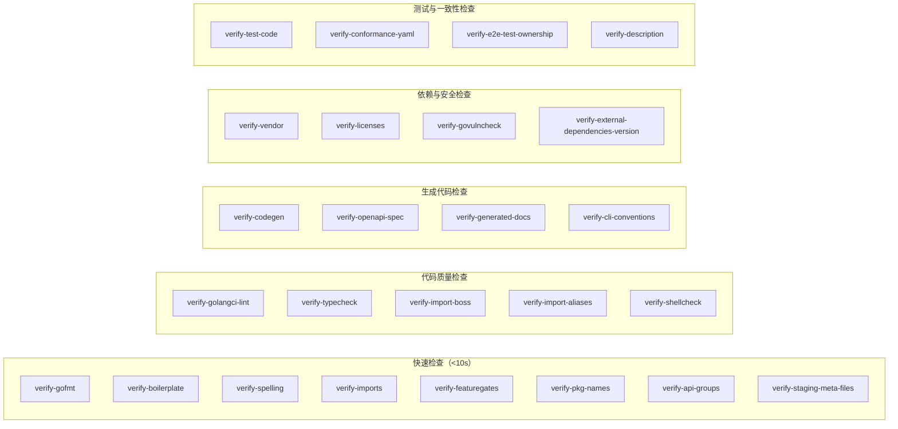
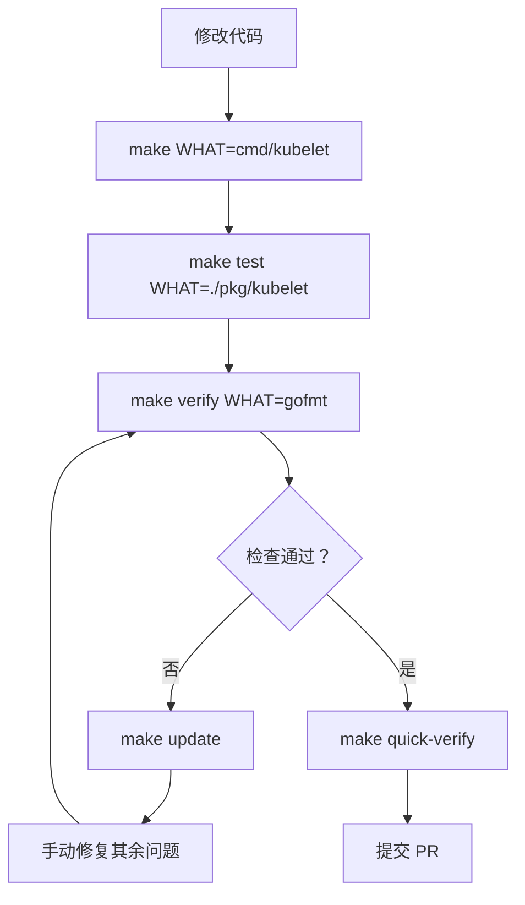

Kubernetes 项目的开发工作流建立在三层自动化工具之上——**Makefile 入口层**、**hack 脚本调度层**和 **shell 函数库基础设施层**——共同构成了一个严密的"构建→测试→检查"闭环。理解这个工作流对于高效贡献代码至关重要：它不仅决定了你如何编译二进制、运行测试套件，还定义了代码合并前必须通过的数十项自动化质量门禁。本文将从架构总览入手，逐步深入每个环节的核心机制与实际用法。

Sources: [Makefile](Makefile#L1-L1), [build/root/Makefile](build/root/Makefile#L1-L98)

## 工作流架构总览

开发工作流的核心调度入口是 `build/root/Makefile`，它通过顶层 `Makefile` 的符号链接被暴露到项目根目录。每个 `make` 目标对应一个 `hack/make-rules/` 下的 Bash 脚本，而这些脚本又依赖于 `hack/lib/` 中的函数库来管理 Go 环境、etcd 实例和版本信息。这种分层架构确保了开发者既可以通过 `make` 命令获得简洁的交互界面，又能直接调用底层脚本进行精细控制。



`hack/lib/init.sh` 是整个脚本基础设施的引导入口。它首先检测自身是否已被加载（通过 `kube::init::loaded` 函数检查防止重复加载），然后设置关键的路径变量：`KUBE_OUTPUT`（构建输出根目录，默认为 `_output/local`）、`KUBE_OUTPUT_BIN`（二进制输出目录）和 `THIS_PLATFORM_BIN`（指向当前平台二进制的符号链接）。接着它按依赖顺序加载所有函数库，并声明了项目中可用的全部 API GroupVersion 列表。

Sources: [hack/lib/init.sh](hack/lib/init.sh#L21-L57), [build/root/Makefile](build/root/Makefile#L90-L98)

## 构建体系

### 核心构建命令

Kubernetes 的构建系统围绕 `make all` 目标展开，其核心调用链为 `Makefile → hack/make-rules/build.sh → kube::golang::build_binaries`。构建流程分为三个阶段：**环境准备**（`kube::golang::setup_env`）、**二进制编译**（`kube::golang::build_binaries`）和**产物归位**（`kube::golang::place_bins`）。

| 命令 | 功能 | 关键参数 |
|------|------|----------|
| `make all` | 构建所有二进制目标 | `WHAT`：指定目标，`DBG=1`：调试模式 |
| `make kubectl` | 仅构建 kubectl | 同上 |
| `make kube-apiserver` | 仅构建 kube-apiserver | 同上 |
| `make cross` | 跨平台编译所有目标 | `KUBE_BUILD_PLATFORMS` |
| `make clean` | 清理所有构建产物 | 无 |

`WHAT` 变量是构建系统最灵活的控制点。当省略 `WHAT` 时，系统构建 `KUBE_ALL_TARGETS` 中定义的全部目标——包括所有服务端、客户端、测试二进制和 kubemark。指定具体路径（如 `cmd/kubelet`）则只构建对应组件。`DBG=1` 参数会禁用编译优化（`-N -l`），保留符号表和 DWARF 调试信息，使二进制可直接与 Delve 等 debugger 配合使用。

Sources: [hack/make-rules/build.sh](hack/make-rules/build.sh#L17-L29), [build/root/Makefile](build/root/Makefile#L67-L98)

### 平台与目标分类

构建系统将所有目标分为四类，每类对应一组支持的平台矩阵：

| 目标类别 | 包含的二进制 | 支持平台 |
|----------|-------------|----------|
| **Server** | kube-apiserver, kube-controller-manager, kube-scheduler, kube-proxy, kubelet, kubeadm, kube-aggregator, apiextensions-apiserver, kube-log-runner, mounter | linux/amd64, linux/arm64, linux/s390x, linux/ppc64le |
| **Node** | kube-proxy, kubeadm, kubelet, kube-log-runner | linux/amd64, linux/arm64, linux/s390x, linux/ppc64le, windows/amd64 |
| **Client** | kubectl, kubectl-convert | 全部客户端平台（含 darwin、windows 等） |
| **Test** | ginkgo, e2e.test, go-runner | linux/darwin/windows 多架构 |

跨平台构建时（`make cross`），系统会检测可用内存是否达到 `KUBE_PARALLEL_BUILD_MEMORY`（默认 20GB）阈值。内存充足时各平台并行编译，否则退回串行模式以避免 OOM。编译产物放置在 `_output/local/bin/<os>_<arch>/` 目录下，同时通过 `_output/bin` 符号链接指向当前平台目录。

Sources: [hack/lib/golang.sh](hack/lib/golang.sh#L23-L66), [hack/lib/golang.sh](hack/lib/golang.sh#L69-L83), [hack/lib/golang.sh](hack/lib/golang.sh#L916-L994)

### 静态链接与覆盖率构建

大部分核心二进制（kube-apiserver、kube-controller-manager 等）以静态链接方式编译（`CGO_ENABLED=0`），而 kubectl 在 darwin 上编译时例外——它启用 CGO 以确保原生系统集成正常。当设置 `KUBE_BUILD_WITH_COVERAGE` 时，构建系统会为被覆盖率工具插桩的包生成临时测试入口（`zz_generated_*_test.go`），以 `go test -c` 方式编译而非 `go install`，测试完成后自动清理。

Sources: [hack/lib/golang.sh](hack/lib/golang.sh#L338-L371), [hack/lib/golang.sh](hack/lib/golang.sh#L770-L811)

## 测试体系

Kubernetes 的测试按隔离级别和依赖范围分为四个层级，每层对应不同的 `make` 目标和执行策略。



### 单元测试（make test）

单元测试是最基础也是最常用的测试层。`make test` 调用 `hack/make-rules/test.sh`，它执行以下流程：

1. **包发现**：通过 `kube::test::find_go_packages` 扫描工作区所有模块中有 `_test.go` 文件的包，但显式排除 e2e、e2e_node、integration 等非单元测试目录
2. **工具准备**：自动安装 `gotestsum`（替代原生 `go test` 输出）和 `prune-junit-xml`（精简 JUnit 报告）
3. **并发执行**：使用 gotestsum 以 `pkgname-and-test-fails` 格式运行测试，支持 JUnit XML 报告生成

| 环境变量 | 默认值 | 说明 |
|----------|--------|------|
| `KUBE_RACE` | `-race` | 竞态检测器，设为空字符串可禁用 |
| `KUBE_TIMEOUT` | `-timeout=180s` | 单个包测试超时 |
| `KUBE_COVER` | `n` | 设为 `y` 启用覆盖率收集 |
| `KUBE_JUNIT_REPORT_DIR` | `${ARTIFACTS}` | JUnit XML 报告目录 |
| `PARALLEL` | `-1`（由 Go 决定） | 并发 worker 数量 |
| `WHAT` | 全部单元测试包 | 指定测试目标 |

测试框架默认启用两个重要的调试机制：`KUBE_CACHE_MUTATION_DETECTOR=true` 检测不当的缓存修改（帮助发现并发安全问题），`KUBE_PANIC_WATCH_DECODE_ERROR=true` 在 watch 解码错误时触发 panic（而非静默忽略）。

Sources: [hack/make-rules/test.sh](hack/make-rules/test.sh#L24-L200), [hack/make-rules/test.sh](hack/make-rules/test.sh#L203-L287)

### 集成测试（make test-integration）

集成测试在单元测试基础上引入了真实的 **etcd 实例**。`hack/make-rules/test-integration.sh` 的工作流是：首先检查 etcd 是否可用（若缺失则提示运行 `hack/install-etcd.sh`），然后启动 etcd 并设置退出时的清理 trap，最后以 `-short=true` 标志调用 `make test` 运行 `test/integration/` 下的测试包。

集成测试的默认超时为 600 秒（是单元测试的 3.3 倍），并且默认禁用竞态检测器和 watch 解码 panic（因为集成测试可能故意注入非法数据）。可通过 `KUBE_INTEGRATION_TEST_MAX_CONCURRENCY` 控制并发度。

Sources: [hack/make-rules/test-integration.sh](hack/make-rules/test-integration.sh#L24-L123)

### 命令行测试（make test-cmd）

命令行测试是最贴近用户场景的验证层。它完整启动 kube-apiserver 和 kube-controller-manager，然后通过 kubectl 执行真实的 CRUD 操作来验证端到端的命令行行为。脚本流程包括：构建并启动 apiserver（配置 RBAC + AlwaysAllow 授权模式）→ 构建 controller-manager → 创建模拟节点对象 → 运行 `test/cmd/legacy-script.sh` 中定义的各类测试函数。

`WHAT` 变量可以指定只运行特定命令的测试（如 `make test-cmd WHAT=deployment`），这使得定位特定功能的回归问题非常高效。

Sources: [hack/make-rules/test-cmd.sh](hack/make-rules/test-cmd.sh#L32-L200)

### 节点端到端测试（make test-e2e-node）

节点级端到端测试是最重的测试层，需要在真实节点环境中运行。它支持本地模式（`REMOTE=false`）和远程模式（`REMOTE=true`，可在 GCE 或 SSH 主机上执行），支持通过 `FOCUS`/`SKIP` 正则表达式或 Ginkgo 的 `LABEL_FILTER` 查询语言过滤测试。详细的参数配置（如容器运行时端点、系统规格、镜像配置等）请参阅 [测试策略总览](24-ce-shi-ce-lue-zong-lan-dan-yuan-ce-shi-ji-cheng-ce-shi-yu-duan-dao-duan-ce-shi) 和 [节点级别测试](26-jie-dian-ji-bie-ce-shi-e2e_node-yu-xing-neng-ji-zhun-ce-shi)。

Sources: [build/root/Makefile](build/root/Makefile#L218-L293)

## 代码检查体系

代码检查（Verification）是 Kubernetes CI 中最广泛的质量门禁。`make verify` 调度 `hack/make-rules/verify.sh`，该脚本会扫描所有 `hack/verify-*.sh` 脚本并逐一执行。整个体系包含 **47 个独立的检查脚本**，覆盖从代码格式到 API 兼容性的各个维度。



Sources: [hack/make-rules/verify.sh](hack/make-rules/verify.sh#L37-L98)

### 检查的分层过滤

`verify.sh` 实现了一套灵活的检查过滤机制：

- **排除模式**（`EXCLUDED_PATTERNS`）：始终跳过的检查，如 `verify-all.sh`（防止循环）、dockerized 脚本等
- **快速模式**（`QUICK=true`）：仅运行 10 秒内可完成的快速检查（`make quick-verify`），适合本地开发迭代
- **分类排除**：通过环境变量 `EXCLUDE_TYPECHECK`、`EXCLUDE_GODEP`、`EXCLUDE_GOLANGCI_LINT`、`EXCLUDE_READONLY_PACKAGE` 按类别跳过在 CI 中独立运行的检查
- **精确选择**：`make verify WHAT="gofmt typecheck"` 可只运行指定的检查

每个检查的结果被 `shell2junit` 库包装为 JUnit XML 格式，便于 CI 系统解析和展示。失败的检查会汇总在最终输出中。

Sources: [hack/make-rules/verify.sh](hack/make-rules/verify.sh#L100-L165)

### golangci-lint 静态分析

Kubernetes 使用 golangci-lint v2 作为核心静态分析引擎，配置文件位于 `hack/golangci.yaml`。它启用了以下 **12 个 linter**：

| Linter | 用途 |
|--------|------|
| `depguard` | 限制特定包的导入 |
| `forbidigo` | 禁止特定函数调用（如不应在非测试代码中使用的 API） |
| `ginkgolinter` | Ginkgo/Gomega 断言最佳实践 |
| `gocritic` | 代码风格与性能建议 |
| `govet` | Go vet 内置检查 |
| `ineffassign` | 检测无效赋值 |
| `kubeapilinter` | Kubernetes API 类型规范检查 |
| `logcheck` | 结构化日志和上下文日志合规检查 |
| `modernize` | 建议使用更现代的 Go 惯用法 |
| `revive` | 代码风格（替代 golint） |
| `sorted` | 特性门控排序检查（Kubernetes 自研插件） |
| `staticcheck` | 综合静态分析 |
| `testifylint` | testify 断言最佳实践 |
| `unused` | 检测未使用的代码 |

其中 `logcheck`、`kubeapilinter` 和 `sorted` 是 Kubernetes 项目的**自定义插件**，以 Go plugin（`.so` 文件）形式动态加载。`logcheck` 检查结构化日志和上下文日志（contextual logging）的使用规范，确保已迁移的包使用正确的日志模式。`kubeapilinter` 则验证 API 类型定义是否符合 Kubernetes API 约定——包括注释格式、条件字段标记、整型约束等。

`make lint` 是直接调用 golangci-lint 的快捷方式。开发者还可以使用 `hack/verify-golangci-lint.sh -a` 只检查相对于 `origin/master` 的增量代码变更，大幅加速 PR 预检。

Sources: [hack/verify-golangci-lint.sh](hack/verify-golangci-lint.sh#L17-L141), [hack/golangci.yaml](hack/golangci.yaml#L14-L289)

### 代码格式与拼写

**gofmt 检查**（`verify-gofmt.sh`）是最基础的格式门禁。它扫描所有 `.go` 文件（排除 `_output`、`vendor`、`third_party`、`testdata`），通过 `gofmt -d -s` 检测格式偏差。修复方法是对应的 `hack/update-gofmt.sh`。

**Boilerplate 检查**（`verify-boilerplate.sh`）确保每个源文件包含正确的 Apache 2.0 许可证头部。它使用 `hack/boilerplate/boilerplate.py` Python 脚本根据文件类型（`.go`、`.sh`、`.py`、`Makefile` 等）匹配对应的模板。

**拼写检查**（`verify-spelling.sh`）使用 `misspell` 工具检测常见英文拼写错误，通过 `hack/.spelling_failures` 文件维护已知的例外列表。

**Shell 脚本检查**（`verify-shellcheck.sh`）使用 shellcheck v0.9.0 对所有 Bash 脚本进行静态分析，排除了与 Kubernetes 代码风格不兼容的规则（SC1090、SC1091、SC2230）。

Sources: [hack/verify-gofmt.sh](hack/verify-gofmt.sh#L35-L60), [hack/verify-boilerplate.sh](hack/verify-boilerplate.sh#L26-L41), [hack/verify-spelling.sh](hack/verify-spelling.sh#L28-L41), [hack/verify-shellcheck.sh](hack/verify-shellcheck.sh#L31-L119)

### 导入与依赖检查

Kubernetes 维护了多层次的导入纪律：

- **`verify-imports.sh`**：使用 `cmd/importverifier` 工具，根据 `staging/publishing/import-restrictions.yaml` 中的规则检查各 staging 仓库之间的导入边界，防止循环依赖和不当的跨层引用
- **`verify-import-boss.sh`**：运行 `cmd/import-boss` 检查 `.import-restrictions` 文件中声明的包级导入限制
- **`verify-import-aliases.sh`**：确保所有导入使用 `hack/.import-aliases` 中注册的标准化别名
- **`verify-vendor.sh`**：最重的依赖检查之一。它在一个干净的临时目录中重建 vendor 树，然后与当前 vendor 目录做 diff 对比，同时验证所有 staging 仓库的 `go mod tidy` 一致性

Sources: [hack/verify-imports.sh](hack/verify-imports.sh#L26-L34), [hack/verify-vendor.sh](hack/verify-vendor.sh#L30-L108)

### 类型检查与代码生成

**`verify-typecheck.sh`** 对整个工作区执行快速类型检查（不生成代码），验证跨平台编译的一致性。它使用 `test/typecheck` 工具扫描 `go work edit -json` 列出的所有模块包。

**`verify-codegen.sh`** 是最关键的一致性检查之一——它验证所有自动生成的代码（deep-copy 函数、client 绑定、informer、lister 等）与源定义保持同步。任何 API 类型的变更都必须伴随代码重新生成。

**`verify-openapi-spec.sh`** 确保 OpenAPI 规范文件与实际的 API 类型定义一致。

Sources: [hack/verify-typecheck.sh](hack/verify-typecheck.sh#L24-L49)

## 更新与修复

当代码检查失败时，大多数情况可以通过 `make update` 自动修复。`hack/make-rules/update.sh` 按顺序执行一组更新脚本：

| 更新脚本 | 修复内容 |
|----------|----------|
| `update-codegen` | 重新生成 deep-copy、client、informer、lister 等代码 |
| `update-featuregates` | 更新特性门控注册表 |
| `update-generated-api-compatibility-data` | 更新 API 兼容性数据 |
| `update-generated-docs` | 重新生成文档 |
| `update-openapi-spec` | 重新生成 OpenAPI 规范 |
| `update-gofmt` | 格式化所有 Go 代码 |
| `update-golangci-lint-config` | 从 `golangci.yaml.in` 重新生成 lint 配置 |

`make update` 默认以短路模式运行——如果某个脚本失败，后续脚本不会执行。设置 `FORCE_ALL=true` 可强制运行所有脚本。对于单独的修复，直接调用对应的 `hack/update-*.sh` 脚本更为高效。

Sources: [hack/make-rules/update.sh](hack/make-rules/update.sh#L38-L67)

## 典型开发流程

一个完整的代码贡献周期如下：



对于日常开发迭代，建议使用以下命令组合快速验证变更：

```bash
# 1. 构建特定组件
make WHAT=cmd/kube-apiserver

# 2. 调试模式构建（配合 delve）
make WHAT=cmd/kube-apiserver DBG=1

# 3. 运行特定包的单元测试（带竞态检测和详细输出）
make test WHAT=./pkg/kubelet GOFLAGS=-v

# 4. 只检查变更文件的 lint
hack/verify-golangci-lint.sh -a

# 5. 运行快速检查
make quick-verify

# 6. 自动修复格式和生成代码问题
make update

# 7. 完整验证（提交 PR 前）
make verify
```

Sources: [build/root/Makefile](build/root/Makefile#L91-L98), [build/root/Makefile](build/root/Makefile#L139-L167)

## 下一步阅读

- 要深入了解各测试层级的详细机制，请阅读 [测试策略总览：单元测试、集成测试与端到端测试](24-ce-shi-ce-lue-zong-lan-dan-yuan-ce-shi-ji-cheng-ce-shi-yu-duan-dao-duan-ce-shi)
- 要理解构建系统底层的脚本架构和 Makefile 组织，请参考 [Hack 脚本与 Makefile 构建体系](29-hack-jiao-ben-yu-makefile-gou-jian-ti-xi)
- 要了解多模块依赖如何影响构建流程，请阅读 [Staging 仓库机制与多模块依赖管理](27-staging-cang-ku-ji-zhi-yu-duo-mo-kuai-yi-lai-guan-li)
- 在提交 PR 前，请确保已阅读 [贡献指南与社区规范](5-gong-xian-zhi-nan-yu-she-qu-gui-fan)