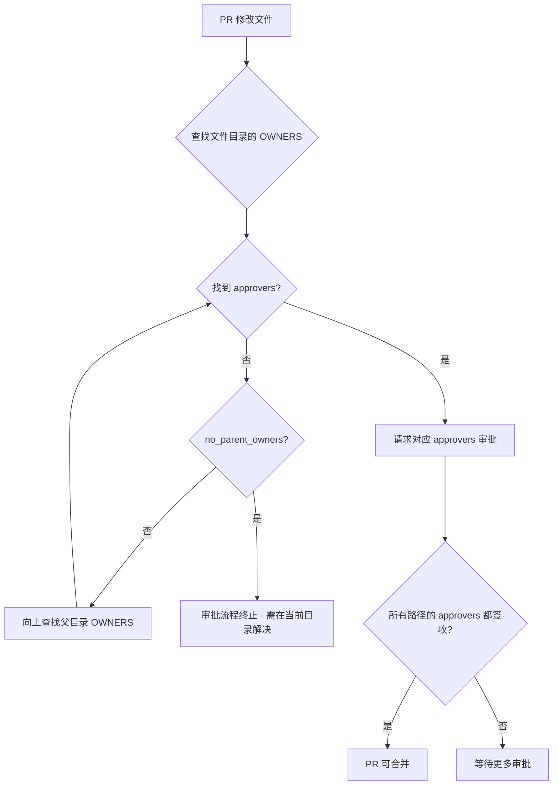
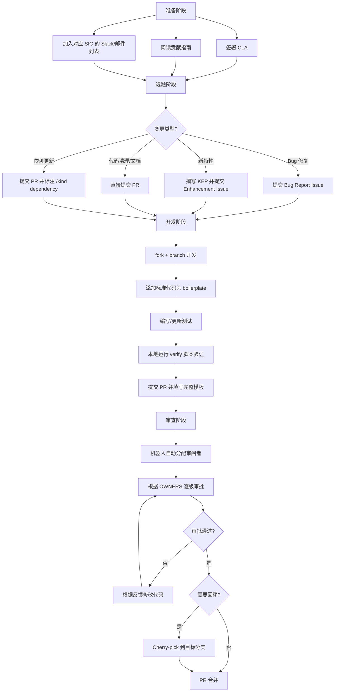

Kubernetes 是全球规模最大的开源项目之一，其代码仓库（`kubernetes/kubernetes`）承载着数百万行 Go 源码和数千名贡献者的协作成果。本页系统梳理了参与 Kubernetes 代码贡献所需的全部知识框架——从法律前置条件（CLA 签署、Apache 2.0 许可）到技术规范（代码头检查、导入限制），再到治理机制（OWNERS 审批体系、SIG 组织架构）和协作流程（Issue 模板、PR 模板、Cherry-pick 流程）。理解这些规范不仅是提交代码的前提，更是理解一个超大规模开源项目如何运转的关键入口。Sources: [CONTRIBUTING.md](CONTRIBUTING.md#L1-L10), [code-of-conduct.md](code-of-conduct.md#L1-L4)

## 贡献前置条件：法律与许可

### CLA 签署

向 Kubernetes 贡献代码的**第一道门槛**是签署 Contributor License Agreement（CLA）。这是一项不可跳过的法律前提——未签署 CLA 的 Pull Request 将被自动化机器人自动标记为不可合并。CLA 本质上是确保贡献者授予 CNCF（Cloud Native Computing Foundation）在其项目框架下使用、复制、修改和分发所提交代码的合法权利。签署流程通过 GitHub 身份验证完成，通常在首次提交 PR 后由 `k8s-ci-robot` 引导完成。

Sources: [CONTRIBUTING.md](CONTRIBUTING.md#L7-L9)

### Apache 2.0 许可证

Kubernetes 采用 **Apache License 2.0** 作为项目许可证。这一许可证的核心条款包括：授予永久的、全球性的、非独占的、免费的版权许可；授予专利许可（但附带报复性条款——如果贡献者对项目发起专利诉讼，其专利许可将自动终止）；要求分发修改后的文件时保留原始版权声明和许可证文本。对于贡献者而言，最直接的实操含义是：**每个新增源文件都必须携带标准许可证头**。

Sources: [LICENSE](LICENSE#L1-L67)

### 代码头（Boilerplate）规范

Kubernetes 通过自动化脚本强制执行代码头合规检查。项目在 `hack/boilerplate/` 目录下维护了多种文件类型的标准模板——Go 文件使用 `.go.txt`，Shell 脚本使用 `.sh.txt`，Python 文件使用 `.py.txt`，Makefile 使用 `.Makefile.txt`。以 Go 文件为例，每个源文件的开头必须包含以下格式：

```go
/*
Copyright The Kubernetes Authors.

Licensed under the Apache License, Version 2.0 (the "License");
you may not use this file except in compliance with the License.
You may obtain a copy of the License at

    http://www.apache.org/licenses/LICENSE-2.0

Unless required by applicable law or agreed to in writing, software
distributed under the License is distributed on an "AS IS" BASIS,
WITHOUT WARRANTIES OR CONDITIONS OF ANY KIND, either express or implied.
See the License for the specific language governing permissions and
limitations under the License.
*/
```

值得注意的是，**2025 年后新增文件不再需要在版权行中标注年份**——这是项目在 `boilerplate.py` 脚本中实施的策略变更。验证工具 `hack/verify-boilerplate.sh` 会在 CI 中自动运行，确保所有文件头部与参考模板精确匹配。

Sources: [hack/boilerplate/boilerplate.go.txt](hack/boilerplate/boilerplate.go.txt#L1-L17), [hack/boilerplate/boilerplate.py](hack/boilerplate/boilerplate.py#L190-L193), [hack/verify-boilerplate.sh](hack/verify-boilerplate.sh#L17-L41)

## 行为准则

Kubernetes 社区遵循一套明确的行为准则（Code of Conduct），其权威版本托管在 `kubernetes/community` 仓库中。行为准则适用于所有社区空间——包括 GitHub Issue/PR 讨论、Slack 频道、邮件列表和社区会议。核心原则涵盖：以尊重和包容的态度对待所有参与者；避免歧视性或冒犯性语言；以建设性方式处理技术分歧。违反行为准则的行为可由社区管理员介入处理，严重者可能被社区驱逐。

Sources: [code-of-conduct.md](code-of-conduct.md#L1-L4)

## OWNERS 审批体系：代码治理的核心机制

OWNERS 文件是 Kubernetes 代码审查和合并决策的**基石设施**。它定义了每个目录层级上的代码审阅者（reviewers）和审批者（approvers），构成了一个层层嵌套的权限委派网络。

### OWNERS 文件结构

每个 OWNERS 文件支持以下关键字段：

| 字段 | 作用 | 说明 |
|------|------|------|
| `reviewers` | 代码审阅者 | PR 作者可从该列表中请求 Review |
| `approvers` | 代码审批者 | 拥有 `/approve` 权限，可批准 PR 合并 |
| `emeritus_approvers` | 荣誉审批者 | 曾经的审批者，保留记录但不再活跃审批 |
| `labels` | 自动标签 | 当 PR 涉及该目录下的文件时自动添加 |
| `options.no_parent_owners` | 禁止父级继承 | 阻止向父目录的 OWNERS 寻求审批 |
| `filters` | 文件匹配规则 | 针对特定文件模式指定不同的审批人 |

根目录 OWNERS 文件展示了这套机制的高级用法——它通过正则过滤器（`filters`）对不同类型的文件指定了不同的审批流：`go.mod`/`go.sum` 等依赖文件由 `dep-approvers` 审批；`metrics.go` 文件自动打上 `sig/instrumentation` 标签；其他根级文件则由 `sig-architecture-approvers` 审批。这种精细化控制确保了不同领域的代码由领域专家把关。

Sources: [OWNERS](OWNERS#L1-L37), [OWNERS](OWNERS#L21-L36)

### OWNERS_ALIASES：权限别名体系

`OWNERS_ALIASES` 文件是整个项目权限分配的**中央注册表**。它定义了数十个别名（aliases），将 GitHub 用户名映射到功能角色和 SIG（Special Interest Group）组织。以下是一些关键别名及其职责：

| 别名 | 职责范围 |
|------|----------|
| `dep-approvers` / `dep-reviewers` | `go.mod`/`go.sum` 依赖变更的审批 |
| `api-approvers` / `api-reviewers` | API 类型定义（`types.go`）变更的全局审批 |
| `sig-api-machinery-approvers` | API Machinery SIG 核心组件审批 |
| `sig-auth-*-approvers` | 认证/授权各子领域的分层审批 |
| `sig-node-approvers` | Kubelet 及节点管理相关代码审批 |
| `sig-storage-approvers` | 存储卷插件与 CSI 相关代码审批 |
| `release-engineering-approvers` | 发布工程与变更日志审批 |
| `feature-approvers` | 特性门控相关变更的跨 SIG 审批 |
| `conformance-behavior-approvers` | 一致性测试行为定义的审批 |

别名体系的设计哲学是**最小权限原则**——每个审批者只在特定领域拥有权威，跨领域变更需要多个审批者共同确认。`api-approvers` 是权限最高的组之一，因为 API 变更影响所有下游消费者。

Sources: [OWNERS_ALIASES](OWNERS_ALIASES#L1-L604)

### 目录级 OWNERS 的层级继承

OWNERS 文件在目录树中形成**自下而上的继承链**。当 PR 修改某个文件时，Prow 机器人会从该文件所在目录开始，逐级向上查找 OWNERS 文件，直到找到足够数量的审批者签收。例如，修改 `cmd/kube-apiserver/` 下的文件时，审批权限由 `cmd/kube-apiserver/OWNERS` 定义，其中指定了 `sig/api-machinery` 和 `area/apiserver` 标签，审批者包括 `deads2k`、`liggitt`、`sttts` 等 API Machinery 领域的专家。

关键例外是 `no_parent_owners: true` 选项——当子目录设置此选项后，PR 将**不会**向上查找父目录的审批者。这在以下场景中尤为重要：

- `pkg/apis/OWNERS`：所有 API 类型定义变更必须由 `api-approvers` 审批，防止绕过 API 审查流程
- `staging/OWNERS`：Staging 仓库变更必须由项目级维护者审批
- `CHANGELOG/OWNERS`：变更日志由 Release Engineering 团队专属管控



Sources: [cmd/kube-apiserver/OWNERS](cmd/kube-apiserver/OWNERS#L1-L31), [pkg/apis/OWNERS](pkg/apis/OWNERS#L1-L18), [staging/OWNERS](staging/OWNERS#L1-L37), [CHANGELOG/OWNERS](CHANGELOG/OWNERS#L1-L18)

### API 审查流程

API 变更在 Kubernetes 中被视为**最高影响的变更类型**之一。`pkg/apis/` 目录的 OWNERS 配置了 `no_parent_owners: true`，并通过正则过滤器 `[^/]+/([^/]+/)?(register|types)\.go$` 自动为所有涉及 `types.go` 或 `register.go` 的 PR 打上 `kind/api-change` 标签。这意味着 API 变更必须经过 `api-approvers` 中至少一人的显式批准。这些审批者（`deads2k`、`liggitt`、`smarterclayton`、`thockin`、`msau42`）几乎都是项目的 founding engineer 级别贡献者，确保了 API 的向后兼容性和设计一致性。

Sources: [pkg/apis/OWNERS](pkg/apis/OWNERS#L1-L18), [OWNERS_ALIASES](OWNERS_ALIASES#L359-L364)

## Issue 模板：结构化问题报告

Kubernetes 在 `.github/ISSUE_TEMPLATE/` 中定义了四种结构化 Issue 模板，每种模板针对不同类型的问题收集特定信息，帮助维护者快速理解和分类问题。

### Issue 模板分类

| 模板 | 标签 | 用途 | 关键必填字段 |
|------|------|------|-------------|
| **Bug Report** | `kind/bug` | 报告运行时遇到的缺陷 | 问题描述、期望行为、复现步骤、K8s 版本、云提供商 |
| **Enhancement** | `kind/feature` | 追踪正在开发中的特性 | 特性描述、需求理由 |
| **Failing Test** | `kind/failing-test` | 报告 CI 中持续失败的测试 | 失败的 Job、失败的测试、开始失败的时间 |
| **Flaking Test** | `kind/flake` | 报告间歇性失败的不稳定测试 | 不稳定的 Job、不稳定的测试、开始出现的时间 |

Bug 报告模板是最详细的，要求提供 Kubernetes 版本（`kubectl version` 输出）、云提供商、操作系统版本、安装工具、容器运行时版本以及相关插件信息。这反映了 Kubernetes 作为分布式系统的复杂性——同一个 Bug 可能在不同的运行时、操作系统或网络插件下表现不同。Config 配置文件还将**支持请求**（Support Request）重定向到 Kubernetes 论坛（`discuss.kubernetes.io`），明确区分了 Bug 报告和使用咨询。

Sources: [.github/ISSUE_TEMPLATE/bug-report.yaml](.github/ISSUE_TEMPLATE/bug-report.yaml#L1-L108), [.github/ISSUE_TEMPLATE/enhancement.yaml](.github/ISSUE_TEMPLATE/enhancement.yaml#L1-L22), [.github/ISSUE_TEMPLATE/failing-test.yaml](.github/ISSUE_TEMPLATE/failing-test.yaml#L1-L49), [.github/ISSUE_TEMPLATE/flaking-test.yaml](.github/ISSUE_TEMPLATE/flaking-test.yaml#L1-L51), [.github/ISSUE_TEMPLATE/config.yml](.github/ISSUE_TEMPLATE/config.yml#L1-L5)

## Pull Request 规范

### PR 模板结构

PR 模板是贡献者与审阅者之间的**契约文档**。模板要求填写以下关键部分：

**1. PR 类型（Kind）**：必须通过 `/kind` 命令标记为以下之一：
- `/kind bug` — 错误修复
- `/kind cleanup` — 代码清理
- `/kind documentation` — 文档更新
- `/kind feature` — 新特性
- `/kind dependency` — 依赖更新
- 以及可选的辅助标签：`/kind api-change`、`/kind deprecation`、`/kind failing-test`、`/kind flake`、`/kind regression`

**2. 变更描述**：清晰说明"做了什么"以及"为什么需要"。

**3. 关联 Issue**：使用 `Fixes #<number>` 格式自动关闭关联 Issue。特别注意，`failing-test` 和 `flake` 类型的 PR **不应**使用 `Fixes` 关键词。对于大型特性，还应关联 KEP（Kubernetes Enhancement Proposal）。

**4. Release Note**：面向用户的变更必须填写 release-note 块。无用户可见变更时填写 `NONE`。需要用户采取额外行动的变更必须包含 `action required` 字符串。

**5. 文档链接**：引用 KEP、使用文档等，必须指向特定 commit 而非 master 分支，确保链接的永久有效性。

Sources: [.github/PULL_REQUEST_TEMPLATE.md](.github/PULL_REQUEST_TEMPLATE.md#L1-L83)

### PR 自动化机器人命令

Kubernetes 使用 Prow CI 系统和 `k8s-ci-robot` 来自动化 PR 管理流程。以下是一些常用命令：

| 命令 | 执行者 | 作用 |
|------|--------|------|
| `/kind <type>` | 任何人 | 设置 PR 类型标签 |
| `/sig <sig-name>` | 任何人 | 关联到特定 SIG |
| `/assign @user` | 任何人 | 请求特定审阅者 |
| `/approve` | approvers | 批准 PR 合并 |
| `/lgtm` | reviewers | 表达"Looks Good To Me" |
| `/hold` | 任何人 | 阻止 PR 合并 |
| `/retitle <title>` | 任何人 | 修改 PR 标题 |
| `/cherry-pick <branch>` | approvers | 将 PR 回移到指定分支 |

Sources: [.github/PULL_REQUEST_TEMPLATE.md](.github/PULL_REQUEST_TEMPLATE.md#L11-L27)

## 代码架构约束：导入限制

Kubernetes 不仅是代码仓库，更是一个**有着严格架构边界的软件系统**。项目通过 `.import-restrictions` 文件（由 `import-boss` 工具强制执行）来防止不恰当的包依赖关系。

根级 `pkg/.import-restrictions` 展示了典型的约束规则：`pkg/` 目录下的代码被禁止导入 `k8s.io/kubernetes/cmd`（防止底层库依赖上层命令）；禁止使用已废弃的 `github.com/ghodss/yaml`（应使用 `sigs.k8s.io/yaml`）；禁止导入 `github.com/ishidawataru/sctp`（防止 Kubernetes 打开 SCTP 套接字）；禁止使用 `k8s.io/kubectl/pkg/scheme`（应使用 `k8s.io/client-go/kubernetes/scheme`）。

这些限制并非官僚主义的产物——每一条规则背后都有具体的技术事故或设计决策作为驱动。例如，SCTP 限制源于一个关于潜在安全风险的 Pull Request 讨论（PR #87926），而 `kubectl/pkg/scheme` 的限制是为了避免 `pkg` 与 `kubectl` 之间的循环依赖。

Sources: [pkg/.import-restrictions](pkg/.import-restrictions#L1-L15)

## SIG 组织与社区架构

### SIG 体系概览

Kubernetes 社区以 **SIG（Special Interest Group，特别兴趣小组）** 为基本组织单元。每个 SIG 负责特定的技术领域，拥有独立的技术方向和审批权限。通过 OWNERS_ALIASES 中定义的别名，可以清晰地看到 SIG 的分布及其与代码仓库的映射关系：

| SIG | 核心子系统 | 对应关键目录 |
|-----|-----------|-------------|
| **SIG API Machinery** | API Server、控制器管理器、etcd 交互 | `cmd/kube-apiserver/`, `pkg/apiserver/`, `staging/src/k8s.io/apiserver/` |
| **SIG Auth** | 认证、授权、准入控制、证书管理 | `pkg/auth/`, `plugin/pkg/auth/`, `pkg/serviceaccount/` |
| **SIG Node** | Kubelet、容器运行时、节点管理 | `cmd/kubelet/`, `pkg/kubelet/`, `pkg/volume/` |
| **SIG Scheduling** | 调度器、调度框架、插件机制 | `cmd/kube-scheduler/`, `pkg/scheduler/` |
| **SIG Network** | Kube-proxy、网络策略、服务发现 | `cmd/kube-proxy/`, `pkg/proxy/` |
| **SIG Storage** | CSI、卷插件、持久化存储 | `pkg/volume/`, `pkg/controller/volume/` |
| **SIG CLI** | kubectl 命令行工具 | `cmd/kubectl/`, `pkg/kubectl/` |
| **SIG Apps** | Deployment、StatefulSet、Job 控制器 | `pkg/controller/deployment/`, `pkg/controller/statefulset/` |
| **SIG Testing** | 测试框架、CI 基础设施 | `test/`, `hack/` |
| **SIG Release** | 版本发布、变更日志 | `CHANGELOG/`, `build/` |

Sources: [OWNERS_ALIASES](OWNERS_ALIASES#L1-L604)

### 审批者层级

Kubernetes 的审批体系呈现清晰的**金字塔结构**：

```
                    ┌─────────────────┐
                    │  Steering       │
                    │  Committee      │  (社区治理)
                    └────────┬────────┘
                             │
              ┌──────────────┼──────────────┐
              │              │              │
       ┌──────┴──────┐ ┌────┴────┐ ┌───────┴───────┐
       │ SIG Chairs  │ │ SIG TLs │ │ SIG Reviewers │  (SIG 运营)
       └──────┬──────┘ └────┬────┘ └───────┬───────┘
              │              │              │
       ┌──────┴──────────────┴──────────────┴───────┐
       │              Member / Contributor           │  (代码贡献)
       └────────────────────────────────────────────┘
```

Sources: [OWNERS_ALIASES](OWNERS_ALIASES#L1-L604), [.github/OWNERS](.github/OWNERS#L1-L26)

## Staging 仓库与发布工程

### Staging 机制

Kubernetes 的 `staging/` 目录是一个独特的代码组织模式——它包含了三十多个将被定期发布到独立 `k8s.io` 仓库的包。这些 staging 仓库的代码在 `kubernetes/kubernetes` 仓库中是**权威的（authoritative）**，即唯一的代码副本。贡献者可以直接在此修改，通过 Go workspace 机制（`go.work` 和 `replace` 指令）在主仓库中引用这些包。

当前 staging 中托管的核心仓库包括：`k8s.io/api`（API 类型定义）、`k8s.io/apimachinery`（API 机制框架）、`k8s.io/client-go`（Go 客户端库）、`k8s.io/apiserver`（API Server 框架）、`k8s.io/kubectl`（kubectl 库）等三十多个。创建新的 staging 仓库需要经过 SIG Architecture 邮件列表审批，并遵循严格的模板要求。

Sources: [staging/README.md](staging/README.md#L1-L121)

### 发布流程与 Cherry-pick

Kubernetes 每年发布三个次要版本，每个版本的变更日志由专门的 Release Notes Lead 和 Release Managers 团队负责。`CHANGELOG/OWNERS` 文件配置了 `no_parent_owners: true`，确保只有 Release Engineering 团队成员能直接编辑变更日志。

对于需要回移到已发布版本的修复，项目使用 `hack/cherry_pick_pull.sh` 脚本来自动化 Cherry-pick 流程。Cherry-pick PR 通常需要额外标注目标分支和优先级。

Sources: [CHANGELOG/OWNERS](CHANGELOG/OWNERS#L1-L18), [hack/cherry_pick_pull.sh](hack/cherry_pick_pull.sh)

## 安全漏洞报告

Kubernetes 对安全漏洞采用**非公开披露**机制。`SECURITY_CONTACTS` 文件明确声明：**不要将安全漏洞直接报告给该文件中列出的个人**。正确的报告流程是通过 `kubernetes.io/security` 页面私下联系安全响应委员会（Security Response Committee，SRC）。所有安全联系人都必须遵守[禁运政策](https://git.k8s.io/security/private-distributors-list.md#embargo-policy)，违反协议者将被移除并替换。

`.github/SECURITY.md` 进一步明确了受支持版本的策略——Kubernetes 遵循版本倾斜支持策略，通常维护最近三个次要版本的补丁更新。

Sources: [SECURITY_CONTACTS](SECURITY_CONTACTS#L1-L16), [.github/SECURITY.md](.github/SECURITY.md#L1-L15)

## 社区支持渠道

对于 Kubernetes 的**使用问题**（而非代码贡献），项目提供了明确的支持渠道分流：

| 渠道 | 地址 | 适用场景 |
|------|------|----------|
| **Stack Overflow** | `stackoverflow.com/questions/tagged/kubernetes` | 技术问答 |
| **官方文档** | `kubernetes.io/docs/` | 使用指南与排错 |
| **Slack** | `kubernetes.slack.com`（[注册](https://slack.k8s.io)） | `#kubernetes-users`、`#kubernetes-novice` 频道 |
| **论坛** | `discuss.kubernetes.io` | 深度讨论与支持请求 |

GitHub Issues 仅用于 Bug 报告和功能请求，使用咨询会被引导至以上支持渠道。

Sources: [SUPPORT.md](SUPPORT.md#L1-L30)

## 贡献流程全景



## 实操建议：第一次贡献

对于首次贡献者，以下路径经过社区验证，具有最高的成功率：

1. **从 `good first issue` 标签入手**——这些 Issue 由维护者专门标记为适合新手的小任务
2. **从文档/测试入手**——文档更新和测试补充是了解代码库的高效途径，且审批流程相对简单
3. **聚焦于单一 SIG**——选择一个与你技术背景匹配的 SIG，深度参与其社区会议和 Slack 讨论
4. **提交前运行完整验证**——执行 `hack/verify-all.sh` 或至少运行 `hack/verify-gofmt.sh` 和 `hack/verify-boilerplate.sh`，避免被 CI 拒绝
5. **尊重审阅者的时间**——清晰描述变更动机，保持 PR 体积小（通常不超过 400 行），响应反馈及时

Sources: [.github/PULL_REQUEST_TEMPLATE.md](.github/PULL_REQUEST_TEMPLATE.md#L1-L9)

## 下一步

理解了贡献规范后，你可以按照以下路径深入 Kubernetes 源码世界：

- 了解核心组件如何协作：[控制平面组件总览与协作关系](6-kong-zhi-ping-mian-zu-jian-zong-lan-yu-xie-zuo-guan-xi)
- 掌握 API 类型系统的设计哲学：[API 资源定义与类型系统（pkg/apis）](12-api-zi-yuan-ding-yi-yu-lei-xing-xi-tong-pkg-apis)
- 深入测试体系以保障代码质量：[测试策略总览：单元测试、集成测试与端到端测试](24-ce-shi-ce-lue-zong-lan-dan-yuan-ce-shi-ji-cheng-ce-shi-yu-duan-dao-duan-ce-shi)
- 理解 Staging 仓库的多模块管理机制：[Staging 仓库机制与多模块依赖管理](27-staging-cang-ku-ji-zhi-yu-duo-mo-kuai-yi-lai-guan-li)
- 掌握特性门控与功能生命周期：[特性门控系统与功能生命周期管理](28-te-xing-men-kong-xi-tong-yu-gong-neng-sheng-ming-zhou-qi-guan-li)