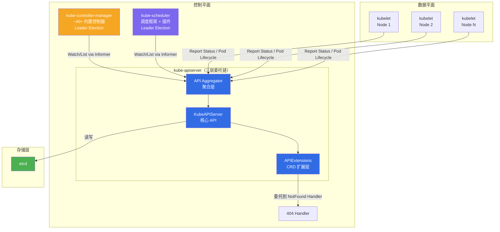
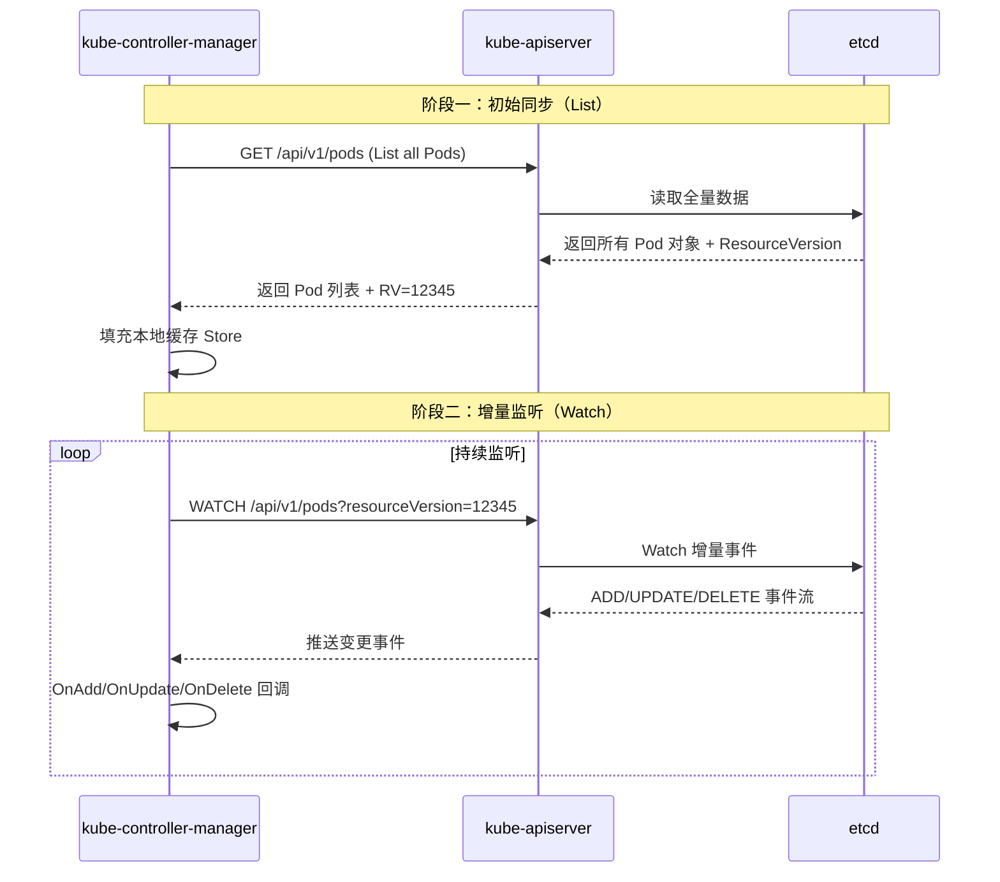
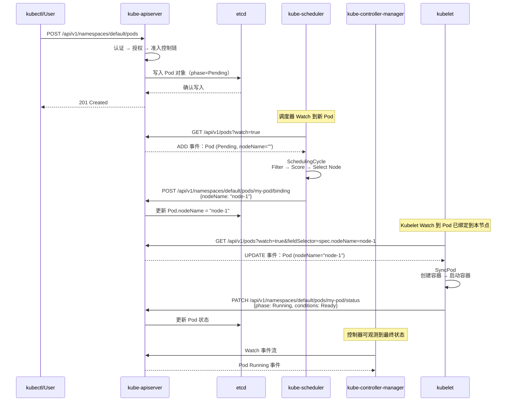

Kubernetes 控制平面（Control Plane）是集群的"大脑"，负责全集群的状态决策、资源调度与声明式驱动力。本文基于 Kubernetes 源码，从**组件职责边界**、**启动架构**和**协作通信模式**三个维度，系统解析控制平面的整体设计。阅读本文后，你将建立对 `kube-apiserver`、`kube-controller-manager`、`kube-scheduler` 三大核心组件的清晰认知，并理解它们如何通过 API Server 这一唯一的通信枢纽协同工作。

Sources: [apiserver.go](cmd/kube-apiserver/apiserver.go#L17-L36), [controller-manager.go](cmd/kube-controller-manager/controller-manager.go#L17-L38), [scheduler.go](cmd/kube-scheduler/scheduler.go#L17-L33)

## 控制平面架构全景

Kubernetes 控制平面采用**中心化 API 网关 + 去中心化工作节点**的架构模式。所有组件之间的状态同步均通过 **kube-apiserver** 完成——没有任何两个组件之间存在直接通信。etcd 作为唯一的持久化存储后端，也仅由 API Server 直接访问。



上图揭示了三个关键架构原则：**单一数据入口**（etcd 仅 API Server 可写）、**Informer 驱动**（所有组件通过 Watch 机制获取状态变更）、**Leader Election 保障**（KCM 和 Scheduler 在多副本部署时仅活跃实例工作）。

Sources: [server.go](cmd/kube-apiserver/app/server.go#L176-L197), [controllermanager.go](cmd/kube-controller-manager/app/controllermanager.go#L117-L125), [scheduler.go](pkg/scheduler/scheduler.go#L66-L125)

## 三大核心组件详解

### kube-apiserver：集群状态网关

**kube-apiserver** 是控制平面中唯一直接与 etcd 交互的组件，是所有其他组件访问集群状态的唯一入口。它的设计核心是**三层委托服务器链**（Delegation Chain），请求从最外层逐级向内层委托处理。

| 层级 | 组件 | 职责 |
|------|------|------|
| 最外层 | **API Aggregator**（kube-aggregator） | 聚合 API 请求、代理到扩展 API Server（AA）、管理 APIService 对象 |
| 中间层 | **KubeAPIServer**（core API） | 核心资源（Pod/Service/Node 等）的 REST 注册、认证授权、准入控制 |
| 最内层 | **APIExtensions**（apiextensions） | CustomResourceDefinition（CRD）处理、自定义资源的自动注册与存储 |

这三层链的构建发生在 `CreateServerChain` 函数中。该函数按照 **APIExtensions → KubeAPIServer → Aggregator** 的顺序逐层创建，但请求处理方向相反——Aggregator 作为最外层首先接收请求，无法处理时向 KubeAPIServer 委托，再向 APIExtensions 委托：

```go
// 请求委托方向：Aggregator → KubeAPIServer → APIExtensions → NotFound
apiExtensionsServer, _ := config.ApiExtensions.New(genericapiserver.NewEmptyDelegateWithCustomHandler(notFoundHandler))
kubeAPIServer, _ := config.KubeAPIs.New(apiExtensionsServer.GenericAPIServer)
aggregatorServer, _ := controlplaneapiserver.CreateAggregatorServer(
    config.Aggregator, kubeAPIServer.ControlPlane.GenericAPIServer,
    apiExtensionsServer.Informers.Apiextensions().V1().CustomResourceDefinitions(), ...)
```

KubeAPIServer 层还承载了关键的控制平面内建控制器，如 **Kubernetes Service 控制器**（维护 `kubernetes.default.svc` 的 Endpoints）和 **Endpoint 协调器**（通过 Lease 机制跟踪活跃的 API Server 实例）。这些控制器通过 PostStartHook 机制在服务器就绪后自动启动。

Sources: [server.go](cmd/kube-apiserver/app/server.go#L176-L197), [config.go](cmd/kube-apiserver/app/config.go#L33-L109), [instance.go](pkg/controlplane/instance.go#L317-L385), [server.go](pkg/controlplane/apiserver/server.go#L79-L86)

### kube-controller-manager：声明式状态驱动力

**kube-controller-manager**（KCM）是 Kubernetes 控制器的集合体，它内嵌了约 40+ 个内置控制器，每个控制器都是一个独立的控制循环，持续通过 API Server Watch 集群状态并推动当前状态趋向期望状态。

KCM 的启动架构围绕 **Leader Election** 和 **ControllerDescriptor** 两个核心机制展开：

**Leader Election 机制**：在多副本部署中，KCM 通过 etcd 中的 Lease 对象进行领导者选举。只有获得领导权的实例才会启动完整的控制器集合，其余实例处于待命状态。选举锁的配置通过 `resourcelock.NewFromKubeconfig` 创建，支持 Coordinated Leader Election（协调式领导者选举）特性以实现更平滑的切换。

**ControllerDescriptor 注册机制**：每个控制器通过 `ControllerDescriptor` 描述其元数据——名称、构造函数、所需特性门控、是否默认禁用等。所有描述符通过 `NewControllerDescriptors` 统一注册，形成控制器注册表。以下是按功能域分类的主要控制器列表：

| 功能域 | 控制器示例 | 源码位置 |
|--------|-----------|---------|
| **工作负载管理** | Deployment、ReplicaSet、StatefulSet、DaemonSet、Job、CronJob | [core.go](cmd/kube-controller-manager/app/core.go), [apps.go](cmd/kube-controller-manager/app/apps.go), [batch.go](cmd/kube-controller-manager/app/batch.go) |
| **网络与服务** | Endpoints、EndpointSlice、EndpointSliceMirroring、ServiceCIDR | [core.go](cmd/kube-controller-manager/app/core.go), [networking.go](cmd/kube-controller-manager/app/networking.go) |
| **节点生命周期** | NodeLifecycle、NodeIpam、TaintEviction、DeviceTaintEviction | [core.go](cmd/kube-controller-manager/app/core.go) |
| **存储管理** | PersistentVolumeBinder、AttachDetach、Expander、EphemeralVolume | [core.go](cmd/kube-controller-manager/app/core.go) |
| **安全与认证** | ServiceAccount、ServiceAccountToken、CSR Signing/Approving/Cleaner | [certificates.go](cmd/kube-controller-manager/app/certificates.go), [service_accounts.go](cmd/kube-controller-manager/app/service_accounts.go) |
| **资源治理** | ResourceQuota、GarbageCollector、PodGC、Namespace | [core.go](cmd/kube-controller-manager/app/core.go) |
| **弹性伸缩** | HorizontalPodAutoscaler、Disruption | [autoscaling.go](cmd/kube-controller-manager/app/autoscaling.go) |

KCM 运行时通过 `ControllerContext` 为所有控制器提供共享基础设施——包括 `InformerFactory`（共享 Informer 工厂）、`ClientBuilder`（API Server 客户端构建器）、`RESTMapper`（动态 API 资源映射器）等。其中 `SharedInformerFactory` 是性能关键点，它确保多个控制器共享同一份 Watch 连接和本地缓存，避免对 API Server 产生重复请求。

Sources: [controllermanager.go](cmd/kube-controller-manager/app/controllermanager.go#L108-L187), [controller_descriptor.go](cmd/kube-controller-manager/app/controller_descriptor.go#L148-L249), [controller_names.go](cmd/kube-controller-manager/names/controller_names.go#L43-L93), [controllermanager.go](cmd/kube-controller-manager/app/controllermanager.go#L462-L498)

### kube-scheduler：Pod 归宿决策引擎

**kube-scheduler** 负责将未调度的 Pod 绑定到合适的 Node 上。它基于**调度框架**（Scheduling Framework）的可扩展插件体系运行，通过 `ScheduleOne` → `SchedulingCycle` → `BindingCycle` 的三级流水线处理每个调度决策。

调度器的核心数据结构是 `Scheduler` 结构体，包含以下关键子系统：

```go
type Scheduler struct {
    Cache           internalcache.Cache         // 集群资源快照缓存
    SchedulingQueue internalqueue.SchedulingQueue // 待调度 Pod 优先队列
    Profiles        profile.Map                 // 调度配置档案（支持多调度器）
    APIDispatcher   *apidispatcher.APIDispatcher // 异步 API 调用调度器
    client          clientset.Interface          // API Server 客户端
    // ...
}
```

调度主循环 `ScheduleOne` 的工作流如下：

1. **出队**：从 `SchedulingQueue` 中弹出下一个待调度 Pod
2. **调度周期**（`schedulingCycle`）：更新集群快照 → 执行 Filter/Score 插件 → 确定目标 Node → 在缓存中"假定"（Assume）Pod 已调度
3. **绑定周期**（`bindingCycle`）：执行 PreBind → 向 API Server 写入 Binding 对象 → 执行 PostBind

调度器通过 `addAllEventHandlers` 注册对 Pod、Node、CSINode 等资源的 Informer 事件处理器。当 Node 资源变化时，调度器会将队列中因该 Node 调度失败的 Pod 重新激活到 Active 队列。

Sources: [scheduler.go](pkg/scheduler/scheduler.go#L68-L125), [scheduler.go](pkg/scheduler/scheduler.go#L277-L468), [scheduler.go](pkg/scheduler/scheduler.go#L546-L573), [schedule_one.go](pkg/scheduler/schedule_one.go#L67-L148), [eventhandlers.go](pkg/scheduler/eventhandlers.go#L53-L141)

## 组件协作通信模式

### Informer 模式：状态同步的基石

控制平面所有非 API Server 组件均通过 **Informer 模式** 与 API Server 通信。Informer 的核心思想是：通过 List + Watch 获取资源的完整状态和增量变更，在本地维护一份内存缓存，控制器直接读缓存而非每次请求 API Server。



在 KCM 中，`SharedInformerFactory` 通过以下代码创建，其中 `trim` 函数裁剪 `ManagedFields` 以优化内存使用：

```go
sharedInformers := informers.NewSharedInformerFactoryWithOptions(
    versionedClient, ResyncPeriod(s)(),
    informers.WithTransform(trim), informers.WithInformerName(informerName),
)
```

而在调度器中，Informer 事件处理器注册在 `addAllEventHandlers` 中，将 Pod 和 Node 的变更事件分别路由到调度队列和缓存更新。

Sources: [controllermanager.go](cmd/kube-controller-manager/app/controllermanager.go#L530-L563), [eventhandlers.go](pkg/scheduler/eventhandlers.go#L53-L141), [scheduler.go](pkg/scheduler/scheduler.go#L463-L467)

### Leader Election：高可用性保障

**kube-controller-manager** 和 **kube-scheduler** 都通过 Leader Election 机制实现高可用。在多副本部署中，仅持有领导者锁的实例执行实际工作，其余实例处于待命状态。领导者锁基于 etcd 中的 Lease 对象（或 ConfigMap/Endpoint），通过 `leaderelection.RunOrDie` 启动选举循环。

两者都支持 **Coordinated Leader Election**（协调式领导者选举），通过 `coordinationv1.OldestEmulationVersion` 策略确保版本兼容性，在升级场景中避免新版本实例和旧版本实例同时工作导致的兼容性问题。

| 选举参数 | 含义 | 默认行为 |
|----------|------|---------|
| LeaseDuration | 锁的持有时长 | 领导者必须在此时间内续约 |
| RenewDeadline | 续约截止时间 | 必须在此时间内完成续约 |
| RetryPeriod | 获取锁重试间隔 | 非领导者尝试获取锁的频率 |

Sources: [controllermanager.go](cmd/kube-controller-manager/app/controllermanager.go#L838-L867), [server.go](cmd/kube-scheduler/app/server.go#L305-L341), [controllermanager.go](cmd/kube-controller-manager/app/controllermanager.go#L345-L371)

### Kubelet 与控制平面的协作

虽然 Kubelet 运行在每个工作节点上，不属于控制平面组件，但它是控制平面决策的执行者，与控制平面形成完整的闭环。Kubelet 与控制平面的交互模式包含两个关键路径：

**上行路径（Node → API Server）**：Kubelet 定期向 API Server 报告节点状态（`syncNodeStatus`）和 Pod 状态（通过 `statusManager`）。同时，Kubelet 通过 Node Lease 机制（`nodeLeaseController.Run`）发送心跳，这是控制平面判断节点可用性的核心依据。

**下行路径（API Server → Kubelet）**：Kubelet 通过 Pod Informer Watch 分配到本节点的 Pod。当调度器将 Pod 绑定到某 Node 时，对应 Kubelet 的 `HandlePodAdditions` 方法被触发，进而调用 `SyncPod` 驱动容器运行时创建容器。

Sources: [kubelet.go](pkg/kubelet/kubelet.go#L1193-L1257), [kubelet.go](pkg/kubelet/kubelet.go#L1850-L1950), [kubelet.go](cmd/kubelet/kubelet.go#L17-L22)

## 典型协作流程：Pod 从创建到运行

以下流程展示了控制平面三大组件如何协作将一个 Pod 从用户提交推进到实际运行，这是理解组件协作关系的最佳实践场景。



这个流程清晰地展现了**分层解耦**的设计哲学：API Server 作为唯一的状态存储和分发中心，Scheduler 负责决策，Kubelet 负责执行，KCM 负责持续调节。每个组件只关注自己的职责域，通过 API Server 的 Watch 机制实现松耦合的事件驱动协作。

Sources: [server.go](cmd/kube-apiserver/app/server.go#L77-L80), [schedule_one.go](pkg/scheduler/schedule_one.go#L98-L148), [kubelet.go](pkg/kubelet/kubelet.go#L2832-L2860)

## 组件启动模式对比

三大核心组件虽然职责不同，但遵循统一的启动模式。下表对比了它们的启动流程异同：

| 启动阶段 | kube-apiserver | kube-controller-manager | kube-scheduler |
|----------|---------------|------------------------|----------------|
| **入口命令** | `app.NewAPIServerCommand()` | `app.NewControllerManagerCommand()` | `app.NewSchedulerCommand()` |
| **配置构建** | `NewConfig → Complete` | `s.Config → Complete` | `Setup` |
| **核心创建** | `CreateServerChain`（三层委托） | `NewControllerDescriptors` + `BuildControllers` | `scheduler.New`（框架+插件） |
| **Leader Election** | 不使用（多实例可并行服务） | 必选（仅 Leader 启动控制器） | 可选（仅 Leader 执行调度） |
| **Informer 启动** | 自建（VersionedInformers） | SharedInformerFactory | SharedInformerFactory |
| **事件广播** | 无 | EventBroadcaster | EventBroadcaster |

值得注意的是，**kube-apiserver 不参与 Leader Election**——多个 API Server 实例可以同时对外提供服务，通过 Endpoint Reconciler 维护 `kubernetes.default.svc` 的 Endpoints 列表实现负载均衡。而 KCM 和 Scheduler 则必须通过 Leader Election 确保同一时刻仅有一个活跃实例。

Sources: [server.go](cmd/kube-apiserver/app/server.go#L70-L145), [controllermanager.go](cmd/kube-controller-manager/app/controllermanager.go#L108-L187), [server.go](cmd/kube-scheduler/app/server.go#L93-L171), [kubernetesservice/controller.go](pkg/controlplane/controller/kubernetesservice/controller.go#L47-L83)

## 控制平面内的辅助控制器

除了三大主组件外，kube-apiserver 内部还运行着一组轻量级控制器，它们通过 `PostStartHook` 机制在 API Server 就绪后启动，负责维护集群基础设施：

| 控制器 | 职责 | 源码位置 |
|--------|------|---------|
| **Kubernetes Service Controller** | 维护 `kubernetes.default.svc` 的 Service 和 Endpoints | [kubernetesservice/controller.go](pkg/controlplane/controller/kubernetesservice/controller.go#L47-L59) |
| **Endpoint Reconciler** | 跟踪活跃 API Server 实例（Lease/MasterCount/None 三种模式） | [reconcilers/reconcilers.go](pkg/controlplane/reconcilers/reconcilers.go#L27-L47) |
| **System Namespaces Controller** | 确保系统命名空间（kube-system 等）存在 | [systemnamespaces](pkg/controlplane/controller/systemnamespaces) |
| **Cluster Authentication Trust Controller** | 分发集群 CA 信任信息 | [clusterauthenticationtrust](pkg/controlplane/controller/clusterauthenticationtrust) |
| **Coordinated Leader Election Controller** | API Server 自身的协调式选举 | [leaderelection](pkg/controlplane/controller/leaderelection) |
| **API Server Lease GC** | 清理过期的身份 Lease | [apiserverleasegc](pkg/controlplane/controller/apiserverleasegc) |

这些控制器不依赖 kube-controller-manager，而是直接内嵌在 API Server 进程中，确保即使在 KCM 不可用的情况下，集群的基础连通性（如 `kubernetes.default.svc`）仍然正常。

Sources: [instance.go](pkg/controlplane/instance.go#L360-L383), [server.go](pkg/controlplane/apiserver/server.go#L143-L186)

## 深入阅读导航

理解控制平面总览后，建议按以下路径深入各组件内部实现：

- **[API Server 启动流程与请求处理链路](7-api-server-qi-dong-liu-cheng-yu-qing-qiu-chu-li-lian-lu)**：深入三层委托链的构建细节、认证授权过滤器和准入控制链的工作机制
- **[控制器管理器与内置控制器体系](9-kong-zhi-qi-guan-li-qi-yu-nei-zhi-kong-zhi-qi-ti-xi)**：分析 ControllerDescriptor 注册机制、Informers 的启动时序和控制器并发模型
- **[调度器架构与调度框架插件机制](10-diao-du-qi-jia-gou-yu-diao-du-kuang-jia-cha-jian-ji-zhi)**：剖析 SchedulingCycle 的 Filter/Score/Bind 各阶段和 QueueingHint 优化
- **[Kubelet Pod 生命周期管理与容器运行时交互](8-kubelet-pod-sheng-ming-zhou-qi-guan-li-yu-rong-qi-yun-xing-shi-jiao-hu)**：理解 Pod 从绑定到运行的完整生命周期及 PLEG 事件驱动机制