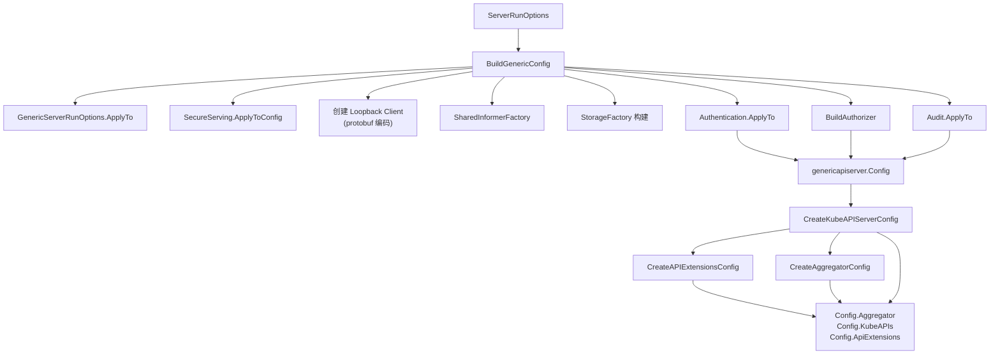
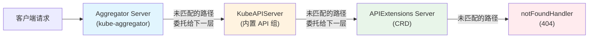
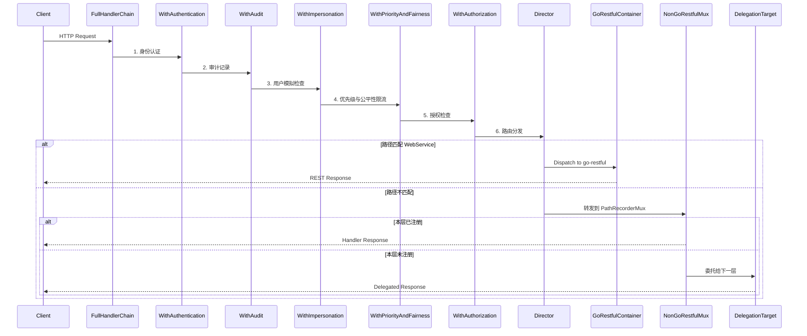
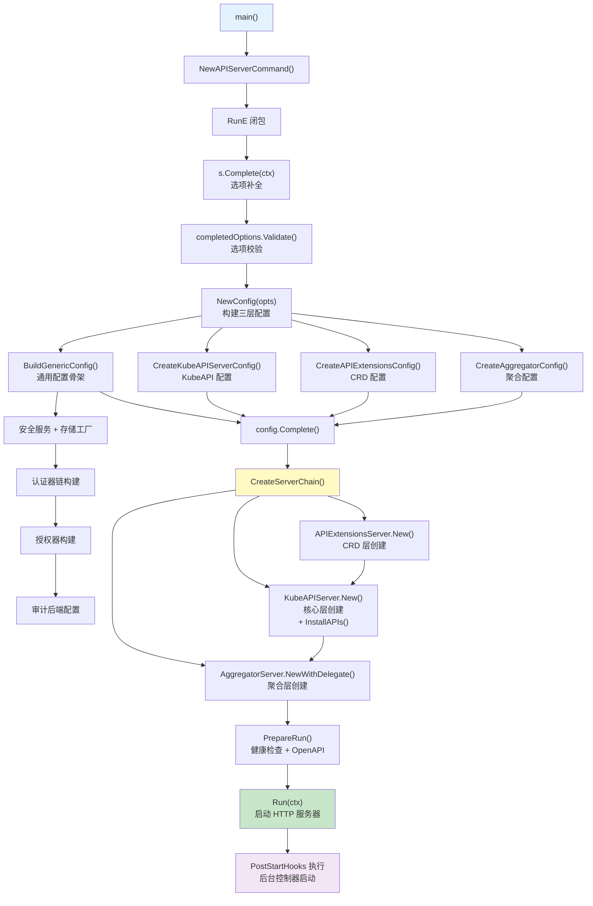

kube-apiserver 是 Kubernetes 控制平面的核心入口，承担着集群状态验证、配置分发与 REST 操作服务的全部职责。本文将从源码层面系统拆解 kube-apiserver 从进程启动到请求处理的完整链路，深入揭示其**三层委托链**架构与**反向包装**的过滤器管道设计。

Sources: [apiserver.go](cmd/kube-apiserver/apiserver.go#L17-L36)

## 入口点：命令构建与启动主流程

kube-apiserver 的入口位于 `cmd/kube-apiserver/apiserver.go`，通过 cobra 命令行框架构建。`main()` 函数仅做两件事：调用 `app.NewAPIServerCommand()` 创建命令对象，然后通过 `cli.Run(command)` 执行。

`NewAPIServerCommand()` 的核心逻辑在其 `RunE` 闭包中，执行以下严格有序的四步启动序列：

| 阶段 | 方法 | 职责 |
|------|------|------|
| 1. 选项补全 | `s.Complete(ctx)` | 填充默认值、解析依赖路径 |
| 2. 选项校验 | `completedOptions.Validate()` | 校验所有配置项的合法性 |
| 3. 构建链 | `CreateServerChain(completed)` | 构建三层委托 API 服务器链 |
| 4. 运行 | `prepared.Run(ctx)` | 安装健康检查端点，启动 HTTP 服务器 |

其中 `Run()` 函数将四步序列展开为：`NewConfig(opts)` → `config.Complete()` → `CreateServerChain(completed)` → `server.PrepareRun()` → `prepared.Run(ctx)`。这个调用链遵循了经典的 **Config → CompletedConfig → Server → PreparedServer** 不可变递进模式——每个阶段仅暴露下一步所需的最小接口，前一步的结果在逻辑上不可变。

Sources: [server.go](cmd/kube-apiserver/app/server.go#L70-L173)

## 配置构建：从选项到可运行状态

### 选项体系

`ServerRunOptions` 嵌入了 `controlplaneapiserver.Options`，后者组合了所有子系统配置：`GenericServerRunOptions`（通用服务器参数）、`Etcd`（存储后端）、`SecureServing`（TLS 服务）、`Authentication`（认证）、`Authorization`（授权）、`Admission`（准入控制）、`Audit`（审计）、`Features`（特性门控）等。每个子系统通过 `AddFlags()` 方法向 cobra 命令注册对应的命令行参数集。

Sources: [options.go](cmd/kube-apiserver/app/options/options.go#L39-L97), [options.go](pkg/controlplane/apiserver/options/options.go#L50-L99)

### BuildGenericConfig：通用配置骨架

`BuildGenericConfig()` 是配置构建的核心枢纽，它接收已完成的选项集并产出被多个委托服务器共享的 `genericapiserver.Config`。其执行顺序精确地反映了各子系统的依赖关系：

1. **通用服务器选项应用** — `s.GenericServerRunOptions.ApplyTo(genericConfig)` 设置请求超时等基础参数
2. **安全服务配置** — `s.SecureServing.ApplyToConfig(genericConfig)` 配置 TLS 监听
3. **回环客户端创建** — 使用 protobuf 作为自通信序列化格式，禁用压缩
4. **Informer 工厂初始化** — 创建 `SharedInformerFactory`，配置 10 分钟同步周期
5. **特性应用** — `s.Features.ApplyTo()` 配置 API 优先级与公平性等特性
6. **存储工厂构建** — `storageFactoryConfig.Complete(s.Etcd).New()` 创建 etcd 存储工厂
7. **认证应用** — `s.Authentication.ApplyTo()` 构建认证器链
8. **授权构建** — `BuildAuthorizer()` 构建授权器（支持 RBAC、Node、ABAC、Webhook 等多种模式的组合）
9. **审计应用** — `s.Audit.ApplyTo()` 配置审计后端与策略

Sources: [config.go](pkg/controlplane/apiserver/config.go#L116-L243)



## 三层委托链：服务器组合架构

kube-apiserver 采用**委托模式**（Delegation Pattern）将三个逻辑上独立的 API 服务器组合为统一的请求处理入口。`CreateServerChain()` 按以下顺序构建，每层以前一层作为委托目标：



### 第一层：APIExtensions Server

APIExtensions Server 负责处理所有自定义资源定义（CRD）相关的请求。它以一个 `notFoundHandler` 作为链尾委托目标创建，确保无法匹配任何注册路径的请求最终返回 404。

Sources: [server.go](cmd/kube-apiserver/app/server.go#L177-L181), [apiextensions.go](pkg/controlplane/apiserver/apiextensions.go#L34-L86)

### 第二层：KubeAPIServer

KubeAPIServer 是核心层，注册了所有 Kubernetes 内置 API 组（core、apps、batch、networking 等）。在 `Instance.New()` 中，它通过 `InstallAPIs()` 方法将二十余个 `RESTStorageProvider` 注册到路由中，涵盖从 Pod、Service 到 FlowControl、ResourceClaim 的全部资源类型。

内置 API 组的注册顺序决定了发现文档中的呈现顺序和资源名冲突时的优先级。例如 `apps` 组被刻意排在 `extensions` 之后，以确保旧客户端仍然能正确解析 `deployments.extensions` 而非 `deployments.apps`。

Sources: [instance.go](pkg/controlplane/instance.go#L317-L385), [instance.go](pkg/controlplane/instance.go#L412-L439)

### 第三层：Aggregator Server

Aggregator Server 位于委托链的最外层，负责 API 聚合与代理。它持有 `APIService` 资源的注册表，对于已注册的外部 API 服务（如 metrics-server），Aggregator 会将请求代理到对应的后端服务。对于未匹配的请求，它委托给内层的 KubeAPIServer。

Aggregator 还负责 OpenAPI 规范的聚合——它收集所有委托层的 OpenAPI v2/v3 规范并合并为统一的 API 文档。

Sources: [aggregator.go](pkg/controlplane/apiserver/aggregator.go#L53-L128), [apiserver.go](staging/src/k8s.io/kube-aggregator/pkg/apiserver/apiserver.go#L467-L519)

### DelegationTarget 接口

三层服务器通过 `DelegationTarget` 接口连接。每个 `GenericAPIServer` 持有一个 `delegationTarget` 字段，当请求在本层无法处理时（路径未注册），便通过 `UnprotectedHandler()` 获取下一层的处理器进行委托。`emptyDelegate` 作为链尾，仅持有 `notFoundHandler`。

Sources: [genericapiserver.go](staging/src/k8s.io/apiserver/pkg/server/genericapiserver.go#L310-L436)

## 请求处理管道：过滤器链

### 管道构建机制

每个 `GenericAPIServer` 在创建时通过 `NewAPIServerHandler()` 构建 `APIServerHandler`，其核心结构为：

```
FullHandlerChain → Director → {GoRestfulContainer | NonGoRestfulMux}
```

`FullHandlerChain` 是由 `BuildHandlerChainFunc`（默认为 `DefaultBuildHandlerChain`）将 Director 层层包装而成的过滤器管道。`Director` 则是一个路由决策器，根据请求路径判断应分发到 go-restful 容器（标准 API 路径）还是路径记录复用器（非标准路径与委托处理）。

Sources: [handler.go](staging/src/k8s.io/apiserver/pkg/server/handler.go#L37-L100), [handler.go](staging/src/k8s.io/apiserver/pkg/server/handler.go#L115-L154)

### DefaultBuildHandlerChain：完整过滤器序列

`DefaultBuildHandlerChain` 以**反向包装**的方式构建过滤器链——代码中最后添加的过滤器最先执行。以下表格按**请求经过的实际顺序**（从外到内）列出全部过滤器：

| 顺序 | 过滤器 | 包 | 职责 |
|------|--------|-----|------|
| 1 | `WithAuditInit` | genericapifilters | 初始化审计上下文 |
| 2 | `WithPanicRecovery` | genericfilters | 捕获 panic 并返回 500 |
| 3 | `WithMuxAndDiscoveryComplete` | genericapifilters | 阻塞请求直到路由注册完成 |
| 4 | `WithRequestReceivedTimestamp` | genericapifilters | 记录请求到达时间戳 |
| 5 | `WithRequestInfo` | genericapifilters | 解析请求为 RequestInfo（verb, resource, namespace 等） |
| 6 | *(条件)* `WithRoutine` | routine | 在独立 goroutine 中执行后续处理以降低栈内存 |
| 7 | `WithLatencyTrackers` | genericapifilters | 初始化延迟追踪器 |
| 8 | `WithHTTPLogging` | genericfilters | HTTP 请求/响应日志 |
| 9 | *(条件)* `WithRetryAfter` | genericfilters | 关闭期间返回 429 Retry-After |
| 10 | `WithHSTS` | genericfilters | 添加 Strict-Transport-Security 头 |
| 11 | `WithCacheControl` | genericapifilters | 设置 Cache-Control: no-cache |
| 12 | *(条件)* `WithProbabilisticGoaway` | genericfilters | 概率性发送 GOAWAY 实现连接重平衡 |
| 13 | *(条件)* `WithWatchTerminationDuringShutdown` | genericfilters | 关闭期间优雅终止 watch 请求 |
| 14 | `WithWaitGroup` | genericfilters | 跟踪非长运行请求的等待组 |
| 15 | `WithRequestDeadline` | genericapifilters | 设置请求上下文截止时间 |
| 16 | `WithTimeoutForNonLongRunningRequests` | genericfilters | 非长运行请求超时控制 |
| 17 | `WithWarningRecorder` | genericapifilters | 初始化警告记录器 |
| 18 | `WithCORS` | genericfilters | CORS 跨域处理 |
| 19 | **`WithAuthentication`** | genericapifilters | **身份认证** |
| 20 | *(条件)* `WithTracing` | genericapifilters | OpenTelemetry 分布式追踪 |
| 21 | **`WithAudit`** | genericapifilters | **审计日志记录** |
| 22 | **`WithImpersonation`** | impersonation | **用户模拟** |
| 23 | **`WithPriorityAndFairness`** | genericfilters | **API 优先级与公平性限流** |
| 24 | **`WithAuthorization`** | genericapifilters | **请求授权** |

Sources: [config.go](staging/src/k8s.io/apiserver/pkg/server/config.go#L1036-L1118)

### 核心安全过滤器详解

**认证**：`WithAuthentication` 调用 `auth.AuthenticateRequest(req)` 尝试通过认证器链进行身份验证。认证器链由多个认证器组成（客户端证书、引导令牌、OIDC 令牌、ServiceAccount 令牌、请求头认证等），使用 union 模式——任一认证器成功即通过。认证成功后，用户信息被注入请求上下文，并从请求头中移除 `Authorization` 字段。

Sources: [authentication.go](staging/src/k8s.io/apiserver/pkg/endpoints/filters/authentication.go#L42-L80)

**授权**：`WithAuthorization` 从上下文中提取 `AuthorizerAttributes`（包括用户、动词、资源、命名空间等），然后调用 `authorizer.Authorize(ctx, attributes)` 进行授权决策。授权器同样支持多种模式的组合链（RBAC、Node Authorizer、ABAC、Webhook），任一模式返回 `DecisionAllow` 即通过。

Sources: [authorization.go](staging/src/k8s.io/apiserver/pkg/endpoints/filters/authorization.go#L52-L80)

**准入控制**：准入控制不在过滤器链中，而是在 REST 操作的存储层执行。它在 `CreateConfig()` 中通过 `Admission.ApplyTo()` 初始化，传入 webhook 解析器、服务发现等插件初始化器，最终构建 `admission.Interface` 并注入到 `GenericAPIServer.admissionControl` 字段。

Sources: [config.go](pkg/controlplane/apiserver/config.go#L363-L392), [config.go](pkg/controlplane/apiserver/admission/config.go#L43-L57)

### API 优先级与公平性（FlowControl）

当 `c.FlowControl` 不为 nil 时，`WithPriorityAndFairness` 替代 `WithMaxInFlightLimit` 执行更精细的请求限流。它根据请求的优先级级别将请求分发到不同的队列，确保高优先级请求（如 system:nodes 的请求）在过载时仍能被处理。`requestWorkEstimator` 评估每个请求的工作量（包含存储操作次数和 watch 数量），用于公平分配服务席位。

Sources: [config.go](staging/src/k8s.io/apiserver/pkg/server/config.go#L1043-L1052)

### 延迟追踪

`filterlatency.TrackCompleted` 和 `filterlatency.TrackStarted` 成对出现，精确度量每个过滤器的执行耗时。这些指标通过 Prometheus 暴露，可用于定位请求处理管道中的性能瓶颈。

Sources: [config.go](staging/src/k8s.io/apiserver/pkg/server/config.go#L1039-L1041)

## Director 路由分发

在过滤器链的末端，请求到达 `Director`。`Director` 是一个自定义的 `http.Handler`，它检查请求路径是否匹配已注册的 go-restful WebService：

- 若路径匹配某个 WebService 的 `RootPath()`（精确匹配或路径边界前缀匹配），分发到 `goRestfulContainer.Dispatch()`
- 若无匹配，转发到 `nonGoRestfulMux.ServeHTTP()`

`nonGoRestfulMux` 是一个 `PathRecorderMux`，它不仅处理非标准路径（如 `/healthz`、`/metrics`、`/openapi/v2`），还承载了**委托目标**的处理器——当请求路径在本层未注册时，通过 `notFoundHandler` 委托给下一层服务器。

Sources: [handler.go](staging/src/k8s.io/apiserver/pkg/server/handler.go#L115-L154)



## API 组注册与存储绑定

### InstallAPIs 流程

`Server.InstallAPIs()` 遍历所有 `RESTStorageProvider`，对每个提供者：

1. 调用 `NewRESTStorage()` 生成该 API 组的 `APIGroupInfo`（包含 `VersionedResourcesStorageMap`，即每个版本下每个资源的 REST 存储实现）
2. 通过 `ResourceExpirationEvaluator` 过滤掉已过期或未引入的资源版本
3. 若 `GroupName` 为空（核心 API 组），调用 `InstallLegacyAPIGroup()` 注册到 `/api` 前缀
4. 否则收集到 `nonLegacy` 列表，批量调用 `InstallAPIGroups()` 注册到 `/apis` 前缀

Sources: [apis.go](pkg/controlplane/apiserver/apiserver/apis.go#L88-L153)

### 内置 API 组清单

KubeAPIServer 注册的 API 组按以下优先级顺序排列：

| 类别 | API 组 | RESTStorageProvider 来源 |
|------|--------|------------------------|
| 核心 | `""` (core) | `corerest.StorageProvider` |
| 内部 | `internal.apiserver.k8s.io` | `apiserverinternalrest` |
| 认证 | `authentication.k8s.io` | `authenticationrest` |
| 授权 | `authorization.k8s.io` | `authorizationrest` |
| 自动扩缩 | `autoscaling` | `autoscalingrest` |
| 批处理 | `batch` | `batchrest` |
| 证书 | `certificates.k8s.io` | `certificatesrest` |
| 协调 | `coordination.k8s.io` | `coordinationrest` |
| 发现 | `discovery.k8s.io` | `discoveryrest` |
| 网络 | `networking.k8s.io` | `networkingrest` |
| 节点 | `node.k8s.io` | `noderest` |
| 策略 | `policy` | `policyrest` |
| RBAC | `rbac.authorization.k8s.io` | `rbacrest` |
| 调度 | `scheduling.k8s.io` | `schedulingrest` |
| 存储 | `storage.k8s.io` | `storagerest` |
| 流控 | `flowcontrol.apiserver.k8s.io` | `flowcontrolrest` |
| 应用 | `apps` | `appsrest` |
| 准入注册 | `admissionregistration.k8s.io` | `admissionregistrationrest` |
| 事件 | `events.k8s.io` | `eventsrest` |
| 资源 | `resource.k8s.io` | `resourcerest` |

Sources: [instance.go](pkg/controlplane/instance.go#L412-L439)

## PrepareRun 与服务器运行

### PrepareRun 阶段

`PrepareRun()` 执行 API 注册后的初始化工作：

1. **委托层递归调用** — `s.delegationTarget.PrepareRun()` 确保所有层完成准备
2. **OpenAPI 安装** — 安装 `/openapi/v2` 和 `/openapi/v3` 端点
3. **健康检查安装** — 注册 `/healthz`、`/livez`、`/readyz` 端点
4. **调试端点** — 可选安装 `/flagz` 和 `/statusz`

Sources: [genericapiserver.go](staging/src/k8s.io/apiserver/pkg/server/genericapiserver.go#L444-L482)

### RunWithContext：优雅启动与关闭

`RunWithContext(ctx)` 是最终的运行入口，其生命周期管理通过多个 `lifecycleSignal` 信号编排：

```
ctx (外部取消)
  ↓
ShutdownInitiated → ShutdownDelayDuration 延迟 → AfterShutdownDelayDuration
                                                      ↓
                                    (同时等待 PreShutdownHooks 完成)
                                                      ↓
                                              NotAcceptingNewRequest
                                                      ↓
                                    等待 NonLongRunningRequestWaitGroup
                                    等待 WatchRequestWaitGroup
                                                      ↓
                                            InFlightRequestsDrained
                                                      ↓
                                           stopHTTPServerCtx
                                                      ↓
                                        HTTPServerStoppedListening
```

启动时，`NonBlockingRunWithContext()` 开始在安全端口上监听 TLS 连接。同时，所有注册的 **PostStartHook** 在独立的 goroutine 中并发执行，包括系统命名空间控制器、集群认证信息控制器、身份租约控制器等关键后台任务。

Sources: [genericapiserver.go](staging/src/k8s.io/apiserver/pkg/server/genericapiserver.go#L536-L660)

## 完整启动流程总览



## 架构洞察与设计原则

**不可变配置递进**：从 `Options` → `CompletedOptions` → `Config` → `CompletedConfig` → `Server` → `PreparedServer`，每一步转换都产生新的类型，前序状态在逻辑上不可变。这种设计在编译期消除了"配置在构建后被意外修改"的可能性。

**委托优于继承**：三层 API 服务器通过 `DelegationTarget` 接口而非继承实现组合。每层完全自治，拥有独立的 handler chain、post-start hooks 和 health checks。Aggregator 调用 `PrepareRun()` 时会递归调用 `s.delegationTarget.PrepareRun()`，确保全链路就绪。

**过滤器链的反向包装**：Go 的 `http.Handler` 包装模式天然形成洋葱结构——最后包装的最先执行。`DefaultBuildHandlerChain` 中的代码书写顺序（从内到外：Authorization → PriorityAndFairness → Impersonation → Audit → Authentication → ...）恰好是请求处理的**反向**顺序。这种模式使得添加新过滤器只需在适当位置插入一行包装代码，无需修改既有逻辑。

Sources: [config.go](staging/src/k8s.io/apiserver/pkg/server/config.go#L1036-L1118), [genericapiserver.go](staging/src/k8s.io/apiserver/pkg/server/genericapiserver.go#L787-L837)

---

**延伸阅读**：
- 深入了解认证与授权的内部实现，参阅 [认证与授权机制（RBAC、Node Authorizer、准入控制）](20-ren-zheng-yu-shou-quan-ji-zhi-rbac-node-authorizer-zhun-ru-kong-zhi)
- 理解 API 资源如何映射到存储层，参阅 [API 注册表与存储抽象（pkg/registry）](13-api-zhu-ce-biao-yu-cun-chu-chou-xiang-pkg-registry)
- 了解控制平面各组件间的协作关系，参阅 [控制平面组件总览与协作关系](6-kong-zhi-ping-mian-zu-jian-zong-lan-yu-xie-zuo-guan-xi)