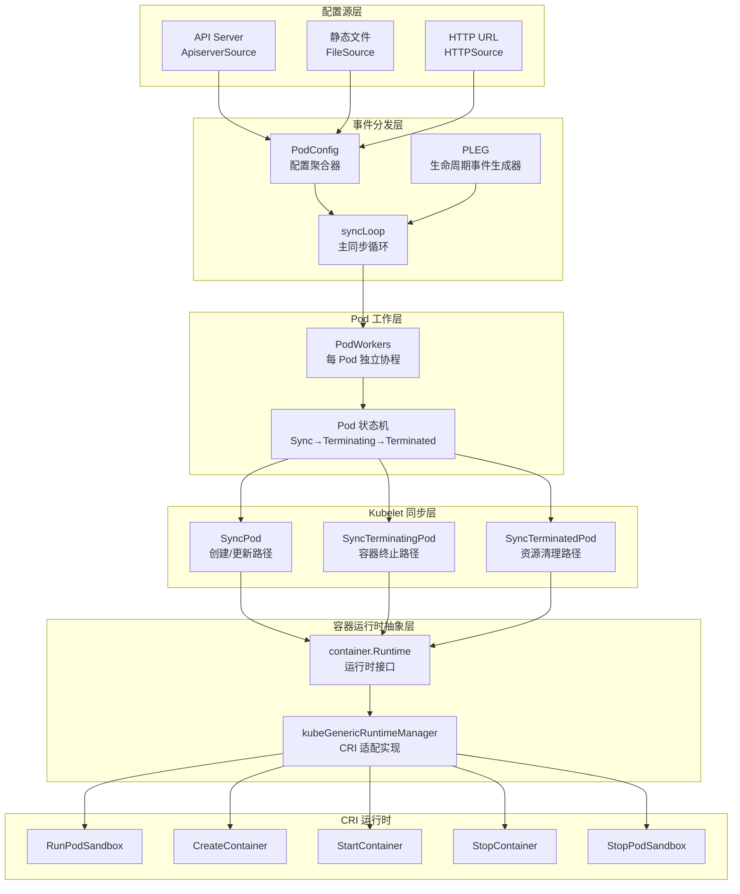
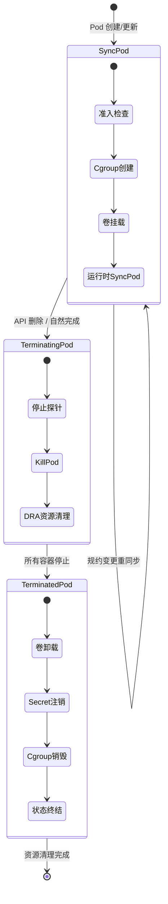
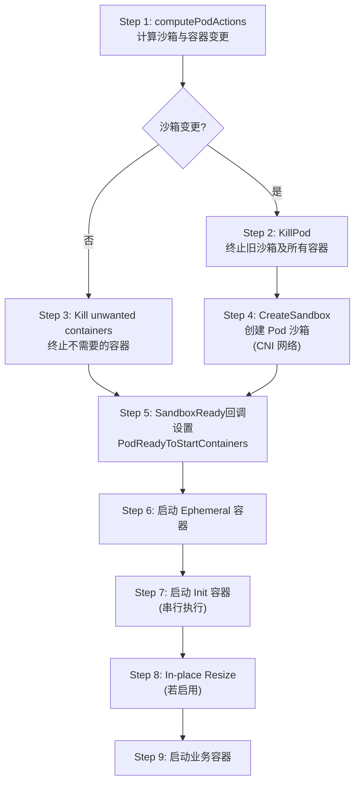

本文深入剖析 Kubelet 如何管理 Pod 的完整生命周期——从配置源接入、准入控制、沙箱创建、容器启停，到终止清理的每一个阶段，并揭示其与 CRI 容器运行时之间的交互协议。读者将理解 Kubelet 内部 **事件驱动 + 状态机** 的核心架构模式，以及 Pod 从 `Pending` 到 `Terminated` 的全链路代码路径。

Sources: [kubelet.go](pkg/kubelet/kubelet.go#L285-L293), [runtime.go](pkg/kubelet/container/runtime.go#L74-L154)

## 架构总览：Kubelet 的分层协作模型

Kubelet 的 Pod 管理并非一个单一函数完成的操作，而是一个由多个子系统协同工作的**分层架构**。从最高层的配置分发到底层的 CRI gRPC 调用，每一层都有明确的职责边界。

上图中每个矩形框对应 Kubernetes 源码中一个具体的包或结构体。**配置源层**负责将 Pod 定义注入系统；**事件分发层**作为中央调度器将事件路由到正确的处理器；**Pod 工作层**确保每个 Pod 拥有独立的同步协程和状态机；**Kubelet 同步层**执行具体的 Pod 操作逻辑；**容器运行时抽象层**屏蔽底层 CRI 实现；最终由 **CRI 运行时**与 containerd、CRI-O 等运行时交互。

Sources: [kubelet.go](pkg/kubelet/kubelet.go#L2620-L2660), [pod_workers.go](pkg/kubelet/pod_workers.go#L106-L119), [kuberuntime_manager.go](pkg/kubelet/kuberuntime/kuberuntime_manager.go#L114-L120)

## 配置源与主同步循环

Kubelet 的 Pod 信息来自三种配置源：**API Server**（通过 Informer 监听）、**静态文件**（指定目录下的 YAML/JSON）和 **HTTP URL**（定期拉取）。这三类源统一被 `PodConfig` 聚合为一个合并的 `PodUpdate` 通道，传递给主同步循环。

`syncLoop` 是 Kubelet 的核心事件循环，它通过一个 `select` 语句从多个通道接收事件并路由到相应处理器。这些通道包括：配置变更通道（`configCh`）、PLEG 生命周期事件通道（`plegCh`）、定时同步通道（`syncCh`）、探针结果通道以及家政清理通道（`housekeepingCh`）。

| 事件源 | 触发条件 | 处理方法 | 核心语义 |
|--------|----------|----------|----------|
| `configCh (ADD)` | 新 Pod 被分配到节点 | `HandlePodAdditions` | Pod 准入与创建 |
| `configCh (UPDATE)` | Pod 规约变更 | `HandlePodUpdates` | 重新同步 Pod |
| `configCh (DELETE)` | Pod 被优雅删除 | `HandlePodUpdates` | 标记终止 |
| `plegCh` | 容器状态变更事件 | `HandlePodSyncs` | 运行时状态同步 |
| `syncCh` | 每秒定时器 | `HandlePodSyncs` | 周期性重同步 |
| `livenessManager` | 存活探针失败 | `HandlePodSyncs` | 容器重启 |
| `housekeepingCh` | 每 2 秒定时器 | `HandlePodCleanups` | 孤立 Pod 清理 |

值得注意的关键设计决策：`DELETE` 操作被当作 `UPDATE` 处理，因为 Kubernetes 的删除是**优雅终止**——先进入 `terminating` 状态，等待宽限期后才真正清除。此外，当多个通道同时有事件就绪时，Go 的 `select` 会**伪随机**选择一个分支，因此事件处理不保证严格的优先级顺序。

Sources: [kubelet.go](pkg/kubelet/kubelet.go#L2620-L2815), [config.go](pkg/kubelet/config/config.go#L1-L50)

## Pod 生命周期事件生成器（PLEG）

PLEG（Pod Lifecycle Event Generator）是 Kubelet 感知容器运行时状态变化的核心机制。它将容器运行时的底层状态变化转化为 Kubelet 可处理的 `PodLifecycleEvent`，解耦了 Kubelet 与运行时的同步节奏。

### 两种 PLEG 实现

Kubernetes 提供两种 PLEG 实现，通过特性门控 `EventedPLEG` 控制切换：

| 特性 | GenericPLEG | EventedPLEG |
|------|-------------|-------------|
| 发现机制 | 周期性全量 Relist（默认 1 秒） | CRI 事件流（Streaming） |
| 延迟 | 最坏 1 秒 + Relist 耗时 | 近实时 |
| 开销 | 高（每次全量查询） | 低（增量推送） |
| 回退机制 | 无 | 退化为 GenericPLEG |
| Relist 周期 | 1 秒 | 300 秒（仅作安全网） |

### GenericPLEG 的工作原理

`GenericPLEG` 通过定时调用 `runtime.GetPods()` 获取所有容器的当前状态，与上一次记录的状态对比，生成状态变更事件。核心事件类型定义如下：

- **`ContainerStarted`**：容器从非运行状态变为运行状态
- **`ContainerDied`**：容器从运行状态变为退出状态
- **`ContainerRemoved`**：已退出的容器被垃圾回收
- **`PodSync`**：需要重新同步 Pod 全量状态

`Relist()` 方法是 GenericPLEG 的核心——它获取所有 Pod 的运行时状态，对每个 Pod 调用 `reconcilePodRecord` 进行新旧状态对比，生成事件后写入 `eventChannel`，最终被 `syncLoopIteration` 消费。

Sources: [pleg.go](pkg/kubelet/pleg/pleg.go#L25-L82), [generic.go](pkg/kubelet/pleg/generic.go#L37-L85), [generic.go](pkg/kubelet/pleg/generic.go#L252-L330), [evented.go](pkg/kubelet/pleg/evented.go#L63-L88)

## Pod Worker 状态机与并发模型

Kubelet 为每个 Pod 维护一个独立的 **Pod Worker 协程**，通过 `podWorkers` 结构体管理。这种设计确保了不同 Pod 的同步操作互不阻塞，同时每个 Pod 内部严格串行执行。

### 三态状态机

Pod Worker 管理 Pod 的生命周期状态，核心状态转换如下：

三个核心状态定义在 `PodWorkerState` 枚举中：

- **`SyncPod`**：Pod 正在创建或更新，需要启动/维护容器
- **`TerminatingPod`**：Pod 正在终止，容器正在被停止
- **`TerminatedPod`**：所有容器已停止，执行最终资源清理

`podWorkerLoop` 是每个 Pod Worker 的主循环。它从 `podUpdates` 通道接收更新事件，根据当前状态分发到不同的同步函数。关键的分发逻辑是：如果 `update.WorkType` 是 `TerminatedPod`，调用 `SyncTerminatedPod`；如果是 `TerminatingPod`，调用 `SyncTerminatingPod`；默认情况（包括创建和更新）调用 `SyncPod`。

Sources: [pod_workers.go](pkg/kubelet/pod_workers.go#L106-L119), [pod_workers.go](pkg/kubelet/pod_workers.go#L1231-L1363)

### UpdatePod 的状态转换决策

`UpdatePod` 方法是所有 Pod 更新的入口，它负责决定 Pod 应该进入哪个状态。当收到 `SyncPodKill` 类型的更新时，如果 Pod 当前处于 `SyncPod` 状态，会被转换为 `TerminatingPod`；如果已经是 `TerminatingPod`，则进一步转为 `TerminatedPod`。这种**单向状态推进**的设计避免了状态回退导致的竞态条件。

`allowPodStart` 方法在 Pod 进入 SyncPod 前执行额外的准入检查，包括静态 Pod 的节点许可控制和 Pod 侵入式调整（resize）冲突检测，确保只有在满足所有前置条件时才允许 Pod 启动。

Sources: [pod_workers.go](pkg/kubelet/pod_workers.go#L751-L860), [pod_workers.go](pkg/kubelet/pod_workers.go#L1036-L1060)

## Pod 准入控制与生命周期处理器

在 Pod 被实际创建之前，Kubelet 实施了一组**本地准入控制**检查，由 `lifecycle` 包中的处理器链实现。这些处理器在 `PodAdmitAttributes` 上下文中依次执行，任一处理器拒绝则 Pod 不会被启动。

### 准入处理器接口体系

生命周期处理器分为三类接口，分别在 Pod 生命周期的不同阶段介入：

| 接口 | 调用时机 | 核心方法 | 典型实现 |
|------|----------|----------|----------|
| `PodAdmitHandler` | Pod 首次同步前 | `Admit(attrs) → PodAdmitResult` | 资源检查、AppArmor、节点关闭检查 |
| `PodSyncLoopHandler` | 每次同步循环 | `ShouldSync(pod) → bool` | 判断是否需要重同步 |
| `PodSyncHandler` | 每次 SyncPod 时 | `ShouldEvict(pod) → ShouldEvictResponse` | 驱逐决策 |

`PodLifecycleTarget` 接口将上述三者聚合，Kubelet 通过 `AddPodAdmitHandler`、`AddPodSyncLoopHandler`、`AddPodSyncHandler` 注册具体处理器。处理器链采用** veto 模式**——所有处理器必须同意（返回 `Admit=true`），任一处理器否决即拒绝准入。

Sources: [interfaces.go](pkg/kubelet/lifecycle/interfaces.go#L22-L110)

## SyncPod：Pod 创建与更新的完整路径

`Kubelet.SyncPod` 是 Pod 创建和更新阶段的核心方法，它执行从状态生成到容器启动的全部逻辑。此方法在 Pod Worker 协程中被调用，处理 `SyncPodType` 为 `SyncPodCreate`、`SyncPodUpdate` 或 `SyncPodSync` 的请求。

### Kubelet 层 SyncPod 的职责

Kubelet 的 `SyncPod` 方法不直接操作容器，而是完成一系列**前置准备工作**：

1. **生成 API Pod 状态**：调用 `generateAPIPodStatus` 根据运行时状态计算 Pod 的 Phase、Conditions 等
2. **终端状态短路**：如果 Pod 已处于 `Succeeded` 或 `Failed`，直接返回 `isTerminal=true`
3. **网络就绪检查**：如果网络插件未就绪且 Pod 非主机网络，拒绝启动
4. **Secret/ConfigMap 注册**：通知 Secret 和 ConfigMap 管理器该 Pod 依赖的资源
5. **Cgroup 创建**：为 Pod 创建 QoS 层级的 Cgroup 并应用资源限制
6. **静态 Pod 镜像同步**：为静态 Pod 创建/更新 Mirror Pod
7. **数据目录创建**：创建 Pod 的日志和卷数据目录
8. **卷挂载等待**：调用 `volumeManager.WaitForAttachAndMount` 等待所有卷就绪
9. **探针注册**：将 Pod 注册到探针管理器
10. **委托运行时**：最终调用 `containerRuntime.SyncPod`

Sources: [kubelet.go](pkg/kubelet/kubelet.go#L2019-L2270)

### 运行时层 SyncPod 的九步流程

`kubeGenericRuntimeManager.SyncPod` 实现了与 CRI 运行时交互的完整流程，分为九个明确的步骤：

**Step 1: computePodActions** 是决策引擎。它对比 Pod 的期望状态与实际运行时状态，计算出一个 `podActions` 结构体，包含是否需要重建沙箱、哪些容器需要启动、哪些需要终止等决策。判断依据包括：沙箱是否存在且配置一致、容器 spec 是否变更、存活/启动探针是否失败、以及是否需要重启。

**Step 4: 创建 Pod 沙箱**是整个流程中最重的操作。沙箱（Sandbox）是 CRI 中的概念，对应一个包含网络命名空间的 Pod 级运行时环境。`createPodSandbox` 通过 `m.runtimeService.RunPodSandbox` gRPC 调用创建，此调用会触发 CNI 插件为沙箱配置网络。沙箱配置包括元数据、DNS、主机名、端口映射、安全上下文等。

**Step 7: Init 容器**严格串行执行——每个 Init 容器必须成功完成（exit code 0）后才会启动下一个。可重启的 Init 容器（Restartable Init Containers / Sidecar）失败后不阻塞后续容器。业务容器（Step 9）则在 Init 容器全部完成后并行启动。

Sources: [kuberuntime_manager.go](pkg/kubelet/kuberuntime/kuberuntime_manager.go#L1450-L1795), [kuberuntime_sandbox.go](pkg/kubelet/kuberuntime/kuberuntime_sandbox.go#L38-L75), [kuberuntime_manager.go](pkg/kubelet/kuberuntime/kuberuntime_manager.go#L1175-L1374)

## 容器级别的创建与生命周期钩子

`startContainer` 方法是容器创建的原子操作，包含四个顺序步骤：

| 步骤 | 操作 | CRI 调用 | 失败行为 |
|------|------|----------|----------|
| Step 1 | 拉取镜像 | `PullImage` | 返回 `ErrImagePull` / `ImagePullBackOff` |
| Step 2 | 创建容器 | `CreateContainer` | 返回 `ErrCreateContainer` |
| Step 3 | 启动容器 | `StartContainer` | 返回 `ErrRunContainer` |
| Step 4 | 执行 PostStart 钩子 | Exec/HTTP/Sleep | 终止容器，返回 `ErrPostStartHook` |

### 生命周期钩子的执行模型

Kubernetes 支持三种类型的生命周期钩子处理器：**Exec**（在容器内执行命令）、**HTTPGet**（发送 HTTP 请求）和 **Sleep**（休眠指定秒数，Alpha 特性）。钩子执行由 `handlerRunner` 统一调度。

`PostStart` 钩子在容器启动后**同步执行**——它与容器入口点（Entrypoint）并发执行，但如果钩子执行失败，容器会被立即终止。`PreStop` 钩子在容器终止前执行，从宽限期中扣除执行时间。`handlerRunner.Run` 方法根据钩子类型分发到不同的执行路径，其中 HTTP 钩子还支持 HTTPS 到 HTTP 的自动回退机制。

容器退避（BackOff）机制通过 `doBackOff` 方法实现，使用指数退避策略（初始 10 秒，最大 5 分钟）避免频繁重启 CrashLoop 的容器。

Sources: [kuberuntime_container.go](pkg/kubelet/kuberuntime/kuberuntime_container.go#L199-L339), [handlers.go](pkg/kubelet/lifecycle/handlers.go#L55-L111)

## Pod 终止流程：从 Terminating 到 Terminated

Pod 终止是一个三阶段过程，对应状态机中 `SyncPod → TerminatingPod → TerminatedPod` 的转换。

### 阶段一：SyncTerminatingPod

`SyncTerminatingPod` 负责**优雅终止**所有容器。其流程为：

1. 生成最终 API Pod 状态，应用 `podStatusFn`（可能来自驱逐等场景的状态覆盖）
2. **停止存活和启动探针**（`probeManager.StopLivenessAndStartup`）
3. 调用 `killPod` 终止所有运行中的容器（通过 `kubeGenericRuntimeManager.killPodWithSyncResult`）
4. 验证无容器仍在运行（CRI 一致性检查）
5. 清理 DRA 动态资源
6. 更新最终 Pod 状态到 API Server

`killContainersWithSyncResult` 并发终止所有容器，每个容器在独立 goroutine 中执行。如果 Pod 包含可重启的 Init 容器，会通过 `terminationOrdering` 控制终止顺序。

### killContainer 的细节

单个容器的终止过程如下：

1. **计算宽限期**：优先使用 Pod 级 `TerminationGracePeriodSeconds`，容器级覆盖次之
2. **执行 PreStop 钩子**：从宽限期中扣除执行时间
3. **终止排序等待**：如果有终止顺序约束，等待轮到自己
4. **保证最小宽限**：宽限期不低于 2 秒（`minimumGracePeriodInSeconds`）
5. **调用 CRI**：`runtimeService.StopContainer(ctx, containerID, gracePeriod)`

### 阶段二：SyncTerminatedPod

`SyncTerminatedPod` 在所有容器停止后执行**资源清理**：

1. 生成最终 Pod 状态
2. **等待卷卸载**（`volumeManager.WaitForUnmount`）
3. **注销 Secret/ConfigMap 依赖**
4. **销毁 Pod Cgroup**
5. **释放用户命名空间**
6. **标记 Pod 终结**（`statusManager.TerminatePod`），后续不再更新状态

对于已丢失配置的孤立运行时 Pod，`SyncTerminatingRuntimePod` 使用最小宽限期（1 秒）强制终止。

Sources: [kubelet.go](pkg/kubelet/kubelet.go#L2289-L2525), [kuberuntime_container.go](pkg/kubelet/kuberuntime/kuberuntime_container.go#L860-L925), [kuberuntime_manager.go](pkg/kubelet/kuberuntime/kuberuntime_manager.go#L1951-L1972)

## 探针管理与健康状态反馈

探针管理器（`prober.Manager`）负责三种探针的周期性检测：

| 探针类型 | 失败后果 | 结果管理器 | 状态更新 |
|----------|----------|------------|----------|
| **Startup Probe** | 容器被标记为未启动，后续探针暂停 | `startupManager` | `SetContainerStartup` |
| **Liveness Probe** | 容器被终止并重启 | `livenessManager` | 触发 `HandlePodSyncs` → 容器重启 |
| **Readiness Probe** | Pod 被从 Service Endpoints 移除 | `readinessManager` | `SetContainerReadiness` |

探针管理器为每个有探针定义的容器创建一个 `worker` 协程，定期执行检测。检测结果通过 `results.Manager` 传递给 syncLoop 中的对应通道（`kl.livenessManager.Updates()`、`kl.readinessManager.Updates()`、`kl.startupManager.Updates()`），进而触发 Pod 重新同步。

存活探针和启动探针失败时，syncLoop 中的处理器调用 `HandlePodSyncs`，最终通过 `computePodActions` 发现探针失败状态，将该容器加入 `ContainersToKill` 列表并重新启动。就绪探针失败则直接更新 Pod 状态中的 `Ready` 条件，不触发容器重启。

Sources: [prober_manager.go](pkg/kubelet/prober/prober_manager.go#L71-L118), [kubelet.go](pkg/kubelet/kubelet.go#L2758-L2779)

## 容器运行时接口（CRI）抽象层

Kubelet 通过 `container.Runtime` 接口与容器运行时交互，该接口定义了 Pod 和容器管理的全部操作。`kubeGenericRuntimeManager` 是该接口的统一实现，封装了所有 CRI gRPC 调用。

### Runtime 接口核心方法

| 方法 | 用途 | CRI 对应 |
|------|------|----------|
| `SyncPod` | 同步 Pod 到期望状态 | 组合调用 |
| `KillPod` | 终止 Pod 所有容器 | `StopContainer` + `StopPodSandbox` |
| `GetPodStatus` | 获取 Pod 运行时状态 | `PodSandboxStatus` + `ContainerStatus` |
| `GetPods` | 列出所有运行时 Pod | `ListPodSandbox` + `ListContainers` |
| `GarbageCollect` | 清理已退出容器 | `RemoveContainer` + `RemovePodSandbox` |
| `PullImage` | 拉取镜像 | `PullImage` |
| `UpdatePodCIDR` | 更新 Pod CIDR | `UpdateRuntimeConfig` |

`ImageService` 接口独立于 Runtime 接口，封装了镜像操作。`StreamingRuntime` 接口处理 `exec`/`attach`/`port-forward` 等流式操作，当运行时自身提供这些服务时，Kubelet 仅做 HTTP 重定向。

### kubeGenericRuntimeManager 的内部架构

`kubeGenericRuntimeManager` 持有多个关键依赖：`runtimeService`（CRI RuntimeService gRPC 客户端）、`imagePuller`（镜像拉取器，支持并发控制和退避）、`recorder`（事件记录器）、`internalLifecycle`（设备管理器的容器生命周期钩子）。它通过 `runtimeService` 发起所有 CRI 调用，将 Kubernetes 的 Pod/Container 语义映射到 CRI 的 Sandbox/Container 模型。

Sources: [runtime.go](pkg/kubelet/container/runtime.go#L74-L154), [kuberuntime_manager.go](pkg/kubelet/kuberuntime/kuberuntime_manager.go#L114-L120)

## 关键设计模式与工程决策

### 事件驱动 + 状态机的双重保障

Kubelet 的 Pod 管理采用**事件驱动**（PLEG 检测变化触发同步）与**定时轮询**（syncCh 每秒触发重同步）的双重机制。这种设计确保即使事件丢失，定时器也能作为安全网捕获状态漂移。

### 单 Pod 单协程的隔离模型

每个 Pod 拥有独立的 Worker 协程和状态，这意味着一个 Pod 的同步阻塞（如镜像拉取超时）不会影响其他 Pod。`podWorkers` 使用 `podLock` 保护状态映射，而每个 Pod 的更新通过 channel 串行化。

### 宽限期扣除模型

容器终止时的宽限期计算采用**逐级扣除**模式：从 Pod 的 `terminationGracePeriodSeconds` 开始，依次扣除 PreStop 钩子执行时间和终止排序等待时间，但始终保持不低于 2 秒的最小宽限。这确保了容器始终有机会优雅退出。

### 状态终结的幂等性

`SyncTerminatedPod` 中的所有操作都被设计为**幂等和可重入的**。因为 Kubelet 重启可能中断清理流程，恢复后这些操作需要能安全重试。`HandlePodCleanups` 作为最终的安全网，确保即使 `SyncTerminatedPod` 未被调用，孤立 Pod 也会被最终清理。

Sources: [pod_workers.go](pkg/kubelet/pod_workers.go#L1231-L1363), [kuberuntime_container.go](pkg/kubelet/kuberuntime/kuberuntime_container.go#L878-L925), [kubelet.go](pkg/kubelet/kubelet.go#L2449-L2458)

## 延伸阅读

- 要理解 Kubelet 在控制平面中的整体定位以及与其他组件的协作关系，参见 [控制平面组件总览与协作关系](6-kong-zhi-ping-mian-zu-jian-zong-lan-yu-xie-zuo-guan-xi)
- 要了解 Pod 终止后控制器如何处理副本数维持和垃圾回收，参见 [控制器管理器与内置控制器体系](9-kong-zhi-qi-guan-li-qi-yu-nei-zhi-kong-zhi-qi-ti-xi)
- 要理解卷挂载在 SyncPod 中的详细生命周期管理，参见 [卷管理器与挂载生命周期](19-juan-guan-li-qi-yu-gua-zai-sheng-ming-zhou-qi)
- 要深入测试体系中针对 Kubelet 行为的验证方法，参见 [节点级别测试（e2e_node）与性能基准测试](26-jie-dian-ji-bie-ce-shi-e2e_node-yu-xing-neng-ji-zhun-ce-shi)