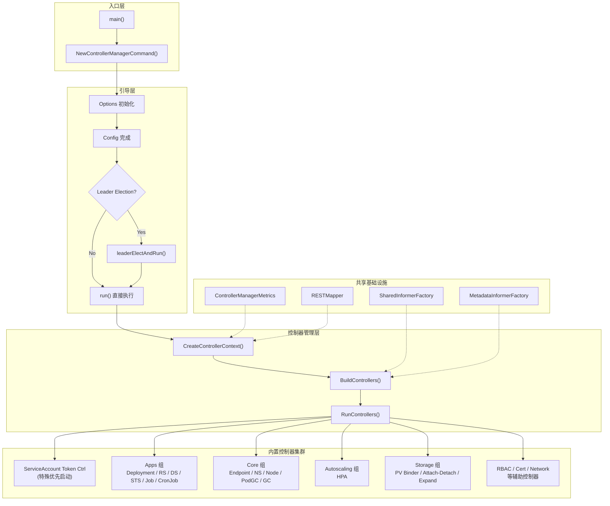
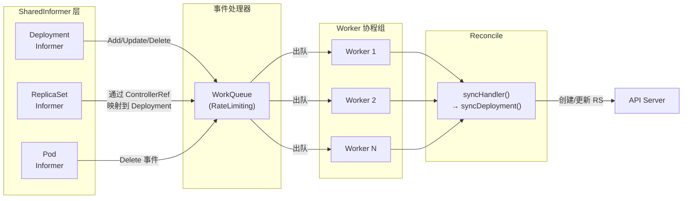

**kube-controller-manager**（KCM）是 Kubernetes 控制平面的核心守护进程，它将数十个独立的控制循环嵌入到单个二进制文件中，统一协调集群的实际状态趋向期望状态。本文档从启动入口出发，深入剖析控制器注册机制、描述符体系、通用控制循环模式以及全部内置控制器的分类与协作关系。

Sources: [controller-manager.go](cmd/kube-controller-manager/controller-manager.go#L17-L21), [controllermanager.go](cmd/kube-controller-manager/app/controllermanager.go#L117-L125)

## 整体架构总览

kube-controller-manager 的架构可以用"**一个入口 + 一组描述符 + 一批控制器实现**"来概括。入口点 `main()` 调用 `app.NewControllerManagerCommand()` 构建 cobra 命令，命令执行时完成配置初始化、领导者选举和控制器启动。所有控制器通过 `ControllerDescriptor` 注册到全局描述符表，由管理框架统一编排生命周期。



Sources: [controller-manager.go](cmd/kube-controller-manager/controller-manager.go#L34-L38), [controllermanager.go](cmd/kube-controller-manager/app/controllermanager.go#L108-L187), [controllermanager.go](cmd/kube-controller-manager/app/controllermanager.go#L199-L298)

## 启动流程与命令行构造

**kube-controller-manager** 的入口位于 `cmd/kube-controller-manager/controller-manager.go`，其 `main()` 函数极简：调用 `app.NewControllerManagerCommand()` 生成 cobra 命令后通过 `cli.Run()` 执行。这种设计将全部初始化逻辑下沉到 `app` 包中，保持入口文件的零复杂度。

命令对象的构造过程在 `NewControllerManagerCommand()` 中完成，关键步骤包括：

1. **创建 Options**：`options.NewKubeControllerManagerOptions()` 初始化所有控制器的配置选项结构体，每个控制器都有独立的 `XXXControllerOptions` 子结构体
2. **构建 cobra.Command**：命令的 `RunE` 回调完成特性门控验证、日志初始化、配置构建，最终调用 `Run()` 进入主流程
3. **注册 FlagSet**：通过 `s.Flags()` 获取按控制器名分组的 FlagSet，生成结构化的帮助信息

Sources: [controller-manager.go](cmd/kube-controller-manager/controller-manager.go#L23-L38), [controllermanager.go](cmd/kube-controller-manager/app/controllermanager.go#L109-L187), [options.go](cmd/kube-controller-manager/app/options/options.go#L69-L100)

## 领导者选举与高可用机制

在生产环境中通常运行多个 KCM 实例以保证高可用，但同一时刻只有一个实例作为 Leader 运行控制器。`Run()` 函数的核心分支逻辑是：

- **未启用 Leader Election**：直接调用 `run()` 函数，同步启动所有控制器
- **启用 Leader Election**：通过 `leaderElectAndRun()` 参与竞争，获得 Lease 后才触发 `run()`。Lease 资源默认位于 `kube-system` 命名空间，以 `kube-controller-manager` 为名称

**Leader Migration** 是一个进阶机制，用于在从 in-tree 云控制器迁移到 cloud-controller-manager 期间，允许两套控制器管理器各负责一部分控制器。它将控制器分为 `ControllerMigrated` 和 `ControllerNonMigrated` 两类，通过独立的迁移锁分别管理。

Sources: [controllermanager.go](cmd/kube-controller-manager/app/controllermanager.go#L268-L306), [controllermanager.go](cmd/kube-controller-manager/app/controllermanager.go#L316-L454), [controllermanager.go](cmd/kube-controller-manager/app/controllermanager.go#L838-L867)

## 控制器描述符体系

### ControllerDescriptor 设计

**ControllerDescriptor** 是控制器的元数据容器，它在控制器实现与管理框架之间建立了标准化的注册接口。每个控制器通过一个工厂函数创建对应的描述符：

| 字段 | 类型 | 含义 |
|------|------|------|
| `name` | `string` | 规范名称，作为全局唯一标识符 |
| `constructor` | `ControllerConstructor` | 构造函数签名：`(ctx, controllerContext, name) → (Controller, error)` |
| `requiredFeatureGates` | `[]featuregate.Feature` | 该控制器依赖的特性门控列表 |
| `aliases` | `[]string` | 向后兼容的别名（名称变更时保留旧名） |
| `isDisabledByDefault` | `bool` | 是否默认禁用 |
| `isCloudProviderController` | `bool` | 是否属于云提供商控制器（KCM 中跳过） |
| `requiresSpecialHandling` | `bool` | 是否需要特殊启动顺序 |

Sources: [controller_descriptor.go](cmd/kube-controller-manager/app/controller_descriptor.go#L50-L58)

### 注册机制

`NewControllerDescriptors()` 函数是所有控制器的注册中心，它创建一个 `map[string]*ControllerDescriptor` 并逐个注册控制器。注册过程包含严格的验证：

- 名称不能为空且不能重复
- 必须提供构造函数
- 别名不能与已有控制器名冲突

注册分为三个阶段：**特殊控制器**（仅 ServiceAccountTokenController，标记为 `requiresSpecialHandling`）最先注册；**标准控制器**按功能域分组注册；**特性门控控制器**（如 ResourceClaimController、DeviceTaintEvictionController）附带 `requiredFeatureGates` 字段注册。

Sources: [controller_descriptor.go](cmd/kube-controller-manager/app/controller_descriptor.go#L148-L249)

### Controller 接口

所有控制器包装器必须实现的核心接口极为简洁：

```go
type Controller interface {
    Name() string
    Run(context.Context)
}
```

`controllerLoop` 是最基础的实现——它将一个 `runFunc`（即 `func(ctx context.Context)`）包装为 `Controller`。对于需要并行运行多个 goroutine 的控制器（如 HPA 同时运行 API 发现刷新和主控制循环），使用 `concurrentRun()` 将多个 `runFunc` 合并为一个。

Sources: [controller_descriptor.go](cmd/kube-controller-manager/app/controller_descriptor.go#L36-L44), [controller_utils.go](cmd/kube-controller-manager/app/controller_utils.go#L48-L67)

## 控制器上下文与共享基础设施

### ControllerContext

`CreateControllerContext()` 为所有控制器提供统一的运行环境。`ControllerContext` 结构体包含：

| 字段 | 作用 |
|------|------|
| `ClientBuilder` | 为各控制器创建专用的 Kubernetes 客户端 |
| `InformerFactory` | `SharedInformerFactory`，提供所有类型化资源的共享 Informer |
| `ObjectOrMetadataInformerFactory` | 组合类型化 Informer 与元数据 Informer 的工厂 |
| `ComponentConfig` | `KubeControllerManagerConfiguration`，包含所有控制器的配置 |
| `RESTMapper` | 延迟初始化的 REST 映射器，每 30 秒自动刷新 |
| `InformersStarted` | `chan struct{}`，Informer 启动后关闭 |
| `ResyncPeriod` | 每次调用返回带随机抖动的 resync 周期 |
| `GraphBuilder` | 垃圾收集器的依赖图构建器（仅 GC 启用时创建） |

值得关注的是**内存优化**细节：SharedInformerFactory 注册了 `WithTransform(trim)` 回调，在对象进入缓存前自动清除 `ManagedFields`，显著降低内存占用。

Sources: [controllermanager.go](cmd/kube-controller-manager/app/controllermanager.go#L462-L498), [controllermanager.go](cmd/kube-controller-manager/app/controllermanager.go#L527-L613)

### 客户端构建策略

KCM 使用两级客户端构建器：

- **rootClientBuilder**：拥有完整权限的客户端，用于 SharedInformer 和 ServiceAccountTokenController
- **clientBuilder**：当 `UseServiceAccountCredentials` 启用时，使用 `DynamicClientBuilder` 自动获取各控制器对应的 ServiceAccount 凭证，实现最小权限原则；否则与 rootClientBuilder 相同

Sources: [controllermanager.go](cmd/kube-controller-manager/app/controllermanager.go#L820-L836)

## 控制器构建与启动编排

### BuildControllers

`BuildControllers()` 遍历描述符表，按特定顺序构建控制器实例：

1. **优先构建 ServiceAccountTokenController**——它需要为其他控制器创建的 Pod 签发令牌，必须最先就绪
2. **跳过 `requiresSpecialHandling` 的描述符**（已在步骤 1 处理）
3. **检查控制器是否启用**：通过 `IsControllerEnabled()` 综合判断描述符的 `isDisabledByDefault` 和配置中的 `--controllers` 标志
4. **调用 `BuildController()`**：检查特性门控 → 检查是否为云提供商控制器 → 调用构造函数 → 注册健康检查和调试端点

每个控制器还可选实现 `controller.HealthCheckable` 和 `controller.Debuggable` 接口，用于注册自定义健康检查和 `/debug/controllers/<name>` 端点。

Sources: [controllermanager.go](cmd/kube-controller-manager/app/controllermanager.go#L621-L703)

### RunControllers

`RunControllers()` 是控制器生命周期的最终编排者：

1. 为每个控制器启动一个 goroutine
2. 在 goroutine 中先通过 `wait.Jitter()` 添加随机延迟（`ControllerStartJitter = 1.0`），避免所有控制器同时触发 resync
3. 调用 `controller.Run(ctx)` 进入控制循环
4. 当 context 取消时，等待 `ControllerShutdownTimeout` 让所有控制器优雅退出
5. 超时后返回 `false`，并记录仍在运行的控制器列表

Sources: [controllermanager.go](cmd/kube-controller-manager/app/controllermanager.go#L705-L806)

## 内置控制器全览

### 控制器分类矩阵

按功能域分组，KCM 注册的所有控制器如下表所示：

| 功能域 | 控制器名称 | 默认状态 | 代码位置 |
|--------|-----------|---------|---------|
| **Apps 工作负载** | `deployment-controller` | 启用 | [apps.go](cmd/kube-controller-manager/app/apps.go#L120-L148) |
| | `replicaset-controller` | 启用 | [apps.go](cmd/kube-controller-manager/app/apps.go#L94-L118) |
| | `daemonset-controller` | 启用 | [apps.go](cmd/kube-controller-manager/app/apps.go#L35-L65) |
| | `statefulset-controller` | 启用 | [apps.go](cmd/kube-controller-manager/app/apps.go#L67-L92) |
| **Batch 批处理** | `job-controller` | 启用 | [batch.go](cmd/kube-controller-manager/app/batch.go#L35-L71) |
| | `cronjob-controller` | 启用 | [batch.go](cmd/kube-controller-manager/app/batch.go#L73-L100) |
| **Autoscaling** | `horizontal-pod-autoscaler-controller` | 启用 | [autoscaling.go](cmd/kube-controller-manager/app/autoscaling.go#L35-L106) |
| **Core 核心** | `replicationcontroller-controller` | 启用 | [core.go](cmd/kube-controller-manager/app/core.go) |
| | `endpoints-controller` | 启用 | [core.go](cmd/kube-controller-manager/app/core.go) |
| | `pod-garbage-collector-controller` | 启用 | [core.go](cmd/kube-controller-manager/app/core.go) |
| | `resourcequota-controller` | 启用 | [core.go](cmd/kube-controller-manager/app/core.go) |
| | `namespace-controller` | 启用 | [core.go](cmd/kube-controller-manager/app/core.go) |
| | `serviceaccount-controller` | 启用 | [service_accounts.go](cmd/kube-controller-manager/app/service_accounts.go) |
| | `serviceaccount-token-controller` | 启用（特殊） | [service_accounts.go](cmd/kube-controller-manager/app/service_accounts.go) |
| | `garbage-collector-controller` | 启用 | [core.go](cmd/kube-controller-manager/app/core.go) |
| | `node-ipam-controller` | 启用 | [core.go](cmd/kube-controller-manager/app/core.go#L94-L100) |
| | `node-lifecycle-controller` | 启用 | [core.go](cmd/kube-controller-manager/app/core.go#L178-L184) |
| **Discovery 服务发现** | `endpointslice-controller` | 启用 | [discovery.go](cmd/kube-controller-manager/app/discovery.go#L30-L57) |
| | `endpointslice-mirroring-controller` | 启用 | [discovery.go](cmd/kube-controller-manager/app/discovery.go#L59-L85) |
| **Policy 策略** | `disruption-controller` | 启用 | [policy.go](cmd/kube-controller-manager/app/policy.go) |
| | `ttl-controller` | 启用 | [core.go](cmd/kube-controller-manager/app/core.go) |
| | `ttl-after-finished-controller` | 启用 | [core.go](cmd/kube-controller-manager/app/core.go) |
| **RBAC 访问控制** | `clusterrole-aggregation-controller` | 启用 | [rbac.go](cmd/kube-controller-manager/app/rbac.go) |
| **Cert 证书** | `certificatesigningrequest-signing-controller` | 启用 | [certificates.go](cmd/kube-controller-manager/app/certificates.go) |
| | `certificatesigningrequest-approving-controller` | 启用 | [certificates.go](cmd/kube-controller-manager/app/certificates.go) |
| | `certificatesigningrequest-cleaner-controller` | 启用 | [certificates.go](cmd/kube-controller-manager/app/certificates.go) |
| **Storage 存储** | `persistentvolume-binder-controller` | 启用 | [core.go](cmd/kube-controller-manager/app/core.go) |
| | `persistentvolume-attach-detach-controller` | 启用 | [core.go](cmd/kube-controller-manager/app/core.go) |
| | `persistentvolume-expander-controller` | 启用 | [core.go](cmd/kube-controller-manager/app/core.go) |
| | `persistentvolumeclaim-protection-controller` | 启用 | [core.go](cmd/kube-controller-manager/app/core.go) |
| | `persistentvolume-protection-controller` | 启用 | [core.go](cmd/kube-controller-manager/app/core.go) |
| | `ephemeral-volume-controller` | 启用 | [core.go](cmd/kube-controller-manager/app/core.go) |
| **Bootstrap 引导** | `bootstrap-signer-controller` | 启用 | [bootstrap.go](cmd/kube-controller-manager/app/bootstrap.go) |
| | `token-cleaner-controller` | 启用 | [bootstrap.go](cmd/kube-controller-manager/app/bootstrap.go) |
| **Feature-gated** | `resourceclaim-controller` | 需要 DRA | [resource.go](cmd/kube-controller-manager/app/resource.go#L69-L78) |
| | `device-taint-eviction-controller` | 需要 DRA+DRADeviceTaints | [resource.go](cmd/kube-controller-manager/app/resource.go#L33-L43) |
| | `storageversion-garbage-collector-controller` | 需要 FeatureGate | [core.go](cmd/kube-controller-manager/app/core.go) |
| | `taint-eviction-controller` | 需要 FeatureGate | [core.go](cmd/kube-controller-manager/app/core.go) |
| | `service-cidr-controller` | 需要 FeatureGate | [networking.go](cmd/kube-controller-manager/app/networking.go) |
| | `validatingadmissionpolicy-status-controller` | 需要 FeatureGate | [validatingadmissionpolicystatus.go](cmd/kube-controller-manager/app/validatingadmissionpolicystatus.go) |

Sources: [controller_names.go](cmd/kube-controller-manager/names/controller_names.go#L43-L93), [controller_descriptor.go](cmd/kube-controller-manager/app/controller_descriptor.go#L184-L241)

## 控制器的通用实现模式

### Informer + WorkQueue 模式

几乎所有内置控制器都遵循 **Informer + WorkQueue** 的经典模式，以 DeploymentController 为例，其内部结构包含以下核心组件：



1. **构造阶段**（`New*Controller`）：创建控制器结构体、初始化 WorkQueue（使用 `DefaultTypedControllerRateLimiter`）、注册 Informer 事件回调、设置 Lister 和 HasSynced 函数
2. **Run 阶段**（`Run(ctx, workers)`）：启动事件广播、等待缓存同步（`WaitForNamedCacheSyncWithContext`）、启动 N 个 Worker goroutine
3. **Worker 循环**：从 WorkQueue 出队 → 调用 `syncHandler` → 处理错误时重新入队（带指数退避）

Sources: [deployment_controller.go](pkg/controller/deployment/deployment_controller.go#L67-L101), [deployment_controller.go](pkg/controller/deployment/deployment_controller.go#L103-L168), [deployment_controller.go](pkg/controller/deployment/deployment_controller.go#L170-L199)

### 控制器间协作：OwnerReference 链

多个控制器通过 **OwnerReference** 机制形成级联控制链。典型的例子是 **Deployment → ReplicaSet → Pod** 三层关系：

- DeploymentController 监听 Deployment 变化，创建/更新 ReplicaSet，并通过 `ControllerRef` 建立父子关系
- ReplicaSetController 监听 ReplicaSet 和 Pod 变化，通过 `expectations` 机制追踪 Pod 的创建/删除进度
- `BaseControllerRefManager` 提供统一的 **Claim 语义**：自动领养孤儿对象（adopt）、释放不匹配的从属对象（release）

这种分层设计确保每个控制器只关注直接下属，通过 `metav1.GetControllerOf()` 向上溯源找到最终所有者。

Sources: [controller_ref_manager.go](pkg/controller/controller_ref_manager.go#L36-L99), [replica_set.go](pkg/controller/replicaset/replica_set.go#L95-L140)

### Expectations 机制

`expectations` 是 ReplicaSetController 等控制器用来判断"之前发出的 Pod 创建/删除操作是否已经被 Watch 到"的关键机制。其超时时间 `ExpectationsTimeout = 5 * time.Minute`，即使 Watch 丢失事件，5 分钟后控制器也会被唤醒重新同步。批量创建 Pod 时采用 **SlowStart** 策略，初始批次大小为 1，每批翻倍（1, 2, 4, 8, ...），在快速创建和错误控制之间取得平衡。

Sources: [controller_utils.go](pkg/controller/controller_utils.go#L61-L95)

## 重点控制器深度解析

### 垃圾收集器（GarbageCollector）

垃圾收集器是 KCM 中最复杂的控制器之一，它由两层架构组成：

- **GraphBuilder**：监听集群中几乎所有资源类型的元数据变化，构建内存中的对象依赖图。当检测到孤儿对象或可删除的级联关系时，将对象推入 `attemptToDelete` 或 `attemptToOrphan` 队列
- **GarbageCollector**：从上述两个队列消费，执行实际的删除操作。通过 `absentOwnerCache` 缓存已确认不存在的 Owner，避免重复查询

GC 使用 `metadataInformer` 而非完整 Informer 来节省内存，因为依赖图只需要对象的元信息。

Sources: [garbagecollector.go](pkg/controller/garbagecollector/garbagecollector.go#L53-L119)

### 水平 Pod 自动扩缩器（HPA）

HPA 控制器的构造过程最为复杂，它需要组装多个客户端：

- **RESTMetricsClient**：组合了资源指标（`metrics.k8s.io`）、自定义指标和外部指标三个客户端
- **ScaleClient**：通过 Discovery 动态解析 Scale 子资源的 GVR，支持对任意可扩缩资源的操作
- **并行运行**：HPA 控制器使用 `concurrentRun()` 同时运行指标 API 发现刷新和主控制循环

Sources: [autoscaling.go](cmd/kube-controller-manager/app/autoscaling.go#L43-L106)

### Job 控制器与 Workload 集成

Job 控制器在 `features.WorkloadWithJob` 特性门控启用时，额外注入 `WorkloadInformer` 和 `PodGroupInformer`，将 Job 与调度框架的 PodGroup 机制集成，实现批调度的协同。这展示了特性门控如何影响控制器的 Informer 依赖和构造逻辑。

Sources: [batch.go](cmd/kube-controller-manager/app/batch.go#L43-L71)

## 配置体系

### KubeControllerManagerConfiguration

所有控制器的配置被集中到 `KubeControllerManagerConfiguration` 结构体中，每个控制器都有独立的 `XXXControllerConfiguration` 子结构体。这些配置通过命令行 Flag 暴露，在 `options` 包中由各控制器的 `XXXControllerOptions` 管理。

| 配置类别 | 典型参数 |
|----------|---------|
| `Generic` | `MinResyncPeriod`、`ControllerStartInterval`、`LeaderElection` |
| `DeploymentController` | `ConcurrentDeploymentSyncs` |
| `ReplicaSetController` | `ConcurrentRSSyncs` |
| `JobController` | `ConcurrentJobSyncs` |
| `HPAController` | `HorizontalPodAutoscalerSyncPeriod`、`HorizontalPodAutoscalerTolerance` |
| `NodeLifecycleController` | `NodeMonitorPeriod`、`PodEvictionTimeout` |
| `GarbageCollectorController` | `EnableGarbageCollector`、`ConcurrentGCSyncs` |

Sources: [types.go](pkg/controller/apis/config/types.go#L55-L145), [options.go](cmd/kube-controller-manager/app/options/options.go#L69-L100)

## 特性门控对控制器的影响

特性门控在两个层面影响控制器的行为：

1. **注册层面**：`ControllerDescriptor.requiredFeatureGates` 列出的门控若未全部启用，`BuildController()` 直接返回 `nil`，控制器不会被创建
2. **行为层面**：控制器内部通过 `utilfeature.DefaultFeatureGate.Enabled()` 读取门控状态，动态调整逻辑（如 Job 控制器是否注入 PodGroup Informer）

以下是部分受特性门控控制的控制器及其依赖：

| 控制器 | 依赖的特性门控 |
|--------|---------------|
| `resourceclaim-controller` | `DynamicResourceAllocation` |
| `device-taint-eviction-controller` | `DynamicResourceAllocation` + `DRADeviceTaints` |
| `storage-version-migrator-controller` | `StorageVersionMigrator` |
| `taint-eviction-controller` | `NodeInclusionPolicyInPodTolerations` |
| `service-cidr-controller` | `MultiCIDRServiceAllocator` |

Sources: [controller_descriptor.go](cmd/kube-controller-manager/app/controller_descriptor.go#L97-L109), [resource.go](cmd/kube-controller-manager/app/resource.go#L33-L78)

## 与 kube-apiserver 内嵌控制器的区别

值得注意的是，并非所有 Kubernetes 控制器都运行在 KCM 中。部分控制器直接嵌入 kube-apiserver 进程，位于 `pkg/controlplane/controller/` 目录下：

| 控制器 | 所属进程 | 职责 |
|--------|---------|------|
| `kubernetes-service-controller` | kube-apiserver | 维护 `kubernetes` 默认 Service |
| `apiserver-lease-gc-controller` | kube-apiserver | 清理过期的 API Server Lease |
| `cluster-authentication-trust-controller` | kube-apiserver | 分发信任 Bundle 到 ConfigMap |
| `system-namespaces-controller` | kube-apiserver | 为系统命名空间设置 Finalizer |
| `crd-registration-controller` | kube-apiserver | 注册 CRD 到 OpenAPI |
| `default-service-cidr-controller` | kube-apiserver | 管理 Service CIDR 默认值 |

这种分离设计使得 KCM 可以独立重启而不影响 API Server 的核心功能。

Sources: [controller/](pkg/controlplane/controller), [controlplane](pkg/controlplane)

## 控制器生命周期管理

### 优雅关闭

当 KCM 收到终止信号后，关闭流程如下：

1. Context 被取消，所有控制器的 `Run(ctx)` 收到信号
2. `RunControllers()` 等待 `ControllerShutdownTimeout` 时间
3. 超时前所有控制器需完成：关闭 WorkQueue → 等待 Worker goroutine 退出 → 关闭 EventBroadcaster
4. 超时后仍运行的控制器会被记录并强制退出
5. 若启用了 `ControllerManagerReleaseLeaderElectionLockOnExit` 特性门控，Leader 会在退出前主动释放 Lease

### 健康检查

每个控制器自动注册一个 `NamedPingChecker`。若控制器实现了 `controller.HealthCheckable` 接口，则使用其自定义检查替代默认检查。所有健康检查端点通过 `/healthz` 路径暴露。

Sources: [controllermanager.go](cmd/kube-controller-manager/app/controllermanager.go#L705-L806), [controllermanager.go](cmd/kube-controller-manager/app/controllermanager.go#L644-L663)

## 延伸阅读

- 关于 KCM 运行的控制平面全局视角：[控制平面组件总览与协作关系](6-kong-zhi-ping-mian-zu-jian-zong-lan-yu-xie-zuo-guan-xi)
- 关于控制器协调的 API 层基础设施：[API Server 启动流程与请求处理链路](7-api-server-qi-dong-liu-cheng-yu-qing-qiu-chu-li-lian-lu)
- 关于控制器所操作的 API 资源类型系统：[API 资源定义与类型系统（pkg/apis）](12-api-zi-yuan-ding-yi-yu-lei-xing-xi-tong-pkg-apis)
- 关于控制器创建的 Pod 如何被调度：[调度器架构与调度框架插件机制](10-diao-du-qi-jia-gou-yu-diao-du-kuang-jia-cha-jian-ji-zhi)
- 关于控制器使用的存储卷插件：[存储卷插件体系与 CSI 集成](18-cun-chu-juan-cha-jian-ti-xi-yu-csi-ji-cheng)
- 关于控制器的特性门控管理：[特性门控系统与功能生命周期管理](28-te-xing-men-kong-xi-tong-yu-gong-neng-sheng-ming-zhou-qi-guan-li)