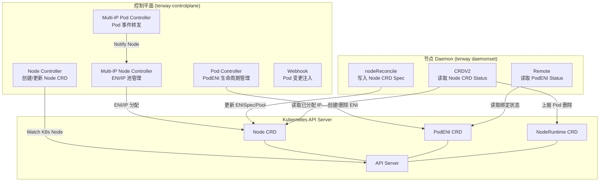
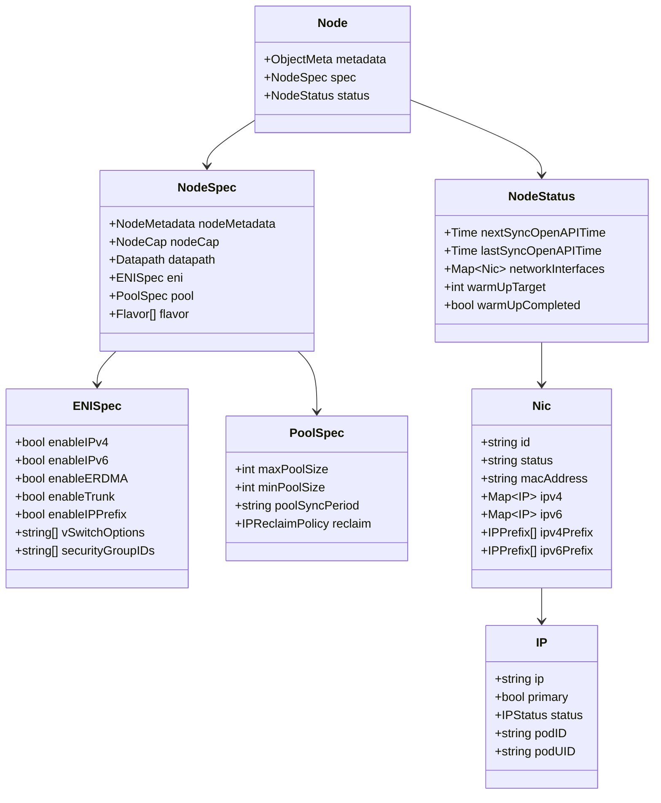
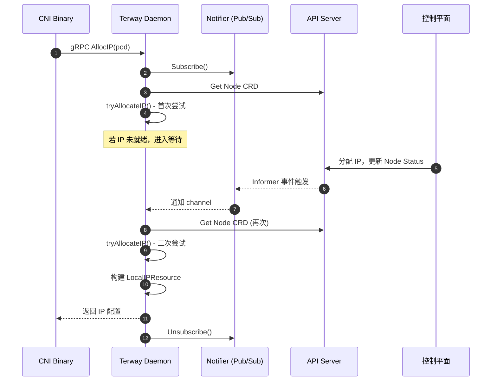
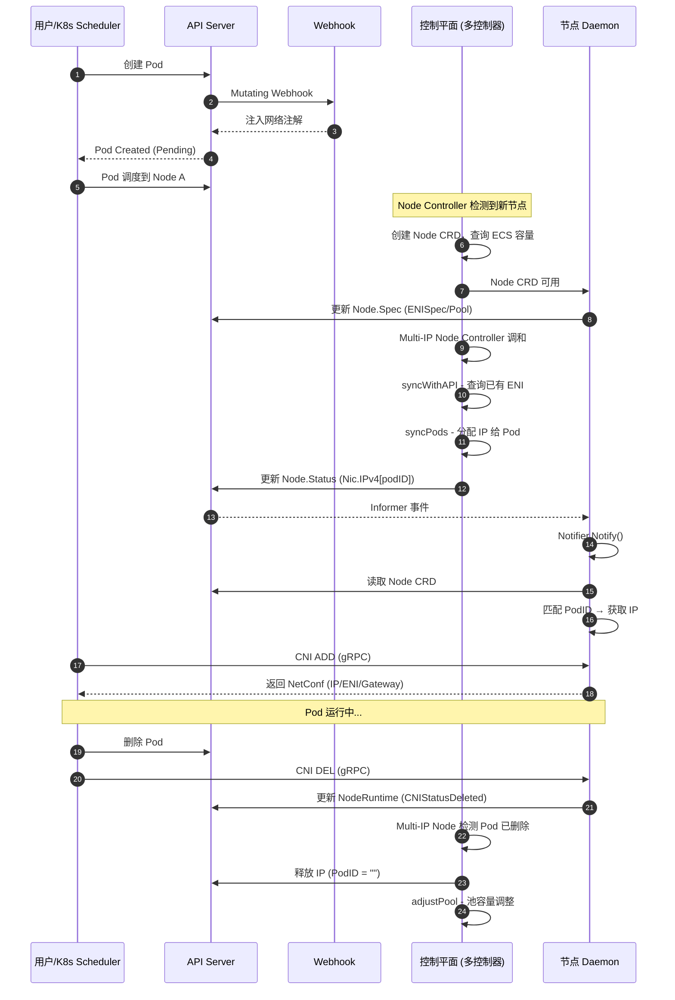

Terway 的**中心化 IPAM（Centralized IPAM）**是对早期节点自治 IPAM 模式的架构升级——将 ENI 创建、IP 分配、流控管理等核心职责从每个节点的 Daemon 进程上收至一个以 `controller-runtime` 为基础的集中式控制平面组件。这一设计实现了数据面权限最小化、集群维度流控统一、以及 IPAM 分配记录的全局可观测。本文将从架构动机出发，逐层拆解控制平面与节点之间的协作机制、CRD 数据模型、事件驱动的 IP 分配流程及资源生命周期管理。

Sources: [docs/centralized-ipam.md](docs/centralized-ipam.md#L1-L27), [cmd/terway-controlplane/terway-controlplane.go](cmd/terway-controlplane/terway-controlplane.go#L17-L91)

## 架构动机：从节点自治到中心化协同

在早期设计中，IPAM 由每个节点上运行的 Terway DaemonSet 自主完成：各节点独立调用阿里云 OpenAPI 创建 ENI、分配辅助 IP、维护本地 BoltDB 存储。这种模式存在三个结构性缺陷。**第一**，每个节点都持有 OpenAPI 调用权限，攻击面过大；**第二**，节点各自为政，无法实现集群维度的 API 流控，容易触发云厂商的速率限制；**第三**，IP 分配记录散落在各节点的本地数据库中，运维人员难以从全局视角排查 IP 泄漏或分配失败问题。

中心化 IPAM 将 OpenAPI 调用权限收敛到 `terway-controlplane` 组件（以 Deployment 形式部署，支持 Leader Election），节点上的 Daemon 仅负责写入 Node CRD 的 Spec（声明需求）和读取 Node CRD 的 Status（消费已分配的 IP），从而在权限、流控、可观测性三个维度实现根本性改善。

Sources: [docs/centralized-ipam.md](docs/centralized-ipam.md#L3-L11), [cmd/terway-controlplane/terway-controlplane.go](cmd/terway-controlplane/terway-controlplane.go#L186-L265)

## 整体架构：三层协作模型

中心化 IPAM 的运行时架构可以划分为三个层次：**控制平面**（terway-controlplane）负责全局调度和 OpenAPI 交互，**节点 Daemon**（terway daemonset）负责本地需求声明和 IP 消费，**Kubernetes API Server** 作为两者的共享状态存储和事件总线。

控制平面的控制器注册机制采用声明式模式——每个控制器通过 `register.Add()` 在 `init()` 阶段自注册到全局 `Controllers` 映射表中，主函数根据配置中的 `controllers` 列表动态启用或禁用对应的控制器。这一机制允许运维人员通过配置文件精确控制激活哪些控制器，而不需要重新编译。控制平面启动时会检测 Daemon 的 IPAM 模式（通过 ConfigMap `eni-config`），如果 Daemon 未配置为 CRD 模式，则自动禁用 `multi-ip-node` 和 `multi-ip-pod` 控制器。

Sources: [pkg/controller/register.go](pkg/controller/register.go#L36-L71), [pkg/controller/all/all.go](pkg/controller/all/all.go#L20-L29), [cmd/terway-controlplane/terway-controlplane.go](cmd/terway-controlplane/terway-controlplane.go#L240-L265), [cmd/terway-controlplane/terway-controlplane.go](cmd/terway-controlplane/terway-controlplane.go#L363-L398)

## CRD 数据模型：IPAM 的共享状态基础

中心化 IPAM 依赖四个核心 CRD 作为控制平面与节点之间的协作契约。每个 CRD 承载不同的职责边界，共同构成完整的 IP 分配状态机。

| CRD | 作用域 | 生产者 | 消费者 | 核心职责 |
|-----|--------|--------|--------|----------|
| `Node` (`nodes.network.alibabacloud.com`) | Cluster | Daemon 写 Spec，控制平面写 Status | 控制平面读 Spec，Daemon 读 Status | ENI 列表、IP 池、Pod↔IP 映射 |
| `NodeRuntime` (`noderuntimes.network.alibabacloud.com`) | Cluster | Daemon 写 Status | 控制平面读 Status | CNI 操作状态上报（创建/删除确认） |
| `PodENI` (`podenis.network.alibabacloud.com`) | Namespaced | 控制平面创建/管理 | Daemon 读 Status | 远程 ENI 模式的 IP 绑定状态 |
| `NetworkInterface` | Cluster | 控制平面 | 控制平面 | ENI 资源池追踪（非核心交互路径） |

Sources: [pkg/apis/crds/register.go](pkg/apis/crds/register.go), [pkg/apis/network.alibabacloud.com/v1beta1/node_types.go](pkg/apis/network.alibabacloud.com/v1beta1/node_types.go#L259-L282), [pkg/apis/network.alibabacloud.com/v1beta1/types.go](pkg/apis/network.alibabacloud.com/v1beta1/types.go#L29-L36)

### Node CRD：IPAM 的核心数据载体

Node CRD 是整个中心化 IPAM 最关键的数据结构，其 Spec 部分由节点 Daemon 填写（声明网络需求），Status 部分由控制平面维护（反映实际分配状态）。

`Nic` 结构体中嵌套的 `IPv4`/`IPv6` 字段是 `map[string]*IP` 类型，键为 IP 地址字符串，值为 `IP` 结构体。`IP.PodID` 字段记录当前占用该 IP 的 Pod 标识（`namespace/name` 格式），`IP.Status` 则追踪该 IP 的生命周期状态（`Valid` → `Deleting`）。控制平面通过修改这些字段实现 IP 分配与回收，Daemon 通过 Informer Watch 机制感知变化并完成数据面配置。

Sources: [pkg/apis/network.alibabacloud.com/v1beta1/node_types.go](pkg/apis/network.alibabacloud.com/v1beta1/node_types.go#L163-L258), [pkg/apis/network.alibabacloud.com/v1beta1/node_types.go](pkg/apis/network.alibabacloud.com/v1beta1/node_types.go#L92-L134), [pkg/apis/network.alibabacloud.com/v1beta1/node_types.go](pkg/apis/network.alibabacloud.com/v1beta1/node_types.go#L173-L225)

## 控制平面控制器体系

控制平面注册了六类控制器，各自承担不同的职责。它们通过 `controller-runtime` 框架实现声明式的状态调和（Reconciliation），并通过 `IsControllerEnabled` 函数根据配置动态启用。

### Node Controller：Node CRD 的初始化入口

Node Controller 监听 Kubernetes `corev1.Node` 资源的变化，负责创建或更新对应的 `nodes.network.alibabacloud.com` CRD 实例。当检测到新的 K8s 节点时，它会查询阿里云 ECS API 获取实例的 ENI 容量限制（`Adapters`、`IPv4PerAdapter`、`IPv6PerAdapter` 等），并将这些信息写入 Node CRD 的 `Spec.NodeMetadata` 和 `Spec.NodeCap` 字段。在中心化 IPAM 模式下（`centralizedIPAM: true`），Node Controller 在每次调和结束时还会调用 `node.Notify()` 触发 Multi-IP Node Controller 的下一轮调和，形成联动链路。

Sources: [pkg/controller/node/node.go](pkg/controller/node/node.go#L49-L167), [pkg/controller/node/node.go](pkg/controller/node/node.go#L110-L167)

### Multi-IP Node Controller：IP 池管理的核心引擎

这是中心化 IPAM 中最复杂的控制器，以节点为粒度管理 ENI 创建/删除和 IP 分配/回收。其 `ReconcileNode` 结构体包含了阿里云 OpenAPI 客户端、VSwitch 池、异步 ENI 任务队列等核心依赖。调和流程可以概括为以下步骤：

1. **前置检查**：验证 Node CRD 是否已初始化（`InstanceID`、`ENISpec`、`Pool` 等字段不为空），跳过独占 ENI 模式节点。
2. **全量同步**（`syncWithAPI`）：按需（TTL 到期或新节点首次加入）从阿里云 API 查询节点上实际挂载的所有 ENI，与 CRD 中记录的状态进行合并。合并策略区分三种场景——远端新增 ENI 直接写入 CRD、远端已有的 ENI 合并 IP 变更但保留本地的 `PodID`/`Status` 字段、远端已消失的 ENI 根据 CRD 中状态决定删除或忽略。
3. **Pod 同步**（`syncPods`）：获取节点上所有非 HostNetwork、非 ENI 模式的 Pod，构建 Pod→IP 的映射关系，然后执行六步流水线：释放已删除 Pod 占用的 IP → 从本地池分配 → 调用 API 新增 IP → 二次分配 → 清理中间状态 → 池容量调整。

该控制器的并发度通过 `MultiIPNodeMaxConcurrent` 配置（默认 500），并采用指数退避的速率限制器防止 API 过载。

Sources: [pkg/controller/multi-ip/node/pool.go](pkg/controller/multi-ip/node/pool.go#L61-L177), [pkg/controller/multi-ip/node/pool.go](pkg/controller/multi-ip/node/pool.go#L226-L423), [pkg/controller/multi-ip/node/pool.go](pkg/controller/multi-ip/node/pool.go#L425-L588), [pkg/controller/multi-ip/node/pool.go](pkg/controller/multi-ip/node/pool.go#L639-L723)

### Multi-IP Pod Controller：轻量级事件桥接

Multi-IP Pod Controller 的实现极其精简——仅 70 余行代码。它监听 Pod 的创建/更新/删除事件，对满足 `needProcess` 条件的 Pod，调用 `node.Notify(ctx, pod.Spec.NodeName)` 向 `EventCh` 发送一个 `GenericEvent`，从而触发 Multi-IP Node Controller 对目标节点的重新调和。这种"Pod 变更 → 通知节点控制器"的解耦设计，使得 Pod 事件能够被快速转发，而不在 Pod Controller 中进行任何 IP 分配逻辑。

Sources: [pkg/controller/multi-ip/pod/pod.go](pkg/controller/multi-ip/pod/pod.go#L22-L71)

### Pod Controller：远程 ENI 模式的生命周期管理

Pod Controller 负责远程 ENI（Remote IP）模式下的 `PodENI` CRD 生命周期管理。当 Pod 创建时，它解析 Pod 的网络需求（固定 IP、安全组、vSwitch 等），调用阿里云 API 创建 ENI 并分配 IP，然后创建 `PodENI` CRD 记录分配结果。当 Pod 删除时，对于弹性 IP 类型（`IPAllocTypeElastic`）直接将状态标记为 `ENIPhaseDeleting`，对于固定 IP 类型（`IPAllocTypeFixed`）则标记为 `ENIPhaseDetaching`，保留 ENI 资源以备后续 Pod 复用。

Sources: [pkg/controller/pod/pod_controller.go](pkg/controller/pod/pod_controller.go#L59-L200), [pkg/controller/pod/pod_controller.go](pkg/controller/pod/pod_controller.go#L202-L331), [pkg/controller/pod/pod_controller.go](pkg/controller/pod/pod_controller.go#L349-L390)

## 节点侧协作：Daemon 的双向交互

节点上的 Terway Daemon 以 DaemonSet 形式运行，通过 `SharedCRDManager` 建立与 API Server 的本地缓存连接。Daemon 在中心化 IPAM 模式下扮演两个角色：**Spec 的生产者**（声明节点网络需求）和 **Status 的消费者**（获取已分配的 IP 资源）。

### 节点信息上报：nodeReconcile

Daemon 内置的 `nodeReconcile` 控制器监听 Node CRD 的变化，负责从本地 ConfigMap（`eni-config`）读取配置，将 ENI 规格、IP 池参数、数据路径类型等信息写入 Node CRD 的 Spec 部分。具体写入的内容包括：

- **ENISpec**：IP 协议栈（IPv4/IPv6/双栈）、vSwitch 选项、安全组、Trunk/ERDMA 开关、IP Prefix 模式标记
- **PoolSpec**：IP 池的 `maxPoolSize`/`minPoolSize`、同步周期、空闲 IP 回收策略
- **Flavor**：期望的 ENI 类型组合（Trunk × 1 + Secondary × N），由控制平面据此创建对应类型的 ENI
- **Datapath**：数据路径类型（`veth`/`ipvlan`/`datapathv2`）

`nodeReconcile` 还负责 IP Prefix 模式的不可变性检查——一旦 Node CRD 创建后 `EnableIPPrefix` 字段即被锁定，后续配置变更不会生效，以避免 IPAM 状态混乱。

Sources: [pkg/eni/node_reconcile.go](pkg/eni/node_reconcile.go#L39-L272), [pkg/eni/node_reconcile.go](pkg/eni/node_reconcile.go#L80-L187)

### IP 消费：CRDV2 的事件驱动分配

`CRDV2` 是 Daemon 在中心化 IPAM 模式下的核心 NetworkInterface 实现。它通过 `Notifier` 机制实现高效的事件驱动式 IP 分配，而非轮询。分配流程如下：

当 CNI Binary 通过 gRPC 请求 IP 分配时，`CRDV2.Allocate()` 首先立即尝试从本地缓存中查找已分配给该 Pod 的 IP（通过 `PodID` 匹配）。如果未找到，它不会退化为轮询，而是订阅 `Notifier` 的通知 channel，等待控制平面完成 IP 分配并更新 Node CRD Status 后触发的 Informer 事件。收到通知后再次尝试匹配，如此循环直到超时或成功。

`CRDV2` 支持两种资源类型的分配：**LocalIP**（多 IP 模式，从 Node CRD 的 `Nic.IPv4/IPv6` 中读取）和 **RemoteIP**（远程 ENI 模式，从 `PodENI` CRD 的 Status 中读取）。两种模式的分配逻辑封装在 `multiIP()` 和 `remote()` 两个独立方法中。

Sources: [pkg/eni/crdv2.go](pkg/eni/crdv2.go#L135-L296), [pkg/eni/crdv2.go](pkg/eni/crdv2.go#L298-L404), [pkg/eni/crdv2.go](pkg/eni/crdv2.go#L426-L448), [pkg/eni/notify.go](pkg/eni/notify.go#L10-L63)

### Pod 删除上报：NodeRuntime 协同

Daemon 通过 `NodeRuntime` CRD 向控制平面报告 Pod 的 CNI 删除完成状态。当 CNI DEL 被调用时，Daemon 将 Pod UID 记录到内部的 `deletedPods` 映射中，随后由定时任务（每 3 秒）将批量删除信息写入 `NodeRuntime.Status.Pods`，标记为 `CNIStatusDeleted`。控制平面的 Multi-IP Node Controller 在执行 `releasePodNotFound` 时读取这一状态，确认 Pod 的 CNI 清理已完成，才安全地释放其占用的 IP 资源。这形成了"Daemon 上报 → 控制平面确认 → IP 释放"的三步安全回收链路。

Sources: [pkg/eni/crdv2.go](pkg/eni/crdv2.go#L237-L248), [pkg/eni/crdv2.go](pkg/eni/crdv2.go#L516-L563), [pkg/controller/multi-ip/node/pool.go](pkg/controller/multi-ip/node/pool.go#L726-L778)

## 两种 IP 分配路径：Local IP 与 Remote IP

中心化 IPAM 根据网络模式的不同，提供两条独立的 IP 分配路径。两者在 CRD 使用、控制平面逻辑和 Daemon 消费方式上存在显著差异。

| 维度 | Local IP（多 IP 模式） | Remote IP（远程 ENI 模式） |
|------|------------------------|---------------------------|
| 控制平面操作 | 在 Node CRD Status 中分配 IP | 创建独立 PodENI CRD |
| ENI 所有权 | ENI 归节点所有，多个 Pod 共享 | 每个 Pod 独享一个 ENI |
| Daemon 读取来源 | `Node.Status.NetworkInterfaces[*].IPv4/IPv6` | `PodENI.Status.Phase == Bind` |
| 通知机制 | `Notifier`（Node CRD Informer 事件） | `podENINotifier`（PodENI Informer 事件） |
| IP 回收触发 | `NodeRuntime.Status.Pods[uid].Status == Deleted` | Pod Controller 将 Phase 标记为 Deleting |
| 适用场景 | 标准多 IP 模式、IP Prefix 模式 | Trunk 模式下的 Member ENI、独占 ENI 模式 |

Sources: [pkg/eni/crdv2.go](pkg/eni/crdv2.go#L226-L235), [pkg/eni/remote.go](pkg/eni/remote.go#L128-L177), [pkg/eni/remote_v2.go](pkg/eni/remote_v2.go#L82-L93)

## 端到端流程：一个 Pod 的 IP 分配生命周期

以下序列图展示了一个标准 Pod 在中心化 IPAM 模式下的完整 IP 分配生命周期，涵盖从 Webhook 注入到 CNI 返回配置的全链路。

Sources: [pkg/controller/node/node.go](pkg/controller/node/node.go#L110-L167), [pkg/controller/multi-ip/node/pool.go](pkg/controller/multi-ip/node/pool.go#L226-L423), [pkg/eni/crdv2.go](pkg/eni/crdv2.go#L254-L296)

## 异步 ENI 操作与任务队列

在 ENI Attach 操作中，控制平面引入了异步任务队列 `ENITaskQueue` 来避免阻塞调和循环。ENI 的挂载操作通常需要数秒到数十秒，如果同步等待会严重降低控制器的吞吐量。任务队列的工作模式如下：

1. `syncPods` 判断需要新建 ENI 时，将 ENI 创建请求（类型、vSwitch、安全组等）封装为任务提交到 `ENITaskQueue`
2. 任务队列以配置的 `ENIMaxConcurrent`（默认 300）并发度执行阿里云 API 调用
3. 任务完成后通过 `eniNotifyCh` 通知控制器触发下一轮调和
4. 控制器在 `ensureAsyncTasks` 中恢复因重启丢失的进行中任务，确保 ENI 操作不会遗漏

这一设计使得控制器能够同时管理数百个节点的 ENI 操作，而不会因为单个慢速 API 调用拖慢整个系统。

Sources: [pkg/controller/multi-ip/node/pool.go](pkg/controller/multi-ip/node/pool.go#L127-L143), [pkg/controller/multi-ip/node/pool.go](pkg/controller/multi-ip/node/pool.go#L206-L212)

## 资源池水位与 GC 策略

Multi-IP Node Controller 的 `adjustPool` 方法负责维护 IP 池的健康水位。它按照以下优先级选择要缩容的 ENI：

1. **优先释放空闲 ENI**：如果某个 ENI 没有任何 Pod 占用 IP，且类型为 Secondary（非 Trunk/ERDMA），直接将整个 ENI 标记为删除
2. **其次释放空闲 IP**：如果需要释放的 IP 数量小于单个 ENI 上的空闲 IP 数量，仅释放空闲 IP（标记为 `Deleting` 状态），保留 ENI
3. **释放时保持平衡**：同时考虑 IPv4 和 IPv6 的空闲数量，取较大值作为释放基线，避免协议栈间的不平衡

空闲 IP 回收策略（`IPReclaimPolicy`）支持配置回收延迟时间（`after`）、检查间隔（`interval`）、批量大小（`batchSize`）和抖动因子（`jitterFactor`），提供细粒度的回收控制。

Sources: [pkg/controller/multi-ip/node/eni.go](pkg/controller/multi-ip/node/eni.go#L79-L124), [pkg/apis/network.alibabacloud.com/v1beta1/node_types.go](pkg/apis/network.alibabacloud.com/v1beta1/node_types.go#L122-L152)

## 与 IP Prefix 模式的关系

当 `ENISpec.EnableIPPrefix` 为 `true` 时，中心化 IPAM 切换到前缀模式——不再为每个 Pod 分配单个 IP，而是为每个 ENI 分配整个 `/28` 或 `/64` 子网前缀。此时控制平面的职责边界发生变化：控制器仅确保每个 ENI 上有足够数量的前缀，Pod↔IP 的分配记录不再存储在 Node CRD 中，而是交由节点侧的 `eni_local_ipam` 管理。前缀模式的详细机制将在 [IP Prefix 模式：基于子网前缀的大规模 IP 分配策略](11-ip-prefix-mo-shi-ji-yu-zi-wang-qian-zhui-de-da-gui-mo-ip-fen-pei-ce-lue) 中深入分析。

Sources: [pkg/controller/multi-ip/node/pool.go](pkg/controller/multi-ip/node/pool.go#L653-L686)

## 配置参考

中心化 IPAM 的行为通过控制平面配置文件（`ctrl-config.yaml`）控制，以下列出核心配置项及其语义。

| 配置项 | 默认值 | 说明 |
|--------|--------|------|
| `controllers` | `[]` | 控制器启用列表，支持通配符 `*` 和前缀 `-` 禁用 |
| `centralizedIPAM` | `false` | 启用中心化 IPAM 模式 |
| `ipamType` | `""` | IPAM 类型，CRD 模式为 `"crd"` |
| `multiIPPodMaxConcurrent` | `500` | Multi-IP Pod 控制器并发数 |
| `multiIPNodeMaxConcurrent` | `500` | Multi-IP Node 控制器并发数 |
| `multiIPNodeSyncPeriod` | `12h` | 全量 OpenAPI 同步周期 |
| `multiIPGCPeriod` | `2m` | GC 检查周期 |
| `eniMaxConcurrent` | `300` | 异步 ENI 操作最大并发数 |
| `rateLimit` | `{}` | 阿里云 API 速率限制配置 |

Sources: [types/controlplane/config_default.go](types/controlplane/config_default.go#L24-L114)

## 延伸阅读

- [ENI 资源管理器：IP 池化、水位控制与资源回收机制](9-eni-zi-yuan-guan-li-qi-ip-chi-hua-shui-wei-kong-zhi-yu-zi-yuan-hui-shou-ji-zhi) — 本地 IPAM 的底层实现
- [IP Prefix 模式：基于子网前缀的大规模 IP 分配策略](11-ip-prefix-mo-shi-ji-yu-zi-wang-qian-zhui-de-da-gui-mo-ip-fen-pei-ce-lue) — 前缀模式的 IP 分配策略
- [控制平面控制器详解：ENI 控制器、Multi-IP 控制器与 Pod 控制器](14-kong-zhi-ping-mian-kong-zhi-qi-xiang-jie-eni-kong-zhi-qi-multi-ip-kong-zhi-qi-yu-pod-kong-zhi-qi) — 各控制器的详细调和逻辑
- [空闲 IP 回收与资源调度：DevicePlugin 与节点容量感知](12-kong-xian-ip-hui-shou-yu-zi-yuan-diao-du-deviceplugin-yu-jie-dian-rong-liang-gan-zhi) — 回收策略与 DevicePlugin 集成