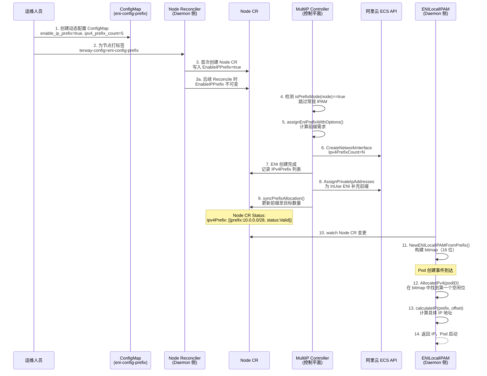
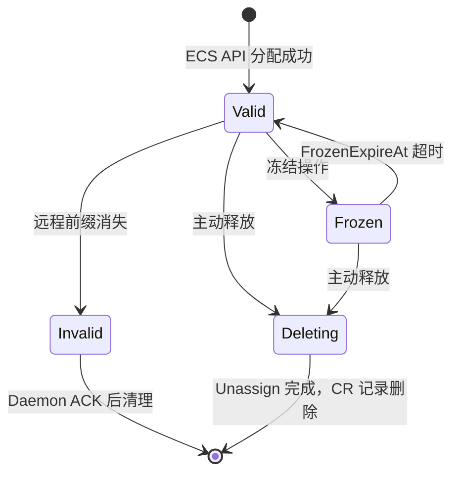
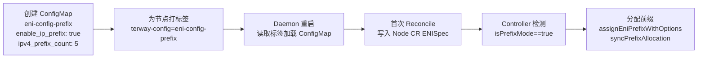

Terway 的 **IP Prefix 模式**是一种面向大规模 Kubernetes 集群的 IP 地址管理（IPAM）策略。与传统模式逐个分配独立的辅助私有 IP 不同，Prefix 模式在 ENI（弹性网卡）上以 **CIDR 前缀**（如 `/28`，包含 16 个连续 IP）为单位批量获取地址段，随后由节点本地 Daemon 从这些前缀中为 Pod 按需分配具体 IP。这种"**控制平面管前缀，数据平面管地址**"的两层架构显著减少了 ECS API 调用频次、提高了 Pod 启动速度，是支撑高密度部署场景的核心机制。本文将深入剖析 Prefix 模式的架构设计、数据流、关键数据结构与配置实践。

Sources: [docs/ip-prefix.md](docs/ip-prefix.md#L1-L50), [pkg/controller/multi-ip/node/pool.go](pkg/controller/multi-ip/node/pool.go#L653-L656)

## 架构定位：Prefix 模式与传统 IPAM 的本质差异

在理解 Prefix 模式之前，需要明确它与 Terway 其他 IPAM 模式的根本区别。传统 ENI 多 IP 模式下，控制平面控制器通过 ECS API 为每个 ENI 分配独立的辅助 IP 地址，并在 Node CR 中记录每个 IP 与 Pod 的绑定关系。Prefix 模式则彻底改变了这一职责划分：

| 维度 | 传统 ENI 多 IP 模式 | IP Prefix 模式 |
|------|---------------------|---------------|
| **分配单位** | 单个 IP 地址（如 `10.244.17.119`） | CIDR 前缀（如 `10.244.126.48/28`，含 16 个 IP） |
| **控制平面职责** | 管理 Pod↔IP 绑定，存储于 Node CR | 仅确保前缀数量满足目标，不存储 Pod 绑定 |
| **Daemon 职责** | 从预分配 IP 池中选择 IP | 在本地 bitmap 上从前缀中分配具体 IP |
| **API 调用频率** | 每个 IP 一次调用 | 每个前缀（16 IP）一次调用 |
| **预热机制** | 池化管理、水位控制 | 跳过常规预热流程 |
| **适用规模** | 中小规模集群 | 大规模、高密度部署集群 |

这种分层设计的核心优势在于：**控制平面只关心"前缀够不够"，数据平面自己决定"具体给哪个 IP"**。一个 `/28` 前缀包含 16 个 IP，一次 API 调用即可覆盖 16 个 Pod 的 IP 需求，将 ECS API 的调用压力降低了约一个数量级。

Sources: [docs/ip-prefix.md](docs/ip-prefix.md#L12-L18), [pkg/controller/multi-ip/node/pool.go](pkg/controller/multi-ip/node/pool.go#L653-L655)

## 端到端数据流：从配置到 Pod 获取 IP

以下是 Prefix 模式下，一个节点从配置到为 Pod 分配 IP 的完整生命周期。阅读此图前需理解两个核心概念：**控制平面**（terway-controlplane，运行在集群级别）负责通过 ECS API 管理前缀；**数据平面**（terway Daemon，运行在每个节点上）负责从已有前缀中为 Pod 分配具体 IP。



Sources: [pkg/eni/node_reconcile.go](pkg/eni/node_reconcile.go#L174-L186), [pkg/controller/multi-ip/node/pool.go](pkg/controller/multi-ip/node/pool.go#L1427-L1618), [pkg/eni/local_delegate.go](pkg/eni/local_delegate.go#L272-L325), [pkg/eni/eni_local_ipam.go](pkg/eni/eni_local_ipam.go#L46-L100)

## 控制平面前缀管理

### 前缀需求计算与 ENI 创建

当控制平面的 `ReconcileNode` 检测到节点处于 Prefix 模式时（`isPrefixMode(node)` 返回 `true`），整个 IPAM 流程发生根本性变化：常规的 `addIP` 和 `adjustPool` 被完全跳过，取而代之的是两条专用的前缀管理路径。

**第一条路径**——`assignEniPrefixWithOptions()` 负责**新建 ENI 时的前缀规划**。该函数首先统计已有 InUse ENI 和 Attaching（异步挂载中）ENI 上的前缀总数，计算出剩余需求量 `remainingV4Demand`。接着，它会检查现有 InUse ENI 是否还有空闲槽位（`existingV4Capacity`）来容纳更多前缀——如果现有 ENI 足够，则**跳过创建新 ENI**，转由第二条路径处理。只有当现有 ENI 容量不足时，才会创建新 ENI 并在 `CreateNetworkInterface` API 调用中直接指定 `Ipv4PrefixCount`。每个新 ENI 的前缀容量上限为 `IPv4PerAdapter - 1`（预留 1 个给主 IP），且单次 API 调用最多分配 10 个前缀。

**第二条路径**——`syncPrefixAllocation()` 负责**已有 InUse ENI 的前缀补充**。它遍历所有 InUse 状态的 ENI，计算每个 ENI 的剩余槽位（`IPv4PerAdapter - len(IPv4) - len(IPv4Prefix)`），在槽位允许的前提下通过 `AssignPrivateIpAddresses` API 为 ENI 补充前缀，直到节点前缀总数达到 `IPv4PrefixCount` 目标。

Sources: [pkg/controller/multi-ip/node/pool.go](pkg/controller/multi-ip/node/pool.go#L1427-L1458), [pkg/controller/multi-ip/node/pool.go](pkg/controller/multi-ip/node/pool.go#L2719-L2802)

### 前缀状态机与生命周期

每个 IP 前缀在 Node CR 中以 `IPPrefix` 结构体表示，其状态遵循严格的状态机：



| 状态 | 含义 | 关键行为 |
|------|------|---------|
| **Valid** | 前缀正常可用 | 允许新的 Pod IP 分配 |
| **Frozen** | 前缀暂时冻结 | 阻止新分配，但已有 Pod 不受影响；`FrozenExpireAt` 到期后自动恢复为 Valid |
| **Invalid** | 前缀无效（云端已消失） | 终态，不可回退到 Valid；等待 Daemon 确认后清理 |
| **Deleting** | 前缀正在删除中 | 已发起 ECS Unassign 调用；完成后从 CR 中移除 |

**前缀合并机制**（`mergeIPPrefixes`）是状态管理的核心。每次控制平面通过 `DescribeNetworkInterface` 从 ECS 获取实际前缀列表后，会与 Node CR 中的本地记录进行三方合并：远程存在且本地也存在的前缀保留本地完整状态；远程存在但本地缺失的作为新 Valid 前缀添加；远程缺失但本地状态为 Deleting 的直接移除；远程缺失但本地为 Valid/Frozen 的标记为 Invalid，等待 Daemon 确认。

Sources: [pkg/apis/network.alibabacloud.com/v1beta1/node_types.go](pkg/apis/network.alibabacloud.com/v1beta1/node_types.go#L52-L61), [pkg/apis/network.alibabacloud.com/v1beta1/node_types.go](pkg/apis/network.alibabacloud.com/v1beta1/node_types.go#L190-L194), [pkg/controller/multi-ip/node/eni.go](pkg/controller/multi-ip/node/eni.go#L163-L211), [pkg/controller/multi-ip/node/pool.go](pkg/controller/multi-ip/node/pool.go#L2649-L2687)

### IPv6 双栈的前缀策略

Prefix 模式对 IPv6 的处理体现了**按场景分化**的设计哲学：

| 网络模式 | IPv4 前缀 | IPv6 前缀 |
|---------|----------|----------|
| **IPv4 单栈** | 由 `ipv4_prefix_count` 控制 | 不分配 |
| **IPv6 单栈** | 不分配 | 由 `ipv6_prefix_count` 控制（0 或 1） |
| **双栈** | 由 `ipv4_prefix_count` 控制 | **自动**：每个拥有 IPv4 前缀的 ENI 恰好 1 个 |

双栈模式下，用户**无需也不应配置** `ipv6_prefix_count`。`syncPrefixAllocation()` 会自动检测：如果某个 InUse ENI 有 IPv4 前缀但没有 IPv6 前缀，就通过 `AssignIpv6Addresses` API 自动分配 1 个 IPv6 前缀。在 `assignEniPrefixWithOptions()` 中，每个携带 IPv4 前缀的新 ENI 同样自动获得 1 个 IPv6 前缀（`addIPv6PrefixN = 1`）。

Sources: [pkg/controller/multi-ip/node/pool.go](pkg/controller/multi-ip/node/pool.go#L1441-L1446), [pkg/controller/multi-ip/node/pool.go](pkg/controller/multi-ip/node/pool.go#L1604-L1613), [pkg/controller/multi-ip/node/pool.go](pkg/controller/multi-ip/node/pool.go#L2782-L2799)

## 数据平面本地 IPAM：ENILocalIPAM

### 数据结构：位图驱动的地址分配

`ENILocalIPAM` 是 Prefix 模式在节点本地的核心数据结构。它为每个 ENI 维护一个独立的 IPAM 实例，内部使用 **bitset 位图**来追踪前缀内每个 IP 的分配状态：

```go
type ENILocalIPAM struct {
    lock        sync.RWMutex
    eniID       string
    eniMAC      string
    gatewayIP   types.IPSet
    vSwitchCIDR types.IPNetSet
    vSwitchID   string

    ipv4PrefixMap map[string]*PrefixInfo   // CIDR → PrefixInfo
    ipv6PrefixMap map[string]*PrefixInfo
    podToPrefixV4 map[string]string        // PodID → Prefix CIDR（快速反向查找）
    podToPrefixV6 map[string]string
}

type PrefixInfo struct {
    Prefix    string
    bitmap    *bitset.BitSet             // 每一位代表一个 IP
    allocated map[string]uint            // PodID → offset（快速释放）
    status    networkv1beta1.IPPrefixStatus
}
```

**初始化**时（`NewENILocalIPAMFromPrefix`），Daemon 从 Node CR 的 `eni.IPv4Prefix` / `eni.IPv6Prefix` 列表构建 `PrefixInfo`：为每个 Valid 或 Frozen 状态的前缀创建指定位数的位图。对于 IPv4 `/28` 前缀，位图大小为 16（2^4）；对于 IPv6 `/80` 前缀，由于地址空间过大（2^48），系统将其**截断为 65536 个地址**（`IPv6PrefixMaxAddresses`），仅使用最低 16 位偏移量。

Sources: [pkg/eni/eni_local_ipam.go](pkg/eni/eni_local_ipam.go#L28-L43), [pkg/eni/eni_local_ipam.go](pkg/eni/eni_local_ipam.go#L46-L100), [pkg/eni/eni_local_ipam.go](pkg/eni/eni_local_ipam.go#L484-L510)

### 分配算法：紧凑优先（Best-Fit Packing）

`AllocateIPv4` / `AllocateIPv6` 的分配策略遵循**紧凑优先**原则：通过 `sortedValidPrefixes()` 将所有 Valid 状态的前缀按**剩余容量升序**排列（最满的排最前），然后遍历这个有序列表，在第一个有空闲位的前缀中分配。这种策略的目的是**尽可能填满已有前缀**，使得空闲前缀可以被尽早释放。

具体分配步骤如下：
1. **幂等检查**：如果 Pod 已有分配记录（`podToPrefixV4`），直接返回之前分配的 IP
2. **遍历前缀**：按紧凑度排序后，在第一个有空闲位的前缀中执行 `bitmap.NextClear(0)` 找到最小空闲偏移
3. **计算 IP**：`calculateIP(prefix, offset)` 将 CIDR 网络地址 + 偏移量转换为一个具体的 `netip.Addr`
4. **记录映射**：`allocated[podID] = offset` 和 `podToPrefixV4[podID] = prefixCIDR` 建立双向索引

**释放**操作（`ReleaseIPv4` / `ReleaseIPv6`）则通过 `podToPrefix` 反向索引找到对应前缀和偏移，清除位图位并删除映射记录，时间复杂度 O(1)。

Sources: [pkg/eni/eni_local_ipam.go](pkg/eni/eni_local_ipam.go#L187-L204), [pkg/eni/eni_local_ipam.go](pkg/eni/eni_local_ipam.go#L206-L238), [pkg/eni/eni_local_ipam.go](pkg/eni/eni_local_ipam.go#L277-L296), [pkg/eni/eni_local_ipam.go](pkg/eni/eni_local_ipam.go#L421-L455)

### LocalDelegate：Daemon 侧的前缀生命周期管理

`LocalDelegate` 是 `ENILocalIPAM` 的管理外壳，负责与 Node CR 的同步交互。其核心生命周期如下：

**初始化阶段**（`doInit`）：Daemon 启动时，`LocalDelegate` 读取 Node CR 中所有 InUse 状态的 ENI，为每个包含前缀的 ENI 创建 `ENILocalIPAM` 实例。随后，它遍历本节点上已有的 Pod 资源记录，调用 `RestorePod()` 恢复之前的分配状态——通过 `findPrefixContainingIP()` 将已有 IP 地址反查到对应前缀和偏移，重建位图。

**运行阶段**（`watchNodeCR`）：一个后台 goroutine 监听 Node CR 的变更事件，执行 `syncNodeCR()`：
- 对于 CR 中新增的 InUse ENI，创建新的 IPAM 实例
- 对于已有的 IPAM，调用 `UpdatePrefixes()` 同步前缀列表（新增前缀创建位图，移除的前缀若已耗尽则删除、否则标记 Deleting）
- 对于从 CR 中消失的 ENI，传入空前缀列表触发清理

**分配阶段**（`tryAllocateLocal`）：当 Pod 创建请求到达时，`LocalDelegate` 遍历所有 IPAM 实例尝试分配。双栈模式下，要求**同一个 ENI 同时分配 IPv4 和 IPv6**——如果某个 ENI 的 IPv4 分配成功但 IPv6 失败，会回滚 IPv4 分配并尝试下一个 ENI。

Sources: [pkg/eni/local_delegate.go](pkg/eni/local_delegate.go#L56-L90), [pkg/eni/local_delegate.go](pkg/eni/local_delegate.go#L186-L253), [pkg/eni/local_delegate.go](pkg/eni/local_delegate.go#L272-L325), [pkg/eni/local_delegate.go](pkg/eni/local_delegate.go#L346-L404)

## 配置模型与不可变性约束

### 动态配置激活流程

Prefix 模式推荐通过**动态配置**（Dynamic Config）激活，而非修改全局 `eni-config`。激活流程分为三步：



**第一步**：为目标节点池创建独立的 ConfigMap（如 `eni-config-prefix`），在 `eni_conf` 中设置 `enable_ip_prefix: true` 和 `ipv4_prefix_count`。

**第二步**：为目标节点打上 `terway-config: eni-config-prefix` 标签。Terway Daemon 启动时读取此标签，加载对应名称的 ConfigMap，以 MergePatch 方式合并到默认配置。

**第三步**：Daemon 的 Node Reconciler 在首次创建 Node CR 时，将 `enable_ip_prefix` 写入 `ENISpec.EnableIPPrefix`。

Sources: [pkg/eni/node_reconcile.go](pkg/eni/node_reconcile.go#L174-L186), [docs/ip-prefix.md](docs/ip-prefix.md#L82-L118)

### 不可变性约束

`EnableIPPrefix` 具有**严格的一次性写入语义**。Node Reconciler 在首次 reconcile（`beforeENISpec == nil`）时从 ConfigMap 读取并写入 Node CR；此后所有 reconcile 均保留 CR 中的既有值，即使 ConfigMap 发生变更也**不会更新**。如果检测到 ConfigMap 的 `enable_ip_prefix` 与 Node CR 不一致，系统会产生 `PrefixModeImmutable` Warning 事件，但不修改节点配置。

这意味着：**对已有节点启用或禁用 Prefix 模式的唯一方式是将节点从集群中删除并重新加入**。新节点加入时会读取最新的 ConfigMap 配置。

Sources: [pkg/eni/node_reconcile.go](pkg/eni/node_reconcile.go#L174-L186), [docs/ip-prefix.md](docs/ip-prefix.md#L205-L216)

### 配置参数一览

| 参数 | 类型 | 默认值 | 说明 |
|------|------|--------|------|
| `enable_ip_prefix` | bool | false | 是否启用 Prefix 模式，仅首次创建 Node CR 时生效 |
| `ipv4_prefix_count` | int | 0 | 节点 IPv4 前缀总数目标，在 IPv4 单栈和双栈模式下有效 |
| `ipv6_prefix_count` | int | 0 | 节点 IPv6 前缀总数，**仅 IPv6 单栈**有效（取值 0 或 1）；双栈模式下忽略此字段 |

**容量计算公式**：
- 每个 ENI 的最大前缀数 = `IPv4PerAdapter - 1`（预留 1 给主 IP）
- 单次 ECS API 调用最多分配 10 个前缀（`maxPrefixPerAPICall = 10`）
- 前缀数 × 16（/28）= 可用 IP 总数

Sources: [pkg/apis/network.alibabacloud.com/v1beta1/node_types.go](pkg/apis/network.alibabacloud.com/v1beta1/node_types.go#L108-L119), [pkg/controller/multi-ip/node/pool.go](pkg/controller/multi-ip/node/pool.go#L75-L77)

## 容量规划与 ECS 规格约束

前缀数量规划是 Prefix 模式运维的关键。假设某 ECS 规格的 `IPv4PerAdapter = 20`，则每个 ENI 最多承载 19 个前缀（304 个 IP）。节点总容量取决于 ENI 数量和每 ENI 前缀上限的乘积。

**规划步骤**：
1. 计算所需前缀数：`ceil(预计 Pod 数 / 16)`
2. 预留 20% 余量应对 Pod 增长
3. 确认 ENI 数量 × 每 ENI 前缀上限 ≥ 所需前缀数

例如，节点预计运行 200 个 Pod：`200 / 16 = 12.5`，向上取整为 13，预留 20% 后约 16 个前缀。如果 `IPv4PerAdapter = 20`（每 ENI 最多 19 个前缀），则 1 个 ENI 即可满足。但为提高容错性，前缀会自动分布在多个 ENI 上。

**互斥性约束**：当 `addIPv4PrefixN > 0` 时，`addIPv4N = 0`——即 Prefix 模式下不为 ENI 分配独立的辅助 IP。ECS API 的限制是**前缀和辅助 IP共享 ENI 的 `IPv4PerAdapter` 配额**，但在 Prefix 模式下控制器不会主动分配辅助 IP。

**EFLO 节点排除**：灵骏（EFLO）节点不支持 Prefix 模式。`isPrefixMode()` 对 EFLO 节点始终返回 `false`，且 Node Reconciler 会将 EFLO 节点的 `EnableIPPrefix` 强制设为 `false`。

Sources: [pkg/controller/multi-ip/node/pool.go](pkg/controller/multi-ip/node/pool.go#L2639-L2647), [pkg/eni/node_reconcile.go](pkg/eni/node_reconcile.go#L328-L333), [docs/ip-prefix.md](docs/ip-prefix.md#L266-L290)

## 故障排查指南

### 前缀未分配

**现象**：Node CR 中没有 IPv4Prefix 记录。

**排查路径**：
1. 检查节点标签：`kubectl get node <node> --show-labels | grep terway-config`
2. 检查动态配置 ConfigMap 中 `enable_ip_prefix` 是否为 `true`
3. 检查 Node CR 的 `spec.eniSpec.enableIPPrefix` 字段——如果节点在配置前已加入集群，该值为 `false` 且不可变更
4. 检查 `ipv4_prefix_count` 是否大于 0
5. 确认节点不是 EFLO 类型

### Pod 无法获取 IP

**现象**：Pod 处于 `ContainerCreating`，事件显示 IP 分配失败。

**关键区分**：Controller 只确保前缀存在，Pod↔IP 绑定由 Daemon 管理。如果 Node CR 中已有 Valid 前缀但 Pod 仍无法获取 IP，问题在 Daemon 侧：
1. 查看 Daemon 日志：`kubectl logs -n kube-system -l app=terway --container=terway`
2. 检查 `ENILocalIPAM` 的位图是否已满（所有前缀的 IP 都已分配）
3. 确认 Daemon 是否正确 watch 到了 Node CR 的前缀更新

### 关键日志关键字

| 日志关键字 | 含义 |
|-----------|------|
| `syncPrefixAllocation` | 控制平面正在同步前缀分配 |
| `assignIPv4Prefix` / `assignIPv6Prefix` | 正在通过 ECS API 分配前缀 |
| `prefix mode active, skipping regular IPAM` | Prefix 模式已激活，跳过传统 IPAM |
| `PrefixModeImmutable` | 配置不可变警告 |

Sources: [docs/ip-prefix.md](docs/ip-prefix.md#L309-L396), [pkg/controller/multi-ip/node/pool.go](pkg/controller/multi-ip/node/pool.go#L656-L657)

## 与其他子系统的交互

Prefix 模式与 Terway 其他子系统存在明确的交互边界：

- **[ENI 资源管理器](9-eni-zi-yuan-guan-li-qi-ip-chi-hua-shui-wei-kong-zhi-yu-zi-yuan-hui-shou-ji-zhi)**：Prefix 模式跳过常规的 IP 池管理（`addIP`、`adjustPool`），池大小被置零（`MaxPoolSize=0, MinPoolSize=0`）。ENI 的创建和挂载流程复用通用机制，但 IP 分配逻辑完全不同。
- **[中心化 IPAM](10-zhong-xin-hua-ipam-kong-zhi-ping-mian-yu-jie-dian-xie-tong-de-ip-fen-pei-jia-gou)**：Prefix 模式本质上是中心化 IPAM 的一种变体——控制平面管理前缀粒度的资源，数据平面管理地址粒度的分配。两者共享 Node CR 和 `ReconcileNode` 控制器的基础设施。
- **[CRD 与控制器体系](13-zi-ding-yi-zi-yuan-ding-yi-crd-podeni-podnetworking-node-networkinterface)**：Prefix 模式的所有状态存储在 `Node` CR 的 `Nic.IPv4Prefix` / `Nic.IPv6Prefix` 字段中，不使用 `PodENI` CR。
- **[IPv6 双栈](19-ipv6-shuang-zhan-zhi-chi-yu-ip-xie-yi-zhan-pei-zhi)**：双栈场景下 IPv6 前缀的自动分配是 Prefix 模式的独特行为，与独立 IPv6 模式的手动配置形成对比。