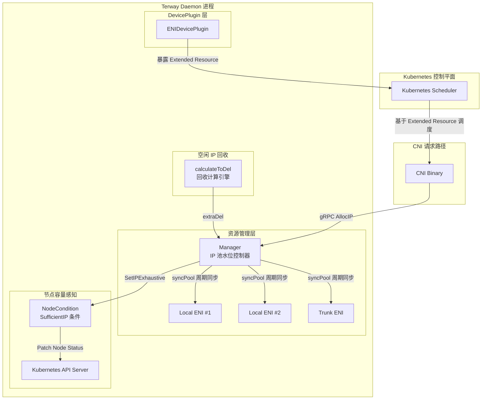
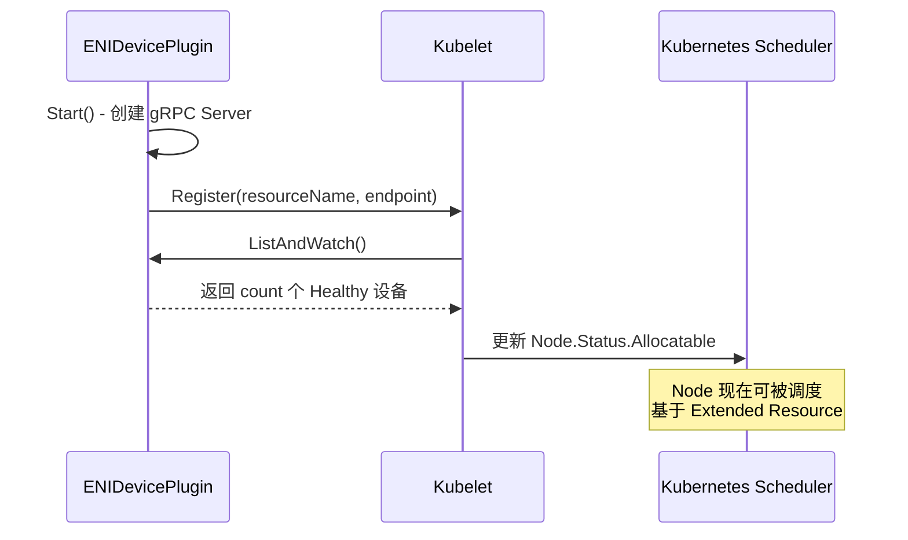
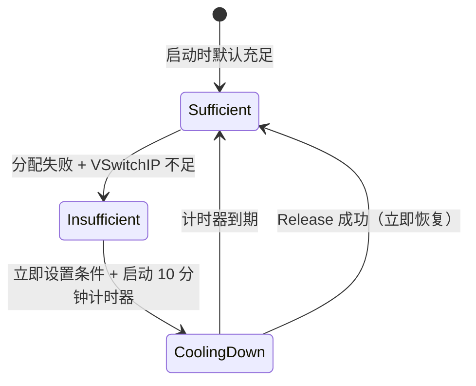
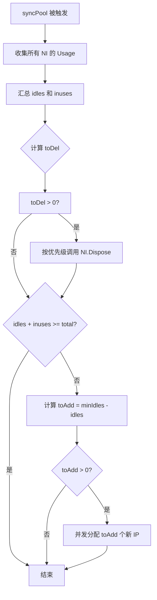
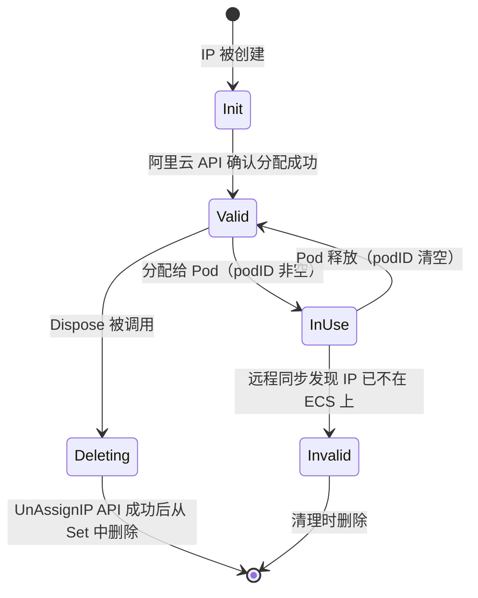
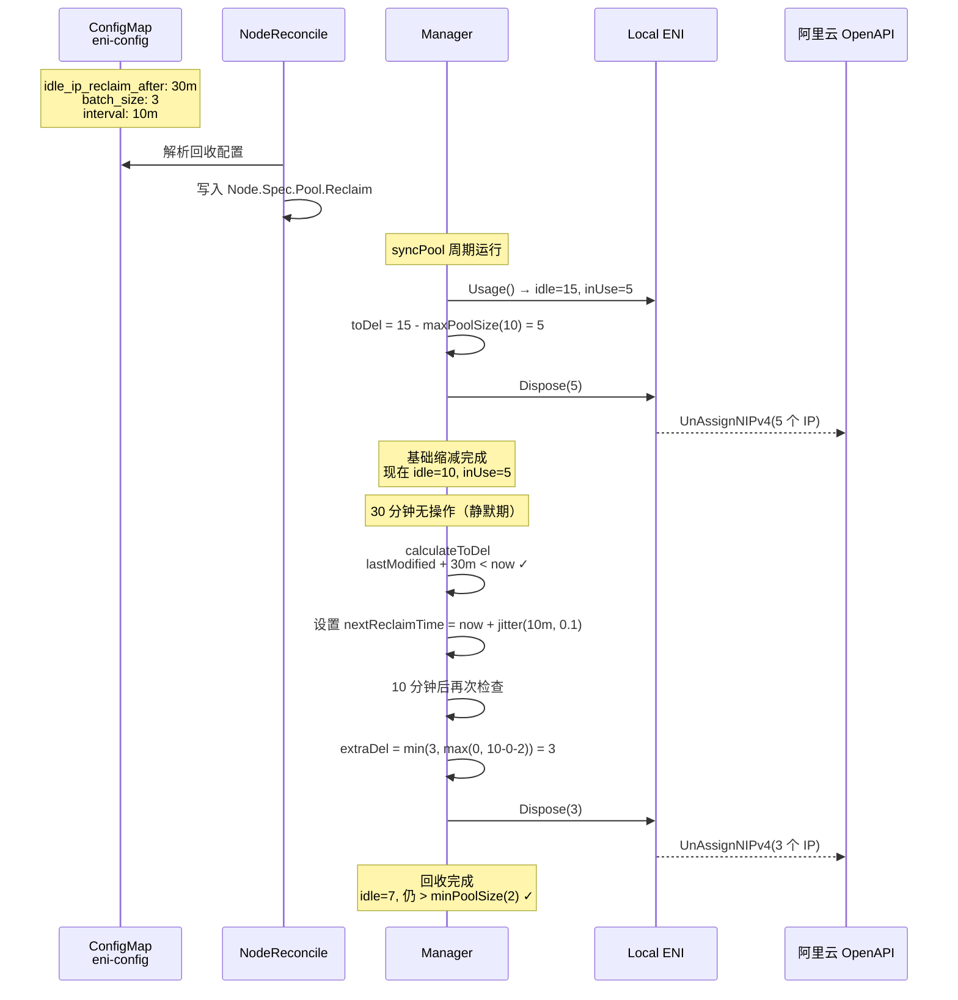

在 ENI 多 IP 模式下，Terway 需要在每个节点上维护一个 IP 资源池，以减少 Pod 创建时的延迟。然而，IP 地址是受限资源——VPC 子网的可用 IP 数量有限，过度的预分配不仅浪费资源，还可能触发阿里云 API 限流。本文将深入剖析 Terway 的三层资源调度机制：**Kubernetes DevicePlugin** 负责向调度器暴露 ENI/ERDMA 的可调度容量，**Manager.syncPool** 负责池水位的弹性调整，以及 **空闲 IP 回收策略** 在静默期自动释放多余 IP。三者协同工作，使 Terway 能够在 IP 利用率与分配延迟之间取得精准平衡。

Sources: [daemon.go](daemon/daemon.go#L930-L949), [manager.go](pkg/eni/manager.go#L1-L465)

## 整体架构：三层资源调度的协作关系

在深入每个子系统之前，理解三者在整体数据流中的位置至关重要。下面的架构图展示了从 Pod 调度到 IP 回收的完整生命周期：



**DevicePlugin** 是面向 Kubernetes 调度器的"前端"——它将 ENI 的可用 IP 数量注册为 Extended Resource（如 `aliyun/eni`、`aliyun/member-eni`、`aliyun/erdma`），使调度器能够感知节点的真实网络容量。**Manager** 是面向 CNI 请求的"中端"——它管理多个 `NetworkInterface` 实例（Local、Trunk、Remote），通过周期性的 `syncPool` 操作调整池水位。**空闲 IP 回收**则是 Manager 内置的"后端优化器"，在检测到 IP 池长期未被修改时，逐步释放超出 `min_pool_size` 的空闲 IP。

Sources: [eni.go](deviceplugin/eni.go#L1-L343), [manager.go](pkg/eni/manager.go#L297-L374), [manager.go](pkg/eni/manager.go#L422-L464)

## DevicePlugin：向调度器暴露节点网络容量

### 核心设计

Kubernetes 的 DevicePlugin 机制允许第三方设备厂商向 Pod 暴露额外的计算资源。Terway 利用这一机制，将 ENI 的 IP 容量注册为 **Extended Resource**，使调度器在调度 Pod 时能够准确判断节点是否有足够的网络资源。

Terway 定义了三种 ENI 资源类型，每种对应一个独立的 DevicePlugin 实例：

| 资源类型 | 资源名称 | 用途 | 注册条件 |
|----------|----------|------|----------|
| `eni` | `aliyun/eni` | 专属 ENI 模式（ENIOnly） | 当前未使用 |
| `member` | `aliyun/member-eni` | Trunk ENI 的 Member Adapter | 启用 Trunk 模式 |
| `erdma` | `aliyun/erdma` | eRDMA 高性能网络设备 | 启用 eRDMA 且 OS/实例支持 |

Sources: [eni.go](deviceplugin/eni.go#L24-L52)

### 注册流程与生命周期

`ENIDevicePlugin` 实现了标准的 Kubernetes DevicePlugin gRPC 接口。其生命周期包含三个关键阶段：

**启动阶段（Serve）**：创建 Unix Socket，启动 gRPC Server，并向 Kubelet 注册。注册时指定资源名称（如 `aliyun/member-eni`）和 Socket 路径。



**设备上报（ListAndWatch）**：这是 DevicePlugin 的核心方法。Terway 在初始化时生成 `count` 个虚拟设备（`eni-0`, `eni-1`, ... `eni-N`），每个设备的健康状态均为 `Healthy`。Kubelet 会持续监听该流，并根据上报的设备数量更新节点的 `Allocatable` 资源。

**Kubelet 重启感知（watchKubeletRestart）**：Terway 以 30 秒为间隔检测 Socket 文件是否仍然存在。当 Kubelet 重启时会清理所有 DevicePlugin Socket，Terway 检测到文件消失后会自动重新创建 Server 并完成注册。

Sources: [eni.go](deviceplugin/eni.go#L130-L170), [eni.go](deviceplugin/eni.go#L318-L342)

### 容量计算：PoolConfig 如何决定 DevicePlugin 数量

DevicePlugin 上报的设备数量并非凭空产生，而是源自 `PoolConfig` 的容量计算。这一计算在 `getPoolConfig` 函数中完成，核心逻辑如下：

**ENI 多 IP 模式**（最常见场景）：容量 = `(Adapters - 1) × IPv4PerAdapter`。其中 `Adapters` 是 ECS 实例支持的最大网卡数（减 1 排除主网卡），`IPv4PerAdapter` 是每块辅助网卡可分配的辅助 IP 数。配置还支持 `eni_cap_ratio` 和 `eni_cap_shift` 进行微调。

| PoolConfig 字段 | 含义 | 计算公式 |
|-----------------|------|----------|
| `Capacity` | 节点可持有的最大 IP 数 | `(Adapters - 1) × IPv4PerAdapter` |
| `MaxENI` | 最大可创建的辅助网卡数 | `int(Adapters × capRatio) + capShift - 1` |
| `MaxMemberENI` | Trunk Member 上限 | 实例规格的 `MemberAdapterLimit` |
| `ERdmaCapacity` | eRDMA 资源数量 | `ERdmaAdapters × IPv4PerAdapter`（多 IP）或 `ERdmaAdapters`（ENIOnly） |

在初始化阶段，Terway 通过节点注解将计算结果同步给控制平面。例如，`k8s.aliyun.com/max-available-ip` 注解记录了 `Capacity` 值，`k8s.aliyun.com/max-erdma-ip` 记录了 eRDMA 容量。

Sources: [config.go](daemon/config.go#L73-L195), [builder.go](daemon/builder.go#L278-L344)

### DevicePlugin 的启动时机

DevicePlugin 在两种场景下被启动：

**场景一：Legacy 模式下的 Daemon 启动**。在 `runDevicePlugin` 函数中，如果是 ENI 多 IP 模式且启用了 Trunk，则注册 `member-eni` DevicePlugin；如果启用了 eRDMA，则注册 `erdma` DevicePlugin。数量分别取自 `PoolConfig.MaxMemberENI` 和 `PoolConfig.ERdmaCapacity`。

**场景二：CRD V2 模式下的节点控制器**。在 `nodeReconcile.Reconcile` 中，如果检测到 eRDMA 可用，则以 `EriQuantity × IPv4PerAdapter` 为容量启动 eRDMA DevicePlugin。使用 `sync.Once` 确保全局只启动一次。

Sources: [daemon.go](daemon/daemon.go#L930-L949), [node_reconcile.go](pkg/eni/node_reconcile.go#L206-L207), [node_reconcile.go](pkg/eni/node_reconcile.go#L414-L420)

## 节点容量感知：SufficientIP 条件机制

### 问题背景

在 IP 资源耗尽的场景下，仅靠 DevicePlugin 暴露容量是不够的——当 VPC 子网的可用 IP 被耗尽时，即使 DevicePlugin 报告节点有足够容量，实际的 IP 分配也会失败。Terway 引入了 `SufficientIP` 节点条件（NodeCondition）机制来弥合这一差距。

### NodeCondition 状态模型

`NodeCondition` 维护了一个原子布尔标志 `factoryIPExhaustive`，以及一个 10 分钟的冷却计时器。其状态转换遵循以下规则：



**IP 不足信号触发（SetIPExhaustive）**：当 `Manager.Allocate` 遍历所有 `NetworkInterface` 均无法处理分配请求，且 Trace 中包含 `InsufficientVSwitchIP` 条件时，调用 `SetIPExhaustive`。该函数通过 `CompareAndSwap` 确保并发安全——只有第一个检测到不足的 goroutine 会真正更新节点状态。

**IP 恢复信号触发（UnsetIPExhaustive）**：当有 IP 被成功释放时，如果当前处于不足状态，立即将计时器重置为 0，触发状态恢复。

**冷却机制**：一旦设置为不足状态，即使之后 IP 被释放，条件也会在 10 分钟的冷却期后才会恢复为充足。这避免了频繁的状态抖动。

Sources: [manager.go](pkg/eni/manager.go#L19-L70), [k8s.go](pkg/k8s/k8s.go#L213-L247), [k8s.go](types/k8s.go#L151-L156)

### 节点条件的 API 表现

`PatchNodeIPResCondition` 通过 StrategicMergePatch 更新 Kubernetes Node 对象的 `Status.Conditions`。它设置了 5 分钟的最小刷新间隔，避免对 API Server 造成过大压力。条件类型为 `SufficientIP`，Reason 分为 `InsufficientIP` 和 `SufficientIP` 两种。

Sources: [k8s.go](pkg/k8s/k8s.go#L213-L247)

## Manager：IP 池水位控制器

### Manager 的核心职责

`Manager` 是 Terway 资源管理的中枢，它聚合了节点上所有的 `NetworkInterface` 实例，并为它们提供统一的分配、释放和水位控制。其核心数据结构如下：

| 字段 | 类型 | 用途 |
|------|------|------|
| `networkInterfaces` | `[]NetworkInterface` | 已注册的网卡实例列表（Local、Trunk、Remote） |
| `minIdles` / `maxIdles` | `int` | IP 池的最小/最大空闲水位 |
| `total` | `int` | 节点可持有的 IP 总量上限 |
| `lastModified` | `time.Time` | 池最后一次变更时间（用于空闲回收判定） |
| `reclaimBatchSize` | `int` | 每批回收的最大 IP 数量 |
| `reclaimInterval` | `time.Duration` | 回收检查的时间间隔 |
| `reclaimAfter` | `time.Duration` | 触发回收前的静默期 |
| `reclaimFactor` | `float64` | 抖动因子（防止惊群） |
| `nextReclaimTime` | `time.Time` | 下一次回收检查的时间点 |

Sources: [manager.go](pkg/eni/manager.go#L88-L116)

### syncPool：周期性水位同步

`syncPool` 是 Manager 的后台调度核心，通过 `wait.JitterUntil` 以 `syncPeriod` 为周期（默认 120 秒）持续运行。它执行两个方向的水位调整：

**方向一：缩减（toDel）**。当空闲 IP 数超过 `maxIdles` 时，或者空闲 IP 回收策略触发时，需要释放多余的 IP。Manager 按照网卡优先级（由 `EniSelectionPolicy` 决定）依次调用各网卡的 `Dispose` 方法。

**方向二：扩充（toAdd）**。当空闲 IP 数低于 `minIdles` 且总量未达 `total` 上限时，Manager 会并发分配新 IP。每个分配请求设置 `NoCache=true`（强制新分配而非复用缓存），并带有 2 分钟的超时。



Sources: [manager.go](pkg/eni/manager.go#L297-L374)

### ENI 选择策略

Manager 支持两种 ENI 选择策略，通过 `eni_selection_policy` 配置：

| 策略 | 行为 | 适用场景 |
|------|------|----------|
| `most_ips`（默认） | 优先向 IP 数最多的 ENI 分配 | 减少活跃 ENI 数量，降低 API 调用 |
| `least_ips` | 优先向 IP 数最少的 ENI 分配 | 均匀分布 IP，降低单 ENI 故障影响范围 |

在缩减方向上策略相反：`most_ips` 优先从 IP 最少的 ENI 回收，而 `least_ips` 优先从 IP 最多的 ENI 回收。

Sources: [manager.go](pkg/eni/manager.go#L299-L304), [config.go](types/daemon/config.go#L231-L237)

## 空闲 IP 回收策略：精细化资源释放

### 设计动机

在高弹性场景中，IP 池可能因短暂的负载高峰被扩容到较大规模，但高峰过后大量空闲 IP 长期占用 VPC 子网资源。空闲 IP 回收策略允许管理员配置自动回收规则，在 IP 池静默一段时间后，逐步将空闲 IP 释放回 VPC。

### 配置参数

空闲 IP 回收策略通过 `eni-config` ConfigMap 配置，支持以下参数：

| 参数 | 类型 | 默认值 | 说明 |
|------|------|--------|------|
| `idle_ip_reclaim_after` | duration string | 未设置（不启用） | IP 池静默多久后开始回收，如 `"30m"`、`"1h"` |
| `idle_ip_reclaim_interval` | duration string | `"10m"` | 两次回收检查之间的时间间隔 |
| `idle_ip_reclaim_batch_size` | int | `5` | 单次回收的最大 IP 数量 |
| `idle_ip_reclaim_jitter_factor` | float string | `"0.1"` | 抖动因子（0.0-1.0），防止多节点同时回收 |

**重要说明**：只有当 `idle_ip_reclaim_after` 被配置时，空闲 IP 回收功能才会启用。其他参数仅在启用后生效。

Sources: [config.go](types/daemon/config.go#L52-L55), [idle-ip-reclaim.md](docs/idle-ip-reclaim.md)

### calculateToDel：回收决策引擎

`calculateToDel` 是 Manager 的核心计算函数，它在 `syncPool` 的缩减路径中被调用。其决策逻辑可以用以下伪代码表示：

```
toDel = idles - maxIdles  // 基础缩减量（超出上限的部分）

if reclaimAfter 未配置 or reclaimBatchSize == 0:
    return toDel  // 仅做基础缩减

if 距离上次池修改不足 reclaimAfter:
    重置 nextReclaimTime
    return toDel  // 静默期未到

if nextReclaimTime 未设置:
    nextReclaimTime = now + jitter(interval, factor)  // 首次设置下次回收时间
    return toDel

if nextReclaimTime 尚未到达:
    return toDel  // 回收时间未到

// 回收时间到达，计算额外回收量
toDel = max(0, toDel)  // 确保非负
nextReclaimTime = now + jitter(interval, factor)
extraDel = min(reclaimBatchSize, max(0, idles - toDel - minIdles))
toDel += extraDel
```

关键约束：`extraDel` 的计算确保回收后池中仍保留至少 `minIdles` 个空闲 IP。换言之，回收策略不会将 IP 池压缩到低于 `min_pool_size`。

Sources: [manager.go](pkg/eni/manager.go#L422-L464)

### 抖动机制与惊群预防

在多节点集群中，如果所有节点同时执行回收，会瞬间产生大量 UnAssignIP API 调用，可能触发阿里云 API 限流。Terway 通过两层机制防止这种情况：

**时间抖动（Jitter）**：每次计算回收时间时，使用 `wait.Jitter(interval, maxFactor)` 对 `reclaimInterval` 施加随机偏移。默认抖动因子为 0.1（即 ±10%），使得不同节点的回收时间自然分散。

**静默期重置**：任何 IP 分配或释放操作都会更新 `lastModified` 时间戳，从而重置回收计时器。这意味着在持续有工作负载变动的节点上，回收不会触发。

Sources: [manager.go](pkg/eni/manager.go#L436-L457)

### IP 状态机与 Dispose 流程

单个 IP 在整个生命周期中经历以下状态：



`Local.Dispose(n)` 接收 Manager 传入的目标删除数量，按照三级优先级选择待回收的 IP：

1. **无效 IP 优先**：状态为 `Invalid` 且未被 Pod 使用的 IP，直接标记为 `Deleting`
2. **空闲 IP 其次**：状态为 `Valid` 但未被 Pod 使用的 IP，标记为 `Deleting` 并更新 Prometheus 指标
3. **整个 ENI 回收**：如果待删除数量 ≥ 该 ENI 持有的全部 IP 数，且 ENI 可被安全销毁（无 Pod 使用、无进行中分配），则将 ENI 状态设为 `statusDeleting`

被标记为 `Deleting` 的 IP 会在 `factoryDisposeWorker` 中被异步回收。该 Worker 以条件变量（`sync.Cond`）驱动，当有 IP 需要回收时被唤醒，批量调用 `UnAssignNIPv4` / `UnAssignNIPv6` API。

Sources: [local.go](pkg/eni/local.go#L813-L883), [types.go](pkg/eni/types.go#L9-L63), [local.go](pkg/eni/local.go#L885-L972)

### 在 CRD V2 模式下的集成

在中心化 IPAM（`ipam_type=crd`）模式下，空闲 IP 回收策略通过 Node CR 的 `Spec.Pool.Reclaim` 字段传递给控制平面。`nodeReconcile` 在每次调和时，从 ConfigMap 解析回收配置并写入 Node CR：

```yaml
spec:
  pool:
    maxPoolSize: 10
    minPoolSize: 2
    reclaim:
      after: "30m"
      interval: "10m"
      batchSize: 3
      jitterFactor: "0.1"
```

控制平面根据 Node CR 的 Pool 配置和 Status 中的 IP 使用情况，决定何时执行回收操作。Node Status 中还包含 `nextIdleIPReclaimTime` 字段，记录下次回收的时间点。

Sources: [node_reconcile.go](pkg/eni/node_reconcile.go#L231-L254), [node_types.go](pkg/apis/network.alibabacloud.com/v1beta1/node_types.go#L133-L153), [node_types.go](pkg/apis/network.alibabacloud.com/v1beta1/node_types.go#L247-L257)

## 端到端工作流程：从配置到回收

以下流程展示了一个典型的 IP 分配 → 静默 → 回收的完整周期：



Sources: [manager.go](pkg/eni/manager.go#L297-L374), [manager.go](pkg/eni/manager.go#L422-L464), [local.go](pkg/eni/local.go#L813-L883)

## 监控指标与可观测性

Terway 通过 Prometheus 指标暴露 IP 池的状态，方便运维人员监控回收效果：

| 指标名称 | 类型 | 标签 | 含义 |
|----------|------|------|------|
| `terway_resource_pool_total_count` | Gauge | `type`, `ipStack` | 池中总 IP 数（包括在用和空闲） |
| `terway_resource_pool_idle_count` | Gauge | `type`, `ipStack` | 当前空闲 IP 数 |
| `terway_resource_pool_disposed_count` | Counter | `type`, `ipStack` | 已被回收的 IP 累计数 |
| `terway_resource_pool_allocated_count` | Counter | `type` | 已分配的 IP 累计数 |

当空闲 IP 被回收时，`idle_count` 和 `total_count` 同步递减，`disposed_count` 递增。

Sources: [resource_pool.go](pkg/metric/resource_pool.go#L1-L48), [local.go](pkg/eni/local.go#L856-L862)

## 配置示例

以下是一个生产级配置示例，展示了空闲 IP 回收策略的典型用法：

```json
{
  "version": "1",
  "max_pool_size": 15,
  "min_pool_size": 3,
  "idle_ip_reclaim_after": "30m",
  "idle_ip_reclaim_interval": "10m",
  "idle_ip_reclaim_batch_size": 3,
  "idle_ip_reclaim_jitter_factor": "0.1",
  "eni_selection_policy": "most_ips",
  "ip_pool_sync_period": "120s"
}
```

该配置的效果：IP 池空闲水位维持在 3-15 之间；如果连续 30 分钟没有 IP 分配/释放操作，则每 10 分钟（±10% 抖动）回收最多 3 个空闲 IP，直到池水位降至 `min_pool_size`。

Sources: [config.go](types/daemon/config.go#L52-L55), [idle-ip-reclaim.md](docs/idle-ip-reclaim.md)

## 行为约束与边界情况

理解以下约束有助于避免运维中的常见陷阱：

**回收策略与池水位的交互**。`max_pool_size` 控制的是即时缩减——每次 `syncPool` 都会将超出上限的空闲 IP 标记为待回收。而回收策略控制的是渐进缩减——在静默期之后，额外将空闲 IP 从 `max_pool_size` 进一步压缩到 `min_pool_size`。因此，`min_pool_size` 是空闲 IP 的绝对下限，任何回收操作都不会突破这一底线。

**IP Prefix 模式和专属 ENI 模式的例外**。当 `enable_ip_prefix=true` 或节点处于 `ExclusiveENIOnly` 模式时，`nodeReconcile` 会将 `MaxPoolSize` 和 `MinPoolSize` 都置为 0，此时池化管理不适用，空闲 IP 回收也不生效。

**CRD 模式下的配置传播**。在 `ipam_type=crd` 模式下，Terway Daemon 不再通过 `PoolConfig` 直接管理池水位，而是将配置写入 Node CR 的 `Spec.Pool`，由控制平面的 Multi-IP 控制器根据 Node 状态执行实际的 IP 分配和回收。

**DevicePlugin 与 ERDMA 的特殊处理**。eRDMA 类型的 DevicePlugin 在 `Allocate` 调用中会将 `/dev/infiniband/` 下的设备文件注入到容器中。如果 infiniband 目录不存在（首次挂载 eRDMA 卡的情况），会回退到默认的 `uverbs0` 和 `rdma_cm` 设备路径。

Sources: [node_reconcile.go](pkg/eni/node_reconcile.go#L226-L229), [eni.go](deviceplugin/eni.go#L200-L252), [config.go](daemon/config.go#L162-L165)

## 延伸阅读

- [ENI 资源管理器：IP 池化、水位控制与资源回收机制](9-eni-zi-yuan-guan-li-qi-ip-chi-hua-shui-wei-kong-zhi-yu-zi-yuan-hui-shou-ji-zhi) — 深入了解 Local ENI 的 IP 分配 Worker 和 Dispose Worker 的并发模型
- [中心化 IPAM：控制平面与节点协同的 IP 分配架构](10-zhong-xin-hua-ipam-kong-zhi-ping-mian-yu-jie-dian-xie-tong-de-ip-fen-pei-jia-gou) — CRD V2 模式下的 Node CR 和控制平面协同架构
- [监控指标体系：Prometheus 指标、Grafana 面板与 RPC 延迟追踪](26-jian-kong-zhi-biao-ti-xi-prometheus-zhi-biao-grafana-mian-ban-yu-rpc-yan-chi-zhui-zong) — IP 池指标的完整监控方案
- [动态配置与热加载：ConfigMap 驱动的运行时配置变更](27-dong-tai-pei-zhi-yu-re-jia-zai-configmap-qu-dong-de-yun-xing-shi-pei-zhi-bian-geng) — 运行时修改回收策略的配置传播机制