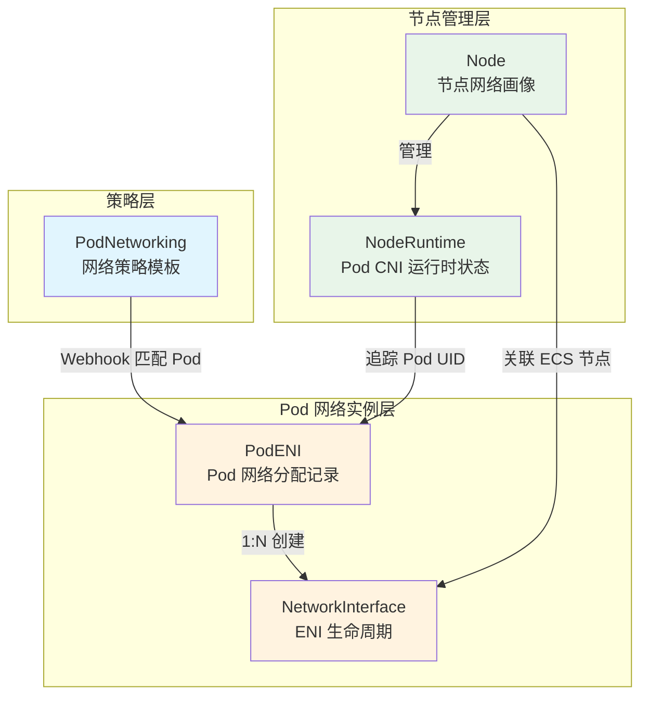
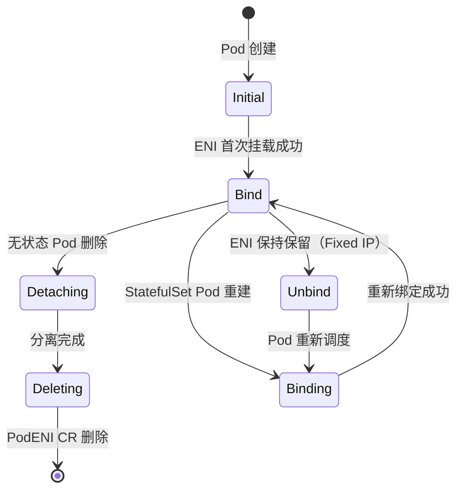
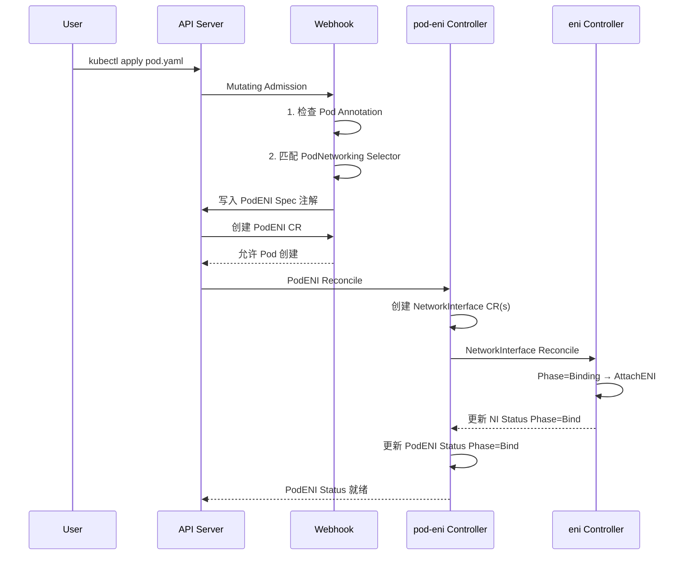

Terway 通过 Kubernetes **自定义资源定义（CRD）** 将阿里云弹性网卡（ENI）的生命周期管理映射到 Kubernetes 的声明式 API 模型中。所有 CRD 注册在 `network.alibabacloud.com` API Group 下，以 `v1beta1` 作为唯一存储版本。这一设计使得 Terway 控制平面可以用标准的 Controller 模式对 ENI 的创建、挂载、分离和删除进行可靠的调谐（reconcile），同时让节点级别的网络资源状态变得可观测、可审计。

Sources: [register.go](pkg/apis/network.alibabacloud.com/register.go#L20-L22), [doc.go](pkg/apis/network.alibabacloud.com/v1beta1/doc.go#L17-L21)

## CRD 总览与分类

Terway 当前注册了 **五个 CRD**，它们在逻辑上分为三个层次：**Pod 网络策略层**（PodNetworking）、**Pod 网络实例层**（PodENI、NetworkInterface）和**节点管理层**（Node、NodeRuntime）。以下表格从作用域、核心职责和控制器三个维度进行对比：

| CRD | API 资源名 | 作用域 | 核心职责 | 关联控制器 |
|---|---|---|---|---|
| **PodENI** | `podenis.network.alibabacloud.com` | Namespaced | 记录 Pod 期望的网络分配（IP、ENI 配置）及绑定状态 | `pod-eni` |
| **PodNetworking** | `podnetworkings.network.alibabacloud.com` | Cluster | 声明式网络策略模板，通过 Selector 匹配 Pod | `pod-networking` |
| **Node** | `nodes.network.alibabacloud.com` | Cluster | 节点网络画像：容量、ENI 规格、IP 池与 Flavor | `node` |
| **NetworkInterface** | `networkinterfaces.network.alibabacloud.com` | Cluster | 单个 ENI 的期望与观测状态，驱动挂载/分离操作 | `eni` |
| **NodeRuntime** | `noderuntimes.network.alibabacloud.com` | Cluster | 节点运行时 Pod CNI 状态追踪（initial/deleted） | `node` |

Sources: [register.go](pkg/apis/crds/register.go#L21-L28), [register.go](pkg/apis/network.alibabacloud.com/v1beta1/register.go#L48-L63)



> **前置知识**：上图描述了五个 CRD 之间的引用与创建关系。PodNetworking 通过 Webhook 的 Label Selector 匹配 Pod 并生成 PodENI；PodENI 进一步创建一个或多个 NetworkInterface；Node CR 记录节点容量并关联到同一节点上的 NetworkInterface；NodeRuntime 则追踪该节点上每个 Pod 的 CNI 生命周期事件。

## CRD 注册与版本管理

所有 CRD 的 YAML 定义内嵌在 Go 二进制中（通过 `//go:embed`），由 `CreateOrUpdateCRD` 函数在控制平面启动时自动同步到 API Server。每个 CRD 携带一个语义化版本号注解 `crd.network.alibabacloud.com/version`，控制器通过 `semver.Compare` 判断是否需要更新已存在的 CRD 定义，确保升级过程中 Schema 的平滑演进。

Sources: [register.go](pkg/apis/crds/register.go#L31-L123)

当前各 CRD 的版本号如下表所示：

| CRD | 版本号 |
|---|---|
| PodENI | `v0.4.2` |
| PodNetworking | `v0.1.0` |
| Node | `v0.9.0` |
| NodeRuntime | `v0.1.0` |
| NetworkInterface | `v0.1.0` |

Sources: [register.go](pkg/apis/crds/register.go#L51-L70)

---

## PodENI：Pod 网络分配记录

PodENI 是唯一使用 **Namespaced** 作用域的 CRD，它的命名与对应的 Pod 完全一致（`name=<pod-name>, namespace=<pod-namespace>`）。PodENI 的核心职责是将 Pod 对网络资源的"声明"（Spec）与实际 ENI 的"观测状态"（Status）桥接起来——Webhook 在 Pod 创建时写入 Spec，`pod-eni` 控制器根据 Spec 创建/挂载 ENI 并回填 Status。

### Spec 结构

```yaml
spec:
  allocations:          # ENI 分配列表，支持多网卡
    - allocationType:
        type: Elastic   # Elastic | Fixed
        releaseStrategy: TTL  # TTL | Never
        releaseAfter: "5m0s"  # 仅 TTL 策略生效
      eni:
        id: "eni-xxx"
        vpcID: "vpc-xxx"
        mac: "00:16:3e:xx:xx:xx"
        zone: "cn-hangzhou-i"
        vSwitchID: "vsw-xxx"
        securityGroupIDs: ["sg-xxx"]
        attachmentOptions:
          trunk: true
      ipv4: "192.168.1.10"
      ipv6: "fd00::10"
      ipv4CIDR: "192.168.1.10/24"
      ipv6CIDR: "fd00::10/64"
      interface: "eth0"
      defaultRoute: true
      extraRoutes:
        - dst: "10.0.0.0/8"
      extraConfig:
        key: "value"
  zone: "cn-hangzhou-i"
```

**关键字段解析**：

- **`allocations[]`**：每个元素代表一个网络接口分配。多网卡场景下会有多个 Allocation 条目。
- **`allocationType.type`**：`Elastic`（弹性分配，Pod 删除后 IP 释放）或 `Fixed`（固定 IP，仅 StatefulSet 支持且 Pod 名字必须固定）。默认值为 `Elastic`。
- **`allocationType.releaseStrategy`**：配合 Fixed 类型使用。`TTL` 表示延迟释放（由 `releaseAfter` 控制时长），`Never` 表示永不释放（直到 StatefulSet 被删除）。
- **`eni`**：底层阿里云 ENI 的完整描述，包括 VPC、vSwitch、安全组和可用区。
- **`extraRoutes`**：额外的路由条目，用于多网卡场景下指定非默认路由。

Sources: [types.go](pkg/apis/network.alibabacloud.com/v1beta1/types.go#L29-L112)

### Status 结构与 Phase 状态机

PodENI 的 Status 记录了 ENI 在 ECS 实例上的实际绑定状态，核心是 **Phase 字段驱动的状态机**：



| Phase | 含义 | 触发场景 |
|---|---|---|
| `""` (Initial) | 初始状态，ENI 尚未挂载 | PodENI 刚创建 |
| `Bind` | ENI 已挂载到 ECS，正常工作 | 挂载成功 |
| `Binding` | ENI 需要重新绑定（通常是 Fixed IP 场景） | StatefulSet Pod 重建 |
| `Unbind` | ENI 已分离但资源保留 | Fixed IP 的 Pod 被删除但 IP 保留 |
| `Detaching` | ENI 正在从 ECS 分离 | 无状态 Pod 删除 |
| `Deleting` | CR 即将被移除 | 最终清理 |

Status 中的 `eniInfos` 字段以 ENI ID 为键，记录每个 ENI 的类型（Secondary/Trunk/Member）、VLAN ID（Trunk 模式）、VF ID 和绑定状态。

Sources: [types.go](pkg/apis/network.alibabacloud.com/v1beta1/types.go#L56-L155)

### 固定 IP 辅助方法

PodENI Spec 提供了 `HaveFixedIP()` 辅助方法，遍历所有 Allocation 检查是否存在 `Fixed` 类型的分配。这在控制器判断是否需要保留 ENI 资源时被广泛使用。

Sources: [helper.go](pkg/apis/network.alibabacloud.com/v1beta1/helper.go#L3-L10)

---

## PodNetworking：声明式网络策略模板

PodNetworking 是一个 **Cluster-scoped** 的策略资源，它的设计理念类似于 Kubernetes 的 `NetworkPolicy`——通过 Label Selector 声明"哪些 Pod 应该使用什么样的网络配置"，而不是在每个 Pod 上单独注解。

### Spec 结构

```yaml
spec:
  eniOptions:
    eniType: Default    # Default | ENI | Trunk
  allocationType:
    type: Elastic       # Elastic | Fixed
    releaseStrategy: TTL
    releaseAfter: "5m0s"
  selector:
    podSelector:
      matchLabels:
        app: "nginx"
    namespaceSelector:
      matchLabels:
        env: "production"
  securityGroupIDs: ["sg-xxx", "sg-yyy"]
  vSwitchOptions: ["vsw-xxx", "vsw-yyy"]
  vSwitchSelectOptions:
    vSwitchSelectionPolicy: ordered  # ordered | random | most
```

**关键字段解析**：

- **`eniOptions.eniType`**：控制 Pod 使用的 ENI 类型。`Default` 遵循集群全局配置，`ENI` 强制使用辅助 ENI，`Trunk` 强制使用 Trunk ENI 的 Member 接口。
- **`selector`**：支持 `podSelector` 和 `namespaceSelector` 的组合匹配，与 Kubernetes 原生 Label Selector 语法完全一致。两者取交集。
- **`vSwitchSelectOptions.vSwitchSelectionPolicy`**：vSwitch 选择策略。`ordered` 按顺序使用，`random` 随机选择，`most` 选择 IP 最多的 vSwitch（默认值）。

Sources: [types.go](pkg/apis/network.alibabacloud.com/v1beta1/types.go#L212-L307)

### Status 与控制器行为

PodNetworking 控制器的职责相对简洁——当用户创建或更新 PodNetworking 时，控制器会验证 `vSwitchOptions` 中列出的每个 vSwitch 是否存在，并将解析结果（vSwitch ID 和可用区）回写到 `status.vSwitches` 中。状态只有两种：`Ready`（所有 vSwitch 验证通过）和 `Fail`（任一 vSwitch 无效）。

```yaml
status:
  status: Ready
  vSwitches:
    - id: "vsw-xxx"
      zone: "cn-hangzhou-i"
    - id: "vsw-yyy"
      zone: "cn-hangzhou-j"
  updateAt: "2024-01-15T10:30:00Z"
  message: ""
```

Sources: [networking.go](pkg/controller/pod-networking/networking.go#L87-L139)

### Webhook 匹配机制

PodNetworking 的核心价值在于 **Webhook 自动匹配**。在 Pod 的 Mutating Admission 阶段，Webhook 按以下优先级解析 Pod 的网络配置：

1. **Pod Annotation**（`k8s.aliyun.com/pod-networks`）——最高优先级，直接使用注解中的配置
2. **Pod Network Request Annotation**（`k8s.aliyun.com/pod-network-request`）——第二个优先级
3. **PodNetworking Selector 匹配**——遍历所有 PodNetworking CRD，找到 selector 匹配当前 Pod 的第一条规则
4. **集群默认配置**（eni-config ConfigMap）——兜底策略

匹配成功后，Webhook 会将 PodNetworking 的名称写入 Pod 的 `k8s.aliyun.com/pod-networking` 注解，并将其网络参数转换为 `PodNetworks` 注解结构。

Sources: [mutating.go](pkg/controller/webhook/mutating.go#L94-L163)

---

## Node：节点网络画像

Node CR 是 Terway 中结构最复杂的 CRD，它完整地刻画了一个 Kubernetes 节点的网络能力与配置。每个 Node CR 与同名的 Kubernetes `Node` 资源一一对应，由 `node` 控制器自动创建和维护。

### Spec 结构

Node Spec 由四个核心子结构组成：

```yaml
spec:
  nodeMetadata:
    regionID: "cn-hangzhou"
    instanceType: "ecs.g7.xlarge"
    instanceID: "i-xxx"
    zoneID: "cn-hangzhou-i"
  nodeCap:
    adapters: 4              # 可用辅助 ENI 数量
    eriquantity: 1            # eRDMA ENI 数量
    totalAdapters: 5          # 含主 ENI 在内的总 ENI 数量
    ipv4PerAdapter: 10        # 每个辅助 ENI 支持的 IPv4 数
    ipv6PerAdapter: 1         # 每个辅助 ENI 支持的 IPv6 数
    memberAdapterLimit: 20    # Trunk Member 接口上限
    maxMemberAdapterLimit: 20
    instanceBandwidthRx: 8192 # 入带宽 (Kbps)
    instanceBandwidthTx: 8192 # 出带宽 (Kbps)
    networkCards:
      - index: 0
    networkCardsCount: 1
  datapath:
    type: veth               # veth | ipvlan | datapathv2
  eni:
    tag: {}
    tagFilter: {}
    vSwitchOptions: ["vsw-xxx"]
    securityGroupIDs: ["sg-xxx"]
    resourceGroupID: "rg-xxx"
    enableIPv4: true
    enableIPv6: false
    enableERDMA: false
    enableTrunk: false
    vSwitchSelectPolicy: most
    enableIPPrefix: false     # 是否启用 Prefix 模式
    ipv4PrefixCount: 0
    ipv6PrefixCount: 0
  pool:
    maxPoolSize: 15
    minPoolSize: 0
    poolSyncPeriod: "60s"
    reclaim:
      after: "300s"
      interval: "60s"
      batchSize: 5
      jitterFactor: "0.1"
    warmUpSize: 0
  flavor:
    - networkInterfaceType: Secondary
      networkInterfaceTrafficMode: Standard
      count: 3
```

**关键子结构详解**：

| 子结构 | 核心字段 | 说明 |
|---|---|---|
| **NodeMetadata** | `instanceID`, `instanceType`, `regionID`, `zoneID` | 从 ECS 元数据获取的节点身份信息，均为 Required 字段 |
| **NodeCap** | `adapters`, `totalAdapters`, `ipv4PerAdapter` | 通过阿里云 OpenAPI 查询 ECS 实例规格得到的网络配额 |
| **Datapath** | `type` | 数据路径类型：`veth`（默认）、`ipvlan`（高性能）、`datapathv2`（Cilium 集成） |
| **ENISpec** | `vSwitchOptions`, `securityGroupIDs`, `enableTrunk` | ENI 创建时的阿里云侧配置 |
| **PoolSpec** | `maxPoolSize`, `minPoolSize`, `reclaim` | IP 资源池的水位控制与空闲 IP 回收策略 |
| **Flavor[]** | `networkInterfaceType`, `count` | 期望的 ENI 组合配比，指导控制器创建 ENI |

Sources: [node_types.go](pkg/apis/network.alibabacloud.com/v1beta1/node_types.go#L63-L257)

### Status 结构

Node Status 是节点上所有 ENI 资源的全景视图，包含以下核心信息：

```yaml
status:
  networkInterfaces:
    "eni-xxx":
      id: "eni-xxx"
      status: "InUse"
      macAddress: "00:16:3e:xx:xx:xx"
      vSwitchID: "vsw-xxx"
      securityGroupIDs: ["sg-xxx"]
      primaryIPAddress: "192.168.1.10"
      networkInterfaceType: Secondary
      networkInterfaceTrafficMode: Standard
      ipv4:
        "192.168.1.11":
          ip: "192.168.1.11"
          primary: false
          status: Valid       # Valid | Invalid | Deleting
          podID: "default/nginx-xxx"
          podUID: "abc-123"
      ipv6: {}
      ipv4Prefix: []          # Prefix 模式下的前缀列表
      ipv6Prefix: []
      conditions:
        "Ready":
          observedTime: "2024-01-15T10:30:00Z"
          message: ""
  lastSyncOpenAPITime: "2024-01-15T10:30:00Z"
  nextSyncOpenAPITime: "2024-01-15T11:30:00Z"
  lastModifiedTime: "2024-01-15T10:30:00Z"
  warmUpTarget: 0
  warmUpAllocatedCount: 0
  warmUpCompleted: false
```

Status 中每个 ENI 条目下，IPv4/IPv6 地址以 IP 字符串为键，记录其分配状态（`Valid`/`Invalid`/`Deleting`）和关联的 Pod 信息。`conditions` 字段用于记录 ENI 级别的健康状态。`IPPrefix[]` 子结构在 Prefix 模式下使用，支持 `Valid`/`Frozen`/`Invalid`/`Deleting` 四种状态，其中 `Frozen` 表示前缀被暂时冻结等待过期释放。

Sources: [node_types.go](pkg/apis/network.alibabacloud.com/v1beta1/node_types.go#L196-L257)

### Node 控制器的协同工作

`node` 控制器同时 Watch 三个资源（`corev1.Node`、`networkv1beta1.Node`、`networkv1beta1.NodeRuntime`），核心流程包括：从 ECS OpenAPI 获取实例规格填入 `NodeCap`；从集群 ConfigMap 获取 ENI 配置填入 `ENISpec`；计算 Flavor 配比；将可用 IP 数量写入 Kubernetes Node 的 Annotation；通过 DevicePlugin 机制向 Node Status 的 `Allocatable`/`Capacity` 上报 ENI 或 Member ENI 资源。

Sources: [node.go](pkg/controller/node/node.go#L49-L243)

---

## NetworkInterface：ENI 生命周期管理单元

NetworkInterface CRD 将单个阿里云 ENI 的生命周期抽象为 Kubernetes 资源。它是 **Cluster-scoped** 的，名称通常使用 ENI ID（如 `eni-2ze...`）。与 PodENI 的"Pod 视角"不同，NetworkInterface 是"ENI 视角"——关注 ENI 在阿里云侧的实际操作（创建、挂载、分离、删除）。

### Spec 结构

```yaml
spec:
  eni:
    id: "eni-xxx"
    vpcID: "vpc-xxx"
    mac: "00:16:3e:xx:xx:xx"
    zone: "cn-hangzhou-i"
    vSwitchID: "vsw-xxx"
    resourceGroupID: "rg-xxx"
    securityGroupIDs: ["sg-xxx"]
    attachmentOptions:
      trunk: false
  ipv4: "192.168.1.10"
  ipv6: ""
  ipv4CIDR: "192.168.1.10/24"
  ipv6CIDR: ""
  extraConfig: {}
  managePolicy:
    cache: true          # 是否在节点上缓存
    unManaged: false     # 是否为非托管 ENI
  podENIRef:             # 反向引用所属的 PodENI
    namespace: "default"
    name: "nginx-xxx"
    uid: "abc-123"
```

**关键字段解析**：

- **`podENIRef`**：使用 `corev1.ObjectReference` 反向引用创建此 NetworkInterface 的 PodENI，形成 `PodENI → NetworkInterface` 的 1:N 关系。
- **`managePolicy`**：`cache` 控制是否在节点本地缓存此 ENI 信息（用于加速后续分配）；`unManaged` 标记此 ENI 不由 Terway 管理（如外部创建的 ENI）。

Sources: [eni.go](pkg/apis/network.alibabacloud.com/v1beta1/eni.go#L1-L75)

### Status 与附加打印列

NetworkInterface Status 复用了与 PodENI 相同的 Phase 状态机（Initial → Bind → Detaching → Deleting），并通过 Kubebuilder 的 `printcolumn` 注解在 `kubectl get networkinterface` 输出中展示关键信息：

```yaml
status:
  phase: "Bind"
  eniInfo:
    id: "eni-xxx"
    type: "Secondary"
    vid: 0              # Trunk VLAN ID
    status: "Bind"
    networkCardIndex: 0
    vfID: 0             # VF 设备 ID
  instanceID: "i-xxx"   # 当前挂载的 ECS 实例
  trunkENIID: ""        # 如果是 Member ENI，记录所属 Trunk ENI
  nodeName: "node-1"
```

Sources: [eni.go](pkg/apis/network.alibabacloud.com/v1beta1/eni.go#L62-L75), [networkinterfaces.yaml](pkg/apis/crds/network.alibabacloud.com_networkinterfaces.yaml#L17-L38)

### 控制器的挂载与分离逻辑

`eni` 控制器根据 NetworkInterface 的 Phase 字段驱动 ENI 的实际操作：`Binding` 状态触发 AttachNetworkInterface 调用；`Detaching`/`Deleting` 状态触发 DetachNetworkInterface 调用。控制器还支持通过 Annotation 或名称前缀（`leni-`、`hdeni-`）自动选择后端 API（ECS 或 EFLO），适配灵骏等特殊实例类型。

Sources: [eni.go](pkg/controller/eni/eni.go#L81-L158)

---

## NodeRuntime：Pod CNI 运行时状态

NodeRuntime 是一个轻量级的辅助 CRD，用于追踪每个节点上 Pod 的 **CNI 事件状态**（`initial` 和 `deleted`）。它的设计目的是为节点级别的 Pod 网络清理提供状态信号。

### 数据结构

```yaml
apiVersion: network.alibabacloud.com/v1beta1
kind: NodeRuntime
metadata:
  name: "node-1"         # 与 Kubernetes Node 同名
spec: {}                  # 当前为空
status:
  pods:
    "pod-uid-xxx":
      podID: "default/nginx-xxx"
      status:
        initial:
          lastUpdateTime: "2024-01-15T10:30:00Z"
        deleted:
          lastUpdateTime: "2024-01-15T11:00:00Z"
```

`status.pods` 以 Pod UID 为键索引，记录每个 Pod 的 CNI Add（`initial`）和 CNI Del（`deleted`）事件时间戳。控制器据此判断哪些 Pod 已经完成 CNI 配置、哪些 Pod 已经被删除但网络资源尚未清理。

Sources: [node_runtime.go](pkg/apis/network.alibabacloud.com/v1beta1/node_runtime.go#L1-L63)

---

## CRD 间的协作关系

### 从 Pod 创建到 ENI 挂载的完整流程



上述流程展示了 CRD 之间的协作时序：Webhook 负责策略匹配与 PodENI 创建；`pod-eni` 控制器负责创建 NetworkInterface 并协调挂载；`eni` 控制器负责实际的阿里云 API 调用。

### 共享的枚举类型

多个 CRD 之间共享以下核心枚举类型，确保一致性：

| 枚举类型 | 值域 | 使用位置 |
|---|---|---|
| `ENIType` | Primary, Secondary, Trunk, Member | Node.Status, NetworkInterface.Status, Node.Spec.Flavor |
| `IPAllocType` | Elastic, Fixed | PodENI.Spec.Allocation, PodNetworking.Spec.Allocation |
| `ReleaseStrategy` | TTL, Never | PodENI.Spec.Allocation, PodNetworking.Spec.Allocation |
| `Phase` | Initial, Bind, Binding, Unbind, Detaching, Deleting | PodENI.Status, NetworkInterface.Status |
| `IPStatus` | Valid, Invalid, Deleting | Node.Status (per-IP) |
| `IPPrefixStatus` | Valid, Frozen, Invalid, Deleting | Node.Status (per-Prefix) |
| `SelectionPolicy` | ordered, random, most | Node.Spec.ENISpec, PodNetworking.Spec |
| `DatapathType` | veth, ipvlan, datapathv2 | Node.Spec.Datapath |

Sources: [types.go](pkg/apis/network.alibabacloud.com/v1beta1/types.go#L107-L210), [node_types.go](pkg/apis/network.alibabacloud.com/v1beta1/node_types.go#L24-L61), [node_types.go](pkg/apis/network.alibabacloud.com/v1beta1/node_types.go#L234-L244)

---

## 延伸阅读

- 要了解这些 CRD 背后的控制器如何协同工作，请参阅 [控制平面控制器详解：ENI 控制器、Multi-IP 控制器与 Pod 控制器](14-kong-zhi-ping-mian-kong-zhi-qi-xiang-jie-eni-kong-zhi-qi-multi-ip-kong-zhi-qi-yu-pod-kong-zhi-qi)。
- 要了解 Webhook 如何将 PodNetworking 的 Selector 匹配逻辑注入到 Pod 创建流程中，请参阅 [Webhook 机制：Pod 变更准入控制与校验逻辑](15-webhook-ji-zhi-pod-bian-geng-zhun-ru-kong-zhi-yu-xiao-yan-luo-ji)。
- 要了解 Node CR 中的 IP 池水位控制和空闲 IP 回收机制，请参阅 [ENI 资源管理器：IP 池化、水位控制与资源回收机制](9-eni-zi-yuan-guan-li-qi-ip-chi-hua-shui-wei-kong-zhi-yu-zi-yuan-hui-shou-ji-zhi)。
- 要了解 Node CR 中 Flavor 字段如何指导 ENI 创建以及多 IP 模式的工作原理，请参阅 [网络模式全解析：VPC、ENI、ENI 多 IP 与 Trunk 模式](6-wang-luo-mo-shi-quan-jie-xi-vpc-eni-eni-duo-ip-yu-trunk-mo-shi)。