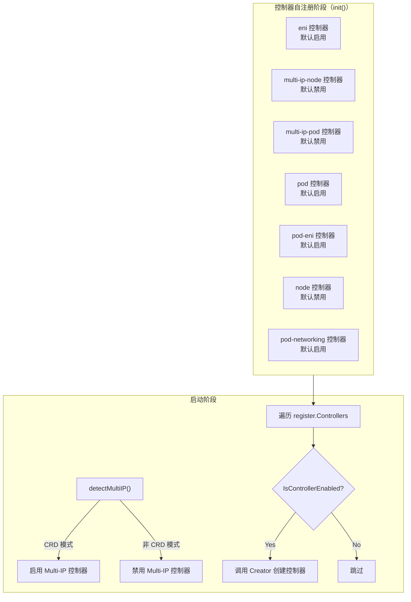
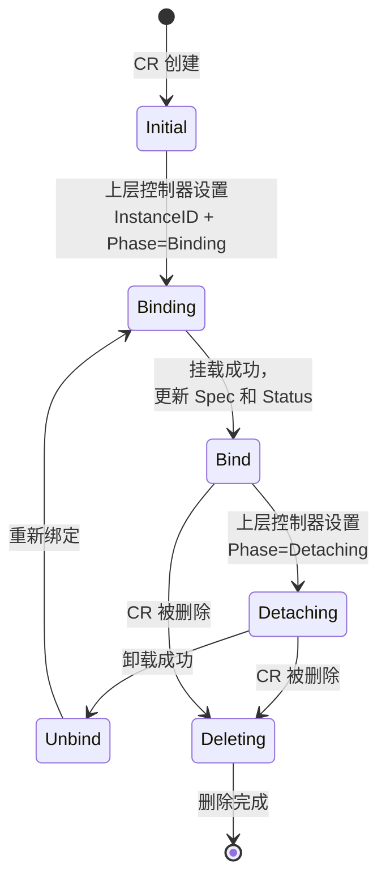
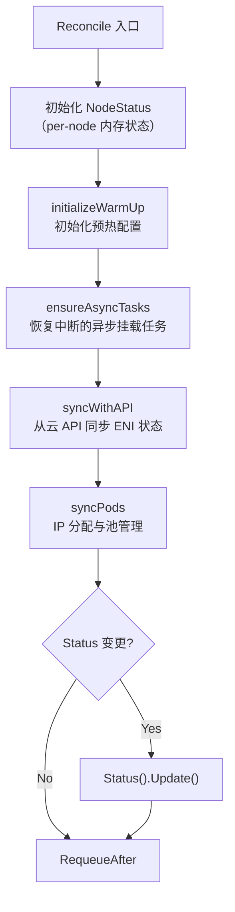
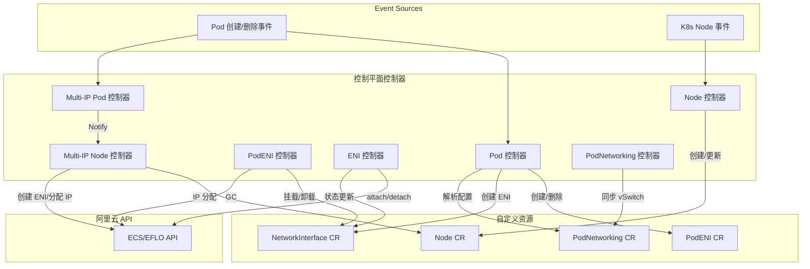

Terway 控制平面是整个 CNI 插件的大脑——它通过一组协同工作的控制器，将 Kubernetes 资源事件转化为阿里云 ENI（Elastic Network Interface）的生命周期管理操作。本文将深入剖析控制平面中七个核心控制器的注册机制、状态机设计、协调循环逻辑以及它们之间的协作关系，重点覆盖 ENI 控制器、Multi-IP 控制器组（Node + Pod）和 Pod 控制器族（Pod + PodENI）。

Sources: [all.go](pkg/controller/all/all.go#L1-L30), [register.go](pkg/controller/register.go#L1-L72)

## 控制器注册与启动框架

**控制器的自注册机制**是 Terway 控制平面的核心设计模式。每个控制器通过 Go 的 `init()` 函数调用 `register.Add()` 将自身注册到一个全局 map 中，而入口程序通过空导入（`_ import`）触发所有控制器的自注册。

Sources: [register.go](pkg/controller/register.go#L54-L71), [all.go](pkg/controller/all/all.go#L20-L29)

`ControllerCtx` 是所有控制器共享的上下文对象，封装了控制平面运行所需的全部依赖：

| 字段 | 类型 | 职责 |
|------|------|------|
| `Config` | `*controlplane.Config` | 控制平面配置（并发度、Backoff、Feature Gate） |
| `VSwitchPool` | `*vswitch.SwitchPool` | vSwitch 缓存池，用于 IP 分配时选择可用 vSwitch |
| `AliyunClient` | `aliyunClient.OpenAPI` | 阿里云 OpenAPI 客户端抽象接口 |
| `TracerProvider` | `trace.TracerProvider` | OpenTelemetry 追踪提供者 |
| `NodeStatusCache` | `*status.Cache[status.NodeStatus]` | 节点级网卡索引缓存，避免多 ENI 分配到同一网卡 |
| `RegisterResource` | `[]client.Object` | 控制器需要预创建的 CRD 资源列表 |

Sources: [register.go](pkg/controller/register.go#L36-L52)

入口程序 `terway-controlplane` 在 `main()` 中遍历 `register.Controllers`，根据配置决定是否启动每个控制器。启停逻辑通过 `IsControllerEnabled()` 函数判断，该函数综合考虑控制器的默认启用状态和用户在配置中显式指定启用的控制器列表。

Sources: [terway-controlplane.go](cmd/terway-controlplane/terway-controlplane.go#L240-L249)

值得注意的是，`detectMultiIP()` 函数在控制器启动前进行探测：仅当 Daemon 配置为 CRD IPAM 模式时，Multi-IP 控制器组才会被启用；否则，它们会从激活列表中被移除。这是一种**前置条件守卫**设计，防止控制平面在数据面未就绪时启动不兼容的控制器。

Sources: [terway-controlplane.go](cmd/terway-controlplane/terway-controlplane.go#L363-L398)

以下 Mermaid 图展示了控制器的注册与启动流程：



Sources: [all.go](pkg/controller/all/all.go#L22-L28)

## 七大控制器总览

以下表格总结了控制平面中所有控制器的核心定位：

| 控制器 | Watch 资源 | 核心职责 | 默认启用 |
|--------|-----------|----------|---------|
| **eni** | NetworkInterface CR | ENI 挂载/卸载的底层状态机驱动 | ✓ |
| **multi-ip-node** | Node CR + 事件通道 | 中心化 IPAM：节点级 IP 池管理与分配 | ✗ |
| **multi-ip-pod** | Pod | 轻量通知器：将 Pod 事件转发给 node 控制器 | ✗ |
| **pod** | Pod + PodENI CR | ENI 独占模式：Pod→PodENI→ENI 的全生命周期管理 | ✓ |
| **pod-eni** | PodENI CR | PodENI 的 ENI 挂载/卸载执行器 + GC | ✓ |
| **node** | K8s Node + Node CR + NodeRuntime CR | 节点 CR 创建/更新，容量上报 | ✗ |
| **pod-networking** | PodNetworking CR | PodNetworking 的 vSwitch 状态同步 | ✓ |

Sources: [eni.go](pkg/controller/eni/eni.go#L48-L79), [pool.go](pkg/controller/multi-ip/node/pool.go#L62-L177), [pod.go](pkg/controller/multi-ip/pod/pod.go#L22-L39), [pod_controller.go](pkg/controller/pod/pod_controller.go#L59-L120), [eni_controller.go](pkg/controller/pod-eni/eni_controller.go#L67-L108), [node.go](pkg/controller/node/node.go#L41-L91), [networking.go](pkg/controller/pod-networking/networking.go#L45-L61)

## ENI 控制器：NetworkInterface CR 的状态机引擎

**ENI 控制器**是 NetworkInterface CR 背后的核心驱动力。它不直接管理 Pod 或 Node，而是专注于将 `NetworkInterface` CR 的声明式状态转化为阿里云 API 的命令式调用——挂载（attach）、卸载（detach）和删除（delete）。这种**关注点分离**的设计使得上层控制器（如 Pod 控制器和 PodENI 控制器）只需修改 CR 状态，由 ENI 控制器负责执行底层操作。

Sources: [eni.go](pkg/controller/eni/eni.go#L36-L79)

### Phase 状态机

NetworkInterface CR 的 `Status.Phase` 字段驱动着 ENI 控制器的行为。状态机的转换关系如下：



Sources: [eni.go](pkg/controller/eni/eni.go#L81-L136)

协调循环的核心逻辑非常清晰——它是一个基于 Phase 的分发器：

1. **Phase = Deleting** 且 `DeletionTimestamp` 未设置：触发 CR 的 `Delete()` 调用
2. **Phase = Detaching / Deleting / DeletionTimestamp 非零**：进入 `detach()` 路径
3. **DeletionTimestamp 非零**（detach 完成后）：进入 `delete()` 路径
4. **Phase = Binding**：进入 `attach()` 路径

Sources: [eni.go](pkg/controller/eni/eni.go#L96-L136)

### 多后端 API 支持

ENI 控制器通过 `resolveBackendAPI()` 实现了**多后端路由**能力。它根据 CR 的 Annotation（`types.ENOApi`）或名称前缀（`leni-`、`hdeni-`）决定使用 ECS API 还是 EFLO API：

| 标识 | 后端 |
|------|------|
| 无特殊标识 | ECS 标准 API |
| `leni-` 前缀 | EFLO（灵骏）API |
| `hdeni-` 前缀 | EFLO 高密模式 API |

Sources: [eni.go](pkg/controller/eni/eni.go#L139-L158)

在 **attach 路径**中，控制器根据后端类型选择不同的操作序列。对于 EFLO 路径，使用 LENI 专用的状态码（`Available`、`Unattached`、`Executing` 等）；对于 ECS 路径，使用标准 ENI 状态码（`InUse`、`Available` 等）。两条路径共享 `BackoffManager` 进行退避重试，但退避策略不同——迁移自灵骏的 ENI 使用更短的 `initialDelay`（4s vs 默认值）。

Sources: [eni.go](pkg/controller/eni/eni.go#L160-L170), [eni.go](pkg/controller/eni/eni.go#L172-L340)

attach 成功后，控制器会进行两项关键更新：首先通过 `cmp.Diff` 比较前后 Spec 变化并更新 CR 的 Spec（包含 ENI ID、MAC、Zone、VSwitch 等云侧信息）；然后更新 Status 为 `ENIPhaseBind`，附带 `ENIInfo`（设备索引、网卡索引、VF ID 等节点侧信息）。最后，控制器还会为 CR 添加节点标签（`ENIRelatedNodeName`），建立 ENI 与节点的关联。

Sources: [eni.go](pkg/controller/eni/eni.go#L278-L339)

### 事件传播与回滚

ENI 控制器实现了**事件向上传播**机制：当 ENI 操作失败时，通过 `emitEventToPod()` 函数将事件传播到关联的 Pod 对象上。这通过 `Spec.PodENIRef` 字段追溯关联的 Pod（PodENI 名称与 Pod 名称相同）。

Sources: [eni.go](pkg/controller/eni/eni.go#L482-L503)

对于 EFLO 路径中 ENI 创建失败（`LENIStatusCreateFailed`）的场景，控制器会调用 `rollBackPodENI()` 删除关联的 PodENI CR，实现**级联回滚**——确保不会留下处于不可恢复状态的半成品资源。

Sources: [eni.go](pkg/controller/eni/eni.go#L505-L532)

## Multi-IP 控制器组：中心化 IPAM 的核心引擎

Multi-IP 控制器组是 Terway V2 IPAM 架构的核心，由两个协同工作的控制器组成：**Multi-IP Node 控制器**负责节点级 IP 池管理，**Multi-IP Pod 控制器**负责将 Pod 事件转化为节点协调请求。两者通过事件通道（`EventCh`）实现松耦合的事件驱动协作。

Sources: [pool.go](pkg/controller/multi-ip/node/pool.go#L62-L177), [pod.go](pkg/controller/multi-ip/pod/pod.go#L1-L71)

### Multi-IP Pod 控制器：事件通知器

Multi-IP Pod 控制器是一个**极简设计**的控制器——它的协调逻辑仅有一行核心代码：调用 `node.Notify(ctx, pod.Spec.NodeName)`。它通过自定义的 `predicateForPodEvent` 过滤器，仅关注满足以下条件的 Pod：

- 已调度（`NodeName` 非空）
- 非 HostNetwork
- 非 Terway 忽略的标签（如 `IgnoredByTerway`）
- 非 ENI 独占模式（`PodUseENI` 返回 false）
- Pod IP 尚未分配或沙箱已退出

Sources: [pod.go](pkg/controller/multi-ip/pod/pod.go#L52-L71), [predict.go](pkg/controller/multi-ip/pod/predict.go#L49-L75)

`Notify()` 函数将一个 `GenericEvent` 发送到全局事件通道 `EventCh`（缓冲区 1000），最终由 Node 控制器消费并触发对应节点的协调循环。这种设计将 Pod 生命周期事件转化为节点级的 IPAM 决策，实现了**关注点分离**。

Sources: [pool.go](pkg/controller/multi-ip/node/pool.go#L85-L94)

### Multi-IP Node 控制器：节点级 IP 池管理

Multi-IP Node 控制器是整个 IPAM 系统中最复杂的控制器，它的核心职责是为每个节点维护一个**预热 IP 资源池**，在 Pod 调度前完成 IP 分配。

Sources: [pool.go](pkg/controller/multi-ip/node/pool.go#L96-L177)

#### 协调循环主流程

每个节点的协调循环按以下顺序执行七个阶段：



Sources: [pool.go](pkg/controller/multi-ip/node/pool.go#L226-L423)

#### 阶段一：syncWithAPI —— 云侧状态同步

`syncWithAPI()` 通过阿里云 API 查询节点上所有已挂载的 ENI，并与 Node CR 中的 `Status.NetworkInterfaces` 进行合并。核心合并逻辑包括：

- **新增 ENI**：从 API 响应构造 `Nic` 对象，补充 vSwitch CIDR 信息后加入 CR
- **已存在 ENI**：合并 IP 集合（`mergeIPMap`）和前缀集合（`mergeIPPrefixes`），保留本地的 Pod 绑定信息
- **缺失 ENI**：若为辅助网卡且在云侧已 Available，则调用 API 删除；否则从 CR 中移除

Sources: [pool.go](pkg/controller/multi-ip/node/pool.go#L425-L588)

对于前缀模式，`mergeIPPrefixes()` 实现了精细的合并策略：远程存在且本地也存在时保留完整本地记录（含 Status 和 FrozenExpireAt）；远程存在但本地缺失时标记为 Valid；远程缺失且本地为 Deleting 时直接移除；远程缺失且本地为其他状态时标记为 Invalid，等待 Daemon 确认。

Sources: [eni.go](pkg/controller/multi-ip/node/eni.go#L163-L200)

当检测到中间状态（Attaching/Detaching/Executing 等）时，同步间隔缩短为 30 秒（含 Jitter），否则使用配置的完整同步周期。

Sources: [pool.go](pkg/controller/multi-ip/node/pool.go#L577-L587)

#### 阶段二：syncPods —— IP 分配与池管理

`syncPods()` 是 IPAM 的核心逻辑，分两条路径执行：

**常规 IP 模式**（非 Prefix 模式）：

1. **releasePodNotFound**：释放已不存在 Pod 的 IP 绑定（依赖 `NodeRuntime` 确认 CNI 已完成清理）
2. **assignIPFromLocalPool**：从本地 IP 池中为未分配 IP 的 Pod 分配地址
3. **addIP**：当本地池不足时，创建新 ENI 或为现有 ENI 分配更多 IP
4. **重新分配**：重新执行 `assignIPFromLocalPool` 处理新分配的 IP
5. **handleStatus**：清理标记为 Deleting 的 ENI 和 IP
6. **checkWarmUpCompletion**：检查预热是否完成
7. **adjustPool**：池缩容——释放多余的空闲 IP 或删除空闲 ENI

Sources: [pool.go](pkg/controller/multi-ip/node/pool.go#L640-L723)

**前缀（Prefix）模式**：控制器仅确保每个 ENI 上有足够的前缀数量，Pod↔IP 的绑定由 Daemon 管理。该路径跳过常规的 `addIP` 和 `adjustPool`，转而执行 `assignEniPrefixWithOptions` 和 `syncPrefixAllocation`。

Sources: [pool.go](pkg/controller/multi-ip/node/pool.go#L656-L686)

#### 阶段三：addIP —— 需求计算与 ENI 创建

`addIP()` 的需求计算公式体现了**多维度驱动**的资源调度策略：

```
allocationDemand = podDemand + max(minPoolDemand, warmUpDemand)
```

其中：
- `podDemand` = 本地池无法满足的 Pod 数量
- `minPoolDemand` = `max(0, MinPoolSize + podDemand - totalIdleIPs)`
- `warmUpDemand` = `max(0, WarmUpTarget - WarmUpAllocatedCount)`（一次性预热）

Sources: [pool.go](pkg/controller/multi-ip/node/pool.go#L1061-L1150)

`assignEniWithOptions()` 将需求分配到具体的 ENI 上。对于已存在的 InUse ENI，根据剩余配额（`IPv4PerAdapter - 已分配 IP 数 - 已分配前缀数`）决定可添加的 IP 数量；对于新 ENI，则按最大容量创建。对于 Attaching 状态的 ENI，从任务队列中获取已请求的 IP 数量，避免重复分配。

Sources: [pool.go](pkg/controller/multi-ip/node/pool.go#L1321-L1425)

#### 异步 ENI 任务队列

`ENITaskQueue` 是 Multi-IP Node 控制器的关键基础设施。它将 ENI 挂载操作从同步协调循环中解耦，实现了**非阻塞挂载**：

1. `SubmitAttach()` 将挂载任务提交到内存队列，立即返回
2. 后台 goroutine 执行实际的 API 调用（`AttachAsync`）并轮询等待状态变为 InUse
3. 完成后通过 `notifyCh` 通知节点控制器，触发下一次协调

Sources: [eni_task_queue.go](pkg/controller/multi-ip/node/eni_task_queue.go#L82-L147)

任务状态转换：`Pending → Running → Completed/Failed/Timeout`。控制器在 `ensureAsyncTasks()` 中还会恢复因重启而丢失的 Attaching 状态 ENI 的任务。

Sources: [eni_task_queue.go](pkg/controller/multi-ip/node/eni_task_queue.go#L149-L200), [pool.go](pkg/controller/multi-ip/node/pool.go#L1023-L1059)

#### 节点状态条件上报

`updateNodeCondition()` 向 Kubernetes Node 对象写入 `SufficientIP` 条件，用于调度器感知节点的 IP 资源充足性。条件更新采用 5 分钟冷却期，避免频繁 Patch 操作。

Sources: [pool.go](pkg/controller/multi-ip/node/pool.go#L1203-L1290)

## Pod 控制器族：ENI 独占模式的全生命周期管理

Pod 控制器族由两个控制器组成：**Pod 控制器**负责将 Pod 事件转化为 PodENI CR 的创建/删除，**PodENI 控制器**负责执行 PodENI CR 对应的 ENI 挂载/卸载操作。两者共同服务于 **ENI 独占模式**（每 Pod 独占一个 ENI，参见 [网络模式全解析](6-wang-luo-mo-shi-quan-jie-xi-vpc-eni-eni-duo-ip-yu-trunk-mo-shi)）。

Sources: [pod_controller.go](pkg/controller/pod/pod_controller.go#L59-L120), [eni_controller.go](pkg/controller/pod-eni/eni_controller.go#L67-L108)

### Pod 控制器：Pod → PodENI 的映射层

Pod 控制器同时 Watch Pod 和 PodENI 两种资源，使用**非托管控制器**（`controller.NewUnmanaged`）模式启动。这种设计允许控制器自定义 Watch 逻辑，同时通过 `Wrapper` 包装器实现 Leader Election 和启动前置条件守卫（`PodENIPreStartDone` channel）。

Sources: [pod_controller.go](pkg/controller/pod/pod_controller.go#L78-L119), [pod_controller.go](pkg/controller/pod/pod_controller.go#L141-L159)

控制器的 `processPod()` 过滤函数仅处理满足以下条件的 Pod：已调度、非 HostNetwork、使用 ENI 独占模式或 CRD 模式、Terway 管理范围内的 Pod。

Sources: [pod_controller.go](pkg/controller/pod/pod_controller.go#L88-L104)

**Pod 创建路径**（`podCreate`）：

1. 检查 PodENI 是否已存在
2. 若存在且 Phase 为 Unbind，执行 `reConfig()`（更新节点标签、Pod UID、Backend API 注解，然后重新设为 Binding）
3. 若存在且 Phase 为 Bind，检查 UID 匹配；固定 IP 场景下若 UID 不匹配则触发 Detaching
4. 若不存在，解析配置（`parse()`）→ 创建 ENI（`createENI()`）→ 创建 PodENI CR

Sources: [pod_controller.go](pkg/controller/pod/pod_controller.go#L202-L331)

`createENI()` 使用 `errgroup` 并行创建多个 ENI（多网卡场景），每个 ENI 创建后立即写入 NetworkInterface CR 并等待创建完成。创建过程中若发生冲突（如 vSwitch IP 不足），会调用 `swPool.Block()` 将对应 vSwitch 标记为不可用。

Sources: [pod_controller.go](pkg/controller/pod/pod_controller.go#L573-L716)

**Pod 删除路径**（`podDelete`）：

- **固定 IP**：将 PodENI Status 更新为 `ENIPhaseDetaching`，保留 ENI 资源
- **非固定 IP**：将 PodENI Status 更新为 `ENIPhaseDeleting`，触发完整清理

Sources: [pod_controller.go](pkg/controller/pod/pod_controller.go#L349-L390)

### PodENI 控制器：ENI 挂载执行器

PodENI 控制器是 Pod 控制器的下游执行器，负责 PodENI CR 的实际挂载/卸载操作。它的 `Wrapper` 在启动时执行两个关键操作：**数据迁移**（`migrate()`）和 **GC 协程启动**（`gc()`），然后才关闭 `PodENIPreStartDone` channel 解除 Pod 控制器的启动阻塞。

Sources: [eni_controller.go](pkg/controller/pod-eni/eni_controller.go#L140-L158)

**挂载路径**（Phase = Initial/Binding）：

控制器获取 Pod 关联的 Node 信息，根据 trunk 模式决定使用 Trunk ENI 还是辅助 ENI，然后调用 `common.Attach()` 触发 NetworkInterface CR 的状态变更。`attachENI()` 使用 `errgroup` 并行处理多个 Allocation，每个 Allocation 调用 `common.Attach()` 设置 Phase 为 Binding，然后通过 `common.WaitStatus()` 等待 ENI 控制器完成挂载。

Sources: [eni_controller.go](pkg/controller/pod-eni/eni_controller.go#L236-L396), [eni_controller.go](pkg/controller/pod-eni/eni_controller.go#L685-L799)

**卸载路径**（Phase = Detaching）：

调用 `common.Detach()` 将 NetworkInterface CR 的 Phase 设为 Detaching，ENI 控制器执行实际卸载后，PodENI 控制器将 Status 更新为 `ENIPhaseUnbind`。

Sources: [eni_controller.go](pkg/controller/pod-eni/eni_controller.go#L662-L683)

**GC 机制**：

PodENI 控制器运行两个 GC 协程：

| GC 类型 | 周期 | 目标 |
|---------|------|------|
| `gcSecondaryENI` | 10 分钟 | 清理云侧孤立的辅助 ENI（Available 但无 CR 引用） |
| `gcMemberENI` | 10 分钟 | 清理云侧孤立的 Member ENI（InUse 但无 CR 引用） |
| `gcCRPodENIs` | 1 分钟 | 清理无关联 Pod 的 PodENI CR（固定 IP 遵循 ReleaseStrategy） |

Sources: [eni_controller.go](pkg/controller/pod-eni/eni_controller.go#L226-L234)

固定 IP 的回收策略（`ReleaseStrategy`）支持两种模式：`Never`（永不释放）和 `TTL`（超时释放）。TTL 模式通过 `PodLastSeen` 时间戳加 `ReleaseAfter` 时长判断是否过期。

Sources: [eni_controller.go](pkg/controller/pod-eni/eni_controller.go#L610-L658)

## 控制器协作关系

以下架构图展示了各控制器之间的协作关系：



## 公共基础设施

### Common 包：ENI 操作抽象

`common` 包提供了 ENI 操作的**声明式抽象层**，将底层 API 调用封装为状态变更操作：

- `Attach()`：将 NetworkInterface CR 的 Phase 设为 Binding，附带 InstanceID 和节点信息
- `Detach()`：将 Phase 设为 Detaching
- `Delete()`：将 Phase 设为 Deleting（或 Detaching，取决于当前状态）
- `WaitStatus()`：使用指数退避等待 CR 达到期望 Phase
- `WaitCreated()`：等待 CR 创建完成
- `WaitRVChanged()`：等待 ResourceVersion 变化（确认 API Server 已持久化）

Sources: [eni.go](pkg/controller/common/eni.go#L1-L301)

### Status Cache：网卡索引管理

`status.Cache[status.NodeStatus]` 提供了线程安全的节点级状态缓存。每个 `NodeStatus` 维护一个 `NetworkCards` 数组，用于管理多网卡节点上的 ENI 分布。`RequestNetworkIndex()` 方法实现了**最少负载优先**的网卡选择策略，并支持 NUMA 亲和性约束——确保 eRDMA 等 NUMA 敏感工作负载的 ENI 分配在正确的网卡上。

Sources: [status.go](pkg/controller/status/status.go#L57-L143)

### Backoff 管理器

每个控制器都集成了 `BackoffManager` 或 `backoff` 包提供的退避策略，用于处理云 API 的异步操作延迟。ENI 控制器使用 `NewBackoffManager()` 管理 per-ENI 的退避状态；Multi-IP Node 控制器使用全局退避配置控制 API 调用频率。

Sources: [eni.go](pkg/controller/eni/eni.go#L45-L46), [bo.go](pkg/controller/eni/bo.go)

## 关键设计模式总结

| 设计模式 | 应用位置 | 目的 |
|---------|---------|------|
| **声明式状态机** | ENI 控制器、PodENI 控制器 | 通过 CR Phase 驱动操作，上层仅修改状态 |
| **事件通知器** | Multi-IP Pod 控制器 | 将 Pod 事件解耦为节点级协调 |
| **异步任务队列** | Multi-IP Node 控制器 | 非阻塞 ENI 挂载，避免协调循环阻塞 |
| **前置条件守卫** | detectMultiIP、PodENIPreStartDone | 确保依赖就绪后再启动控制器 |
| **级联回滚** | ENI 控制器 rollBackPodENI | 创建失败时清理上游资源 |
| **事件向上传播** | ENI 控制器 emitEventToPod | 将底层错误信息传递到用户可见的 Pod 事件 |
| **最少负载调度** | Status Cache RequestNetworkIndex | 多网卡节点的 ENI 均衡分布 |

## 控制器性能参数

以下表格列出了影响控制器性能的关键配置参数：

| 参数 | 作用域 | 含义 |
|------|--------|------|
| `ENIMaxConcurrent` | ENI 控制器 | 最大并发协调数 |
| `MultiIPNodeMaxConcurrent` | Multi-IP Node | 最大并发协调数 |
| `MultiIPPodMaxConcurrent` | Multi-IP Pod | 最大并发协调数 |
| `PodMaxConcurrent` | Pod 控制器 | 最大并发协调数 |
| `PodENIMaxConcurrent` | PodENI 控制器 | 最大并发协调数 |
| `NodeMaxConcurrent` | Node 控制器 | 最大并发协调数 |
| `MultiIPNodeSyncPeriod` | Multi-IP Node | 全量 API 同步周期 |
| `MultiIPGCPeriod` | Multi-IP Node | GC 周期 |
| `MultiIPMinSyncPeriodOnFailure` | Multi-IP Node | 失败后最小重试间隔 |
| `MultiIPMaxSyncPeriodOnFailure` | Multi-IP Node | 失败后最大重试间隔 |

Sources: [pool.go](pkg/controller/multi-ip/node/pool.go#L96-L177), [eni.go](pkg/controller/eni/eni.go#L54-L57)

## 阅读导航

理解控制器体系后，建议按以下路径继续深入：

- **Webhook 机制**：控制器如何通过准入控制为 Pod 注入网络配置 → [Webhook 机制：Pod 变更准入控制与校验逻辑](15-webhook-ji-zhi-pod-bian-geng-zhun-ru-kong-zhi-yu-xiao-yan-luo-ji)
- **CRD 定义**：控制器操作的 CR 的数据模型 → [自定义资源定义（CRD）：PodENI、PodNetworking、Node、NetworkInterface](13-zi-ding-yi-zi-yuan-ding-yi-crd-podeni-podnetworking-node-networkinterface)
- **IP 资源池管理**：Multi-IP Node 控制器的池化策略详解 → [ENI 资源管理器：IP 池化、水位控制与资源回收机制](9-eni-zi-yuan-guan-li-qi-ip-chi-hua-shui-wei-kong-zhi-yu-zi-yuan-hui-shou-ji-zhi)
- **中心化 IPAM 架构**：整体 IPAM 设计思路 → [中心化 IPAM：控制平面与节点协同的 IP 分配架构](10-zhong-xin-hua-ipam-kong-zhi-ping-mian-yu-jie-dian-xie-tong-de-ip-fen-pei-jia-gou)