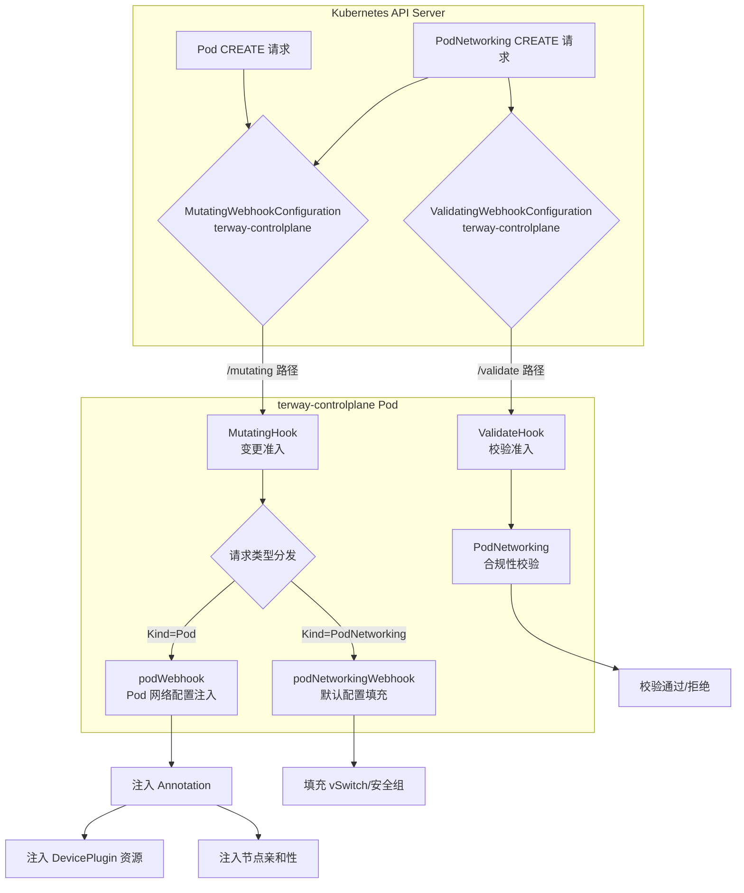
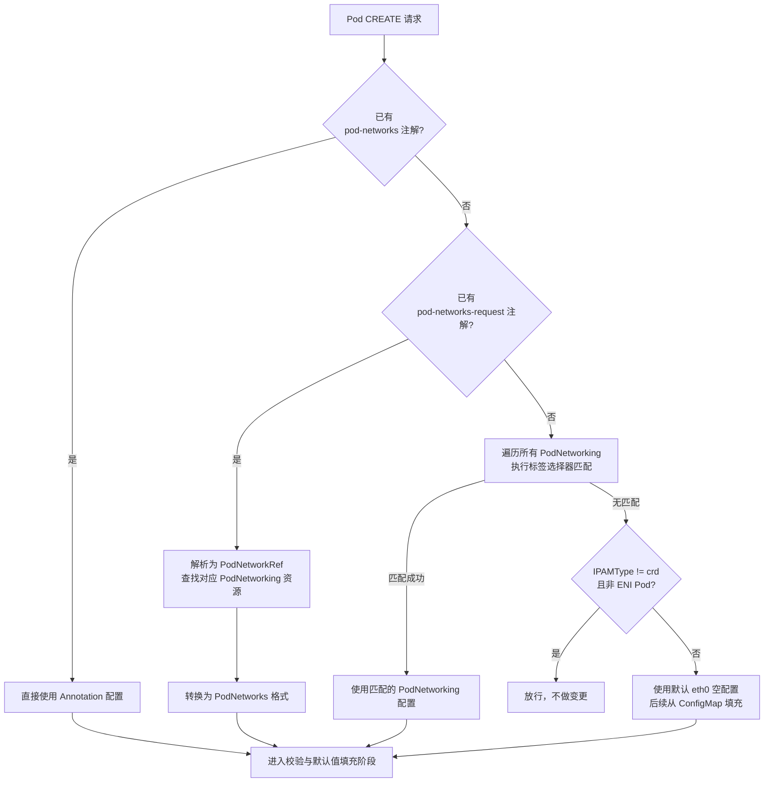
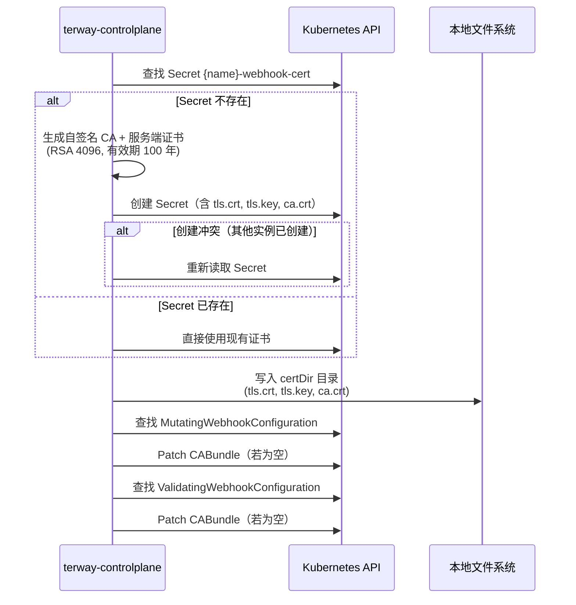

Terway 控制平面通过 Kubernetes Admission Webhook 机制，在 Pod 和 `PodNetworking` 资源创建时实施自动化的网络配置注入和合规性校验。这一机制是 Terway 实现声明式网络配置的核心枢纽——它将用户意图（Annotation、PodNetworking 选择器）翻译为控制器可识别的标准化注解格式，同时注入 DevicePlugin 资源请求以确保 Pod 调度到具备足够 ENI 容量的节点。本文将从架构总览、变更（Mutating）逻辑、校验（Validating）逻辑、证书管理以及关键配置参数五个维度，完整剖析 Webhook 的工作机制。

Sources: [mutating.go](pkg/controller/webhook/mutating.go#L1-L48), [validate.go](pkg/controller/webhook/validate.go#L1-L16)

## 架构总览：双 Webhook 协作模型

Terway 在控制平面组件 `terway-controlplane` 中注册了两个独立的 Webhook 端点，分别承载变更和校验职责：

**Mutating Webhook** 拦截 `pods`（CREATE）和 `podnetworkings`（CREATE）两类资源的创建操作，通过 `/mutating` 端点执行配置补全和注入。**Validating Webhook** 仅拦截 `podnetworkings`（CREATE）操作，通过 `/validate` 端点执行严格的合规性检查。

从 Helm Chart 的 Webhook 定义可以看到，Mutating Webhook 配置了一个 `namespaceSelector`，排除了带有 `k8s.aliyun.com/pod-eni: "false"` 标签的命名空间，这意味着集群管理员可以通过命名空间标签精确控制 Webhook 的作用范围。

Sources: [webhook.yaml](charts/terway/templates/terway-controlplane/webhook.yaml#L1-L57), [terway-controlplane.go](cmd/terway-controlplane/terway-controlplane.go#L202-L205)

### Webhook 注册与路由规则

下表汇总了两个 Webhook 的拦截规则和路径配置：

| Webhook 类型 | 端点路径 | 拦截资源 | 拦截操作 | 失败策略 | 超时 |
|:---|:---|:---|:---|:---|:---|
| Mutating | `/mutating` | `pods`（v1） | CREATE | 可配置（默认 Ignore） | 可配置（默认 10s） |
| Mutating | `/mutating` | `podnetworkings`（network.alibabacloud.com） | CREATE | 可配置（默认 Ignore） | 可配置（默认 10s） |
| Validating | `/validate` | `podnetworkings`（network.alibabacloud.com） | CREATE | Fail | 可配置（默认 10s） |

控制平面启动时，通过 `webhook.MutatingHook()` 和 `webhook.ValidateHook()` 工厂函数创建处理器，并注册到 controller-runtime 的 Webhook Server 上。整个 Webhook 机制可通过 `disableWebhook: true` 配置完全关闭。

Sources: [webhook.yaml](charts/terway/templates/terway-controlplane/webhook.yaml#L7-L33), [terway-controlplane.go](cmd/terway-controlplane/terway-controlplane.go#L202-L205), [config_default.go](types/controlplane/config_default.go#L38)

## Mutating Webhook：Pod 变更逻辑

`MutatingHook` 是一个多路分发器，根据 `req.Kind.Kind` 将请求路由到 `podWebhook` 或 `podNetworkingWebhook`。Pod 变更是最复杂的处理路径，下面逐一拆解。

Sources: [mutating.go](pkg/controller/webhook/mutating.go#L55-L67)

### Pod 变更的快速排除条件

在进入核心逻辑之前，Webhook 会依次检查以下排除条件，匹配任意一条即直接放行（`Allowed`），不进行任何修改：

1. **HostNetwork Pod**：`pod.Spec.HostNetwork == true` 直接放行，因为 Host 网络 Pod 不需要独立的 ENI 网络配置
2. **无容器 Pod**：`len(pod.Spec.Containers) == 0` 直接放行
3. **被 Terway 忽略的 Pod**：标签中存在 `k8s.aliyun.com/ignore-by-terway: "true"` 时直接放行
4. **注解互斥校验**：`k8s.aliyun.com/pod-networks`、`k8s.aliyun.com/pod-networks-request` 和 `k8s.aliyun.com/pod-networking` 三个注解必须互斥——如果同时存在两个及以上，请求将被拒绝（`Denied`）

Sources: [mutating.go](pkg/controller/webhook/mutating.go#L69-L100), [k8s.go](types/k8s.go#L32-L66)

### 网络配置解析的优先级链

Pod 网络配置的解析遵循严格的优先级顺序，形成一条从显式声明到自动匹配的降级链：

**第一优先级：`k8s.aliyun.com/pod-networks` 注解**。这是最直接的配置方式，用户在注解中以 JSON 格式完整声明网络参数（vSwitch、安全组、接口名等），Webhook 直接解析使用，不再查询任何外部资源。

**第二优先级：`k8s.aliyun.com/pod-networks-request` 注解**。这是一种间接引用方式，用户在注解中声明引用的 `PodNetworking` 资源名称和接口名。Webhook 会查找对应的 `PodNetworking` 资源并转换为完整配置。此模式下有几个约束条件：被引用的 `PodNetworking` 状态必须为 `Ready`；不能设置 `podSelector` 或 `namespaceSelector`；多个网络引用的 `ENIAttachType` 必须一致。

**第三优先级：PodNetworking 选择器自动匹配**。Webhook 遍历集群中所有状态为 `Ready` 的 `PodNetworking` 资源，依次评估 `podSelector` 和 `namespaceSelector`。对于非固定名称的 Pod（非 StatefulSet），不会匹配配置了 Fixed IP 分配策略的 PodNetworking。

**降级路径**：如果以上三条路径均未命中，Webhook 会根据 `IPAMType` 配置决定是否创建一个空的默认网络配置（仅包含 `interface: "eth0"`），后续从 `eni-config` ConfigMap 中读取默认的 vSwitch 和安全组进行填充。

Sources: [mutating.go](pkg/controller/webhook/mutating.go#L106-L163), [annotations.go](types/controlplane/annotations.go#L40-L67)

### 校验、默认值填充与资源注入

解析出网络配置后，Webhook 执行一轮统一的校验和默认值填充：

| 校验项 | 规则 | 失败行为 |
|:---|:---|:---|
| 安全组数量 | 单个网络配置的安全组 ID 不得超过 10 个 | Denied |
| 接口名长度 | 必须大于 0 且小于 6 个字符 | Denied |
| 接口名唯一性 | 同一 Pod 内接口名不能重复 | Denied |
| 固定 IP 约束 | `IPAllocTypeFixed` 仅支持固定名称的 Pod（StatefulSet 或无 OwnerReference） | Denied |
| 分配类型默认值 | 未设置 `AllocationType` 时默认为 `IPAllocTypeElastic` | 自动填充 |

当网络配置中缺少 vSwitch 或安全组信息时，Webhook 从 `eni-config` ConfigMap 中读取集群默认值进行填充。这一回退机制确保了用户只需声明最简配置，细节由系统自动补全。

**DevicePlugin 资源注入**是 Webhook 的另一项核心职责。当 `enableWebhookInjectResource` 为 `true`（默认值）时，Webhook 会向 Pod 的第一个容器注入扩展资源请求和限制：

- **Trunk 模式**下（`enableTrunk: true`），注入 `aliyun/member-eni` 资源，数量等于 Pod 的网络接口数
- **非 Trunk 模式**或独占 ENI 模式下，注入 `aliyun/eni` 资源

这一注入机制确保 Kubernetes 调度器在调度 Pod 时会考虑节点的 ENI 容量，避免将 Pod 调度到 ENI 资源不足的节点。

Sources: [mutating.go](pkg/controller/webhook/mutating.go#L166-L243), [eni.go](deviceplugin/eni.go#L26-L34)

### 节点亲和性注入与固定 IP 区域保持

Webhook 的最后一项注入是**节点亲和性（Node Affinity）**。根据网络配置中 vSwitch 的可用区信息和 Pod 之前所在的可用区，Webhook 向 Pod 注入 `RequiredDuringSchedulingIgnoredDuringExecution` 类型的节点亲和性：

- **vSwitch 可用区约束**：从匹配的 `PodNetworking` 的 `Status.VSwitches` 中提取可用区列表，确保 Pod 被调度到网络配置覆盖的可用区
- **固定 IP 区域保持**：对于配置了 Fixed IP 分配类型的 StatefulSet Pod，Webhook 会查找同名的 `PodENI` 资源，获取其 `Spec.Zone`，确保 Pod 重建时被调度到原来的可用区以复用已分配的 ENI

值得注意的是，DaemonSet 管理的 Pod 被排除在亲和性注入之外（通过 `IsDaemonSetPod` 检查），因为 DaemonSet Pod 必须运行在每个节点上，亲和性约束会导致非预期行为。

Sources: [mutating.go](pkg/controller/webhook/mutating.go#L405-L445), [mutating.go](pkg/controller/webhook/mutating.go#L348-L371)

### PodNetworking 变更逻辑

`podNetworkingWebhook` 的处理逻辑相对简单。当 `PodNetworking` 资源的 `SecurityGroupIDs` 或 `VSwitchOptions` 为空时，Webhook 从 `eni-config` ConfigMap 中读取默认值进行填充。这使得用户可以创建仅声明选择器和分配策略的 `PodNetworking`，具体的 vSwitch 和安全组由集群级配置决定。

Sources: [mutating.go](pkg/controller/webhook/mutating.go#L245-L285)

## Validating Webhook：PodNetworking 校验逻辑

Validating Webhook 仅针对 `PodNetworking` 资源的 CREATE 操作执行校验，确保资源的合规性：

| 校验项 | 规则 | 失败行为 |
|:---|:---|:---|
| ENIAttachType 约束 | 当 `enableWebhookInjectResource=false` 且未设置 `podSelector`/`namespaceSelector` 时，`ENIAttachType` 必须为空或 `Default` | Denied |
| vSwitch 配置 | `VSwitchOptions` 不可为空 | Denied |
| 安全组配置 | `SecurityGroupIDs` 不可为空，且不得超过 10 个 | Denied |
| TTL 释放策略 | `ReleaseStrategy=TTL` 时，`ReleaseAfter` 必须是合法的 Go duration 格式（如 `5m`、`1h`） | Denied |
| Never 释放策略 | `ReleaseStrategy=Never` 时，`ReleaseAfter` 必须为空 | Denied |

Sources: [validate.go](pkg/controller/webhook/validate.go#L21-L73)

## TLS 证书自管理机制

Webhook 的 TLS 证书由控制平面自行管理，无需依赖 cert-manager 等外部工具。`cert.SyncCert` 函数在控制平面启动时执行，完成以下工作：

证书的 SAN（Subject Alternative Name）配置为 `<serviceName>.<namespace>.svc`，确保 Kubernetes API Server 可以通过 Service 内部 DNS 名称验证 Webhook 服务的身份。证书写入目录默认为 `/var/run/webhook-cert`。

Sources: [webhook.go](pkg/cert/webhook.go#L39-L175), [webhook.go](pkg/cert/webhook.go#L177-L264)

## 控制平面配置参数

下表列出了与 Webhook 直接相关的控制平面配置参数：

| 参数 | 默认值 | 说明 |
|:---|:---|:---|
| `disableWebhook` | `false` | 是否完全禁用 Webhook 注册 |
| `webhookPort` | `4443` | Webhook HTTPS 服务监听端口 |
| `certDir` | `/var/run/webhook-cert` | TLS 证书文件存储目录 |
| `enableTrunk` | `true` | 是否启用 Trunk 模式，影响资源注入类型 |
| `enableWebhookInjectResource` | `true` | 是否通过 Webhook 注入 DevicePlugin 资源请求 |
| `controllerName` | `terway-controlplane` | 控制器名称，用于 Webhook 配置名称和证书 Secret 命名 |
| `controllerNamespace` | `kube-system` | 控制器所在命名空间 |

在 Helm Chart 的 `values.yaml` 中，还有两个与 Webhook 行为相关的参数：`webhookFailurePolicy`（默认 `Ignore`）和 `webhookTimeoutSeconds`（默认 `10`）。Mutating Webhook 的失败策略默认为 `Ignore`，意味着即使 Webhook 服务不可用，Pod 创建也不会被阻塞——这是一个生产环境友好的降级策略。

Sources: [config_default.go](types/controlplane/config_default.go#L24-L80), [config.go](types/controlplane/config.go#L93-L98), [values.yaml](charts/terway/values.yaml#L99-L110)

## 测试策略

Webhook 的测试覆盖了三个层次：

**单元测试**（`mutating_test.go`、`validate_test.go`）使用 fake client 和 gomonkey 打桩，验证核心函数级别的正确性，包括节点亲和性注入、PodNetworking 选择器匹配、安全组校验等。

**集成测试**（`webhook_integration_test.go`、`webhook_suite_test.go`）使用 `envtest` 框架启动一个真实的 API Server 和 etcd，注册真实的 Webhook 配置，然后通过实际的 HTTP 请求测试端到端行为。测试场景覆盖了：

- HostNetwork Pod 被正确放行
- 冲突注解被正确拒绝
- `pod-networks` 注解的多网卡配置注入
- `pod-networks-request` 注解的 PodNetworking 引用解析
- PodNetworking 选择器的自动匹配
- 独占 ENI 模式的资源注入（`aliyun/eni` vs `aliyun/member-eni`）
- 安全组数量超限的拒绝
- 不同 `ENIAttachType` 的多网络请求被拒绝
- `enableWebhookInjectResource` 开关对 `ENIAttachType` 约束的影响

Sources: [webhook_suite_test.go](pkg/controller/webhook/webhook_suite_test.go#L1-L160), [webhook_integration_test.go](pkg/controller/webhook/webhook_integration_test.go#L1-L908), [validate_test.go](pkg/controller/webhook/validate_test.go#L1-L270)

## 延伸阅读

- **CRD 与控制器体系**：Webhook 的注入结果最终由 [PodENI 控制器](14-kong-zhi-ping-mian-kong-zhi-qi-xiang-jie-eni-kong-zhi-qi-multi-ip-kong-zhi-qi-yu-pod-kong-zhi-qi) 和 [ENI 控制器](14-kong-zhi-ping-mian-kong-zhi-qi-xiang-jie-eni-kong-zhi-qi-multi-ip-kong-zhi-qi-yu-pod-kong-zhi-qi) 消费处理，理解注入的 Annotation 结构对掌握控制器行为至关重要。
- **安全组与 Trunk 模式**：Webhook 注入的 `aliyun/member-eni` 资源与 Trunk 模式紧密相关，详见[安全组与 Trunk 模式](17-an-quan-zu-yu-trunk-mo-shi-pod-wei-du-de-an-quan-zu-yu-vswitch-pei-zhi)。
- **固定 IP 策略**：Webhook 中的 Fixed IP 校验和区域保持逻辑是[固定 IP 策略](22-gu-ding-ip-ce-lue-statefulset-pod-de-ip-bao-chi-yu-ttl-hui-shou)准入控制的前置环节。
- **动态配置**：Webhook 从 `eni-config` ConfigMap 读取默认配置的逻辑在[动态配置与热加载](27-dong-tai-pei-zhi-yu-re-jia-zai-configmap-qu-dong-de-yun-xing-shi-pei-zhi-bian-geng)中有详细说明。