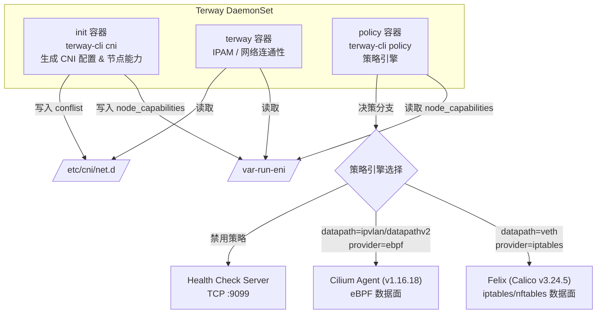
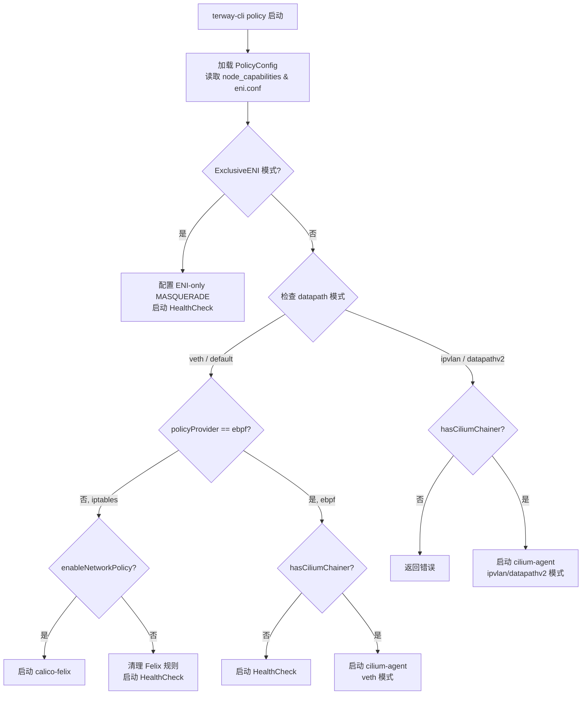
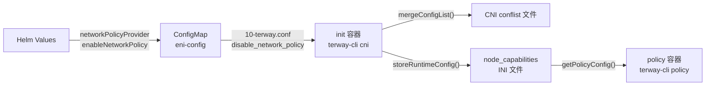
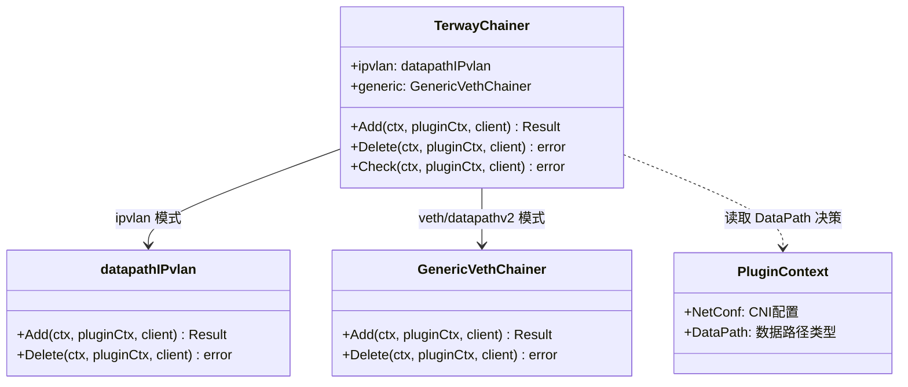

Terway 作为阿里云 Kubernetes 的 CNI 插件，并不自己实现 NetworkPolicy 的数据面逻辑，而是通过**策略集成**的方式，将 Kubernetes NetworkPolicy 的执行委托给两个成熟的开源数据面引擎：**Felix（Calico 项目）** 和 **Cilium**。这一设计选择使 Terway 能够专注于 IP 地址管理和网络连通性本身，同时借助 Felix 的 iptables/nftables 能力或 Cilium 的 eBPF 能力来实现高性能的网络策略执行。两种引擎的选择并非随意的——它直接与 Terway 的数据路径模式绑定：Veth 策略路由模式使用 Felix（iptables），而 IPvlan 与 DataPathV2 模式则使用 Cilium（eBPF）。整个策略容器的生命周期由 `terway-cli policy` 命令驱动，该命令在 Pod 启动时根据节点能力（Node Capabilities）自动判断并启动对应的策略引擎。

Sources: [policy.go](cmd/terway-cli/policy.go#L48-L135), [policyinit.sh](policy/policyinit.sh#L1-L6)

## 架构总览：双引擎策略容器

在 Terway 的 DaemonSet 部署模型中，策略引擎以 **Sidecar 容器** 的形式运行在同一 Pod 内，名为 `policy`。该容器与 `terway` 主容器共享网络命名空间和关键卷挂载（如 `/var-run-eni`、`/sys/fs/bpf`），确保两者能够协同操作节点的网络数据面。



Sources: [daemonset.yaml](charts/terway/templates/terwayd/daemonset.yaml#L140-L172), [policy.go](cmd/terway-cli/policy.go#L104-L135)

### 策略引擎选择决策树

策略引擎的选择是一个**多因子决策过程**，涉及数据路径模式、策略提供者类型、网络策略开关以及 Cilium Chainer 的可用性。核心逻辑位于 `initPolicy` 函数中：



Sources: [policy.go](cmd/terway-cli/policy.go#L104-L135), [node_capabilities.go](pkg/utils/nodecap/node_capabilities.go#L12-L22)

## 配置体系：从 Helm Values 到节点能力

NetworkPolicy 的行为由三层配置共同决定：**Helm Values** 定义集群级意图，**ConfigMap** 传递运行时参数，**Node Capabilities** 文件记录节点级别的运行时决策结果。

### 配置传递链路



Sources: [values.yaml](charts/terway/values.yaml#L21-L24), [configmap.yaml](charts/terway/templates/terwayd/configmap.yaml#L26-L42), [cni.go](cmd/terway-cli/cni.go#L316-L357)

### 关键配置参数说明

| 参数 | 位置 | 可选值 | 默认值 | 说明 |
|------|------|--------|--------|------|
| `networkPolicyProvider` | Helm Values / CNI conf | `ebpf`, `iptables` | `ebpf` | 策略引擎类型，决定使用 Cilium 还是 Felix |
| `enableNetworkPolicy` | Helm Values | `true`, `false` | `false` | 是否启用网络策略执行 |
| `eniip_virtual_type` | CNI conf | `veth`, `ipvlan`, `datapathv2` | `veth` | 数据路径模式，间接影响策略引擎选择 |
| `disable_network_policy` | ConfigMap | `"true"`, `"false"` | - | `enableNetworkPolicy` 的反向表达 |
| `cilium_args` | Helm Values / CNI conf | 自定义参数字符串 | `""` | 传递给 cilium-agent 的额外参数 |
| `cilium_enable_hubble` | CNI conf | `"true"` | - | 启用 Hubble 可观测能力 |

Sources: [values.yaml](charts/terway/values.yaml#L20-L24), [common.go](cmd/terway-cli/common.go#L19-L84)

### Node Capabilities 运行时状态

`terway-cli cni` 在初始化阶段会解析 CNI 配置，将运行时决策写入 `/var/run/eni/node_capabilities` INI 文件。策略容器启动时通过 `getPolicyConfig` 函数读取这些能力值，构建 `PolicyConfig` 结构体：

| 能力键 | 来源 | 用途 |
|--------|------|------|
| `datapath` | `eniip_virtual_type` 字段 | 决定数据路径模式（veth/ipvlan/datapathv2） |
| `network_policy_provider` | `network_policy_provider` 字段 | 决定策略提供者（iptables/ebpf） |
| `has_cilium_chainer` | CNI conflist 是否包含 cilium-cni 插件 | 判断 Cilium Chainer 可用性 |
| `kube_proxy_replacement` | 配置项 | 是否启用 KubeProxyReplacement |
| `cni_exclusive_eni` | 配置项 | 是否为 ENI 独占模式 |

Sources: [node_capabilities.go](pkg/utils/nodecap/node_capabilities.go#L12-L22), [cni.go](cmd/terway-cli/cni.go#L316-L357), [policy.go](cmd/terway-cli/policy.go#L62-L102)

## Felix（Calico）集成：iptables 模式

Felix 是 Calico 项目的核心数据面组件，负责将 Kubernetes NetworkPolicy 转化为 iptables/nftables 规则。Terway 对 Felix 进行了深度裁剪和补丁化集成，使其能够在"策略路由 + Veth"数据路径下独立运行，**不依赖 Calico 的完整控制平面**。

### 构建与补丁体系

Terway 基于 **Calico v3.24.5**（Git commit `f1a1611`）构建 Felix，通过 5 个补丁对其进行定制化改造：

| 补丁 | 文件 | 核心改动 |
|------|------|----------|
| `0001-terway.patch` | [felix/0001-terway.patch](policy/felix/0001-terway.patch) | 禁用 datastore 配置加载循环（使用纯环境变量配置）；禁用 ConfigBatcher（避免不必要的事件流）；禁用 endpoint 接口自动重配置（由 Terway 管理网络接口）；添加 `CALICO_IPV4POOL_CIDR` 环境变量支持以配置 MASQUERADE；为 RHEL/CentOS 7.4+ 内核添加 `random-fully` 特性检测 |
| `0002-performance-improve.patch` | [felix/0002-performance-improve.patch](policy/felix/0002-performance-improve.patch) | 将 K8s Client QPS 限制为 1、Burst 限制为 3、Timeout 设为 30s，降低对 API Server 的压力；List 操作使用 `ResourceVersion: "0"` 启用缓存读取 |
| `0003-Use-Aliyun-CNI-annotation.patch` | [felix/0003-Use-Aliyun-CNI-annotation-to-get-pod-IPs-if-set.patch](policy/felix/0003-Use-Aliyun-CNI-annotation-to-get-pod-IPs-if-set.patch) | 添加 `k8s.aliyun.com/pod-ips` Annotation 支持，使 Felix 能够从 Terway 的 Pod Annotation 中获取 IP 地址 |
| `0004-update-mod.patch` | [felix/0004-update-mod.patch](policy/felix/0004-update-mod.patch) | 升级 Go 版本至 1.23、更新全部依赖模块（安全修复） |
| `0005-Add-KubeProxyConfiguration-API.patch` | [felix/0005-Add-KubeProxyConfiguration-API-and-update-proxy-pack.patch](policy/felix/0005-Add-KubeProxyConfiguration-API-and-update-proxy-pack.patch) | 将 `k8s.io/kubernetes/pkg/proxy` 包本地化到 Calico 模块内，解除对 Kubernetes 源码的直接依赖 |

Sources: [Dockerfile](deploy/images/policy/Dockerfile#L1-L22), [0001-terway.patch](policy/felix/0001-terway.patch#L1-L226)

### Felix 启动配置

`runCalico` 函数通过环境变量对 Felix 进行配置，无需依赖 Calico 的 datastore（etcd 或 CRD）：

```go
// 核心环境变量配置
"FELIX_IPTABLESBACKEND=NFT",           // 使用 nftables 后端
"CALICO_NETWORKING_BACKEND=none",      // 禁用 Calico 自身网络
"CLUSTER_TYPE=k8s,aliyun",             // 集群类型标识
"FELIX_DATASTORETYPE=kubernetes",      // 使用 Kubernetes 作为 datastore
"FELIX_DEFAULTENDPOINTTOHOSTACTION=ACCEPT", // 默认允许到主机的流量
"FELIX_BPFENABLED=false",             // 禁用 Calico BPF（使用 iptables）
"NO_DEFAULT_POOLS=true",               // 不创建默认 IP 池
```

这些配置使 Felix 进入一种"**纯策略执行**"模式：它仅从 Kubernetes API Server watch NetworkPolicy、Pod、Namespace 等资源，然后生成对应的 iptables/nftables 规则，**不参与任何 IP 地址管理或路由决策**。

Sources: [policy.go](cmd/terway-cli/policy.go#L152-L186)

### Felix 规则清理机制

当 NetworkPolicy 被禁用或策略提供者切换为 eBPF 时，Terway 需要清理 Felix 留下的 iptables 规则。`uninstall_policy.sh` 脚本提供了 `cleanup_felix` 函数，它会系统性地遍历所有 iptables 表（nat、raw、mangle、filter），清除所有以 `cali-` 为前缀的链和包含 `cali:` 注释的规则：

```bash
# 清理流程：flush cali- 前缀链 → 删除 cali: 注释规则 → 设置 FORWARD ACCEPT
cleanup_felix() {
    sysctl -w net.ipv4.ip_forward=1
    for iptables in 'iptables' 'ip6tables'; do
        cleanup_rules ${iptables}
    done
    cleanup_legacy  # 兼容 iptables-legacy
}
```

Sources: [uninstall_policy.sh](policy/uninstall_policy.sh#L1-L65), [policy.go](cmd/terway-cli/policy.go#L371-L381)

### 策略路由与 Felix 的协作

在 Veth 策略路由模式下，Felix 需要能够正确识别 Pod 的网络接口。Terway 使用 `cali` 前缀命名 Host 端的 Veth 设备（如 `caliXXXX`），这与 Felix 的默认接口命名约定一致。`PolicyRoute` 数据路径驱动负责创建 Veth 对并配置策略路由规则，而 Felix 则在这对 Veth 设备上挂载 iptables 规则链：

- **fromContainer 规则**（priority 2048）：匹配 `src == PodIP` 的流量，路由到 ENI 对应的策略路由表
- **toContainer 规则**（priority 512）：匹配 `dst == PodIP` 的流量，路由到主路由表

Sources: [policy_router_linux.go](plugin/datapath/policy_router_linux.go#L174-L246), [consts_linux.go](plugin/datapath/consts_linux.go#L11-L14)

## Cilium 集成：eBPF 模式

Cilium 集成是 Terway 策略体系的**现代化方案**，通过 eBPF 技术在内核层面实现 NetworkPolicy，绕过 iptables 的性能瓶颈。Terway 基于 **Cilium v1.16.18**（Git commit `ab50022`），通过 19 个补丁实现了深度定制。

### 构建与补丁体系

| 补丁编号 | 核心功能 | 说明 |
|----------|----------|------|
| `0001-cni-add-terway-cni` | Terway CNI Chaining 模式 | 新增 `terway-chainer` 链接模式，实现 IPvlan/Veth 双数据路径支持；修改 BPF 程序支持 `CTX_ACT_PIPE` 返回值以兼容 Terway 的 TC 管道 |
| `0002-bypass-node-local-dns` | 绕过 NodeLocal DNS | 针对 eBPF 数据路径的特殊 DNS 处理 |
| `0003-cep-optimize-cep-watch` | 优化 CEP Watch | 将 CiliumEndpoint 的 Watch 限制在本节点的资源，显著降低 API Server 压力 |
| `0004-lb-enable-in-cluster-lb` | 集群内负载均衡 | 启用 eBPF 加速的集群内服务负载均衡 |
| `0009-bandwidth-ingress-qos` | 入向 QoS | 使用 eBPF Token Bucket 实现入向带宽限制 |
| `0014-multi-host-stack` | 多 Host Stack CIDR | 在 Veth 数据路径下支持多个 Host Stack CIDR 的 eBPF Map 查找 |
| `0015-disable-per-packet-lb` | 禁用逐包负载均衡 | 允许通过策略标志禁用 per-packet LB |
| `0016-fix-hairpin` | Hairpin 修复 | 修复 eBPF Hairpin 模式的流量回环问题 |
| `0017-fix-trunk-kpr` | Trunk + KPR 兼容 | 修复启用 KubeProxyReplacement 时 Trunk 模式的使用问题 |
| `0018-skip-ipvlan-watchdogs` | IPvlan Watchdog 跳过 | 在 IPvlan 数据路径模式下跳过不适用 的 BPF 端点检查 |
| `0019-nodemap-gc` | Node Map GC | 为非标准数据路径实现 NodeMap 的垃圾回收 |

Sources: [cilium/](policy/cilium/), [Dockerfile](deploy/images/policy/Dockerfile#L24-L57)

### Terway Chainer 架构

Cilium 在 Terway 中以 **CNI Chaining** 模式运行，这意味着 Terway 仍然负责 IP 地址分配和网络接口创建，而 Cilium 负责策略执行和 eBPF 程序加载。`0001-cni-add-terway-cni.patch` 新增了 `plugins/cilium-cni/chaining/terway/terway.go` 文件，定义了 `TerwayChainer` 结构体：



`TerwayChainer` 根据 `pluginCtx.NetConf.DataPath` 字段分发到不同的处理逻辑：
- `ipvlan` 模式：使用自定义的 `datapathIPvlan` 处理器，通过 eBPF Map 直接注入 BPF 程序
- `datapathv2` / `veth` 模式：使用通用的 `GenericVethChainer`，但增加了 ENI 索引发现逻辑

Sources: [0001-cni-add-terway-cni.patch](policy/cilium/0001-cni-add-terway-cni.patch#L920-L998)

### Cilium Agent 启动参数

`runCilium` 函数构建了 cilium-agent 的完整启动参数列表，这些参数将 Cilium 配置为与 Terway 协作的**最小化模式**：

| 参数 | 值 | 作用 |
|------|------|------|
| `--routing-mode` | `native` | 使用原生路由模式（非 overlay） |
| `--cni-chaining-mode` | `terway-chainer` | 使用 Terway 自定义的 CNI 链接模式 |
| `--enable-ipv4-masquerade` | `false` | 禁用 IPv4 MASQUERADE（由 Terway 管理） |
| `--install-iptables-rules` | `false` | 禁止 Cilium 安装 iptables 规则 |
| `--ipam` | `delegated-plugin` | 使用委托式 IPAM（Terway 负责） |
| `--enable-bandwidth-manager` | `true` | 启用带宽管理器（EDT 模式） |
| `--enable-l7-proxy` | `false` | 禁用 L7 代理（减少资源开销） |
| `--enable-endpoint-routes` | `true` | 使用 Endpoint Route 模式 |
| `--enable-l2-neigh-discovery` | `false` | 禁用 L2 邻居发现（阿里云 VPC 不需要） |

Sources: [policy.go](cmd/terway-cli/policy.go#L188-L267)

### IPvlan 数据路径的 eBPF 集成

在 IPvlan 模式下，Cilium 的 BPF 程序加载方式与标准模式截然不同。标准 Cilium 会将 BPF 程序通过 TC（Traffic Control）挂载到网络接口上，但在 IPvlan 模式中，Terway 已经管理了 IPvlan 子接口的 TC 规则。因此，`0001-cni-add-terway-cni.patch` 修改了 BPF 加载器，改为通过 **eBPF Map 尾调用** 的方式注入程序：

1. Terway CNI 在创建 Pod 时，会创建一个 `cilium_lxc_ipve_<ID>` eBPF Map
2. Cilium Agent 在 Endpoint 创建时，通过 `PinDatapathMap()` 获取该 Map 的文件描述符
3. BPF 加载器将编译好的 `cil_from_container` 和 `cil_to_container` 程序的 FD 写入该 Map
4. IPvlan 子接口上的 TC 程序通过尾调用跳转到 Cilium 的 BPF 程序

Sources: [0001-cni-add-terway-cni.patch](policy/cilium/0001-cni-add-terway-cni.patch#L738-L795), [0001-cni-add-terway-cni.patch](policy/cilium/0001-cni-add-terway-cni.patch#L325-L398)

### DataPathV2 模式的 Host Routing

DataPathV2（`datapathv2`）是 Terway 的下一代数据路径，它在 Veth 模式上叠加了 Cilium 的 eBPF 路由能力。在此模式下，`0001-cni-add-terway-cni.patch` 对 BPF 程序进行了关键修改：

- **Host Routing**：在 BPF 程序中直接进行路由决策（`ENABLE_HOST_ROUTING`），避免将数据包送入内核协议栈
- **直接路由设备**：通过 `ENDPOINT_DIRECT_ROUTING_DEV_IFINDEX` 宏定义，BPF 程序知道应该将出向流量直接重定向到哪个 ENI 设备，跳过内核路由查找
- **CiliumEndpoint Watch 优化**：`0003-cep-optimize-cep-watch.patch` 将 CiliumEndpoint 的 Watch 范围限定在本节点（通过 Label Selector `k8s-node-name=<当前节点名>`），在大规模集群中显著降低 API Server 的 watch 负载

Sources: [0001-cni-add-terway-cni.patch](policy/cilium/0001-cni-add-terway-cni.patch#L95-L170), [0003-cep-optimize-cep-watch.patch](policy/cilium/0003-cep-optimize-cep-watch.patch#L74-L135)

### Hubble 可观测能力

当使用 Cilium 引擎时，Terway 支持通过 CNI 配置启用 **Hubble** 网络可观测能力。相关配置通过 `CNIConfig` 结构体解析，并转化为 cilium-agent 的启动参数：

| CNI 配置字段 | 转化为 cilium-agent 参数 | 默认值 |
|--------------|--------------------------|--------|
| `cilium_enable_hubble` | `--enable-hubble=true` | - |
| `cilium_hubble_metrics` | `--hubble-metrics=<metrics>` | `drop` |
| `cilium_hubble_listen_address` | `--hubble-listen-address=<addr>` | `:4244` |
| `cilium_hubble_metrics_server` | `--hubble-metrics-server=<addr>` | `:9091` |

启用 Hubble 后，可通过 Hubble Relay 和 Hubble UI 对集群网络流量进行实时观测。详细部署流程请参考 [Hubble 接入文档](docs/hubble-intergration.md)。

Sources: [policy.go](cmd/terway-cli/policy.go#L38-L46), [policy.go](cmd/terway-cli/policy.go#L269-L345)

## Daemon 与策略路由的协同维护

Terway Daemon 除了在 CNI ADD/DEL 时创建和销毁策略路由外，还需要在**运行时**维护这些路由规则的正确性。`daemon/rule_linux.go` 中的 `ruleSync` 函数负责这一工作。

### 规则同步机制

`ruleSync` 在 Daemon 的定期同步循环中被调用，它遍历所有已注册的 Pod 资源，重建其策略路由规则：

1. **过滤条件**：仅处理 `PodNetworkTypeENIMultiIP` 类型且数据路径为 `datapathv2` 或 `veth` 的 Pod
2. **设备发现**：通过 MAC 地址匹配找到 Pod 对应的 ENI 设备，通过 Pod 名称生成 `cali` 前缀的 Veth 名称
3. **规则重建**：调用 `datapath.GenerateENICfgForPolicy` 和 `datapath.GenerateHostPeerCfgForPolicy` 生成配置，使用 `EnsureRoute` 和 `EnsureIPRule` 进行幂等更新

这一机制确保了即使在 Felix 或 Cilium 意外修改了路由规则的情况下，Terway 也能恢复正确的路由状态。

Sources: [rule_linux.go](daemon/rule_linux.go#L20-L131)

### 策略路由 GC

`daemon_linux.go` 实现了两类策略路由垃圾回收：
- **IPvlan 路由 GC**（`gcRoutes`）：遍历所有 IPvlan 设备上的路由，删除目标 IP 已不存在于集群中的路由
- **TC Filter GC**（`gcTCFilters`）：遍历所有 ENI 设备上的 TC 过滤规则，清理不再需要的 U32 过滤器

Sources: [daemon_linux.go](daemon/daemon_linux.go#L37-L139)

## 两种引擎的对比分析

| 维度 | Felix（iptables） | Cilium（eBPF） |
|------|-------------------|-----------------|
| **适用数据路径** | Veth 策略路由（`veth`） | IPvlan（`ipvlan`）、DataPathV2（`datapathv2`） |
| **内核版本要求** | ≥ 3.10（RHEL 7.4+ 支持 random-fully） | ≥ 4.19（eBPF），完整功能需 ≥ 5.10 |
| **策略执行机制** | iptables/nftables 规则链 | eBPF TC/XDP 程序 |
| **性能特征** | 规则数量线性增长时延迟增加 | O(1) 查找，与规则数量无关 |
| **可观测能力** | 依赖 iptables 日志 | 内置 Hubble 支持（流量、丢包、延迟） |
| **额外功能** | 无 | 集群内负载均衡、带宽管理、KPR |
| **镜像体积** | ~180MB | ~500MB+（含 BPF 工具链） |
| **CRD 依赖** | FelixConfiguration 等 Calico CRD | CiliumEndpoint 等 Cilium CRD |
| **Pod IP 获取** | 通过 `k8s.aliyun.com/pod-ips` Annotation | 通过 CNI API 直接获取 |

Sources: [policy.go](cmd/terway-cli/policy.go#L113-L134), [Dockerfile](deploy/images/policy/Dockerfile#L1-L58)

## 健康检查与健康服务器

无论启动哪种策略引擎，Terway 都需要一个健康检查端点供 Kubernetes Liveness/Readiness Probe 使用。当 Felix 或 Cilium 启动时，它们各自提供健康检查端口（Felix 使用 `FELIX_HEALTHPORT` 环境变量，默认 9099；Cilium 使用 `--agent-health-port` 参数）。但在不启动策略引擎的场景（如 NetworkPolicy 被禁用、ENI 独占模式）下，`runHealthCheckServer` 函数会启动一个轻量级 TCP 服务器监听 `127.0.0.1:9099`，接受连接后立即返回 `"OK\n"`，确保 DaemonSet 的健康检查始终通过。

该服务器实现了并发控制（最多 100 个并发连接）、优雅关闭和连接超时（5 秒），是一个健壮的最小化健康检查实现。

Sources: [policy.go](cmd/terway-cli/policy.go#L383-L456), [daemonset.yaml](charts/terway/templates/terwayd/daemonset.yaml#L193-L205)

## 延伸阅读

- [数据路径驱动层：Veth、IPVlan、VLAN、NIC 与 VF 驱动实现](7-shu-ju-lu-jing-qu-dong-ceng-veth-ipvlan-vlan-nic-yu-vf-qu-dong-shi-xian) — 了解 PolicyRoute 和 IPvlanDriver 的网络接口配置细节
- [策略路由与网络连通性：Pod 间、Pod 与节点、跨节点通信原理](8-ce-lue-lu-you-yu-wang-luo-lian-tong-xing-pod-jian-pod-yu-jie-dian-kua-jie-dian-tong-xin-yuan-li) — 深入理解策略路由规则如何实现网络连通性
- [Pod 流量控制（QoS）：基于 TC 的带宽限速实现](20-pod-liu-liang-kong-zhi-qos-ji-yu-tc-de-dai-kuan-xian-su-shi-xian) — Cilium eBPF 模式下的 EDT 带宽管理与 Hubble 可观测
- [安全组与 Trunk 模式：Pod 维度的安全组与 vSwitch 配置](17-an-quan-zu-yu-trunk-mo-shi-pod-wei-du-de-an-quan-zu-yu-vswitch-pei-zhi) — 阿里云安全组与 Kubernetes NetworkPolicy 的关系