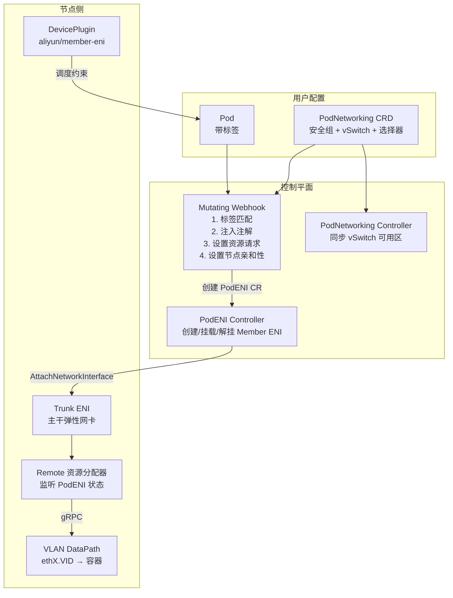
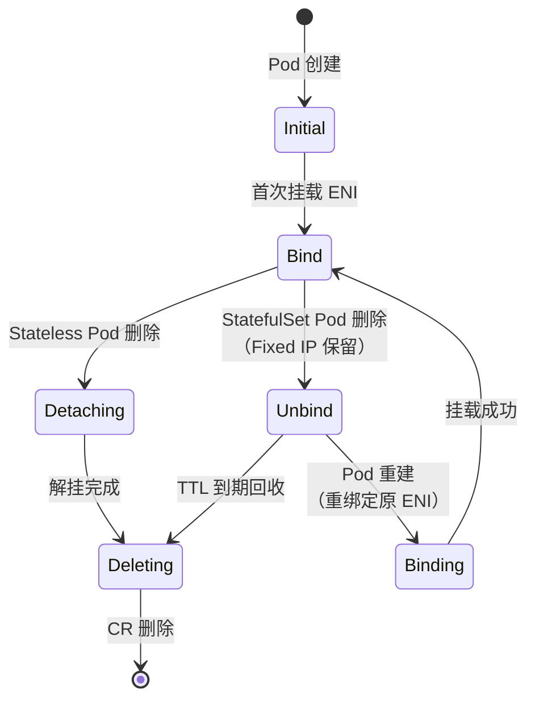
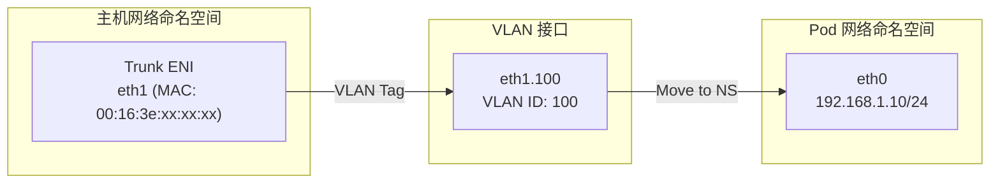

在默认的 Terway ENI 多 IP 模式下，同一节点上的所有 Pod 共享底层 ENI 的安全组和 vSwitch 配置，这在多租户或网络隔离需求严格的场景下存在局限。**Trunk 模式**通过引入 ECS Trunk ENI 能力，为每个 Pod 分配独立的 Member ENI，从而实现 **Pod 维度的安全组隔离**和**独立的 vSwitch/子网选择**，同时还支持固定 IP 策略。Trunk 模式与 ENI 多 IP 模式互不影响，不占用 ENI 多 IP 的配额，两种模式可以在同一集群中共存。

Sources: [terway-trunk.md](docs/terway-trunk.md#L1-L11)

## 核心概念与架构总览

Trunk 模式的本质是利用阿里云 ECS 的 **Trunk ENI** 能力：在节点上创建一张 Trunk 类型的弹性网卡作为主干，然后为每个需要独立安全组的 Pod 创建 Member 类型的辅助弹性网卡并挂载到 Trunk ENI 上。每张 Member ENI 可以配置独立的安全组和 vSwitch，从而在 VPC 层面实现 Pod 级别的网络隔离。

架构涉及三个核心自定义资源（CRD）和四个核心组件的协作：

| 角色 | 类型 | 职责 |
|---|---|---|
| **PodNetworking** | CRD | 用户定义的网络平面，包含安全组、vSwitch、标签选择器 |
| **PodENI** | CRD | Terway 自动维护的 Pod 网络记录，记录 ENI 绑定状态 |
| **Mutating Webhook** | 控制平面组件 | 匹配 Pod 与 PodNetworking，注入注解和资源请求 |
| **PodENI Controller** | 控制平面组件 | 管理 Member ENI 的创建、挂载、解挂和生命周期 |
| **PodNetworking Controller** | 控制平面组件 | 校验并同步 PodNetworking 的 vSwitch 可用区信息 |
| **Trunk (节点侧)** | 数据平面组件 | 封装 Local/Remote 双路径资源分配器 |
| **VLAN DataPath** | 数据平面组件 | 基于 VLAN 接口的 Pod 网络配置 |



Sources: [trunk.go](pkg/eni/trunk.go#L16-L48), [types.go](pkg/apis/network.alibabacloud.com/v1beta1/types.go#L29-L112), [eni_controller.go](pkg/controller/pod-eni/eni_controller.go#L236-L396)

## CRD 类型体系

### PodNetworking：网络平面定义

`PodNetworking` 是集群级别的 CRD，用户通过它声明一个网络平面的完整配置——包括安全组、vSwitch、IP 分配策略和 Pod 选择器。集群内可以定义多个 PodNetworking，代表不同的网络平面。

核心字段结构如下：

```go
type PodNetworkingSpec struct {
    ENIOptions     ENIOptions     `json:"eniOptions"`           // ENI 类型：Trunk/ENI/Default
    AllocationType AllocationType `json:"allocationType,omitempty"` // Elastic 或 Fixed
    Selector       Selector       `json:"selector,omitempty"`   // Pod/Namespace 标签选择器
    SecurityGroupIDs []string     `json:"securityGroupIDs,omitempty"` // 安全组列表（≤10 个）
    VSwitchOptions   []string     `json:"vSwitchOptions,omitempty"`  // vSwitch ID 列表
    VSwitchSelectOptions VSwitchSelectOptions `json:"vSwitchSelectOptions,omitempty"` // 选择策略
}
```

其中 `ENIAttachType` 支持三种模式：

| 枚举值 | 含义 |
|---|---|
| `Default` | 跟随集群配置，自动选择 |
| `Trunk` | 使用 Trunk ENI + Member ENI（Pod 独立安全组） |
| `ENI` | 使用独立的 Secondary ENI |

`AllocationType` 定义 IP 分配策略，支持 **Elastic**（弹性，Pod 删除后释放 IP）和 **Fixed**（固定 IP，仅适用于 StatefulSet）两种模式。Fixed 模式下支持 `TTL` 回收策略，可配置延迟回收时间（最小 5 分钟）。

Sources: [types.go](pkg/apis/network.alibabacloud.com/v1beta1/types.go#L220-L307), [node_types.go](pkg/apis/network.alibabacloud.com/v1beta1/node_types.go#L42-L50)

### PodENI：Pod 网络记录

`PodENI` 是 Terway 自动维护的 CRD，每个使用 Trunk 模式的 Pod 会生成一个同名的 PodENI 资源。它记录了 Pod 使用的 ENI ID、MAC 地址、IP 地址、VLAN ID、绑定状态等关键信息。**用户不应直接修改此资源**。

PodENI 的生命周期通过 Phase 字段管理，状态机如下：



Sources: [types.go](pkg/apis/network.alibabacloud.com/v1beta1/types.go#L29-L155), [eni_controller.go](pkg/controller/pod-eni/eni_controller.go#L236-L396)

## 控制平面工作流程

### 阶段一：Webhook 注入

当 Pod 创建请求到达 API Server 时，Mutating Webhook 执行以下关键逻辑：

**1. 标签匹配**：Webhook 遍历所有状态为 `Ready` 的 PodNetworking，通过 `podSelector` 和 `namespaceSelector` 匹配 Pod 标签。对于非固定名称的 Pod（即非 StatefulSet），Fixed IP 类型的 PodNetworking 不会被匹配。匹配过程要求 Pod 只能被一个 PodNetworking 匹配，避免歧义。

**2. 注解注入**：匹配成功后，Webhook 向 Pod 注入两个关键注解：
- `k8s.aliyun.com/pod-networking`：记录匹配的 PodNetworking 名称
- `k8s.aliyun.com/pod-networks`：包含完整的网络配置 JSON（vSwitch、安全组、ENI 类型等）

如果 PodNetworking 中缺少 vSwitch 或安全组配置，Webhook 会从 `kube-system/eni-config` ConfigMap 中获取默认值填充。

**3. 资源请求注入**：Webhook 在 Pod 的第一个容器中注入 `aliyun/member-eni` 资源请求（数量等于网络接口数），使 Kubernetes 调度器只将 Pod 调度到有足够 Member ENI 容量的节点。

**4. 节点亲和性设置**：对于 Fixed IP 的 Pod，Webhook 查询已有的 PodENI 获取之前 ENI 所在的可用区，并设置 `nodeAffinity` 约束 Pod 调度到相同可用区。

Sources: [mutating.go](pkg/controller/webhook/mutating.go#L69-L243), [mutating.go](pkg/controller/webhook/mutating.go#L287-L465)

### 阶段二：PodENI 控制器处理

PodENI 控制器是整个 Trunk 模式的核心引擎，运行在 terway-controlplane 中，负责 Member ENI 的创建和挂载：

**创建/绑定流程**（Phase 为 `Initial` 或 `Binding`）：
1. 获取 Pod 所在的 Node 信息，解析出 Trunk ENI ID
2. 判断当前是 Trunk 模式还是 Secondary ENI 模式
3. 调用 `common.Attach()` 将 Member ENI 挂载到 ECS 实例的 Trunk ENI 上
4. 等待 ENI 状态变为可用，获取 VLAN ID、VF ID 等信息
5. 更新 PodENI 的 Spec（ENI 详情、IP 地址）和 Status（Phase=Bind、ENIInfos）

**解挂/删除流程**（Phase 为 `Detaching` 或 `Deleting`）：
1. 调用 `common.Detach()` 从 ECS 实例解挂 Member ENI
2. 等待 ENI 状态变为 Unbind
3. 对于完全删除的场景，移除 Finalizer 并删除 CR

**GC 机制**：控制器运行两个定期 GC 协程：
- `gcMemberENI`：每 10 分钟扫描所有挂载的 Member ENI，清理泄漏的资源
- `gcCRPodENIs`：每分钟检查 PodENI CR，释放已不存在的非固定 IP Pod 的资源

Sources: [eni_controller.go](pkg/controller/pod-eni/eni_controller.go#L236-L808), [eni_controller.go](pkg/controller/pod-eni/eni_controller.go#L424-L548)

### 阶段三：PodNetworking 控制器

PodNetworking 控制器相对轻量，主要职责是**同步 vSwitch 的可用区信息**。当用户创建或更新 PodNetworking 时，控制器通过 vSwitch Pool 查询每个 vSwitch ID 对应的可用区，更新到 Status 中供 Webhook 使用做节点亲和性决策。只有当 vSwitch 配置发生变化或 Status 尚未就绪时才触发 Reconcile。

Sources: [networking.go](pkg/controller/pod-networking/networking.go#L88-L139)

### 阶段四：Validate Webhook 校验

Validate Webhook 对 PodNetworking 的创建/更新进行严格校验：

| 校验规则 | 说明 |
|---|---|
| `VSwitchOptions` 不能为空 | 必须指定至少一个 vSwitch |
| `SecurityGroupIDs` 不能为空 | 必须指定至少一个安全组 |
| `SecurityGroupIDs` ≤ 10 | 安全组数量上限为 10 |
| `ReleaseAfter` 格式合法 | TTL 策略下必须是合法的 Go duration |
| `ReleaseStrategy=Never` 时 `ReleaseAfter` 必须为空 | 策略与参数一致性 |
| 无选择器时 `eniType` 必须为 Default | 防止配置歧义 |

Sources: [validate.go](pkg/controller/webhook/validate.go#L21-L73)

## 节点侧资源管理

### Trunk 结构体：双路径分配器

节点侧的 `Trunk` 结构体同时实现了 `Local`（ENI 多 IP）和 `Remote`（Member ENI）两条资源分配路径，根据请求的资源类型进行路由：

```go
func (r *Trunk) Allocate(ctx context.Context, cni *daemon.CNI, request ResourceRequest) (chan *AllocResp, []Trace) {
    switch request.ResourceType() {
    case ResourceTypeLocalIP:  // ENI 多 IP 模式 → 本地分配
        return r.local.Allocate(ctx, cni, request)
    case ResourceTypeRemoteIP: // Trunk 模式 → 远程分配
        return r.remote.Allocate(ctx, cni, request)
    }
}
```

Trunk 的优先级为 100（最高），确保 Trunk 模式的 Pod 优先使用 Trunk 路径。

Sources: [trunk.go](pkg/eni/trunk.go#L16-L71)

### Remote 资源分配器

`Remote` 分配器负责从控制平面获取已绑定到本节点的 PodENI 信息。其分配流程采用**通知驱动 + 回退轮询**的双重机制：

1. **快速路径**：通过 `Notifier` 订阅 PodENI 变更事件，一旦收到通知立即尝试获取
2. **回退路径**：如果 Notifier 为 nil，使用指数退避轮询等待 PodENI 状态变为 `Bind`
3. **校验逻辑**：验证 PodENI 的 TrunkENIID 与本地 Trunk ENI 一致、UID 匹配、Phase 为 Bind

分配成功后，`RemoteIPResource` 将 PodENI 中的信息转换为 RPC 配置，包含 Trunk MAC、VLAN ID、Pod IP、网关等，供 CNI Binary 配置数据路径。

Sources: [remote.go](pkg/eni/remote.go#L34-L98), [remote.go](pkg/eni/remote.go#L128-L244)

### Trunk ENI 初始化

节点启动时，Terway Daemon 通过 `initTrunk` 函数确保 Trunk ENI 存在：

1. 首先从 Node Annotation 中获取之前使用的 Trunk ENI ID
2. 在已挂载的 ENI 中查找匹配的 Trunk 类型 ENI
3. 如果未找到，则选择任意一个已挂载的 Trunk ENI
4. 如果完全没有 Trunk ENI 且有空余 ENI 槽位，则创建一张新的 Trunk ENI
5. 找到后通过 Node Annotation `k8s.aliyun.com/trunk-on` 记录 Trunk ENI ID

同时，Daemon 启动 DevicePlugin 广播 `aliyun/member-eni` 资源，容量为 `MaxMemberENI`（取决于实例规格），供 Kubernetes 调度器感知节点的 Member ENI 容量。

Sources: [daemon.go](daemon/daemon.go#L870-L928), [builder.go](daemon/builder.go#L299-L310), [builder.go](daemon/builder.go#L374-L392), [eni.go](deviceplugin/eni.go#L26-L34)

## 数据路径：VLAN 驱动

Trunk 模式的数据路径使用 **VLAN** 接口实现 Pod 网络隔离。CNI Binary 根据配置中的 `Trunk` 标志和 `Vid` 选择 VLAN 数据路径：

```go
func getDatePath(ipType rpc.IPType, vlanStripType types.VlanStripType, trunk bool) types.DataPath {
    case rpc.IPType_TypeENIMultiIP:
        if trunk && vlanStripType == types.VlanStripTypeVlan {
            return types.Vlan  // Trunk 模式走 VLAN
        }
        return types.IPVlan    // 默认走 IPVlan
}
```

**VLAN Setup 流程**：

1. 根据 ENI Index 找到主机侧的 Trunk ENI 网卡
2. 配置 Trunk ENI 的 MTU 并启用网卡
3. 在主机侧创建 VLAN 接口（命名格式 `ethX.VID`），VLAN ID 来自 Member ENI 挂载时分配的 Vid
4. 将 VLAN 接口移动到 Pod 的网络命名空间
5. 在容器内配置 IP 地址、路由和策略路由规则



Sources: [cni.go](plugin/terway/cni.go#L509-L526), [vlan_linux.go](plugin/datapath/vlan_linux.go#L151-L200), [vlan.go](plugin/driver/vlan/vlan.go#L36-L80)

## 配置与使用指南

### 启用 Trunk 模式

在 `kube-system/eni-config` ConfigMap 中设置 `enable_eni_trunking: true`：

```yaml
apiVersion: v1
kind: ConfigMap
metadata:
  name: eni-config
  namespace: kube-system
data:
  eni_conf: |
    {
      "enable_eni_trunking": true,
      ...
    }
```

> Trunk 模式只能在 Terway 多 IP（ENI Multi IP）模式下启用。修改 ConfigMap 后需重启 Terway Pod。

Trunk 功能依赖 ECS 实例支持 Trunk ENI 能力，目前支持 `g6`、`g7` 系列及更高世代的部分机型。同时需要 RAM 授权包含 ECS 网络接口操作（CreateNetworkInterface、AttachNetworkInterface 等）和 VPC vSwitch 查询权限。

Sources: [terway-trunk.md](docs/terway-trunk.md#L26-L82)

### 非固定 IP 示例

创建 PodNetworking 定义网络平面，然后创建匹配标签的 Pod：

```yaml
# 1. 定义网络平面
apiVersion: network.alibabacloud.com/v1beta1
kind: PodNetworking
metadata:
  name: frontend-net
spec:
  allocationType:
    type: Elastic
  selector:
    podSelector:
      matchLabels:
        tier: frontend
  vSwitchOptions:
    - vsw-bp1s5grzef87ikb5zz1px
  securityGroupIDs:
    - sg-bp172wuqj4y3f98x7ptm
---
# 2. 创建匹配的 Pod
apiVersion: apps/v1
kind: Deployment
metadata:
  name: nginx-front
spec:
  selector:
    matchLabels:
      tier: frontend
  template:
    metadata:
      labels:
        tier: frontend
    spec:
      containers:
        - name: nginx
          image: nginx
```

PodNetworking 创建后，控制器会同步 vSwitch 可用区信息，Status 变为 `Ready` 后开始生效。

Sources: [terway-trunk.md](docs/terway-trunk.md#L183-L227)

### 固定 IP 示例（StatefulSet）

固定 IP 仅适用于有状态应用，当 Pod 被删除后 IP 资源按策略保留：

```yaml
apiVersion: network.alibabacloud.com/v1beta1
kind: PodNetworking
metadata:
  name: fixed-ip
spec:
  allocationType:
    type: Fixed
    releaseStrategy: TTL
    releaseAfter: "5m0s"
  selector:
    podSelector:
      matchLabels:
        app: stateful-app
  vSwitchOptions:
    - vsw-bp1s5grzef87ikb5zz1px
  securityGroupIDs:
    - sg-bp172wuqj4y3f98x7ptm
```

Pod 删除后，PodENI 记录保留，状态变为 `Unbind`。Webhook 会为重建的 StatefulSet Pod 添加可用区亲和性约束，确保 Pod 调度到 ENI 所在可用区，PodENI 控制器会将原 Member ENI 重新绑定到新节点。

Sources: [terway-trunk.md](docs/terway-trunk.md#L229-L355), [mutating.go](pkg/controller/webhook/mutating.go#L186-L196), [eni_controller.go](pkg/controller/pod-eni/eni_controller.go#L318-L333)

### vSwitch 选择策略

PodNetworking 支持三种 vSwitch 选择策略：

| 策略 | 说明 |
|---|---|
| `ordered`（默认） | 按配置顺序选择，优先使用第一个 vSwitch |
| `random` | 随机选择一个 vSwitch |
| `most` | 选择可用 IP 最多的 vSwitch |

可配置多个 vSwitch ID，它们之间为"或"关系——Terway 根据策略和可用区选择其中一个。

Sources: [node_types.go](pkg/apis/network.alibabacloud.com/v1beta1/node_types.go#L42-L50), [terway-trunk.md](docs/terway-trunk.md#L125-L126)

## 安全组隔离验证

Trunk 模式的核心价值之一是 Pod 维度的安全组隔离。E2E 测试通过创建两个使用不同企业安全组的 PodNetworking 来验证隔离效果：

**测试场景**：
- **Client Pod**：安全组允许出站 TCP 80 到所有地址
- **Server Pod**：安全组允许入站 TCP 80，但**拒绝**出站 TCP 80 到私有 IP 段

**验证逻辑**：
1. Client → Server（端口 80）：**应该成功**（Client SG 允许出站，Server SG 允许入站）
2. Server → Client（端口 80）：**应该失败**（Server SG 拒绝出站到私有 IP）

测试通过 `TERWAY_SG_TEST_CONFIG` 环境变量传入安全组 ID，使用反亲和性确保两个 Pod 分布在不同节点上，从而验证跨节点的安全组隔离。

Sources: [security_group_test.go](tests/security_group_test.go#L41-L238), [create_enterprise_security_groups.sh](tests/scripts/create_enterprise_security_groups.sh#L1-L200)

## 关键设计约束与最佳实践

| 约束项 | 说明 |
|---|---|
| **机型要求** | 需要 ECS 实例支持 Trunk ENI（g6/g7 系列及以上） |
| **模式兼容** | Trunk 模式仅在 ENI 多 IP 模式下可用，不占用多 IP 配额 |
| **安全组上限** | 每个 PodNetworking 最多配置 10 个安全组 |
| **唯一匹配** | 一个 Pod 只能匹配一个 PodNetworking，避免歧义 |
| **固定 IP 限制** | Fixed IP 仅支持 StatefulSet（固定名称的 Pod） |
| **显式配置** | 建议主动配置 `vSwitchOptions` 和 `securityGroupIDs`，不配置则使用默认值 |
| **配置生效** | 修改 ConfigMap 后需重启 Terway Pod |
| **资源依赖** | 需要 RAM 授权 ECS ENI 操作和 VPC vSwitch 查询权限 |

Sources: [terway-trunk.md](docs/terway-trunk.md#L12-L131)

## 延伸阅读

- 了解 Trunk 模式与 ENI 多 IP、VPC 等模式的对比与选择：[网络模式全解析：VPC、ENI、ENI 多 IP 与 Trunk 模式](6-wang-luo-mo-shi-quan-jie-xi-vpc-eni-eni-duo-ip-yu-trunk-mo-shi)
- 理解 VLAN 数据路径与其他驱动实现的差异：[数据路径驱动层：Veth、IPVlan、VLAN、NIC 与 VF 驱动实现](7-shu-ju-lu-jing-qu-dong-ceng-veth-ipvlan-vlan-nic-yu-vf-qu-dong-shi-xian)
- 深入了解 PodENI 和 PodNetworking 的 CRD 定义：[自定义资源定义（CRD）：PodENI、PodNetworking、Node、NetworkInterface](13-zi-ding-yi-zi-yuan-ding-yi-crd-podeni-podnetworking-node-networkinterface)
- 了解 Webhook 的完整变更准入控制逻辑：[Webhook 机制：Pod 变更准入控制与校验逻辑](15-webhook-ji-zhi-pod-bian-geng-zhun-ru-kong-zhi-yu-xiao-yan-luo-ji)
- 了解固定 IP 策略的详细实现：[固定 IP 策略：StatefulSet Pod 的 IP 保持与 TTL 回收](22-gu-ding-ip-ce-lue-statefulset-pod-de-ip-bao-chi-yu-ttl-hui-shou)