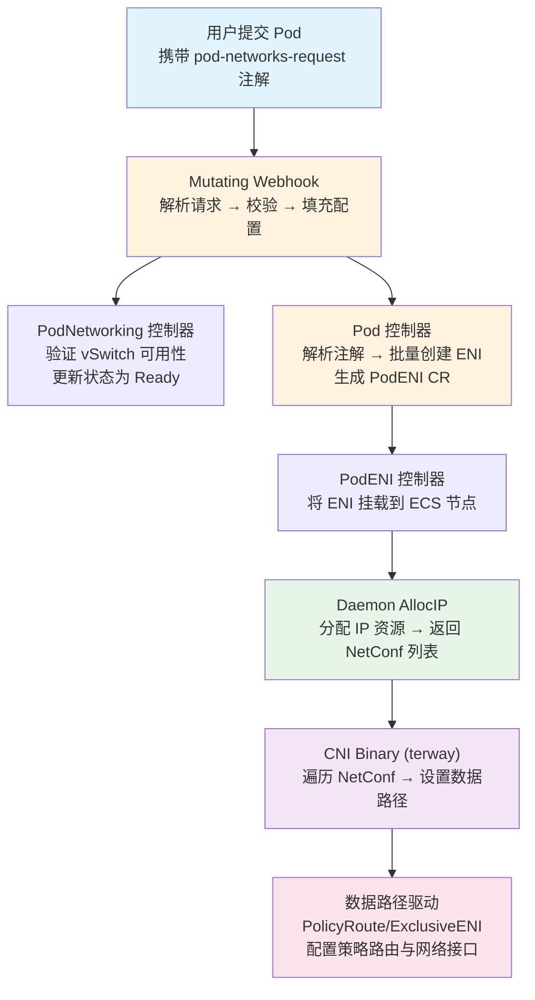

多网卡（Multi-Network）是 Terway 提供的高级网络能力，允许单个 Pod 同时挂载多个弹性网卡（ENI），每个网卡连接到不同的网络平面——即不同的 vSwitch 与安全组组合。这一机制使业务 Pod 能够同时接入多套网络拓扑，满足诸如**管控平面与数据平面隔离**、**多租户网络隔离**、**跨 VPC 互通**等复杂场景需求。本文将从架构原理、CRD 定义、控制平面处理流程、数据路径路由策略以及 E2E 验证体系五个维度，深入剖析多网卡的完整实现机制。

Sources: [multi-network.md](docs/multi-network.md#L1-L190), [types.go](pkg/apis/network.alibabacloud.com/v1beta1/types.go#L220-L308)

## 架构概览：从声明到落地的全链路

多网卡的实现横跨控制平面与数据平面，涉及 Webhook、CRD 控制器、Daemon 服务和 CNI Binary 四大组件的协作。其核心数据流如下：



**关键注解体系**：多网卡的入口是 Pod 注解 `k8s.aliyun.com/pod-networks-request`，其值为 JSON 数组，每个元素引用一个 `PodNetworking` 资源并指定接口名、默认路由和明细路由。Webhook 将此请求解析后，转化为内部注解 `k8s.aliyun.com/pod-networks`——这是控制平面和 Daemon 实际消费的标准化格式。两个注解**互斥**，不可同时出现在同一 Pod 上。

Sources: [k8s.go](types/k8s.go#L27-L66), [annotations.go](types/controlplane/annotations.go#L29-L67)

## CRD 定义与核心数据结构

### PodNetworking：网络平面的声明式抽象

`PodNetworking` 是集群级别的 CRD，定义了一个网络平面的完整拓扑参数。在多网卡场景中，每个 Pod 引用的网络平面对应一个独立的 `PodNetworking` 实例。

```yaml
apiVersion: network.alibabacloud.com/v1beta1
kind: PodNetworking
metadata:
  name: secondary-network
spec:
  allocationType:
    type: Elastic
  selector: {}           # 多网卡场景下不可配置 selector
  securityGroupIDs:
  - sg-secondary-xxxx
  vSwitchOptions:
  - vsw-secondary-a
  - vsw-secondary-b
  vSwitchSelectOptions:
    vSwitchSelectionPolicy: ordered
  eniOptions:
    eniType: Trunk        # 或 ENI（独占模式）
```

其 Go 类型定义中，`PodNetworkingSpec` 包含以下核心字段：

| 字段 | 类型 | 说明 |
|:-----|:-----|:-----|
| `ENIOptions.ENIAttachType` | `enum(Trunk\|ENI\|Default)` | ENI 挂载模式，多网卡仅支持 Trunk 或独占 ENI |
| `AllocationType` | `AllocationType` | IP 分配策略（Elastic/Fixed）及释放策略 |
| `Selector` | `Selector` | Pod/Namespace 标签选择器，**多网卡场景必须为空** |
| `SecurityGroupIDs` | `[]string` | 安全组列表，最多 10 个 |
| `VSwitchOptions` | `[]string` | 候选 vSwitch ID 列表，为"或"关系 |
| `VSwitchSelectOptions` | `VSwitchSelectOptions` | vSwitch 选择策略：`ordered`/`random`/`most` |

Sources: [types.go](pkg/apis/network.alibabacloud.com/v1beta1/types.go#L239-L308), [node_types.go](pkg/apis/network.alibabacloud.com/v1beta1/node_types.go#L42-L50)

### PodNetworkRef 与 PodNetworks：请求与内部表示

用户通过注解提交的多网卡请求被解析为 `PodNetworkRef` 结构，经 Webhook 转换为内部 `PodNetworks` 结构。两者之间的关系如下表所示：

| 字段 | `PodNetworkRef`（请求） | `PodNetworks`（内部） | 说明 |
|:-----|:-----------------------|:---------------------|:-----|
| 接口名 | `InterfaceName` | `Interface` | 容器内网卡名称，如 eth0、eth1 |
| 网络引用 | `Network`（PodNetworking 名称） | — | 请求阶段引用 CR 名称 |
| vSwitch/安全组 | — | `VSwitchOptions` / `SecurityGroupIDs` | Webhook 从 PodNetworking 填充 |
| 默认路由 | `DefaultRoute` | `DefaultRoute` | 仅一个接口可设为 true |
| 明细路由 | `Routes` | `ExtraRoutes` | 附加路由条目 |
| ENI 类型 | — | `ENIOptions` | 从 PodNetworking 继承 |
| IP 分配策略 | — | `AllocationType` | 从 PodNetworking 继承 |

Sources: [annotations.go](types/controlplane/annotations.go#L33-L38), [annotations_default.go](types/controlplane/annotations_default.go#L24-L36)

### Allocation：PodENI 中的多网卡分配记录

在控制平面完成 ENI 创建后，每个网络接口的分配信息以 `Allocation` 结构记录在 `PodENI` CR 中，构成多网卡的持久化状态：

```go
type Allocation struct {
    AllocationType AllocationType    // IP 分配策略
    ENI            ENI               // ENI 元数据（ID、MAC、vSwitch 等）
    IPv4           string            // 分配的 IPv4 地址
    IPv6           string            // 分配的 IPv6 地址
    IPv4CIDR       string            // vSwitch IPv4 CIDR
    IPv6CIDR       string            // vSwitch IPv6 CIDR
    Interface      string            // 容器内接口名（eth0、eth1...）
    DefaultRoute   bool              // 是否为默认路由出口
    ExtraRoutes    []Route           // 明细路由
    ExtraConfig    map[string]string // 扩展配置
}
```

Sources: [types.go](pkg/apis/network.alibabacloud.com/v1beta1/types.go#L73-L84)

## 控制平面处理流程

### 第一步：Mutating Webhook 注入与校验

Pod 创建请求首先经过 Mutating Webhook 的拦截处理。对于多网卡场景，Webhook 执行以下关键逻辑：

**1. 注解互斥性校验**：`PodNetworks`、`PodNetworksRequest`、`PodNetworking` 三个注解必须互斥，任意两个同时存在即拒绝请求。

**2. 请求解析与 PodNetworking 查询**：调用 `getPodNetworkRequests()` 函数，逐个解析 `PodNetworkRef` 中引用的 `PodNetworking` 资源，执行三项校验：
- PodNetworking 状态必须为 `Ready`
- PodNetworking 的 `Selector` 必须为空（多网卡场景不允许自动匹配）
- 所有引用的 PodNetworking 的 `ENIAttachType` 必须一致

**3. 可用区交集计算**：对所有 PodNetworking 的 vSwitch 可用区取交集，确保 Pod 能调度到同时满足所有网络平面的节点上。

**4. 资源请求注入**：调用 `setResourceRequest()` 将 Pod 的容器资源请求中注入对应的 ENI 资源（`aliyun/member-eni` 或 `aliyun/eni`），数量等于网络接口总数。

**5. 节点亲和性设置**：调用 `setNodeAffinityByZones()` 根据可用区交集和固定 IP 的历史可用区，设置 Pod 的 `nodeAffinity`，约束调度范围。

Sources: [mutating.go](pkg/controller/webhook/mutating.go#L69-L243), [mutating.go](pkg/controller/webhook/mutating.go#L467-L534)

### 第二步：Pod 控制器批量创建 ENI

Pod 控制器（`ReconcilePod`）在检测到 Pod 带有 `k8s.aliyun.com/pod-eni: "true"` 注解后，进入 CRD 模式的 ENI 管理流程。其 `parse()` 方法解析 `PodNetworks` 注解，对每个网络接口：

1. 从 `VSwitchOptions` 中根据可用区和选择策略选择一个 vSwitch
2. 构造 `Allocation` 结构，包含安全组、vSwitch、路由、ENI 类型等信息
3. 根据 `ENIAttachType` 设置 `Trunk` 选项

随后 `createENI()` 方法使用 `errgroup` **并发创建**所有 ENI，每个 ENI 调用阿里云 `CreateNetworkInterfaceV2` API，创建成功后生成 `NetworkInterface` CR 并写入集群。所有 ENI 的分配信息最终汇总到 `PodENI` CR 的 `Spec.Allocations` 数组中。

Sources: [pod_controller.go](pkg/controller/pod/pod_controller.go#L417-L516), [pod_controller.go](pkg/controller/pod/pod_controller.go#L573-L715), [pod_controller_default.go](pkg/controller/pod/pod_controller_default.go#L13-L82)

### 第三步：PodENI 控制器挂载 ENI

`ReconcilePodENI` 控制器监听 `PodENI` CR 的生命周期事件，负责将所有 ENI 挂载到目标 ECS 节点。对于多网卡场景，`PodENI.Spec.Allocations` 中包含多个 `Allocation` 条目，控制器逐一处理其挂载/卸载状态转换。

PodENI 的状态机遵循以下生命周期：

```
Initial → Binding → Bind（运行中）
                        ↓ (Pod 删除)
                    Detaching → Unbind → Deleting
```

Sources: [eni_controller.go](pkg/controller/pod-eni/eni_controller.go#L160-L192), [types.go](pkg/apis/network.alibabacloud.com/v1beta1/types.go#L114-L155)

### 第四步：PodNetworking 控制器维护网络平面状态

`ReconcilePodNetworking` 控制器负责验证每个 `PodNetworking` 中声明的 vSwitch 是否可用。它查询 vSwitchPool 获取每个 vSwitch 的可用区信息，将结果写入 `Status.VSwitches`，并将状态设为 `Ready` 或 `Fail`。只有状态为 `Ready` 的 PodNetworking 才能被多网卡请求引用。

Sources: [networking.go](pkg/controller/pod-networking/networking.go#L87-L139)

## 数据路径：策略路由与多接口隔离

### CNI 侧的多网卡感知

CNI Binary 在 `doCmdAdd()` 中通过 gRPC 调用 Daemon 的 `AllocIP` 接口获取 `NetConf` 列表。当返回的 `NetConf` 数量大于 1 时，`multiNetwork` 标志置为 `true`。CNI 随后**遍历所有 NetConf**，为每个网络接口独立执行数据路径设置。

`SetupConfig` 中的 `MultiNetwork` 字段是核心开关，它决定了数据路径驱动是否启用多网卡专用的路由策略：

Sources: [cni_linux.go](plugin/terway/cni_linux.go#L179-L267), [types.go](plugin/driver/types/types.go#L102-L145)

### 策略路由规则详解

`PolicyRoute` 数据路径驱动是多网卡场景的主力。当 `MultiNetwork=true` 时，它在容器网络命名空间和主机网络命名空间中分别设置不同的策略路由规则：

**容器侧（Container Namespace）**：

| 规则 | 优先级 | 匹配条件 | 路由表 | 说明 |
|:-----|:-------|:---------|:-------|:-----|
| `fromContainerRule` | 512 | `Src: <容器IP>` | `1000 + ENI LinkIndex` | 源地址匹配，将出站流量引导到对应路由表 |
| `ruleIf` | 512 | `OifName: <接口名>` | `1000 + ENI LinkIndex` | 出接口匹配，辅助确保流量从正确接口发出 |

每张独立路由表中包含一条**默认路由指向对应 ENI 的网关 IP**，而非主路由表的 `169.254.1.1`。

**主机侧（Host Namespace）**：

| 规则 | 优先级 | 匹配条件 | 路由表 | 说明 |
|:-----|:-------|:---------|:-------|:-----|
| `toContainerRule` | 512 | `Dst: <容器IP>` | `main` | 目的地址匹配，将入站流量通过 main 表路由到正确 veth |
| `fromContainerRule` | 2048 | `Src: <容器IP>` | `1000 + ENI LinkIndex` | 源地址匹配，将容器出站流量引导到 ENI 专属路由表 |

这种设计确保了：**从 eth1 接口进入容器的流量，其回包也从容器的 eth1 接口发出**，避免非对称路由。

Sources: [policy_router_linux.go](plugin/datapath/policy_router_linux.go#L26-L172), [policy_router_linux.go](plugin/datapath/policy_router_linux.go#L174-L246), [consts_linux.go](plugin/datapath/consts_linux.go#L11-L14), [utils_linux.go](plugin/driver/utils/utils_linux.go#L27-L30)

### 路由表 ID 分配策略

多网卡场景下的路由表 ID 由函数 `GetRouteTableID()` 计算，公式为 **`1000 + 网卡 LinkIndex`**。这一设计确保每张 ENI 拥有独立的路由表，避免不同网络平面的路由条目冲突。

### 默认路由与明细路由

在多网卡配置中，有且仅有一个网络接口可以设置 `defaultRoute: true`（通常为 eth0）。对于未设为默认路由的接口（如 eth1），用户可通过 `routes` 参数配置明细路由：

```json
[
  {"interfaceName":"eth0","network":"primary","defaultRoute": true},
  {"interfaceName":"eth1","network":"secondary","routes":[{"dst":"10.0.0.0/8"}]}
]
```

明细路由在容器内以普通路由条目的形式注入，支持带网关（`Scope: Universe`）和不带网关（`Scope: Link`）两种模式。

Sources: [policy_router_linux.go](plugin/datapath/policy_router_linux.go#L143-L159), [policy_router_linux.go](plugin/datapath/policy_router_linux.go#L44-L90)

## gRPC 通信协议的多网卡扩展

Daemon 与 CNI Binary 之间的 gRPC 协议通过 `NetConf` 消息的**重复字段**支持多网卡。`AllocIPReply` 和 `GetInfoReply` 中均包含 `repeated NetConf NetConfs` 字段：

```protobuf
message AllocIPReply {
  bool Success = 1;
  IPType IPType = 2;
  bool IPv4 = 3;
  bool IPv6 = 4;
  repeated NetConf NetConfs = 5;   // 每个网络接口一个 NetConf
}

message NetConf {
  BasicInfo BasicInfo = 1;
  ENIInfo ENIInfo = 2;
  Pod Pod = 3;
  string IfName = 4;              // 容器内接口名
  repeated Route ExtraRoutes = 5; // 明细路由
  bool DefaultRoute = 6;          // 是否为默认路由
}
```

Sources: [rpc.proto](rpc/rpc.proto#L30-L45)

## DevicePlugin 与资源调度

多网卡功能依赖 Kubernetes DevicePlugin 机制感知节点的 ENI 容量。Terway 注册两种 ENI 资源：

| 资源名称 | 说明 | 适用场景 |
|:---------|:-----|:---------|
| `aliyun/member-eni` | Trunk 模式下的 Member ENI 容量 | ECS 共享 ENI 节点 |
| `aliyun/eni` | 独占 ENI 容量 | ECS 独占 ENI 节点或灵骏节点 |

Webhook 在注入资源请求时，根据 Pod 引用的所有 PodNetworking 的 `ENIAttachType` 决定使用哪种资源名称，并将**请求值设为网络接口总数**。例如，一个双网卡 Pod（eth0 + eth1）将请求 `aliyun/member-eni: "2"`。

Sources: [eni.go](deviceplugin/eni.go#L24-L34), [mutating.go](pkg/controller/webhook/mutating.go#L373-L403)

## 使用限制与约束

| 约束项 | 说明 |
|:-------|:-----|
| **ENI 类型** | 仅支持 Trunk ENI 或独占 ENI，不支持灵骏节点 |
| **ENI 类型一致性** | 同一 Pod 引用的所有 PodNetworking 必须具有相同的 `eniType` |
| **Selector 禁用** | 多网卡场景下 PodNetworking 的 `selector` 字段必须为空 |
| **默认路由唯一性** | 有且仅有一个接口可设置 `defaultRoute: true` |
| **接口名长度** | 接口名长度必须 > 0 且 < 6 个字符 |
| **接口名唯一性** | 同一 Pod 内的接口名不可重复 |
| **安全组数量** | 每个 PodNetworking 最多 10 个安全组 |
| **可用区约束** | Pod 调度受限于所有引用的 PodNetworking 的 vSwitch 可用区交集 |
| **ACS 限制** | ACS 环境不支持 `defaultRoute` 和 `routes` 参数 |

Sources: [mutating.go](pkg/controller/webhook/mutating.go#L166-L197), [multi-network.md](docs/multi-network.md#L182-L189)

## 完整配置示例

以下示例展示一个双网卡 Pod 的完整配置流程——主网络平面（eth0）承载默认业务流量，辅助网络平面（eth1）连接到隔离网络用于管控通信：

```yaml
# 主网络平面
apiVersion: network.alibabacloud.com/v1beta1
kind: PodNetworking
metadata:
  name: primary-network
spec:
  allocationType:
    type: Elastic
  securityGroupIDs:
  - sg-bp1xxxxxxxxx
  vSwitchOptions:
  - vsw-bp1yyyyyyyyy
  - vsw-bp1zzzzzzzzz
  eniOptions:
    eniType: Trunk
---
# 辅助网络平面
apiVersion: network.alibabacloud.com/v1beta1
kind: PodNetworking
metadata:
  name: secondary-network
spec:
  allocationType:
    type: Elastic
  securityGroupIDs:
  - sg-bp2aaaaaaaaa
  vSwitchOptions:
  - vsw-bp2bbbbbbbbb
  eniOptions:
    eniType: Trunk        # 必须与主网络平面一致
---
# 双网卡 Pod
apiVersion: v1
kind: Pod
metadata:
  name: multi-network-app
  annotations:
    k8s.aliyun.com/pod-networks-request: |
      [
        {"interfaceName":"eth0","network":"primary-network","defaultRoute": true},
        {"interfaceName":"eth1","network":"secondary-network","routes":[{"dst":"172.16.0.0/12"}]}
      ]
spec:
  containers:
  - name: app
    image: nginx:latest
```

Sources: [multi-network.md](docs/multi-network.md#L131-L180)

## E2E 测试验证体系

多网卡功能拥有完整的 E2E 测试覆盖，核心测试用例定义在 `TestPodNetworking_MultiNetwork_Default` 中。测试框架支持两种 ENI 模式的矩阵化验证：

| 测试维度 | Trunk 模式 | 独占 ENI 模式 |
|:---------|:----------|:-------------|
| 默认配置 | ✅ `createMultiNetworkTest("Trunk", ENIOptionTypeTrunk)` | ✅ `createMultiNetworkTest("ExclusiveENI", ENIOptionTypeENI)` |
| 自定义 vSwitch/安全组 | ✅ | ✅ |
| 最低版本要求 | ≥ v1.16.1 | ≥ v1.16.1 |
| DaemonSet 要求 | `terway-eniip` | `terway-eniip` |
| 节点资源要求 | `aliyun/member-eni` | `aliyun/eni` |

每个测试用例验证三个关键阶段：**两个 PodNetworking 均达到 Ready 状态** → **Pod 成功运行** → **Pod 拥有 eth0 和 eth1 两个网络接口**（通过解析 `k8s.aliyun.com/pod-networks` 注解验证）。

Sources: [multi_network_test.go](tests/multi_network_test.go#L66-L265)

## 延伸阅读

- [网络模式全解析：VPC、ENI、ENI 多 IP 与 Trunk 模式](6-wang-luo-mo-shi-quan-jie-xi-vpc-eni-eni-duo-ip-yu-trunk-mo-shi) — 理解 Trunk 与独占 ENI 的底层差异
- [策略路由与网络连通性：Pod 间、Pod 与节点、跨节点通信原理](8-ce-lue-lu-you-yu-wang-luo-lian-tong-xing-pod-jian-pod-yu-jie-dian-kua-jie-dian-tong-xin-yuan-li) — 策略路由规则的完整技术解析
- [自定义资源定义（CRD）：PodENI、PodNetworking、Node、NetworkInterface](13-zi-ding-yi-zi-yuan-ding-yi-crd-podeni-podnetworking-node-networkinterface) — CRD 体系的全局视角
- [Webhook 机制：Pod 变更准入控制与校验逻辑](15-webhook-ji-zhi-pod-bian-geng-zhun-ru-kong-zhi-yu-xiao-yan-luo-ji) — Mutating/Validating Webhook 的设计哲学